# Beginner Javascript Notes

- [Module 1: The Basics](#module-1--the-basics)
  * [01 - Welcome](#01---welcome)
    + [House Keeping](#house-keeping)
      - [Starter Files](#starter-files)
        * [Slack Channel](#slack-channel)
        * [Structure of Starter files](#structure-of-starter-files)
      - [How to Do the Course](#how-to-do-the-course)
  * [02 - Browser, Editor and Terminal Setup](#02---browser--editor-and-terminal-setup)
    + [The browser](#the-browser)
      - [Shortcuts](#shortcuts)
    + [NodeJS](#nodejs)
      - [Checking if it's installed](#checking-if-it-s-installed)
      - [Which Terminal to Use](#which-terminal-to-use)
      - [Checking if you have npm installed](#checking-if-you-have-npm-installed)
    + [Command Line Basics](#command-line-basics)
    + [Check that Node is working](#check-that-node-is-working)
    + [Code Editor](#code-editor)
  * [03 - Running and Loading JS](#03---running-and-loading-js)
    + [Run scripts before closing body tag](#run-scripts-before-closing-body-tag)
    + [External JavaScript Files](#external-javascript-files)
    + [Running it in NodeJS](#running-it-in-nodejs)
  * [04 - Variables and Statements](#04---variables-and-statements)
    + [var](#var)
    + [let](#let)
    + [const](#const)
    + [Statements and Semi Colons Semi-Colons in JavaScript](#statements-and-semi-colons-semi-colons-in-javascript)
    + [Code Blocks](#code-blocks)
    + [Differences between var, let & const](#differences-between-var--let---const)
      - [Strict Mode](#strict-mode)
      - [Scoping](#scoping)
      - [Naming Conventions](#naming-conventions)
      - [Camel Casing](#camel-casing)
    + [Snake Case](#snake-case)
    + [Kebab Case - Not Allowed](#kebab-case---not-allowed)
  * [05 - Code Quality Tooling with Prettier and ESLint](#05---code-quality-tooling-with-prettier-and-eslint)
    + [ESLint & Prettier](#eslint---prettier)
      - [ESLint](#eslint)
      - [Prettier](#prettier)
    + [Installing ESLint & Prettier](#installing-eslint---prettier)
    + [Installing npm packages locally](#installing-npm-packages-locally)
    + [Creating the Package.json](#creating-the-packagejson)
  * [06 - Types - Introduction](#06---types---introduction)
  * [07 - Types - Strings](#07---types---strings)
    + [JavaScript Comments](#javascript-comments)
    + [Difference between Single Quotes, Double Quotes and Backticks](#difference-between-single-quotes--double-quotes-and-backticks)
      - [Putting String on Multiple Lines](#putting-string-on-multiple-lines)
    + [Concatenation and Interpolation](#concatenation-and-interpolation)
    + [Backticks](#backticks)
  * [08 - Types - Numbers](#08---types---numbers)
    + [Numbers in JavaScript](#numbers-in-javascript)
    + [Helper Methods](#helper-methods)
    + [Modulo and Power Operators](#modulo-and-power-operators)
    + [Things to know about Math in JavaScript](#things-to-know-about-math-in-javascript)
      - [Infinity and Negative Infinity](#infinity-and-negative-infinity)
      - [Not a Number](#not-a-number)
  * [09 - Types - Objects](#09---types---objects)
  * [10 - Types - Null and Undefined](#10---types---null-and-undefined)
    + [undefined](#undefined)
    + [null](#null)
  * [11 - Types - Booleans and Equality](#11---types---booleans-and-equality)
    + [Equality (equal sign, double equal sign, triple equal sign)](#equality--equal-sign--double-equal-sign--triple-equal-sign-)
- [Module 2: Functions](#module-2--functions)
  * [12 - Functions - Built in](#12---functions---built-in)
    + [Built-in Functions](#built-in-functions)
        * [Example #1 👇](#example--1---)
  * [13 - Functions - Custom](#13---functions---custom)
    + [Defining a Function](#defining-a-function)
    + [Returning Values](#returning-values)
    + [Storing a Value Returned from A Function](#storing-a-value-returned-from-a-function)
  * [14 - Functions - Parameters and Arguments](#14---functions---parameters-and-arguments)
    + [Another Example](#another-example)
    + [Even More Example](#even-more-example)
    + [How to Fall Back on Default for Only One Parameter](#how-to-fall-back-on-default-for-only-one-parameter)
  * [15 - Different Ways to Declare Functions](#15---different-ways-to-declare-functions)
      - [Anonymous Functions](#anonymous-functions)
      - [Function Expressions](#function-expressions)
      - [What is the difference between a function declaration and a function expression?](#what-is-the-difference-between-a-function-declaration-and-a-function-expression-)
        * [Hoisting](#hoisting)
    + [Arrow Functions](#arrow-functions)
    + [Different Ways to Write Arrow Functions](#different-ways-to-write-arrow-functions)
    + [Implicit and Explicit Returns](#implicit-and-explicit-returns)
    + [Arrow Function Gotcha's](#arrow-function-gotcha-s)
        * [Returning an object](#returning-an-object)
      - [IIFE](#iife)
    + [Methods](#methods)
    + [Preview of `this`](#preview-of--this-)
    + [Callback Functions](#callback-functions)
      - [Callback Example 1 - Click Callback](#callback-example-1---click-callback)
    + [Timer Callback](#timer-callback)
  * [16 - Debugging Tools](#16---debugging-tools)
    + [Console Debugging](#console-debugging)
  * [The Call Stack and Stack Trace](#the-call-stack-and-stack-trace)
  * [Grabbing Elements](#grabbing-elements)
  * [Breakpoints](#breakpoints)
- [Module 3: The Tricky Bits](#module-3--the-tricky-bits)
  * [17 - Scope](#17---scope)
    + [Global Variables](#global-variables)
    + [Function Scope](#function-scope)
    + [Block Scoping](#block-scoping)
    + [Lexical and Static Scoping](#lexical-and-static-scoping)
  * [18 - Hoisting](#18---hoisting)
    + [Hoisting Function Declarations](#hoisting-function-declarations)
    + [Variable Hoisting](#variable-hoisting)
  * [19 - Closures](#19---closures)
    + [Examples of Closures](#examples-of-closures)
    + [Private Variables](#private-variables)
- [Module 4: The DOM - Working with HTML and CSS](#module-4--the-dom---working-with-html-and-css)
  * [20 - The DOM - Introduction to the document](#20---the-dom---introduction-to-the-document)
    + [`window` Refresher](#-window--refresher)
    + [`document` Introduction](#-document--introduction)
    + [The `navigator`](#the--navigator-)
  * [21 - The DOM - Selecting Elements](#21---the-dom---selecting-elements)
    + [Where to Load Javascript When Selecting Elements](#where-to-load-javascript-when-selecting-elements)
    + [Selecting DOM Elements](#selecting-dom-elements)
      - [Searching Inside Already Selected Elements](#searching-inside-already-selected-elements)
  * [22 - The DOM - Element Properties and Methods](#22---the-dom---element-properties-and-methods)
    + [Getters and Setters](#getters-and-setters)
      - [`textContent` and `innerText`](#-textcontent--and--innertext-)
    + [Exercise](#exercise)
    + [`insertAdjacentText` and `insertAdjacentElement`](#-insertadjacenttext--and--insertadjacentelement-)
  * [23 - The DOM - Working with Classes](#23---the-dom---working-with-classes)
    + [Adding a class](#adding-a-class)
    + [Removing a class](#removing-a-class)
    + [Toggling a class](#toggling-a-class)
    + [The `contains` Method](#the--contains--method)
  * [24 - The DOM - Built in and Custom Data Attributes](#24---the-dom---built-in-and-custom-data-attributes)
    + [Data Attributes](#data-attributes)
  * [25 - The DOM - Creating HTML](#25---the-dom---creating-html)
    + [`append()`](#-append---)
    + [`insertAdjacentElement()`](#-insertadjacentelement---)
    + [Generating An Unordered List](#generating-an-unordered-list)
  * [26 - The DOM - HTML from Strings and XSS](#26---the-dom---html-from-strings-and-xss)
    + [`document.createRange()` and `document.createFragment()`](#-documentcreaterange----and--documentcreatefragment---)
    + [Security and Santization](#security-and-santization)
    + [XSS (Cross Site Scripting)](#xss--cross-site-scripting-)
  * [27 - The DOM - Traversing and Removing Nodes](#27---the-dom---traversing-and-removing-nodes)
    + [The difference between and node and an element](#the-difference-between-and-node-and-an-element)
    + [Properties to work with Nodes and Elements](#properties-to-work-with-nodes-and-elements)
    + [Removing Elements](#removing-elements)
  * [28 - The DOM - CARDIO](#28---the-dom---cardio)
    + [`closest()`](#-closest---)
- [Module 5: Events](#module-5--events)
  * [29 - Events - Event Listener](#29---events---event-listener)
    + [Removing an Event Listener](#removing-an-event-listener)
    + [Listening to events on multiple items](#listening-to-events-on-multiple-items)
    + [`forEach`](#-foreach-)
  * [30 - Events - targets, bubbling, propagation and capture.](#30---events---targets--bubbling--propagation-and-capture)
    + [Propagation](#propagation)
    + [`this`](#-this-)
  * [31 - Events - Prevent Default and Form Events](#31---events---prevent-default-and-form-events)
    + [preventDefault](#preventdefault)
    + [Other Types of Events with Form Inputs](#other-types-of-events-with-form-inputs)
  * [32 - Events - Accessibility Gotchas and Keyboard Codes](#32---events---accessibility-gotchas-and-keyboard-codes)
    + [Difference between Buttons and Links](#difference-between-buttons-and-links)
    + [Keyboard Accessibility](#keyboard-accessibility)
- [Module 6: Serious Practice Excercises](#module-6--serious-practice-excercises)
  * [33 - Etch-a-Sketch](#33---etch-a-sketch)
    + [Shaking / Clearing the Canvas](#shaking---clearing-the-canvas)
    + [`once`](#-once-)
  * [34 - Click Outside Modal](#34---click-outside-modal)
    + [`closest`](#-closest-)
  * [35 - Scroll Events and Intersection Observer](#35---scroll-events-and-intersection-observer)
    + [Intersection Observer](#intersection-observer)
  * [36 -Tabs](#36--tabs)
    + [Converting a NodeList to an Array](#converting-a-nodelist-to-an-array)
- [Module 7: Logic and Flow Control](#module-7--logic-and-flow-control)
  * [37 - BEDMAS](#37---bedmas)
  * [38 - Flow Control - If Statements, Function Returns, Turthy, Falsy](#38---flow-control---if-statements--function-returns--turthy--falsy)
    + [If Statements](#if-statements)
    + [Operators](#operators)
      - [Truthy or Falsy](#truthy-or-falsy)
    + [Truthy or Falsy values](#truthy-or-falsy-values)
  * [39 - Coercion, Ternaries and Conditional Abuse](#39---coercion--ternaries-and-conditional-abuse)
    + [Ternary](#ternary)
    + [Blockless If Statements](#blockless-if-statements)
  * [40 - Case Switch and Animating a Turtle with CSS Variables](#40---case-switch-and-animating-a-turtle-with-css-variables)
  * [41 - Intervals and Timers](#41---intervals-and-timers)
    + [Intervals](#intervals)
    + [Clearing Timeouts and Intervals](#clearing-timeouts-and-intervals)
- [Module 8: Data Types](#module-8--data-types)
  * [42 - Objects](#42---objects)
    + [Creating an Object](#creating-an-object)
    + [Accessing Properties](#accessing-properties)
    + [Deleting a Property from an Object](#deleting-a-property-from-an-object)
    + [Methods](#methods-1)
  * [43 - Object Reference vs Values](#43---object-reference-vs-values)
    + [Spread Operator](#spread-operator)
    + [Lodash](#lodash)
  * [44 - Maps](#44---maps)
      - [Set](#set)
    + [JSON](#json)
  * [45 - Arrays](#45---arrays)
    + [Array Methods](#array-methods)
  * [46 - Array Cardio - Static Methods](#46---array-cardio---static-methods)
      - [Object Static Methods](#object-static-methods)
  * [47 - Array Cardio - Instance Methods](#47---array-cardio---instance-methods)
    + [`join`](#-join-)
    + [`split`](#-split-)
    + [`pop`](#-pop-)
    + [`shit` and `unshift`](#-shit--and--unshift-)
  * [48 - Array Cardio - Callback Methods and Function Generation](#48---array-cardio---callback-methods-and-function-generation)
- [Module 9: Gettin' Loopy](#module-9--gettin--loopy)
  * [49 Looping and Iterating - Array .forEach](#49-looping-and-iterating---array-foreach)
  * [50 - Looping and Iterating - Mapping](#50---looping-and-iterating---mapping)
  * [51 - Looping and Iterating = Filter, Find and Higher Order Functions](#51---looping-and-iterating---filter--find-and-higher-order-functions)
  * [52 - Looping and Iterating - Reduce](#52---looping-and-iterating---reduce)
  * [53 - Looping and Iterating - Reduce Exercise](#53---looping-and-iterating---reduce-exercise)
    + [Regular Expression](#regular-expression)
  * [54 - Looping and Iterating - for, for in, for of, and while Loops](#54---looping-and-iterating---for--for-in--for-of--and-while-loops)
    + [The for loop](#the-for-loop)
      - [for of Loop](#for-of-loop)
    + [`for of` loop](#-for-of--loop)
    + [`for in` loop](#-for-in--loop)
    + [`while` and `do while` loops](#-while--and--do-while--loops)
- [Module 10: Harder Practice Exercises](#module-10--harder-practice-exercises)
  * [55 - Face Detection and Censorship](#55---face-detection-and-censorship)
  * [56 - Sarcastic Text Generator](#56---sarcastic-text-generator)
    + [The modulo operator](#the-modulo-operator)
  * [57 - Shopping Form with Custom Events, Delegation and localstorage](#57---shopping-form-with-custom-events--delegation-and-localstorage)
    + [`localStorage`](#-localstorage-)
    + [Event Delegation](#event-delegation)
  * [58 - Building a Gallery Exercise](#58---building-a-gallery-exercise)
    + [Closures](#closures)
      - [`tab-index`](#-tab-index-)
  * [59 - Building a Slider](#59---building-a-slider)
- [Module 11: Prototypes, `this`, `new` and Inheritance](#module-11--prototypes---this----new--and-inheritance)
  * [60 - The New Keyword](#60---the-new-keyword)
  * [61 -  The `this` keyword.](#61----the--this--keyword)
  * [62 - Prototype Refactor of Gallery Exercise](#62---prototype-refactor-of-gallery-exercise)
    + [`bind()`](#-bind---)
  * [63 - Prototypes and Prototypal Inheritance](#63---prototypes-and-prototypal-inheritance)
  * [64 - Prototype Refactor of the Slider Exercise](#64---prototype-refactor-of-the-slider-exercise)
  * [65 -  bind, call and apply](#65----bind--call-and-apply)
      - [`call` and `apply`](#-call--and--apply-)
        * [`call`](#-call-)
        * [`apply`](#-apply-)
- [Module 12: Advanced Flow Control](#module-12--advanced-flow-control)
  * [66 - The Event Loop and Callback Hell](#66---the-event-loop-and-callback-hell)
  * [67 - Promises](#67---promises)
    + [`.then()`](#-then---)
    + [`Promise.all()`](#-promiseall---)
    + [`Promise.race()`](#-promiserace---)
  * [68 - Promises - Error Handling](#68---promises---error-handling)
    + [`Promise.allSettled()`](#-promiseallsettled---)
  * [69 - Refactoring Callback Hell to Promise Land](#69---refactoring-callback-hell-to-promise-land)
  * [70 - Async/Await](#70---async-await)
  * [71 - Async Await Error Handling](#71---async-await-error-handling)
      - [Handling Errors with Higher Order Functions](#handling-errors-with-higher-order-functions)
  * [72 - Async Await Prompt UI](#72---async-await-prompt-ui)
      - [Running an Event Listener Only Once](#running-an-event-listener-only-once)
  * [73 - Async Typer UI - two ways](#73---async-typer-ui---two-ways)
- [Module 13: Ajax and Fetching Data](#module-13--ajax-and-fetching-data)
  * [74 - Ajax and APIs](#74---ajax-and-apis)
    + [What is an API?](#what-is-an-api-)
    + [JSON](#json-1)
    + [AJAX](#ajax)
      - [Public API list](#public-api-list)
  * [75 - CORS and Recipes](#75---cors-and-recipes)
    + [Query Parameters](#query-parameters)
    + [CORS](#cors)
      - [What is CORS?](#what-is-cors-)
    + [CORS policy](#cors-policy)
      - [Babel](#babel)
      - [Browserlist](#browserlist)
      - [Proxy](#proxy)
  * [76 - Dad Jokes](#76---dad-jokes)
    + [Headers](#headers)
    + [Getting a Random Index](#getting-a-random-index)
    + [Loading State & CSS Loader](#loading-state---css-loader)
  * [77 - Currency Converter](#77---currency-converter)
    + [Caching the Rates](#caching-the-rates)
    + [Converting](#converting)
    + [Hooking Up The UI](#hooking-up-the-ui)
      - [Input Event on a Form](#input-event-on-a-form)
      - [Wiring up Handlers](#wiring-up-handlers)
      - [Formatting Currency using Number Format API](#formatting-currency-using-number-format-api)
- [Module 14 - ES Modules and Structuring Larger Apps](#module-14---es-modules-and-structuring-larger-apps)
  * [78 - Modules](#78---modules)
    + [What are Modules?](#what-are-modules-)
    + [Use Cases](#use-cases)
    + [Modules in the Browser](#modules-in-the-browser)
      - [In the Past - Sharing JavaScript Code between Files](#in-the-past---sharing-javascript-code-between-files)
      - [In the Present - Sharing JavaScript Code between Files](#in-the-present---sharing-javascript-code-between-files)
    + [Setting up Server](#setting-up-server)
    + [Importing and Exporting Modules](#importing-and-exporting-modules)
    + [Things we need to know about Modules](#things-we-need-to-know-about-modules)
      - [Scope](#scope)
      - [Difference between Default and Named Exports](#difference-between-default-and-named-exports)
    + [Renaming Modules](#renaming-modules)
    + [More Ways to Import](#more-ways-to-import)
    + [Loading Javascript On Demand](#loading-javascript-on-demand)
    + [async](#async)
  * [79 - Currency Module Refactor](#79---currency-module-refactor)
    + [Bootstrap / App Init Functions](#bootstrap---app-init-functions)
  * [80 - Dad Jokes Modules Refactor](#80---dad-jokes-modules-refactor)
    + [Refactoring into Modules](#refactoring-into-modules)
    + [Fixing Refactoring Errors](#fixing-refactoring-errors)
      - [Recap](#recap)
  * [81 - Bundling and Building with Parcel](#81---bundling-and-building-with-parcel)
      - [Benefits of Bundlers](#benefits-of-bundlers)
    + [Bundler Options / Alternatives](#bundler-options---alternatives)
    + [Using Parcel](#using-parcel)
      - [Dad Jokes Module](#dad-jokes-module)
      - [Installing Parcel](#installing-parcel)
      - [Adding an NPM Script to package.json](#adding-an-npm-script-to-packagejson)
    + [Building with Parcel](#building-with-parcel)
  * [82 - using open source npm packages](#82---using-open-source-npm-packages)
    + [node-modules folder](#node-modules-folder)
    + [Using Third Party Packages](#using-third-party-packages)
    + [Third Party Node Modules](#third-party-node-modules)
      - [waait npm package](#waait-npm-package)
      - [faker npm package](#faker-npm-package)
      - [CommonJS Syntax vs ECMA Script Modules import](#commonjs-syntax-vs-ecma-script-modules-import)
      - [date-fns npm package](#date-fns-npm-package)
      - [axios npm package](#axios-npm-package)
      - [lodash npm package](#lodash-npm-package)
      - [await-to-js](#await-to-js)
  * [83 - Security](#83---security)
    + [JavaScript is public](#javascript-is-public)
    + [XSS and Sanitizing your Inputs](#xss-and-sanitizing-your-inputs)
      - [FarceBook](#farcebook)
      - [Image Event Hijacking](#image-event-hijacking)
      - [Sanitizing User Data with DOMPurify.](#sanitizing-user-data-with-dompurify)
      - [HTTPS Origin](#https-origin)
- [Module 15 - Final Round of Exercises](#module-15---final-round-of-exercises)
  * [84 - Web Speech Colours Game](#84---web-speech-colours-game)
    + [Web Speech](#web-speech)
    + [Colour Layout](#colour-layout)
      - [Combining Speech and Words](#combining-speech-and-words)
  * [85 - Audio Visualization](#85---audio-visualization)
      - [Audio](#audio)
    + [Time Data Visualization](#time-data-visualization)
      - [Frequency Visualization](#frequency-visualization)

---

# Module 1: The Basics

---

## 01 - Welcome

Welcome.

This course is all the stuff Wes wishes he had known over the last 10 years of him doing JavaScript. It is a big course but it does a good job of distilling the information down into the things you need to know, and making it easy and fun!

### House Keeping

This video is for housekeeping items that need to be addressed before we can get into writing code.

#### Starter Files

First one is the starter files for this can be found at www.beginnerjavascript.com. Click through to My Account and there will be a link to the starter files.

The starter files link will bring you over to github which has all of the starter files as well as all of the solutions for this course.

**Please star the beginner-JavaScript github repo to help Wes up!**

##### Slack Channel

There is also a link to the slack channel, where you can jump in and get help, maybe join up with a buddy and do a course together with someone.

##### Structure of Starter files

There are 3 folders in the `beginner-JavaScript` repo.

1.  `snippets`
2.  `playground`
3.  `exercises`

 1:02

The `snippets` folder that has some base HTML snippets in there with instructions on how to get them into your HTML editor (we will talk about the editor in the next video).

There is also a `/playground` folder, which has some HTML files Wes uses to explain concepts throughout the course. He will often provide a `-FINISHED.html` file, which will include what Wes has written in the video, whereas the file itself, Wes will either ask you to create it yourself or he will provide an empty state.

The `/exercises` folder contains all the proper, full blown exercises that we will be doing throughout the course.

Note: Sometimes the numbers of the exercise folders are going to be a little off from the video number is, so just make sure to line up the file with the name of the video, not necessarily the number.

#### How to Do the Course

Another thing is how should you do this course? Should you watch it, should you code, should you code while you watch?

About half the people prefer to watch it and then do it after, and the other half prefer to do it as they watch.

Try both methods and see what best works for you! You'll fall into whatever feels best for you pretty quickly.

Last thing is grab a buddy if you can.

Jump into the slack chatroom and see if there is anyone willing to do it with you, you can team up, or team up with someone in person. It's always better if there is someone to hold you accountable.

It's a long course, 28 hours long, you can jump around.

If you understand certain concepts, such as what functions or parameters are, feel free to skip those videos.

The whole idea is that it is reference-able.

We are not building a huge app here that be build on in every video, instead, every video pretty much stands on it's own and if we reference something from a previous video, Wes will mention it.

---

## 02 - Browser, Editor and Terminal Setup

Let's talk real quick about setup and the tools you need.

You can skip this video if you know the three things:

1.  Which browser you would like to use (as well as how to open the dev tools)
2.  You already have NodeJS and NPM installed.
3.  You have an editor that you like (such as VSCode).

If you already have those things in place, skip this video and move onto the next one. Wes will just be introducing all three of those and talking about his personal choices behind them.

### The browser

Let's get into the browser.

You can use Firefox, Chrome, any browser you like because we are just writing JavaScript.

The important thing here is that we will be using the developer tools. Both Firefox and Chrome have very good web developer tools. Wes will likely be using Chrome throughout the course.

Things you need to know how to do is open the dev tools.

You can just right click and select "Inspect Element", which will show you the DOM, and you can click over to the console.

#### Shortcuts

It's worth learning the shortcuts to quickly open up developer tools, inspect element and the console. That way you can really quickly open it.

To find the shortcuts, in Chrome you go to _View > Developer_ and then you can see the shortcuts.

In Firefox, you click on the hamburger menu and go to _Web Developer >_ and then you will see the shortcuts for Inspector and Web Console, which is the two we will be using.

### NodeJS

Next up, we need NodeJS. In order to install NodeJS, go to NodeJS.org and install the latest version.

 2:24

Don't pay attention to the version numbers, those will change depending on when you take the course. _The stuff that we are covering is not dependent on what version of node you use_.

We aren't writing NodeJS websites in this course, instead a lot of tooling, bundling, formatting etc uses NodeJS under the hood so we need to have that installed.

#### Checking if it's installed

How do you know if you have it installed or not?

You can go ahead and install it again and all that will do is update your NodeJS to the current version if you already had it installed.

Another way to check is to open up a terminal window.

#### Which Terminal to Use

You can use the built in terminal application which on a Mac you can find under _Applications > Utilities > Terminal_.

Wes is using a terminal called Hyper for his terminal. You can also use the terminal in VSCode.

You can use iTerm. They are all the same terminal at the end of the day.

If you want to know what theme Wes is using, you can go to https://wesbos.com/uses and that will give you the links to all of the different themes and things he is using.

On Windows, the terminal is called Command Prompt. You can access this by going to _Start > All Programs > Accessories > Command Prompt_. There is another terminal for Windows called Cmder.

How do you know once you have a terminal open?

You can go ahead and type `node - v` in the terminal and press enter.

That will let you know what version you have installed.

#### Checking if you have npm installed

You need to also check that you have NPM installed. You can do that using `npm -v`, which will tell you what version of NPM you have installed.

As long as you have something greater than 10 for node and 6 for npm, you should be fine.

Wes wants to avoid going down any rabbit holes regarding complex tooling and best ways to do things. You just need to have it installed and it will be working.

### Command Line Basics

Now we will do some command line basics in case you are not familiar with working in the command line.

There are a couple of commands you need to know in order to run our JavaScript and bundles.

Cmd Line Basics

`cd` - _this means change directory_
`ls -l` (mac) `dir` (windows) - _this will list out all of the files and directories under the current directory_
`pwd` - _print working directory will give you something like `/Users/wesbos/beginner-JavaScript/exercises`_
`cd ..` - _go up a level in the current directory_

(examples of the above commands visible in image below)👇
 6:03

In this example, Wes is in the `beginner-JavaScript` directory, and he uses the command `ls -l` to see what other directories he has nested inside his current directory.

He can use the `cd` command to change directories into the `/exercises` directory by typing in `cd exercises`.

_Note: If you want to learn how to customize your terminal, you can go to https://commandlinepoweruser.com to take a quick course of Wes' to get you up and running with a cool terminal that shows the prompt and current working directory like Wes' does. That is not part of this course, just for those who are curious._

Other things to know are going up a level in a directory.
You can do that using `cd ..`

That is all we need to know right now.

### Check that Node is working

If you want to see if your node is working, if you just type `node` that will give you a caret which will oad up a **REPL** which is a **read-eval-print loop**. That is essentially the console. You can do 1+1 and press enter and the console will evaluate that to 2.

Once you have run the `node command`, to get back to the terminal you have to press CTRL + C a few times.

Other helpful things are:

`cmd + k` or `cmd + r` (mac) or `ctrl + k` or `ctrl + r` (windows) -_ will clear out the console. (this works in Chrome dev tools console as well)_

### Code Editor

Finally we are on the topic of the editor.

Wes highly recommends you use VSCode because he thinks it's the best editor for writing JavaScript in.

You may have different opinions.

In terms of tooling, Wes feels that VSCode is the best.

We will be looking at some extensions to use to format JavaScript properly. Again if you want to know what theme Wes is using, refer to https://wesbos.com/uses.

---

## 03 - Running and Loading JS

Let's talk about how to actually run JavaScript.

There are a couple of ways we can run JavaScript:

- in the console
- in node
- via a script tag
- we can also have an external script.

We will talk about how we can actually run those.

The simplest is to open up your dev tools and go to your console.

If you want to run some JavaScript to see how it works, like here Wes has typed 1 + 1 and hit enter and the console returned 2.

 00:27

This right here is a JavaScript console and it's a nice way to quickly noodle on some JavaScript

To see how it works, just pop open a console. The neat thing is if you are on any websites, say https://github.com, the JavaScript that you type into your console runs on the actual page that is loaded and existing.

For example You can type the following to grab all the paragraphs from the github page that you are currently on. 👇

```js
document.querySelectorAll("p");
```

 1:08
_(Don't worry about what `document.querySelectorAll()` does, we will cover that in a future video)._

The code that runs in your dev tools console is running in the context of the page that is loaded in your browser tab.

The next way to do it is a script tag.

Go into the `/playground` folder and create a new file `running-js.html`.

_Wes has an Emmet extension so he is going to hit `!` and `Tab` to scaffold out some HTML for us._

In the body, we can have a script tag in which we will add `console.log('hey')`.

What that will do is when the HTML is loaded, it's going to say "OH! This is a script tag, I am changing languages from HTML over to JavaScript, and it will run any code inside of the opening and closing script tag as JavaScript.

If you go ahead and open the `running-js.html` file in the browser, and open the console, you will see that it says "hey".

 1:53

Don't sweat this too much, we will be explaining what `console.log()` and everything does shortly.

### Run scripts before closing body tag

One thing to keep in mind is that it's almost always worth running scripts just before the closing body tag.

So if we were to modify `running-js` to include a paragraph tag that says Hey right after the body tag,, and then we wanted to grab that paragraph via JavaScript, we could if our script is right located right before the closing body tag, like below: 👇

```html
<body>
  <p>Hey</p>
  <script>
    const p = document.querySelector("p");
    console.log(p);
  </script>
</body>
```


If you were to move the script tag above the paragraph (or move the paragraph below the script tag), and refresh the page, the console will show `null` because that means it found nothing.


In order for your script tag to access the elements on the page, the elements must first be on the page before you select them. If we try to select something that doesn't yet exist (because it gets created later), we won't have access to it.

For your own sanity, always put your JavaScript right below the closing body tag. (_We will talk about loading in future videos when we get a little bit more into the DOM)._

### External JavaScript Files

Another way we can do it is via an external JavaScript file.

Go into the playground and make an external JavaScript file, called `some.js`.
In that file, add the following code 👇

```js
console.log("I am in another file");
```

In the `running-js.html` file, remove the existing script block and instead add a script tag with a `src` attribute. (_You do not need a `type=` attribute until we hit **modules**._)

Inside of the `src=` attribute, you need to give it a relative path, like so 👇

```html
<script src="./some.js">
```

That works because the HTML file is in a folder where the sibling is `some.js`.

- `./` means in this folder. -`../` would mean go up a level.

In our case, it's in the same folder so `./some.js` is the relative path to our file.

Now if you run that, it will say in the console `I'm in another file`, and it will even show you where that JavaScript had been run. 👇


Again, if you were to put the script inside the HEAD, it will still work.


However, if you were to try to select some things on the page, such as the paragraph tag, you will get null.


Why? Because of the same reason --the script will run before the actual HTML is finished building on the page. Leave the script tag right before the closing body tag for the best performance and to save yourself future debugging headaches.

_(There are some options like the `async` and `defer` attributes you can add to your script tags that will delay the actual running of the JavaScript, and it will download it asynchronously and then run it once the HTML has been loaded, however that is a much more advance topic which we will get into once we discuss async. But first we will need to understand what does asynchronous mean, etc)_

Another thing you may have noticed is why is there a closing script tag if there is no content in between the opening and closing tag?

That is a quirk with the script tag. It cannot be self closed.

You also cannot add extra JavaScript between the script tag like so: 👇


That will not work.

You can have multiple script tags, if you like.

The only downside to that is that every single time that it hits one of those, it will go off and download and parse that for you.

When we hit modules, we will look at how we can bundle those multiple files into one. Or you can do something called code splitting, which is split them into multiple, smaller JavaScript files, and have them load on demand.

### Running it in NodeJS

One more is actually running it in NodeJS.

```js
console.log('I'm from node')
```

NodeJS is JavaScript that can run in the server.Instead of running JavaScript on a website, we run it on an actual machine (like many other programming languages do).

The way we do that is we open our terminal and `cd` into the playground directory.

You can run the script in node by entering the following in the terminal and hitting enter 👇

`node node-example.js`

That will run whatever code is in the script file, and once it's done, it will exit out of node and return you to the terminal.


That's the short of how to load JavaScript.

We will be using a mixture of running JavaScript in the console, in a script tag and in external JavaScript files.

---

## 04 - Variables and Statements

This video is going to teach you an introduction to variables.

**Variables** are a building block of JavaScript, and you can't use JavaScript without knowing variables.

We will cover what they are, what the different types of them are, what declaration means as well as what a statement is in JavaScript.

Go into the `/playground` folder and make a new file `variables.html`.

Use the HTML base snippet and add a script tag within the body.

To make sure everything is working, add a `console.log('hey');` within the script tag. _Wes will explain the use of the semi colon shortly_.

If you open up the `variables.html` file in the browser, you should see 'hey' in the console.


There are three different ways to make a variable, which in JavaScript we refer to as _declaring a variable_. They are:

1. `var`
2. `let`
3. `const`

### var

Let's start with `var`.

To make a variable you say `var` and then you make a name of the variable. You can use almost anything for a variable name _(we will discuss restrictions shortly)_

```JavaScript
var first = "wes";
```

What we have done there is created a new variable called `first` and we set it to a string of 'wes' _(we will discuss what a string is in a second)_.

Now, if you refresh the `variables.html` page, and type into the console `first`, you will see that we actually get the value that is inside of that variable.


You can also do it by doing a `console.log()` like so:

```html
<body>
<script>
  var first = 'wes';
  console.log(first);
</body>
```

### let

The second way to declare a variable is with `let`.

Below the declaration of the variable `first`, add 👇

```js
let age = 300;
```

If you refresh `variables.html`, and type in age, you will see 300 returned in the console.

### const

The third way is with `const`. Below the `age` variable, add the following: 👇

```
const cool = true;
```

That is what is called a constant variable.

The naming of these things aren't great. Const means constant, but it's still called a variable.

`var`, `let`, `const` are all different types of variables, and there is different ways to declare the variables and we will talk about the pros and cons to all of them in just a second.

### Statements and Semi Colons Semi-Colons in JavaScript

Before we do that, let's discuss the semi colon Wes is adding after each JavaScript line.


Semi-colons are used to terminate the line of JavaScript. Below is an example of what is referred to as a **statement** in JavaScript.

```js
var first = "wes";
```

**A statement** is an instruction to the computer, browser, the JavaScript interpreter to do something.

This can usually be summarized as a variable was being declared, a variable was being updated, a function was being called, something was logged to the console.

Anytime you want to do something in JavaScript, that is referred to as a statement.

When you are done your statement, you add a semi-colon to the end of the line.

```js
var first = "wes"; //variable declaration statement
let age = 300;
let cool = true;
console.log(first); //function call statement
```

### Code Blocks

One thing that we will run into in JavaScript is something called a **code block**.

For example, add the following line of code to `variables.html` and refresh the page

```js
if (age > 10) {
  console.log("you are old");
}
```

You should see the message "you are old" in the console.

The question is how come we _didn't_ put the semi-colons after each line like this 👇

```js
if (age > 10) {
  console.log("you are old");
}
```

That is because it's something that is referred to as a **code block**.

Code blocks are things that are bound by these curly brackets `{` and `}`.

Things like function definitions, if statements, loops do not need a semi-colon at the end because you aren't telling the computer to do something. In those instances, you are just running some code and telling the computer to do something inside of the block.

Throughout the course Wes will continue to mention why we do and do not use the semi-colon so you can get the hang of it.

It is possible to get away without writing semi-colons in JavaScript because there is something in JavaScript called _ASI_, which is **automatic semi-colon insertion** but we are not cover that because it's a much more advanced topic.

### Differences between var, let & const

Let's talk about the difference between the three types of variables.

Remove all the extra JavaScript code within `variables.html` except for:

```html
<script>
  var first = "wes";
  let age = 300;
  let cool = true;
</script>
```

`var` and `let` can be updated.

If you ever want to change what the value is of one of those variables, you can simply just change it.

For example, if you add the following line of JavaScript, refresh `variables.html` in the browser and type `first` in the console, you should see the value `westerhoff` returned.

```html
first = 'westerhoff';
</script>
```

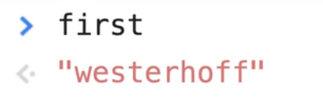

The same can be done with the age variable.

For example type in the console `age = 400`. That updates the value of the `age` variable.


You can either run the JavaScript from the `variables.html` page, or you can run them from the console. Because the variables in `variables.html` are **global variables** _(which we will cover in a future video)_, we can modify the either in the script tag within `variables.html` or directly from the console.

Notice that we do not have to redeclare the variable. We did _not_ have to do something like this:

```js
var first = "wes";
let age = 300;
let cool = true;

var first = "westernhoff";
```

That is actually a bad practice and in most cases, won't even work.

You only need to declare the variable with `var`, `let`, or `const`, and then whenever you want to update the value, you don't need to put the keyword in front of it, you can just go ahead and set it to it's new value.

You **cannot** set a const variable to be something else. If you were to go `cool = false`, you will see the following error: 👇


Errors in JavaScript will tell you what went wrong and where it went wrong. Here it says 👇

> Uncaught TypeError: Assignment to constant variable on Line 18.

That error is describing exactly what we did, which was we tried to change a variable that was set to a constant.

Constant variables cannot be changed, so think of them like an **API key** or something that you never want changed. You set those to a constant, and the value of that variable can never be changed.

It not not totally true that it can never be changed, which we will follow up when we hit arrays and objects _(meaning that there is a difference between the array or object that it is bound to and the values that live inside of it)_.

What we need to know right now is just that `var` and `let` variables can be changed or updated, and `const` variables cannot.

#### Strict Mode

The next thing you need to know about variables is this thing called **Strict Mode**.

_🔥Tip: While in your code editor, you can select a block of text and on your keyboard press `Command` + `/` to comment out your code. Commenting out code makes your browser skip that code. It'll still be there, but the browser will not run it._

If you put this code in the script tag, refresh `variables.html` and write dog in the console, the console will return the value of "snickers".

```html
<script>
  // var first = 'wes';
  // let age = 300;
  // let cool = true;

  // first = 'westerhoff';
  // cool = false;

  dog = "snickers";
</script>
```

We made a variable even though we did not `var`, `let`, or `const` it.

What is going on? How can that happen?

Now if we go to the top of our opening script tag, and add `use strict;` and then refresh the page, we will see the error

> dog is not defined


In the early days of JavaScript, it was possible to create a variable without first declaring it, and the browser would just add the var on behalf of the user.

That leads to bad code down the road, it's pretty sloppy and it's not something that you want to do. So what happened?

JavaScript still supports the old method of not declaring a variable because it has to be backwards compatible with early JavaScript code.

But they can introduce new modes into the browser like strict mode, which will throw an error if you try to do something like not declaring a variable properly.

```js
var dog = "hugo";
dog = "snickers";
```

First you are declaring the variable dog and then updating it with the value of snickers.

Another thing you can do is just declare a variable and then update it on the next line like so 👇

```js
var dog;
dog = "snickers";
```

That will work because what happens here is if you comment out the second line so it's just `var dog;` and refresh `variables.html`, when you type dog into the console you will have the value of "undefined" returned to you.


Strict mode is useful but we won't be typing it every time in this course because we are going to be following best practices and it is enforced by default when you are using **JavaScript modules**, and modules are probably how you are going to be writing all of your modern JavaScript.

#### Scoping

Now let's talk about the second difference between `var`, `let`, and `const`, which is scoping.

Clear your JavaScript code until it's back to the three variables we had at the beginning.

```js
var first = "wes";
let age = 300;
const cool = true;
```

Scoping in JavaScript answers the question "_Where are my variables available to me?_"

We are going to have an entire section of this course focused on scoping because it's such a fundamental part of JavaScript, but for now we need to know that:

- `var` variables are scoped differently than `let` and `const` variables.

- `var` variables are what we refer to as **function scoped variables** (they are only available within the parent function).

- `let` and `const` variables are what we refer to as **block scoped variables**.

What does this mean?!

We are going to learn what blocks and functions are in the future. Since we haven't covered that yet, just put that on pause temporarily until the functions and blocks video. We will continue on in the functions and block video about this.

The question is, what are we going to be using in this course?

They are all valid.

`let` and `const` were introduced as part of what is called es6, which is only a couple of years old. `var` has been around since JavaScript has been invented.

You may sometimes see people say `var` variables are old or deprecated, but they are not.

It's just that some developers (Wes included) prefer to use `let` and `const` because the block scoping makes more sense as well the benefit of assigning a constant value to these constants and not accidentally overwriting a variable which can lead to bugs.

Here is how Wes' approaches deciding which of the three to use:

- _He uses `const` by default._ Anytime he is assigning a new variable, he just defaults it to `const` because he doesn't know if he'll need to be updating that or not.
- _If he needs to change a value of a variable, he will use a `let`._ Sometimes he will make a variable `const` and then realize he needs to update it so he will make it a `let`.
- _Wes almost never uses a `var` variable._ There are some exceptions like when declaring a variable outside of a block but we will go into more detail about that shortly.

#### Naming Conventions

Last thing we need to talk about is **naming conventions**.

What can you call your variables?

As a convention, variables should _not_ start with a capital.

For example, the code bellow will work in the browser. It is not wrong or broken JavaScript, but it's convention that variables should not start with a capital unless they are a class _(we will get into what classes are in the future)_.

```js
const Dog = "bowser";
```

Variables must start with either an a-Z letter _(a,b,c,d etc)_. They can also start with or contain an underscore `_` or dollar sign `$`.

For example you could add the variable below and it would work. A variable like `$_$` would also work.

```js
const $$$$$$$$ = 100;
```

`$` and `_` are the only non a-Z characters that can be used inside of variables.

_Tip: the `_`is sort of synonymous with a library called lodash, and the`$ `is sort of synonymous with a library called jQuery so you don't normally make your variables called $ or _ because they have sort of been taken as a convention. You can however certainly include them if you want._

#### Camel Casing

Sometimes a variable is made up of two words, for example 👇

```js
const iLovePizza
```

This is referred to as **camel case**. With camel case, every word inside of your variable will contain an uppercase except for the first one, for the reasons we just talked about.

Upper camel case is where you do start it with a capital (_ILovePizza_), however that is almost never used in JavaScript unless you are defining a class.

### Snake Case

There is also something called **snake case**.

Instead of using capitals between words, you use underscores. For example `const this_is_snake_case = 'cool';`.

```js
//camel case
const iLovePizza = true;
// UpperCamelCase
const ILoveToEatHotDogs = false;
//snake case
const this_is_snake_case = "cool";
```

### Kebab Case - Not Allowed

There is also something called** kebab case**, for example `const this-is-kebab-case` but this is **not** allowed in JavaScript.

Most developers will always use camel case, UpperCamelCase if you are building a class, some people like underscores and kebab case is not allowed.

---

## 05 - Code Quality Tooling with Prettier and ESLint

Whether you are a solo developer looking to follow best practices or catch potential bugs, or you are a member of a team that has a specific way of writing JavaScript, there are many use cases for using code quality tooling.

There are two tools that are extremely helpful in code quality and formatting of your JavaScript:

1. ESLint
2. Prettier

Before we jump into those, let's start by looking at some code and opinions people have about formatting in JavaScript.


In the code above 👆, we are using single quotes `''` rather than double quotes `""`, , which is an opinion that people have. Some people prefer one over the other.

The fact that there is a space between the variable name and the equal sign is actually not necessary in `const p = document.querySelector('p;)`, that is an opinion that people have in their JavaScript. `const p=document.querySelector('p');` would work the same way.

Those are just two example of things that have the potential to cause issues in your code, or are formatting preference that people have opinions about.

The tools we mentioned earlier will help you fix those issues by either fixing it for you, or by alerting you if you are doing something that is a bad practice, or causes an accessibility issue, along with a whole lot of other things.

### ESLint & Prettier

I recommend that you go to https://eslint.org and go to the demo.

For Prettier, there is a link on the homepage that says "Try it".


We will cover:

- what they are
- how they work
- the steps you need to go through to install them

#### ESLint

**ESLint**, is a JavaScript linter tool for identifying and reporting potential issues in your JavaScript. Some examples may be bad practices or design patterns, or identifying unused variables in functions.

If you go to the ESLint demo, select the "Rules Configuration" section and choose the latest version of JavaScript.


If you type into the demo `const age = 300;`, you will see the following linting rule 👇

> 'age' is assigned a value but never used.


If we go ahead and use it by adding a line below of `console.log(age);`, we will get the following errors 👇

> 3:1 - Unexpected console statement
> 3:1 - 'console' is not defined.

One of the rules that are set in the demo version of ESLint is to not use `console.log()`, which is sometimes a production rule that developers use because you don't want to ship code to production that include console logs.

With ESLint, you can turn specific rules on or off. Wes will show us his own config shortly.

If you scroll down on the ESLint site, you will see a list of all of the rules that you can set using ESLint.

Sometimes are you are writing code, ESLint will throw an error and you might not know why it is being thrown. THankfully, ESLint provides a link to the documentation of the rule so you can read through and understand what it means.

Some other thing ESLint helps with is is broken or confusing scoping.

Let's say you add the following code 👇

```
function hi(){
  age = 300;
}
```

You should get the following errors: 👇

> 1:10 - 'hi' is defined but never used.
> 2:3 - 'age' is not defined.

If we add a `let` before the age variable, it will still complain that `hi` is defined but never used.

If we call `hi()` in our code, it just complains that age is assigned but never used.

ESLint is always giving you feedback on your code.

Initially, this can be very frustration because it tells you that all your code is wrong.

Over time, you will be able to modify your own config that fits your own coding style as well as wise up to why some of those things might be bad practices.

ESLint is also plug-able.

This means you can have many different plugins with it, there are many of them, for different styles of JavaScript, such as a React/Vue/Angular plugin.

That is a high level overview of what ESLint is. We will talk more about configuring it in just a second.

#### Prettier

The next tool that we have is Prettier.

Whereas ESLint will yell at you about things that are causing potential issues in your code, Prettier focuses entirely on just the formatting of your code.

Navigate to https://prettier.io/ and select the "Try me option" which should open up the playground.

Paste the following code in it 👇

```js
const age = 100;

alert("hey");
```

The output should give you:

```js
const age = 100;
alert("hey");
```


The input code is technically valid JavaScript, however it is messy and harder to read. Those are annoying things, things such as indentation.

Prettier will take in all of your code.

For example if you are mixing your quotes, using single quotes `'` sometimes and `"` double quotes at other times, Prettier will always just format the code to use one or the other, for consistencies sake, depending on the settings you have.

Prettier is pretty opinionated.

There are a few settings that we can toggle here or there, but mostly you just have to let it figure out how you want it to format you code.

You can use ESLint and Prettier separately.

What Wes likes to do is use ESLint and then use the Prettier plugin for ESLint. That way, all of his code goes through ESLint which will tell him what is wrong with his code, as well as any possible issues that ESLint can fix, including Prettier fixes, and then it will go ahead and fix those for us.

One bad thing about ESLint is after you install it, you can spent the rest of your life configuring it based on the hundreds of possible rules.

It is likely that the rules you want have already been chosen well by someone else, so often you just want to pick someone elses  settings that you already like.

That is exactly what Wes did for this course.

He made a config that is a set of ESLint rules, as well as the Prettier plugin which will do the formatting for you, all bundled into one so you can hit the ground running with that config.

As you start to develop your own opinions for what you like, you can sort of overwrite those ESLint rules one by one.

### Installing ESLint & Prettier

Let's get into installing Prettier and ESLint.

Go into the terminal, and use it to navigate to the `beginner-JavaScript` directory.

_Tip: If you don't know which directory you are currently in, enter `pwd` in the terminal and it return the directory that you are currently in._

There are a few things we need to do before we can get going.

We are going to follow the instructions located at https://github.com/wesbos/eslint-config-wesbos.

You can install this globally or per project.

What Wes does is he usually installs it globally so that all the projects he works on are covered, and then for each individual project that is more than a demo, he installs it locally.

 10:10

### Installing npm packages locally

We will be installing it locally per project, because that is the way you probably should do it for all of your projects.

If you don't already have your `package.json`, create one running the command `npm init` by typing into the terminal `npm init`.

We will be talking about npm later in this course, but essentially npm allows us to download what are called **dependencies**, which is other people's JavaScript packages that allow us to do things. We need other people's JavaScript packages for this lesson, specifically we need ESLint, we need Prettier, and we need Wes' config.

### Creating the Package.json

In order for that to work, we need what is called a `package.json` file which is going to hold a list of all of the other things in JavaScript that we need.

To create the `package.json`, you simply just type `npm init` in the terminal and press enter.

You will now be prompted to enter a package name, description, keywords etc but you can just press enter to skip setting those values for now.

 9:04

Then we need to go ahead and install all of our dependencies for this thing.

Go ahead and copy the line of code in step 2 of instructions to install per project.

```jsx
npx install-peerdeps --dev eslint-config-wesbos
```

After about a minute or so, it will go ahead and install all of your files.


If you take a look at your file system, you will see that there is this new folder called `node_modules/` and inside there are a whole bunch of dependencies.

We're not going to get into what that is just yet, that will be coming in our modules lesson. For now, all we need to know is it contains all of the JavaScript that makes ESLint and PRettier run.

Next we need to make a new file within the `beginner-JavaScript` folder, called `.eslintrc`. This is what is called a **dot file**.

Sometimes your computer will hide dot files from you because they are typically just files that developers use under the hood. Since we are developers, we do not want to hide those files.

If you have trouble seeing that file in your file system, do a quick google of "Showing hidden files Mac" or "show hidden files Windows" and it will show you how to flip that on.

Inside of your `.eslintrc` file, copy the following:

```json
{
  "extends": ["wesbos"]
}
```


We are going to extend "wesbos", which means we are going to extend all the settings and plugins that Wes has packed into his own config. That is really all we need right now.

Next, what we need is to get it running with VSCode.

Scroll down in Wes' instructions to the **With VS Code** section.


First thing you need to do is install the ESLint package for VSCode.

`Ctrl` + `Shift` + `X` will get you to the list of extensions in VSCode.

You want to search ESLint, and you will see a whole bunch of different ones, but the one you want is just called ESLint. You'll know it's the right one because it has billions (just kidding, millions) of installs.

Go ahead and click the install button.

Now what we need to do is setup some VSCode settings. Within VSCode, in the right hand corner, navigate to _Code > Preferences > Settings_.

If you're on Windows, that would be _File > Preferences > Settings_ and then you should see one called Settings.


That should open up the settings section in VS Code like so 👇


What you want to do is click on the curly brackets in the top right hand corner 👇
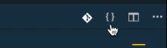

That will open up the text based version of your settings.


Simply just copy all of the settings from **Step #2 of the "With VS Code"** instructions found on Wes' config file (https://github.com/wesbos/eslint-config-wesbos).

Go to the very end of the `settings.json file` in VSCode, and after the last value, add a comma and then paste in the settings we just copied.


Let's go through the settings really quickly.

`editor.formatOnSave:true`: turns on the format on save.

```js
"[JavaScript]": {
  "editor.formatOnSave":false
}
```

The setting above 👆 is responsible for turning off formatting on save for JavaScript.

The setting below is responsible for telling the ESLint plugin to run on save. 👇

```json
"eslint.autoFixOnSave":true
```

You need to do that to prevent other built-in plugins from VSCode from clashing with our ESLint plugin.

The built-in plugin in VSCode for formatting is called **Beautifier** and it doesn't do as good of a job as ESLint and Prettier, so what the settings are doing is turning off the editor format on save for JavaScript and for javascriptreact and using the ESLint fix on save instead.

Finally, this is important: if you already have a prettier extension enabled, you want to disable it for JavaScript and javascriptreact using the following setting 👇

```json
"prettier.disableLanguages": ["JavaScript", "javascriptreact"],
```

Why? Because we are not using Prettier directly through the Prettier plugin. We are using Prettier through the ESLint plugin.

This stuff can get confusing and be a real bummer, so if you get stuck or have trouble, watch the video again and check out Wes' troubleshooting tips in Wes' config file instructions.

To check if Prettier is working, you can open a JavaScript file in VSCode, add some add extra whitespace between variables and equal signs and then save the file.

If it isn't working, you can click on ESLint in the bottom corner and it will often tell you what the issues are with it actually running.


Another thing you will notice with ESLint is these squiggly underlines in VSCode👇


That is actually ESLint telling giving you information about a warning or error it is throwing.

ESLint won't automatically fix these problems for us on save, it just explains what the issue is and then it's up to you to make a decision on how to solve it.

If you modified the code to be `let age = 100;` ESLint will give you a warning saying you used a let but never modified the value, maybe you wanted to use a const instead.

If you modify the code to be `const age = 100;`, the underline under the age variable will be yellow and the warning will say `

> 'age' is assigned a value but never used. eslint(no-unused-vars)


Red squiggles represent an error and yellow is just a warning is an error, and yellow is just a warning.

We will be using that a lot during this course.

If throughout the course there is a setting you really don't like, you can go ahead and modify the `.eslintrc` file to disable that rule.

That works by creating a `rules` property like so 👇

```json
{
  "extends": ["wesbos"],
  "rules": {
    "no-console": 2,
    "prettier/prettier": [
      "error",
      {
        "trailingComma": "es5",
        "singleQuote": true,
        "printWidth": 120,
        "tabWidth": 8
      }
    ]
  }
}
```

You can set rules to:

- 2 if you want them to error
- 1 if you want them to warn
- 0 if you want to ignore that rule entirely

If you get stuck, try for about 20 minutes and if you are still stuck, jump into the Slack chatroom and ask for help.

---

## 06 - Types - Introduction

So far, we have just been assigning values to variables, such as numbers, text, true or false. What are all those things, and what are all of the different possible options that we have? These are referred to in JavaScript as **Types**.

Anytime that you have a value (a value is something that can be stuck inside of a variable, or passed to a function), it will fall into 1 of the 7 JavaScript types.

The types in JavaScript can be remembered using the word `SNOB'N'US` (just kidding, that is pretty hard to remember).

The 7 Different Types in JavaScript are:

1. **String** - _a string is anytime that you have some text (you will often see that in a single or double quote or a backtick)_
2. **Number** - _a number (regardless of whether it has a decimal place in it. Some programming languages have multiple types to deal with numbers, but JavaScript only has the one.)_
3. **Object** - _This is a special one, we will go over this one last. Everything in JavaScript is an object, and we will understand what that is when we start to hit methods. Everything that we use like functions, dates, and arrays are just objects at the end of the day. All the other types except for object are referred to as the "primitive types"._
4. **Boolean** - _true or false_
5. **Null** - _can be used to set a variable to nothing (we will discuss difference between undefined and null shortly)_
6. **Undefined** - _can be used to set a variable to nothing (we will discuss difference between undefined and null shortly)_
7. **Symbol** - _this is a new one to JavaScript, and it will always give us a guaranteed unique identifier. This is useful for when you are trying to come with a unique identifier inside of an object and you want to make sure you are not also overwriting something that already exists with that id._

---

## 07 - Types - Strings

Create a new file called `types.html` and we will use our HTML base snippet.

Add the following code 👇

```html
<!DOCTYPE html>
<html lang="en">
  <head>
    <meta charset="UTF-8" />
    <meta name="viewport" content="width=device-width,initial-scale=1.0" />
    <title></title>
    <link rel="stylesheet" href="../base.css" />
  </head>

  <body>
    <script src="./types.js"></script>
  </body>
</html>
```

Create a new file `types.js`.

Add a console log such as `console.log('it works')` and save the file.

Once you have done that, open the `types.html` page in a browser and take a look at the console to test that it works.

Strings are used for holding text. THere are three different ways to create strings in JavaScript:

1.  Single Quotes `'text'`
2.  Double Quotes `"text"`
3.  Backticks `` `text` ``

Add the following to your `types.js` file 👇

```js
const name = "wes";
const middle = "topher";
const last = `bos`;
```

When you save the file, you might notice that our double quotes were replaced with single quotes because of our ESLint rules.

### JavaScript Comments

We want to disable that, which you can do by adding a comment.

This is a different kind of comment than this style `//comment` which Wes' has already showed us. The two forward slashes comments out the entire line.
You can also put a double slash comment at the end of a line.

A `/*` comment will open up what is called a **block comment**. You can close the block comment anywhere you wish to close it (it can be multiple lines).

To disable the ESLint rule, we will use a block comment even though the comment only spans one line, because that is what ESLint is looking for.

On the first line of `type.js` add the following block comment 👇

```js
/* eslint-disable */
```

Next take the value of `'topher'` in the `middle` variable and put the double quotes back around `"topher"` and save the file.

The double quotes should remain because we have disable ESLint for the entire file. _(It is possible to disable ESLint for just one line.)_

For Wes' Prettier settings, he usually sticks with single quotes or backticks. He has been considering switching to just using backticks entirely.

### Difference between Single Quotes, Double Quotes and Backticks

What is the difference between single quotes, double quotes and backticks?

Single quotes and double quotes are exactly the same thing.

The only reason that we have them both is because if you were having a sentence like `const sentence = 'she's so cool';`, it would break your JavaScript because the JavaScript interprets the apostrophe as closing the string.

If you were to make that change, save the file and then refresh `type.html`, you will see an error that says

> Unexpected identifier


In that case, there are a few things we can do.

First, we can do something called **escaping**. Escaping in JavaScript allows you to tell JavaScript "No, I actually want this character, don't interpret it as JavaScript syntax, interpret it as text.

Escaping is done with a backslash.

For example, change that line of code to be `const sentence = 'she\'s so cool';` and refresh the page. This can get annoying. Another challenge is what if you actually want a back slash in your text? You would have to escape it like so 👇

```js
'she\'s so cool \\';

```

The other better option is to just use double quotes instead, so the apostrophe doesn't get interpreted as the end of the string.

Another bummer is sometimes you want to use both, for example let's say you wanted text that said 👇

```
"she's so "cool""
```

You would have to escape the double quotes like so 👇

```js
"she's so \"cool\"";

```

The third option is using backticks. With backticks, you could simply do 👇

```js
`she's so "cool"`;
```

The only downside to this approach is if you needed a backtick in your string, you would need to escape it like so 👇

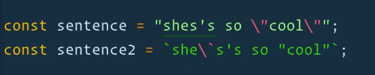

That is one of the benefits to using backticks.

#### Putting String on Multiple Lines

The next thing is putting strings on multiple lines.

Let's say you wanted to add the following song as multiple lines of text 👇

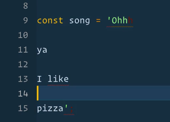

You can see that the editor is complaining about the string not being closed properly. How do you do multi-line strings?

If you want to, you have to put a forward slash at the end of every single line, and that will allow you to put a string on multiple lines.


The benefit to using backticks is you can have multi-line strings and they maintain the line breaks inside of them.


Sometimes the console will return the value like `"Ohhh↵↵ya↵↵I like↵pizza"`. Those arrows indicate a new line.

Backticks will be extremely helpful when we want to make HTML.

For example, using backticks allows you to do something like this 👇

```js
const html = `
  <div>
  <h2></h2>
  </div>
`;
```

### Concatenation and Interpolation

Before backticks were introduced, the only thing you could use to achieve that is **concatenation**.

Another benefit of backticks is interpolation and concatenation. Let's define those.

**Concatenation** _is when two or more strings are combined into one_.
**Interpolation** _is when you put a variable inside of a string_.

In `type.js` add 👇

```js
const hello = "hello my name is. Nice to meet you";
```

Let's say we wanted to add our name to the end of the "hello my name is." sentence.

Previously, with single and double quotes, what you have to do is close the quote, put a plus _(which is concatenation)_, and then you put your variable, and then another plus like so 👇

```js
const hello = "hello my name is" + name + ". Nice to meet you.";
```

That is one way of interpolation (using concatenation). _You could do the same thing with single quotes, like mentioned previously, there is no difference between the two types of quotes_

Here is yet another way to do this 👇

```js
let hello2 = "hello my name is ";
hello2 = hello2 + name;
hello2 = hello2 + " Nice to meet you";
```

That is just annoying, because we are just overwriting the variable each time _(we are overwriting it with the value of the variable, plus an addition)._

Both approaches to interpolation are not the greatest.

The `+` sign does two things in JavaScript.

If you use it with a string, it is used for concatenation. But it is also used to add numbers like so 👇

```js
1 + 1 = 2;
```

But if you do `"1" + "1"`, it will evaluate t `"11"`.

If you do `"1" + 1`, it will evaluate to `"11"`.


That is ripe for bugs, so that is where backticks come in with a much nicer solution.

### Backticks

With backticks, you can interpolate the string like so 👇

```js
const hello = `hello my name is ${wes}. Nice to meet you`;
```

The `${}` syntax can only ever be used in backticks. It is the easiest way to pop a variable into a string.

Almost anything can go between the curly brackets (`{}`) in that syntax. For example, you can do math. 👇

```js
const hello = `hello my name is ${name}. Nice to meet you. I am ${1+100} years old';
```

JavaScript will run whatever is inside of the curly brackets in that syntax (whether it is a variable or an actual statement) and it will return the value that's inside of it.

To reiterate: you can do multiple lines with **backticks**, **variable interpolation**, and then there is something a little more advanced that is called a **tagged template literal**, but we are not going to get into that because we haven't got into functions just yet.

Finally, this will be very helpful for creating HTML.

We can do something like:

```js
const html = `
  <div>
    <h2>${name}</h2>
    <p>${hello}</p>
  </div>
`;
```

Now we have all of this html that we have made, and if you add a `console.log(html);` and reload `type.html`, you will see 👇


We can actually do something like this with the html we just created (we will discuss what this means in future videos).

Add the following code below the html variable:

```js
document.body.innerHTML = html;
```

When you refresh `types.html` you should see something like the following 👇


We have just made some HTML! If you inspect the html, you will see it's regular html.

---

## 08 - Types - Numbers

There is only one type of number in JavaScript, which is simply number.

Comment out all the code in `types.js` and add the following 👇

```js
const age = 100;
const name = "wes";
```

Open `types.html` in the browser and then open the console and type `typeof age` and hit enter. The console should return to you "number".


**typeof** is a keyword in JavaScript that allows you to check the type of a value.

You use it by writing `typeof` followed by a space and a variable or value. That will tell you whether it's a number, a string, or any of the other types.

### Numbers in JavaScript

Numbers in JavaScript are pretty simple.

You can create an integer, which is a whole number (100), or you can create a float which is a number that has a decimal (100.5).

Both are used in the same type of number.

There is multiplication division addition and subtraction available to us.

Add the following code to `types.js` and refresh the html page in the browser.

```js
const a = 20;
const b = 10;
```

You can perform the following calculations in the browser👇


The only thing to be aware of is when you are mixing types.

If you try to do math with a string type for example, you start getting into **concatenation**.

That is what we refer to in JavaScript as _"the plus sign is loaded"_ meaning the plus sign can be used with numbers to add, with strings to concatenate, and then there is a lot of room to run into bugs.

If you try to do math with strings, it will convert them for you if you are doing subtraction, division or multiplication, but **not** for addition.

Whenever we are doing math, we need to make sure we are dealing with true numbers and not mixing types.


Along with numbers we also have what we call **helper methods**.

If you go into the browser console and type `Math.`, you will see a lot of built in helper methods.


### Helper Methods

There are four you are most likely to use.

1. `Math.round()`
2. `Math.floor()`
3. `Math.ceil()`
4. `Math.random()`

Let's go through each one, starting with **`Math.round()`**.

To use `Math.round()`, you pass a value in between the parenthesis `()`_(that is referred to as **passing a value**, which we will go over in a future video)_. It will return to you the number that was passed, rounded up or down depending on the number.


There is also **`Math.floor()`** which will give you the lower end of that number.


We have **`Math.ceil()`** and that will give you the upper number.


Then there is **`Math.random()`** which will give you a random number every time between 0 and 1 _(in a future video we will go over how to get a random number between 1 and 10)_.


### Modulo and Power Operators

Along with multiplication, division, subtraction and addition, we have two more operators which are called the **modulo** and the **power**.

Let's use the example here where you have a box of 20 Smarties (a Canadian candy), that you need to split up between your 3 kids.

```js
const smarties = 20;
const kids = 3;
const eachKidGets = smarties / kids;
console.log($`Each kid gets ${eachKidGets}`);
```

In the console, that evaluates to Each kid gets 6.66666666667 👇


That is obviously not going to work because you aren't going to split a smartie into a 0.6666.

Instead, what we can do is specify that it is a whole number of smarties that we need and we can't round up because we don't have extra smarties so that is one instance in which we can use `Math.floor()`.

Modify the code to use the following instead 👇

```js
const eachKidGets = Math.floor(smarties / kids);
```

Now in the console you should see that each kid gets six.


Now how many smarties do we have left over?

When you can no longer evenly distribute them, there will be some left over (for dad!). How can you figure that out?

You can use the Modulo operator to tell how many are left after they have bene evenly split up.

In the console type the following, and you should see the value 2 returned. 👇

```js
smarties % kids;
```

and you should see the value `2` returned. 👇


After the smarties have been evenly distributed between the kids, there are 2 smarties left over. The **modulo** operator `%` will tell you how many are left after you evenly divide them.

Add the following to `types.js`👇

```js
const dadGets = smarties % kids;
```

Another example would be there are 10 smarties and 3 kids. If you divide the smarties evenly, there will be one left over.

```js
10 % 3 = 1;
```

### Things to know about Math in JavaScript

Other things you need to know about math in JavaScript is that if you do `0.1 + 0.2` in the console, it will return 0.30000000004.


When people who are learning JavaScript encounter this, they often think that JavaScript is buggy.

Wes suggests trying the following in the browser console: 👇

```js
window.location = `https://${0.1 + 0.2}.com`;
```

That will take you to the following website, that will explain why this occurs in JavaScript.


This happens in almost every programming language, and that's just the reality of working with floating point numbers on computers.

One takeaway is that if you are ever working with money, don't store it in dollars and cents.

For example don't do this: 👇

```js
const price = 10.34;
```

That is because if someone gives you a 20 dollar bill, yo can run into issues with the long rounded number and you have a half cent left over you aren't sure what to do with. That is ripe for bugs.

What Wes does is he stores all of his prices in cents, so he is always working with whole numbers and doesn't have to deal with fractions. When he needs to display the price, just divide it by 0 and round the cents _(we will look at examples of displaying money soon)_.

#### Infinity and Negative Infinity

Another thing you should know is JavaScript also has infinity and negative infinity. At the end of the day, there is a max that computers can calculate with numbers. If you try to calculate something that is too high, it will return to you infinity or negative infinity.

We will go over an example.

If you do `10 **`, the double `**` actually means _"to the power of"_. So `10 ** 2` returns 100 and `1000 ** 2` returns 1000000 .


Negative infinity is also a number. Wes has never run into this in his programming, unless you have goofed something up.


#### Not a Number

Another thing to know is `NaN`. NaN means "not a number".

If you try to do something like below, it would return NaN 👇

```js
10 / "dog";
```


**NaN** is a type of "number", which is confusing since it means not a number.


That is something you will run into if you try to do math with something that is not a number. Instead of erroring out, it will just return NaN.

---

## 09 - Types - Objects

**Objects** in JavaScript are the biggest building block and everything in JavaScript is an object.

Objects are used for collections of data or collections of functionality.

We will be going through objects in depth in this course, there is an entire section dedicated to them and we will be using objects throughout all of our examples.

For now, you need to know that when something is an object in JavaScript, it's because we want to group things together.

Up to now, we have been using random variables like `const name = 'wes'` or `const age = 100;`. That is not the best way to do things, because the values are not associated.

What we can do instead is create an object called person.

We will create it using two curly brackets and a semi colon. That is the most common way to make an object, but there are other ways that we will go over.

```js
const person = {};
```

Inside of the person object, you have what are called properties and values. Add the following to `types.js` 👇

```js
const person = {
  first: "wes",
  last: "bos",
  age: 100,
};
```

What we have done here is created an object that allows us to group together variables. In the example above we have first, last and age variables all contained within an object for a collection that is a "person".

In the console, if you type person it will return the value, which is the object. If you check the type of the person variable, it will return the object type.


You can expand the object in the console to see it like so 👇


You may notice that the object properties are in a different order then we put them in within `types.js`. We will go over that after. The short and skinny is that **order doesn't matter in an object. If you need order to matter, use an array.**

To access the properties, there is a couple of different ways we can do it.


We are using the **dot notation** in the examples above.

When we get deeper into objects in the future, we will go over the other ways to do it as well as things like nesting objects and object vs reference and copying objects.

The last type we need to talk is the last type, which is **Symbols**.

What you need to know about it right now is that it is a way to do unique properties (or unique identifiers in general in JavaScript).

There is more to it, but it's complex and typically used by more advanced users (Wes barely ever uses them) so that is all we nede to know for now.

---

## 10 - Types - Null and Undefined

There are two ways to sort of express nothing in JavaScript, and that is with **undefined** and **null**.

### undefined

If you create a variable and don't set anything to it, it will be undefined. 👇

```js
let dog;
console.log(dog);
```


**undefined** is something that has been created (a variable), but has not yet been defined.

The same thing goes for properties on an object. If you type in the console `person.dog` it will return undefined.

Why? Because there is nothing there. That is what undefined is.

It comes about when you try to access a variable that has been created but not set.

If you typed in the console `wes`, you would see an error message returned that said 'wes is not defined' which means that he has never created a variable called wes.

With the dog example we used above, we have created the variable but we have not set a value. That is the difference.

### null

Now we will discuss the **null** type.

Null is a value of nothing, whereas undefined is a variable that has not yet had a value set to it.

We will go over some examples to demonstrate.

In `types.js` add the following 👇

```js
let somethingUndefined;
const somethingNull = null;
```

_NOTE: you cannot use a const variable without setting a value._

`somethingUndefined` is undefined because it does not have a value set, whereas `somethingNull` has the value of null, which is nothing. They are both nothing, but in different ways.

Let's say for example we have Cher and Teller (both of who are real people), who we will represent in objects like so 👇

```js
const cher = {
  first: "Cher",
};

const teller = {
  first: "Raymond",
  last: "Teller",
};

teller.first = "Teller";
teller.last = null;
```

In this example, Cher never had a last name, so she does not have the last property in her object.

Teller on the other hand, got rid of his last name, so we are explicitly setting it to null.

In the console, if you type `cher.last` you will see the value of undefined returned. When you try `teller.last`, the value of null wil be returned.

---

## 11 - Types - Booleans and Equality

The final type in JavaScript is called a **boolean**. A boolean is either true or false, it's like a light switch, it's on or off and that is it.

We use booleans for logic such as if statements.

Booleans can be manually set or calculated.

Let's take a look at some examples.

Comment out all the code you have added to `types.js` so far and add 👇

```js
let isDrawing = false;
```

Let's say we want to know if the user is moving their mouse and if they are currently clicking down or up.

To do that, we can use a **flag variable**, which is a variable that is either set to true or false.

When the user clicks down, we set it to true and when they click up, we set it to false. That is what a boolean is -- something that is either true or false.

We can also calculate booleans. For example, if we have an `age` variable that is set to 18, and another variable called `ofAge` that has the value of `age > 19`, if you console log `ofAge`, it will return false.

```js
const age = 18;
const ofAge = age > 19;
console.log(ofAge);
```


Sometimes values are calculated, like for `ofAge`.

We will talk later about the greater than, less than and equal to operators.

### Equality (equal sign, double equal sign, triple equal sign)

For now, we will just focus on equality which is the equal sign, double equal sign and triple equal sign.

One equal sign `=` is used to assign a value to a variable.

```js
age = 100;
```

For double equals `==` and triple equals `===`, know that you should almost always be using triple equals.

There are some edge cases where you can use double equals, but almost all the time it's better to use triple equals.

If you take the age variable in the console and do the following

`age === 100` will return true
`age === 10` will return false


That is what Wes means by booleans can be calculated as well.

You have 1 value, which can be a straight up value `100 === 10` or it can be a value that is stored in a variable `age === 100` or it can be two variables.

Add `let age2 = 100;` in `types.js`, and refresh the HTML page in the browser.

Now you can do `age === age2` which will return true. 👇


What is happening there is the browser is checking the value of the first variable and then it checks the value of the second one, to make sure they are exactly the same.

What would happen if instead we did `10 == 10`, with a double equals? It would return true. 👇


Why are there two different ways to check for equality?

Triple equal will check that the value of the thing on the left hand side and the right hand side are the same, AND it will check that the types of the thing on the left and on the right are the same.

**Triple equals will always check for both value and type.**

In the examples above, the types were numbers.

What if you were to do `"10" == 10`?

The console would return true. Why?

Because the value is the same, but the types are not.

If you did `"10" === 10`, it would return false. 👇


This is one of the examples where you can get into hot water by mixing strings and numbers when doing addition.

You should almost always be working with the same type. The same is true with equality. It's easy to get into hot water if you are checking if a string and a number are the exact same thing.

`===` **always checks that the value and type are exactly the same.**

In a future video, we will go over something called _"**flow control**"_, which is about if, ternary, and switch statements. These booleans will be particularly helpful for those videos.

We will also be extending what we learned here a little bit further into things like truthy and falsy values, as well as this thing called coercion which is where you have a value and you want to force it into a true boolean and what not.


---

# Module 2: Functions

## 12 - Functions - Built in

These videos are going to be about functions. We will get a good primer on what functions are, the core concepts, and an overview of the types of functions that you can write.

It will not be exhaustive, because there is so much more we need to learn in order to take advantage of functions. The rest of the course is going to be using functions, since they are like types, a fundamental building block of JavaScript and we will get good at functions because we will be writing them throughout this entire course.

So, functions, what are they?

They allow us to group together sets of statements.

As a refresher from previous videos, these are all statements 👇


If you wanted to group all those statements together _(generally they are related to each other and generally they produce some sort of output)_, you could group them together inside of a function.

Functions can take in data, those are known as **arguments** _(we will discuss the difference between arguments and parameters shortly)_. When you pass data to a function, it is known as an argument.

Functions perform some work (a statement), and sometimes they also return a value.`

Let's look at an example in the console using `Math.max()` _(this is actually a method, and we will explain the difference between a function and a method shortly, it is not much)_.

If you run it in the console, it returns negative infinity.


What we want to do is pass it some data, and it should return to us the maximum value.

For example, let's pass two numbers, 10 and 12. It will return to us the highest number (which is 12).


Now what is going on there?

`Math.max(10, 12)` is a JavaScript statement. The values `10` and `12` that we are passing into the function are called **arguments**.

If you are passing multiple values to a function, you need to separate each value with a comma and it's best practice to include a space between each.

To repeat, the data that you pass to a function, the data that you give to a function in order for it to run is called an argument.

Sometimes, functions will return to you some data that is generally the answer or the computed output based on what you passed in.

For example, `Math.floor(2.4444)` will return `2`

Here we are passing one argument of `2.4444` and it returns to us the floor of that value which is `2`.


### Built-in Functions

There are a whole bunch of built-in functions in JavaScript, whether you are using it in the browser or with node.

They come with all of these built in things, and we have already been using them because there is no way around it. The one that we have used the most so far is `console.log()`.

For example if you `console.log('hey`)`, it will return hey.

Interestingly enough, it also returns undefined.


That is because the console.log function logs to the console, it does not return a value. Not all functions are meant to return a value, sometimes they just go off and do things without returning a value.

_Tip: You can tell in the console if something is a return or a statement by the `>` and `<.` arrows next to the line in the console. `>` indicates that it's a statement and `<.` indicates that it's the response to the statement._


Some other built in functions we can use are 👇

`parseFloat()` which takes in a string and returns a number, it switches the type. For example 👇

```js
parseFloat("20.34543543");
```


`parseInt()` takes in a string and returns a number without a decimal. For example 👇

```js
parseInt("20.3243423");
```


We looked at `Math.round()`, `Math.floor()`, `Math.ceil()` already in previous lesson.

If you type `Date.now()` in the console it will return something like the following 👇


`Date.now()` is a function that does not take in any arguments. What it returns to us is the number of milliseconds since January 1 1970.

If you go to https://epoch.now.sh, it's a tool that you can use to convert the millisecond value to a datetime. You can also do the opposite -- pick some date and time in the future and then it will return the millisecond value.


We will go deeper into dates in future videos.

We also have functions that will work with something called the **DOM**, which are the HTML elements that are on the page.

Create a new file called `functions.html`, and use the html base snippet.

Add a paragraph tag inside of the body that says "hey, how ya doin?" and then add an empty script tag below.

Open that up in the browser. 👇

```html
<!DOCTYPE html>
<html lang="en">
  <head>
    <meta charset="UTF-8" />
    <meta name="viewport" content="width=device-width,initial-scale=1.0" />
    <title>Functions!!</title>
    <link rel="stylesheet" href="../base.css" />
  </head>

  <body>
    <p>Hey How ya doin?</p>
    <script></script>
  </body>
</html>
```

In the script section of `functions.html`, add the following code. that will run a function called `document.querySelector()`, to which we are passing a **selector** `p`. This built in function will find something that matches that selector and puts it into a variable, and we will log that variable.

```html
<script>
  const p = document.querySelector("p");
  console.log(p);
</script>
```


There are a lot of other functions built in, some are mobile specific like `navigator.vibrate()`.


Another useful thing is if you are not sure what arguments a function should take, you can refer to the Mozilla developer docs, in order to see what is going on.

In google, type "Navigator.vibrate()". Usually you will need to look for the Mozilla developer _(a tip is to include `mdn` at the end of your search so the Mozilla docs float to the top)._

The docs should explain what the method is, how it can be used, and what it returns.


Let's look at a couple of more.

Clear the console.

In `functions.html`, add a lot of text, such as a few paragraphs of Lorem Ipsum.

_(Wes is using the Emmet extension for VS Code which allows him to type `lorem400` and hit tab to expand 500 words of lorem ipsum. You can manually search for a Lorem Ipsum generator online if do not have the Emmet extension.)_

Now if you refresh `functions.html` you will see a lot of text on the page.


Add enough text so you can scroll on `functions.html`.

Now you should be able to type in the console `window.scrollTo(0, 600)`, and that should cause your window to scroll down 600 pixels.

If we search for `scrollTo` on Mozilla docs, it says it accepts arguments of a x and y coordinate, or you can pass it an options object.

The docs say that

> options is a ScrollToOptions dictionary

**Dictionary** is a word we use in JavaScript to represent an object, it's an object that has a number of set properties on it.


##### Example #1 👇

```js
window.scrollTo(0, 1000);
```

Example #2 👇

```js
window.scrollTo({
  top: 100,
  left: 100,
  behavior: "smooth",
});
```

In the first example, we are passing two numbers but it's also an option to pass an object which has properties inside of it like `top`, `left`, and `behavior`.

Try typing into the console the following 👇

```js
scrollTo({top:500, left:0, behavior: 'smooth})
```

That page should cause the page to scroll down 500 pixels.


`scrollTo` is an example of a function that does return anything, instead it just goes off and does some work for us.

---

## 13 - Functions - Custom

In this video we will get into making our own custom functions.

A function can do anything, and the real power of JavaScript comes when you define your own functions.

Functions group together a set of instructions, often taking in values (we talked about **arguments** earlier), doing some work and then returning value or set of values back to what requested it.

For this lesson, you need to make a new folder `/custom-functions` inside of `/playground`. Within that folder, create two files `index.html` and `cf.js`. Add a log of "it works!" in the js file, and add the HTML base snippet to the HTML page.

We will need to modify the `base.css` path because we made a folder so the path should now be `../../base.css` _(because we have to go up two levels to get to it)_.

Right before the closing body tag, add a script source tag like so 👇 and you should see "It works!" in the console.

```html
<script src="./cf.js">
```

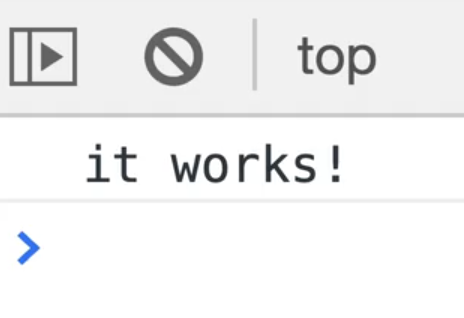

In this lesson, we are going to create a function called "Calculate Bill".

You can think of "Calculate Bill" (said in southern american accent) as a western gentlemen who is very good at going to restaurants and calculating what the bill would be regarding what the bill was, how much tip was, how much tax is. That is what our function will be responsible for doing.

There are going to be a few buzzwords as we go through, which we will explain as we go, starting .

The first one is that **functions are created or defined**, and they are later **called**.

When you make a function, when you author what it does, that is called a **function definition**.

Later on, when you want to **run** that function, that is called **calling** or **running** of a function.

### Defining a Function

There are a few ways to define a function. We are going to go over all the different approaches in the next videos but for now, we will go over the basic.

First you type `function` and then the name of the function. Function naming follows the exact same rules as variable naming which we went over in a previous video.

We are going to call it `calculateBill` 👇

```js
function calculateBill() {
  //this is a function body
}
```

What we have done is defined it, given it parenthesis and then you open and close a function block.  
Anything that goes inside the function block is called the **function body**, and is part of the function.

In the function body, add 👇

```js
console.log("Running Calculate Bill!!!");
```

Open `index.html` and in the browser and open the console. Try typing `calculateBill` in the console and hitting enter.

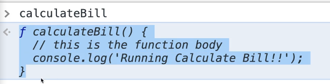

A function works just like a variable in that you can call them by the name of it. However, when you put just the name of the function, you see the entire code, as shown 👆 above.

Now if we want to run the function we would have to enter into the console `calculateBill()`, which will log `Running Calculate Bill!!!!` in the console.

Add the following to `cf.js` to run the function right from our JavaScript. 👇

```js
// Function Definition
function calculateBill() {
  // this is the function body
  console.log("Running Calculate Bill!!");
}

//Function Call or **Run**
calculateBill();
```

### Returning Values

When we called `calculateBill()` in the console, it returned undefined.


It does the work we asked it to do, and then it returns undefined. Often, functions will do a bunch of work and then return to you the result.

What we are going to do in our function is we will take in the following arguments, and it will return to us the total value:

- how much the dinner was
- the tax rate
- how much you want to tip

The way that works is we will assume the meal is 100 dollars, and we will multiply it by 1.13 because in Ontario the tax rate is 13%.

Now we can log the total value to the console.

```js
// Function Definition
function calculateBill() {
  // this is the function body
  console.log("Running Calculate Bill!!");
  const total = 100 * 1.13;
  console.log(total);
}

//Function Call or **Run**
calculateBill();
```

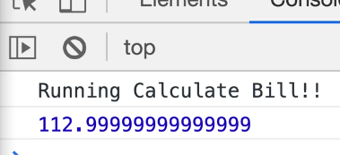

_(👆 This is a perfect example of the issue with floating point numbers mentioned in a previous video)_

You might be thinking "oh, now I have this nice total variable which I can just quickly access". However, if you type `total` in the console, it will return undefined.

Try that by adding the following code to `cj.fg` below the `calculateBill` function definition, refresh the page and look at the error in the console.

```js
console.log("total");
```

You should see an error

> total is not defined

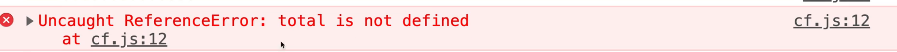

In VSCode, you may notice that ESLint is yelling at us as well that total is not defined.

This is something that we will get into called **scope**.

Variables that are created inside of a function are only available within that function, which is called block scoping _(we will cover block in more detail in the future)_. It is not available outside of it.

So how do we store the result of the calculation so we can access it using a variable? With returning!

When we called `calculateBill()` earlier, we got undefined returned in the console. To fix that, we need to return total.

`return` is a keyword in JavaScript.

```js
  const total = 100 * 1.13;
  console.log(total);
  return total;
}

//Function Call or **Run**
calculateBill();
```

Now when you call it in the console, you will see it returns the value.


### Storing a Value Returned from A Function

How can we store that value?

The total variable is still not available to us. That is because we need to **capture** (another buzz word) the result of the function or capture the returned value of the function into a variable.

Modify the line of JavaScript with `calculateBill()` like so 👇

```js
const myTotal = calculateBill();
console.log(myTotal);
```

In the console, you can now access the variable `myTotal`. Modify the log like so 👇

```js
console.log($`Your total is $${myTotal}`);
```

That will print out the value and message in the console.

You may be wondering why we have two variables to hold the same value, `total` within `calculateBill()` and `myTotal` below the function.

The reason is that `total` variable is a **temporary variable**.

Since `total` is created inside of the function, it is only ever available inside of `calculateBill` and when the function is done running, that variable is **cleaned up** (or what is called **garbage collected** in JavaScript and it's no longer needed).

If you ever want to capture the value returned from `calculateBill()`, you have to stick it into a variable before you can go ahead and display it.

Another cool thing you can do with **interpolation** strings is you can actually run the function from within the log statement.

JavaScript is going to run the function first, and then whatever the return result is it will immediately be interpolated into that string.

```js
console.log(`Your total is $${calculateBill()}`);
```

---

## 14 - Functions - Parameters and Arguments

This video will focus on **arguments** and **parameters**.

In the `calculateBill()` function from the previous video, we hardcoded the tax amount.

A best practice in JavaScript is to keep your code **DRY**, which stands for **Don't Repeat Yourself**.

`calculateBill` would not be useful if it could only calculate the value assuming the bill is \$100 and a 15% tax rate, so we need to modify those hardcoded values.

To solve that, above the calculateBill function, we can declare variables for the bill total and taxRate.

Modify the code like so 👇

```js
const bill = 100;
const taxRate = 0.13;

function calculateBill() {
  console.log("Running calculate bill!!");
  const total = bill * taxRate;
  return total;
}
```

This will work, but that is not the best way to do it. Why?

`calculateBill` is relying on something called **global variables** _(which will be explained in future videos)_.

For right now, what you need to know is that `calculateBill` needs needs some data. When it is not passed data, it is instead reaching outside of the function in order to look up that data in a higher **scope**.

That is not great practice _(reaching outside of a function in order to get your data)_.

In `cf.js`, remove the last console.log and add the following 👇

```js
const myTotal = calculateBill();
const myTotal2 = calculateBill();
console.log(myTotal, myTotal2);
```

_TIP: You can log as many pieces of data as you want by separating the values with commas like in the example above._

The log will return the same value:

> \$100.13.

What if we wanted a different value? Could we do something like this? 👇

```js
const myTotal = calculateBill();
bill = 200;
const myTotal2 = calculateBill();
console.log(myTotal, myTotal2);
```

_(Note: you need to change the `bill` variable that is declared in `cf.js` to a `let` instead of a const so we can reassign it)_

If you refresh it, now it works.

However, we have been changing the variable by modifying out code each time we want to run it with different values. This is bad practice and it is how you get very brittle applications.

What we want to do is instead of reaching out, we will pass the data that we need into our functions.

First let's do a bit of cleanup. Get rid of the `let bill` and `const taxRate` variables. Get rid of lines of code where we are reassigning variables and declaring myTotal2 (`bill = 200; const myTotal2 = calculateBill()`) and the last log.

You should end up with the following code 👇

```js
// Function Definition
function calculateBill() {
  // this is the function body
  console.log("Running Calculate Bill!!");
  const total = bill * 1 + taxRate;
  return total;
}

const myTotal = calculateBill();
```

Now we want to take the variables bill and tax rate and we want to make them into something called **parameters** or **params** for your function.

When you define your function, you add params which let's you know that the function expects to be passed some data. Wes likes to think of params as placeholders.

```js
function calculateBill(billAmount, taxRate){
```

Inside of the function body, we will have access to the two variables that were passed:

- `billAmount`
- `taxRate`

It's can be confusing because there is no "creation of the param variables", but Wes will do his best to explain it.

```js
// Function Definition
function calculateBill(billAmount, taxRate) {
  // this is the function body
  console.log("Running Calculate Bill!!");
  const total = billAmount * (1 + taxRate);
  return total;
}

const myTotal = calculateBill(100, 0.13);
console.log(myTotal);
```

That will give you \$100.13.

But now we are able to make a `myTotal2` really quickly 👇

```js
const myTotal = calculateBill(100, 0.15);
const myTotal2 = calculateBill(200, 0.13);
console.log(myTotal, myTotal2);
```

It works without having to reassign because when you define a function, you can place parameters. P = placeholder is one way to remember it.

When you call the function, you pass it arguments.

Here is a quick cheatsheet Wes has put together that explains the parts of a function.


When we define the function name, we put what are called **parameters**. Parameters can be thought of as placeholders (we will talk about **default values** for parameters shortly).

When you **call**, **run** or **invoke** (all 3 mean the same thing), and you actually pass it the data, that will take place of the variables (for example `meal` will be `100` and `taxRate` will be `10.13`), those will be called **arguments**.

People incorrectly use those terms interchangeably. One way to remember is that _parameters are placeholders_. The actual values that you pass in when calling a function are what are called **arguments**.

Bringing it back to `const myTotal = calculateBill(100,0.13)`, here we are running the function and as arguments we are passing straightaway numbers. However, the values that get passed into a function can be in a variable as well. This is a common thing people get hung up on when learning how functions work is how they sort of get renamed.

Let's take a look at code we wrote for `calculateBill()`.

The data gets passed into the function, and those variables are only available inside of the `calculateBill` function. They will be what is called **scoped to the function**, which means only available inside of the function.

If we add a log within calculateBill like so 👇

```js
// Function Definition
function calculateBill(billAmount, taxRate) {
  console.log(billAmount, taxRate);
  // this is the function body
  console.log("Running Calculate Bill!!");
  const total = billAmount * (1 + taxRate);
  return total;
}
const myTotal = calculateBill(100, 0.15);
```

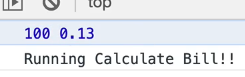

We can run that function from the console but pass it different values for the arguments, it will console log the values of the arguments that we passed, like so 👇


Why?

Because JavaScript will take whatever you write as an argument, and then when you call the function it will make it sort of temporarily available to you via the names that you put in your parameters.

What gets a little bit confusing to people is if we declare two variables before we call the function like so 👇

```js
const wesTotal = 500;
const wesTaxRate = 0.3;
const myTotal = calculateBill(100, 0.15);
```

We can actually pass those variables into the function like this 👇

```js
const wesTotal = 500;
const wesTaxRate = 0.3;
const myTotal = calculateBill(wesTotal, wesTaxRate);
```

Now the big confusion is, if they are variables outside of the function, and we pass them into the function, when it's called inside of the function, is the first parameter called `billAmount` or is it called `wesTotal`?

Will it even work if you pass in a variable that does not have the same name as the parameter? Try refreshing `index.html` in the browser.

_**You should see it works just fine!**_

To review, when you run a function in JavaScript, what happens is JavaScript takes in whatever you have pass it, whether you have passed it that value directly _(as a number or string for example)_, or if you pass it in via reference _(meaning that you just passed a reference to a variable which in turn will hold a value)_.

At the end of the day we are still passing values, whether you pass it directly or whether you pass it a reference to a variable that holds a value. JavaScript doesn't care about how you are passing them in, whether as a value directly or as a variable.

In this function, JavaScript will take whatever was passed in the first argument and make it into a temporary variable `billAmount` that is available inside of the confines of the curly brackets.

When the function is running, it does not care about anything else that is going outside of this function. It just knows it's doing it's job, it's been passed in the 2 little pieces of data that it needs, it does the math and returns it's value from within the function.

When values get passed into a function, they sort of get renamed into whatever it is that you have defined your function parameters as.

### Another Example

Let's do another example!

Comment out the code `const myTotal = calculateBill...`.

Add the following function to your code, which just returns hello and which we will pass in someone's first name 👇

```js
function sayHiTo() {
  return `Hello ${firstName}`;
}
const greeting = sayHiTo();
console.log(greeting);
```

Run the code as is, even though it will break, to see why. In the console you should see an reference error in the console.

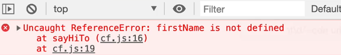

What happens is this function, first it looks inside of it's own function scope, and it will look for a variable `firstName` that has been passed in. If there is not, it will start to do is go up to a high level of scope and look there.

Let's say there was a firstName variable like so 👇

```js
const firstName = "wes";
function sayHiTo() {
  return `Hello ${firstName}`;
}
const greeting = sayHiTo();
console.log(greeting);
```

That would work, because the function will reach outside for that data if nothing is found within the scope of that function.

What we want to do is modify the function definition to set it to take in one parameter (`firstName`). And then when we run the function, we actually have to pass it a string (we will use `Wes`), and then we will have our greeting.

```js
const firstName = "wes";
function sayHiTo(firstName) {
  return `Hello ${firstName}`;
}
const greeting = sayHiTo("Wes");
console.log(greeting);
```

This makes the function nice and reusable, and we can use it to print out any first name like so 👇
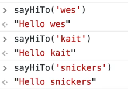

As long as we pass in an argument (in this case "Wes"), it is going to have a variable inside of that function that is referenced to whateer the person has passed in.

If we don't run it with anything, you will see... 👇


The reason that happens is when a function runs, it will create the variable for us (`firstName`) and set it to whatever was passed in.

But if it creates a variable and someone doesn't pass in anything, then it will just be set to undefined which is exactly how variables work.

### Even More Example

Now let's go over a few more examples.

Let's go back to passing expressions. For this example we will go back to `calculateBill`.

```js
// const greeting = sayHiTo('Wes');
// console.log(greeting);
const myTotal3 = calculateBill(100, 0.15);
```

We know the code above works but what if instead we do 👇

```js
const myTotal3 = calculateBill(20 + 20 + 30 + 20, 0.15);
```

Is that going to work?

If you load `index.html` in the broswer you will see `103.4999999999`.

_(If you followed Wes too closely, you may have gotten the value of 90.5. If that is the case, the line of code that calculates the total within `calculateBill`. It should be `const total = billAmount * ( 1 + taxRate);`. This is because of bedmas, we need the paranthesis)._

That works.

Why?

Because the only thing that a function can take in is a value, and whether you pass that value directly, as in a number, whether you pass that value in as a variable which holds a value, that works, and then you can also pass in expressions.

In this example we are not actually passing an expression, we are actually running an expression and that will first run (`20 + 20 + 30 + 20`) and add it up to \$90, and then we pass that raw value of 90.

It is absolutely fine to do something that like, in fact it is pretty common.

You can even mix and match.

Let's say we have a variable `const kait = 100;` and then we want to add another \$50 on top of that. You can do something like..

```js
const kait = 100;
const myTotal3 = calculateBill(kait + 50, 0.15);
```

It still works, even though we are mixing and matching.

Let's remove the `myTotal3` example, and do another example where we pass functions as arguments.

Make a function `doctorize` which will take in a `name` argument and return the name with "Dr." in front like so 👇

```js
function doctorize(name) {
  return `Dr. ${name}`;
}
```

And we will make another function called `yell` that also takes in a name and returns "HEY" with the variable name uppercase like so 👇

```js
function yell(name) {
  return `HEY ${name.toUpperCase()}`;
}
```

You might have noticed that both functions are using the variable `name`.

While it's not okay to reuse variables in the same scope multiple time, it is okay to reuse parameters.

Why? Because when arguments are passed in, the parameters are only available within that function so you will never run into a collision where the name that you pass into one function is going to overwrite it in the other function. That will not happen because _parameters are scoped to the confines of their own functions._

The `name` parameter that is used in the `doctorize()` method will never collide with the variable within the `yell()` method.

Let's go ahead and run it in the console. 👇

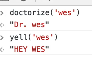

Let's pass the output of `doctorize()` into `yell` by typing the following into the console 👇

```js
yell(doctorize('wes))
```

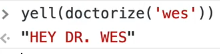

How that works is:

- brackets go first. anything in between the yell parenthesis `yell()` the code says "okay, I need to first run this function first" , and hopefully that returns a value (which it does, it returns Dr. + the value of the `name` argument passed)
- then the value that is returned from `doctorize` immediately gets passed into `yell` as an argument and then that will in turn return "Hey Dr. Wes".

So to recap -- another way we can pass a value to a function that is the output of a function, because that is just a value at the end of the day and you can run that directly like demonstrated here.

**Default Values**

Now, let's talk about **default values**.

If we were to take our `yell` function and instead of passing it "Wes", we do not pass an argument, it will error out.

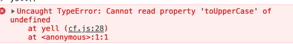

What is happening is that the `toUpperCase()` function (it's technically a method), it's trying to run it against something that didn't get passed in. This means that is someone forgets to pass a value to the `yell` function, our code will break.

What we can do is we can set something called **defaults**. When you define your function, inside of your function definition, you can set a default by saying name is equal to 'Silly Goose', as shown below.

```js
function yell(name = "Silly Goose") {
  return `HEY ${name.toUpperCase()}`;
}
```

If you run it and pass an argument, it will still work.

However when you run it without an argument, the function will no longer error out and instead will fall back to the default value for the parameter and output `HEY SILLY GOOSE`.

So as you define your function, you can specify if someone does not pass this parameter `name`, use the default.

Let's go back to our `calculateBill` function.

You may be thinking that it's a bit silly to have to pass in the the tax rate every single time. We will use a default value to set a default tax rate of 0.13, by modifying the function like so 👇

```js
// Function Definition
function calculateBill(billAmount, taxRate = 0.13) {
  // this is the function body
  console.log("Running Calculate Bill!!");
  const total = billAmount * (1 + taxRate);
  return total;
}
```

What that allows us to do is call `calculateBill(100)` and only pass the value for the `billAmount`.

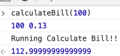

Wes often likes to set default values when he is creating functions. Even just adding a default value for a string variable of an empty string.

```js
function yell(name = "") {
  return `HEY ${name.toUpperCase()}`;
}
```

That will make sure the function doesn't error out, it just won't show a name like so 👇


That is just a safeguard.

Let's take it one step further and modify `calculateBill` to also take in a tip rate.

Add another argument with a default value `tipRate = 0.15` 👇

```js
// Function Definition
function calculateBill(billAmount, taxRate = 0.13, tipRate = 0.15) {
  // this is the function body
  console.log("Running Calculate Bill!!");
  const total = billAmount * (1 + taxRate);
  return total;
}
```

Now we will change the way we calculate total like so 👇

```js
const total = billAmount + billAmount * taxRate + billAmount * tipRate;
```

You may notice that as you save the file, Prettier will remove the parenthesis if they are not needed (the BEDMAS rules are not needed here)

BEFORE SAVING 👉 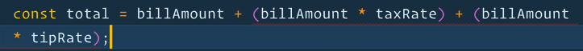

AFTER SAVING WITH PRETTIER 👉 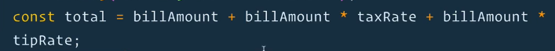

If we run `calculateBill` and pass it 100 dollars, it will return 128.

### How to Fall Back on Default for Only One Parameter

A gotcha that happens here is _what if you want to use the default tax rate but not the default tipRate?_

```js
const myBill4 = calculateBill(100, ,0.2);
```

If you try to just leave the argument empty and use two commas like shown above 👆, it will break.


👆 The error is complaining about an unexpected token `,`.

So the only thing that you can pass into a function to cause it to use the default is **undefined**. A function will only ever fall back to the defaults if nothing is passed.

Remember when a variable is not set to anything, it's value is `undefined`. So you cannot go ahead and pass zero here and expect it to false back to the default.

```js
const myBill4 = calculateBill(100, undefined, 0.2);
```

You have to actually pass it `undefined`, 👆 as shown above, and it will work as we intended.

It's very infrequently that you have to pass `undefined` like that but it's worth knowing how a function decides whether or not to fall back on a default.

It has nothing to do with **truthy** or **falsy** which we will be learning soon.

---

## 15 - Different Ways to Declare Functions

One thing you will hear often when getting into JavaScript is that functions are _"first class citizens"_.

JavaScript functions are values in themselves, and they can be stored in variables and passed into other functions.

What _is_ a **value** in JavaScript?

We know that in the examples below 👇 that `true` and `100` are values.

```js
const age = 100;
const cool = true;
```

Those are values that are numbers, or strings or booleans.

What is cool about JavaScript is that functions can be:

- passed into other functions.
- stored in variables,
- moved around like any other piece of data in JavaScript

That is not true for every other programming language.

Let's start by looking at how you can put a function into a variable, and then look at the different ways to declare functions.

Create a new file `ways-to-make-a-function.js` in the `/custom-functions` directory.

```HTML
<script src="./ways-to-make-a-function.js"></script>
```

Add a log of "it works!" and go back to the `index.html` file and change the path in the script source attribute as shown above 👆 and refresh the browser to ensure it works.

We already know one way to declare a function and that is using the function keyword, like so 👇

```js
function doctorize(firstName) {
  return `Dr. ${firstName}`;
}
```

#### Anonymous Functions

Let's look at some other options we have when declaring functions, starting with an **anonymous function**, which is a function without a name.

To make `doctorize` an anonymous function, you would modify it like this 👇

```js
function(firstName){
  return `Dr. ${firstName}`;
}
```

However, that is not valid JavaScript. If you try running it in the console you will see an error that says 👇

> SyntaxError: Function statements require a function name


Anonymous functions are only valid in some use cases, such as using them in **callbacks** (we will learn more about that later) as well as in an **IIFE (immediately invoked function expression)**. This example was not a valid use case.

Why would you ever want an anonymous function?

#### Function Expressions

The next way we will cover to declare a function will help explain that, which is as a **function expression**.

Add a comment above that function specifying that it is an anonymous functions, then copy the function and comment it out.

Paste the copied code below the commented out function.

The next way to declare a function is a **function expression**. A function expression is when you store a function as a value in a variable. 👇

```js
//Function Expression
const doctorize = function (firstName) {
  return `Dr. ${firstName}`;
};
```

In the code above 👆, we have taken the anonymous function and stuck it in a variable.

If you refresh the page, you will see that in the console, we have `doctorize()` available to us, and we can call it like we did in previous videos.

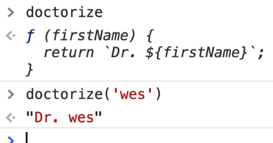

Having the ability to create a variable and then store it in a function is what leads people to say functions are _"first class citizens"_.

You may come across developers who say to not use function expressions because they used to give unhelpful errors.

Previously, anonymous function errors would just tell you that it occurred in an anonymous function, without giving you any clue where the error is happening. However, now the dev tool errors are better.

Here is an example that demonstrates what they mean by that 👇

```js
//Function Expression
const doctorize = function (firstName) {
  doesntExist();
  return `Dr. ${firstName}`;
};
```


In our case, it does now tell you it happens inside of doctorize on line 12.

Although the function is technically an anonymous function without a name, the browsers will now infer the name of the function from the variable name and use that in the errors.

#### What is the difference between a function declaration and a function expression?

What is the difference between doing a function declaration and a function expression? Why would you want to use one over the other?

##### Hoisting

There is only one real difference which is how they operate in something called **hoisting**. We will go over this in detail a future video but for now we will just quickly cover the concept.

Duplicate the `doctorize` function and name it `doctorize2`, like 👇

```js
const doctorize = function (firstName) {
  return `Dr. ${firstName}`;
};
function doctorize2(firstName) {
  return `Dr. ${firstName}`;
}
```

Let's say right before the first `doctorize` function, we called `doctorize` and passed it the value of "wes", as shown below 👇, do you think the code will run?

If you run a function before you define it, does it work? Refresh the page and look at the console to test it

```js
doctorize("wes");
const doctorize = function (firstName) {
  return `Dr. ${firstName}`;
};
function doctorize2(firstName) {
  return `Dr. ${firstName}`;
}
```

Did it work?

Nope! You get an error like:

> Uncaught ReferenceError: Cannot access 'doctorize' before initialization
> at ways-to-make-a-function.js:78
> (anonymous) @ ways-to-make-a-function.js:78

What about `doctorize2`?

```js
console.log(doctorize2("wes"));

const doctorize = function (firstName) {
  return `Dr. ${firstName}`;
};
function doctorize2(firstName) {
  return `Dr. ${firstName}`;
}
```

It does work!

Why does a function declaration work if you call it before you define it, but a function expression does not, especially when we created the exact same function in both cases?

Functions that are declared with the **function** keyword are called **hoisted**.

JavaScript will take all functions with the function keyword and and hoist them up, up, up and says "you're a function, you belong at the top of the file". That means anywhere you cal the function, it will be available to you.

JavaScript does **not** hoist variable functions.

Why is that useful?

Very rarely, Wes has never used that in his entire career except tiny use cases.

**Hoisting** is more of an interview question that you may be asked.

Essentially it means that JavaScript will take functions and bring them up to the top of the code before they are called. This gives us the ability to run a function before it is defined.

Remove the `doctorize2` function from the JavaScript file which should leave just the function expression.

### Arrow Functions

The next way to make a function is using an **arrow function**.

Arrow functions themselves have a few different ways of being declared. They are a newer addition to JavaScript, and were added in the last couple of years.

They have a few benefits:

- concise syntax and tend to be shorter. allow for writing one line functions
- do not have their own scope in reference to the `this` keyword _(we will cover the `this` keyword in future video)_

Arrow functions are also **anonymous functions**, which means there is no way to declare an arrow function the way we do a function declaration `function doctorize(){..}`. You always have to stick it into a variable.

To illustrate this, we will begin by writing a regular function. 👇

```js
function inchToCM(inches) {
  const cm = inches * 2.54;
  return cm;
}
```

This function will take in inches and return centimeters.

Let's try it out in the browser.


This is a pretty simple function, but it still takes up 4 lines of code.

We can make it a bit shorter by instead of creating a variable and then returning a variable, we can just return the calculation directly.

```js
function inchToCM(inches) {
  return inches * 2.54;
}
```

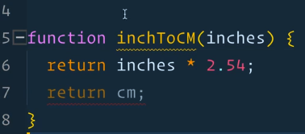

_Note: You may notice in the above 👆 screenshot that the line of code with `return cm;` is now greyed out. That is because that code will never be reached, since we are returning in the line of code above it. When you return from a function, the function stops running._

Now we can convert it to an anonymous function as a step on the way to making it an arrow function.

```js
const inchToCM = function (inches) {
  return inches * 2.54;
};
```

Refresh the page to check that it still works, which it should. All we have done if turned it into an anonymous function and stored it in a variable.

### Different Ways to Write Arrow Functions

Let's convert it to an arrow function now, which we can do a few different ways.

Instead of writing the word function, we will delete it like so 👇

```js
const inchToCM = (inches){
  return inches * 2.54;
}
```

Now we will go to the right of the parenthesis and add what is called a **fat arrow** `=>`.

In programming, `->` is referred to as a **skinny arrow** and `=>` is referred to as a **fat arrow**.

```js
const inchToCM = (inches) => {
  return inches * 2.54;
};
```

When you save, you might notice that Prettier modified the function for you and removes the parenthesis, which is not what we want because we are trying to change it to an arrow function in steps. to di To disable that, add `/* eslint-disable */` right above the function.

_The spaces between the parenthesis and the arrow in the following code 👉 `(inches) => {` does not have to be there, this is the same code with different whitespace and 👉 `(inches)=>{` still works, but it's more readable with spaces._

If you refresh the page and run it in the console, you will see that it still works.

### Implicit and Explicit Returns

The next thing we will do is what is called an **implicit return**.

An **explicit return** is when you type the `return` keyword before returning a value such as 👇

```js
return inches * 2.54;
```

That is an explicit return meaning that _we explicitly return the value there_.

An **implicit return** is returning it without actually having to type the keyword `return`. Arrow functions allow us to use implicit returns.

Let's start by putting the function on one line, like so 👇

```js
const inchToCM = (inches) => {
  return inches * 2.54;
};
```

To get rid of the **explicit** return:

- first put the function on one line
- then delete the curly brackets`{` `}`
- finally delete the keyword

```js
const inchToCM = (inches) => inches * 2.54;
```

Your code should look like the above 👆

What we did there is:

- we made an arrow function `inchToCM` which takes in one argument, `inches`
- modified the function to implicitly return the value.

The way we can tell this is an implicit return is that:

1. it's all on one line
2. there is no return keyword
3. there are no curly brackets

If you refresh in the browser, you will see that it still works.

_To recap: what we did there is we removed the function block, modified the code to be on one line, and removed the explicit return._

Finally, and this is more of a stylistic choice, if there is only ever one parameter for your function, you can actually get rid of the parenthesis around the parameter as well, like so👇

```js
const inchToCM = (inches) => inches * 2.54;
```

If there is only one parameter in your arrow function, you can remove them no problem. It is still a valid arrow function.

Let's do another example!

Make a function called `add`, that takes in two parameters `a` and `b`, with the default value of `b` being 3. We will then we make a temporary variable called total which we return.

```js
function add(a, b = 3) {
  const total = a + b;
  return total;
}
```

Pause here, try to convert it to an arrow function yourself and then come back once you have tried it.

Let's first see if it works as it originally was.

Save the code from above 👆 and refresh `index.html` in the browser.

Open the console and test the function.


You might notice that dev tools is giving us an annotation `?b` in `ƒ(a,?b)` as shown above.

That little question mark in front of `b` is telling us that the argument is optional. `b` if optional because there is a default value to fall back on.

Stick the function in a variable `add` and remove the function name, like so 👇

```js
const add => function(a, b = 3) }
```

Next, convert it to an arrow function. Get rid of the keyword function and add a fat arrow to the right of the parenthesis, as shown below.

```js
const add = (a, b = 3) => {
  const total = a + b;
  return total;
};
```

Modify the code to return `a + b` and get rid of the total variable. 👇

```js
const add = (a, b = 3) => {
  return a + b;
};
```

Put the function on one line.

```
const add = (a,b = 3) => { return a + b; }
```

Get rid of the function block and the `return` keyword like so 👇

```js
const add = (a, b = 3) => a + b;
```

Now we have a short arrow function!

You may have noticed that we did not get rid of the parentheses, and that is because there is more than one parameter.

### Arrow Function Gotcha's

There are a couple of other gotchas with arrow functions that we need to know about.

Let's go over them now.

##### Returning an object

Let's make a function `makeABaby()`, which will accept a first and last name for the baby.

Inside of the function, create an object `baby` with a `name` and `age` property. 👇

```js
function makeABaby(first, last) {
  const baby = {
    name: `${first} ${last}`,
    age: 0,
  };
  return baby;
}
```

It works!

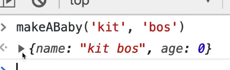

How could you convert this to an arrow function?

Stick, stick it in a variable, and convert it to an arrow function like so 👇

```js
const makeABaby = (first, last) => {
  const baby = {
    name: `${first} ${last}`,
    age: 0,
  };
  return baby;
};
```

If your function needs to do some stuff inside of the block, you can leave it as is. This is a perfectly valid arrow function.

If the only thing you're using the arrow for is the ability to type less as well as some of the benefits of not scoping this, this is totally valid.

However we can take it a bit further.

Instead of declaring the `baby` variable we will just return the object directly. 👇

```js
const makeABaby = (first, last) => {
  return {
    name: `${first} ${last}`,
    age: 0,
  };
};
```

Now the question is... how would we do the implicit return?

We can put it on one line, no problem _(objects can be put on one line)_.

But how would we return it?

Let's try it the way we know.

Put it on one line.

```js
const makeABaby = (first, last) => {
  return { name: `${first} ${last}`, age: 0 };
};
```

To make it an implicit return, get rid of the curly brackets and the `return` keyword. 👇

```js
const makeABaby = (first, last) => { name: `${first} ${last}`, age: 0};
```


However, you will see the above 👆 error if you try to run the code like that.

Whats happening there is it thinks that the curly bracket from the baby object is actually the curly object from the block of the function.

Curly brackets in JavaScript can be creation of an object, or a block of code.

What are you options to implicitly return an object then?

If you want to implicitly return an object in JavaScript, you just pop a set of parentheses around the thing that you are returning and then the code will know that it's not the block to the function.

Try it by modifying your code like so 👇

```js
const makeABaby = (first, last) => ({ name: `${first} ${last}`, age: 0 });
```

If you try it in the code, it still works.

Now... is there a benefit of having the function this way or how we did it originally? Wes doesn't think so.

You're not really getting much benefit, in fact the way we had it originally was a bit more readable.

There is nothing wrong with doing a regular function, because you want to think about your future self.

Let's say you come back to the code in 6 months, what will be easier for you to read?

Don't always go to making an arrow function by default, and hopefully throughout this course it will become more clear when you should reach for an arrow function (specifically with arrays and doing maps and reduce and filters).

#### IIFE

The next way to create a function is using an **IIFE** (pronounced **iffy**).

That is an **immediately invoked function expression**.

We will do an example to demonstrate was an IIFE is.

Comment out all the other JavaScript code, add the code below and then refresh `index.html`. 👇

```js
function(){
  console.log('Running the Anon function');
  return `Your are cool`;
}
```

Nothing happens when you refresh `index.html` because it's not allowed to run.
We talked about how you can stick a function in a variable and that is okay.

Another way to run this function is what is called an **immediately invoked functional expression.**

What you can do is wrap that function in a parentheses, _(parentheses always run first in JavaScript)_, and what that will do is return a function value and you can immediately run that function by putting parentheses on the end like so 👇

```js
(function () {
  console.log("Running the Anon function");
  return `Your are cool`;
})();
```

Now, if you refresh the page, you will see the log in the console which means our function expression was immediately invoked. It was immediately run.

What is the benefit of doing something like that?

It used to be very popular before we had modules and block scope.

When we get into scoping, you will learn that a function declares its own scope and its often handy to even declare functions of them, and it will provide us a sheltered space where the variables can't leak inside. We will go over that later in the course.

For now, just know that it's an immediate invoked function.

One last thing is what if the function took an age? You would pass it like so 👇

```js
(function (age) {
  console.log("Running the Anon function");
  return `Your are cool and ${age}`;
})(age);
```

That isn't something you will be using that often, but it does come up when you need to create something like a **closure** _(which will be explained in future video)._

### Methods

Next type of function we will learn about are referred to as **methods**.

A method is simply a function that lives inside of an object.

_(Wes has so far sort of been saying that methods and functions are the same thing and we have a video coming up that focused entirely on creating your own methods that will make that clearer)._

So far Wes has been telling us that `console.log()` is a function.

If we take a look at the function `console.log` in the browser, we will see that he has been lying to us.

`log()` is actually the function that lives inside of `console`, and `console` is actually an object.

If you type `console` into the console and expand it, you will see that there are all kinds of things within it. 👇

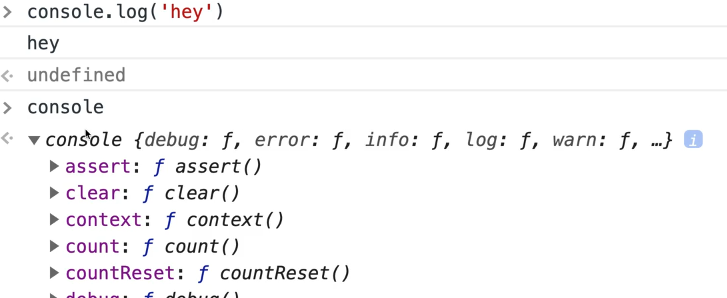

Scroll down to log, and the little ƒ you see means that it's actually a function 👉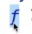

So `console` is the object and `log()`, `count()` or any of the other functions listed under the console object are the functions.

We have a special word to describe functions that live inside of an object and we call those **methods**.

So you can actually do something like this.. 👇

```js
const wes = {
  name: "Wes Bos",
  sayHi: function () {
    console.log("Hey wes!");
    return "Hey Wes!";
  },
};
```

Try it in the browser.

First type `wes` and hit enter.
Next, type `wes.sayHi()` and hit Enter.

You should see the following 👇


`wes.sayHi()` is a **method**. You make it a property on your object and you set it to a function.

Those functions can also have names, for example sometimes you will see something like this 👇

```js
const wes = {
  name: "Wes Bos",
  sayHi: function sayHi() {
    console.log("Hey wes!");
    return "Hey Wes!";
  },
};
```

Wes doesn't see the point of doing that, but it is technically allowed.

There is also a new shorthand method. 👇

```js
const wes = {
  name: "Wes Bos",
  // Method!
  sayHi: function sayHi() {
    console.log("Hey Wes!");
    return "Hey Wes!";
  },
  //Short hand Method
  yellHi() {
    console.log("HEY WESSSSS");
  },
};
```

If you refresh the browser and type `wes.yellHi()`, it will work.

What we did there is instead of writing `sayHi: function()` _(which does work)_, we can get rid of the `function` keyword and the `;`. bThat makes it into a property, `yellHi()`, which set to the function `yellHi`.

It's just a shorthand way to write methods inside of an object.

There is another way, which is an arrow function. 👇

```js
const wes = {
  name: 'Wes Bos',
  // Method!
  sayHi: function sayHi(){
    console.log('Hey Wes!');
    return 'Hey Wes!';
  },
  //Short hand Method
  yellHi(){
    console.log('HEY WESSSSS');
  }
  //Arrow functino
   whisperHi: () => {
     console.log('hiii wess im a mouse');
   }
};
```

`whisperHi()` is an arrow function that doesn't take any arguments, but it could take in arguments if you wanted.

Those are 3 different ways to do methods and the short hand is the most common way.

### Preview of `this`

The only reason you would do an arrow function is because you don't want to access `this`.

We will go over that in detail when we get to objects but really quickly Wes will show us.

Modify the `sayHi()` method to add `console.log(this);` and run it in the browser 👇

```js
 sayHi: function sayHi(){
    console.log(this);
```

You will see that on the line in our code that we logged, like `50`, the value of `this` has been returned.


((`this`)) is equal to the object that it was called against.

That is cool because you could actually do something like this 👇

```js
const wes = {
  name: 'Westopher Bos',
  // Method!
  sayHi: function sayHi(){
    console.log(`Hey ${this.name}`);
    console.log('Hey Wes!');
    return 'Hey Wes!';
  }
```

You would see it immediately fills the value of the name property. 👇


That will not work in an arrow function because they take the parent scope of `this`. We will explain that in the future.

### Callback Functions

The final thing Wes wants to talk to us is something called **callback functions**.

So a callback function is just a regular function, but we use that name for something that will happen after something is done.

The easiest way to define a callback function is either when someone clicks something, run this. Or when this amount of time has passed, run this.

Let's look at both of those examples.

#### Callback Example 1 - Click Callback

We will do a click callback.

Go into `index.html` and add a button with a class of `clickMe` and text of "Click Me!" 👇

```html
<!DOCTYPE html>
<html lang="en">
  <head>
    <meta charset="UTF-8" />
    <meta name="viewport" content="width=device-width,initial-scale=1.0" />
    <title></title>
    <link rel="stylesheet" href="../../base.css" />
  </head>

  <body>
    <button class="clickMe">Click Me!</button>
    <script src="./ways-to-make-a-function.js"></script>
  </body>
</html>
```

Back in the JavaScript file, let's select the element like so 👇
_(we will cover the DOM in more depth later)_

```js
const button = document.querySelector(".clickMe");
console.log(button);
```

Refresh the page and open the console to see that it works.

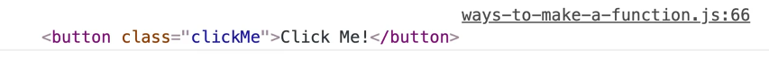

Next, listen for a click on that button as shown below

```js
const button = document.querySelector(".clickMe");
button.addEventListener("click", wes.yellHi());
```

When that click happens, we can pass it to any function that we want. in this case, we chose `sayHi()` from our `wes` object from a previous example.

Now, every time you click it, it will say "HEY WESSSS" 👇


What is happening there is that `.addEventListener()` is an **event listener** that we are listening for a click on, and the callback function is `wes.sayHi()`.

It's a function that we give it access to.

Notice that we are not running it there, we are just saying here is the function, when someone clicks the button, please call it.

That is what is referred to as a callback function.

Callback functions can be declared outside of the handler, like so 👇

```js
function handleClick() {
  console.log("Great clicking!!");
}
button.addEventListener("click", handleClick);
```

That tells the browser that when the element with a class of `.clickMe` is pressed, run the `handleClick` function. The other option, which is half as common, is to define the function outside and then pass in the reference to the function.

Another thing you can do is just pass it an anonymous function, as shown below.

```js
button.addEventListener("click", function () {
  console.log("nice Job!");
});
```

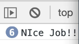

And it works just fine when you press it.

We have What we have done there is we have passed it an anonymous function as a value directly, and the browser will know to call this function itself. _(There are upsides and downsides of doing it that way which we will get into another time.)_

What you need to know is that a **callback function is a function that gets passed into another function and then it is called by the browser at a later point in time.**

### Timer Callback

The other example we have is a timer callback.

There are a couple way to do timers _(we will go over all of them in the future)_ but the simplest is `setTimeout()`.

```js
setTimeout();
```

It takes two things:

1. a function to call after a certain amount of time
2. a duration in milliseconds (after how long should I run this)

So let's do `1000` milliseconds which is one second later.

```js
setTimeout(wes.yellHi(), 1000);
```

If we refresh the page, after one second, it will log HEY WES.

You can also pass it an anonymous function.

```js
setTimeout(function () {
  console.log("DONE TIME TO EAT");
}, 1000);
```

After a second that will log "DONE TIME TO EAT".

You can pass those as arrow functions as well.

```js
setTimeout(() => {
  console.log("DONE TIME TO EAT");
}, 1000);
```

That will work the same!

---

## 16 - Debugging Tools

There are 2 parts of debugging:

1. there are tools you can use to get info when things go wrong
2. the right mindset to be a good problem solver

This video will focus on the tools.

As you go through the course, anytime we start to hit a roadblock, Wes won't cut it out of the video, he will leave it in and show us his thought process.

We will be working out of the `16 - Debugging` folder which is in the `exercises` directory. Within that folder, there should be two files: `debugging-START.js` and `debugging.html`.

If you open `debugging.html`, you will see that it's just a basic html file where we are loading our base CSS, we have a button that says make me bigger and then a script tag that is loading `debugging.js` which doesn't exist yet.

Make a copy of the `debugging-START.js` file and save it as `debugging.js`.

This file contains a bunch of stuff we haven't learned yet:

- arrays of objects,
- loops,
- functions
- event listeners
- etc.

It doesn't matter that we don't know what all those different things do yet, Wes will explain them later and we will learn how to build our own. This is more so we can test different types of debugging.

### Console Debugging

We will start with console debugging.

There is `console.log()` which is the most common one you'll see. 👇

```js
people.forEach((person, index) => {
  console.log(person.name);
});
```

There is `console.info(person.name)` which usually gives you a little eye and cirlce beside the console output but it doesn't seem to be there right now.

There is `console.error(person.name)`.

That isn't used for throwing or handling errors (we will learn about that), this just changes what the log looks like in the console, as shown below 👇


It also gives you a stack trace 👇

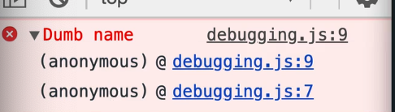

There is `console.warn()` which is very similar to `console.log()` 👇

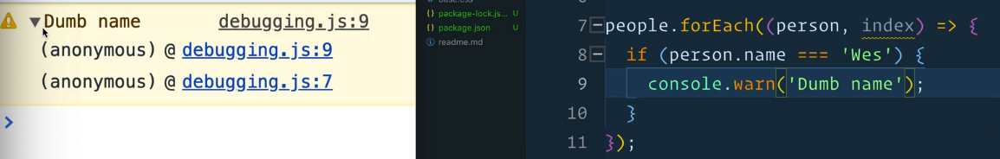

There is `console.table()`.

Anytime you have a list of objects, and the objects have the same property (meaning the objects all have `name`,`cool`, and `country` properties), `console.table()` will format that into a nice little table.

```js
console.table(people);
```

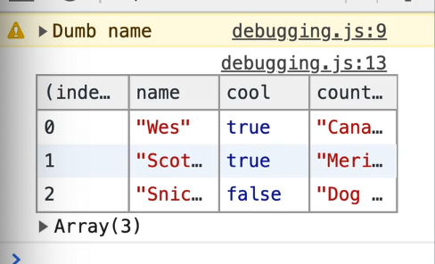

There is `console.count()`.

This is useful if you want to know how many times a function is being run.

If we go into the `doctorize()` function in `debugging.js` and add `console.count('running doctorize');`, and then refresh the html page, every time you type `doctorize('wes');` in the console, the console will log a count.

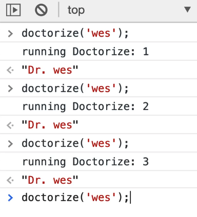

That is useful in a scenario where you aren't sure if a function is running twice, or sometimes you are working with hover elements and it's getting triggered way too often. `console.count()` will show you how many times it's actually running.

You can also pass variables to `console.count()`. To demonstrate that, let's change the example to use backticks, like so 👇

```js
function doctorize(name) {
  console.count(`running Doctorize for ${name}`);
  return `Dr. ${name}`;
}
```

Now if you type in the console `doctorize('wes')`, it will show the count, but if you run `doctorize('snickers');`, it goes back to one.


But if you call `doctorize('wes');` again, it maintains that count.


`console.count()` is based on what strings you pass it.

Next we have `console.group()`, that can be helpful if you have a bunch of stuff to log.

We will make a function `doALotOfStuff` to demonstrate this.

Comment out all of the example consoles we have gone over so far.

```js
console.group("Doing some stuff");
```

👆 Add the code above, and then underneath it, add a few more consoles such as log, warning, error. Then add `console.groupEnd()` and pass it the same string we had passed to `console.group()`, like so 👇

```js
function doALotOfStuff() {
  console.group("Doing some stuff");
  console.log("Im one");
  console.warn("watch out!");
  console.error("hey");
  console.groupEnd("Doing some stuff");
}
```


What that does is it groups together all of the logs into a group-able thing, and that can be very helpful.

We will do another example in the `people.forEach()` method.

```js
people.forEach((person, index) => {
  console.group(`${person.name}`);
  console.log(person.country);
  console.log(person.cool);
  console.log("DONE!!");
  console.groupEnd(`${person.name}`);
});
```


As you can see, it nicely organizes the people into their separate collapsible section. 👆

```js
console.groupCollapse();
```

You can actually also use the `.groupCollapse()` method shown above 👆 which will by default collapse all the groups, as shown below 👇.

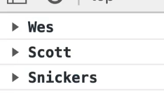

Those are the main console methods that Wes uses to debug something.

Comment out all the `console.group()` code.

## The Call Stack and Stack Trace

Next we will talk about something called the **call stack** or the **stack trace**. _The stack trace will tell you which function called what function called what function._

If you scroll down to the function `go`, you will see that it calls `doctorize`, which will first call `greet`.

There is a lot going on in the code.

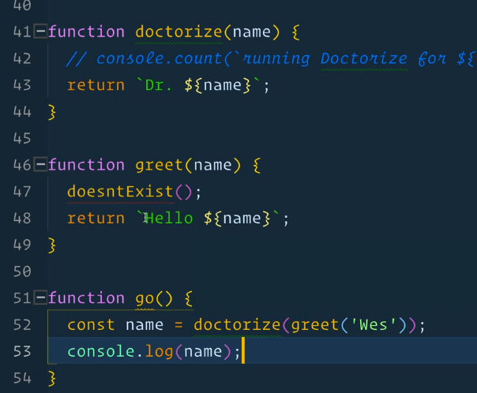

You will notice that inside of `greet()` we have this function that doesn't exist, and that wil cause an error. If we try to run that from the console, you will see an uncaught reference error.

If you expand the error, you should see a few message below, which are often ignored by new developers but are actually very useful in debugging.

If you want to know what went wrong, you have to get good at reading the call stacks. It's pretty simple!

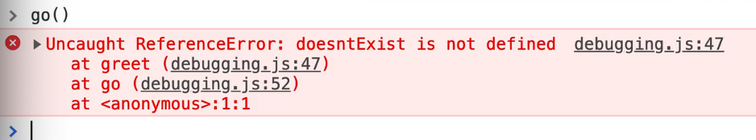

In the error log above, the console it letting us know that the error happened at the `greet()` function, which is on line 47 of `debugging.js`. This is where the actual error happened.

That is good, but errors aren't always that easy.

You might need to know where the `greet()` function was called from.

To figure that out, you would go to the next line which tells you that it was was called by `go()` on line 52.

And then it says `at <anonymous>:1:1`. What does that mean?

We are getting that message because we called the function from the console.

That would look different if we actually made another function that called go instead like so 👇

```js
function bootstrap(){
  console.log('starting the app!);
}
```

If you call `bootstrap()` from the console, you will see 👇


If you were to modify `debugging.js` to add a call to bootstrap on page load like so: `bootstrap();`, you won't see that anonymous function line in the call stack.

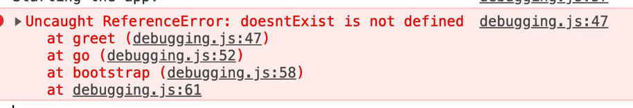

Go ahead and comment out the `bootstrap()` call now.

## Grabbing Elements

Next we will learn about the grabbing of elements.

This is a handy tip that Wes' uses often. If you're on a website, and you're inspecting it, and focusing on an element such as this input from Mozilla's website by clicking on it in the element inspector, if you flip over to the console and type `$0`, it will return to you whatever element you had currently selected in the elements tab.


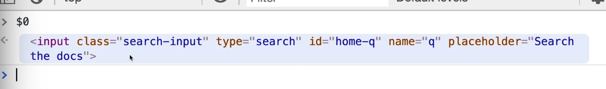

That is very useful because now you could do something like call `$0.value()` against it, and it will tell you what you have typed inside the input.

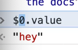

You might be wondering, what does `0` int the `$0` mean.

It means the last element that was clicked.

If you were to go back to the elements tab, select another element like a button, when you go back to the console `$0` will give you the button element and`$1` will give you the input.

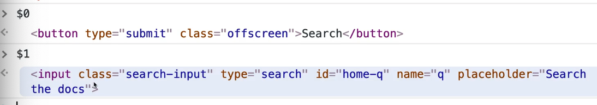

You can keep going forever, if you click another element, it will remember the order in which they were clicked.

Another cool thing you do is the use the `$` and `$$` symbol in the console.
You cannot use these things in your code, it only works in the console. Also, if jQuery is loaded on the page, that won't work.


👆 Those are shorthand selectors for two things we will learn about in a future video about the DOM. Those selectors will allow us to select things based on selectors.

`$('p')` will give us `document.querySelector()`, which will match the first thing that matches the selector passed.

`$$('p')` will match ALL of the elements that match the selectors.


In the value returned from `$('p')` you can see it found the first paragraph, and with `$$('p')`, it found all of the `p` elements on the page.

## Breakpoints

Next we will talk about breakpoints.

```js
console.log(person.name);
```

Go into the `people.forEach()` method and delete all the logs that we had commented out within it and add the code above 👆

If you refresh the html page, you will see everyone's name logged to the console.

What you can do is, within the `people.forEach()` method, if you want to pause JavaScript from running, you can type `debugger;`, like so 👇

```js
people.forEach((person, index) => {
  debugger;
  console.log(person.name);
});
```


That is a statement that only takes into effect when your dev tools are open, and it will pause JavaScript from running and allow us to peer into JavaScript at that very moment.

If you refresh `debugging.html` now, what happens is that we have set what is called a **breakpoint**. When you set a breakpoint, you are telling JavaScript to break execution of code when it reaches that line.

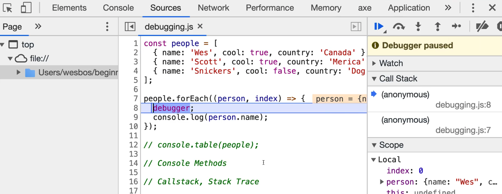

This gives you a whole bunch of information as to what happened.

If you hover over it, it will show you what the variables are equal to at this point in time.

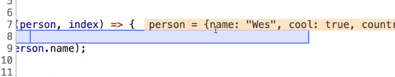

You can see that the JavaScript has paused and if you go to the console, you will see that nothing has been logged yet.

Flip back to the sources tab.

On the right hand-side of the `Sources` tab, that is where all the different tools for inspecting what is going on reside.


We get the call stack, which we learned about earlier.

It will also let us know what the local variables are.

You can expand the collapsed Local section within the Scope section, or hover over a variable to see it's value.

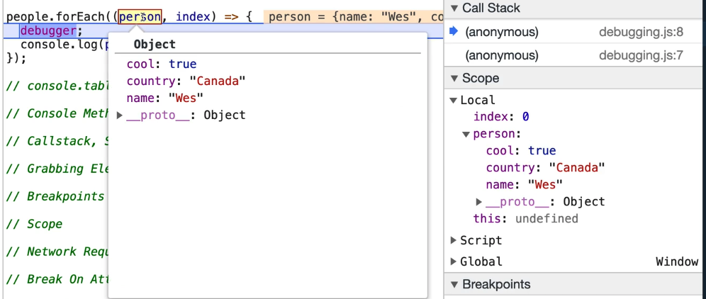

There are other sections for breakpoints which we will get to in a second.

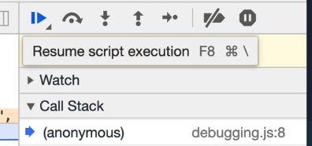

What is cool is you can click the play button shown above , and then if you flip back to the console, you will see that the name "Wes" has been logged.

What happened there is when the function first ran, it hit the breakpoint and then when we pressed play, it logged the first persons name and then because it's in a loop, it hit the breakpoint again and paused.

Now you can see that the second person is equal to Scott.

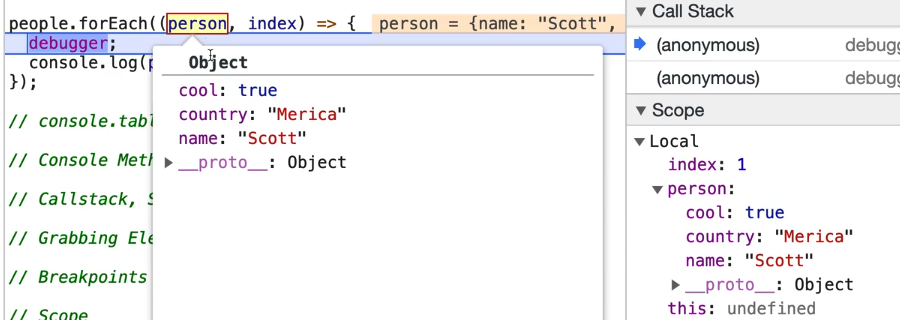

You can also step over into the next function call like so 👇


When you hit play, it will just continue execution of the code until it hits the next breakpoint.

If you click the option beside the play button that says "Step over next function call", it allows you to run the code line by line.


When you feel like you are logging too much data in order to see it, or you are logging something quickly so you can see what happened in the past, adding a debugger (it can go anywhere in your JavaScript code) can be very helpful.

It's a handy way to slow things down and peer into what the different pieces of data are.

You can also set breakpoints from the browser as well.

Remove the line of code in `debugger.js` that says `debugger;` and refresh `debugging.html` in the browser.

Open the sources tab.


In the sidebar on the left, you can click on your actual JavaScript files that are loaded on the page, and then you can say something like "when someone runs this go() function, I want to put a breakpoint in there"

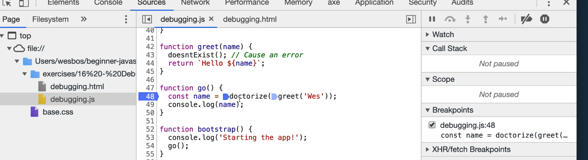

What you do is you click the line number next to the line of code that you would like to pause during.

If you go into the console and type `go()`, you will see that the code pauses itself in the debugger at the line where you set the breakpoint.

_Recap: you can either create the breakpoint by clicking next to the line number in the sources tab, or adding the word `debugger;` anywhere in your JavaScript._

Always make sure you remove those `debugger;` calls from your code once you are finished!

We talked about scope earlier. Scope will allow us to peer into what variables are, we will look at that more in the next video.

The next one is Network Request.

This is useful if you want to see what is being fired off when you load the page. If you go to your networks tab and refresh `debugging.html`, you will see all of the different files that are needed in order for the page to work.

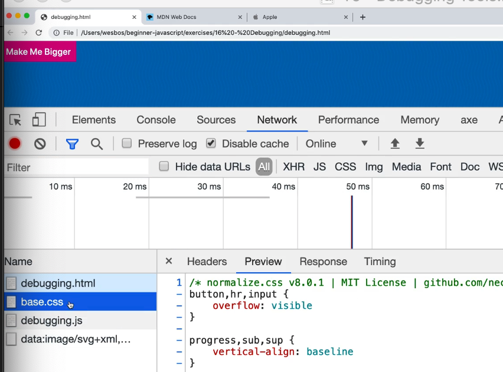

This is helpful because you can see when the data is being sent to you.

Wes added a function to `debugging.js` called `fetchDadJoke()`.

What that function will do is go off to an API and grab a random dad joke.

Don't worry about what all the lines of code mean here, we will go over that in future videos. For now, just know that it goes to an external API and grabs a joke.

```js
// A Dad joke fetch
async function fetchDadJoke() {
  const res = await fetch("https://icanhazdadjoke.com/", {
    headers: {
      Accept: "text/plain",
    },
  });
  const joke = await res.text();
  console.log(joke);
  return joke;
}
```

If you were to run the `fetchDadJoke()` function in the console, it will return a dad joke and log it to the console.

If you go back to the network tab, you will see that there is a new item that has been logged.

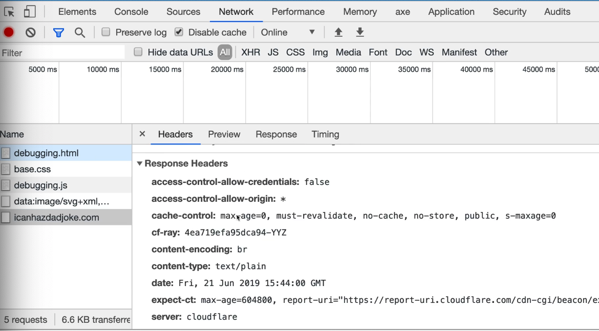

This tells you the information about the request, what actually happened, the raw response and a preview of it. It gives you information such as how long did this request take.


For example, if youre website is slow, it will tell you how long the request took, and where the time was spent.

To demonstrate this, go to http://apple.com and inspect the network tab.

You will see that there are 100s of things that are requested. You can also filter out the requests within the network tab such as XHR, which is when they're sending data out about you.


Next we will go over break on attribute. Wes doesn't use this one often, but it can be useful.

On `debugging.html` there is a button that says "Make me bigger".

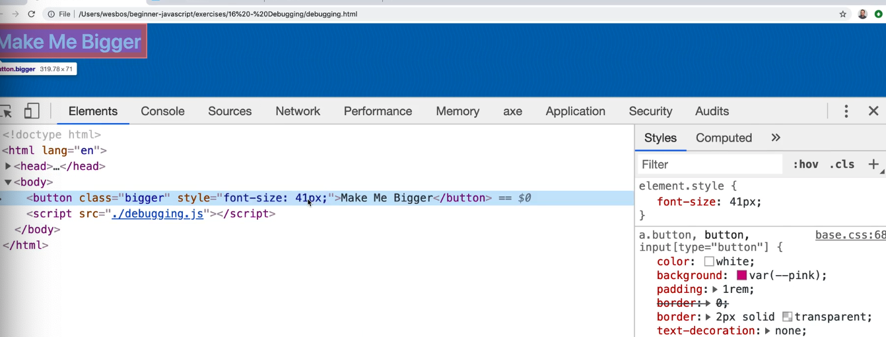

When you click it, it gets bigger.

If you go to your elements, you will see that the font-size is just being bumped up every time the button is pressed.

If you don't know where the JavaScript is that is making that button bigger, you can go into you button in the elements tab of dev tools and select _Break on > Attribute Modifications_.

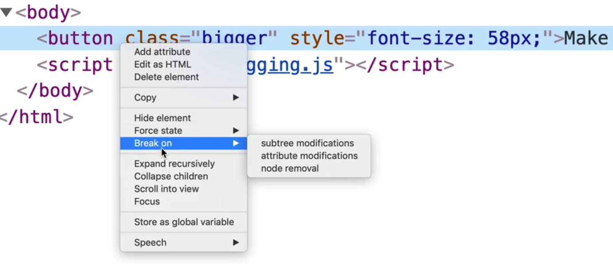

This is just another way of adding a breakpoint.

There is also something called **subtree modifications** which is what it is referred to when somebody adds a div for example.

There is also something called **node removal** which is when someone removes an element or text from something.

We will just focus on attribute modifications.

Set the breakpoint on attribute modification and now when we click the button, the breakpoint should be triggered and bring us to the sources tab which will show you where that attribute is being modified from.


That is very useful when you get thrown into a random code base where you don't really know what is going on.

Finally, if you go to the sources tab again, you will see that there are other things on the right hand side.

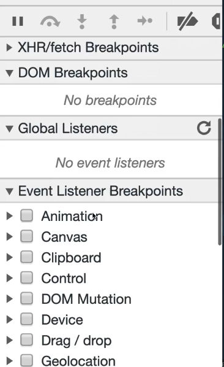

You can throw Event Listener breakpoints, such as mouse click. 👇


If you add that breakpoint, now when you click on the button, it will throw a debugger breakpoint for you.

There are also XHR breakpoints:

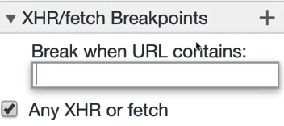

If you click `Any XHR or fetch`, what that will do is anytime a fetch request is made, anytime someone goes off to an external API, the code will break execution.

To test this you can set the breakpoint option and then go into the console and try typing `fetchDadJoke()`.

You will see that it pauses in the debugger where the fetch request is made and we can actually step through it.

Wes would estimate that around 98% of the debugging that he does is done using console.log, breakpoints and network requests.

He will turn to the other types of debugging tools available typically in severe edge cases where he is stumped.

---

# Module 3: The Tricky Bits

## 17 - Scope

We have touched on scope a few times throughout the course already because it's impossible to talk about variables without touching on scope. 

What is scope? Scope answers the question _"where are my variables and functions available to me?"._ 

So far in the course, we have been making functions and variables and they have generally been available anywhere we wanted them. We have also seen some issues like when you create a variable inside of a function, and they're not available outside the function. 

That is what scope is. 

Go to the playground folder and create a new file called `scope.html`, and use your html base inside of it. 

Add a script src to a file called `scope.js` which will live in the same directory. 

```html
<script src="./scope.js"></script>
```

Add a new file `scope.js` in `/playground` and add a `console.log('It works!');`.  

Open the file up in the browser to make sure it works. 


### Global Variables

We will start by taking about the first type of scope which are referred to as **global variables**. 

With global variables, whether you have a script tag, or javascript file, or run it in the console, anytime you declare a variable, it will be available anywhere in the application. 

For example, if you add in `scope.js` `const first = 'wes';` and then in the console type `first`, it will return the value of first. 

Also, if you were to add another script tag in `scope.html` like below 👇, will it work? 

```html
  <script src="./scope.js"></script>
  <script>
    console.log(first);
  </script>    
```

That does work, the console will log "wes". 

Why does it work? 

Because when you just go ahead and create a variable in a javascript file, not inside of a function, not inside of a module, not inside of an if statement, when you just create it out in the open, that is what is referred to as a **global variable**. 

You can access global variables from any other javascript that is running on the page like a script tag or via the console. 

In the browser, the global scope is called the window. 

If you type `window` in the console, you will see every single thing that is attached to the global scope is inside of the window.  

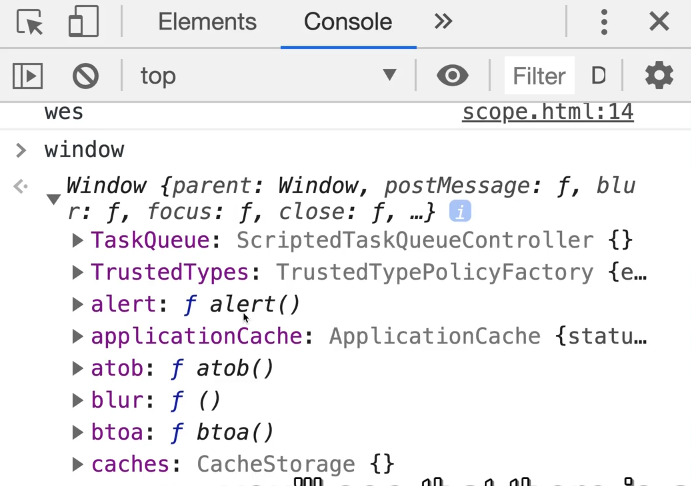

That is why sometimes you will see people doing things like `window.setTimeout()`. There is also just regular, old, `setTimeout()`, both are the exact same thing.

Methods that are globally available to us like `setTimeout()` are actually on the window object, and that is what is called global. 

There is one thing to know about `const` and `let`.

Let's say we added this code to `scope.js`.

```js
/*  eslint-disable */
const first = 'wes';
let second = 'bos';
var age = 100;
```

Id you reload `scope.html` in the browser and then in the console type in `first`, `second` and `age`, you will see the following values returned because they are all global variables 👇

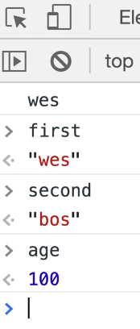

However, if you type in `window.first` and `window.second` you will get `undefined` but when you type in `window.age` it will return `100`. 


This is because `var` variables are attached to the `window` object and they are globally scoped, and `const` and `let` variables when declared like the example above are still globally scoped, they are just not attached to the window. 

That is not really all that important because you shouldn't be making global variables anyway. This was just to demonstrate why sometimes people write `window.` or just type the global variable directly. 

The same thing goes with functions. 

If we make a function `function sayHi(){console.log('hi!');}`, we can call it by the following methods:

1.  from a script tag on the html page like so: 👇

```html
  <script src="./scope.js"></script>
    <script>
      sayHi();
    </script>
```

2. typing `sayHi()` in the console
3. typing `window.sayHi()` in the console

Why is it available at `window.sayHi()`? 

Because anything that is in the global scope is attached to the window object with the exception of `const` and `let` variables. 

Using global scope is almost never a good idea, but before we learn why that is, we need to learn about how different parts of scope work. 

### Function Scope

Let's get rid of the `<script>sayHi();</script>`  code in `scope.html`. 

Remove everything within `scope.js` and then add  
```js
const age = 100;
```

Create a function `go()`, and the following logs 👇

```js
const age = 100;
function go(){
  const hair = 'blonde';
}
console.log(age);
console.log(hair);
```


When we `console.log(age)`, is it going to be 100? 
When we `console.log('hair')`, will it be blonde?

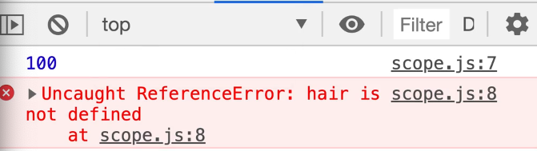

Age returns 100, but hair throws a reference error. 

Maybe that is because we did not run the `go()` function, we just defined it?

Let's try running the go function so that variable gets declared. Before `console.log(age);` add `go();`. 

If you refresh the page and look at the console, we will still see the error. Why?

This is the next type of scope which is called **function scope**. 

What function scope is, is when variables are created inside of a function, those variables are only ever available inside of that function. 

That means that anything we create inside of the `go()` function, is not available outside of that function, unless we were to explicitly return it and put it into it's own variable when that function is run. 

If you modify the `console.log(hair)` to be within the `go()` function, it will log. 👇

```js
function go(){
  const hair = 'blonde';
  console.log(hair);
}
```

You can think of the curly brackets in functions as gates. 

They keep the variables in and do not allow them to leak out. 

Now is that the same for the opposite? 

If we were to `console.log(age)` from within the `go()` function, would that work? 

If variables can't leak out, can they go in? 

If you refresh the page and look at the console, you will see it worked.

This is an interesting thing about javascript and most programming languages. 

Variables, if they are not found inside of a function, will go up a level higher and look for a variable in that scope. If it's not available in that scope, it will go up a level higher. _(We will talk about multiple nested scope in just a second)._ 

So what is happening is inside the `go()` function the code is saying, "there is no variable inside of this function called age, so I will go up one more level and look up". 

Now if we added as the first line of the `go()` function, `const age = 200;` and refresh the page, is that going to error? 

Is that going to be 200 or 100? 

It's will be 200. 

Two things: 
1. is that allowed? 
1. why it is 200?

It's 200 because it looks in the local function first and it does find a variable called age. 

However, if it is not found, it will go one level higher and look for it at that level. 

Why is this allowed? Why is it not breaking? If you hover over the variable in VSCode, you will see an error in ESLint that says 
> 'age' is already declared in the upper scope.


That is what is referred to as **shadow variables**. 

You can name variables the same thing, if they are not in the same scope. 

However, it's not a good idea because if you name a variable something that is the same as in another scope, you limit yourself to being able to access that. 

```js
const age = 100;
function go(){
  const age = 200;
  const hair = 'blonde';
  console.log(age);
  console.log(hair);
}
```

In the example above 👆, if we wanted to access the `age = 100;` from the `go()` function, there is no way to do that because the variable has been **shadowed** _(meaning it has been over-written)_.

A tip is that if you ever have a variable inside of a function that is very similar to a variable outside of a function, name the variable inside of the function more specifically so you have access to both. 

In this case, inside of the function you could declare a variable like `const myAge = 200;` instead of just calling it `age`. 

### Block Scoping 

The next type of scope is **block scope**.

We will start by talking about `var`, `let`, and `const` variables and how they are scoped differently.

`const` variables cannot be reassigned, and `let` and `var` variables can be re-assigned. They have a different way of how they are scoped. 

Let's do an example. 

Will the code below work 👇?

```js
if(1 === 1){
  const cool = true;
}
console.log(cool);
```


No, it throws the error shown above 👆
>Uncaught ReferenceError: cool is not defined

What if we make it a `var` variable instead? 

```js
if(1 === 1){
  var cool = true;
}
console.log(cool);
```

It works! 


What if we make it a `let` variable?

```js
if(1 === 1){
  let cool = true;
}
console.log(cool);
```

It doesn't work, we get the same error. 


What is happening there is whenever you have a set of curly brackets like in the if statement above, that is what is referred to as a **block**. _(Blocks will be showing up in most places, the most common is probably an if statement. We will have lots more examples throughout the course.)_

You can think of those brackets are gates. Those gates keep variables in. 

Anytime something that was created inside of these gates, they are not allowed to leave the gates. If you need to access a variable that was created inside of the gates, outside of the gates, you are not allowed to do it. 

There are a few solutions to that because every now and then you run into a situation where you do need a variable to be available outside of a block. 

What happens is you have to create the variable above it, as we will demonstrate in this example 👇

```js
let cool;
if(1 === 1){
   cool = true;
}
console.log(cool);
```

In that example, we have declared a variable `cool` without assigning anything to it. 

On the line that previously had `let cool = true;`, we do not declare the cool variable, we simply update it with `cool = true`. 

What that does it creates it's in the higher scope _(in this example it is a global variable but if this was created inside of a function it would be function scoped)_. 

Then, we update the variable, and then it's available to us outside of the function. 

Here is another example that is a more realistic, where we are getting into two different kinds of scopes 👇

```js
function isCool(name){
let cool;
if(name === 'wes'){
   cool = true;
}
console.log(cool);
return cool;
}
```

So what is going on here is we have one scope, which is the **function scope** (`function isCool(name){...}`). 

One thing that can get confusing is that a function also has a block, so any `let`, `var` of `const` variables are automatically scoped to a function, because regardless, if its a function or a block, it's a set of curly brackets so it's scoped to that. 

And then we have **blocked scope** which is within the `if(name === 'wes'){...}`. 

Again to demonstrate, if we changed the `cool` variable within the if statement to a const variable, like in this example, it would not work 👇

```js
function isCool(name){
let cool;
if(name === 'wes'){
   const cool = true;
}
console.log(cool);
return cool;
}
```

However, the example below does work 👇

```js
function isCool(name){
let cool;
if(name === 'wes'){
   cool = true;
}
console.log(cool);
return cool;
}
```

Although we went over how to solve the fact that variables are blocked scope, in most cases that is not something you need fixed, and it is actually really nice to have blocked scope because you don't have variables leaking out of it. 

In the past, we have had for loops such as the following:

```js
 for(var i = 0; i < 10; i++) {
   console.log(i);
}
```

That will log 0 - 9 as shown below 👇


If you type `i` in the console, it will return 10.


We have this random variable that is out floating called `i`, which should have been contained within the for loops but because it's a `var`, it has leaked outside. 

By simply making it a `let` variable, that random `i` variable will no longer be floating because it will be scoped to the curly brackets. 

Block scoping is one of the reasons people say use `const` by default, `let` when you want to re-assign it and don't use `var` unless there is a specific use case for it. 

To go back to our example earlier with `isCool()`, we could have also solved it by changing the `cool` variable to a `var` as shown below 👇

```js
function isCool(name){
if(name === 'wes'){
   var cool = true;
}
console.log(cool);
return cool;
}
```

Why does that work? 

Because it's a `var` variable. 

`var` variables are not block scoped, they are function scoped. 

That means they are available outside of the if statement block, but they are only available inside of the `isCool()` function. 

We will do another example of scope look-up to solidify that concept. 👇

```js
const dog = 'snickers';

function logDog() {
  console.log(dog);
}

function go() {
  const dog = 'sunny';
  logDog('sunny');
}

go();
```

What is going on here? 

We have a variable `dog` which is set to `"snickers"`. 
We have a function `logDog` that will log the `dog` variable. 
We also have a `go()` function that creates a variable named `dog` again, and sets it to the value of `"sunny"`.
Then we run that `logDog()` function, and then we run `go();`. 

When we call the `logDog()` function, is it going to log Sunny or Snickers?

You may think it will log Sunny because we declare the dog in the function scope, so when the function runs, shouldn't it look in it's own scope for that? 

Or you might think it may log Snickers because the function is declared within a `dog` variable inside of it so it will look up for that variable. 

What does it log? Snickers! 


Even though we ran the `logDog()` function within the `go()` function and that function has a locally scoped variable set to the value of Sunny, it's still logging Snickers. 

### Lexical and Static Scoping

That is because javascript is what is referred to as **lexical scoping** or **static scoping** _(those are buzz words in javascript)_. 

What that means is the way that variable look-up or scope look-up happens, is where the functions are defined, not where they are run.  

So even though the `logDog()` function is run inside of another function which has a locally scoped `dog` variable, it doesn't care about where it's run, it cares about where it is defined.

Because `logDog()` is defined where it is, since it doesn't have a local variable named `dog`, it will just go up one level.


Ideally the function `logDog()` would take a parameter of `dog` and then log whatever parameter value it is passed like so 👇

```js
const dog = 'snickers';

function logDog(dog) {
  console.log(dog);
}

function go() {
  const dog = 'sunny';
  logDog('Rufus');
}

go();
```

Now that console will log "Rufus". 
Why? 

Because when a function takes in an argument, it will make local variables inside of that function named whatever you named the parameter, and then that is available to them. 

It is the same as doing the following 👇

```js
function logDog(dog){
  const dog = whateverYouPassedInAsTheFirstArgumentToTheFunction;
  console.log(dog)
}
```

That is what javascript is essentially doing behind the scenes. It is taking the value that you pass the first parameter and making a local variable for the function. 


```js
function go() {
  const dog = 'sunny';
  logDog(dog);
}
```

The code  doesn't care what you called the variable that you as passing in, it just cares about the value. 

The example above  👆 is the same thing as just passing in a string of Sunny, as shown below 👇

```js
function go() {
  const dog = 'sunny';
  logDog('sunny');
}
```

We will go over best practices and many more examples in the course. 

**Best Practices**

1. Try not to create global variables 
    - it is fine for us to create them while doing these examples and when we get into modules, it is almost impossible to create global variables unless you explicitly do something like `window.IAMGlobal = 'wes'`. 
    - Unless you explicitly attach it to the window, with a module, it is very hard to create a global variable which is intentional.  


2. Functions are scoped the exact same as variables
  - You can create functions inside of other functions. _We will look at examples of why you might want to do that later_. 
  Here is an example in the meantime 👇

    ```js
    function sayHi(name){
      function yell(){
        console.log(name.toUpperCase());
      }
      yell();
    }
    ```

If you were to write `sayHi('wes')` in the console, it will return WES. 


However if you try to call the `yell` function outside of `sayHi()`, as shown below, it will throw an error 👇

```js
function sayHi(name){
  function yell(){
    console.log(name.toUpperCase());
  }
  yell();
}

yell();
```

What is happening there is just like variables, functions are scoped to the parent function. 

If you create a function inside of another function, that function will only ever be available inside of that. 

That is starting to open up what is referred to as a **closure**, which is a more advanced example we will go over in the future. 

It is possible to do a function inside of a function, but generally, you won't be doing that. 

---

## 18 - Hoisting

We talked about this a little bit before. 

Now we will get into the details about what it is, when you can use it and why you might want to use it. 

**Hoisting** in javascript allows you to access functions and variables before they have been creatd.

There are two things in javascript that are hoisted: 
1. function declarations
2. variable declarations. 

### Hoisting Function Declarations

We will focus on function declarations first. 

Make a `hoisting.html` file in the `/playgrounds` directory and give it the base html. 

Add a script source of `./hoisting.js` and create a new Javascript file with that name.  

Do our usual `console.log('It works!');` to check that it works.

Next, make a function `sayHi();`. 

If you try to run this function before it  exists, will it work? 

You can see ESLint is complaining with warning of:
>`sayHi` was used before it was defined. eslint(no-use-before-define)


```js
sayHi();

function sayHi() {
  console.log('hey!'); 
}
```

If you open `hoisting.html` in the browser, does it work? 

It does. 

Why is that?

When you run your javascript file, the Javascript compiler will take all of your function declarations and move them to the top of the file so they are all available before you use them. 

Because of hoisting, you can technically run a function before it exists. 

Let's do another example. 

Add the following function 👇

```js
function add(a,b){
  return a + b;
}
```

Now use that function within `sayHi()`, like so 👇

```js
sayHi();

function sayHi() {
  console.log('hey!'); 
  console.log(add(10,2));
}
function add(a,b){
  return a + b;
}
```

Is that going to work? 

It does. 


That is because hoisting moves them to the top before it will actually run anything.

So javascript rearranges the file and puts all the variable and function declarations at the top of the file. 

Why does that functionality exist? 

Wes hardly ever uses hoisting, he prefers to declare his functions before using them. 

When we get into modules, he prefers to put his separate functions in a module like util functions or math functions, and then import them as he needs them.

One argument Wes has heard for hoisting being useful is people often prefer when opening up a file, say you open up `hoisting.js`, they much prefer to first be able to see _what_ does this file do, and then _how_ does this file do it. 

That way if you are quickly jumping into a file, you can quickly see from the first couple of lines "what does this file do". 

If you do care about how it does it, you can go a bit further down into the file and see what it does, as shown below 👇

```js
/* What does this file do? */
sayHi();

/* How does this file do it? */
function sayHi() {
  console.log('hey!');
  console.log(add(10, 2));
}
```

Personally, Wes doesn't use this method very much and doesn't like it all that much but that is just his personal opinion.

### Variable Hoisting 

The other type of hoisting is called **variable hoisting**. 

If you were to go the top of the file and add 👇

```js
console.log(age);
var age = 10;
```

What will happen? Is it going to error? Undefined? 10?

The value is undefined. 


If you try to log another variable that does not exist, you will get an error 👇


Why is that? 

What is happening is that javascript will hoist the variable declarations but it will not actually hoist the setting of the values. 

So if after the page is loaded, you type `age` into the console, it wil be set to 10. 

So what Javascript does is it says before everything runs, I am going to make my variables and then I'm just going to go ahead and update them. 

It is basically doing the equivalent of the following 👇

```js
var age;
console.log(age);
age = 10;
```

You can use hoisting to figure out if variables are created but not what their values are later in the file.

Hoisting is when variable declarations and function declarations that are hoisted to the top of the file. 

Only function declaration types of functions are hoisted, **not** function expressions (when you put a function in a variable). 

Same thing goes with arrow function or any other type of function. 

---

## 19 - Closures

**Closures** is one of the scariest words in javascript and a concept that comes up all the time in javascript, especially in interviews.

It's a hard  concept to get, but it can be relatively simple to understand. We will tackle now understanding of the basics of what a closure is. 

As we build stuff, Wes will mention when something is a closure to give us more context and examples of when closures are used.

Create a new file  `closures.html` in the `playground` directory and add our HTML base.

Open up a set of script tags. Our examples will go within the script tags, like so 👇

```html
<!DOCTYPE html>
<html lang="en">

<head>
  <meta charset="UTF-8">
  <meta name="viewport" content="width=device-width,initial-scale=1.0">
  <title></title>
  <link rel="stylesheet" href="../base.css">
</head>

<body>
  <script>
  //examples go in here
  </script>
</body>
</html>
```

A **closure** is the ability to access a parent level scope from a child scope, even after the parent function has been terminated. 

Normally, Wes doesn't like examples that are not real world but since this is a tough concept, we will start with a simple example. 

We are going to make a function inside of a function, called `inner` and `outer` to illustrate the concept and then we will get into more fun examples. 

Create a function `outer` and within it set a variable `outerVar` equal to "Hey I am the outer var". 

Now inside of that, make another function called `inner()` and within it declare the following variable 👇

```js
const innerVar = 'Hey I am an inner var";
``` 

In the previous lesson on scope, we learned that within the `inner()` function, we can add a log of the `innerVar` variable like so 👇

```js
console.log(innerVar);
``` 

You can also log the `outerVar` within the `inner()` method because of the scope lookup chain. 

Since there is no variable called `outerVar` in that function, it will go a level up to the `outer()` function and since it finds that variable there, it will use that variable.

```js
  function outer(){
    const outerVar = 'Hey I am the outer Var';
    
    function inner(){
      const innerVar = "hey I am an inner var";
      console.log(innerVar);
      console.log(outerVar);
    }   
  } 
```

Now, let's try calling `inner()` from within `outer()`, and open the browser and console ad run the `outer()` function from the console. 

You should see both the inner and outer variables. 


The same thing would happen if you called it from within the html script tag like so 👇

```html
<script>
  function outer() {
    const outerVar = "Hey I am the outer Var";

    function inner() {
      const innerVar = "hey I am an inner var";
      console.log(innerVar);
      console.log(outerVar);
    }
    inner();
  }
  outer();
</script>  
```

The `inner()` function is able to do a scope lookup and see the `outer`. We have already learned about that, and that's not really a closure. 

Now the kind of interesting thing, and this is where closures come into play, is where you don't call the `inner()` function from within the `outer()` function but you call it at a later point in time. 

So let's not call it from within `outer()`, remove that line of code where we are calling `inner()` and also remove the call to `outer()`. 

From the `outer()` function, let's return the `inner` function. You can return it two ways.

The first way is shown below 👇

```html
<script>
  function outer() {
    const outerVar = "Hey I am the outer Var";

      return function inner() {
      const innerVar = "hey I am an inner var";
      console.log(innerVar);
      console.log(outerVar);
    }
  }
</script>
```

The second way is like so 👇

```html
<script>
  function outer() {
    const outerVar = "Hey I am the outer Var";

      function inner() {
      const innerVar = "hey I am an inner var";
      console.log(innerVar);
      console.log(outerVar);
    }
    return inner;
  }
</script>
```

We will go with the second one and after the `outer()` function, we will add 👇

```js
const innerFn = outer();
```

What we are doing there is:
 - we are running the outer function
- it's creating an outer variable (`outerVar`)
-  then we are returning the inner function, which is why we are sticking it in a variable (`innerFn`).

In the console, when you type `innerFn` it will return the `inner` function like so 👇


The question is, if you were to run `innerFn()` right below the function expression, is the `outerVar` still going to be accessible or will it be `undefined`?  

```html
<script>
  function outer() {
    const outerVar = "Hey I am the outer Var";

    function inner() {
      const innerVar = "hey I am an inner var";
      console.log(innerVar);
      console.log(outerVar);
    }
    return inner;
  }

  const innerFn = outer();
  innerFn();
  
</script> 
```

We ran the `outer()` function on this line of code `const innerFn = outer();`, which is where it created the variable, and then it returned the inner function. 

Is that still going to be available to us or will it be `undefined`?  

If you try that code, you will see that they both work. 


What you can do is stick a function into a variable, and then at a later point in time, you can have access to that function. A closure comes into play because you can access the function even though the outer function is done. 

We learned in scoping that when a function is done,  anytime there are scoped variables that aren't returned from the function, they are not accessible. 

Now we get this weird thing where when we run the function outside of it, it's still able to access it. That is what is referred to as a **closure**. 

Javascript is able to create functions inside of functions, and it can still reach outside to the parent scope, and even though the outer function is done running, it will still maintain that variable in memory so that we can then access it at a later time. 

The variable is not **cleaned up** or "**garbage collected**" which is a term that is often used. 

Why would that be helpful? It looks very confusing. 

### Examples of Closures

Let's look at some actual examples.

First, we will go over an example of a closure creating a function which is what we just went over. 

The second example will be how you can use closures to create what are called **private variables**. 

Comment out the previous code we had added in the script tags, and add the following 👇

```js
 function createGreeting(greeting = "") {
    const myGreet = greeting.toUpperCase();
    return function(name) {
      return `${myGreet} ${name}`;
    };
  }
```

This function:
- takes in a greeting, the default of which is an empty string
- assigns it to the `myGreet` variable which takes the greeting that got passed in to the function
- then runs `toUpperCase()` against it.  

From there, we will return a function, which we don't have to name, which will take in the presons name and return a greeting.

Why is that helpful? 

Why did we do this in two separate functions? 

Because you can create functions that are based off whichever greeting you like. 

```js
const sayHello = createGreeting('hello');
const sayHey = createGreeting('hey');
console.log(sayHello('wes'));
console.log(sayHello('kait'));
console.log(sayHey('kait'));
```

If you refresh you will see the following in the console 👇


What is happening here is that when we create the outer function `createGreeting(){...}`, we had created a variable inside of that function, which is then accessed at a lower scope. 

We've got inner scope here 👇


And we have outer scope here 👇


Since our inner scope references a variable that was created in our outer scope, that is what is referred to as **closure**. 

We still are able to access our outer variables inside of the outer function scope, inside of our inner even after the `createGreeting()` function has been closed over. That is the whole idea behind closures, it's been closed. 

That is the first example where you have functions inside of functions and they are able to access the closure data inside of that. 

### Private Variables

The other sort of similar way is to create something called **private variables**. 

We will demonstrate it with another example.

We are going to create a function, `createGame` that will take the name of the game as a parameter. 

Inside of the function we will declare a variable `score` and another function `win` within, in which we will increment the score and return a string with the name of the game and the score. 

Next we will create a variable `hockeyGame` and assign it to the `createGame()` function where we will pass "Hockey" as an argument. 

Add the following code 👇

```js
function createGame(gameName){
    let score = 0;
  return function win(){
      score ++;
      return `Your name ${gameName} score is ${score}`
    }
}
const hockeyGame = createGame('Hockey');
```

_(Note: if you forget to add the `return` keyword that is in front of the `win()` function, when you try to run `hockeyGame()` in the console, it will throw an error saying `hockeyGame is not a function`.)_

Now, whenever we run the hockey game function, a message will be logged in the console showing the incrementing score. 


What is happening there is the function that we create is called `win()`, and we are using a `score` variable. 

So whenever we create the game, we create an empty score variable. 

And then the inner function, whenever we actually run it, will increment the score variable that is of the outer scope. 

Why is that helpful?

That allows you to maintain multiple games at once.

Under the `hockeyGame` variable, we will declare another variable, like so 👇

```js
const soccerGame = createGame('Soccer');
```

Now we can do this in the console 👇


Even though the `score` variable 👆 is the same variable name, because we have created two separate `win()` functions by using the `createGame()` function, they each have their own private variable score. 

Currently there is no way for us to access `score`. 

If you try to access it in the console, you will get an error like the following
> score is not defined

There is no way for us to access that unless we were to explicitly return that variable or as we did in this example, by putting it into a string. 

To recap:

Closures are the ability of a child function, or an inner function, to access variables from a higher level scope even after the functions have been called or closed or closed over. 

---

# Module 4: The DOM - Working with HTML and CSS

## 20 - The DOM - Introduction to the document

So far, everything we have been learning has been javascript as part of the core languages. 

Although Javascript can be run in many environments (browser, server, robots), a lot of places use javascript as a scripting environment. 

The most popular way to run javascript is through the web browser, and a big part of that is interacting with elements on a page. 

When you write HTML and view it in the browser, the browser turns your HTML into something that is called the **Document Object Model** or **the DOM**. 

That is what you see when you go to the elements panel in the developers tools on any website. 

It is not actually just the HTML that you have written, it takes that, converts it to the **Document Object Model**, and it allows us to interface with the DOM via javascript. 

We can do things like listen for clicks and scrolls. 
We can add, move, remove elements from that page or things like text, images, etc. 
We can add and remove CSS classes from elements which can trigger animations.
We can fetch new data. 
We can play music and video.
We can add any type of interaction to the page.
... and that is done by writing javascript that interfaces with the DOM (the things that are on the page, the elements on the page).

The DOM is represented in a tree that looks very much like HTML. 

Even if you are using a framework like React, Angular or Vue, it's very helpful to understand that core concepts of the DOM like events, elements and classes, because they transcend all of the different framesworsk. 

Even if the frameworks help you do these things, you still need to know how it works under the hood. 

### `window` Refresher 

A quick refreshed on the Window. 

In the scope video, we learned that the global scope in the browser is called the `window`. 

The window is where are our global variables are stored, as well as helpful properties like `window.location`. 


_👆 Aside: if you go to any website and in the console type in `window.location` or `location` it will return to you the websites url and a whole bunch of information, as demonstrated above._

It returns an object full of information like the current page you're on, the host name, what hthete protocol is, if we are on a specifc port it would be showing us that info. 

We can also find things like `innerWidth`, which will tell us how wide the browser is if you type it in the console. 


You can think of the `window` as everything about the currently opened window.

That includes:
- the browser bar
- the tabs 
- the scroll bar
- basically all of the things about your browser window are generally stored inside of the window object 

### `document` Introduction

The document is responsible for everything from the opening HTML tag `<html`>, the doc type as well, to the closing HTML tag(</html>). 

The difference is the document is not concerned with tabs, and outside, it's just concerned with the entire `DOM`. The entire document will be available to us with the `document` keyword. 

If you type `document` into the console and hover over what it returns, you will see that it highlights the entire page


### The `navigator` 

There is also something called the `navigator`. 

The `navigator` is sort of just a higher level thing than the window that gives you information not just about the browser, but the device itself, the device that it is on. Think about things like web cam and audio access, battery levle, GPS coordinates.

Things that are device specific will live on the navigator. 

Right now you just need to know that there is the `window` which contains a lot of information about the browser but the `document` is going to contain everything about the current web page from the opening HTML to the closing HTML tag. 

In the next video we will get into selecting elements on the page. 

---

## 21 - The DOM - Selecting Elements

For this lesson, we will be working out of the `/exercises/20 - The DOM/` folder which Wes has already created for us. 

Within that folder there are two files: 
- `index.html` 
- `the-dom.js` _(the javascript file should be empty)_. 

Open up `index.html` in the browser. 

### Where to Load Javascript When Selecting Elements

The first thing we need to talk about is where to load our javascript if we are selecting elements. 

To demonstrate this, we are going to jump ahead of ourselves briefly and grab an element from the page. 

Add the following the the javascript file 👇

```js
const p = document.querySelector('p');
console.log(p);
```

If you wanted to load this javascript into the `index.html`, you might think you want to add it inside of the head tag, as shown below 👇

```html
<head>
  <meta charset="UTF-8">
  <meta name="viewport" content="width=device-width,initial-scale=1.0">
  <title>The DOM</title>
  <link rel="stylesheet" href="../../base.css">
  <script src="./the-dom.js"></script>
</head>
```
Let's try that. Reload the page, which will cause the Javascript to run, then open up the dev tools and take a looka t what was logged in the console. It should be null. 


What we are doing in the Javascript code we just added is we are trying to select something on the page, and then log it. 

If you try to run `document.querySelector('p')` in the console, it will return an element like so 👇


Why does it work in the console, but not when we loaded it via Javascript?

It is not working because our Javascript is being loaded before our HTML is created. That causes the Javascript to be downloaded and run before the actual elements have been created on the page. 

There are ways to get around like _(such as `async` and `defer` attributes)_, but it's better to just put the script tag right before the closing body tag.

That will ensure that all your HTML is first downloaded and parsed to the page before the Javascript is run. 

If you move your script tag to right before the closing body tag and refresh the page, you will see the exact same code works.

There are other ways around it.

One of those ways is putting all the js code inside of a function, and then adding an event listener that listens for the DOM content loaded event and runs the `init()` function we created when that happens. 👇

```js
function init(){
  const p = document.querySelector('p');
  console.log(p);
}
document.addEventListener('DOMContentLoaded', init);
 ```

Move the script src back inside the `<head>` tag. 

This is getting ahead of ourselves but if you refresh the page, you will see that it works now even though the script is in the head. 

What we are doing is delaying the code that actually runs until all of the DOM content has been loaded to the page. 

If you move the script back to right before the closing body tag, you will see that it still works. 

It's easier to not need to use an event listener like that and just include the script tag before the closing body tag so that is what we will be doing!

### Selecting DOM Elements

Before you actually work with elements on the page, you will need to go get them, which we refer to as selecting them. 

You need to be able to access the specific element on the page (whether an `h2` `tag`, `div`, `button`, `image`). 

Once we have it we can do things like listen for clicks, change the content, add content to it. 

There are sort of two main ways of selecting elements, which are the only two that Wes uses: 
1. `querySelector()` 
2. `querySelectorAll()`. 

Generally you are using them on the `document` although that is not always the case.

```js
const p = document.querySelector("p");
console.log(p);
```

In the example above 👆 we have selected something with a `p`. 

Both `querySelector()` and `querySelectorAll()` take one argument, which is the CSS selector. Those are almost the exact same selectors that use in CSS. 


If you open up the `index.html` in the browser, you will see we have grabbed a paragraph tag. When we loga it, you will see we have the item there. 

`querySelectorAll()` will give you multiple elements, whereas `querySelector()` will give you the first matching one. 

Let's demonstrate that by making another variable called `divs`. 
Add the code below 👇

```js
const p = document.querySelector("p");
const divs = document.querySelectorAll("div");
console.log(p);
console.log(divs);
```

If you reload `index.html` you will see that we get something in the console called a **NodeList**. 


We will be learning about arrays in the future and NodeLists look a lot like arrays. It is a frequent interview question that you might hear, that a node list is not an array. 

It is a list of things, but there are a few differences which we will go through in the future. 

The short and skinny is that it does not have all the methods that an array does like `map`, `filter` and `reduce` built into it. 

If you hover over the NodeList in the console, you will see that it is grabbing everything that matches the selector (`div`). 


You can get more specifc than using elements as selectors. 

```js
document.querySelectorAll('.item');
```

You could say give me anything with a class of `.item`, as shown above 👆 

Let's say you only wanted `divs` with a class of `item`. You would then use 👇

```js
document.querySelectorAll("div.item");
```

You can also do parent child selectors. 

If you only wanted to grab an image inside of an `item` div, you could achieve that using the code below.  👇

```js
const divs = document.querySelectorALl('.item img');
```

If you wanted to just select the first `item` and then the image inside of it, you could add the code below instead, which will return the first match. 👇

```js
document.querySelector('.item img')
```

Let's say the other item div also has a class of `item2`.  

```js
const item2 = document.querySeletor('.item2');
```

You could add the following code 👇

```js
const item2 = document.querySeletor('.item2');
```

#### Searching Inside Already Selected Elements

If you want to search inside of an element that you already selected, you can use querySelector on any other element like so 👇

```js
const item2Image = item2.querySelector('img');
```


If you ever need to narrow down your focus as to where you are searching, you can do that in your selector, but you can also run `querySelector()` and `querySelectorAll()` on any other element and only search within it to limit the scope. 

```html
<h2 id="wes">Sub Div</h1>
```
If you have an element with an id, as shown in the code above 👆, you would be able to grab it using `document.getElementById('wes');`. 

Notice how you don't put the `#` sign before 'wes'? 

That is because if you're using anything that's not query selector, you don't have to pass `.` or `#`. 

The same works with `document.getElementsByClassName()`, but you don't pass the `.` from the classname. 

You can get all the work done with `document.querySelector()` and `document.querySelectorAll()` however, and they are much more flexible. 

---

## 22 - The DOM - Element Properties and Methods 

Now that we know how to select elements, let's go over what we can do with them. 


Start by selecting an `h2` element from the page and logging it. 👇 


Although in the console it looks like the `heading` variable is the actual element, in reality it is an object that has a lot of properties and methods inside of it. 

If we change the `console.log()` to a `console.dir()`, that will show us the object properties instead of the actual element itself. 


It's still the same `h2` tag, but you can see all the properties on it. 

One example of that is `parentElement` which shows you what the parent element is. 

There is `outerText` `textContent` `outerHTML`, and many other properties. 


### Getters and Setters

We can use those properties as getters to get the data from the element that we need, or we can use them as setters. 

We will demontsrate this using `textContent`. 

```js
const heading = document.querySelector('h2');
console.dir(heading.textContent);
```

 

The code above is an example of a getter. 

A setter is when you update the property. 

An example of that would be `heading.textContent = 'Wes is cool';`. 

Now when you reload the page, you will see Wes is cool in the console.

#### `textContent` and `innerText`

`textContent` and `innerText` are very similar properties, `textContent` is the newer one. 

The only difference is that `innerText` returns only the human readable content whereas `textContent` will get the contents of all of the elements, including script and style elements. 

```html
<h2>
I am a heading
<style>
  h2 {
    color:red;
  }
</style>
</h2>
```

Let's say your `h2` looked like the code above for some reason 👆

If you log both the `heading.textContent` and `heading.innerText`, you will see that `textContent` includes the content within the style tag whereas `innerText` only returns the text `I am a heading`. 


`textContent` returns every element in the node. 
`innerText` is aware of styling and won't return text of hidden elements. 


Let's say you have the following code 👇

```js
<h2>
I am a heading!
<span>I am hiddden!</span>
</h2>
<style>
  h2 span {
    display: none
  }
</style>

```

`textContent` will return the "I am hidden!" text, however `innerText` will not. 


We have a set of properties when working with HTML. If we were to log the `innerHTML` of the `h2`, you would see 👇


There is also `outerHTML`, which should include the `h2` tag and whitespace that goes inside of it. 


If you ever want to add text onto something is another useful thing to learn. 

### Exercise

Go to `index.html` and modify the code as shown below 👇

```html
<article class="item">
  <h2>Im an article</h2>
  <p class="pizza">This is how many pizzas I ate! 🍕</p>
</article>
```

What we are going to do is build something to add more pizza emojis to the end of it. 

First we need to select it. 

```js
const pizzaList = document.querySelector('.pizza');
console.log(pizzaList.textContent);
```

To update the `textContent` we could use the code below 👇

```js
pizzaList.textContent = `${pizzaList.textContent} 🍕`;
```

That will take what was already there and adds a pizza emoji to the end. 

That method can be slow in some applications that have lots of text and html, because it causes the browser to re-render the entire list.

### `insertAdjacentText` and `insertAdjacentElement`

To fix that, what we can do is add text onto the end using a different method, either  `insertAdjacentElement` or `insertAdjacentText`

That will give us the ability to add stuff to the back or the front of it. 

```js
pizzaList.insertAdjacentText()
```

If you go to MDN and search for `insertAdjacentText()` you will see that it is not a property, it is a method, meaning it is a function that we run _against_ the element, like we do for `querySelector` and `querySelectorAll`. 

It takes two arguments: 
1. the position (`beforebegin`, `afterbegin`, `beforeend`, `afterend`)
2. the text that you want to pass it. 

MDN says the second argument is element but it's actually just the raw text you want to add. 

Add the following code 👇

```js
pizzaList.insertAdjacentText('beforeend','🍕');
```

If you refresh `index.html` you should see two pizza emojis now. 

It works the same as the other way we tried earlier, however this is the best way to attach text to the end of something. 

If you were to try  👇

```js
pizzaList.insertAdjacentText('beforebegin','🍕');
```


That will put the pizza emoji before the paragraph entirely, it's not inside of that element. We would want to use `afterbegin` to add the pizza in front of the text.


The browser actually knows that the pizza emoji was added later, because the text is split up between what we used to have and what we inserted. 


That is actually the difference between elements and nodes. 

**Nodes** can be anything, but an actual **element** is something that is wrapped in a tag. 

It is a little bit confusing because everything is a node, and it only upgrade itself to an element if you have wrapped it in a tag. 

If you are wondering what all the possible methods are, we will stumble upon different properties and methods as we build out our excercises. 

You can go to the MDN docs and go to element, it will tell us what all the properties are of elements. 


That wraps up elements. We covered how to get properties from an element, how to set properties on an element and how to use more powerful methods on each of our elements or nodes. 

---

## 23 - The DOM - Working with Classes

In Javascript, it is common to need to add and remove classes.  

Let's demonstrate how to do that, starting by commenting out all the code within `the-dom.js`. 

When you select an element, it will have a `classList` attribute on it, and that attribute has methods on it for adding and removing multiple classes. 

We will do an example with animation. 

Duplicate one of the image tags and add it right after the opening body tag, and give it a class of nice. 👇 

```html
<body>

```


Within `the-dom.js`, add the following code to select the element using the class of `nice`, and then we will log the `classList` attribute of the element. 

```js
const pic = document.querySelector('.nice');
console.log(pic.classList)
```


In the console we get a **DOMTokenList** which is kind of like an array of all the classes that are on that image. 

In the HTML file, add a class of `cool` to the image as well. 

When you refresh the page, you will see that we get both of them as well as a value of all of the classes.  👇


If you look into the **prototype** _(we haven't learned what that is yet)_, you can see which methods are available to call against the thing we have.  

`classList` has many methods. 

To name a few, there is 
- `add`
- `remove`
- `contains`
- `foreach`. 

A lot of those are methods for working with classes which is exactly what we are going to do.


Within VSCode, as you type, you may have noticed that you get a dropdown of methods available to you. 👇


### Adding a class

We are going to use `pic.classList.add()` to add a class of 'open'.

```js
const pic = document.querySelector(".nice");
pic.classList.add("open");
console.log(pic.classList);
```

Refresh the page, and inspect the image element. You will see the image now has a class of open. 

### Removing a class

What if we wanted to remove the class of "cool" which already exists on the element? 

You could do that with the following code 👇

```js
pic.classList.remove('cool');
```


### Toggling a class

There is also `toggle` which is pretty cool. 

Let's write a bit of CSS so we can visually see what is going on.

In our `index.html` add a style tag somewhere on the page with the following styles 👇

```HTML
<style>
.round {
    border-radius: 50%;
  }
</style>
```

Now using Javascript, we will add a class of `round`. 

```js
pic.classList.add('round');
```

Now the element has the class of round and makes the image circular. 


We can add and remove that class either by pasting it into the console or on click. 

We will go over both.

Replace the `add` method used above with `toggle()`. 

`toggle` will add the class if it is not there, and remove it if it is. 

```js
pic.classList.toggle('round');
```

If you copy and paste that line of code into the console, you will see that the class is being added and then removed. 


If we go into our CSS and add a transition all for .2 seconds, that will give us an animation when the class is toggled. 

```css
img {
  transition: all 0.2s;
}
.round {
  border-radius: 50%;
  transform: rotate(1turn) scale(2);
  box-shadow: 0 0 10px black;
}
```


Quick peak ahead _(we will be learning about events later)_, you can do something like the following 👇

```js
function toggleRound(){
  pic.classList.toggle('round');
}

pic.addEventListener('click', toggleRound);
```

What we are doing there is saying when the pic element is clicked, we want to the trigger the function called `toggleRound()`, which will toggle on and off the class of `.round` for the image element. 

You can add the following styles to the `.round` class also for a rotation transition...


```css
.round {
  border-radius: 50%;
  transform: rotate(20deg);
}
```

The CSS added 👆 above will give you the transition shown below 👇


```css
.round {
  border-radius: 50%;
  transform: rotate(2000deg);
}
```

To get the transition effect below 👇add the code shown above 👆


```css
.round {
  border-radius: 50%;
  transform: rotate(1turn) scale(2);
}
```

The code above  👆gives you the effect below 👇


A lot of javascript interaction is just adding and removing classes at different points in time. That allows javascript developers to use CSS to add and remove transitions. 

That is common with modals and navigation which open and close, and we will be going over lots of examples of that throughtout the class.

### The `contains` Method

There is also the `contains()` method, which you would use like so 👇

```js
pic.classList.contains('open');
```

It will return a boolean value of `true` or `false` based on whether that element has the class or not.  

That is useful when you want to check the current state of an element by looking at it's class list. 

In the next video we will go over regular attributes. 

Even though `class` is an attribute, `classList` gives us some utility methods for working with it. 

Whenever Wes needs to work with classes, he uses `classList` which is a few years old but fairly newer. 

---

## 24 - The DOM - Built in and Custom Data Attributes

When you are working with HTML elements, those elements have something called **attributes**. 

Attributes are anything provided to an element as additional information. Things like classes, src, alt are all attributes. 

Attributes work the same way as the other properties that we have been working with, so we will go over it quickly before getting into custom and data attributes.

To add an alt attribute to the image element we were using in the previous video, you would add the following javascript code 👇

`pic.alt = "cute pup";`

_TIP: When adding alt attributes to images, the value of the alt text should describe the image. You do not need to include in the text that it is a photo, because screen readers will specify that._

Although we did not add the alt attribute when we authored the element, when we added it via javascript, you can now see it on the element. 


We can also set the width of the image this way, by adding the code below 👇

```js
pic.width = 200;
```

Most attributes are both **getters** and **setters**, meaning we can set the attribute, and retrieve the attribute value. That allows us to do both of the following 👇

```js
pic.alt = 'Cute pup'; //setter
console.log(pic.alt); //getter
```

Some attributes however are only getters, such as `naturalWidth`. 

If you add the code below, we get zero 👇 

```js
console.log(pic.naturalWidth);
```


However, if you copy and paste that in the console and run it, you get a value of 600 back. 


Why is it zero when we log it from the javascript file, but running the code in the console returns 600?

This is a problem that you frequently run into, which is that we have to wait for the image to actually be downloaded for us to know how large it is. 

This is a big problem when people were building slideshows. 

How can you overcome this? One option is to add an event listener on the load event.

What that will do is wait for all the images, resources, CSS, Javascript, and anything that needs to be loaded to load before calling the function. 

```js
window.addEventListener('load', function(){
  console.log(pic.naturalWidth);
});
```

When you refresh your HTML page now, after a split second, you should see the naturalwidth value logged in the console. 

You can also use the event listener specifically on an image. 

Modify the code we added like so 👇

```js
pic.addEventListener('load', function(){
  console.log(pic.naturalWidth);
});
```

That still works, because once the image is loaded, the event listener will fire.  

_(All of that event listener stuff is a bit ahead of ourselves, we will be covering it later in the course, but it's good to know some of the gotchas that you may encounter.)_

You might be asking yourself 
>"We added our javascript script src tag at the end of the html file, doesn't that mean that is waits for everything to be loaded?"

Yes, putting the script at the bottom of the HTML page waits for all the HTML to be loaded.  However, if the HTML goes ahead and makes additional requests like downloading images, it doesn't wait for those. 

Getting back on track, we were discussing how `naturalWidth` is only a getter.

```js
pic.naturalWidth = 200;
```
If you try to set it with the code above 👆, it won't error out, but it won't do anthing.That is because it is an attribute that you cannot change. 

All attributes on an element are done via getters and setters.

You can use the **dot notation** to access them. 

You may have run into these methods already:
- `getAttribute`
- `setAttribute` 
- `hasAttribute`

You can use `getAttribute` like so 👇

```js
console.log(pic.getAttribute('alt'));
```


You can use `setAttribute` like so 👇

```js
pic.setAttribute('alt', 'REALLY CUTE PUP');
```


And there is `hasAttribute` which will return true or false based on whether that attribute is set on an element or not. 

```js
console.log(pic.hasAttribute('alt'));
```

What is the difference between using `getAttribute` and using the dot notation to grab the attribute? 

The difference is that `setAttribute()` will also work for things that are non-standard. 

We have HTML as a spec, and you have all of your standard attributes in   the spec like `alt`, `title`, `width`, `src`, and all of those things. 

But if you want to set an attribute that is non standard (_which you shouldn't do, more to come regarding that)_, you can use setAttribute to make something. 

For example, 👇

```js
pic.setAttribute('wes-is-cool', 'REALLY CUTE PUP');
```

 7:07

You should not go making your own attributes whenever you want because it is possible that in the future, an HTML standard attribute will be introduced with the same name as one of your custom attributes. 

Then you would end up with a situation where you have legacy code that is clashing with the standards which will lead to bugs. 

### Data Attributes

If you do want your own custom attributes, you want to use **data attributes**. 

To demonstrate what data attributes are, we will do an example. 

In the HTML page, duplicate an image tag 3 times and add a `data-name` attribute to each, like so 👇

```html


```

In this example, we wanted to attach a piece of metadata to each of the images. 

If you want to attach metadata or something to an element that does not have any sort of standard attribute like a name attribute, then you can use `data-` anything. 

For example: `data-dog`, `data-name`, `data-description` are all valid data attributes. 

That will allow you to attach metadata to an element. 

 9:12

Let's say we wanted to grab the image with the class of `custom` and access the data attributes on that image. 

You might mistakenly think we do something like this 👇

```js
const custom = document.querySelector('.custom');
console.log(custom.data);
```

However, that will not work, and will return `undefined`.

If you want to access the data attributes on the element you would call `dataset` like so 👇

```js
const custom = document.querySelector('.custom');
console.log(custom.dataset);
```


That gives us an object that is full of all the property values that you have. 

`data-name` shows up as the `name` property in our object, and if we had multiple data attributes on the same image, as shown in the code below, they would both be present in the object. 👇

```html

```

 10:15

Why would this be useful? 

This is useful because we can do things like listen for a click on an element, and when someone clicks on it, we can alert them. 

Take the following code for example 👇

```js
custom.addEventListener('click', function(){
  alert(`Welcome ${custom.dataset.name} ${custom.dataset.last} `);
});
```

If you add that, and then click on the image, you would get an alert, similar to the one shown below.


Wes loves using data attributes when coding **vanilla javascript**.

To recap: anytime you need a custom attribute, such as when you need to associate some sort of information with an element, use the custom `data` attribute. 

---

## 25 - The DOM - Creating HTML

In this lesson, we will learn about creating elements. 

Create the file `creating.js` within the `20 - The DOM` folder. 

In the `index.html` file we have been using so far, replace the script source to point to `creating.js` instead of  `the-dom.js`, as shown below 👇

```html
<script src="./creating.js"></script>
```

There are a few ways to create HTML in Javascript. The main way is using `document.createElement()`. 

Let's look that up in MDN. 

 00:54

To use this method, you pass it a tagName and then there are optional options you can pass _(you can tell it's optional because of the square brackets)_, which we won't be using. 

Let's try to make a paragraph tag using this method. 

```js
const myParagraph = document.createElement('p');
console.log(myParagraph);
```

When you open the HTML file, you will see the paragraph in the console but it is not visible on the page. 

That is because we haven't actually put it on the page yet, we just created it and it's living in what is called **memory** right now. 

 2:05

There is no shortcut to create an element with a class or with a set attribute, so something like the code below would **not** work 👇

```js
const myParagraph = document.createElement('p.special[title="hey"]');
```

If you want to add or get attributes from it, you must instead do it the way we have learned, as shown below 👇
 
```js
const myParagraph = document.createElement('p');
myParagraph.textContent = 'I am a p!';
myParagraph.classList.add('special');
console.log(myParagraph);
```

 2:57

We now have that paragraph with a class of `special` and the text content that we supplied it with. 

Let's create a few more elements before we get into how to actually insert them into the DOM. 

First create an image element as shown below 👇

```js
const myImage = document.createElement('img');
myImage.src = "https://picsum.photos/500";
myImage.alt = "Nice photo";
console.log(myImage);
```

Next, create a div with a class of `wrapper` and log it. 

```js
const myDiv = document.createElement('div');
myDiv.classList.add('wrapper');
console.log(myDiv);
```

Now we have created 3 elements:
- a paragraph
- an image 
- div

How do we add it to the page? 

We use another API called **appendChild**. To use it, you have to first select an element to call `.appendChild()` against. 

If you want to add the element directly into the body, you can grab the `document.body` and insert it. 

`document.body` is available to us because the `document` element gives us access to the `body` element quickly via a property. Not every element is as easily accessible to us like `body` is. 

Let's look up `appendChild()` in MDN. 

It takes in one parameter, which is a child reference. 

 5:54

```js
document.body.appendChild(myParagraph);
```


This gives us a `p` tag right before the closing `body` tag. 

`appendChild()` can be called against any node, so we can do something as shown in the code below 👇

```js
document.body.appendChild(myDiv);
myDiv.appendChild(myParagraph);
myDiv.appendChild(myImage);
```

 7:02

It is probaby better to do that in reverse order. Why? 

Everytime you use `appendChild()` you are modifying the DOM, which causes something called a **reflow** in the browser, which tells the browser that something has changed and that the browser needs to repaint the HTML. 

This means that if you call `appendChild()` 3 times in a row, you are causing the browser to re-render 3 times in a row. 

That can start to eat into other things on the page and degrade the user experience. 

To solve that, you could modify the code like so 👇

```js
myDiv.appendChild(myParagraph);
myDiv.appendChild(myImage);
document.body.appendChild(myDiv);
```

What we are doing here is:
1. we are creating the elements and inserting the paragraph inside of the div
2. then we are inserting the image inside of the div as well
3. finally, we call `document.body.appendChild(myDiv)` last to modify the DOM

This approach causes the browser to re-paint only once as opposed to 3 times in the earlier approach. 

_(Technically, the browser is doing 2 repaints, once when you dump the div in and the second time when the image loads, that's not the end of the world, that is how the browser works.)_

That is one way to go ahead and create elements, using the `createElement()` API. 

### `append()`

You may come across the `.append()` methodm when searching for how to add an element to the DOM, which works very similarly to `createElement`. However, `append()` doesn't seem to be fully supported in Internet Explorer so Wes suggests holding off on using it. 


### `insertAdjacentElement()`

There is another API, `insertAdjacentElement`, that Wes is fond of using. It works similarly to `insertAdjacentText()` which we looked at in a previous lesson and is used to add text before, after and inside elements. 

The difference is `insertAdjacentElement` is used to insert elements before, after and inside other elements. 

 10:41

This is handy when you need to do something like insert an element before a paragraph in a div. 

```js
const heading = document.createElement('h2');
heading.textContent = 'Cool things';
myDiv.appendChild(heading);
```

If you try using `appendChild` as shown in the code above 👆, you should see that the heading is inserted after the image _(as shown below 👇)_ which is **not** what we want. 


`insertAdjacentElement()` takes two parameters:
1. the position of where you want to insert the element
2. the element you want to insert.

```js
myDiv.insertAdjacentElement('afterbegin', heading);
```

That will put the heading before the paragraph and image tag. 


If you were to use `beforebegin`, it would insert the `header` before the `div` tag, as a sibling to the wrapper. 

That may be something you will need to use. 

Let's say you have a few cards and you need to add something after the first card. You can grab the second card and use `beforebegin` to insert an element before it. 

### Generating An Unordered List

Let's do one more example. In this example, we will create an unodered list with 5 items in it, using all the APIs we have learned so far. 

The outcome should like the code shown below 👇

```html
 <ul>
  <li>one</li>
  <li>two</li>
  <li>three</li>
  <li>four</li>
  <li>five</li>
</ul>
```

Start with the middle one and then try to insert one before, however you can make use of all the APIs that we have gone over. 

Pause the video here and try to create that and inject it into the DOM. 

Once you have tried that, continue on. 

First, create the unordered list. 

Next, create the third list item and append it to the list. 

_NOTE: If this seems like a lot of code to make an unordered list, well it is, we will go over in the next section how we can write a bit of html in a string and inject it in._

```js
const list = document.createElement('ul');
const li = document.createElement('li');
li.textContent = 'three';
list.appendChild(li);

document.body.insertAdjacentElement('afterbegin', list);
```

Next, create the other list item which we will add using `append()`, like so 👇

```js
const li5 = document.createElement('li');
li5.textContent = 'Five';
list.append(li5);
```

There is the ability to clone a Noe which we could do as shown below 👇

```js
const li1 = li5.cloneNode();
list.insertAdjacentElement('afterbegin', li1);
```

What that code will do is it will create a clone of the `li5` Node, and then insert that clone adjacently. 

 16:03

If you reload the page, you will see that we added the element but it is empty.

If you take a look at the docs for `cloneNode()`, you will see that it accepts a parameter of "deep" which specifies whether to clone the child nodes or not. 

You may be wondering "well isn't text part of the element?", and no, it is actually a child of the element. 

Since the text is not wrapped in a separate element (like a `span` or `p` tag), that makes it just a regular node. 

That means we need to pass true when using `cloneNode` to include the text, as shown below 👇 

```js
const li1 = li5.cloneNode(true);
li1.textContent = 'one';
list.insertAdjacentElement('afterbegin', li1);
```

In this instance `cloneNode()` wasn't much more efficient to use, but it generally is.

If you are trying to clone an element that has a lot of attributes set on it, and want to copy those over as well, it is much more efficent to use `cloneNode`. 

Now that we have 1, 3 and 5, how do we inject 2 and 4? 

```js
const li4 = document.createElement('li');
li4.textContent = 'Four';
li5.insertAdjacentElement('beforebegin', li4); 
```

We will use `beforebegin` 👆because we want four to go beside the 5th one. 

FInally for two, we can use `afterend` to insert it after the first list item, as shown in the code below 👇

```js
const li2 = document.createElement("li");
li2.textContent = "Two";
li1.insertAdjacentElement("afterend", li2); 
```

That was a good practice exercise because we used all the different APIs available to us to create elements, set the contents and insert them in different ways. 

In the next video, we will look at how we can use backticks and strings to generate the HTML. 

--- 

## 26 - The DOM - HTML from Strings and XSS

We are going to learn about creating HTML with strings, using **backtick** strings, which Wes showed us earlier. 

This approach is Wes' favourite, but make sure to watch the video all the way through, because at the end Wes will show a potential security hole that comes up when using this method. 

The main security flaw with this method is something called **XSS** which stands for **cross-site scripting**.

Create a new javascritp file `creating-with-strings.js` and change the script src in the `index.html` file to point to our new file. 

There is a property `innerHTML`, which is similar to `innerText`, which we can get off an element. 

Select the element with the class of `item` and log it. 👇

```js
const item = document.querySelector('.item');
console.log('item.innerHTML');
```

 2:13 

You can see that `innerHTML` is a string of all the HTML that makes up what is inside of it. 

That is a getter. 

What if we try to use it as a setter, as shown below? 👇

```js
item.innerHTML = `<h1>Hey How are you?</h1>`;
console.log(item.innerHTML);
```

 2:39

The inside of the `div.item` has been updated with some HTML. 

That works because if you set the `innerHTML` of an element with just a string, it will take the text and dump that HTML into the item. This can be used instead of te `document.createElement`, or `document.cloneElement` methods we used in the previous lesson. 

If the string it is valid HTML, the browser will take the string, parse it and turn it into all the items.  

_TIP: You may have noticed that in Wes code editor, he has the ability to type the first few letters of something and then expand it. He is using an extension called Emmet to get those expansions and using a command called Expand Abbreviation to expand them. It lets you write things like `div.item.item` which will expand out to `<div class="item iteme"></div>`._

One benefit of using backticks for single or double is that you can have a string that spans multiple lines, like so 👇

```js
item.innerHTML = `
  <div>
    <h1>Hey How are you?</h1>;
  </div>
`;
```

It doesn't matter if you indent or put it all on one line, but having it on multiple lines does make it easier for you to read it when you code typically.

To recap: setting the `innerHTML` of your element is one way to dump a string of HTML in and have the browser create all the elements for us. 

This method of inserting elements is useful not only because it has less steps than using `document.createElement` or similar methods, but it also gives you the ability to easily **interpolate** values.

Below is an example of that 👇

```js
const src = `https://picsum.photos/200`;
const desc = "Cute pup";
const myHTML = `
  <div class="wrapper">
    <h2>Cute ${desc}</h2>
    
  </div>
`;
```

We are able to use the backtick syntax like `${variable}`, which allows us to pop variables right into the string template that we have. 

This is similar to templating that exists in almost every programming language, although they all look a little different. The general idea is the same. 

When we set the `innerHTML` of an element to equal `myHTML`, all the variables will have been populated. 👇

```js
item.innerHTML = myHTML;
console.log(item.innerHTML);
```

 6:45

We could go a step further with the following code.  

Take a look at the `width` variable and how we are interpolating the `width` variable in the `src` variable declaration. 

```js
const width = 500;
const src = `https://picsum.photos/${width}`;
const desc = "Cute pup";
const myHTML = `
  <div class="wrapper">
    <h2>Cute ${desc}</h2>
    
  </div>
`;
```

If you refresh the page, the image link will now return a much larger photo of 500px. 

Besides security, one of the downsides to using this method to insert HTML is that the contents of the `myHTML` variable are not elements, they are just strings. 

You can see that in two ways. 

First, you can log the value of `myHTML` and you can also check and log it's type, like so 👇

```js
console.log(typeof myHTML);
```

 7:37

```js
myHTML.classList.add('special');
```
That means we cannot do things like add the code above  👆. 

If you try to do that, it will give you the following error 👇
> Cannot read property 'add' of undefined 


Similarly, if you try to do log `myHTML.classList`, you will see that it is also undefined. 

Why? 

Because it is only a string. 

It only becomes an element once we dump it into the DOM by setting the `innerHTML`. 

If you want to do things like add event listeners, add to the `classList`, dynamically change any attributes, like `title` or `alt` or `src`, it is not possible until you first dump it into the DOM. 

Once you dump it into the DOM, you have to go ahead and pull it out. 

Here is an example. 

Let's say we wanted to add a class to the image within `myHTML`. 

We would have to do that like so 👇

```js
const itemImage = document.querySelector('.wrapper img');
itemImage.classLIst.add('round');
```

 9:59

### `document.createRange()` and `document.createFragment()`

There are a few ways you can get around that and do the best of both worlds which is using `document.createRange()` and `document.createFragment()`. 

Remove everything below the `myHTML` declaration within `creating-with-strings.js`. 

Next, let's now turn the string into a DOM element. 

```js
const myFragment = document.createRange();
console.log(myFragment);
```

 11:19

This code creates something called a **range**. 

A range is essentially a collection of elements or part of HTML that we can then work with. That is exactly what we want, we want to take the `myHTML` string and create a couple of fragments. 

We can call another method directly on `document.createRange()` called `.createContextualFragment();` which takes in a string as a parameter, like so 👇

```js
const myFragment = document.createRange().createContextualFragment(myHTML);
console.log(myFragment);
```

If you open the page in a browser and view the console, you will see that we have this thing called a **document fragment** (which is just a way of saying some HTML). 

 11:46

Now, from within this fragment, we are able to access all of the elements that live inside of it. 

What we have done is turned our HTML into true elements, that are still not on the page anywhere, but we have them as DOM elements and do do things like look for an image inside of a fragment using the following code 👇

```js
myFragment.querySelector('img');
```
 12:29

Let's now try to append the fragment to the document. 

Let's try `appendChild()`.

```js
document.body.appendChild(myFragment);
```

That works! You could also do  👇

```js
document.body.appendChild(myFragment);
```

You could also use `insertAdjacent()` which we learned about previously. 

To recap: 

When you want to create HTML from a string, you can dump it into the document using `innerHTML`, OR when you need to do things with the elements in javascript, you can turn it into DOM Nodes before it is dumped into the document with `createContextualFragment()`. 


### Security and Santization

We will have an entire video on security later in the course, but for now, we need to talk about the potential pitfalls of inserting HTML using strings. 

One scenario you might run into is let's say you have an application where users have a profile which they can edit and customize such as changing their name or adding a description. 

If a user were to put HTML where the description input is, what could happen is the HTML in turn could be rendered on to the page. 

Let's demonstrate with an example.

 15:00

Let's say we are taking this `desc` variable from somebody. 

They could put add the following in their description 👇

```js
const desc = Cute pup <h1>LOVE THIS GUY</h1>;
```

Add the code about where it says `Cute Pup` and refresh the HTML page. 
 
You should now see that there is actually an `h1` tag that wasn't created from us.  

 15:17

Remember, in this example scenario, the description value would be coming from a database, from someone's editor when they typed it in. They just started to put some HTML. 

They could also something like 👇

```js
const desc = `Cute pup <h1>LOVE THIS GUY</h1><style>*{display:none;}</style>`;
```

If you refresh the HTML page, you will see all the content is gone. 

_Aside: This is what MySpace allowed you to do. You used to be able to put in your own style tags. So did Neopets._

In this scenario, we were just expecting the user to enter in text but they hijacked it and added whichever HTML they wanted to. 

### XSS (Cross Site Scripting)

That is all fun and games until you get into **XSS** which is shortform for **cross-site scripting**. 

XSS is where people try to insert script tags using a method like entering an HTML string in a text input such as your profile name. 

The browser will then run the script tag, and you can do anything you want with that, like drain someone's bank account. 

Imagine you were signing in to your online banking and your bank asked you to enter your name, and you included a script tag. You could do anything you want outside of that including deleting things, sending money, any type of malicious acting. 

A very simple example of that is let's say you want to allow someone to include an image in the description of the picture from the example above. 

Something like the following 👇

```js
const desc = `Cute Pup `;
```

That is okay, but let's say someone hijackts the `onload` event that is accessible via an attribute on the `img` element? That will run whatever javascript is supplied to it when the image loads. 

For example 👇

```js
const desc = `Cute Pup `;
```

If you refresh the HTML page, you will see an alert. 

 17:48

What happened there is you took data from the user and allowed them to run any javascript that they want on your website, which is a potential security hole. 

Imagine that on Face you allowed someone to run any Javascript, you could have your friends unfriend eveyrone, send malicious messages etc. Anytime you allow a third party to run Javascript on your page, that is a huge security hole. 

The only javascript that should be running on your page is Javascript that you, the developer, authored, and from approved parties like Google Analytics. 

To recap: 

Cross Site scripting is when a third party injects a script tag through a security hole like this. 

In the security video, we will go over how to scrub your HTML of any potential security vulnerabilities like this before you dump it. 

---

## 27 - The DOM - Traversing and Removing Nodes

In this video, we will learn about traversing through our DOM element and removing elements from the DOM. 

Create a file name `traversing.js` and go into our `index.html` and modify the script source to point to the new file. 

**Traversing** means going up, down, over etc. When you have an element, you often need to select an element based on it's position. 

For example, sometimes you are working on a `button` and need to select the parent `div`, or you need to look inside of the `button` for all the elements inside of it. 

There are lots of properties for that, and they all revolve around node and elements. 

### The difference between and node and an element

We will do an example to demonstrate the difference. 

In the `index.html` file, create a `p` tag with the class of `wes`, and within the paragraph tag add a few elements, as shown below 👇

```html
<p class="wes">I am Wes, I <em>love</em> to bbq</p>
```

In the Javascript, select that paragraph. 

```js
const wes = document.querySelector('.wes');
console.log(wes);
```

 2:04

If instead you log `wes.children`, it will return a collection of one thing in the console, which is the `em` tag we just added.  

 2:25

If you log `wes.childNodes` instead, you will see that it returns a NodeList of three things: 
- text
- em
- text 

In the HTML collection, only the `em` element was returned. 

 2:30ish?

If you hover over the nodes in the console one at a time, you will see it highlighting the corresponding node on the HTML page. 

This is the first text node. 

 2:41

Then the emphasis node. 


Then the rest of the text.

 2:46

Everything in our NodeList in the console is a Node, and if it is wrapped in a tag, it is also an element, but it doesn't work the other way around. 

If you only select elements, you won't have nodes returned. But if you select the nodes, you get all of the three different pieces. 

 3:12

_VS Code TIP: You can do multi-cursor in VS Code. The way you use that is you hold down command or control and click wherever you want the cursors to go. In this video Wes used multicursor by selecting an element and then doing command + D to grab other occurences_

### Properties to work with Nodes and Elements

We already looked at children, which gives you child elements or child nodes. 

Let's add a few more elements to work with. 

```js
console.log(wes.firstElementChild);
console.log(wes.lastElementChild);
console.log(wes.previousElementSibling);
console.log(wes.nextElementSibling);
console.log(wes.parenteElement);
console.log(wes.childNode);
```

Here is the result when you refresh the index.html page. 

 3:59

`children` gives you the children. 

Let's add a few more elements inside of the p tag. 

```HTML
<p class="wes">
  I am Wes, I <em>love</em> to bbq and <strong>Make websites!</strong>
</p>
```

If you refresh that page, you should get the following results:

`firstChildElement` returns the emphasis element.
`lastChildElement` returns the strong element. 
`previousElementSibling` is null. 

 4:22

Why is `previousElementSibling` null? 

If you look at the HTML page, you will see that a few elements with the class of `item` are next to each other. 

 4:45

If we were to grab the second item by clicking it in our developer tools and then using `$0` to reference it in the console, we can take it and run the following code in the console:

```js
$0.childrenElementCount
```
👆That will tell us the number of children elements. 
```js
$0.children
``` 
👆 That will return a collection of three elements. 
```js
$0.previousElementSibling
```
👆 That will give you the item that is before it. 

 5:30

We were on `item2`, and the previous element sibling is the first item. In the code we wrote in our javascript file, we selected the first item, which has no previous sibling, thus it returned null. 

_JQuery used to make this easy with syntax like `.prev()` `.next()`. All of that is still doable with these properties. They are not named the nicest things but they work and you can figure it out._

There is `nextElementSibling` which will grab the sibling element after the currently selected element. 

And then there is `parentElement` which will go up and give you the parent element of the currently selected element. 

If you take an element that is really low in the document like one of our image elements, you can chain calls to `.parentElement` like so 👇  

 6:19 

How high can you chain? 

To find out, add one more `.parentElement`, which will return HTML, and if you add one more, it will returns null. That means we have reached the top most element. 

In the elments tab in the dev tools, select the span within `item2`, and in the console write `$0`, which should return the span. 

`$0.parentElement` will return the `h2` and chaining one more,`$0.parentElement.parentElement` will return `item2`.  
`$0.parentElement.parentElement.nextElementSibling` will return the first item.

Now you can go down again using `.children[1]` to select the paragraph with a class of `pizza`. We will talk about the **square bracket notation**(`[]`) shortly, but essentially that is how you reference items that are indexed. 

 7:20

In the code above, we strted with the `span` in `item2`, we went up, up, over down and selected the second element. 

That is probably not something you would do because assuming that the structure of the HTML is the best way to move around elements is probably not a good idea because if someone adds an extra `div`, then everything is ruined. 

Using `querySelector` is better to use to search for what we want. There is also another method `.closest()` which will allow us to search.
 
We also have a bunch of different properties for Nodes as well. 

```js
el.childNodes
el.firstChild
el.lastElementChild
el.previousElementSibling
el.nextSibling
el.parentNode
```

Unlike the element properties, these will not ignore text nodes, so it's important to know the difference. 

In most cases, you probably want the element selectors but in some instances you want the node selectors. 

### Removing Elements

There is a method on every single element on every single node which is the ability to remove something. 

Let's do it from the dev tools. 

Grab the `h2` by clicking the element in the element pane and then in the console write `$0.remove()`
 


That removes the element completely from the DOM. 

The only kinda gotcha is what happens if you were to create an element, add it to the DOM and call `.remove()`? 

Let's try it with the code below 👇

```js
const p = document.createElement("p");
p.textContent = "I will be removed";
document.body.appendChild(p);
p.remove();
```

If you open the index file in the browser, you won't see the `p` tag because we added it and then immediately removed it. 

The question now is what if you log `p` after you call `remove()`, will it be null, `undefined`? 

 10:33

It is still there! 

The fact that we had created that element and it exists in our javascript memory means that we do still have access to that paragraph element and we could add it back in to the DOM. 

If you have reference to that element in javascript, and you've created it in your javascript, you can add it again. 

---

## 28 - The DOM - CARDIO
  
This video will all be "cardio" which is what Wes likes to call exercises that are all related to one another. 

The purpose of these exercises is to practice the material we have learned by putting yourself through the exercises and hopefully improving. 

We want to nail down the fundamentals before we start building real stuff with interfaces etc. 

What you should do now is pause the video and go through all the exercises in the `DOM-CARDIO.js` file and try to do as much as you can. 

There is no right answer, there is a bunch of different ways that you could solve it. 

Then come back and watch the video to see how Wes would approach it. 

WHEN YOU ARE READY...

The `DOM-Cardio.html` file has no HTML in the body at all, and `DOM-Cardio.js` is just a blank JavaScript file with comments explaining the different exercises. 

The first one is to create a div, then add a class of wrapper to it and then put it in the body.

Start by creating a div 👇

```js
const div = document.createElement('div');
```
Add a class of `wrapper` to it.👇

```js
div.classList.add('wrapper');
``` 

Then, append it to the body 👇

```js
document.body.appendChild(div);
```

 1:35

As you can see, the works!

The next exercise is to make an unordered list, which should be familiar to you since we have gone over how to do it together previously. 

Add the following code to do so 👇

```js
const ul = `
<ul>
</ul>
`;
```

To add the 3 list items with the words "one","two" and "three", modify the `ul` variable declaration, as shown below 👇

```js
const ul = `
<ul>
  <li>one</li>
  <li>two</li>
  <li>three</li>
</ul>
`;
// add three list items with the words "one, two three" in them
```

Next we need to put the list in the `wrapper` div we created a few steps ago.

There are a few ways you could approach this. 

One way is like so 👇

```js
div.innerHTML = ul;
console.log(div);
```

 2:21

That works well. You could have add it as a fragment, but because there was nothing in the body already, it was simple to use `innerHTML`. 

Next you need to create an image. Add the following code to do so 👇

```js
const img = document.createElement('img'
```

Then you have to set the image source.

```js
img.src = 'https://picsum.photos/500';
```

Then you need to change the image width to 250. Do so with the following code 👇

```js
img.width = 250;
```

Then you need to give the image a class of `cute`, like so 👇

```js
img.classList.add('cute');
```

Next you need to add an alt of cute puppy, which you can achieve with the code below. 

```js
img.alt = "Cute Puppy!";
```

Then you need to append it to our `wrapper` div. 

We will take the div and call `appendChild()` on the image. 

We do not need to call `insertAdjacent()` because it will go to the bottom of it. 

```js
div.appendChild(img);
```

 3:35

You may notice that every time you refresh the image, the image is sort of jumping. 

If you add `img.height = 250;` to the JavaScript code as well and then refresh, it should not jump as much anymore. 

That is because if you give it a width and height attribute, it will maintain it's spot while it loads the image, which is great. 

Next, you need to use HTML strings to make a div with two paragraphs inside of it. 

```js
const myHTML = `
  <div>
    <p>Paragraph One</p>
    <p>Paragraph Two</p>
  </div>
`;
```

Then you need to insert the div above the unordered list that we created earlier.

To do this, grab the `ul` which you may still have reference to. 

To check if you do still have reference, add `console.log(ul);` 

 5:19

Wes was wrong -- it does not look like you already have access to the `ul` element because it shows up in the console as a string, rather then an element object. 

So you need to somehow grab that. 

Since you already have the div element, you can look within it to grab the ul element like so 👇

```js
const ulElement = div.querySelector('ul');
console.log(ulElement);
```

 5:40

Next you need to add this div to the unordered list from above. 

Try the following code 👇

```js
ulElement.insertAdjacentElement('beforebegin', myHTML)
```

If you refresh the HTML page, you will see an error that says
>Uncaught TypeError: Failed to execute 'insertAdjacentElement' on 'Element': parameter 2 is not of type 'Element'.

 6:23

So because you have created it as a string, how can you insert it adjacently? 

You could try using `insertAdjacentHTML()`.

```js
ulElement.insertAdjacentHTML("beforebegin", myHTML);
```

 6:48 

That works great! You could have also done `createRange()` and then added it as a document fragment. 

Next, you need to add a class of `warning` to the second paragraph, and then select it. 

If we look at the HTML in the dev tools, you will see the following code 👇

```html
<div class="wrapper">
  <div>
    <p>Paragraph One</p>
    <p>Paragraph TWo</p>
  </div>
</div>
```

 7:15

Select the first div within the `wrapper` using `querySelector`, like so 👇

```js
const myDiv = div.querySelector('div');
```

Or you could use `firstElementChild`. 

```js
const myDiv = div.firstElementChild; 
console.log(myDiv);
```

 8:00

That is working, however, let's not use that because if you were to insert anything else, the div could no longer be the first element child, which makes it a pretty unstable solution. 

Instead, go into the `myHTML` variable declaration from above and add a class to the div that you inserted called `myDiv`, like so 👇

```js
const myHTML = `
  <div class="myDiv">
    <p>Paragraph One</p>
    <p>Paragraph Two</p>
  </div>
`;
```

And then you can select the div using it's class name. This makes the code more resilient. 

```js
const myDiv = document.querySelector('.myDiv');
```

Next you need to add a class of `warning` to the second paragraph. 

Let's try using `myDiv.children`. First, log it to see what you are working with 👇

```js
console.log(myDiv.children);
```

 9:09

As you can wee, that gives you both of them. To select the second paragraph, you can reference it like so 👇

```js
myDiv.children[1]
``` 

`myDiv.children[0]` would be the first `p` tag and `myDiv.children[1]` is the second one. 

That allows you to do the following 👇

```js
myDiv.children[1].classList.add('warning');
```

Then, remove the first paragraph like so 👇

```js
myDiv.firstElementChild.remove();
```


Next you need to create a function, `generatePlayerCard` that takes in 3 arguments: 
- name
- age
- height

The function should return HTML that looks like the following 👇

```html
 <div class="playerCard">
   <h2>NAME — AGE</h2>
   <p>They are HEIGHT and AGE years old. In Dog years this person would be AGEINDOGYEARS. That would be a tall dog!</p>
 </div>
```


So first, create the function that takes in those 3 parameters:

```js
function generatePlayerCard(name, age, height){
}
```

In order to have the function return a div with the structure mentioned above, you could approach it in one of 2 ways:

1. return the HTML directly, like so 👇
```js
function generatePlayerCard(name, age, height) {
  return `
    <div class="playerCard">
    </div>
  `;
}
```

or

2. stick it in a variable and then return it, like so 👇

```js
function generatePlayerCard(name, age, height) {
  const html = `
    <div class="playerCard">
    </div>
  `;
  return html;
}
```

Let's stick with the second way for now. 

You now need need to build out the rest of the HTML string and interpolate the parameter variables that have been passed to the function, like so 👇

```js
function generatePlayerCard(name, age, height) {
  const html = `
    <div class="playerCard">
      <h2>${name} - ${age}</h2>
      <p>They are ${height} and ${age} years old. In Dog years this person would be ${age * 7}. That would be a tall dog!</p>
    </div>
  `;
  return html;
}
```

Refresh the HTML page and try calling the function from the console. 

 12:01

It works! 

The text doesn't make the most sense but that is okay. 

_(If you want an extra challenge, you could take the height value that was passed in centimeters and if you're from America, you could convert it to feet and inches. You could write a little function that takes in a parameter of centimeters, converts it to feet and inches and returns the value.)_

Next step in the exercise is to make a new `div` and give it a class of `cards`, like so 👇

```js
const cards = document.createElement();
cards.classList.add('cards');
```

Next you need to have that function make 4 cards and append those cards to the div. 

There are a few ways you could do this. 

Because the function returns a string, you could loop over it 4 times and create 4 cards of HTML. 

Let's demonstrate a few different ways to do this. 

Declare a variable and have it generate the first card's HTML, like so 👇

```js
const cardsHTML = generatePlayerCard('wes', 12, 150);
console.log(cardsHTML);
```

If you refresh the HTML page, you will see the following error 👇
>Uncaught TypeError: Failed to execute `createElement` on `Document`: 1 argument required, but only 0 present.
>  at DOM-Cardio.js:68


That error is being thrown because when you called `document.createElement()` above, we forgot to specify what kind of element to create. 

Modify that code like so 👇 

```js
document.createElement('div');
```

 14:25

Now it works. 

But how do we keep tacking onto that? 

We could change `const cardsHTML` to `let cardsHTML` and then do something like the following 👇

```js
const cardsHTML = generatePlayerCards('wes', 12, 150);
cardsHTML = cardsHTML + generatePlayerCard('scott', 12, 150);
cardsHTML = cardsHTML + generatePlayerCard('kait', 12, 150);
cardsHTML = cardsHTML + generatePlayerCard('snickers', 12, 150);
console.log(cardsHTML);
```

_NOTE: if you save the code above, Prettier might re-format that to use the shorthand code below which is fine because the 2 ways of typing it out are equivalent._

```js
const cardsHTML = generatePlayerCards("wes", 12, 150);
cardsHTML += generatePlayerCard("scott", 12, 150);
cardsHTML += generatePlayerCard("kait", 12, 150);
cardsHTML += generatePlayerCard("snickers", 12, 150);
console.log(cardsHTML);
```

Another way would be to create 4 separate variables for each of those. 

Another way would be to create an array of names and loop over them. 

We haven't gone over arrays just yet but we will doing lots of examples with those in the near future. That is the way Wes would probably go about approaching this. 

Another way is you could take the `cards` div and call the following method on it 👇

```js
cards.insertAdjacentHTML('afterbegin', generatePlayerCard("snickers", 12, 150));
```

And then you could just call that multiple times, but passing different arguments to `generatePlayerCards`. 

Let's stick with the method you already have. 

Next you need to append those cards to the div. 

Do that with the following code 👇

```js
cards.innerHTML = cardsHTML;
```

Now you need to put the div into the DOM just before the `wrapper`. 

Use `insertAdjacentElement` because `cards` is a proper element, like so 👇

```js
div.insertAdjacentElement('beforebegin', cards);
```

If you refresh the HTML page you should see the following 👇

 16:40

Really quickly, we will add some styles in the HTML page. 

Add the following: 👇

```html
<body>
  <script src="./DOM-Cardio.js"></script>

  <style>
    .cards {
      display: grid;
      grid-template-columns: repeat(4, 1fr);
      grid-gap: 20px;
      padding: 20px;
    }

    .playerCard {
      background: white;
      padding: 20px;
    }

    .playerCard h2 {
      color: black;
    }
  </style>
</body>
```

 17:35 

The bonus step in the exercise involves putting a delete button on each card so when you click it, it is removed. 

We haven't gone over how to do this yet, but let's give it a try. 

Go to where we generate the card and add a button, as shown below 👇

```js
const html = `
  <div class="playerCard">
    <h2>${name} - ${age}</h2>
    <p>Their height is ${height} and  they are ${age} years old. In Dog years this person would be ${age *
  7}. That would be a tall dog!</p>
  <button class="delete" type="button">&times Delete</button>
  </div>
`;
```

 18:31

When that button is clicked, we want to delete the card. 

To achieve that, select all the buttons 👇

```js
const buttons = document.querySelectorAll('.delete');
console.log(buttons)
```

 19:00

Make the delete function 👇

```js
function deleteCard() {
  console.log("DELETE CARD! TODO");
}
```

Now loop over each card and attach a click event listener which will call `deleteCard()`, like so 👇

```js
buttons.forEach(button => button.addEventListener("click", deleteCard));
```

Modify the `deleteCard()` function to accept the event as a parameter and inside of the function, log the event's current target.

_NOTE: we haven't gone over how to do some of this but it's just bonus! We will go over this in future videos._

```js
function deleteCard(event) {
  console.log(event.currentTarget);
  console.log("DELETE CARD! TODO");
}
```

 20:09

Inside of `deleteCard`, you can assign the button that is the event's current target to a variable, like so 👇

```js
const buttonThatGotClicked = event.currentTarget;
```

Now you need to grab the parent element. 

There are a few ways to do this. 

One way is using the following code 👇

```js
function deleteCard(event) {
  const buttonThatGotClicked = event.currentTarget;
  buttonThatGotClicked.parentElement.remove();
}
```

If you refresh the HTML page and click one of the delete buttons, you will see that is removed. 

### `closest()`

Another way you could have done it is using `closest()`, like so 👇

```js
buttonThatGotClicked.closest(".playerCard").remove();
```

What does `closest()` do? 

It will look at an element and move itself up the tree until it finds something that matches the parameter you pass it. 

That is cool because right now, both of those work, but let's say you where to change the position of the button. 

If you moved it inside of the paragraph tag instead of directly inside of the div, only the second method would work because the first method would delete the paragraph, not the div. 

The second method will search for the div or any element with a `playerCard` class and remove that. Even though the button has moved, it still works. 

That's a wrap for this lesson.

---

# Module 5: Events

## 29 - Events - Event Listener

In this video we will learn about events, event listeners, how to listen to them and how to do stuff when things happen. 

**DOM Elements**, things that are on the page, they emit events for things like when they are clicked, hovered, dragged, they will fire off events when they are interacted with. 

We can use **event listeners** to listen for when these things happen and react to them. 

You can attach event listeners to all elements, as well as the document and the window. 

To demonstrate this, let's start by creating a button. 

Within the `/exercises/29 - Events` directory, open the `events.html` file. 

In the body, add a button with a class of "butts", as shown below 👇

```html
<button class="butts">Click Me!</button>
<script src="./events.js"></script>
```

Create a file `events.js` (if it's not already there). 

If you open the html file, you should see the button and when you click it, nothing should happen. 

 1:32

In order to attach event listeners, you first need to select the element you want to attach it to.

```js
const butts = document.querySelector('.butts');
```

Next, we will call `addEventListener()` on the butt element.

Event listeners will usually take two arguments: 
1. what the type of event is that you want to listen to
2. a **callback function**

A **callback function** is just a regular function, it's just a word we use to describe when we pass a function to a method that will then be called at a later point in time. 

Instead of us calling the function, we provide the name, reference to a function to `addEventListener` and then the browser will take care of calling or running that function for us when it needs to. 

The callback function is our way of saying to the browser
>"hey, when the butts button is clicked, can you please do me a favour and call this function?" 

One of the more common ways to pass the callback function is as an anonymous function. 

For example, 👇

```js
butts.addEventListener('click', function(){

});
```

In the example above, `function(){}` is the second argument that we have passed to the event listener. Inside of that function, we can do whatever we want when things get clicked. For now, let's simply log "IT GOT CLICKED!!".

Now, each time you click the button, you will see that message logged in the console. 

 4:24

_NOTE: For the click event on a button, you don't have to worry about thinking about keyboard events, if the user hits enter to click the button instead of click it, because it's a standard button, the browser will still trigger the click event._

There are three steps with event listeners:
1. Go get something
2. Listen for something (such as a click)
3. Do something

There is a lot more to event listeners, which we will dive into now. 

In our example above, we passed in an anonymous function (it is an anonymous function because there is no name to the function, no way for us to reference that function outside of the listener). 

However, we can also create a named function and pass it in a reference. What Wes often likes to do before creating the event listener is to make a function as shown below 👇

```js
function handleClick(){
  console.log('IT GOT CLICKED!!!!!!!!');
}
```

_Note: the naming of the function to use the word `handle` is not a best practice, but it's often something that Wes does. He will name the callbacks with 'handle', which tells him that it is a specific function that gets passed in to an event handler._ 

Now we can use the following code 👇

```js
butts.addEventListener('click', handleClick);
```

This allows us to still call `handleClick` from elsewhere in our code, as well as from within the console. 

You might notice that we are passing the reference the function like so 👇
```js
butts.addEventListeners('click', handleClick);
``` 

Rather than doing the following 👇

```js
butts.addEventListeners('click', handleClick());
``` 

If you try to run the code with `handleClick()` instead of `handleClick` and refresh the page, you will see the message "IT GOT CLICKED" in the console before we ever click the button. 

That is because it is running on page load when we pass the function as `handleClick()` instead of `handleClick`. 

Unless the function were to return another function, which is something that can happen, you don't actually have to call the function yourself. 

Why? 

Because the browser will run the function for us. We simply pass it a reference so it knows what to run when the time comes. 

What benefit is there to having the function that we are passing to the event listener outside of the function? 

There are a couple of things. 

Let's add another button to the HTML page. 

```html
<button class="cool">Click me also!</button>
```
If we wanted to listen on that button, we could add the following code 👇

```js
coolButton.addEventListener('click', handleClick);
```

Now it doesn't matter which button you click, both of them are referring to that same function.

If instead of re-using the `handleClick` function we wanted to create anonymous functions and pass it two both event listeners separately, that would still work,but if you think of scaling that up to a whole bunch of buttons, then you have to make sure you reference every one of the buttons which is not very **DRY** (**don't repeat yourself**). 

So the first benefit is that it makes the code more **DRY**. 

### Removing an Event Listener

The second benefit is if you want to remove an event listener from an element, you must have reference to the function. 

`removeEventListener()` takes 2 arguments:
1. the event
2. the function  

It is not possible to remove the event listener from all the click events for example. 

You need to pass in the reference to the function you want to stop listening on. 

```js
butts.removeEventListener('click', handleClick);
```

If you refresh the HTML page, you will see the event listener no longer works.

That is called **unbinding**. 

What does **binding** mean? 

A binding essentially means taking a function and listening for a specific click within an element. 

In our examples earlier, the `handleClick` function was bound to the `butts` element. 

The `coolButton` element was also bound to the `handleClick` function and when we took it off, we were **unbinding** that function from that element. 

So if you want to remove the event listener, you _must_ have reference to the original function. 

If we had done an anonymous function, we couldn't have removed the click handler. 

Even if you were to pass the exact same anonymous function to remove, like below 👇, it still would not work. 

```js
butts.addEventListener('click', function(){
  console.log("I am an anon!");
});
butts.removeEventListener("click", function(){
  console.log("I am an anon!");
});
```

As you can see if you run the code, it does not work. That is because there is no way to reference the actual function we wanted to remove. 

If you ever in the future need to remove an event listener, **remember not to use an anonymous function.**

```js
const hooray = () => console.log("HOORAY!");
coolButton.addEventLustener('click', hooray);
```
Shown above 👆is how you would add an event listener with an arrow function.

The `hooray` function is technically an anonymous function, but because we have stored it in a variable, it will infer the function from the variable name and we can still reference it because it's stuck in a variable. 

Those are the basics of event listeners. 

We are going to go into what are the other events that are out there as well and how we can create our own custom events. 

It's handy to be able to emit your own events and then listen to them like you're listening to regular clicks. 

You can use that ability to emit a buy button or buy event, or you want to emit a success event for example. 

### Listening to events on multiple items

Wanting to listen on multiple items is a very common thing. 

Let's say you have 40 buttons on the page and anytime you come across a specific type of button, or a specific type of image, or anything like that, you want to listen for the event for all of the things that are on that page.     

In our HTML page, add the following 👇

```html
    <button class="buy">Buy Item 1</button>
    <button class="buy">Buy Item 2</button>
    <button class="buy">Buy Item 3</button>
    <button class="buy">Buy Item 4</button>
    <button class="buy">Buy Item 5</button>
    <button class="buy">Buy Item 6</button>
    <button class="buy">Buy Item 7</button>
    <button class="buy">Buy Item 8</button>
    <button class="buy">Buy Item 9</button>
    <button class="buy">Buy Item 10</button>
```

_Note: Wes used an Emmet shortcut to create this text by writing `button.buy{Buy Item $}*10` and then hitting tab to expand the HTML._

Now, how can you listen for a click on all of them? 

It doesn't make sense to have to select all 10 of them and then have to attach an event listener 10 times. 

That is actually what we are doing, but there is a much more efficient way. 

First we need to select all the buttons. 

```js
const buyButtons = document.querySelectorAll("button.buy");
```

This gives us a node list of all of the buttons. 


You might think, why can't we just go ahead and take our buy buttons and add an event listener of click like so 👇

```js
function buyItem(){
  console.log('BUYING ITEM');
}
buyButtons.addEventListener('click', buyItem);
```

So we have our elements, we listened for them, and then when that happens, we passed the function to run. 

You should see the following error when you reload the HTML page and look at the console. 👇

 15:41

The error is telling us that the buyButtons does not have the method `addEventListener`. 

Take a look at the `buyButtons` by logging them 👇

```js
console.log(buyButtons);
```

If you ever want to see what all of the different methods are that are available on a variable you can look at the prototype. 

 16:05

You will notice that `addEventListener` is not there. 

```js
console.dir(butts);
```

If you were to add the code above , and you expand the prototype, you will see `addEventListener` somewhere in the giant list. 

If you want to add the event listener to all the buy buttons, you have to loop over and for each element attach it individually. 

We haven't learned about loops just yet, but we should be able to do this. 

### `forEach`

You may have noticed that in the `buyButtons` prototype, there was a method called `forEach`. That is going to allow us to loop over each of the items. 

_Note: Wes often takes all the selectors are the top of the file rather than anywhere in the code. For this example, we are going to keep it within the middle of the file. Both methods work, putting it at the top is just a personal preference of Wes'._ 

We will take the `buyButtons` and call the `forEach()` method on them. 

`forEach` is a method that will run a function for each item in our node list. 

We can pass it an anonymous function, which is common when we are looping since we don't have the same limitations as we did in event listeners. 

`forEach` function will give you an argument that is the each of the individual buttons, and we can name it whatever we want. 

We will call it `buyButton`. It is just a parameter (aka a placeholder) and the browser will pass us a variable called `buyButton` when it runs it for us. 

```js
buyButtons.forEach(function(buyButton)){
  console.log(buyButton);
}
```

If you run that, you should see all the buy buttons logged in the console. 

 18:42

Anything you put in our `forEach` loop will happen 10 times, once per button. 

Now that we have the individual elements that are on the page, we can use the `addEventListener()` method to add the event listener to each. 

```js
buyButtons.forEach(function(buyButton) {
  console.log('Binding the buy button');
  buyButton.addEventListener("click", buyItem);
});
```

If you refresh the page, you will see the "Binding the buy button" text was triggered 10 times and if you click each of the buttons, you should see the text BUYING ITEM logged 10 times. 

 19:46

Similarly, if you want to remove the event listener from each of those, you have to loop over each of them as well.

Something to note, which is a big hurdle, is that the parameter `buyButton` inside of our `forEach` function can be named anything. 

Let's say we have a function called `handleBuyButtonClick` _(NOTE: Wes mentions that this function was named misleadingly... it is not actually a handler, the handler is `buyItem`)._ 

What we can do is take the code out of the `forEach` anonymous function and move it to the `handleBuyButtonClick` function like so 👇

```js
function handleBuyButtonClick(buyButton){
  console.log('Binding the buy button');
  buyButton.addEventListener("click", buyItem);
}
buyButtons.forEach(handleBuyButtonClick);
```

We have made `handleBuyButtonClick` a named function,  which takes in a parameter of `buyButton` which we could have named anything that we want. 

It is a parameter or a placeholder that we are not supplying, the browser will run the `forEach` function and it knows that it will pass as the first argument, the element that got clicked. 

If you renamed the parameter to `oprah` it would still work, like so 👇

```js
function handleBuyButtonClick(oprah){
  console.log('Binding the buy button');
  oprah.addEventListener("click", buyItem);
}
```

Other things is that you will often see that people use arrow functions as well for the handlers. 

For example 👇

```js
buyButtons.forEach((button)=>{
  button.addEventListener('click', ()=>{
    console.log("You clicked it!")
  })
})
```

That will work just as well. Arrow functions work fine. 

The only downside for using the arrow function for your event listener like we  did in the example above is that you cannot unbind it because it's an anonymous function in this case. 

---

## 30 - Events - targets, bubbling, propagation and capture. 

The **event object** is a gold mine of information about what happens when an event fires. 

Remove everything in the `events.js` file after the `buyButtons` variable declaration.

We are going to loop over every single buy button and attach a handler to it. 

Create a new function, `handleByButtonClick` and log "You are buying it".

 Pass this function to each button's click event listener, like so 👇

```js
buyButtons.forEach(function(buyButton) {
  buyButton.addEventListener("click", handleBuyButtonClick);
});
```

Now the question is, _when a user clicks one of the buttons, how do I get information about what button is being clicked?_ 

If I have one function that is being called by 10 different button event listeners, how do I know which of the 10 triggered the function?

That information is hidden inside of the event object!

The event object is filled with all sorts of information and methods to work with your event. 

To access the event object, we modify our callback function (our handler), to accept a param that is the event. 

_Refresher from earlier: parameters are placeholders._ 

So we can add the following parameter, `event` to `handleBuyButtonClick()`, like so 👇

```js
function handleBuyButtonClick(event){
  console.log('You are buying it');
}
```

We could call the `event` parameter anything, as long as it's the first param in our callback function. 

Why? 

Because when the browser runs the `handleBuyButtonClick` function for us when someone clicks it, it will run the function and pass to us a number of arguments, the first of which is the event object. 

Within the `handleBuyBackButtonClick()`, log the `event` object, and refresh the HTML page.

Whhen you click on a button you should see the following in the console 👇

 3:49

What we have there is a pointer event, which we will get into more detail about later, but essentialy we have clicks, and touches and mouse movements and they are all consolidated into one event called a pointer event.  

 4:18

If you expand the event, you will see all sorts of things. 

**isTrusted**: this is a boolean that will tell you if the click was actually coming from someone's mouse (because it is possible to fake event clicks). If you are making a game, you probably won't want someone to programmatically click on items. 

**pressure**: on newer iPads and other devices, there is pressure sensitivity. 

It tells us `screenX`, `screenY`, `clientX`, `clientY`, `pageX` and `pageY`. Those are details as to where in the screen and where in the page the person has clicked, as well as a bunch of other information like what element was clicked on. 

The one we are interested in is `target` and `currentTarget`. 

Within `handleBuyBackButtonClick`, log `event.target`. 

When you refresh and click on different buttons, it will show you which button the user has clicked on. 

 5:43

That is very useful because we could do something like add a data attribute, such as `data-price=""`, like so 👇

```html
<button data-price="100" class="buy">Buy Item 1</button>
<button data-price="200" class="buy">Buy Item 2</button>
<button data-price="300" class="buy">Buy Item 3</button>
<button data-price="400" class="buy">Buy Item 4</button>
<button data-price="500" class="buy">Buy Item 5</button>
<button data-price="600" class="buy">Buy Item 6</button>
<button data-price="700" class="buy">Buy Item 7</button>
<button data-price="800" class="buy">Buy Item 8</button>
<button data-price="900" class="buy">Buy Item 9</button>
<button data-price="1000" class="buy">Buy Item 10</button>
```

 That allows you to go into the `handleBuyButtonClick` function and add thefollowing code 👇

```js
 function handleBuyButtonClick(event){
  console.log('You are buying it!!');
  console.log(event.target.dataset);
}
```

Now when you click on a specific button, it should show you the dataset in the console.

 6:23

And if you do `dataset.price`, it will return the price.

 6:27

If you do log `typeof event.target.dataset.price)`, you will see that the price is a string, so tiy need to convert it. 

`parseFloat(price)` will keep the decimals whereas `parseInt()` will not.  

```js
console.log(parseFloat(event.target.dataset.price));
```

Now you get a true number. 

 6:47

To recap: the event object contains all this information about what happened in this event, such as what type of event it was (mouseclick  etc), the target, and then once you have the target, you can access anything you want about that target.

What Wes likes to do is 👇

```js
const button = event.target;
```

This allows you to do 👇

```js
console.log(button.textContent);
```

You can access anything about that specific element using `event.target` 

There is also another property, which you should log

```js
event.currentTarget
``` 

 7:57

You might notice that you get the same thing. 

What is the diferent between **event.target** and **event.currentTarget**?

To demonstrate, log both and then also log a comparison of the two, to see if they are the same element, like so 👇

```js
function handleBuyButtonClick(event){
  const button = event.target;
  // console.log(button.textContent);
  // console.log(parseFloat(event.target.dataset.price));
  console.log(event.target);
  console.log(event.currentTarget);
  console.log(event.target === event.currentTarget);
}
```
 8:22

It returns true. 

So what is the difference?

The difference come in when there are elements nested inside of the element that you are listening to.

Take all the numbers in our buttons and wrap them in a strong tag like so 👇

```html
<button data-price="100" class="buy">Buy Item <strong>1</strong></button>
```

What happens if you click on the number in the button?

8:58

 

In this instance we are clicking on the button and on the strong tag. 

`event.target` is the thing that actually got clicked.

`event.currentTarget` is the thing that fired the event listener.

In most cases, you probably want to reach for `event.currentTarget` rather than `event.target`. Although it is useful to know whether someone clicked an element inside of the element that the listener is on, or did they click on the actual element with the listener.

That happens very often (having click events on elements that contain other elements). 

Let's say we had this scenario:

```js
window.addEventListener('click', function(){
  console.log('you clicked the window');
})
```

Now, when you click anywhere on the HTML page, it will show YOU CLICKED THE WINDOW in the console. 

If you click on the `h2`, it will still show you clicked on the window. B

ut if you click on one of the buttons, are you click on the window, or on the button? 


What happened is that both the window event listener fired, and the `handleBuyButtonClick` fired. We technically clicked on both of them. 

### Propagation

It is possible to be clicking on multiple things as a certain time. That is what is referred to as **propagation**. 

When we clicked the strong tag, what happens is the event bubbles up. 

Meaning we clicked on the strong tag, but we also clicked on the button, and then we also clicked on the body, and the HTML tag, and the window, and the google chrome browser etc, etc. 

 11:14

Although we just clicked on the strong tag, the browser and operating system are also listening to that event. 

The way you can prevent that is with a method on the event that is called `stopPropagation`.  

Within `handleBuyButtonClick`, add the following `event.stopPropagation();`. 

Now when you refresh the HTML page, if you click anywhere on the window, the window click event will fire, but if you click on the button, it will not. 

The window listener doesn't fire because we stopped it. 

What is cool about that is we can modify the window event listener to log the `event.target`, like so 👇

```js
window.addEventListener('click', function(event){
  console.log('you clicked the window');
  console.log(event.target);
})
```

Now anytime we click on something, it will show us what we are actually clicking on. 

So even though we are listening on the window, it will show what the actual element you clicked on is, whether it's a `button` or an `h2`. 

 13:28

Events bubble up, and if we want to stop them from bubbling up, we run `stopPropagation()` and there is a way to flip that: **capture**. 

**Capture** is kind of like the opposite.

This is a diagram from W3 (those are the people who decide how Javascript works, how the browsers work, and how events happen) 👇

 14:11

If you have an element that is very low in the DOM, like a `td` (or in our case, a button), and we are listening on the `td`, when someone makes a click, we actually are clicking on the document, then clicking on the html, then the body, the table, and then finally end up clicking the button. 

If there were divs and other things wrapped inside, the click would go through those as well because it goes through every single element along the way. 

It doesn't do anything, but it is keeping track of where it passed through. 

Then, the event starts to bubble up. 

Once it gets to the very lowest DOM node it can find (a raw buy button in our case or a strong tag), and then it begins what is called **bubbling**. 

What that means is it will trigger a click on the strong tag, then a click on the button, then on the body, the html and finally the document. That is what is meant by **bubbling up**.  

We do have the ability to stop the event as part of the capture phase. 

The `handleBuyButtonClick` function happens during the bubble phase (while it is going back up). 

However, there is an option for when you listen to any event, to listen during the capture phase. 

That means that if we want to listen for a click on the window first and then stop it from going any future, we can do that. 

To do that, we need to add a third argument to `addEventListener`. 

 16:18

This can be confusing because `addEventListener` has 3 different ways to call it. 

Typically, the first one is the most modern way to call it. 

It used to be that `addEventListener` took a boolean as the 3rd parameter which specified whether to use capture or not.  But now, they have an `options` object that needs to be passed through.

 16:34

We will be passing the `options` object which has a few options such as capture.

 16:48

Go to the `window.eventListener` and pass in `options` as the 3rd parameter. 

1. The first parameter is the event type
2. The second argument is the function that should be run
3. The third is the options object

```js
window.addEventListener(
  "click",
  function(event) {
    console.log("you clicked the window");
    console.log(event.target);
  },
  //{ capture: true }
);
```

We will really quickly comment out the `{capture:true}` and refresh the HTML pages so we can see the order at which it happens. 

Inside of `handleBuyButtonClick`, at the beginning of the function log "You clicked a button" and temporarily comment out `stopPropagation()`. 

Now, if you click on the button, you will see that first it says "You clicked on a button" and then it says "YOU CLICKED THE WINDOW". 

 18:11

If you uncomment `{capture:true}` on the window eventListener, when you refresh the page and click the button, you will first get the window log and then the button. 

 18:36

The order at which the events are fired goes top down, rather than bubbling up. 

Capture goes down. Bubble goes up. 

Now within the window event listener, add 👇

```js
event.stopPropagation();
``` 

That will allow us to stop the event from propagating down, rather than bubbling up. 

Now if you click a button, you will see that the `handleBuyButtonClick()` will never be run. 

 19:10

All of that is good to know, but the capture functionality does not come up very often in day to day development, but it is often an interview question about how the intricacies of events work. 

Most of Wes' career has been spent listening to clicks on lower level elements and stopping the propagation from handlng when you click on the element so that things that are higher that are also listening for clicks do not also fire that specific thing. 

A few more things to go over again. 

The event being passed the function here is just a placeholder, you could call it anything. 

```js
function handleBuyButtonClick(event) {
  const button = event.target;
  // console.log(button.textContent);
  // console.log(parseFloat(event.target.dataset.price));
  console.log(event.target);
  console.log(event.currentTarget);
  console.log(event.target === event.currentTarget);
  // stop this event from bubbling up
  event.stopPropagation();
}
```

For example this would work exactly the same 👇

```js
function handleBuyButtonClick(e) {
  const button = e.target;
  // console.log(button.textContent);
  // console.log(parseFloat(e.target.dataset.price));
  console.log(e.target);
  console.log(e.currentTarget);
  console.log(e.target === e.currentTarget);
  // stop this event from bubbling up
  e.stopPropagation();
}
```

Now let's look at the window's event listener a little closer. 

Modify the listener like so 👇

```js
window.addEventListener(
  "click",
  function(event) {
    console.log("you clicked the window");
    console.log(event.target);
    console.log(event.type);
    console.log(event.bubbles);
  },
  { capture: true }
);
```

If you refresh the HTML page and click somewhere you should see something like the following 👇

 21:24

The properties we logged to the console tell us what we clicked, the type of event (a click) and if the event is going to bubble or not. 

That specifies whether the event handler has a `stopPropagation()` call within it. 

If you modify the window event to include `event.stopPropagation()` and then console.logged `event.bubbles`, it would return false. 

Let's go over one last thing. 

In the HTML page, add the following image element right before the script tag 👇

```html

```

Now in our javascript, grab it and listen to the `mousemove` event.

```js
const photoEl = document.querySelector(".photo");
photoEl.addEventListener("mousemove", function() {
  console.log(e.currentTarget);
});
```

If you add the following, you will get an error in the console saying 
>Uncaught ReferenceError: e is not defined

That is because we forgot to pass the event parameter. 

Modify the code as shown below so we are passing the event as a parameter to the anonymous function.

```js
photoEl.addEventListener("mousemove", function(e) ...
```

Now, whenever you move your mouse anywhere over the image, that event is fired millions of times because it is triggered on every movement of the mouse.

 23:05

Add `console.count(e.currentTarget);`. 

That will tell us how often something has fired on that specific thing. 

 23:13

There is also `mouseenter` events which only get triggered when you leave and enter an element. 

### `this`
Now we are going to talk about the word **this**. 

Within the `photoEl` event listener function, log `this`. 

What will that log? We have not passed in `this` as a parameter.. can we just use that variable? 

You can. 

That is because `this` is a special word in Javascript, a "reserved" word. 

Add the following 👇

```js
photoEl.addEventListener("mousemove", function() {
  console.log(e.currentTarget);
  console.log(this);
});
```

When you hover over the image, you should see 👇

 24:02

It is exactly the same thing. 

So if you have a callback function, and you want to reference the element that the event was called against, the `this` keyword will surface that for you.

We will go into the `this` keyword more in the future but for now, the way we can remember it is that the `this` keyword is going to be equal to whatever is to the left of the dot. 

If we called a method called `addEventListener`, look to the left of it and that is what `this` will be equal to. 

Why are there two ways to reference the element (`e.currentTarget` and `this`)? 

And which should you use?

The `this` keyword has a bit of a downside which is that if you change the anonymous function we are passing to the `photoEl` event listener to an arrow function, the `this` keyword is no longer scoped to that element. 

```js
photoEl.addEventListener("mousemove", e => {
  console.log(e.currentTarget);
  console.log(this);
});
```

That is an upside of arrow functions, meaning if you are in a scenario where you don't want to change what `this` is scoped to (such as in a nested function), and you don't want to change what the keyword `this` is scoped to and you can get an arrow function to get around that. 

Because of that, Wes recommends not to use `this` in event listeners or callbacks, always use `e.currentTarget` or `e.target`. 

---

## 31 - Events - Prevent Default and Form Events

In this video, we are going to dive into the `preventDefault()` method that exists on the event (which you will likely use all the time) and working with forms. 

Working with forms, inputs, clicks and hovers will likely be things you spend a lot of time working with in javascript. 

In our `/29 - Events` directory, we have a `forms.js` and `forms.html` file. The javascript file should be empty. 

Add a log of it works and refres hthe forms page. 

 00:48

### preventDefault

There are a few HTML elements that have default functionality when they are used. 

Let's say you have an link to an html page, like so 👇

```html
<a class="wes" href="https://wesbos.com">Wes Bos</a>
```

When you click the link, it takes us to the `href`, like we would expect. 

Now you we can do is stop the default action of the browser and instead handle the event with javascript. 

In the js file, select the link and then listen for a click on it, like so 👇

```js
const wes = document.querySelector(".wes");
wes.addEventListener("click", function(event) {
  console.log(event);
});

```

When you click the link, you will see the event in the console for a split second before you are redirected to the next page. 

 1:52

_**Helpful Tip**: If you need to log something but you are being redirected and the console is being cleared, you can click the "cog" icon in the chrome dev tools and check on "preserve log" to not clear the console when you navigate to another page._

So the default of a link is to change the page, however if you call `event.preventDefault()` within the event listener, it will prevent the default thing from happening. In this case, the link will not redirect us. 

Let's do an example where before we redirect the user, we first wanted to ask them for some information. 

se `confirm` to confirm the redirect before you redirect them, like so 👇

```js
wes.addEventListener("click", function(event) {
  console.log("YOU CLICKED IT");
  event.preventDefault();
});
```

 4:10

Now when you refresh the page and click the link, you will get an alert asking you if you wish to proceed. 

If you select OK, the console will show true which is the value of `shouldChangePage`. 

Move the `eventDefault` call to the top of the anonymous function. 

That allows you to conditionally redirect the user based on the value of `shouldChangePage`, like so 👇

```js
wes.addEventListener("click", function(event) {
  event.preventDefault();
  const shouldChangePage = confirm(
    "This website might be malicious! Do you wish to proceed?"
  );
  if (shouldChangePage) {
    window.location = event.currentTarget.href;
  }
  console.log(shouldChangePage);
});
```

`event.currentTarget.href` will give you the value of the href attribute which is the url you need to redirect the user to manually. 

Now when you click the link, and hit okay in the alert dialogue that comes up in the browser, you will be redirected. 

If you were to hit "Cancel" rather than OK, you would not be redirected. 

Another way you could achieve the same thing is if you moved `event.preventDefault()` like so, 👇

```js
wes.addEventListener("click", function(event) {
  const shouldChangePage = confirm(
    "This website might be malicious! Do you wish to proceed?"
  );
  if (!shouldChangePage) {
    event.preventDefault();
  }
  console.log(shouldChangePage);
});
```

Now `preventDefault` will only be called if the user does not click okay, in which case you do not want to redirect the user which `preventDefault` will prevent from happening. 

This gives us the exact same functionality, but this time you don't need to touch `window.location`. 

What other sort of defaults are there on a page? 

Another common one is submitting a form element. 

Let's add a name attribute to the form. 

The best way to select a form via Javascript is to give it a name, rather than a class.

Call this form `signup` and select it in our javascript.

If you want to select an element by it's name in javascript, you use an attribute selector. This is standard in CSS as well.

```js
const signupForm = document.querySelectorAll('[name="signup"]);
```

Take the sign-up form and add an event listener. However, instead of listening for a click,listen for a `submit` event. 

When someone submits a form, the event will fire and give you access to the form, like so 👇

```js
signupForm.addEventListener("submit", function(event) {
  console.log(event);
  event.preventDefault();
});
```

Now if you put your name and email and click submit, you will see in the url the form values that you entered as parameters

 7:03

More often than not, you don't want to submit the form to the server but you often want to stop the form from submitting, grab those details with JS and continue.

N_ote: When Wes is working with forms, he often gives the form inputs a default value so he doesn't have to keep entering the values every time he wants to test it. You can do the same by modifying your email and name inputs to have attributes such as `<input type="text" id="name" name="name" value="Wes Bos">`._

Now when you submit the form, nothing is happening, you just see the event logged.

What you can do now is check whether the terms and conditions have been checked. 

You could just put a required attribute on the input boxes like so `<input required type="checkbox" id="agree" name="agree">`. 

Now if you were to refresh and try to submit, you would see this little zerror. 

 8:11

In some cases however you want to do extended validation. 

For example maybe you want to make sure the person's name is not Chad. 

To do that you would do the following:

Grab the name input from the form. 

Within the listen, add the following log to the listener so you can see what you are working with, as  shown below 👇

```js 
console.dir(event.currentTarget);
``` 

Hit submit in the form. You should see something similar to what is shown below. 

 8:51

You might notice that there are properties inside of the form object with each of input names. 

There is a name `property` and a 1 property. 

 9:09

There are two ways you can  grab the fields from the form. 

You can do the following 👇

```js
signupForm.addEventListener("submit", function(event) {
  event.preventDefault();
  console.log(event.currentTarget.name);
  console.log(event.currentTarget.email);
});
```

 9:26

Now add `.value` to both of those inputs like so 👇

```js
console.log(event.currentTarget.name.value);
console.log(event.currenTarget.email.value);
```

 9:30

That will give you the actual values that are in the input boxes. 

The reason why those are available to us is because the inputs have a name attribute on them. 

One has a name of `name` and the other of `email`. There is also one with `agree`.

With a checkbox, you don't use `.value`, you would use `.checked` like so 👇

```js
console.log(event.currentTarget.agree.checked);
```
That will return true depending on whether it is checked or not. 

That is the easiest way to get the inputs off a form. 

However you could have also done something like below 👇

```js
event.currentTarget.querySelector('name="email"]');
```

However there is no reason to actually run `querySelector` if you are using proper names. 

That is a good reason to have valid semantic HTML by giving your inputs proper names. 

Now put the name input value in a variable and check whether it contains the name Chad. 

```js
signupForm.addEventListener("submit", function(event) {
  const name = event.currentTarget.name.value;
  if (name.includes("chad")) {
    alert("Sorry bro");
    event.preventDefault();
  }
});
```

Now if you refresh the page and enter the name wes in the form and hit submit, the page will refresh and the form will submit. 

However if you change the name to Chad, you will see an alert and the form will not submit.

_Aside: You might notice that even if you entered the name Chad with an uppercase C, it still works. That is because a string.includes() is not case sensitive. If you want it to be case sensitive, you have to use a **regex** which is something we will cover in the future._

### Other Types of Events with Form Inputs

You have `keyup`, `keydown`, `focus`, `blur` and a whole bunch of different types. 

Take the signup form name input, and add an event listener that listens to the keyup event. 

Make a function called `logEvent` which takes in one parameter which will be named `event`. Inside of the function, log `event.type.`. 

```js
function logEvent(event) {
  console.log(event.type);
}

signupForm.name.addEventListener("keyup", logEvent);
```

Now when you type anything in the name field, you will see `keyup` getting called many times in the console. 

You can also log the `event.currentTarget.value` to get what the user has typed into the input. 

 13:43

This is useful if for example you don't want to allow certain numbers or letters being used in the input, you can simply just prevent the default from happening. You would do that on the `keydown`. 

Duplicate the `keyup` event listener and paste it right below and modify the event to `keydown` like so, 👇

```js
signupForm.name.addEventListener("keydown", logEvent);
```

 14:20

This logs the keydown event and the keyup event. 

The keydown event will tell us what the user had in the input, whereas the `keyup` event will tell us what the value is. 

There is also also have `focus` and `blur`. 

Those are events that happen when you focus into an input and when you focus out of it. 

The same goes with tabbing, it will trigger a focus and blur event as you go between inputs. 

That can be used for showing styling, or recording info like how long people spend on specific inputs. 

 15:00

There are some more events on form elements that we will get into in the future but those are the ones that Wes finds himself using the most often. 

--- 

## 32 - Events - Accessibility Gotchas and Keyboard Codes

Making a website accessible means that you are making it usable to everyone and anyone, regardless of what disability they may have, or what input device they are using, or what situation they are currently in. 

If HTML is marked up correctly, it will be accessible. 

However, what often happens is Javascript developers will often add code that only  works with the mouse for example, and therefore aren't accessible to anyone. 

In this video, we will cover the common pitfalls that happen in Javascript. 

Most accessibility goof-ups happen not because someone is purposely trying to prevent a certain type of user from accessible the website. 

They are typically accidental and the developer just did not know what to look for or check to ensure it's still accessible. 

### Difference between Buttons and Links

The difference between buttons and link is a big accessibility issue. 

Buttons are meant to be used for actions that happen inside of an application. 

Links on the other hand are used to change the page. 

Do not mix those up. Links are not meant to be used where buttons are. 

Wes sees code like this all the time 👇

```js
<a href="#">Save</a>
```

Then the developer will add a click event via javascript to the a tag and `preventDefault`, and then perform some sort of action. 

However, that is not a use-case for a link because that "Save" click doesn't redirect you to anywhere, and thus is not a link. 

That is a good use case for a button (an action within your application or website). 

It's still fine to prevent default on a specific link. 

For example, on twitter, if you try to click "tweets and replies" while not logged in, you will see a modal popup saying "You are not logged in". 

 2:35

That is an example of a valid use case for using prevent default with a link. 

When you need to do something, don't mix up buttons and links.

###  Keyboard Accessibility

Elements that are not keyboard accessible should not have clicks registered on them, unless you need to. 

For example, let's say you have an image like so:

```js

```

Via javascript, select the photo and add a click event listener. 

```js
const photo = document.querySelector(".photo");
photo.addEventListener("click", function() {
  console.log("you clicked the photo");
});
```

There are plenty of valid use cases for clicking on a photo. 

For example, maybe it will open up a larger version of that photo, or you want to draw on the photo or zoom it in. 

If you refresh the HTML page and click on the photo, you will see "You clicked the photo" logged every time you click it. 

If you threw your mouse away, using the tab button on your keyboard, you should be able to tab through everything on the browser. 

However, you will not be able to click on the photo with only the keyboard. 

That is a problem because if the user doesn't have a mouse or they are unable to use a mouse, then they can't use that part of your website. 

An easy solution is giving the element the following attribute: `role="button"`. 

If you mean for something to be a button that is not a button tag, such as a div, if you mean for it to be used like a button, you should add the role attribute like so 👇

```html
<div role="button" tabindex="0"> click me </div>
```

You also need to add the `tabindex` attribute when you add the `role="button"`. 

You will likely set that to 0, which will put that element in the flow so people can tab to it with their keyboards. 

For the image, you could give it a role of button, but it's easier to put the image actually inside a button, like so 👇

```html
<button>
       
</button>
```

If you modified the code like so instead, like so 👇

```html
<div role="button" tabindex="0">Click me </div>

```

Now if you tab using your keyboard, you can go back and forth between the image and the div with button role. 

 6:26

If you focus on the image like shown above and hit the enter key, unlike some other buttons and elements, it will not trigger a click. 

If that is the case, you have to go back to your javascript and move the anonymous function that you pass to the click event listener and make it named function. 

Modify the click event listener to call `handlePhotoClick` instead and then duplicate the event listener and add another listener but on the `keyup` event this time, like so 👇

```js
function handlePhotoClick() {
  console.log("you clicked the photo");
}
photo.addEventListener("click", handlePhotoClick);
photo.addEventListener("keyup", handlePhotoClick);
```

Now, when you go to the image, you can click on over to it. 

You might notice that when upi tab to the image, the console is logging "You clicked the photo", even though you haven't actually clicked it yet (we only care about the enter key).

How can you only listen for the enter key?

The event has a bunch of information about this. 

The event object should have `event.key` and `event.keycode`. `event.key` is more modern and supported in more browsers. 

Every single key on an event will give you a bunch of information.

Wes has a website, http://keycode.info, on which you can press any key and it will give you the meta information about that key. 

 8:09

There is `event.key`, `event.which`, `event.code` and `event.key`.  `event.key` is the best way to go about it.

Now what we can say is if the event is a click or if the `event.key` equals enter like so: 👇

```js
function handlePhotoClick(event) {
  if (event.type === "clicked" || event.key === "Enter") {
    console.log("you clicked the photo");
  }
}
```

Now if you try tabbing and then pressing enter when on the image, you will see "You clicked the photo" logged, meaning it is accessible.

Accessibility is something that people tend to forget about, but it only takes about 10 minutes of work to ensure it's accessible. 


---

# Module 6: Serious Practice Excercises

## 33 - Etch-a-Sketch

Now that we have gone over some of the fundamentals of Javascript, it is important for us to practice what we have learned so we can put our skills into use, and have fun along the way. 

In this video we will build an Etch-a-Sketch that you can control by moving the arrow keys around. 

Wes has added some fun things to it, for example the line is a rainbow gradient and then you can shake it an refresh. 

Another thing to note is whenever you reload the page, it picks a random spot to begin. 

 00:39

Topics we will be covering in this video include DOM elements and keyboard events. 

We will be learning about something called **canvas** in javascript, and we will be touching on **switch** statements which we have not learned yet. 

Inside of the `/exerises` directory there should be a folder called `/33 - Etch-a-sketch` containing 2 files: 
- `index.html` &
- `etch-a-sketch.js`

Open up the `index.html` file which Wes provided for us.

It should contain the following:
- a div with the class of `canvasWrap`
- a canvas element (which is an HTML element that is used for drawing on). We have explictly given the canvas element a width and a height. 

If you look at the CSS, you will notice that we have halved those width and height values for the canvas. 

The reason for that is beause you can think of the HTML width and height values we have set via HTML attributes as the actual width of an image.. those values represent that actual height and width of the canvas element. 

However, the values we set in CSS are the size that is should be on in the screen. The reason Wes halved the size via CSS is so that it won't look pixelated. 

On most screens, these things are going to be high resolution and when we are dealing with pixel based stuff, you want to be at least double so get crisp stuff on the page. 

We also have a button with a class of `shake` which is wrapped within a div because you could add other buttons like up, right, left, down for people who are on mobile and do not have arrow keys. 

We have some animation stuff which we will dive into later. 

```html
<body>
  <div class="canvasWrap">
    <canvas width="1600" height="1000" id="etch-a-sketch"></canvas>
    <div class="buttons">
      <button class="shake">Shake!</button>
    </div>

  </div>
  <script src="./etch-a-sketch"></script>
  <style>
      body {
        min-height: 100vh;
        display: grid;
        align-items: center;
        justify-items: center;
        background: white;
        background: url(https://s3.amazonaws.com/media.locally.net/original/HABA_ALT_2017-08-02-13-22-45.jpg);
        background-size: cover;
      }

      canvas {
        border: 30px solid #e80000;
        border-radius: 10px;
        /* Set the width and height to half the actual size so it doesn't look pixelated */
        width: 800px;
        height: 500px;
        background: white;
      }

      canvas.shake {
        animation: shake 0.5s linear 1;
      }

      @keyframes shake {

        10%,
        90% {
          transform: translate3d(-1px, 0, 0);
        }

        20%,
        80% {
          transform: translate3d(2px, 0, 0);
        }

        30%,
        50%,
        70% {
          transform: translate3d(-4px, 0, 0);
        }

        40%,
        60% {
          transform: translate3d(4px, 0, 0);
        }
      }
    </style>
</body>
```

Open up the javascript file `etch-a-sketch.js`, and open up `index.html` in the browser. 

Add a log to make sure the javascript file is properly linked. 

We are going to start by writing pseudo code for what we need to do within the javascript file. 
 
```js
// Select the elements on the page - canvas, shake button

// set up our canvas for drawing

// write a draw function 

// write a handler for the keys

//clear or shake function

//listen for arrow keys
```

If you have never seen **canvas** before, the way it works is that you go ahead and grab onto the canvas, then you grab onto this thing called "**context**" which is either 2D or 3D (we will be working with 2D canvas today), and then you have a set of APIs (methods) that are used for drawing on the canvas. 

Think of something like Microsoft Paint. 

Rectangles, circles, drawing, lines, borders, different fill colors, all of those things are available to us in canvas and they are used for when you want to programmatically draw something to the browser. 

If you inspect the canvas element in dev tools, you will see that it's just a regular old canvas element. 👇

 5:12

Grab the canvas. 

```js
const canvas = document.querySelector('#etch-a-sketch');
```

Next you need to grab the context. 

The canvas is the elements and the place where we do our drawing is called the context, where we will be drawing our circles and everything too. 

You get the context like so 👇

```js
const ctx = canvas.getContext('2d');
```

Note: `ctx` is a very common variable name for context. 

If you google `three.js` you can see a lot of examples of things people are doing with 3d canvas. 

Next, we need the shake button. 

The shake button has a class of 1 which we can use to grab it. 

```js
const shakebutton = document.querySelector('.shake');
```

Now we have all of the different elements we want. 

Now we need to setup our canvas for drawing. 

We will just set a couple of defaults on the canvas. 

```js
ctx.lineJoin = 'round';
ctx.lineCap = 'round';
```

Those two settings ensure that we get a smooth drawing. 

By default, you are going to get a squared off edge and that doesn't look as good. You can also set the width of the line to be as wide as you want. By default, it's one pixel. 

We want it to be thicker so set the lineWidth to be 10 (you don't have to specify the pixel value). 

```js
ctx.lineWidth = 10;
```

Refresh the HTML page and then open up the console. 

Type in `ctx` so you can have a look at our ctx. 

You will see we get this `CanvasRenderingContext2D`.

 8:03

This is our context object. 

Inside are all these different properties that you can set or get from them, including what color the fill will be, the stroke will be, etc. 

Next you have to put the drawer somewhere, meaning you have to put the dot somewhere because that will be the starting point of hte etch-a sketch.

If you load the finished project in an HTML page and refresh the page, each time it loads, you will see that the dot is randomly places. 

First let's work on placing the dot, and then we will randomize it. 

Take the ctx and run something called, `beginPath()` which will start the drawing. 

TO describe what `beginPath` does is you can think drawing with a marker. You have to start by placing the marker somewhere on the page, which is the equivalent of `beginPath`. 

Next move the context. 

```js
ctx.moveTo(200,200);
```. 

That will place the dot 200 pixels from the left and 200 pixels from the top. 

Then run the following. 👇
```js
ctx.lineTo(200, 200)
ctx.stoek();
```

`ctx.stroke();` will draw a line between where you started and where you drew your line to. That will sort of make an invisible line and that will stroke it.

Now if you refresh the page, you will see a dot 200 pixels over and 200 pixels down. 

 9:50

What is cool about an Etch-a-Sketch is that it can start in a random spot. 

How can you pick a random spot in this Etch-a-Sketch? 

You could take the width, and the height and then generate a random number between zero and the width and then zero and the height. 

 ```js
 const width = canvas.width;
 const height = canvas.height;
 console.log(width, height);
 ``` 

If you log the width and the height, what will you get get? 

You will get 600 and 1000 which are the actual height and weight of the canvas, not the display width. 

You might notice that when you save the javascript file, Prettier modifies the variable declarations for width and height like so 👇

 10:38

Prttier is doing **destructing** for us. 

If you are simply making variables from a property on an object, you can short form this. 

Instead of the following 👇

```js 
const width = canvas.width;
const height = canvas.height;
```

You can do this shortform 👇

```js
const { width, height } = canvas;
```

That is called **destructuring**.

Meaning that yo take the width property and put it into a variable `width`, and take the `height` property and put it ito the variable `height`. 

That is a nice short way to do that. 

We will do a lot more destructuring in this course, this is just our first time encountering it. 

Why are you grabbing the width and height variables? 

Wes likes to have top level variables. He finds it easier to use when doing math. It's much easier than writing` canvas.width` every time. 

Now we want to create a random x and y starting points on the canvas. 

So how do you create random values in Javascript? 

You may have seen that we have **Math.random()**. 

If you type that into the console, you will see that it gives us a random number that seems to always be underneath one. 

 12:54

Can we just pass a random number? 

Could we do something like `Math.random(100)`? No, that doesn't do anything. 

Let's look at the docs!

 13:19

`Math.random` returns a floating-point (that means it contains decimals), pseudo-random number in the range of 0 to 1, inclusive of 0 but not 1. 

That means there is a possibility that you will get zero, but you will never get one. 

It doesn't take any arguments or anything like that.

What you can do is take the `Math.random` value that it gives you and multiply it by 100, you are going to get a random number between zero and 99.99999. 

 14:09

Then what you can do is run `Math.floor(Math.random() * 100))`, which should give us a number between 0 and 99. 

 14:24

So that is exactly what we are going to use. 

Modify the code like so 👇

```js
const { width, height } = canvas;
let x = Math.floor(Math.random() * width);
```

Replace the hard coded x value was passed to `ctx.moveTo` and `ctx.lineTo` with the variable x. 

```js
ctx.beginPath();
ctx.moveTo(x, 200);
ctx.lineTo(x, 200);
ctx.stroke();
```

Now when you refresh the page, you should see that we are randomly getting an x value.

Now do the same for the y value.

```js
let y = Math.floor(Math.random() * height);
ctx.moveTo(x,y);
ctx.lineTo(x,y);
```

We might need to come back and modify that so it moves a little bit quicker but we can leave it there for now.

For now, whenever you refresh the page you get a random x and y value that moves the dot around the page. 

If you change `ctx.lineCap="round";` to `ctx.lineCap = "square";` it looks like this 👇

 16:23

But switch it back to round because we want to use round.

Now that we have the basis of our canvas working.

Write the handler for working with the arrow keys. You need to know whether to move the line up or down or left or right. 

Make a function called `handleKey`. 

Listen for the arrow keys using a keydown event listener. 

You can listen for a keydown event on anything, we already did it on text inputs, but if you want to listen to it site wide, you listen to it on the window. 

Listen for a keydown event and when it occurs, run `handleKey`. 

```js
function handleKey(){
  console.log("HANDLING KEY");
}
window.addEventListener('keydown', handleKey);
```

Refresh the `index.html` page and open the console. 

Click on the HTML page and try pressing the arrow keys (up, down, left, right) and you should see the console logging "HANDLING KEY" every time you press a key.

You might notice that when you hit the arrow keys, the page is also scrolling.

That is because it's a default. You probably don't want to turn off the scroll default unless you were accounting for the page being loaded on a very small window but if you did want to, you could just pass the event to the `handleKey` function like so `handleKey(e)` and call `e.preventDefault();` on it.

If you refresh the HTML page, and then hit COMMAND + R on your keyboard, that should refresh the page. 

However, when you try it, you will notice that it does not refresh the page. 

That is because you called `preventDefault()` on every keydown event. 

Comment out the `e.preventDefault()` line of code within the `handleKey()` function and then manually refresh the HTML page. 

```js
function handleKey(e) {
  // e.preventDefault();
  console.log(e.key);
  console.log("HANDLING KEY");
}
```

Now, if you were to press any key, you would see it logged in the console. 

We only really care about the arrow keys so what we can is check whether the key value has the word arrow in it. 

 19:39

Add an **if statement**, which we haven't learned about before, but if conditions check if something is true (whether it evaluates to boolean true or false), and then runs a block of code based on that condition. 

Check whether the key includes the word arrow, and if it does, move the logic to log to the console within the if block as well as the `preventDefault()` call, like so 👇

```  js
if (e.key.includes("Arrow")) {
       e.preventDefault();
    console.log(e.key);
    console.log("HANDLING KEY");
}
```

Now, if you refresh the HTML page, if you use any of the arrow keys, you will see it logged in the console, but if you press any other key, it won't. 

You should now be able to press command + R to refresh your html page using the keyboard shortcut. 

That was just the handler. Now you need to hand off the key to the `draw` function.

Let's create a function called `draw` that takes in an argument. 

Instead of just having a `key` passed as the first argument, it will take in an `options` object. 

That options object will contain everything that you wish to pass to the draw function. 

This is useful when you have a function that needs a lot of things passed to it. 

It's too long to pass in that many variables such as 👇

```js
function(one, two, three, four five)
``` 

You need to pass them in the specific order and if some of them are optional, it gets even trickier. 

So instead of passing each argument, we will pass in the option object which will contain different properties that contain the data we need. 

```js
function draw(options){
  console.log(options.key);
}
```

Although we haven't learned objects yet, in the handler, you will be passing in an object that has a key property whose value is `e.key` like so 👇

```js
functionHandleKey(e){
  if(e.key.includes('Arrow')){
    e.preventDefault();
    draw({key:e.key});
    console.log(e.key);
    console.log('HANDLING KEY');
  }
}
```

Now, within the `draw` function, log the `options` argument.

At this point you have the following:
- event listener, which listens for keydown and runs `handleKey`
- `handleKey` checks if the key is an arrow if it is, passes that along to the `draw` function.
- `draw` has an object and inside of that there is one property `key` which tell us the key is arrow up. 

Another thing Wes likes to use, similar to how we used destructing in an earlier example, is using destructuring in function declarations. 

So instead of doing the following 👇

```js
function draw(options){
  console.log(options.key);
}
```

We could destructure the options object directly into a key variable like so 👇

```js
function draw({key}){
  console.log(key);
}
```

This gives us a top level variable called key that you can use directly.


 22:57 

So this curly bracket above 👆 is called **object destructuring**, where you can take properties and rename them into proper variables and it allows you to have shorter variable names.

Get rid of the logs within the handlers. 

That should leave one log of the key within the draw function. 

If you refresh the HTML page and press the arrow keys, you will see they are being logged.

Now, when someone goes ahead and uses their keys, you can start to draw directly onto the canvas.

Just like you have created `ctx.beginPath` earlier in the javascript file, call call `beginPath` on the context within the draw `function`. 

```js
function draw({ key }) {
  console.log(key);
  //start the path
  ctx.beginPath();
}
```

Similarly like you called `ctx.moveTo(x,y)` earlier, call `moveTo()`. 

You want to move the context to where it was so add the following 👇
```js
ctx.moveTo(x,y);
```

Next you need to move the x and y depending on what the user did. 

Add the following:

```js
// move our x and y values depending on what the user did
x = x - 10;
y = y - 10;
ctx.lineto(x,y);
ctx.stroke();
```

So what you did there was change the x and y values and then you created a line to our new `x` and `y` values, and then called `.stroke()`. 

You may notice that Prettier/ESLint is complaining that x and y are const values, which cannot be updated. 

Previously, ESLint or Prettier noticed that our `x` and `y` values which we had saved as let variables were never updated, so ESLint updated them to const. 

However, now that you want to change those values, you need to switch them back to lets. 

You also may notice that when you save your javascript file, it reformats from `x = x - 10;` to `x -= 10;` which is a short form way to say the same thing. 

Now if you refresh the page and press an arrow key, you will see an error in the console that says something like this: 

>Uncaught TypeError: ctx.lineto is not a function
>   at draw (etch-a-sketch.js:31)
>    at handleKey (etch-a-sketch.js:42)

That is because it should be `ctx.lineTo(x,y)`. 

Make that change in your code.

Now if you refresh the page and hit an arrow key, you should see a line being drawn on the etch-a-sketch! 

What is happening there is anytime an arrow key is pressed we are removing 10 pixels from the x and 10 from the y, and then we paint. 

That's obviously not what we want but this is just to demonstrate that it is responding to our key pressed. 

One thing Wes doesn't like doing is hard coding the values like `x = x - 10;`.

Instead, setup a variable amount and set that at the top of the file and reference it to change the value whenever we want. 

Add the following towards the top of the file 👇

```js
const MOVE_AMOUNT = 10;
```

You may be wondering why did Wes use all capitals for that variable name? 

It's not a "best practice" but it is something that some developers do and Wes has picked it up himself. 

When it is a true constant, meaning that value will never change, we tend to make it uppercase and use underscores. 

Now, go through our `etch-a-sketch.js` file and everywhere that you have used `10`, and replace it with `MOVE_AMOUNT`.

Now you have used one variable to reference the width everywhere we go. 

Now you don't want to just go up and to the left whenever someone presses an arrow key. 

You need to go back into our draw function and write a bit more code that depending on which arrow key the person has done, you can do react.

We haven't really learned about **flow control** yet (if statements and such), but this is a perfect case to learn for something called a **switch statement**. 

Wes doesn't use switch statements all that often, but it is perfect use case.

A switch statement is essentially saying, take in a variable like the key, and depending on all of the different cases (it might go up, down, left or right).

There are four possible cases in this example. Each of those cases has a different outcome. 

A switch statement allows us to say "based on these four different outcomes, do the following". 

Within the `draw` function remove these two lines of code 👇

```hs
x -= MOVE_AMOUNT;
y -= MOVE_AMOUNT;
```

Instead run a switch statement. 

Pass the switch statement the variable you want to run it against (the `key` in this case), and then the cases are the possible values that key might be. 

Note: a switch statement could also be written as an if statement such as 👇

```js
if(key == 'ArrowUp'){

}
else if(key == 'OtherValue'){
  
}
```

However a switch statement is a lot more readable. 


Add a case for `'ArrowUp'`. 
If key equals 'ArrowUp', we will move the `y` 10 pixels like so ` y = y - MOVE_AMOUNT;`. 

```js
switch(key){
 case 'ArrowUp':
  y = y - MOVE_AMOUNT;
   
}
```

You might notice if you save the code, VS Code will throw an error complaining that the switch statement expects a default case. 

A switch statement should always have a default case which specifies the behaviour to execute if none of the other cases match (if key does not equal ArrowUp, ArrowDown, ArrowLeft or ArrowRight in our example). 

Hopefully that should never happen but it's always best practice to give your cases a default. 

Make the default just break, like so 👇

```js
  switch (key) {
    case "ArrowUp":
      y -= MOVE_AMOUNT;
    default:
      break;
  }
```

Actually in a switch statement after every single case, you have to write the `break` keyword which will actually stop the switch from running, and skip over the rest of it.

Here is what you have so far:

```js
switch (key) {
  case "ArrowUp":
    y -= MOVE_AMOUNT;
    break;
  default:
    break;
}
```

You have only implemented the case for ArrowUp. 

If you refresh the page and hit the arrow up key, you should see a line being drawn! 

 31:06

Now, let's add the rest. 

Duplicate that case three more times. 

For `ArrowRight`, you will increment the x value. 

For `ArrowDown` the y value will be incremented. 

For ArrowLeft, the x value will be decremented.

```js
switch (key) {
  case "ArrowUp":
    y -= MOVE_AMOUNT;
    break;
  case "ArrowRight":
    x += MOVE_AMOUNT;
    break;
  case "ArrowDown":
    y += MOVE_AMOUNT;
    break;
  case "ArrowLeft":
    x -= MOVE_AMOUNT;
    break;
  default:
    break;
}
```

_Note: if you get an error about the x being a const, that is likely the result of prettier changing it if it doesn't see it being updated anywhere in your code. You need to change it back to a let variable._

Now refresh the page and let's try it!

 32:02

Now what you want to do is modify the code so the colour of the line changes as you go along.

 32:30

That is actually very simple to do, you just have to change the HSL values. 

If you have never seen Mothereffing HSL, Wwa would recommend going to https://mothereffinghsl.com. 

**HSL** is a way to declare color in a browser. 

It is similar to Hex Codes and RGB, but HSL is a cool way to do it. 

If you just hover over the gradient, you will see the H value goes from zero to 359-360. Once you pas that, it will just go from the start and give you a rainbow. 

Tou can use that value, every time you move the cursor, increment the H value (hue) by 1. 

 33:00

Above the `draw()` function, make a new variable called `hue` and set it to 0. 

Next update the stroke color to start at a bright green like so 👇

```js
const hue = 0;
ctx.strokeStyle = `hsl(100, 100%, 50%)`;
```

Now instead of hard coding the first argument to hsl, interpolate it to pass in the `hue` variable like so 👇

```js
ctx.strokeStyle = `hsl(${hue}, 100%, 50%)`;
```

The line will always be red, but what you will do is every time that you use the draw function, increment hue by one and update the stroke style. 

Add the following code 👇

```js
// write a draw function
function draw({ key }) {
  // increment the hue
  hue += 1;
  ctx.strokeStyle = `hsl(${hue}, 100%, 50%)`;
```

You need call `strokeStyle` again, even though you set it on page load to be a variable. 

That is done once the page loads, it's not like a live variable that will update itself. 

You have to explicitly update the strokeStyle by 1. 

If you try it now, you will see that it works. 

If you want to change the colors more quickly, you can instead add `+ 10` when incrementing the hue. 

You can also try to play around with it and do something like this 👇

```js
ctx.strokeStyle = `hsl(${Math.random()*360}, 100% , 50%);
```

That will give you cool effects like these 👇

 36:22

You can have a lot of fun with HSL. 

### Shaking / Clearing the Canvas

Now you need to work on the shake / clear canvas function! 

The idea for this effect is to be similar to what you do to clear a real etch-a-sketch, you shake it! 

We will have a shake button that is responsible for triggering this. 

Add the following code 👇

```js
// clear or shake function
function clearCanvas()){
  canvas.classList.add('shake');
}
```

Now, when you refresh the HTML page and run `clearCanvas()` in the console, you should notice the etch-a-sketch doing a little shake animation. 

That is because the class of `shake` is applied to it.  Wes has written some CSS to create that effect in this code 👇

 38:01

```css
canvas.shake{
  animation: shake 0.5s linear 1;
}
```

What we are saying there is when the canvas has a class of `shake`, run the shake over 0.5 seconds, run it linearly and only run it once. 

You could run the animation 10 times if you wanted by pass in the 10 instead of 1. 

There are a couple of problems here. 

If you were to run `clearCanvas()` again in the console, you will notice nothing happens because the canvas already has a class of `shake`. 

However if you were to manually remove that class of shake and then call `clearCanvas()`, it would work. 

You might be thinking what if the solution is wait .5 seconds and then remove the shake class? 

However, trying to lineup timers that are set in your CSS with your Javascript, it is okay but tends to get you in a world of hurt. 

What you can do is listen for the animation to finish and then programmatically remove the class from it.

Just like we can listen to a click, we can listen to this event called `animationend`. 

Within the `clearCanvas()` function, add an event listener that listens for the `animationend` event and when that event happens, run a function that will remove the class of shake for the canvas. 👇

```js
// clear or shake function
function clearCanvas() {
  canvas.classList.add("shake");
  canvas.addEventListener("animationend", function() {
    console.log("done the shake!");
    canvas.classList.remove("shake");
  });
}
```

Now if you refresh the page and run `clearCanvas()`, you should see the console log and the canvas should shake again. 

However if you run it again and again from the console, you will notice that "done the shake" is being called many times 👇

 41:02

You may be wondering what is going on. 

This is a common problem, what you are doing is when you run `clearCanvas()`, you add the class, listen for that animation to be over, and then we remove it. 

But what is happening is the canvas still has the event listener of `animationend` added to it. 

Every time you clear the canvas, you are adding a new event listener to it over and over again. 

The number of times you ran `clearCanvas()` in the console was the number of event listeners that were being added for the same thing. 

If you click on the canvas element in the dev tools and then select the "Event Listeners" tab 👇

 41:38

You will see that you are listening for the animationend event every time we run it 👇
 41:44

That is obviously not what you want. 

Wes mentioned earlier that there is another argument to `addEventListener`. 

The first two arguments specify what event the listener should listen on, and what to do when the event occurs. 

There is a third arguments object for addEventLIstener, and we have only so far used the `capture` option. 

### `once`

Now you are going to use the option `once`, which you will set to true. 

This causes `addEventListener` to unbind itself. It will call `removeEventListener` for you, without having to write any code.

```js
// clear or shake function
function clearCanvas() {
  canvas.classList.add("shake");
  canvas.addEventListener(
    "animationend",
    function() {
      console.log("done the shake!");
      canvas.classList.remove("shake");
    },
    {
      once: true
    }
  );
}
```

If you didn't have that option, you would have to call `canvas.removeEventListener('animationend'` and reference the function within which you are calling `removeEventListener`, which is a bit of a pain. 

Thankfully you don't have to do that and can use the `options` argument to set `once` to true, which will automatically remove the event listener when the animation is done. 

Now if you refresh the page and call `clearCanvas()` from the console, you will notice that you don't keep attaching event listeners. 

Instead the event listener is being added and removed, added and removed as needed. 

Next you need to hook up the `clearCanvas()` function to the `shake` button click.

Add an event listener on the button for a click event. 

```js
shakebutton.addEventListener("click", clearCanvas);
```

If you refresh the page and use the arrows to draw something on the etch-a-sketch and click shake, you might notice the animation happens but the content is not removed from the etch-a-sketch. 

That is because we forgot to do an entire part, which is clearing the canvas (which is actually very simple).

Modify the `clearCanvas()` function to add some more code. Right after you add the shake class, and before tiy add the `animationend` event listener, call `clearRect` on the canvas context. 

What that does is clear part of or all of the canvas. 

Tell it to start at 0,0 which is the top left hand corner of the canvas and go for 500 & 500 pixels. Add the following code 👇

```js
ctx.clearRect(0, 0, 500, 500);
```  

Now refresh the page and draw across the canvas.


Now click the Shake! button. 

 44:3`

You should notice only a rectangle that is 500 by 500 pixels from the top left corner is cleared. 

Instead of hard coding the 500x500 pixel value, we will replace those with the variables that we created at the very top of the file, `width` and `height`. 

```js
ctx.clearRect(0, 0, width, height); 
```

Now if you refresh, it should all be cleared. 

That is all! 

That is our first exercise. 

We went a little over the stuff we have learned, and that is Wes' intention for these exercise videos. 

He is going to push us in these exercises by introducing some new concepts, destructuring, canvas, right in the exercise. 

This is so you can get an idea of how it works when you are in the headspace of building real world things. 

---

## 34 - Click Outside Modal

In this lesson we are going to learn how to check whether you clicked outside an element, which kind of tough. 

Let's look at the HTML we will be working with.  

 00:17

```html
<body>
  <div class="cards">
    <div class="card" data-description="Wes is cool">
      
      <h2>Wes Bos</h2>
      <button>Learn more →</button>
    </div>
    <div class="card" data-description="Scott is neat!">
      
      <h2>Scott Tolinski</h2>
      <button>Learn more →</button>
    </div>
    <div class="card" data-description="Kait is beautiful!">
      
      <h2>Kait Bos</h2>
      <button>Learn more →</button>
    </div>
    <div class="card" data-description="Snickers is a dog!">
      
      <h2>Snickers the dog</h2>
      <button>Learn more →</button>
    </div>

  </div>

  <div class="modal-outer">
    <div class="modal-inner">
    </div>
  </div>

  <script src="./click-outside.js"></script>
</body>
```

As you can see, each card has a random image, an `h2` and a button that says "learn more". 

Let's add the following CSS 👇

```html
<style>
  .cards {
    display: grid;
    grid-template-columns: repeat(auto-fit, minmax(200px, 1fr));
    grid-gap: 20px;
    padding: 2rem;
  }

  .card {
    background: white;
    padding: 1rem;
    border-radius: 2px;
  }

  .card img {
    width: 100%;
  }

  .card h2 {
    color: black;
  }
</style>
```

 2:55

That looks good. 

Moving onto the modal, add some dummy content inside of it so when we style it we can visualize what it will look like. 

```html
<div class="modal-outer">
    <div class="modal-inner">
      <p>Testing 123</p>
    </div>
  </div>
```

As you can see, there are two nested divs each with a class of`modal-inner` or `modal-outer`.

Go ahead and style the modal in the on position and then we will turn it off with CSS. 👇

```css
.modal-outer {
display: grid;
background: hsla(50, 100%, 50%, 0.7);
position: fixed;
height: 100vh;
width: 100vw;
top: 0;
left: 0;
justify-content: center;
align-items: center;
}

.modal-inner {
max-width: 600px;
min-width: 400px;
padding: 2rem;
border-radius: 5px;
min-height: 200px;
background: white;
}
```

 5:50

Now you have this modal which will pop up and you want to be able to close it.

Let's just do a really quick example to demonstrate how this works. 

We need to hide the modal by default. 

There are LOTS of different ways you could do that, such as `display: none`, `visibility: hidden`, or something that Wes likes to do is give it an `opacity:0`, which won't cut it in our case. 

That is because even if you did give the modal an opacity of 0, you will see that the modal will prevent the other elements from being clicked like that buttons. 

That is because the `modal-outer` is actually still there, even if you give it an opacity of zero. 

What you can do is give `modal-outer` a pointer event of none like so 👇

```css
.modal-outer {
  display: grid;
  background: hsla(50, 100%, 50%, 0.7);
  position: fixed;
  height: 100vh;
  width: 100vw;
  top: 0;
  left: 0;
  justify-content: center;
  align-items: center;
  /*hide this modal until we need it*/
  opacity: 0;
  pointer-events: none;  
}
```

That tells the browser to just ignore that any events that come to that and to not capture them. 

That is an example of where Javascript and CSS work together. 

Now if you refresh the page and give `modal-outer` an opacity of .5, in the dev tools, you will see that the modal outer is still there but you will see how the buttons underneath can still be clicked and the events aren't being captured by `modal-outer`.

 7:28

When the modal has a class of open, set the opacity to 1 and the pointer events to all. 

```css
.modal-outer.open{
  opacity: 1;
  pointer-events: all;
}
```

If you go into the dev tools and give `modal-outer` a class of `open`, it will show up. 

 8:02

Let's add a transition to make that look a bit smoother. 👇

```css
/*hide this modal until we need it*/
opacity: 0;
pointer-events: none;  
transition:opacity:0.2s
```

Now if you refresh the page, grab the modal outer in the dev tools and give it a class of open, it will fade itself in, and then fade itself out. 

Now let's get into the Javascript.

We will work on clicking the button on each card now, starting by selecting them. 

Then we will loop over each of the buttons and add an on click event listener to each one and pass a function as the handler called `handleCardButtonClick`. 

```js
const cardButton = document.querySelectorAll('.card button');
cardButtons.forEach(button => button.addEventListener('click', handleCardButtonClick))
```

Above that code, go aheada and create that function. 

For now, just log "YA CLICKED IT" when the button is clicked. 

```js
function handleCardButtonClick(){
  console.log('YA CLICKED IT');
}

const cardButton = document.querySelectorAll('.card button');
cardButtons.forEach(button => button.addEventListener('click', handleCardButtonClick))
```

If you refresh the page and try to click on the buttons, you will see the log in the console.

Next you need to grab something to show in the modal. 

Let's grab the `data-description` of the parent card and show a larger version of the image. 

To do that, grab the current target from the event and assign it to the variable `button`. 

```js
const button = event.currentTarget
``` 

### `closest`

Now you need to find the card that is associated with the button. 

You could do `button.parentElement`, but if the button were to ever more or be nested inside of something, that wouldn't work that well.

What you can do is take the button and run the `.closest` method and search. 

It works kind of like `querySelectorAll` for the closest card. 

```js
function handleCardButtonClick(event){
  const button = event.currentTarget;
  const card = button.closest('.card');
  console.log(card);
}
```

Now when you click each card's button, you will see the card logged to the console.

What is great about using `closest` like we did is you can take any element, such as one of the `h2` elements on the card and search for the closest div, the closest HTML element. 

If there is something that does not find (like `$0.closest('.doesnotmatch')`) it will return `null` because there is no parent of it. 

 11:13

`.closest()` is like `querySelectorAll`, except it is the opposite where it will climb up the nested tree of DOM elements instead of look down the DOM tree.

We are going to use it once more within this handler. 

Grab the image source. 

```js
function handleCardButtonClick(){
 const button = event.currentTarget;
  const card = button.closest('.card');
  //grab the image src
  const imgSrc = card.querySelector('img').src;
  console.log(imgSrc);
}
```

If you refresh the page and click on the buttons, you should see the image source logged to the console.

Now, grab the description from the data attribute on the card, like so 👇

```js
const desc = card.dataset.description
```

Add a log as well to make sure it is working. 

Now when you refresh the page, and click the buttons, you should see the descriptions logged to the console.

 12:20

Next you can populate the modal with the card's info. 

Grab the modal above the `handleCardButtonClick` method so you do not need to reselect it every click.

```js
const cardButtons = document.querySelectorAll('.card button');
const modalInner = document.querySelector('.modal-inner');

function handleCardButtonClick(event) {
  const button = event.currentTarget;
  const card = button.closest('.card');
  // Grab the image src
  const imgSrc = card.querySelector('img').src;
  const desc = card.dataset.description;
 }
```

Also select the name 👇

```js
const name = card.querySelector('h2').textContent;
```

Within our handler, set the innerHTML of the modal using backticks. 

You want to replace the 200 value in the image sources with 600. Use the name as the alt attribute value. 

```js
modalInner.innerHTML = `
    
    <p>${desc}</p>
  `;
```

Next you want to show the modal. 

To do that, select the `modal-outer`, which you can do right above or below where you selected `modal-inner`. 

```js
const cardButtons = document.querySelectorAll('.card button');
const modalOuter = document.querySelector('.modal-outer');
const modalInner = document.querySelector('.modal-inner');
```

At the bottom of the handler function, add `modalOuter.classList.add('open');` to show the modal. 

```js
function handleCardButtonClick(event) {
  const button = event.currentTarget;
  const card = button.closest('.card');
  // Grab the image src
  const imgSrc = card.querySelector('img').src;
  const desc = card.dataset.description;
  const name = card.querySelector('h2').textContent;
  // populate the modal with the new info
  modalInner.innerHTML = `
    
    <p>${desc}</p>
  `;
  // show the modal
  modalOuter.classList.add('open');
}
```

If you refresh the page, you will see that it works. 

 14:32 

The image is also there, it is just spilling out so let's fix the CSS. 

Add the following to the style tag

```css
.modal-outer img {
  width: 100%;
}
```

 15:54

Good, now you have the bare bones of a modal. 

The other thing we need to talk about is closing the modal. 

Obviously we could have a function called closeModal which would take the `modalOuter` an remove `open` from the classList, like so 👇

```js
function closeModal(){
  modalOuter.classList.remove('open');
}
```

But how do we code it so that the modal closes when you click outside of it, and not on the text or the image or anything like that?

 16:33

We can solve this using a technique called **click outside**. 

What we will do is take the `modalOuter` and listen for a click on it. 

When that happens, take a look at the event, like so 👇

```js
modalOuter.addEventListener('click', function(event){
  console.log(event);
})
```

Now when you click outside the modal on `modalOuter`, you will see the click event logged. 

 17:13

Next log the `target` and `currentTarget` of the event.

```js
modalOuter.addEventListener('click', function(event){
  console.log(event.target);
  console.log(event.currentTarget);
})
```

 17:23

You might think this would be simple to solve because you can just check if the `modalOuter` and the `currentTarget` are the same thing, then tiy can go ahead and close it. 

But in the real world, modals are usually more complex than that. Sometimes they have elements on the outside, sometimes you want to listen for clicks on specific things. 

What you can do is use the `closest()` method to see if you are clicking inside of `modalInner` at all.

Make a variable called `isOutside` as assign it to the value of `e.target.closest('.modal-inner')`. Log the value of `isOutside`. 

```js
modalOuter.addEventListener('click', function(event){
  const isOutside = event.target.closest('.modal-inner');
  console.log(isOutside);
})
```

How that works is if you click on the modal or anywhere inside of it, it will find `modalInner`. 

However, if you click on something that is outside of the inner or a close button or something, it won't be able to find anything. 

[](@attachment/click-outside.gif) 18:57

So what you can do is convert the `closest()` to a boolean true or false by putting a bang in front of it like so 

```js
const isOutside = !event.target.closest('.modal-inner');
```
 
If it finds something it will be false, and if it doesn't finds something it will be true. 

That gives us a nice boolean we can use like so, 👇

```js
modalOuter.addEventListener('click', function(event){
  const isOutside = event.target.closest('.modal-inner');
  if(isOutside){
    closeModal();
  }
})
```

If you refresh the page now, it should work. 

Let's hook up the escape key really quickly. 

```js
window.addEventListener('keydown', event => {
  console.log(event);
  if (event.key === 'Escape') {
    closeModal();
  }
});
```

That is it for the lesson, now Wes will just demo some cool stuff.

Add the following style to `modal-inner` 👇 

```css
.modal-inner {
  max-width: 600px;
  min-width: 400px;
  padding: 2rem;
  border-radius: 5px;
  min-height: 200px;
  background: white;
  transform: translateY(-200%);
  transition: transform 2s;
}
```

Now the modal is way off the screen, above the browser. 

The transition will animate the transform over two seconds. 

When the `modalOuter` has a class of `open`, you want to grab `modalInner` and change the transform to be 0 so it goes back to where it should be. 👇

```css
.modal-outer.open .modal-inner {
  transform: translateY(0);
} 
```

Now if you refresh the page and try clicking on the buttons, you will see how it animates in now. 

However, you may notice that the transition is a bit jerky and not completely smooth. 

 22:17

What is happening there is the image isn't loading immediately. 

There are a couple of things we can do to fix that.

In `handleCardButtonClick`, set the width and height inline attribute on the image you set within the `modalInner.innerHTML` like so 👇 

```js
modalInner.innerHTML = `
  
  <p>${desc}</p>
`;
```

If you refresh the page, you should notice it's much smoother because the image is loading as it animates in. 

What about if you had a slower network, would it still look smooth? 

You can test this by going into the dev tools. 

Go to the network tab and click the dropdown arrow next to "Online"  

 22:55

 22:56

Select Fast 3G.

That option looks good but it is not perfect. 

The other option would be to use `document.createElement` to create an image and wait for that image to load. 

You would listen for the load event on the image and then run the `modalOuter.classList.add('open')` line of code. 

When someone clicks it you could show a spinner for a second as you wait for the image to load and then when it's loaded you can put it in. 

Personally Wes doesn't like that option because he doesn't think it is a smooth user experience. The user is just sitting there waiting for the image to load when they could be reading the text.

---

## 35 - Scroll Events and Intersection Observer

In this video we will learn about scroll events.

A **scroll event** is when someone goes ahead and scrolls on the page or the inside of an element. 

One thing you are likely to encounter in your career as a developer is building a terms and conditions scroll to accept.

That is where the user is forced to scroll all the way to the bottom of the text before the accept button will work.


First we are just going to dive into scroll events, and then Wes will show us why a scroll event is maybe not what you want, and there is this newer thing in the browser called **intersection observer** which actually might be what we want.   

In the `exercises` directory, find the `35 - Scroll To Accept` folder and open up the HTML page. 

You should see "IT WORKS" in the browser. 

In the example shown in the gif above, you can see it's not a window or document scroll. 

If you want to listen for a window scroll event you just listen for `window.addEventListener()`. 

If it's the case of another element that has an overflow scroll set on it, like Wess has done in the following style that is on the `scroll-to-accept.html` 👇

```css
.terms-and-conditions {
  overflow: scroll;
}
```

Select that element and listen for a scroll on it by selecting the `terms-and-conditions` class

```js
const terms = document.querySelector('terms-and-conditions');
```

Add an event listener to terms on the scroll event and just log the event with the handler. 👇

```js
terms.addEventListener('scroll', function(e){
  console.log(e); 
});
```

If you refresh the page, you will see the following error in your console
> scroll-to-accept.js:3 Uncaught TypeError: Cannot read property 'addEventListener' of null
    at scroll-to-accept.js:3

This is a problem you will run into often. What it means is that the selector is null. 

Go ahead and log `terms` to see whether anything is returned for our selector. 

```js
const terms = document.querySelector('terms-and-conditions');
console.log(terms);
terms.addEventListener('scroll', function(e){
  console.log(e); 
});
```

 2:19

As you can see, it did not find anything. When that is the case, your selector is probably wrong. 

Another `querySelector` issue you might run into is that it's pretty common to have some javascript that only runs on specific pages. 

If you were to run this code on your homepage for example, it will break. 

What do you do about that?

Wes deals with that scenario like this: he creates a function like `scrollToAccept` and he puts all of his code inside of that function.

Then within that function, after he grabs the selector, he will check if that element exists using a bang, and if it doesn't, he will return so the function exits. 

```js
function scrollToAccept(){
  const terms = document.querySelector('.terms-and-conditions');
  if(!terms){
    return; //quit this there isn't that item on tha page
  }
  terms.addEventListner('scroll', function(e){
    console.log(e);
  })
}
scrollToAccept(); 
```

What that will do is check whether something is found by the `querySelector`, and if it is, the rest of the code will run as expected and if not, you return from the function which will stop it from running and then it will never run. 

If you try screwing up your query selector now, you won't get an error because the function will exit instead of running the code.

Open up the scroll event that you are logging in the console. 

 4:06
 
 The `currentTarget` is `null` at this point but if you were to log it, you would see it. 

Previously, to figure out if an element has scrolled all the way to the bottom, we used `e.target` or `e.currentTarget`. 
 
Either of them work in this case because a scroll event does not bubble like a regular click would.  So if you scroll on the terms and conditions element, you are not unintentionally scrolling anything else. 

Use `e.currentTarget`, then you can take the `scrollTop` value which is a property on elements that will tell you how far you have scrolled from the top. 

```js
terms.addEventListener('scroll', function(e){
  console.log(e.currentTarget.scrollTop);
});
```

 5:06

How do you know if you are scrolled to the bottom? How would you know that 1,828  pixels is the bottom for example? 

You need to also grab the `scrollHeight` to figure that out. 

The scroll height will tell you how high the scrolling thing is. 

```js
terms.addEventListener('scroll', function(e){
   console.log(e.currentTarget.scrollTop);
   console.log(e.currentTarget.scrollHeight);
 });
```

 5:47

Now when you log that, you will see how far from the top you are scrolled and the second number is how high the actual scroll-able div is.

When you reach the very end, you should see the values are close.

 6:04

They are not perfectly close and that is because the elements have different CSS styles, one of them has margins and padding. 

That becomes a pain to work with because you have to work with offset heights and that is a thing of the past. 

You do not need to do it that way anymore.

### Intersection Observer

The way to do it now is called **Intersection Observer**. Rather than figuring out how far along the page the user has scrolled, you can use intersection observer to figure out if something is currently viewable on the page. 

You can do that with the `terms` div but first let's go over a simple example first to demonstrate how that works. 

Inside of the `terms` HTML, between one of the paragraphs, Wes will add a strong tag with a class of `watch` 

 7:04

We want to know when that strong tag is visible on the page.  

Grab the watch element at the top of the file.

```js
const watch = document.querySelector('.watch');
```

Next we need to create this thing called an **Intersection Observer**. An intersection observer will watch is an element is on or off or partway on or off the page. 

```js
const ob = new IntersectionObserver()
```

Do not worry about the `new` keyword for now, we will talk about it in future lessons.  

The intersection observer is going to take a **callback**, which is a function that gets called at a certain point. 

It is different than a click callback or a scroll callback because this callback will be fired every single time that it needs to check if something is running on the page. 

 ```js
 function obCallback(payload){
   console.log(payload);
 }
  const ob = new IntersectionObserver(obCallback);
```

Now that is not going to do anything if you refresh the page yet because the intersection observer is just a watcher and we haven't told it to watch any elements yet. It works a bit differently than our click handlers. 

Let's get rid of the scroll event listener that you have on this page as well. 

Take the observer and call the `observe()` method on it, and then you pass it something to watch for, such as the strong tag. 

```js
function obCallback(payload){
  console.log(payload);
}
const ob = new IntersectionObserver(obCallback);
ob.observe(watch);
```

Now, every time we you ahead and scroll, you will notice that you get this IntersectionObserver entity logged. 

 9:28

As you can see, it is full of information about all of the items that have come our way.

You will notice that after a bit of time when you scroll, it doesn't fire every time, it only fires when there is new information to be given to us.  

Right on page load, it tells us that the strong tag is off the page. But then as soon as you start to see it, even when it's just peeking out, the intersection observer entry is logged. 

If you take a look at what is in there, you will see some interesting things like the time that has passed from when you started observing it. That can be handy for games.

There is also the boolean `isIntersecting` which will tell you if it is on the page or off. 

 11:02

There is other information about the size of the element and what size it is on the page. 

That is helpful information in helping us determine whether that thing is on the page or not. 

Take that strong tag which is the first thing in the `paylod` because you can watch for multiple items.  👇

```js
function obCallback(payload){
  console.log(payload[0]);
}
```

Now if you refresh the page and scroll the strong tag into view, you will see that an **IntersectionObserverEntry** is logged. 

 11:30

On that object there is a property `isIntersecting`, which is a boolean. 

Log that properties value,  👇

```js
function obCallback(payload){
  console.log(payload[0].isIntersecting);
}
```

 11:43

As you can see it tells us when it is on or off the page. 

What is cool about that is it will also tell us how much on the page it currently is by looking at the `intersectionRatio` property.  

```js
function obCallback(payload){
  console.log(payload[0].intersectionRatio);
}
```

 12:15

As you can see, the properties value changes based on what percentage of the element that is being watched is visible on the page. 

0 means not visible at all and 1 is visible. When it's partially visible it's 0.068402.

You can make use of that ratio to tell you if you have scrolled all the way to the bottom of the terms.

How will you know if you scrolled to the bottom? 

Take the terms and conditions and try to find out what the last thing inside of that is, because you want to wait for that element to be 100% on the screen before enabling the button. 

That is how you will know if the user has scrolled to the bottom.  

Stop watching for the strong tag, and instead watch the last paragraph on the `terms` like so

Replace 👇

```js
ob.observe(watch); 
```

with 👇

```js
ob.observe(terms.lastElementChild);
```

Now you are observing the last paragraph in the terms div. 

If you refresh the page and scroll to the bottom of the page with the console open, you should see something like the following 👇

 13:34

How do you get it to tell us when it is 100% on the page?

You can pass a second argument to our `IntersectionObserver`, which can be an `options` objects and you need to tell it 2 things. 

1. that the root of the thing you are scrolling with is the terms and conditions (by default it will be the `body`)
2. the threshold, which you can either give an array like `threshold: [0, 0.5, 1]` which would then tell you when its off, halfway on and the on, or you can say only tell me when it is fully on the page, like so 👇

```js
function obCallback(payload){
  console.log(payload[0].intersectionRatio);
}
const ob = new IntersectionObserver(obCallback, {
  root: terms,
  threshold: 1,
});
ob.observe(terms.lastElementChild);
```

If you refresh and open the console, you will see 0 which tells us it is off the page and if you scroll to the bottom... uh-oh, we have an issue here. 

Even when we scroll to the very bottom it's not firing. 

 14:32

If you change the threshold to something like 0.11497, it will fire. 

What is happening here is if you give it a threshold of 1, but we are so cramped on the screen because Wes has to fit the browser and editor into one video, what is happening is the paragraph is so tall it's never 100% on the page because by the time you get to the bottom, part of it is already being hidden. 

A way to solve that is by putting another element at the bottom of the page like an `hr` or an `image`. Anything that will be small enough to fit even on the smallest scrolling viewport.

```js
    <hr />
  </div>
  <button class="accept" disabled>Accept</button>
</div>
```

Set the threshold to 1 and within the `callback`, instead of logging the ratio, add an if statement that checks whether the intersectionRatio is 1. 

```js
function obCallback(payload){
  if(payload[0].intersectionRatio === 1){
  }
}
```

At the top of the file and select the button 👇

```js
const button = document.querySelector('.accept');
```

Now within that if statement, you can remove the disabled attribute from the button. 

 16:13

```js
function obCallback(payload){
  if(payload[0].intersectionRatio === 1){
    button.disabled = false;
  }
}
```

The CSS for the disabled attribute on the button gives it an opacity of 0.1. 

You don't have to do anything with pointer events here because HTML will prevent the button from being clickable due to the disabled attribute.
 
 16:48

Wes has also put a transition on the button of two seconds so it fades in once you hit it. 

Add a log after you disable the button, like so 👇

```js
if(payload[0].intersectionRatio === 1){
  button.disabled = false;
  console.log('REMOVING DISABLED');
}
```

Now if you scroll to the bottom, you will see it runs. 

But if you scroll back up and down a couple of times it keeps getting triggered. 

That is good for some use cases. 

Let's demonstrate by modifying the CSS like so 👇

```css
button {
  background: #ff0060;
  color: white;
  font-size: 1rem;
  padding: 20px;
  transition: all 0.2s;
}

button[disabled] {
  opacity: 0.1;
  transform: translateX(-200%) scale(0.5);
}
```

 17:39

Add an if statement to disable the button when it's not fully scrolled. 

```js
function obCallback(payload){
   if(payload[0].intersectionRatio === 1){
     button.disabled = false;
     console.log('REMOVING DISABLED');
   }
   else {
     button.disabled = true;
   }
 }
```

That might be what you want. 

But in our case once it is accepted, we don't care so we will stop observing the button. 

```js
function obCallback(payload){
  if(payload[0].intersectionRatio === 1){
    button.disabled = false;
    //stop observing the button  
    ob.unobserve(terms.lastElementChild);
  }
```

That will stop it from doing any unnecessary work. 

That is scroll to accept. 

You don't see the observer pattern too much. 

The only 2 ways currently in the browser is `IntersectionObserver` which tells you when something is currently scrolled into view, and another one called `ResizeObserver` which will tell you when an element is resized. 

That concludes this lesson! 

---

## 36 -Tabs

 00:10

In this example we are going to build tabs. 

Tabs are pretty simple, you click on the tab you want and it shows the content associated with it.

In this example we will practice showing/hiding things, event listeners, looping before we even learn and wee will learn how to make it accessible. 

The user should be able to use their keyboard to move between tabs without touching mouse. 

Let's start by looking at the HTML we will be working with. 

```html
<body>
  <div class="wrapper">
    <div class="tabs">
      <div role="tablist" aria-label="Programming Languages">
        <button role="tab" aria-selected="true" id="js">
          JavaScript
        </button>
        <button role="tab" aria-selected="false" id="ruby">Ruby
        </button>
        <button role="tab" aria-selected="false" id="php">
          PHP
        </button>
      </div>
      <div role="tabpanel" aria-labelledby="js">
        <p>JavaScript is great!</p>
      </div>
      <div role="tabpanel" aria-labelledby="ruby" hidden>
        <p>Ruby is great</p>
      </div>
      <div role="tabpanel" aria-labelledby="php" hidden>
        <p>PHP is great!</p>
      </div>
    </div>
  </div>
  <script src="./tabs.js"></script>
</body>
```

We have a wrapper div with a class of "tabs" and nested within div is another div but this one has a role of `tablist`

You will notice a lot of role and aria labels in the HTML and that is important because it is how you make your tabs accessible to everyone and that search engines can easily read it. 

When you use proper markup, it is good for both **accessibility** and **SEO**. 

We tell the browser that the div is a tab list using the `role="tablist"` attribute. 

That div also has an `aria-label="Programming languages"` attribute. That is for screen readers to know what the list is about.

Inside of the `tablist` there are 3 buttons. Each of those buttons has a role of tab and an id that contains the name of the programming language.

One of the buttons also has an `aria-select="true"` attribute. 

That is how you are going to maintain whether the tab is currently active. 

If you take a look at our `tabs-style.css` you will see that whenever a button has an attribute of aria-selected we change the background color, the text color and remove the box shadow. 👇

```css
button[aria-selected="true"] {
  background: var(--yellow);
  box-shadow: none;
  color: rgba(0,0,0,0.7);
}
```

You don't have to worry about where to put the tabs and buttons because they are sort of clicked together by the `id` and the `aria-labelledby` of the actual tab panel. 


Further down in the HTML we have each all of our different tab panels. 

```html
<div role="tabpanel" aria-labelledby="js">
    <p>JavaScript is great!</p>
  </div>
  <div role="tabpanel" aria-labelledby="ruby" hidden>
    <p>Ruby is great</p>
  </div>
  <div role="tabpanel" aria-labelledby="php" hidden>
    <p>PHP is great!</p>
  </div>
</div>
```
   
We can associate a tab panel with a specific button by giving it an `aria-labelledby`. 

That is just descriptions, this aria-labels we are adding is not giving us any sort of functionality. It is just a good way to describe markup in the browser. 

Npw you can apply an attribute of `hidden` to the non-selected tab. 

The `hidden` attribute is great because you don't have to write any CSS classes to hide it. You just pop that attribute on or off and it will show and hide it. 

Our default state is to show the first tab button as selected and to show the first tab panel content. 

Let's start writing the code, beginning with selecting:
- the tabs div
- the tab buttons
- the tab panels. 

To grab the tab buttons, you will look inside of tabs instead of the document because you may have more than one set of tabs on the page, so you should write Javascript to support that.

```js
const tabs = document.querySelector('.tabs');
const tabButtons = tabs.querySelectorAll('[role="tab"]');
const tabPanels = tabs.querySelectorAll('[role="tab"]');
```

Next, loop over the buttons using a `foreach` and add a click event listener to each. 

Because they are buttons, the click event will fire when you use the keyboard as well so there is no extra keyboard work you need to do.  

Pass it a function `handleTabClick`, like so 👇

```js
const tabs = document.querySelector('.tabs');
const tabButtons = tabs.querySelectorAll('[role="tab"]');
const tabPanels = tabs.querySelectorAll('[role="tab"]');

tabButtons.forEach(button => button.addEventListener('click', handleTabClick));
```

Add the `handleTabClick` function, like so 👇

```js
const tabs = document.querySelector('.tabs');
const tabButtons = tabs.querySelectorAll('[role="tab"]');
const tabPanels = tabs.querySelectorAll('[role="tab"]');

function handleTabClick(event){
  console.log(event);
}

tabButtons.forEach(button => button.addEventListener('click', handleTabClick));
```

Now when you click on one of the tabs it gives you the event. 

If you logged `event.currentTarget` and then clicked different tabs, you would see each of the buttons logged.

 5:40

Now let's get into looping which you haven't learned yet but it's good to preview it before you hit the looping lesson and to see some examples of where you might use it in real life. 

When somebody clicks a tab, the first thing you need to do is hide all the other tabs and mark them as unselected. 

Then you have to mark the clicked tab as `selected`, and then find the associated `tabPanel` and show it. 

Let's add all those steps as **pseudocode**, which is just putting into words what you are trying to do so you can grasp the steps that need to happen when someone clicks it.

We will go one by one and write the code for it. 

```js
function handleTabClick(event){
  // hide all tab panels
  // mark all tabs as unselected
  // mark the clicked tab as selected
  // find the associated tabPanel and show it!
}
```

We have already selected all the tab panels at the top of our file. 

If you were to log them within the  `handleTabClick` event, you would get a node list with the 2 divs. 

 7:21

The tab panels are getting hidden by the `hidden` attribute. 

What you can do is loop over each of them using `.forEach` and for each item hide it, like so 👇

```js
tabPanels.forEach(function(panel){
  console.log(panel);
})
```

That code will take the node list of the 3 panels, loop over each one, and for each item, you get a variable called `panel`, which is how you reference each instance. Log it. 

If you click on one tab, you get 3 separate console logs of each of them. 

 8:11

Modify the code like so to set each panel to hidden. 👇

```js
tabPanels.forEach(function(panel){
  panel.hidden = true;
})
```

As soon as you click on any tab, all the panels turn to hidden.  

 9:08

To refactor that to an arrow function, you would simply modify the code like so 👇

```js
tabPanels.forEach(panel => { 
  panel.hidden = true;
});
```

_Note: you could have made that arrow function a one liner but it's better to make your function as readable as possible rather than try to make them as short._

In a future step, you will go back and show one of those `tabPanels`. 

You could just filter out the selected `tabPanel` when hiding them, but in Wes' experience it is much easier to just hide them all and then show the one that we want. 

 10:19

The next step is to take the tabs and mark them all as unselected. 

As you can see, we are using the `aria-selected` attribute to set whether it is selected or not. 

So how do you set that? Would  `tab.aria-selected = false` work? 

 10:32

It does not, because you can't put dashes in it. 

So how do we access a property when the property has a dash in it? 

If you go to the HTML page, click on one of the buttons in the Elements tab of the dev tools, then flip to the console and use our $0 trick, you can access it like so 👇 

```js
$0.ariaSelected
```

Anytime that you see an attribute with a dash on an HTML element, you can almost always access that with the camel cased version of that. 

Let's try that. 

```js
tabButtons.forEach(tab => { 
  tab.ariaSelected = false;
});
```

If you refresh the page does that work? 

No. You will see a tab is still selected. 

 11:43

If you click on the Javascript button which still looks selected, and flip to the console and do `$0.ariaSelected`, it will return false.

 11:51

So why is it not updating? 

If you flip back to the elements tab, you will see the attribute value equals true. It never updated.  What happened!? 

What happened is that with most properties in javascript, you can just access the property on the element directly. 

However for some properties, including custom properties that you just made up, as well as `aria` properties, it looks like you cannot use that method.

The only other way is to use the `.setAttribute()` method.

Wes looked at some docs and for `aria` properties, you should always use the `setAttribute` and `getAttribute` method on the element instead of on the property. 

 12:40

So some properties like `.alt` or `.src` or `.title`, those things can be done via properties on the element, but not for aria attributes.

Modify the code like so 👇

```js
function handleTabClick(event) {
  // hide all tab panels
  tabPanels.forEach(panel => {
    panel.hidden = true;
  });
  // mark all tabs as unselected
  tabButtons.forEach(tab => {
    // tab.ariaSelected = false;
    tab.setAttribute('aria-selected', false);
  });
```

If you were to refresh the page and click one of the tabs, all the tabs will no longer be selected. 

 13:24

Now, mark the clicked tab as selected. 

```js
event.currentTarget.setAttribute('aria-selected', true);
```

When you click one, you will see it will set and remove the aria selected. 

 14:01

You might have noticed that we are not using any classes here and the reason for that is if you can reach for an accessibility attribute over a class then do that so you can kill 2 birds with one stone. 

Next, you need to find the associated tab panel and show it. 

They are associated using the button `id` and `aria-labelledby` attribute of the tab panel. 

So if someone clicks on the button below, we need to find the tabPanel with `aria-labelledby="js"` attribute value. 👇

```html
<button role="tab" aria-selected="true" id="js">
  JavaScript
</button>
```

You could do this a couple of ways. 

First grab that id. 

```js
const id = event.currentTarget.id;
``` 

You might notice that when you save the code, the editor modifies that line like so 👇

```js
const { id } = event.currentTarget;
```

That is because instead of saving the variable the same as the property on something, you can destructure it to create an `id` variable from that thing. 

That is handy if you ever want to pull other properties like an `alt` or a `src`. 

```js
function handleTabClick(event) {
  // hide all tab panels
  tabPanels.forEach(panel => {
    panel.hidden = true;
  });
  // mark all tabs as unselected
  tabButtons.forEach(tab => {
    // tab.ariaSelected = false;
    tab.setAttribute('aria-selected', false);
  });
  // mark the cli cked tab as selected
  event.currentTarget.setAttribute('aria-selected', true);
  // find the associated tabPanel and show it!
  const { id } = event.currentTarget;
```

Now you need to find the associate tab panel. 

There are a couple of ways you can do that. 

You can simply use the id in a selector. 

```js
const tabPanel = tabs.querySelector(`[aria-labelledby="${id}"]`);
console.log(tabPanel);
tabPanel.hidden = false;
```

If you refresh the page, you will see that works. 

Comment that code out and try another method, this time using `find()`. 

### Converting a NodeList to an Array

Take the `tabPanels` and just loop over it until you find the one you want. 

If you added the following code, would it work? 

```js
tabPanels.find()
```

 18:36

No, it does not. 

Why not? 

That is because the `.find()` method is only a method on arrays. 


If you recall from when we logged `tabPanels`, it is not an array, it is a NodeList, and it doesn't have all of those array methods.

 18:58

You can convert the NodeList into an array by wrapping it in `Array.from()` like so 👇

```js
const tabPanels = Array.from(tabs.querySelectorAll('[role="tabpanel"]'));
```

Now using the find, you can check for each of them whether the `aria-labelledby` attribute equals the id.

```js
const tabPanel = tabPanels.find((panel) => {
  if (panel.getAttribute("aria-labelledby") === id) {
    return true;
  }
});
```

You can actually refactor that to use an implicit return to return the outcome of the condition. 

```js
console.log(tabPanels);
const tabPanel = tabPanels.find(
  panel => panel.getAttribute('aria-labelledby') === id
);
console.log(tabPanel);
```

So what you did is you used find to find the tabPanel that matches the id we passed and you stored the result in a variable called `tabPanel`.

Now when you click on a tab, you will see the associated panel. 

 21:07

Replace the log with `tabPanel.hidden = false;` so it is no longer hidden.

Now your tabs should be working! 

Both those methods are valid, it's up to you which you prefer. 

---

# Module 7: Logic and Flow Control

## 37 - BEDMAS

If you know what **BEDMAS** is, skip this video.

 00:43

This video will be covering BEDMAS and the order of operations in which Javascript runs. It is exactly the same as how mathematicians use it. 

The order in which things run is that things is brackets go first, then we do exponents (which is sort of like the power of). 

We do have **exponents** in javascript. That looks like `2 ** 2` which is the equivalent of 2 to the power of 2.  

`2 ** 10` is 2 to the power of 10.

Next is division, multiplication, addition and subtraction. 

Why is that useful? 

Open up `bedmas.html` and in the script tag, let's say you have the following code 👇

```js
const age = 10 * 5 - 2;
```

That evaluates to 48. 

Why? 

Because first it looks for brackets, of which there are none, then we move onto exponents, which are also none of, then multiplication next, so `10 * 5 = 50` then comes addition and subtraction so `50 - 2 = 48`. 

Now what if you have the code below? 👇

```js
const age2 = 10 * (5-2);
```

First, it would evaluatewhat is in the brackets (`5 - 2 = 3`). Then we do exponents (there are none), and next comes multiplication so `10 * 3 = 30`. 

This is useful in things like the `calculateBill()` function from previous lessons. 

 2:51

```js
const total = calculateBill(100) + (calculateBill(20) - calculateBill(15)); 
```

What is happening in the code above  👆 is that all the functions(`calculateBill(100)`, `calculateBill(20)`, `calculateBill(15)`) run first and equate to a value. 

So the `total` variable declaration is actually evaluating the following:

`const total = 128 + (25.6 - 19.2)`

`calculateBill(100)` = 128 `calculateBill(20)` = 25.6  `calculateBill(15)` = 19.2

So in this case, the subtraction happens first `(25.6 - 19.2)` and then it's added to 128. 

That is order of operations. 

Next we will get into logic and flow control. If statements, truthy or falsy, equality using and and or, ternarry, switch statements, timers and intervals. 

--- 

## 38 - Flow Control - If Statements, Function Returns, Turthy, Falsy


### If Statements

**If statements** are the foundation of all logic in Javascript. They expect **booleans**, which are always either true or false, or they expect some sort of condition that is evaluated to **true or false** or **truthy and falsy**. 

First let's go over the mechanics of if statements using greater or less than operators, and then we will dive deeper into the other operations. 

At it's most basic, an if statement can look like the following 👇

```js
if( 10 > 2){
  console.log('Yep');
}
```

The code above is saying if 10 is greater than 2, log "Yep" to the console. 

The entire if statement is `if(10>2){console.log('Yep`);}`  

The code within the parenthesis following the if statement, `(10 > 2)`, is what is referred to as the **condition**.

The condition is going to be evaluated to true or false. By evaluated, what we mean is that if you were to run that in the console (`10 > 2`) it would evaluate to true or false. 

There are the curly brackets which are opening and closing the block `{}`. Any code that needs to happen when the condition is true need to go within the block. 

You can also add an else if like so 👇

```js
if( 10 > 2 ){
  console.log('Yep');
}
else if( 11 > 10){
  console.log('Yep')
}
```

You can also chain these "else if"s as many times as you want. 

However, if the first one is true, even if the later ones are also true, they will never run. 

```js
if( 10 > 2 ){
  console.log('Yep');
}
else if( 11 > 10){
  console.log('Yep')
}
else if (3 > 1) {
  console.log('Yep');
}
```

Although all 3 conditions above 👆 are true, the 2nd and 3rd blocks will never run because the first condition evaluates to true and runs. 

An if statement will look for the first condition that evaluates to true and then it only runs that block, it will skip the rest. 

If you wish to check for whether multiple things are true, you'd have to have 3 separate if statements rather than one big if else statement, like so 👇

```js
if(10 > 2 ){
  console.log('Yep');
}
if(11 > 10){
  console.log('Yep')
}
if (3 > 1) {
  console.log('Yep');
}
```

Additionally, if nothing is matched, you can chain a `else{}` onto the if statment like so 👇

```js
if(age > 70){
  console.log('In your seventies');
}
else if(age > 60){
  console.log('In your sixties');
}
else if(age > 50){
  console.log('In your 50s');
}
else {
  console.log("nothing was true");
}
```

"nothing was true" will be logged if `age` is less than 50. 

Notice that the `else` statement does not have parenthesis `()` like the if and else if statements. 

That is because else never has a condition. 

It is a "catch-all" which runs if none of the conditions are true. It's similar to the default that we learned about in the switch statement. 

Take the following code 👇

```js
const age = 100;
if (age > 70){
  console.log('In your seventies');
}
else if (age > 60){
  console.log('In your sixties');
}
else if(age > 50){
  console.log('In your 50s');
}
else {
  console.log("nothing was true");
}
```

If you run that in the console, what would you see? 

You should see "in your seventies". 

 4:39

Even though that the rest of the conditions are true, because the first condition is true, none of the other conditions are evaluated or run. 

That is important to keep in mind if you're working with multiple things that could be true. 

You need to be aware of the order of which you check your if statements. 

Now let's discuss if statements inside of a function, which is likely something you will come across and use to return different values. 

```js
function slugify(sentence, lowercase) {
    if(lowercase){
      return sentence.replace(/\s/g, '-').toLowercase();
    }
    else {
      return sentence.replace(/\s/g, '-');
    }
  }
```

We have this `slugify` function shown above 👆, which takes in a sentence and a boolean (which will be true of false depending on whether you want to lowercase it or not), and then we return that sentence but call the `.replace()` method on it. 

You may be wondering about this line of code 👇

```js
sentence.replace(/\s/g, '-').toLowercase();
```

This is a **regex**, which stands for **regular expression**. 

A regular expression is a way to match characters in a string. It always starts and closes with a forward slash `/` and then you type in different characters. 

In our case, we want to pass the space character which is `\s`. 

`g` stands for global, which means find them all, not just the first one. 

Then we replace it with the dash and call `toLowercase`. 

```js
slugify('I am very cool');
```
If you open the HTML page in a browser and run the code above in the console, it will return "I-am-very-cool".  

It puts dashes where spaces were. 

If you were to run that same code but pass a second argument of `true`, it will lowercase the sentence as well and return "i-am-very-cool". 

Some developers prefer to keep as much logic out of the brackets as possible because if you delete one by accident, it takes a long time to debug. 

What you can do is simplify the code by getting rid of the else statement and run the code like this 👇

```js
function slugify(sentence, lowercase) {
  if(lowercase){
    return sentence.replace(/\s/g, '-').toLowercase();
  }
  return sentence.replace(/\s/g, '-');
}
```

If you try calling `slugify('I am very cool')` again from the console, it will return the same thing. 

The reason for that is because of the return keyword within the `if(lowercase)` block. 

What does **return** mean? 

It means to return a value from a function, and stop that function from running. 

Whenever you return from a function, even if it's inside of an if statement, that function will stop running and the code that was is within the else will never be reached. So rather than having an if else, we can have an if and then the else is assumed by putting it after the if condition. This is just personal preference, both approaches are completely valid. 

There is so many different ways we could have coded this function. 

This is also a valid approach 👇

```js
function slugify(sentence, lowercase) {
  let slug  = sentence.replace(/\s/g, '-');
    if(lowercase){
      slug = slug.toLowercase();
    }
    return slug;
  }
```

Shown above 👆, we have have assigned the slug variable and then based on whether to lower case or not, we update the slug variable and return it. 

You could also do 👇

```js
function slugify(sentence, lowercase) {
  let slug  = sentence.replace(/\s/g, '-');
  if(lowercase){
    return slug.toLowercase();
  }
  return slug;
}
```

The last two approaches are better because we don't have to duplicate the regex in two places. 

### Operators

We talked briefly about the different equal signs (`=`, `==`, `===`).

As a refresher, if you open the html page in the browser and try to type `age = 100;` in the console, you will get an error like the following 👇

 9:05

The code is erroring out because the single value will set the value of the variable, and `age` is a const variable, so you cannot do that. 

```js
 age == 100;
 ```
If you try the code above 👆, it will return true.

That is because double equals `==` will check that the values are the same. So the value of `age` is 100, and the value of what we are comparing it against is 100. 

The gotcha with the double equal signs is that if you were comparing it against another value, such as `age == '100'` for example, it will return true because they are technically the same value even though they are not the same type!

Using `===` will check if both the type AND the value of the `age` match `100`.

 10:02

Because of that, you should almost always use `===`. 

If that is the case, you may be wondering what is the purpose of having `==` in the language at all? 

Because of `null` and `undefined`.

Sometimes you want to check if a variable is null or undefined. 

`null === undefined` will return false.

`null == undefined` will return true.

Although that is the case, Wes has almost never had to use the `==` in his career because of something called **truthy** or **falsy**. 

We also have does not equal which is the *bang* (`!` is referred to as a bang in programming) and equals sign. 

```js
name !== 'keith'
```

If you had a `name` variable that was equal to 'wes', if you tried the code above in the console, it would return false. 

You can also do `!=`. 

For example 👇

```js
10 !== '10' //returns true
```

```js
10 != '10' //returns false
```

That is because 10 and '10' are different types, but the double equals ignores the type. 

There is also greater than and less than. 

You could check for example if `10 > 10` which would return false. 

You can do `10 >= 10` which would be true. 

Some people get confused and think you may need to use double equals when comparing greater than or equal or less than or equal (like `10 >== 10`, however that is not correct. 

Why? 

Because the greater than and less than operators only ever deal with numbers. If you accidentally use a string, it will turn the string into a number at first but you shouldn't be doing that. 

Wes always tells people to think of the greater than and less than sign as a hungry alligator. That is how he remembers it. 

Is the hungry alligator pointed to the largest number? Then that is true. 
However, if the hungry alligator is pointing to the smaller number than it's false. 

Additionally there are "and" and "or" operators. 

Go back to the `if-statements.html` file. 

Within the function, let's add code to check if the person's name is scott because that is also a cool name. We could use the `or` operator like so 👇

```js
if (name === "wes" || name === "scott") {
    console.log("Cool name!");
}
```

The `or` operator is comprised of two **pipes** like so: `||`. 

You would read that code like so:  

If the name is equal to wes, OR the name is equal to scott, log "cool name". 

Now let's say you also wanted to check if the first name was "wes" and the last name was "bos". 

In that cause, you wouldn't use the or operator `||`, you would use the and operator `&&` instead, like so 👇

```js
if(name === 'wes' && last === 'bos'){
  console.log("cool name);
}
```

You can also use **BEDMAS** here, like so 👇

```js
if(name === 'scott' || (name === 'wes' && last === 'bos')){
  console.log('Cool name!);
}
```

What this code will do is it will check the parenthesis. Name must equal "scott" and last name must equal "bos" for the statement to return true. 

 15:29

When you use the and operator, if any one of the conditions is false, then the entire thing will evaluate to false. 

However, when you use the `||` operator, if any of the conditions are true, it will always be true. 

Next we will talk about using functions with if statements. This is fairly common. 

```js
'awesome'.includes('wes')
```

If you had a string like `'awesome'` and you wanted to check if it contains the word wes you could use the code above which would return true. 

```js
'awesome'.includes('scott')`
```
You could also run the code above 👆 which would return false. 

You can use that directly in an if statement like so 👇 

```js
const name = 'wes';
if('awesome'.includes(name)){
  console.log('SUPER COOL AWESOME NAME');
}
```


Pretty often you have methods that return true or false and often you can use those directly inside an if statement. 

You can also put them in their own variable to make it easier to read like so 👇

```js
const isAwesomeName = 'awesome'.includes(name);
if(isAwesomeName){
  console.log('SUPER COOL NAME");
}
```

Sometimes when you are working with a lot of conditions and a long if statement, it can make the code easier to read and follow if you break it up into multiple variables. 

Similarly you can make our own functions that return true or false and then use it, like in the example below 👇

```js
function nameIsAwesome(name){
  return 'awesome'.includes(name);
}
if(nameIsAwesome('wes')){
  console.log('COOL NAME WES');
}
```

#### Truthy or Falsy 

Next there is the concept of **truthy** and **falsy**. 

Wes has said earlier that if statements require a boolean but that isn't completely true because they will also accept truthy and falsy values.

For example if you have the following code 👇

```js
const dog = 'snickers';
if(dog){
  console.log('You have a dog');
}
else {
  console.log('You don't have a dog');
}
```

If you run that in the browser, you will see "You have a dog" logged in the console.

```js
const dog = '';
```
However, if you were to change the `dog` variable declaration to leave it empty as shown above 👆,what would happen? 

You would see "you don't have a dog"! 

Why is that? 

An empty string is not true, and it's not false. It's an empty string. 

So how come that if statement works? 

That is because if statements will take in number of different values and it will try to **coerce** them (turn them) into a boolean of true or false. 

Values that are truthy or falsy will also work. 

So what are examples of values that are truthy or falsy? Here is a list.

### Truthy or Falsy values

 * 0 //falsy
 * 1 //truthy
 * -10 //truthy
 * undefined variable //falsy
 * Variable set to null //falsy
 * a variable set to `"hello" - 10` NaN //falsy
 * empty string //falsy
 * full string //truthy
 * a string of "0" //truthy
 * empty array //truthy
 * empty object //truthy

0 (the number zero) is a falsy value because it will equate to false. 

Here is a quick example to demonstrate that 👇

```js
const score = 0;
if(score){
  console.log('There is a score already');
}
else {
  console.log('No score yet');
}
```

If you refresh the HTML page, you should see "no score yet" in the console. Why? Because 0 equates to false. 

 21:03

1 (the number one) is a truthy value.


```js
const score = 1;
```

If we were to change the `score` variable from the example to be 1 as shown above 👆, you will see "there is a score already" in the console. 

-10 (negative 10) is truthy.  

If you change the value of the `score` to  `-10;`, you will see that. 

This is because 0 is the only number that is falsy. All other numbers will be truthy. 

If you make `score` an undefined variable by modifying the code to be `let score;`, you will see that it says no score yet, meaning it's a falsy value. 

_Note: We needed to modify the score variable from a const to a let to make it undefined. Javascript does not support undefined const variables._

`null` is also a falsy value. 

A variable set to "hello" - 10 which would evaluate to **NaN** (**not a number**).

 22:38

Would it be truthy or falsy?  It will be falsy, meaning that NaN is falsy. 

An empty string is falsy. 

A full string is truthy. Any string with content in it will be true. 

A string of "0" is tricky because it's a string with content, but it is also zero and we learned that zero is false. 

Which is it actually? It is truthy! 

A string of anything, even a string with just an empty space like so `" "` will be true. 

Only a completely empty string `""` will be falsy.  

The next 2 we haven't really covered yet: 
- an empty array 
- an empty object. 

An array can be shown like this 👇

```js
let score = [1,3,6];
 ```

Would that be truthy or falsy? 

 24:21

The array with values is truthy. 

What about an array of nothing? Will the code below be truthy or falsy? 

```js
let score = [];
```

 24:26

An array with no values is truthy. 

If you ever need to check for something in an array, look for `.length` (we are getting a bit ahead of ourselves here). The length is how you tell how many items are in an array. 

```js
let score = {};
```
The last one is an empty object as shown above 👆. An empty object is still truthy. 

If you want to check if there is anything in the object, you can use something called `Object.keys({})` which will turn it into an array and then you can chain `.length` on it like so

```js
Object.keys({}).length
```

When working with Javascript you often see if statements with things that you might not think are true or false, but that is simply because we are checking for it's existence (whether it is there or not). 

MNow let's make an array with all of these different values and types and loop over them and show you with an if statement whether they are truthy or falsy.  

We haven't gone over arrays yet, but an **array** is a list of things.  

```js
const values = [[], [], -10, 1, 0, "", "full string", " ", undefined, NaN, null];
```

Call `forEach` on each item, like we did when we were working with DOM nodes. 

```js
console.group('truthy or falsy values');
values.forEach(value => {
  console.log(value);
})
console.groupEnd('');
```

 27:41

Then within the `forEach` block we will add the following 👇

```js
if(value) {
  console.log(value, 'is truthy');
}
else {
  console.log(value, 'is falsy');
}
```

 28:00


---

## 39 - Coercion, Ternaries and Conditional Abuse

**Coercion** can seem like an intimidating word but it's a pretty simple concept to understand. 

So far, we have learned that if you only need to use bang operator `!`, that checks for the opposite. 

For example, if you wanted to check if someone is not cool, you might think you have to do the following 👇

```js
const isCool = true;
if(isCool){

}
else{
  console.log('You are not cool')'
}
```

In the situation where you are only ever using the else, that is because you want the opposite of a value. 

You could have done something like the following, 👇

```js
if(!isCool){
  console.log('You are not cool');
}
```

A bang in front of a boolean will always flip it. 

So if `isCool = true`, then `!isCool` would evaluate to false. 

In addition to flipping the boolean to the opposite, it also does coercion. 

**Coercion** is when you force something that is of a different type, such as a string or number, or an object or anything like that and force it into another type. For example when we coerce something into a true boolean. 

Let's do an example. 

If you type `name` into the console, it should return "wes" (we assigned that variable in earlier exercises in this javascript file).

If you type `!name` in the console, it should return false. 

You will notice that `!name` took the string and turned it into a boolean by putting the bang in front of it. 

So when you use the bang, it will coerce the value into a real boolean. 

That is sort of the opposite because if we want to check if there is a name, if we want to take the fact that there is a name and make it into a real boolean, we can put double bang in front of it `!!` and that will coerce it into a Boolean of it exists or not. So `!!name` would return true. 

Here is another example:

Let's say you have a middle variable that is assigned an empty string, like so 👇

```js
const middle ="";
```

 2:45

When you put 1 bang inmfront of it, it gave us the opposite which was true. 

If you put 2 bangs, it gives you false. 

If you ever see the `!` and `!!` being used in the if statements, that is because someone is taking the fact that you have a truthy or falsy value, and are coercing it into a true boolean. 

Wes used to use that quite a bit, but now that he has a really good understanding of truthy and falsy values, he doesn't use this coercion method much. 

Coercion in general is the act of changing one type into another. 

### Ternary

Next up we have **ternary**. 

Wes likes to think of ternary's as shorthand if statements. 

They are helpful when you quickly want to run functionality based on something being true or false. 

A ternary needs 3 things:

1. A condition
2. What to do if it' true
3. What to do if it's false. 

For example 👇

```js
const count = 2;
let word;
if(count === 1){
  word = 'item';
}else {
  word = 'items';
}
```

So if you had a sentence that said how many items in your cart for example, you could so something like 👇

```js
const sentence = `You have ${count} ${word} in your cart`;
console.log(sentence);
```

 5:25 

If you changes `count` to be 1, it would return the following sentence 👇

 5:26

The if statement that you wrote above is a bit verbose.. you first have to declare an empty variable and then update it. What we can do, if it's a simple `if` `else` like in this example, you can turn it into a shorthand if statement with **ternary**. 

Comment out the if statement that you wrote above, because we will be replacing it was a ternary statement. 

Like we mentioned above, for a ternary statement, we need one condition, then we need what to do if that condition is true, and what to do if that condition is false. 

That would look like this 👇

```js
const word = count === 1 ? 'item' : 'items';
```

If you run that in the console like so 👇

```js
const count = 0;
const word = count === 1 ? 'item' : 'items';
const sentence = `You have ${count} ${word} in your cart`;
console.log(sentence);
```

 6:55

You should see that it works. 

What this does is it puts the if statement where we have our condition (something that will be true or false) (`count === 1`) and then we have what to return if true (`'item'`), and finally what to return if false (`items`). 

That is useful when you need to do a quick if statement. 

You could even take the example above a step further and do the ternary function directly inside of the sentence like so 👇

```js
const count = 0;
const word = count === 1 ? 'item' : 'items';
const sentence = `You have ${count} item${count === 1 ? '' : 's'} in your cart`;
console.log(sentence);
```

What you are doing here is saying if `count` is equal to 1, return nothing, and if it's not, return "s". That works exactly the same. 

You can also use these for running functions. 

For example, let's say you have a variable like `const isAdmin = true;`.  

You can run a function based on if we have it or not, like so 👇

```js
isAdmin ? showAdminBar() : null;
```

So in that example, if the `isAdmin` variable is set to true, you would show the admin bar, otherwise you would do nothing which is why you are returning `null`. 

You could also return an empty string or anything really because it's not saving that variable anywhere, it is just checking if it is true. 

If it is true, it will run a function. 

It is important to note that both what happens when it's true and when it's false needs to be there for a ternary statement. 

```js
isAdmin ? showAdminBar();
``` 

The code above 👆 would not be valid. You need to supply the false case. 

There is one trick you can do, the **&& trick**.

The neat thing about chaining stuff on conditions is it will check along the way to make sure that things are true. 

For example let's say you had 3 functions and you wanted to make sure that all 3 functions are true before going ahead. 

You can do an if statement like so 👇

```js
function check1(){
  return true'
}
function check2(){
  return true;
}
function check3(){
  return true;
}

if(check1() && check2() && check3()){
  console.log('all checks passed');
}
```

If you run that in the browser, you will see "all checks passed" logged in the console. 

```js
console.log('Running check 1');`
```

Now inside each function, add the code above 👆 with the corresponding function number (running check 1, running check 2 etc). 

What is cool about this is if you refresh the page and look in the console, you will see each one running in order 👇

 11:10

Now if we put an else like so, and make one of the checks fail (modify one to return false) like so 👇

```js
function check2(){
  return false;
}
if(check1() && check2() && check3()){
  console.log('all checks passed');
}
else {
  console.log('Some checks failed');
}
```

When you run in the browser you should see the following 👇

 11:35

Did the third check never run? 

Yes, it never did. 

If you run a condition, Javascript will do the following: it will check the first one, and then if it's okay, it will move to the next condition. If that next condition is true, it will go onto the next one. 

If at any point one of them is false, Javascript will give up and say that one is false, there is no reason I would keep checking.. Therefore it returns the condition as false, and the third condition never runs and the else block will run.

That is sometimes referred to in Javascript as **short-circuiting**, meaning that we never finished what we wanted, but we knew it wouldn't work out anyway so we short-circuited it and went directly to else. 

The way that works can be abused or used. Some people hate it, some love it. Wes personally likes it. 

Let's go back to the admin example to demonstrate what that can look like 👇

```js
isAdmin ? showAdminBar() : null;
isAdmin && showAdminBar();
```

We can abuse it by using `isAdmin && showAdminBar();`

Javascript will say, this is a condition so check if the first is true, and if it is true, we will go ahead and do the next one. However if it is false, it won't run `showAdminBar()`. 

This is abusing the condition chaining, meaning that if the first condition is true, the second will never run.  

You see that sort of thing in React because it's a bit hard to do if statements in React. 

You would do something like this in React if you wanted to conditionally render the admin bar based on whether the `isAdmin` value is true or false 👇

```js
{isAdmin && <AdminBar/>}
```

### Blockless If Statements

If something is on the same line, you don't actually need the block in the if statement. 

For example, the following if statement is on multiple lines so it needs the `{}` block 👇

```js
if(isAdmin){
  showAdminBar();
}
```

However, you could refactor it to be on one line like so 👇

```js
if(isAdmin) showAdminBar();
```

However, as soon as it goes onto another line, it is broken, so the code below would **not** be valid 👇

```js
if(isAdmin)
showAdminBar();
```

Should you use blockless if statements? 

That is up to you to decide. 

Wes doesn't use it often but he definitely has in the past because it is very convenient to write one-liners. 

In most cases however Wes will use the blocks just in case someone else accidentally moves the if statement to multiple lines and breaks it. 

---

## 40 - Case Switch and Animating a Turtle with CSS Variables

We are going to talk about switch statements now. 

We already used a switch statement in our etch-a-sketch exercise. In this video we will go over them again and this time do an example where we animate a turtle. 

Within the `playground` directory, open up `switch-statements.html`. 

Add an image tag like so 👇

```html

```

Now add a script tag and within that script tag grab the turtle and log it 👇

```html
<script>
  const turtle = document.querySelector(".turt");
  console.log(turtle);
</script>
```

It's a bit big so add `width="200"` to the image element. 

You should see the following when you load the HTML page 👇

 1:11

In this exercise, we want to make this turtle walk, and also flip around when you hit the arrow keys.

The first thing you need to do is listen for the keydown event. Make a function called `handleKeyDown` which you will pass to the keydown event listener. 

In the `handleKeyDown` function, grab the event and log the event key like so 👇

```js
function handleKeyDown(event) {
      console.log(event.key);
}
window.addEventListener("keydown", handleKeyDown);
```

YOu only care if it's an arrow key or not, so add code to check if the event key includes the word arrow and if it does not, just return which will exit out of the function like so 👇

```js
if (!event.key.includes("Arrow")) { return; }
console.log(event.key);
```

If you refresh the HTML page and hit any key, you will see only the arrow keys are logged. That is because you are returning if the key is anything but an arrow key before logging.

Now you want to make the turtle move.

Declare two variables, `x` and `y`, right before the `handleKeyDown` variable and set both to zero.

```js
let x = 0;
let y = 0;
function handleKeyDown(event) {
  if (!event.key.includes("Arrow")) { return; }
```

Now within `handleKeyDown`, when they move right, decrease the `x` and vice versa. This is a use case for a `switch` statement. 

The way a switch works is you write `switch` and then you pass it the thing you are testing, so switch on the `event.key`. 

Then there is a block which will contain a whole bunch of different cases. This is a bit easier to look at than an if statement in some cases. 

The only downside is that they have to be clearly defined cases. There is no case like greater than 20, that is an if statement. 

```js
switch(event.key){
  case 'ArrowUp':
    y = y-1;
  case 'ArrowDown':
    y = y + 1;
  case 'ArrowLeft':
    x =  x + 1;
  case 'ArrowRight':
    x = x - 1;
}
```

Note: You might notice that prettier isn't auto-fixing on save. That is because we are writing Javascript within an HTML file. 

For each of the cases above, we need to add a `break`. 

If you do not break, then it will keep going down to each of the cases which will cause trouble. 

In a switch statement you **must always break after each of your cases.** 

You should also always have a default case which will run if the condition doesn't match any of the cases. 👇

```js
switch(event.key){
  case 'ArrowUp':
    y = y-1;
    break;
  case 'ArrowDown':
    y = y + 1;
    break;
  case 'ArrowLeft':
    x =  x + 1;
    break;
  case 'ArrowRight':
    x = x - 1;
    break;
  default:
    console.log("That is not a valid move");
    break;
}
```

Now that you have those variables, lets take the turtle and move him over. 

After the switch, log the values of x and y and refresh the HTML page. 

Open the console and hit some of the arrow keys. 

 5:25

Oops! We made a mistake. 

In our switch statement, `ArrowLeft` should be `x = x -1;` and `ArrowRight` should be ` x = x + 1`, like so 👇

```js
case "ArrowLeft":
  x = x - 1;
  break;
case "ArrowRight":
  x = x + 1;
  break;
```

Modify the switch statements and try again. 

Now when you hit the up, down, left, and right keys you should see the `x` and `y` variables changing in the console. 

 5:38

Now you need to convey the `x` and `y` values to the turtle somehow. 

We are going to do this via css variables. 

Add a style tag right after the opening body tag. 

Grab the turtle class and add the following 👇

```html
<body>
  <style>
    .turt {
      position: relative;
      transform: translateX(10px) translateY(10px);
    }
  </style>
```

In the dev tools, if you manipulate the values of `translateX` and `translateY`, you will see that the turtle moves. 

 6:46

Now take those variables and put them into their own CSS variables like so 👇

```html
<style>
  .turt {
    position: relative;
    --x: 10px;
    --y: 10px;
    transform: translateX(var(--x)) translateY(var(--y));
  }
</style>
```

Now if you modify the `x` or `y` variable values in the console, you will see that the turtle moves fine. 

 7:21

Next we are going to update the `x` and `y` CSS variables with javascript. 

After the switch statement, we will grab our turtle and apply styles directly to it. 

```js
turtle.style.background = 'red';
```

If you refresh the page and hit an arrow, you should see the following 👇

 8:03

So if you want to apply a variable, you can't just do `turtle.style--x`. 

Instead you have to use what is called **square bracket notation**. We haven't looked at this yet, but we will get into it more when we look at arrays and objects.

For now, know that you can also access a property in 2 ways, via:
- `turtle.style.background` 
or
-`turtle.style['background']` 

When you use the square bracket notation, you pass it a string. 
Those two ways are exactly the same. 

Try using the second approach to set the `x` and `y` CSS variables like so:

```js
turtle.style["--x"] = `${x}px`;
turtle.style["--y"] = `${y}px`;
```

If you refresh the page and try hitting some arrow keys, you will notice that it does not work. 

That might be because CSS variables are not standard CSS attributes.

Let's say you also set a value for the CSS property "madeup" which doesn't exist. 

If you added the code `turtle.style['madeup'] = 'green';`, you will notice that it doesn't show up in the style tag. That is because only real CSS properties will be added.

So how do you apply custom CSS properties if it is not? 

You can reach for `setAttribute` which you were looking at before. 👇

```js
turtle.setAttribute("style", `--x: ${x}px; --y: ${y}px`);
```

Now if you refresh the HTML page and hit the arrow keys, you will notice that the turtle moves up, down, left, and right.

Set the `x` and `y` CSS variables to default at 0 instead of 10px. 

One other thing you could do is something like a speed operator. Declare a `speed` variable after the `x` and `y` variable declarations like so 👇

```js
let speed = 5;
```

Now modify the code which updates the `x` and `y` values to multiple them by `speed` like so 👇

```js
turtle.setAttribute('style', `--x: ${x * speed}px; --y: ${y * speed}px`);
```

You will notice that now the turtle moves much more quickly.

You can also add a CSS transition, to make the turtle move a bit more smoothly, like so 👇

```html
  transition: transform 0.2s;
  }
</style>
```

Feel free to increase the speed value to make the turtle go even faster. Wes set his to 50!

The last thing we are going to do is flip the turtle. When you press the left arrow key, the turtle should be facing the other way. 

Add a variable `flipped` and set it to false like so 👇 

```js
let flipped = false;
```

Now within the `ArrowLeft` switch statement, add `flipped=true;` before the break. When we hit the `ArrowRight` case, set `flipped = false;`. 

To flip the turtle, go into the CSS transform and `rotateY` to flip the turtle.

In the CSS, add another variable called `--rotate: 0`. 

Modify the transform like so 👇

```css
--rotate: 0;
transform: rotateY(var(--rotate)) translateX(var(--x)) translateY(var(--y));
```

Further down where you use `setAttribute`, modify the code like so 👇

```js
turtle.setAttribute('style',`
          --rotate: ${flipped ? '180deg': '0'}
          --x: ${x * speed}px; 
          --y: ${y * speed}px;
          `);
```

_Note: Because you are using backticks, you can move each variable to it's own line, as shown above👆_

You might notice it looks a bit weird when we flip it. That is because we are rotating it before we move it. 

Modify the transform to move the `rotateY` to the end of the transform. The order there matters!

```css
transform:  translateX(var(--x)) translateY(var(--y)) rotateY(var(--rotate));
```

Now when you hit the left arrow, the turtle should look left like so 👇

 14:43

We could also rotate the turtle up and down. 

Modify the CSS rotate variable from `rotate` to `rotateX`. Modify it everywhere it's called in the code.

Add another CSS variable called `rotate` and set it to 0. 

Modify the transform to take that variable like so 👇

```css
<style>
  .turt {
    position: relative;
    --x: 0px;
    --y: 0px;
    --rotateX: 0;
    --rotate: 0;
    transform: translateX(var(--x)) translateY(var(--y))
      rotateY(var(--rotateX)) rotate(var(--rotate));
    transition: transform 0.2s;
  }
</style>
```

We know that when we set `rotate(90)` , the turtle is pointing down, and when we do `rotate(-90)`, the turtle is going up. So we need another variable like `flipped` to keep track of that. Add a javascript variable called `rotate` and set it to 0. 

`let rotate = 0;`

In the `ArrowUp` case, add `rotate = -90`. 

In the `ArrowDown` case, add `rotate = 90;`. For `ArrowLeft` and `ArrowRight` we will set rotate to 0. 

Finally modify the `setAttribute` statement to update the rotate variable like so 👇

```js
turtle.setAttribute('style', `
  --rotateX: ${flipped ? '180deg' : '0'};
  --x: ${x * speed}px;
  --y: ${y * speed}px;
  --rotate: ${rotate}deg;
`);
```

Now when you hit the arrow keys left, right, up and down the turtle should be facing in that direction and also move in that direction. 

---

## 41 - Intervals and Timers

In this video we will talk about **timeouts** and **intervals**. 

If you want to run something after 5 seconds, you would use a timeout. 
If you want to run something every 5 seconds, you would use an interval. 

They both work exactly the same way and we will dive into them both now.

Within the `/playgrounds` folder, there is `intervals.html`. Open it up.

Add a script tag within the body tag. 

Now when you want to run something, you simply type `setTimeout`, which takes a couple of arguments. 

Where did `setTimeout()` come from anyway? Is that just a function that is available to us? 

The answer is yes. It is a globally scoped method. It is actually `window.setTimeout()` but as you will learn, you don't need to type window. when you are accessing globally available APIs. 

Wes recommends using `setTimeout()` and that is because you often want to run the same code you ran in the browser in NodeJS and NodeJS does not have a concept of a window. It does have **timeout** and **interval** however. 

`setTimeout` takes 2 things: 
- a callback
-  the number of milliseconds after which to run the callback

Often what you see is someone give `setTimeout` an anonymous function as the first argument, and then the number of milliseconds that it should wait before running the anonymous function. 

For example, if you put 500 milliseconds, the function will run half a second after the Javascript has started. 

Just in like `addEventListener`, you can either pass in an anonymous function, or you can write a function outside of it. 

Create a function called `buzzer` that logs "ENNNGGG!" as the buzzer sound. 

Now in the `setTimeout`, instead of passing the anonymous function , pass it a reference to the buzzer function instead, like so 👇

```js
function buzzer() {
  console.log("ENNNNGGGG");
}
setTimeout(buzzer, 500);
```

Now if you refresh the HTML page, you should see "ENNNNGG" in the console after half a second. 

Let's try something to demonstrate 1 interesting thing about timers. 

Modify the code like so 👇

```js
function buzzer() {
  console.log("ENNNNGGGG");
}

console.log("Starting");
setTimeout(buzzer, 500);
console.log("Finishing!");
```

What is going to happen when the code above runs? 👆 Are we going to log "starting", wait for half a second and then log "finishing"?

Let's refresh the HTML page and see. 

 2:45

So what is happening there? 

The Javascript will run, it will log "starting", set off the timer, queue it up which is basically saying "Ok I have this function called buzzer which I am going to run after 500 milliseconds, but I've got stuff to do so I'm going to keep going", so it moves on to the next line of code which is logging "finishing". 

That is what is referred to as the **asynchronous** nature of JavaScript. 

As soon as it queues up the buzzer to be run after 500 milliseconds, it will go off onto the next line of code, and only come back to buzzer when it's time. 

That is why it is called a callback. Because Javascript will come back and call it at a later point in time. 

So that is good to know that even if you are trying to wait for 500 milliseconds, the rest of Javascript will keep on running. 

Now, when we get into promises and async await, Wes will show you us how to actually do that.  It is a pretty common thing to want to wait a couple of milliseconds before doing something. 

### Intervals 

Intervals work exactly the same. 

You write `setInterval()` and then it takes 2 arguments:
- a reference to a function like buzzer
- how often you'd like to run it

To run `buzzer` every 100 milliseconds you would write the following 👇

```js
setInterval(buzzer, 100);
```

 4:05

That will result in the interval running every 100 milliseconds.

There is one gotcha with intervals. 

Let's say you were using intervals to animate or check something every 2 seconds. 

What happens is that it doesn't actually run immediately. 

It only runs after the first 2 seconds have elapsed. There is no option to tell the interval to run right away, but also run again after 2 seconds. 

If you do want that sort of functionality, you have to code your own interval. 

Create a function called `setImmediateInterval()` which will take 2 arguments: 
- the function to run
- the number of milliseconds

```js
function setImmediateInterval(funcToRun, ms) {
}
```

Within that function, call the function that is being passed as a argument right away, like so 👇

```js
function setImmediateInterval(funcToRun, ms) {
    // right away call that function
    funcToRun();
}
```

If you are confused about where `funcToRun()` came from, don't worry, Wes will go over that again shortly. 

Next, run a regular interval right after you call `funcToRun();` and pass the interval the arguments you receive in `setImmediateInterval`,  which are the function to run on an interval, and how many seconds to wait before running it.

The code should look like this  👇

```js
function setImmediateInterval(funcToRun, ms) {
  // right away call that function
  funcToRun();
  setInterval(funcToRun, ms);
}
```

We are actually going to return `setInterval` so modify that line of code to be `return setInterval(funcToRun, ms);` instead. 

Wes will explain later why we added the `return` keyword, it has to do with stopping intervals from running. 

Now what you can do now is replace the code you added earlier `setInterval(buzzer, 2000)` with `setImmediateInterval(buzzer, 2000)` instead. 

```html
<script>
function buzzer() {
  console.log("ENNNNGGGG");
}
console.log("Starting");
setTimeout(buzzer, 500);
console.log("Finishing!");

function setImmediateInterval(funcToRun, ms) {
  // right away call that function
  funcToRun();
  return setInterval(funcToRun, ms);
}

setImmediateInterval(buzzer, 2000);
</script>
```

Now if you refresh the HTML page and open the console, you will notice "ENGGG" is immediately logged and then again after 2 seconds. 

Now we mentioned earlier that you might be a bit confused about where `funcToRun` came from. 

We have gone over this before but it's a big tripping point for people so we will go over it again. 

 6:16

In this scenario, you made a function (`setImmediateInterval()`) which takes a parameter of another function.

If you have a function and one of the arguments you pass is a function, it works exactly the same as when you are passing a number or a string. 

So in this instance, you just take the function that was passed in as an argument and you call it. 

 6:44

In the line of code above, you are passing the function buzzer as an argument to `setImmediateInterval`. 

Let's say you had another function called `sayHi`, which logged "heyyy". You could call `setImmediateInterval` and pass it say`Hi and an millisecond value of 200, like so 👇

```js
setImmediateInterval(buzzer, 2000);
function sayHi() {
  console.log("Heeeyy");
}
setImmediateInterval(sayHi, 200);
```

If you refresh the HTML page and open the console, you will see something like this 👇

 7:05

So in both examples, Wes is passing a function and whenever it's called, it gets transformed into the parameter called `funcToRun`. That gives us access to either run it, or pass it even one level further down into our `setInterval()`. 

So timeouts and intervals are pretty straightforward. 

The biggest gotcha is that intervals will not run immediately, but as you saw, you can code your own function for that. 

### Clearing Timeouts and Intervals

The only other thing you need to know is if you want to clear a timer or interval, you must save the reference to that timer or interval. 

Let's do an example to demonstrate that. 

Comment out all the code currently running timers or intervals. 

Make a function `destroy()`, which runs after 5 seconds if someone doesn't click anywhere on the page, and will destroy the webpage.  

Set a timer to run destroy after two seconds, like so 👇

```js
function destroy() {
  document.body.innerHTML = `<p>DESTROYED</p>`;
}

setTimeout(destroy, 2000);
```

If you refresh the page, you will see the text "DESTROYED" displayed after 2 seconds. 

 8:38

Now that is obviously not that interesting, but you can imagine some scenario where something like this might happen like you have to hit the save button within an allotted period of time. 

Now make `setTimeout` to be 5 seconds and then if someone doesn't click within 5 seconds, run it, but if they do click within 5 seconds, clear it. 

What you can do is add a click event listener on the window like so 👇

```js
window.addEventListener("click", function() {
  console.log("You clicked! You saved the world!");
  // How do you stop the timer from running?!
});
```

The question is how do you stop the timer from running? 

Well, what you can do is save reference to the timer when declaring it like so 👇

```js
const bombTimer = setTimeout(destroy, 5000);
```

If you were to log `bombTimer`, what are you going to get? 

 9:49

You will see 2 in the console. 

What is this 2?? 

Well 2 is just a reference to all the current timers that are on the page. 

So to us it doesn't mean anything, but to the browser it does. 

If you were to look at the `typeof` when logging our reference to `bombTimer` as shown below 👇, you will see that it's just a regular number. 

```js
console.log(typeof bombTimer);
```

 10:07

But if you save reference to that timer number in a variable, you can later call `clearTimeout()` and pass it a reference to that timer and what that will do is it will stop the timer from running. 

```js
const bombTimer = setTimeout(destroy, 5000);

window.addEventListener("click", function() {
  console.log("You clicked! You saved the world!");
  // How do you stop the timer from running?!
  clearTimeout(bombTimer); // STOP THE TIMER FROM RUNNING
});
```

Now if you refresh the page, and you don't click anywhere for 5 seconds, you will see the destroy text. 

However, if you do click within the first 5 seconds, the page will never be destroyed. 

If for any reason you need to stop your timer, save reference to it in a variable. 

There is no other way to clear the timer other than having a saved reference to it in a variable which is a number. 

The intervals work exactly the same way. 

Create an interval that logs the poop emoji 💩 and hehehe every 10 milliseconds like so 👇

```js
setInterval(function() {
  console.log(`💩`);
  console.log("Hehehe");
}, 10);
```

If you refresh the HTML page and look at the console, you will see tons of logs. 

 11:33

To clear that, you could save reference to it and then call `clearInterval()` and pass it the reference, like so 👇

```js
const poopInterval = setInterval(function() {
  console.log(`💩`);
  console.log("Hehehe");
}, 10);
```

If you refresh the page and open the console, you can type into the console `clearInterval(poopInterval)` and that should stop the interval from running. 

One thing Wes often likes to do is run the interval every 100 milliseconds, but after 3 seconds you want to stop it entirely. 

If you wanted to clear that after five seconds, you could simply make a `setTimeout` that you pass an anonymous function that called `clearInterval`(`poopInterval`) after 3 seconds like so 👇

```js
setTimeout(function() {
  clearInterval(poopInterval);
}, 3000);
```

If you refresh the page, you will see the logs stop after 3 seconds because you have cleared it.

---

# Module 8: Data Types

## 42 - Objects

In this section of the course we will be learning about objects and arrays. 

In this particular video, the focus will be on objects.

**Objects** are another fundamental building block of javascript, just like strings, numbers and booleans. Actually everything in Javascript is an object, as you soon will see. 

So, what are they?

Objects allow us to group together **properties** and **values**, or **keys** and val**ues is what they are often caled (throughout the course Wes will be saying **properties** and **values**). 

Objects have many uses from storing related data to storing functionality, all the way through to creating your own custom types.

Objects are used for when the order of the properties does not matter. 

That is very important to note. 

Let's do an example to demonstrate this. 

Open `objects.html` and add the following code in the body tag 👇

```html
<script>
  const person = {
    name: "wes",
    age: 100
  };
  console.log(person);
</script>
```

Now if you log the person object, what will you see? 

You will probably see the object displayed with the properties in the same order. 

 1:10

If you modify the code to swap out age and name so age comes first and then log, you will see that the properties also changed order when you logged it. 

However, just because the Javascript interpreter does that, never rely on the properties that you put into the object being in the same order.

### Creating an Object

Typically when you create an object, you are going to open up a curly bracket, and then go ahead and close that curly bracket like so 👇

```js
const person = {
  
};
```

That is called the **object literal** syntax.

 1:30

You can also create an object like this 👇

```js
const person = new Object({
  name: "wes",
  age: 100
});
```

You probably won't see that notation often or ever because the object literal syntax is much cleaner. 

In fact if you wanted to, you could create strings by doing `const name = new String('wes');` but we don't because it's simpler and shorter to use the **string literal syntax**. 

_Note: we will talk about the `new` keyword in coming videos._

Let's talk about some of the keywords related to objects.

 2:31

The **property** is on the left, and then there is a colon and then we have the **value** on the right. 

The values of an object can be any type (string, function, boolean, other objects, arrays etc).

So for example, let's say we have a variable, `age` which is set to 100 like so `const age = 100;`. 

Now you could swap out the hardcoded age from the person's object and instead assign it the variable like so 👇

```js
const age = 100;
const person = new Object({
name: "wes",
age: age
});
```

If you log the `person` object now, you will see that `age` still shows the value of 100. 

That's a pretty common thing that we'll do. 

Now if you ever run into this situation where the property is the same name as the value variable that you're setting it to, you can simply get away with simply  writing age like this 👇

```js
const age = 100;
const person = new Object({
  name: "wes",
  age
});
```

`age` is both the property name and the value because the `age` variable is being used for the `age` property. 

That is the exact same thing as doing `age: age`.

The properties of an object pretty much follow the same rules as variables and Wes would recommend that you use the same rules as variables. 

However, you can go a bit further with the properties of an object. 

For example let's say you added one more property to the `persons` object 👇

```js
const person = new Object({
  name: "wes",
  age,
  "cool-dude": true
});
```

 4:07

As you can see, you can have a property with a dash in it, whereas you cannot have variables with dashes in them. 

Similarly you can also have spaces and numbers in your properties like so 👇

```js
const person = new Object({
  name:'wes',
  age,
  'cool-dude': true,
  'really cool dude': false,
  '777': true,
});
```

 4:29

Also, you might notice that in the console the order of the properties look different from our code, which is expected and fine. 

After each property, you might notice that we add a comma. 

Wes recommends adding a comma after the last property in the object, even if there is nothing that comes after it. 

That is what is called a **trailing comma** or a **comma dangle**. 

It's not totally necessary, but putting a **trailing comma** on there will make sure that the next time you come around and add in a property, we can easily add it. 

What happens all the time is if you don't leave a trailing comma, the next time you go to add a property it's very easy to forget to include the comma.

If you forget to add a comma between properties, you will see an error similar to what is shown below. 

 5:37

Another reason is version control. 

Let's say someone else is coming in and editing your code. 

Instead of just adding a new property, they have to edit the line above to add a comma, and even though you only modified the line above by adding a comma, it will show up in git blame that you modified that line of code
 last. 
 
_(Git blame is a git functionality that shows who wrote which line of code.)_

It used to be that comma dangles weren't supported, but now all modern browsers do support the comma dangle on object properties. 

Other things you can do is add **nested properties** or **nested objects**. For example, you can create a property called *clothing* and assign it a sub object like so 👇

```js
const person = new Object({
  name: "wes",
  age,
  "cool-dude": true,
  "really cool": false,
  "777": true,
  dog: "snickers",
  clothing: {
    shirts: 10,
    pants: 2
  }
});
```

 6:56

As you can see, now the `person` object has a nested object `clothing` which has `shirt` and `pants` properties. 

You can nest objects as deep as you could possibly want. 

There is a gotcha about copying or cloning objects which we will talk about in just a second. 

You can add new properties to an object even after it has been created, using the dot notation. 

For example if we wanted to add a `job` property to the `person` object, you could simply add this line of code 👇 

```js
person.job = 'Web Developer';
```

Now if you were to take a look at it in the console, you will see the `job` property has been added and is now part of the object. 

 7:35

Similarly if you were trying to overwrite a property, you could do that as well.

For example, is you add this line `person.age = 50;` and then refresh the HTML page and look at the console, you will see that `age` is now set to 50 even though when creating the object, we set it to the variable `age` which was 100. 

 7:52

You might have noticed that the `person` object is a `const` variable, however you just went ahead and changed part of it. 

That is a gotcha in javascript. 

`const` does not mean that the value of an object cannot be changed. `const` means that the binding to that person cannot be changed. 

What does that mean?

To explain, let's rename the `person` variable to `wes`. 

You code should now look like this 👇

```js
const age = 100;
const wes = new Object({
name: "wes",
age,
"cool-dude": true,
"really cool": false,
"777": true,
dog: "snickers",
clothing: {
  shirts: 10,
  pants: 2
}
});
wes.job = "Web Developer";
wes.age = 50;
console.log(person);
```

Think about it like this.. Wes is Wes, he has been born and this object represents properties about him. 

Those properties can change as he grows up, however no one can ever replace him. No one can ever overwrite the binding to him. 

No one could ever come by and say "oh a new Wes was born" and create an object like this further down in the code 👇

```js
wes = {
name: 'Westopher',
age: 12,
job: 'Web Master'
}
```

You can't do that. 

If you refresh the HTML page and open the console, you will see this error 👇

 9:00

Even if you put the keyword `const` in front of the second `wes` object, you will still get an error that says 
>Identifier 'wes' has already been declared.

It doesn't work because the binding to `wes` has already been created. 

Even though properties on the `wes` object can change, the actual object itself will can never be overwritten entirely. 

If you do ever want to freeze the values in an object, what you can do is create a frozen object. 

You use the capital "O" `Object` and call `.freeze()` on it and pass the object to it that you want to freeze.

Add the following code at the bottom of the script tag 👇

```js
const wesFroze = Object.freeze(wes);
```

That won't freeze the original object `wes`, but what it will do is return a new object, called `wesFroze` and that can never be changed. 

To demonstrate this, refresh the HTML page and then type `wesFroze` in the console. That should return the object. 

Now type in `wesFroze.age = 100` to try to overwrite the age, and hit enter (it should return 100).

Now type in `wesFrozen` again and the object should be returned to you and the `age` property should still be set to 50. 

 9:57 

So if you ever want to make an object so it cannot be changed, you could do that with `Object.freeze()`. 

The word in programming that we use to describe something that cannot be changed is **immutable**. **Mutation** is changing a value. 

### Accessing Properties

Wes has already shown us one way to access properties, which is using the dot notation. 

For example to access the job property you would write `wes.job` which would return "Web Developer".

 10:35

Just like when we looked at DOM elements, we have `getters` and `setters`, `objects`. That is the exact same thing with an object. 

In fact, a DOM element is just an object with a bit of extra functionality added to it. 

That is the first way, and that is typically the approach you will use in almost every use case. 

However, we have this other notation to access properties and that is with **square brackets**. 

Similarly to how you can access the property using the dot notation you can also use **square brackets**. 

You simply write the object name then a set of square brackets, and between the square brackets you give the property name in strings, like so 👇

```js
console.log(wes.age);
console.log(wes["age"]);
```

Why do we have that? That seems like a much uglier way to access the properties. 

There are a few reasons. 

One reason is that this method allows us to pass a variable that is a string type to the square brackets instead of passing a string directly. 

Let's do an example. 

In the `person` object, add another property like so 👇

```js
const wes = new Object({
  name: "wes",
  propertyToCheck: "NEVER",
  age,
  "cool-dude": true,
  "really cool": false,
  "777": true,
  dog: "snickers",
  clothing: {
    shirts: 10,
    pants: 2
  }
});
```

Remove the square bracket log we added above and add the following code instead 👇

```js
console.log(wes.age);
const propertyToCheck = prompt("What do you want to check?");
console.log(propertyToCheck);
console.log(wes[propertyToCheck]);
```

As you can see, instead of passing `"age"` to the square brackets, we are passing the `propertyToCheck` variable instead. 

The value of `propertyToCheck` is assigned to whatever we enter into the prompt.

Refresh the HTML page and you should see the following 👇

 12:27

If you open the console and then enter a property into the prompt such as `age`, you will see the value is logged. 

For example, if you were to type in `clothing`, it gives you the object that is the clothing. 

 12:32 

That is one reason: when the property of the object is stored in a variable, because you can't just write `wes.propertyToCheck` because the code will literally look for a property named `propertyToCheck` on the object, it will not be able to interpret that it is a variable. 

Let's test this out. Add the following line of code and refresh the HTML page 👇

```js
console.log(wes.propertyToCheck);
```

You should see the word "NEVER" logged in the console. 

Wes asked us to add that property earlier to demonstrate that if you use the dot notation, the code will assume you are looking for a property with that name, and it will not know it's a variable. 

If the property name is stored in a variable, you **must** use square brackets.

There is another reason, which sometimes the properties of your object are not referenceable via Javascript, and instead you have to use a string. 

Comment out the following code as demonstrated below and refresh the html page. 

```js
//const propertyToCheck = prompt("What do you want to check?");
//console.log(propertyToCheck);
//console.log(wes[propertyToCheck]);
```

In the console, you can write `wes.age` and the age will be returned, however you cannot type `wes.cool-dude` for example because they are invalid property lookups. 

 13:39

So if that is the case for all three of those properties, (`777`, `really cool`, `cool-dude`) you would have to use square bracket notation to access them. 

So why is that there if it's not really a good idea? 

Well sometimes you get data that comes from another language, or you get data that comes from serverside. If that's the case, you don't really have a whole lot of options so you have to use the square bracket notation in order to reference it.

To reference multiple levels deep, it's the same. 

For example you would write `wes.clothing.pants` to return the value of the pants property within the children object that is nested within the wes object. 

 14:26

The only gotcha there is if you try to access a property on an object that does not exist, such as `wes.jobs`, it will evaluate to `undefined`. 

 14:41

However, if you try to access a nested property on a property that does not exist, it will throw an error 👇

 14:50

This is a very common error 👇
>Uncaught TypeError: Cannot read property 'main' of undefined
>    at <anonymous>:1:10

That is because there is no property that exists on that `undefined` value. 

Because `wes.jobs` is `undefined`, there are no properties that live inside of that. 

If that is the case, the you have to write the following to not throw an error 👇

```js
wes,jobs ? wes.jobs.side : 'Jobs doesn't exist`;
```

 15:#0

There is a proposal and hopefully it will be out soon, which will allow us to do a deep check. 

It will allow us to do something like this  👇 

```js
wes?.jobs?.side
```

What that would do is the code would say does `wes` object exist? 

If so, check is the `jobs` property exists, and if so, get the value of `side`.

That would allow us to do many layers deep. 

It is often the case that we have to write code like this to safely check for the existence of a nested property 👇

```js
if(wes && wes.jobs ** wes.jobs.first){

}
```

Sometimes you don't know if any of the properties exist and instead have to check one by one or else you will run into the "cannot read property of undefined" error. 

_NOTE: This currently does not exist. If you wish to see the status of it, search "Optional Chaining MDN"._

You will often use an if statement like that when you are using inputs.

To demonstrate, add the following code right after the opening body tag 👇

```html
<body>
<input type="text" name="first">
```

If you refresh the HTML page, you will see the input on the page 👇

 16:58

Often what happens is we will try to select that input from the form as shown below. 

```js
const nameInput = document.querySelector('[name="first"]');
const name = nameInput.value;
console.log(name);
```

Set a value on the input so that it is there on page load by modifying the code like so 👇

```html
 <input type="text" name="first" value="Wes" />
```

When you refresh the page, you should see "wes" in the console.

However, if you comment out that input and then refresh the page, you will get an error 
>cannot read property value of null

Why does that happen? 

Because you are assigning to the variable `nameInput` an HTML element that does not exist so `nameInput` is null. 

And then it checks for a property called `.value` on it. 

So if that were the case (and you run into this all the time), you have to do the following 👇

```js
if (nameInput) {
  const name = nameInput.value;
}
```

However there you are making a scoped `const` variable which isn't very useful because it cannot be used outside the if block. 

To fix that you could do 👇

```js
const name = nameInput? nameInput.value : '';
```

That code is first checking whether `nameInput` exists.

If it does, it gets the `value` property on it, and if it doesn't, the name variable evaluates to an empty string.

### Deleting a Property from an Object

To delete a property object you use the `delete` keyword. 

For example `delete wes.job;` will delete the job property. 

If you are curious if it worked or not, you can save the result in a variable or simply log it and a delete will either return true or false based on whether it is deleted or not. 

Add the following code 👇

```js
console.log(delete wes.job);
```

Now if you take a look, you will see it is `undefined`.

 19:19

Sometimes you will also see people setting values to be `null` or `undefined`, for example `wes.age = undefined;` or `wes.age = null;`. 

Those are not deleting the properties, they are simply setting them to be `null` or `undefined` (in some frameworks that will allow the code to just skip over it).

### Methods 

Now, let's talk about methods. 

We have already talked a lot about this. 

As we went over earlier, the difference between a method and a function is that a method is just a function that lives inside of an object. 

That is all we have learned so far. 

If you go back to the `wes` object and add a property `sayHello`, and you can set it to a function, and that function could take in a greeting if you want _(the function works the same as any function that you would have)_ and from that `you` could return the greeting in a string and then the `name` like so ;po

```js
const wes = new Object({
  name: "wes",
  propertyToCheck: "NEVER",
  age,
  "cool-dude": true,
  "really cool": false,
  "777": true,
  dog: "snickers",
  clothing: {
    shirts: 10,
    pants: 2
  },
  sayHello: function(greeting = "Hey") {
    return `${greeting} ${this.name}`;
  }
});
```

Now if you refresh the page, open the console and type in `wes.sayHello()`, you should see "Hey Wes" in the console. 

You can also try passing in a greeting as shown below, which would return "Hello wes". 

```js
wes.sayHello('Hello');
``` 

 21:04

You may be working what is the `this` keyword that you use in the `sayHello` function when you call `${this.name}`. 

Like we have mentioned in the past, when you take a look at a method, and if you look to the left of the dot, `this` will always be equal to the left of the dot.

So in this case, `${this.name}` is going to be equal to "wes" because that is the value of the `name` property on our object. 

You can access the other properties using the `this` keyword too. 

The reason you use the `this` keyword instead of using `${wes.name}` within the `sayHello` function is because when we get into **prototyping**, you are going to see how you can use methods like `sayHello` on multiple people rather than just on a person named wes. 

You could create a `person` object that is a new instance of Wes or Scott and Kate etc. 

In that case, the `sayHello` method will exist on all of them, and you can reference the current person's name using `${this.name}`.

We will get into that a lot more in the future once we get into prototypes. 

For now, just know that when you have a function as a property on an object, that is referred to as a _method of that object_.

There also is a method shorthand that consist of taking the `function` keyword away and the colon like this 👇

```js
const wes = new Object({
  name: "wes",
  propertyToCheck: "NEVER",
  age,
  "cool-dude": true,
  "really cool": false,
  "777": true,
  dog: "snickers",
  clothing: {
    shirts: 10,
    pants: 2
  },
  sayHello(greeting = "Hey") {
    return `${greeting} ${this.name}`;
  }
});
```

That is just a shorthand, it does the exact same thing. It is **not** an arrow function.

However, you can add arrow functions. 

Let's add another property called `sneeze` like so 👇

```js
sneeze: () => {
  console.log("AHHHH CHOOO");
}
```

That is still a method, however because it is an arrow function as a property on an object, we do not have access to the this keyword.

If you also try to console log the `this` keyword like so, you will see it evaluates to window. 

```js
sneeze: () => {
  console.log("AHHHH CHOOO", this);
}
```

 22:58

If you were to change that, to a regular function, `this` would be equal to wes. 

 23:05

We will go into why that is later but the short answer for now is that arrow functions do not scope `this` to the thing they are called against, and the parent scope will inherit that. 

That is a high level overview of what objects are. 

In the next few videos we will get deeper into things you need to know, such as little gotchas before we can then dive into arrays. 

---

## 43 - Object Reference vs Values

An important thing to understand in Javascript is the difference between a **reference** and a **value**. 

We will use an example to highlight the differences.

Let's say you have the following 2 variables, both assigned the value of 'wes' 👇

```js
let name1 = 'wes';
let name2 = 'wes';
```

You can check if those variables are equal by adding this line of code `console.log(name1 === name2);`, which should return true because both values are identical in both value and type. 

However, what if you assign `name1` the value of "scott", and then check if they are equal like so? 👇

```js
let name1 = 'wes';
let name2 = 'wes';

console.log(name1 === name2);
name1 = 'scott';
console.log(name1 === name2);
```

That will return false, which is no surprise. 

```js
name1= name2;
```

Now, the question is, what if you set `name1` to equal `name2` as shown above 👆?

If you log again to check the comparison, it will return true. 

If you check the value of each variable, `name1` and `name2` will both return "wes". 

 1:18

If you were to take `name2` and set it to `name1`, that is the same thing, both values would still equal "wes", like so:

```js
name2 = name1;
``` 

Now the question is, if you change `name2`, like so `name2 = 'westopher';`, will `name1` and `name2` still be equal? 

You can check what both variables evaluate to by typing them into the console. 

 1:43

You will notice that `name1` is still "wes" while `name2` is "westopher", because we have not updated `name1`. 

So there are a couple of things to note in this exercise: 
 
- The triple equals checks that both the type and the value are identical.

- When tiy set one string variable to be another, the value is copied from one to another. Meaning that when you take `name1` and set it to `name2` (`name1 = name2;`), it just takes the value of `name2` and pastes it to `name1`. 

- When you update one of the variables, the one pointing to it does not update itself. You may be saying duh, obviously, that's how variables work. But now we will go over how that works for objects, because the example we did was with a string.

Let's demonstrate this with an object now. 

Create a `person1` variable and assign to it an object with `first` and `last` properties like so 👇

```js
const person1 = {
  first: "wes",
  last: "bos"
};
```

Duplicate that code by copy and pasting and renaming the variable to `person2`.

```js
const person1 = {
  first: "wes",
  last: "bos"
};
const person2 = {
  first: "wes",
  last: "bos"
};
```

If you refresh the HTML page and open the console, if you try typing in `person1 === person2` you will see it is returning false. 

Why?

 3:01

You be thinking "it's the exact same object. It's an objects with the same contents inside of it, so why are we getting false when we are checking them?". 

That is because when you are comparing objects, it is done by reference to the object itself, not the values inside of it. 

So in our example, `person1` and `person2` are both objects with the same contents inside of them, but they are not the same because they are not the same object. 

That is difference from the contents of a string because a string can only have a value whereas an **object** and, as we will learn, **array** can have multiple things inside of them, whether they are property and values, or just straight up items.

Next thing we need to know about objects is that if you make a new `person` object like so 👇

```js
const person3 = person1;
```

If refresh the HTML page and look at `person3` in the console, you should see the following 👇

 4:17

Now if you go ahead and update `person3`'s name as demonstrated below, what will you see in the console when you log `person3.first`? 👇

```js
const person3 = person1;
person3.first = 'Larry';
console.log(person3.first);
```

 4:34

You get Larry.

However, what if you log `person1.name` as shown below? 👇

```js
const person1 = {
    first: "wes",
    last: "bos"
  };
  const person2 = {
    first: "wes",
    last: "bos"
  };
const person3 = person1l 
person3.first = 'Larry';
console.log(person3.first);
console.log(person1.first);
```

If you look at the person1 object, we have set "wes" as first and "bos" as last. So `person1.first` should be Wes, right?

WRONG! It returns Larry. 

 4:49 

If you try typing `person1`, `person2`, and `person3` in the console, you should see the following returned 👇

 5:03

What is going on there? 

You just updated `person3`, but for some reason, `person1` was updated as well. 

In the console, let's try updating `person3.last` like so: `person3.last = 'Cool'`. So `person3.last` should now return "Cool", but what about `person1`? 

 5:23

So what the heck!? Why is `person1` being updated? 

The reason that it happens is a fundamental concept of Javascript, that will come and bite you in the butt if you don't understand it. 

The reason that it happens is that when objects and arrays are copied by reference, (like you did with `const person3 = person1;`), you are not taking a copy of it. 

You are simply creating a variable that references, or points to, the original variable instead of making a copy of it. 

That can lead to unexpected bugs down the road because you might think you're simply creating a copy of it, and then modifying it, but you are not. 

`person3` was never it's own object, it was just pointing at the original object.

The same thing works with Arrays and Maps and Sets which we will learn in the future. 

So what are your options as a developer when you want to take a copy instead of referencing? 

There are a couple of different ways you can copy an object. 

### Spread Operator

The easiest way to copy something is via something called a **spread**. 

A **spread** is a three dot operator and it's used for taking every single item in a object and spreading it into a new object. 

So instead of doing `const person3 = person1;`, you would do something like this 👇

```js
const person3 = { ...person1 };
```

What you are doing there is you are assigning the variable `person3` to a new object using the object literal syntax, and then using the spread operator within the object literal to copy `person1`. 

 7:14

If you log `person3`, you will see that it has the same properties as `person1`.

That is because the spread operator will take every single item that is in an object and spread it into the next object. 

There is another way to do this, which is not as popular since spread has been introduced, but previously a lot of people used this method. 

You call `Object.assign()`, and start with an empty object, and then fold in the other object into it.

```js
const person3 = Object.assign({}, person1);
```

You probably won't see that all that much but if you do, know that is a way to take a copy of an object just like the spread. 

So if you use the spread operator and then try to change the value of `person3.first` to Larry, like so, what would you get? 

```js
const person3 = {...person1};
person3.first = 'Larry';
```

If you refresh the HTMl page and then log `person3.first` and `person1.first`, you will see that only the value of `person3.first` was updated. 

 8:15

That is because this time you used the spread operator which gave you a copy of the person1 `object`, and not a reference. 

One thing to do note is that the spread operator only goes one level deep. 

That means that if you went up to `person1` and added a `clothing` object, then take a copy of that in `person3` like so 👇

```js
const person1 = {
  first: "wes",
  last: "bos",
  clothing: {
    shirts: 10,
    pants: 2
  }
};
const person3 = {... person1};
person3.first = Larry;
```

 8:59

If you try to update  `person3.clothing.shirts = 100;` and then view the object in the console, you will notice that `person3.clothing.shirts` does equal 100. 

However if you look at `person1`, you will notice that `person1.clothing.shirts` was also updated to be 100.

 9:11

This is the same problem. `person1.clothing.shirts` was also updated even though Wes just told us we can take a copy of an object with a spread operator. 

So what we need to take away from that is that the spread operator and the `Object.assign()` operator, they do what is called a **shallow** copy, meaning that they will only ever go one level deep when copying. 

If you do want to do a **deep clone** or a **deep copy** of an object, of all of the properties, there are a number of different ways to do it. 

The most popular way is most likely to use something called a **utility library**. 

### Lodash 

Wes most often uses https://lodash.com. 

Lodash is a library that you can include into your script. 

It has a lot of methods that are used when working with objects and arrays. One of those is for doing copies of objects. Let's take a look at the documentation by searching for the keyword clone on the website. 

 10:28

Based on the documentation you can see that `_.clone(value)` creates a shallow clone of a value. 

The documentation also provides an example of how to use the method. You would use it by calling  `_.`, which is where all the lodash methods live, and then calling `.clone()`.  

That will just do a high level clone like we did with the spread operator earlier, so there is not much value in that.

There is another method called `_.cloneDeep`.

 11:00

Clone deep will also take a copy of any nested objects for us. 

How do you use that? 

Wes likes to use something called UNPKG (https://unpkg.com). 

If you navigate to `https://unpkg.com/lodash`, it will load the latest lodash, so you can just take that url and go up above the script that you need and add it. 

When you're loading Javascript that other code is dependent on, you need to load that first. 

Add the following within the body, after the input 👇

```html
<script src="https://unpkg.com/lodash@4.17.15/lodash.js"></script>
```

Now if you type `_.` in your console, you will see that all of the lodash values are available to us.

Later when we cover modules, Wes will show us how to load just the ones you need, because it's unlikely you will need every method in the library but for simplicities sake, we are loading the entire library now.

Further down in our code, comment out the code where you were copying person1 into person3 with the spread operator, `const person3 = {... person1};`,.

Underneath it add the following code👇

```js
const person3 = _.cloneDeep(person1);
person3.first = 'Larry';
person3.clothing.shirts = 100;
```

 12:29

As you can see, `person1.clothing.shirts` still equals 10, because you performed a deep clone using the lodash method and then modified the value only for the `person3` object because `person3` was no longer a reference to `person1`. 

Wes doesn't reach for this a lot of the time but that is mostly because the stuff he does can just be done by Javascript, but when you do have to do harder things like a deep clone, you can reach for a lodash method. 

Lodash also has methods for working with arrays. 

The `...` spread operator is also helpful when working with merging objects. 

To demonstrate that, let's do an example. 

Add the following code 👇

```js
const meatInventory = {
  bacon: 2,
  sausage: 3.
};

const veggieInventory = {
  lettuce: 5, 
  tomatoes: 3,
};
```

So we have these 2 objects, `meatInventory` and `veggieInventory`, both of which have 2 properties.

You want to merge these 2 objects and the easiest way to do that is to just make a new variable, an object literal, the `...` followed by one of the objects you want to merge, and then a comma followed by a `...` of the next object you want to merge, as so on, like so 👇

```js
const inventory = {...meatInventory, ...veggieInventory};
```

You can spread in as many objects as you want.

Now we have a new inventory property which you can see if you refresh the page, open the console and type in `inventory`. 

 13:41

You can also put some objects on their own line and add your own values in. 

For example you could do the following 👇

```js
const inventory = {
  ..meatInventory, 
  ...veggieInventory,
  oysters: 10,
};
```

And you can see that `oysters` will be added to it.

 13:58

You can mix and match the spreading. 

The only thing you really need to know about that is if there are duplicates (for example oyster could be an oyster mushroom or an oyster from the sea),  which one will win out?

Let's say you added oyster to `meatInventory` AND `veggieInventory` like so 👇

```js
const meatInventory = {
  bacon: 2,
  sausage: 3.
  oyster: 10,
};

const veggieInventory = {
  lettuce: 5, 
  tomatoes: 3,
  oyster: 15,
};

const inventory = {
  ..meatInventory, 
  ...veggieInventory,
};
```

  14:30

`oyster: 15` wins out. Why? 

Because `veggieInventory` comes after in the spread, so the order of the spread does matter in this case. 

Similarly, if you were to type in the following code 👇

```js
const inventory = {
  ..meatInventory, 
  ...veggieInventory,
  bacon: 10,
};
```

Bacon would be 10 because it would overwrite the value in the `meatInventory`.

Wes really likes the spread operator. It can also be used for arrays which we will learn about in the array lessons. 

The last thing we are going to hammer home is that the concept of passing in via reference vs copy also applies to functions. 

Let's say you had a function `doStuff`, which took in an argument `data`, and within the function you modified the value of data to be something else, like so 👇

```js
function doStuff(data){
  data = 'something else';
}
```

All this function does is take in an argument, and changes that data for whatever reason. 

Now if you were to run that function and pass it the `name1` variable which was set to "wes" way up in the code, if you were to take a look at that and log the data like so 👇

```js
function doStuff(data){
  data = 'something else';
  console.log(data);
}
doStuff(name1);
```

If you refresh the page and type in `name1` in the console, it should still return "wes". 

What that means is when you passed in the `name1` variable to `doStuff`, you were only passing in the value of "wes", it doesn't actually reference to the external variable (which is good!).

Now, let's do that again with an object 👇

```js
function doStuff2(data){
  data.tomatoes = 1000000000l
  console.log(data);
}

doStuff(inventory);
```

 16:39

If you refresh the page and look in the console, you will see the value of `data` logged as shown above. 

However, if you type in `inventory`, which is the object that lives outside of the `doStuff2` function, you will see that it also contains the `tomatoe` property.

 16:50

That means that if you pass in an object to a function, and you modify that object, the external object will also be updated.

That is not the case for booleans, numbers and strings, but it is the case for objects and strings. 

That means that if you modify an object or an array that is passed into a function inside of the function, know that you may be accidentally modifying data that lives outside of it. 

That is a huge source of bugs, because when you pass in data as a reference, you may be unknowingly modifying data that lives outside of that function.

If that is the case, you make sure you pass it in as a copy. 

It may be the case that you want to modify external data, but sometimes you don't and it leads to bugs. 

---

## 44 - Maps

In the `/playgrounds` folder, open up `maps.html`. 

We are going to learn about this thing called a **map**. It is very similar to an object, however there are a couple of key differences.

We will cover: 
- how does it work
- what does it do
- why you would want to use one over an object
- how to decide whether to use a map or an object

The way you create a map is using the `new` keyword followed by `Map()` with a capital M.  

```js
const myMap = new Map();
```

In order to add items to a map, there are the following APIs:
- set `.set()`
- has `.has()`
- delete `.delete()`

We will go through all of them. 

#### Set

Firstly, you take `myMap` and you `set()` it, to which you pass 2 arguments:
1. the key of the map will be, so let's call it `name` 
2. the value you want to set

```js
myMap.set('name', 'wes');
console.log(myMap);
```

 1:06

As you can see in the console, we have our map and it gives us our entries, entries are the actual values in the map.

Now if you were to use the object notation that we are used to, something like `myMap.age = 100;`, you will notice that it's not actually added in the same spot. 

 1:33 

It is in the map, but it is a property on the map, not an actual entry in our map. 

So why is this useful?

Well, there are a couple of nice things about this API, apart from the fact that you have a `.set()`, `.has()` and `.delete()` method. 

One big benefit of a map is the keys can be any type other than just using a string or an allowed variable name. 

So instead of passing name as the key when we called `.set()` on `myMap`, we could pass a number like `myMap.set(100, 'This is a number');`

 2:09

As you can see, the entry has a key of 100. 

Previously you have only had the ability to add different types in the value portion of an object.

A map allows you to put any value into the key and into the value (any type of value). 

Now why is that useful? 

In Javascript, we have these things called dictionaries. A dictionary is just a way to store additional metadata about something else. 

What is a dictionary in real life? 

Well, if you have word, that word does not contain all the information about how to pronounce it, what it means, whether it's a verb or a noun, etc. All of that information about that word is not stored in the word, it's stored somewhere else, which is a dictionary and if we want to look that information up, we use the dictionary. 

Let's create a variable `person1` like so 👇

```js
const person1 = {
  name: 'wes',
  age: 200
}
```

What you can do is use the reference to that object as a key in your map to store additional information inside of your map. 

In `maps.html`, use the reference to the `person1` object as a key in the map, and let's say as the value we will store a string about how cool the person is (this could really be anything, does not have to be a string). 

Add the following at the end of the script tag but before you log `myMap` 👇

```js
myMap.set(person1, 'Really cool');
console.log(myMap);
```

 3:53

Now if you open up our map, you will see that the key is actually an object and the value is really cool.

That is useful because let's say at a later point in time we wanted to look that up in our dictionary, we could add the following code to grab the value: 

```
myMap.get(person1);
```

 4:22

What you have done there is instead of putting a unique string, or an ID or something else, you simply use the reference to the object as the key in the map to store the additional information. 

_Note: all values in a map can be any type, just like the key._ 

Another example you can do is let's say someone has a score that they want to add additional information to. 

```js
const score = 100;
```

On the map, you want to set additional information about what prizes they will win at that score. 

Create a new map for this. 

```js
const score = 100;
const prizes = new Map();
prizes.set(100, 'Bear');
prizes.set(200, 'Duck');
prizes.set(300, 'Car');
```

Now if this was an object, you would have had to use a string of the number in order to look it up. However in this case, we can just use the number to look at what the corresponding prize is. 

Add a log after the last set on our map 👇

```js
console.log('you win a ${prizes.get(score)}`);
```

Now if you refresh the page, you will see the following in the console 👇

 6:07

In a lot of the real world exercises we will build, we will pause and go over whether or not it makes sense to use an object or a map for our situation, so you can get used to when to reach for one versus the other.

So far we have covered how to set and get values of a map. 

You can also get the size of a map using `.size`. 

If you type `myMap.size` in the console, you it should return 3. This is very similar to getting the length of something. 

The other thing about a map is that order **is** guaranteed. 

Unlike an object, with a map, the order in which you put things into your map is the order at which they will stay. 

That is very important if you need to maintain the order. 

Let's do an example to demonstrate displaying the prizes using objects vs maps. 

Within the body tag, but before the script tag, add the following code 👇

```HTML
<ul class="prizes"></ul>
```

Now let's say you wanted to loop over the prizes in the map and display what you get for which point value, it's important that they go into that order. 

With an object, they could be jumbled. It would be weird to display the prizes in non-ascending or descending order. 

But when you use a map, it's guaranteed to maintain order.

Now what you can do is select the `ul`, loop over all the entires in the map (there is a couple of different ways you can do that which we will cover in the looping and iterating lesson), and you are going to get an entry and log it to start. 

```js
//select that ul
const ul = document.querySelector('.prizes');
prizes.forEach(entry=>{
  console.log(entry);
})
```

If you refresh the page and look at the console, you will see Bear, Duck and Car, in that order.

 8:25

However, that only gives you the value. If you want to return the key and value, you can use the `for of` loop. 

```js
const ul = document.querySelector('.prizes');

for(const prize of prizes){
  console.log(prize);
}

```

This is getting a bit ahead of ourselves with the looping but just know that you are looping over all the entires in the map, one by one, and for each one you are going to create a temporary variable `prize` and then log it. 

 8:57

Now as you see, you get an array and that array's first item will be the key and the second item will be the values. 

Modify the log like so 👇

```js
console.log(prize[0], prize[1]);
```

 9:15

You can go further and **destructure** the array. 

This allows you to create variables of the items by their index, instead of referencing each via index each time. 

Modify the code like so 👇

```js
for(const [points, prize] of prizes){
  console.log(points,prize);
}
```

If you refresh the HTML page and look at the console you will notice it works the exact same. The only difference is now we have 2 variables, one for `points` and one for `prize`, rather than accessing the values using the array and their index. 

_Note: you could have rename points and prize to anything you wanted.. For example, `for(const [key, value] of prizes)` would have worked just as well._

Modify the code again to display the score 👇

```js
for(const [points, prize] of prizes){
  const li = `<li>${points} - ${prize}</li>`;
  ul.insertAdjacentHTML('beforeend;, li);
}
```

Now when you refresh the page, you should see the following 👇

 10:56

When do you use a map over an object?

You should use a map if you do need to maintain the order of your items. 

One downside to a map is there is no literal, meaning that you always have to create a new map that way and then set the items in it. 

You can pass items into your map with an array or arrays, but it's kind of weird. 

Let's do an example. 

You pass in an array of arrays. So you have an array which contains many arrays separated by commas like so

```js
new Map( [[1,2], [3,4]]);
```

If you type that in the console you will see the following 👇

 11:46

As you can see there, we have created a map. 

That's a bad example, let's do something else.

```js
new Map([['name', 'wes'], ['age', '49']])
```

You can pass an array of multiple arrays where the first item is the key and the second item is the value. However, the object literal syntax is a little bit neater of an API. 

Wes didn't show us delete. 

In the console, if you still haven't refreshed from our previous example, type `myMap.delete('name')`.

 12:25

If you type `myMap`, you will notice that the name `entry` is gone. 

Another thing about an object is you can put functions inside of an object and we call those methods. 

You cannot do that with a map, that is not what they are for. They are simply for storing data.

### JSON 

The last thing is we have this thing called **JSON**. Wes hasn't explained it to us yet but he is going to try really quickly. 

Let's say you have the following object 👇

```js
const person = {
  name : 'wes', 
  age: 100
}
```

If you want to send that object to somebody, you would turn it into text. Text is easily sent via servers, from one website to another. 

Anytime you want to transfer an object or an array, you have to first convert that to a portable format. 

This one way that all programming languages understand is JSON. 

You can turn an object into **json** using `JSON.stringify()`. It takes in 1 argument, which is the object you want to convert. 

It takes the object and converts it into a string, which you can send very easily, and then the person on the other end can turn it back into an object using something like 👇

```js
JSON.parse(`{"name":"wes","age":"100"}`);
```

 13:59

JSON stands for **Javascript Object Notation**. However it has been implemented by every single language out there. 

JSON is amazing, however, if you have a map, currently JSON does not handle maps. 

If you try `JSON.stringify(myMap)` you will see the following error and get an empty object because it is not aware of maps yet. 

 14:53

There is this thing called **JSON 5** which is trying to improve JSON but until that is ready, if you want to send your map content you have to convert it to an object currently. 

You can do that using `Object.fromEntries(myMap)`, which tries it's best to convert it to a regular object. 

However, you will see if you use any of the benefits of a map, it falls apart when you turn it into JSON. 

We will try to use both of them in our examples but Wes personally uses objects much more frequently, but he thinks map will start to catch on in the next couple of years.

 15:06

---

## 45 - Arrays

In this video we will be learning about arrays: how to create them, how to add items how to remove items, things like that.

In the next video we will cover looping over an array. 

What is an **array**? 

An array is used for holding a list of items where the order matters.

Each thing inside of the array is called an **item** and it's position in the array is called an **index**. 

The number of items inside of an array is called a **length**. 

Each item inside of an array can be any type. It can be a string, a number, a boolean, an object, another array, a nested array, you name it. 

In the `/playgrounds` directory, open up `arrays.html`. 

Add a script tag inside the body tag (if it's not already there).

We will use an example of a list of names to demonstrate how to create an array. 

Whereas curly brackets are for an object, square brackets `[]` are used for noting you are creating an array or an *array literal**. 

```js
const name = [];
```

You can also create an array using the long hand, just like you can with a string, a number, an object etc, like so 👇

```js
const names = new Array();
```

To create items inside of an array you can simply do this 👇

```js
const names = ['wes','kait','snickers'];
```

What you have done there is created an array with 3 items, each of which are separated by a comma. 

Go ahead and open the page up in a browser and take a look at the array in the console.

 1:54

This is our array. 

It looks a lot like an object, but as you can see, it has no keys, which is sort of the main difference between arrays and objects. 

An array has no keys. The keys will always be the indexes meaning 0,1,2,3,4,5..

One thing to mention is that if you types into the console `typeof names`, you would get "object" returned.

 2:20

You might be thinking "Whhaaattt??" `typeof names` is an object??

If you recall one of the earlier videos where we went over all the types, you should remember that we didn't say that array was it's own type. 

An array is actually just an object at the end of the day, meaning that it can hold data and have a bunch of methods living inside of it. 

If you do need to check whether something is an array, you can do that like so  👇

```js
Array.isArray(names)
```

That will return true or false depending on whether whatever you pass it (in this case `names`, is an array or not). 

That is something called a **static method** which we will learn about later. 

So you have the `names` array, but how do you access things inside of it? You can't access it like you do properties on an object, so something like `name.wes` would not work. 

If you want to access things inside of an array, you use the index.

```js
console.log(names[1]);
```

Do you think that will return the first item in the array? 

If you guess yes, you are wrong!  If you refresh, you will see  "kait". 

Why? 

Because arrays are what are referred to as **zero based**. What that means is that the counting starts at 0.

There are two 2 Wes likes to tell everyone when he is talking about **zero based**. 

First, he went to McDonalds once and was order number zero. 

And he went to McDonalds another time and he was number 99. 

It is just so that the number was huge on the receipt, and they had enough space on the receipt to put two numbers but their ordering system did a hundred numbers and then rolled over and started again. 

What they did is instead of going from 1 to 100, because then the order number (100) wouldn't fit on the receipt, they started at 0 to 99 which still gave them the full hundred orders. 

The second story is that when Wes got married is he had a table 0, and the last table was 23. That means they had 24 tables in total, it was zero based so it started at 0. That was very confusing for people working there and he does not recommend it. 

In order to access the first item in an array you use the zero index like so 👇

```js
console.log(names[0]);
```

That should return "wes" because that is the first item in our array.

If you want to check how many items are in an array, you would use `.length`. That is NOT zero based. 

If you refresh the HTML page and look at the console, you should see the following 👇

 5:39

So if you want to access items within the array it is zero based, however if you are using `.length` to check how many items are in the array it is not zero based.

If you want to get the last item in the array, you could do `console.log(names[2]);` which would give us `snickers`, but what if you don't know how long the array is?

Let's say you modified the array to look like this 👇

```js
const names = ['wes', 'kait', 'snickers', 'wes', 'kait', 'snickers', 'wes', 'kait', 'snickers', 'wes', 'kait', 'snickers', 'wes', 'kait', 'snickers', 'wes', 'kait', 'snickers'];
```

Now you have no idea how many items are there (don't waste your time counting).

When you need to access the last item in the array but do not know how many there are, you can use the length property like so 👇

```js
console.log(names[names.length -1]);
```

If you tried to do `console.log(names[names.length])`, it will return `undefined`. 

Why? 

Because `names[27]` does not have a value, the last item is actually at `names[26]` because the length is 27. 

### Array Methods

The Array prototype is full of useful methods for adding, removing and finding things inside of the array. 

Update the names array to only contain 3 names again. 

```js
const names = ["wes", "kait", "snickers"];
```

If you refresh the page and take a look at the `names` array in the console, you should see something like 👇

 7:47

Those are all methods.. `concat`, `copyWithin`, `push`, `pop`, `findIndex`. 

There are tons of methods available to use when working with an array. 

We are not going to go over how every single one works, we will go over the more important ones and learning the idea of **immutability**, **mutable** and **immutable**, because Wes believes thats much more important.

Let's talk about the scary words **mutable** and **immutable** again. 

**Mutable** methods perform mutations. You can think of this like the Teenage Mutant Ninja turtles.

Why were they mutants? 

Because they transformed from turtles into teenagers with really cool bandanas. 

When something changes the original version of it, that is what is referred to as a **mutation**. 

**Immutable** methods do not change the original thing, they simply return an new array. 

Let's do some examples.

First, let's look at a mutation method. 

```js
//Mutation Method
const numbers = [1,2,3,4,5,6,7,8,9];
const numbersBackwards = numbers.reverse();
console.log(numbersBackwards);
```

 9:46

This gives us the array backwards. 

What if you log `numbers`? 

Will the numbers in that array still be in the right order, will they be reversed or has it been deleted?

 10:09

The original array has actually been reversed as well. 

That is what is referred to as a **mutation**, meaning the original data has been changed from what it was originally set out to be. 

You don't even need that second variable in our example, since the code below would work just fine 👇

```js
const numbers = [1,2,3,4,5,6,7,8,9];
numbers.reverse();
console.log(numbers);
```

Mutability is not necessarily bad or incorrect, it's just something important to know about Javascript, that some methods will modify the original array, whereas some will create a new array and leave the original one intact.

Most functional programmers or React developers tend to have a mantra of "don't actually mutate the original array, create a new version of it". 

So what's an immutable example of one of the methods? 

Let's take `numbers` and use the `slice()` method. 

The `slice` method allows us to take a portion of the array and make it into a new array. 

Let's say you want to take the items at index 2 to index 4. 

Add the following code 👇, refresh the HTML page and open the console. 

```js
const numbers = [1, 2, 3, 4, 5, 6, 7, 8, 9];
console.log(numbers);
const pizzaSlice = numbers.slice(2, 4);
console.log(pizzaSlice);
```

 11:45

What you have done is you have gone from index 2, which is the 3rd item and stopped at index 4, which is the 5th item. 

Slice returns to use the subset of the original array, based on the index values we pass it. 

If you ever need to take a chunk out of an array, you can reach for slice.

Now the question is, will the number 3 and 4 still be in the original numbers array? 

Below where we log `pizzaSlice`, add `console.log(numbers);` and refresh the page.

 12:06

As you can see, numbers is still intact, meaning the number 3 and 4 have not been removed from it.  

That is referred to as **immutable** methods, meaning they do not change the original data. Mutation methods do change the original data. 

This is the cause of a lot of bugs. Just a few weeks ago, Wes forgot that `reverse()` was a mutable method.

So what do you do if you want to use a mutable method but you don't want to actually mutate the original array?

You take a copy of the array! 

Let's demonstrate this with a code example. 

You can copy an array using the square brackets and the spread operator, like so 👇

```ja
const numbersReversed = [...numbers];
console.log(numbersReversed);
console.log(numbers);
```

 13:49 

Go ahead and call `reverse()` on numbers reversed as shown below.

```js
const numbersReversed = [...numbers];
numbersReversed.reverse();
```

 14:01

You can also just call the method immediately on the array that was created like so 👇

```js
const numbersReversed = [...numbers].reverse();
```

To recap: 

Anytime you want to call a mutable method without mutating the original thing, you should first take a copy of it and then call the method. 

Most of the methods that we will learn about in arrays are immutable, but the few that aren't can get cha. 

Comment out all the numbers code we added, because we will continue with our `names` example that's towards the top of the script tag.

One thing you will want to do with an array is add items to it. For that, use the `push()` method. 

```js
names.push('lux');
console.log(names);
```

 15:11

This does mutate the original array. 

If you didn't want to mutate the original array you could do something like this 👇

```js
const names2 = [...names, 'lux'];
```

What that does is it copies all the items from the `names` array and then add an additional item, which is "lux".

If you want to add an item to the front of an array, you wouldn't use push, because that adds the item to the back of the array. 

You would use `unshift()`.

For example 👇

```js
names.unshift('poppy');
console.log(names);
```

 16:27

The immutable way to do that would be 👇

```js
const names3 = ['poppy', ...names];
```

The next two methods you will mix up for the rest of your life: `splice()` and `slice()`. 

We have already covered `slice()`, which allows you to take a portion out of the original array. 

But there also is `splice()`. 

Both are used for grabbing a subset of the array but `slice()` is immutable and `splice()` is mutable.

Let's take a look at both methods on MDN. 

 17:40

>The `slice()` method returns a shallow copy of a portion of an array into a new array object selected from begin to end (end not included) where begin and end represent the index of items in that array. The original array will not be modified.

What they mean by end not included means that in our examples where we did `slice(2,4)`, it took the items start at index 2, but not at index 4. The end is not inclusive. 

 17:59

`Splice` on the other hand will actually take the item out of the original array. 

>The `splice()` method changes the contents of an array by removing or replacing existing elements and/or adding new elements in place.

The other gotcha is that there is no start and end in `splice`. 

`Splice` has a start and then how many you should go for. For example if you want to start at one and delete 5, you would use splice. 

Let's take a look at the numbers example 👇

```js
console.log(numbers);
numbers.splice(3,2);
console.log(numbers);
```

 18:46

we started at index 3 which was the #4. Then we went for two items, for #4, #5 and took those out of the array. 

That is mutable, whereas `slice` will just return a new array. 

More often than not you will want to reach for `slice` because of that. 

A trick to remember that is that you probably want a slice of pizza, so think of pizza!

Now let's talk about adding items to the middle of an array. 

It is best to use the spread operator. 

Let's say you have an array of `bikes`, and you want to add 2 items in the middle. 

How do you do that? 

There is no method to insert an item at a specific index and have the rest push over. 

Create a new array, then use the spread operator in combination with slice like so 👇

```js
const bikes = ["bianchi", "miele", "panasonic", "miyata"];
const newBikes = [
...bikes.slice(0, 2), 
"benotto", 
...bikes.slice(2)
];
console.log(newBikes);
```

You took the first 2 and spread them into it, and then you add the new item, take everything else after that and spread it into there. 

How do you take everything after an index using splice? You don't pass it an end, like you did here: `...bikes.slice(2);`

 22:09

What if you want to remove an item, like panasonic, from the array? 

Create a new array and use slice like so 👇

```js
const newBikes2 = [
  ...newBikes.slice(0, 3), 
  ...newBikes.slice(4)
];
console.log(newBikes2);
```

What the code above is doing is it is taking everything up to panasonic (index 0 - 3), and then you grab everything after panasonic using `..newBikes.slice(4);`

 22:45

Panasonic is no longer in our new array.

This is a very common thing to do, especially in frameworks like React and Angular. 

You basically find where that thing is in the array, and then you use it's index to remove it. 

Let's do an example like that where you have a bunch of comments, and each item in the comments is an object, like so 👇

```js
const comments = [
  { text: "Cool Beans", id: 123 },
  { text: "Love this", id: 133 },
  { text: "Neato", id: 233 },
  { text: "good bikes", id: 333 },
  { text: "so good", id: 433 }
];
```

You may have a function called `deleteComment` which takes in an `id` and the `comments` array. 
 
Inside of the function, you first need to find the index of the item in the array, then you need to make a new array without that item in it, and then return that new array. 

One thing we have not covered yet is how do you find the index of something, based on the item you are searching for? 

You use a method called `findIndex()`.

You might think it would work like this 👇

```js
const kaitIndex = names.findIndex('kait');
console.log(kaitIndex);
```

However, if you try that, you will get the following error 👇

 25:13

It's not as easy as that because our structures are going to be a bit more complex than just strings.

In this case, you want to find an object based on it's id. 

If that is the case, you will do something very similar to a loop. 

`findIndex()` will loop over every single item and then when it finds the item that you want, it will return true and that will give us the index. 

For example 👇

```js
const kaitIndex = names.findIndex(name => {
  if(name === 'kait'){
    return true;
  }
  else {
    return false;
  }
})
console.log(kaitIndex);
console.log(names[kaitIndex])l
```

You should see the index 2 and the value of Kait in the console when you refresh the page. 

 26:12

That method is a bit long, so there is a few shorter way to do it.

One way is that you can remove the else because if it's true, it will return and the else will never run. 

```js
if(name === 'kait'){
  return true;
}
  return false;
```

The if statement also returns true or false itself so there is no real need for an if statement. 
 
Thus, the other way you can do it is just by return the condition, which will be true of false like this 👇

```js
const kaitindex = names.findIndex(name => {
  return name === 'kait';
})
```

If you refresh the page, you will see that it still works. 

You can even go one step further and use an implicit return. 

Get rid of the curly brackets, put it all on one line, and get rid of the semi-colon and the keyword return like so 👇

```js
const kaitIndex = names.findIndex(name=>name === 'kait');
console.log(kaitIndex);
```
 
Now that you have that, make another array as shown below. 

```js
const newNamesWithOutKait = [
  //get everything up to the kait index
  names.slice(0,kaitIndex),
  //everything after
  names.slice(kaitIndex + 1)
];
console.log(newNamesWithOutKait);
```

What we are doing there is you go from the start and then grab everything up to the `kaitIndex`, then you get everything after the `kaitIndex`.

 28:19

Whoops! You might notice that it looks weird. We goofed up a bit here. 

What we did accidentally is we created an array of 2 arrays. 

You don't want 2 arrays, you want to take the items out of them and spread them into the new one like so 👇

```js
const newNamesWithOutKait = [
  //get everything up to the kait index
  ...names.slice(0,kaitIndex),
  //everything after
  ...names.slice(kaitIndex + 1)
];
console.log(newNamesWithOutKait);
```

 28:47

There is a new method in javascript called `.flat()`. 

If you call it directly on `newNamesWithOutKait` it wouldn't work because it's immutable. 

 29:19

We would have to return it like so 👇

```js
const newNames999 = newNamesWithOutKait.flat();
console.log(newNames999);
```

 29:20

You can see it flattened the 2 arrays into one for us. 

You could also do this 👇

```js
const newNamesWithOutKait = [
  //get everything up to the kait index
  names.slice(0,kaitIndex),
  //everything after
  names.slice(kaitIndex + 1)
],flat();
```

It is a nice solution. 

We will be using the callback API similar to what we used in `findIndex` in a lot of the methods. 

Now we will go back to our `deleteComment` example and create the function. 

First, find the index. That is a bit different because this time you are looking for an object where it's ID property matches. 

```js
const commentIndex = comments.findIndex(comment => comment.id === id);
```

Next, return a new array using slice. Get everything before the comment and then everything after the comment. 

```js
return [
  ...comments.slice(0, commentIndex),
  ...comments.slice(commentIndex + 1)
];
```

Here is the entire method 👇

```js
function deleteComment(id, comments) {
  // first find the index of the item in the array
  const commentIndex = comments.findIndex(comment => comment.id === id);
  // make a new array without that item in it
  return [
    ...comments.slice(0, commentIndex),
    ...comments.slice(commentIndex + 1)
  ];
  // return our new array
}
```

Now if you go and refresh the page and type comments into the console, you can see the comments. 

In the console type in `deleteComment(233, comments)` and that will return the following 👇

 31:40

The original comments are still there, we just made a new array called deleteComments with the item removed. 


--- 

## 46 - Array Cardio - Static Methods

This is method cardio! 

This is something that Wes likes to do where we do a bunch of little examples.

Instead of Wes sitting there and trying to explain all the different array methods to us, we are just going to do lots of examples. 

You can take a stab at trying each one on your own, then come back and watch Wes do it, and he will talk through how it works. 

Let's look up the MDN docs for arrays. 

When you open it, you will see all the array methods in the documentation, along the sidebar. 

 00:31

Instead of Wes going through each one, we are going to work with the data Wes has provided and use the methods to add, remove and sort items. 

Wes has another course called Javascript30 (it's totally free), and in that course there are 2 lessons that focus on Array Cardio. If after this video you want more practice, you can visit those videos. 

Wes has broken this up into different sections.

We have:
- static methods
- instance methods
- callback methods
- looping methods

We are going to start off with the static methods. 

Open up `array-methods-START.html`, which will give you a starting version with data and commented out instructions. 

 2:13

If you look at the sidebar of the array documentation, you will see there are three methods: 
- `Array.from()`
- `Array.isArray()` 
- `Array.of()`

All the rest of the methods have `Array.prototype` and then the method instead of calling the method directly on `Array`. 
What is the deal with that? 

That is because those 3 methods are **static methods**, while the rest are referred to as **instance or prototypal methods**.

Refresh the HTML page, open the console and create the following array in the console. 

```js
const numbers = [1,2,3,4,5];
```

Using this array, we can pop numbers out, push numbers in, etc.

 2:51

Whenever you create an array, you get what is referred to as the array prototype. 

These are the methods that are on every single array that are available for us to work with on that array. 

Now there are also this thing called **static methods** which aren't available on every single array, but they sort of live on the capital A `Array`. 

Those are often what Wes refers to as **utility methods**. They are handy methods for creating or working with arrays. 

We will also look at some object static methods as well.

The way static methods work are they are NOT a method like `numbers.push(5)`  (you call `push()` on the `numbers` array that you created earlier).  

Static methods are called with something like `Array.from()` and they are access like that. 

Let's go through it.

`Array.of()` is used for creating an array from it's arguments.

For example you could pass it the arguments of 'wes' and 'kait' and it would create an array with those 2 items, like so 👇

```js
Array.of('wes', 'kait');
```

 4:00

Wes has never used that in his career, ever, mainly because it's shorter and simpler to create an array using an array literal. 

There are a couple of little edge cases for it. One kinda cool this is you can spread into a function. 

We have already covered how when you have something, you can spread it into an array, like so 👇

```js
[...'wes'];
Array.of(...'wes');
```
 4:34

What the `...` does in the example above is it takes an **iterable**, meaning something that has a length, _("wes" is something that has a length because strings have a length)_, and you can sperad each of the items of that iterable into the surrounding array.

So in the example above, you have spread every letter that makes up "wes" and put it as an item of the array.

The same things works if you are spreading into a function. 

For example, if you have a function that takes an unlimited amount of arguments, or you have something where you want to spread each item as argument 1, argument 2 etc. you can spread into a function call. 

There is `Array.from()` which is something that Wes uses fairly often.

`Array.from()` will take an **iterable** (something with a length), and most often Wes will give it an object with a length property like so 👇

```js
Array.from({length:10})
```

What that will do is it returns an array from that iterable with that many empty slots.  So in the example above, you are saying you want 10 spots, and that returns to us an array with 10 empty spots. 

 5:59

That is really handy because Wes often wants to make an array of numbers 1 through 10 and loop over them and display each items or something like that. 

Sometimes Wes just wants to loop from 1 to 10 or 5 to 8 and using `Array.from()` will do that. 

`Array.from()` also takes in a secondary argument which is referred to as a map argument. The map argument will tell you what you can return to put into those slots. 

Let's do an example.  

Create a variable `range`, which will be equal to an array with 10 slots, like so 👇

```js
const range = Array.from({length:10});
```

A second argument from that is a function from which you can return anything. 

Add the following 👇

```js
const range = Array.from({length:10}, function(){
  return 'wes';
});
```

If you refresh the page, and open the console you should see that all 10 items have a value of "wes". 

 6:59

This callback function will give you the actual item that is in the slot as an argument, as well as the index. 

For example 👇

```js
const range = Array.from({length:10}, function(item, index){
  return index';
});
```

What that code above does is it gives you an array where each number is the index that you have.  

 7:42

Use this to make a little function that takes in 2 arguments, `start` and `end`, like so 👇

```js
createRange(start,end);
```

Move the `const range` variable inside of that function like so 👇

```js
function createRange(start,end){
  const range = Array.from({length:10}, function(item, index){
  return index';
});
}
```

However, you want to change the length value. Instead of 10, do the end minus the start like so 👇

```js
function createRange(start,end){
  const range = Array.from({length:end - start}, 
  function(item, index){
    return index';
  });
}
```

Let's test that out by refreshing the HTML page and opening the console. 

Add the following in the console 👇

```js
createRange(3,7)
```

You should see the following 👇

 8:24

Oops! You forgot to return the range. 

Add a return to the function like so 👇

```js
function createRange(start,end){
  const range = Array.from({length:end - start}, 
  function(item, index){
    return index;
  });
return range;
}
```

 8:34

You started at 3 and went to 7, which gave us 4 spots.

Then what you can do is return the index + the start number by modifying the code to instead of returning `index`, to return `index + start` like so 👇

```js
function createRange(start,end){
  const range = Array.from({length:end - start}, 
  function(item, index){
    return index + start ;
  });
return range;
}
```

 8:45

If you wanted this to be inclusive of 7, you could add 1 to where you set the length of array. 

You change `Array.from({ length: end - start}` to `Array.from({ length: end - start + 1 }`

That is a handy range function which Wes has probably written a dozen times in his career. 

So that is what Array.from() does, it creates an array given an iterable which is most likely aways going to be an object with a length on it. 

Create a range using that function. 

Add the following line underneath the range function 👇

```js
const myRange = createRange(3, 7);
```

Refresh the HTML page and open the console. 

Let's try to the following `createRange(3,734223423)`. 

If you try that, you should get an error like so 👇

 9:49

There is a limit to how big your arrays can be. They are very, very, very large. 

There are some additional data types in the language for having big, big arrays, and you will most likely only run into those when you're dealing with 3D graphics and you have to work at a per pixel level.

Let's refresh the page, open the console and try with a smaller number as shown below. 

```js
createRange(3,7342);
```

 10:09

You can see that runs nice and quickly. 

We have looked at `Array.isArray()` before but let's do it quickly.

```js
console.log(Array.isArray(myRange));
```

You should see "true" logged. 

 10:30

That is a pretty common thing you will need to do because if you try to use `typeof` with an array, it will return "object" because an array isn't a real type. 

The only way to check whether an array is an array is by using `Array.isArray()` 

Some people sort of cheat it and instead of using `Array.isArray` they will check fo the existence of things that are array-ish such as for the existence of a length property. That isn't good because you could have an object with a length property as well and that check wouldn't work.

#### Object Static Methods

Next up we have these static methods: 
- `Object.entries()`
- `Object.keys`
- `Object.values()`, 

Those methods are on the object instead of on the array. However they return arrays, which is why we are covering them here.

This exercise requires us to take the `meats` object and make 3 arrays with `.entries()`, `.keys()`, `.values()`. 

Here is our meats object 👇

```js
const meats = {
  beyond: 10,
  beef: 5,
  pork: 7,
};
```

If you want to turn this object into an array of keys, or an array of the values, or both, that is where we use these static helper methods. 

You use `Object.entries()` when you want to put both the keys and values into an array like so:

```js
console.log(Object.entries(meats));
```

 11:48


Add the following code below the line where you are logging the entries array. 

```js
console.log(Object.entries(meats));
console.log(Object.keys(meats));
console.log(Object.values(meats));
```

 11:58

As you can see, `keys()` is going to give us an array of all the object keys, `values()` will give us an array of all the values and `entries()` is going to give us an array where each item is then a nested second array inside of it where the first item in the nested array is the key and the second item is the value. 

These are pretty common things to do. 

One pretty common way to work with those is using the `forEach`. 

This is getting a little bit ahead of ourselves because we haven't learned about looping all that much, but Wes will show us how to do it anyway.

Add the following code 👇

```js
Object.values(meats).forEach(qty => {
  console.log(qty);
});
```

If you refresh the HTML page and look at the console you should see the following 👇

 12:53

That is a pretty common thing to do it you want to like loop over and add up how much inventory you have or you want to add up all the numbers, lets look at how you can use `reduce()` to do that. 

The same thing is if you were to do `keys`, instead of getting the quantity we would be grabbing the values and putting them into an array and then looping over them. 

```js
Object.keys(meats).forEach(qty => {
  console.log(qty);
});
```

13:13

Now entries 👇

```js
Object.entries(meats).forEach(entry => {
  console.log(entry);
});
```

 13:24

For each one, you get an array with 2 items. 

The first item is always going to be the **key**, and the second item will always be the **value**. 

If you wanted to split those up into their own vairables you could do the following 👇

```js
const key = entry[0];
const value = entry[1];
console.log(key,value);
```

 13:51

Something that we have talked about that is very useful in this scenario is **destructuring**. 

Instead of using the square brackets and indexes on the entry array to grab each item, you can do this 👇

```js
const [key, value] = entry; 
```
What that code is doing is it is taking the first item in the entry array and assigning it to the variable key and it's taking the second item and assigning it to the variable value. 

That is the exact same thing as 👇

```js
const key = entry[0];
const value = entry[1];
```

You could take it even one step further and destructure the entry variable inside of the function definition rather than in the function body. 

First modify this line of code 
👇
```js
Object.entries(meats).forEach(entry => {` 
```

Wrap `entry` in paranthesis like so 👇

```js
Object.entries(meats).forEach((entry) => {
``` 

If you refresh the page, everything should still work, you did nothing by adding those parenthesis. 

Instead of just passing one variable called `entry`, you are going to destructure that `entry` array into `key` and `value` directly.  

Within the function body you do not need to do any destructuring, we can just log the key and value variables directly. 

```js
Object.entries(meats).forEach(([key, value]) => {
  // const key = entry[0];
  // const value = entry[1];
  //const [key, value] = entry;
  console.log(key, value);
});
```

`key` and `value` are not special names, you could name them anything you want, for example this would still work 👇

```js
Object.entries(meats).forEach(([meat, qty]) => {
  // const key = entry[0];
  // const value = entry[1];
  //const [key, value] = entry;
  console.log(meat, qty);
});

```

There is nothing wrong with any of these approaches, they all work. 

Wes find that for some beginners destructuring can be a bit confusing so feel free to use the other approaches for now if they are more clear to you. 

---

## 47 - Array Cardio - Instance Methods

Instance methods are methods that live on each array.

For this exercise we will be working out of the same `array-methods-START.html` file. 

### `join`

The first exercise is to display all bun types with "or", using `join()`. 

What is `join()`?  

Open up the HTML page in a browser and open the console. Type in `buns` to see what we are working with and then call `buns.join()`. 

You should see the following returned 👇

 00:22

`join()` turns the array into a string, joining each item with a comma. It takes an argument, which is what you want to join it on. 

Add the following to the exercise file 👇

```js
console.log(buns.join(' or '));
```

Now instead of being joined with commas in the string, you are joining the items using the word "or". 

 00:39

### `split` 

In the next example, you have a string with a bunch of items **delimited** by a comma, `"hot dogs,hamburgers,sausages,corn"`, and you need to use `split()` to turn it into a string. 

Split will take the string and split it up into an array. 

Add the following code 👇

```js
const foodString = "hot dogs,hamburgers,sausages,corn";
```

If you want to turn this string into an array, it's actually not an array method, it's a string method. 

`split` takes in an argument, which is the character on which to split the string on. 

In this example, you want to split the string on the comma. `split(',')` will get rid of those commas for us, which is what we want. 

```js
console.log(foodString.split(','));  
```

 1:36

`split` is a pretty common method that is used. 

You can call `split()` and pass it nothing. That will just take every letter in the string into it's own item. That is very similar to **spreading** which we did earlier. 

One little "gotcha" about `split` is that you can do something like this no problem 👇

 1:58

However, if you have emojis in there, like 👇

```js
'wes bos👪'.split('')
```

That emoji is actually made up of several different emojis and what is referred to as a **zero width joiner**. 

So that will come and bite you if you ever try to split something with an emoji, just something to keep in mind. If you do run into issues doing that, there are libraries you can use to help. 

 2:07

### `pop`

The next exercise is to take the last item off `toppings` using `pop()`. 

We haven't learned what pop does just yet. 

Let's look at the `toppings` array in the console. 

 2:44

If you call `toppings.pop()`, it will return to us the last item in the array, which is "Cheese". 

 2:44

If you take a look at `toppings` again, you will see that "Cheese" is no longer part of the array.  

 3:03

This is a handy method if you need to grab one off the end of the array and then work with it, and it will just take that item out of the array. 

Based on that, is this an immutable or mutable method? 

It is a **mutable** method because it mutates the original array. It takes it off the original array. 

Go ahead and do that in the code, like so 👇

```js
const lastItem = toppings.pop();
console.log(lastItem);
```

The next step is to put it back with `push()`.  

Log what is returned from the push to a variable called `t2` and then look at it in the console. 
Add this code 👇

```js
// take the last item off toppings with pop()
const lastItem = toppings.pop();
console.log(lastItem);
// add it back with push()
const t2 = toppings.push(lastItem);
console.log(t2);
```

You should see 11 in the console. What does that mean? 
Well when you push an item into an array, it will return to you the new length of the array, in case you need it. 

 3:49

You don't have to put it into a variable if you don't need it, so in our case we will remove the declaration of `t2` and instead just use `toppings.push(lastItem)` and remove the `console.log(t2);`. 

Instead log `toppings` to see if cheese has been added back. 

 4:07

It has been added back!

### `shit` and `unshift`

The next instance method exercise will be using `shift()` to take the first item off toppings. This is pretty similar. 

```js
// take the first item off toppings with shift()
const firstItem = toppings.shift();
console.log(firstItem);
```

That should give us mushrooms. 

 4:24

Next you need to add it back using unshift like so:

```js
// add it back in with unshift()
toppings.unshift(firstItem);
```

The next part of the exercise is to do the last 4 but immutable (with spreads and new variables).  We know how to do that. 

So we need to:
1. Take the last item off toppings with `pop()`
2. add it back with `push()`
3. Take the first item off toppings with `shift()`
4. add it back with `unshift()`. 

Start with #1, how do we take the last item off without mutating the original one? 

Let's use `slice`. 

Start at 0 and go till the end except one, so `length - 1` 

```js
const newToppings = toppings.slice(0, toppings.length - 1);
```

 5:22

Cheese is now off, which is what we want. 

The next exercise is to put it back. 

Change `newToppings` from a `const` to a `let` and then spread the `newToppings` array into itself and also add that last item back on. You could reference that last item using `toppings.length - 1`.

We took Cheese out, but we didn't store it anywhere, so if we need to reference it, we need to reference it from the original `toppings` array.

```js
let newToppings = toppings.slice(0, toppings.length - 1);
newToppings = [...newToppings, toppings[toppings.length -1]];
console.log(newToppings);
```

We should see "cheese" at the end like so 👇

 6:41

Next, we want to add it to the front. 

We would do exactly the same thing that we did just now to add it to the back, except you start at 1 and go for the `length`, and then when you add it back in, you put it first and then spread after that. 

THe next step is to make a copy of the toppings array with `slice()`. 

How do you make a copy of an array? You can use `slice()`. 

Add the code below 👇

```js
const toppingsCopy = toppings.slice(0);
console.log(toppingsCopy);
```

Do we need to pass a second argument to `slice()`? 

Let's look it up.

 7:55

It says that `end` is optional. If it is ommited, slice extracts through the end of the sequence, so we don't need it!

As you can see below, that worked. 

 8:06

The way we can tell if that is a copy is if we change the original `toppings` and then log both, like so 👇

```js
const toppingsCopy = toppings.slice(0);
toppings[0] = 'Mushy Boi';
console.log(toppings);
console.log(toppingsCopy);
```
As you can see below, only `toppings` has the "mushy boi" object, which tells us that `toppingsCopy` is a true copy.  

 8:31

The next exercise is to make a copy of the `toppings` array with a spread. 

```js
const toppingsCopy2 = [...toppings];
```

Wes likes using spreads a lot. It's a bit weird at first because the ... syntax might be a bit funky to you but Wes believes that once you understand what's actually going on there and how spreads work, then you are in good shape. 

The next exercise is to take out items 3 for 5 of the new toppings array with `splice()`.  

```js
toppingsCopy.splice(3,5);
console.log(toppingsCopy);
```

As you can see, there are now only 6 items rather than 11 in the array. 

 9:32

Next we need to find the index of avocado with `indexOf`. 

Previously we had looked for an item using find. But if they are simply just strings or numbers, or references to an object: if you know exactly what you're looking for, `indexOf` will do what you need it to do. 

```js
const avoIndex = toppings.indexOf('Avocado');
console.log(avoIndex);
```

If you refresh the page you should see "5" logged in the console. That tells us that the avocado item is in the 5th index. 

 10:15

One thing about `indexOf` that you should know is that it works with any type. Let's do an example to demonstrate.

```js
const wes = { name: "wes" };
const people = [{ name: "scott" }, wes];
console.log(people.indexOf(wes));
```

If you refresh the page and look at the console you should see the number 1 logged, which tells us the `wes` object is at index of 1 because it is giving reference to the `wes` object. 

 11:09

```js
people.indexOf({name:'scott'});
```

Let's say instead of passing a reference to an object you pass in an object directly as shown in the code above 👆. 

Note that the object we are passing is identical to the first object in the people's array. 

However, if you try that, you will see -1 in the console. 

-1 is what is returned when it didn't find anything (the reason it doesn't give you 0 is because 0 is the first item in the array). 

 11:25

So why it work when we passed it `wes` but it didn't work when we passed it `{name:'scott'}`, which is an object exactly the same as the item in the first slot? 

That is because although the objects look exactly the same, they are not exactly the same thing. 

So if you were to say `{name : 'wes' } === wes`, it would return false. 

Why? 

Because objects don't do a deep check to see if all the properties match up, they just check if the reference to it is actually the same object. 

 12:16

When we called `indexOf(wes)`, it was checking whether the `people` variable contained a reference to the object `wes`, which it did. When we checked it for an object that just looks the same, it gave us false. That is the whole reference vs value thing again.

If you did need to find scott in that example you would just use `find()` with a callback. 

The is also `lastIndexOf()`. 

`indexOf()` will find you the first instance of the argument you pass, whereas `lastIndexOf` will find you the last instance of it. 

Next we need to check if hot sauce is in the toppings array using `includes()`. 

`includes()` is useful. 

Let's say you have an array of numbers. 

You can call `includes()` to check if the array contains that number, like so 

```js
[1,2,3,4].includes(4)
```

If you passed `includes` an object, it would check if the reference to that object exists in the array. 

 13:13

```js
const isInToppings = toppings.includes('Hot Sauce');
console.log(isInToppings);
```

 13:53

Note that includes is case sensitive, so if you were checking for all different versions of the case, what you would want to do is first lowercase the entire array with `.map()` which we will look at in the next couple of videos. 

Next you are supposed to add "Hot Sauce" if it is not already included in the toppings array.  

```js
// add it if it's not
if (!isInToppings) {
  toppings.push("Hot Sauce");
}
console.log(toppings);
```

 14:16

Finally you need to fip the toppings around using `reverse()`. 

There are 2 ways to reverse, you can just call `toppings.reverse()` which you know is a **mutable** method, meaning it will reverse the toppings array 
for us.  

```js
// flip those toppings around with reverse()
toppings.reverse();
console.log(toppings);
```

 14:31

If you want to do it **immutably** without modifying the original toppings array, you can create a new array, spread toppings into it, and then call `reverse()` directly on it like so 👇

```js
const toppingsReversed = [...toppings].reverse();
```

Using the second approach leaves `toppings` untouched because it just reverses our new array, which is a copy of `toppings`. 

Those are the main methods Wes thinks will be helpful. 

There are a couple of others that are used often, you can take a look at the MDN list, but almost all of those are callback methods or filtering methods.  

We will talk about callback methods in the next video. 

---

## 48 - Array Cardio - Callback Methods and Function Generation

```js
/*
  Callback Methods
*/

// find the first rating that talks about a burger with find()
// find all ratings that are above 2 with filter()
// find all ratings that talk about a burger with filter()
// Remove the one star rating however you like!

// check if there is at least 5 of one type of meat with some()
// make sure we have at least 3 of every meat with every()
// sort the toppings alphabetically with sort()
// sort the order totals from most expensive to least with .sort()
// Sort the prices with sort()

```

In this lesson we are going to cover what Wes calls **"callback" methods** methods. They aren't actually called callback methods,  Wes just made that up. 

The reason he is grouping all of these methods into their own section (which he is calling "callback methods") is because before we even hit looping, a lot of these methods take a function as an argument and it's often called a callback. 

The one that we have used so far is `find()`. We are going to dig into how this work with find right now. 

First we need to find the first rating that talks about a burger using `find()`. 

We have this data to work with  👇

```js
const feedback = [
  { comment: "Love the burgs", rating: 4 },
  { comment: "Horrible Service", rating: 2 },
  { comment: "Smoothies are great, liked the burger too", rating: 5 },
  { comment: "Ambiance needs work", rating: 3 },
  { comment: "I DONT LIKE BURGERS", rating: 1 },
];
```

We want to find the first one that has either the word "burg" or "burger" in it. 

Add the following code 👇

```js
const burgRating = rating.find();
```

Let's look up `find()` on MDN. 

>The find() method returns the value of the first element in the provided array that satisfies the provided testing function.

 1:23

As you can see, the `find()` function takes a callback as it's argument. It takes in the nested arguments of `element`, `index` and `array`, which are optional.  

What does that all mean?

It means that the argument of `find()` is going to be a function that either returns true or false when it has found the item that it wants. 

We have been doing something like this with an arrow function. 

```js
const burgRating = feedback.find(rating => rating.comment.includes('burg'));
console.log(burg);
```

Let's refresh the HTML page, open the console and see how this works. 

 2:36

As you can see it returned a comment "Love the burgs".

So what is this part we have highlighted in this image below?

 2:39

It is a function. 

Create a function called `findBurgRating` which takes in 3 arguments, and we know what those are from the MDN docs we looked at a few minutes ago. 

First it takes `element`. The element is just a nice way of saying each individual item. So rather than calling it element, we can name it something that is meaningful to use. Wes is choosing to call it `feedback`.

The next argument is going to be the index. That is often short formed to an `i`. If you ever need to know what index something is when you are in the loop, you have access to it. 

The third argument is the array. If you ever need to reference the entire array while you are inside of the function, you can use that argument. 

Typically Wes doesn't need to pass both index and array but if you ever do need access to where it is in the array as well as the original array, you can use that. 

You might be asking, why don't we just use reference it by the feedback array? 

That is because this function could be reused on multiple arrays, and in order to make it a function that can be reused on many arrays, we can pass in.

Right now we don't need to pass index or the array, we just care about the feedback (the element argument).

```js
function findBurgRating(feedback) {
  console.log(feedback);
}
```

Instead of doing an inline function within the `find` function, we can just simply pass the function `findBurgRating` like so 👇

```js
 function findBurgRating(feedback) {
  console.log(feedback);
}
const burgRating = feedback.find(findBurgRating);
console.log(burgRating);
```

Notice that we do not put parenthesis on `findBurgRating`. We do `findBurgRating` instead of `findBurgRating()`. That is because we are not calling the function, we are simply passing it reference to the function and javascript itself is going to run that function once for each item in our feedback array. 

Modify the parameter name in `findBurgRating` from `feedback` because it's not singular. Rename it to `singleFeedback` like so 👇

```js
function findBurgRating(singleFeedback) {
  console.log(singleFeedback);
}
```

 4:48

Now when we run this, you see that every comment is logged in our console.

Add a `return true` to our `findBurgRating` function. 

```js
function findBurgRating(singleFeedback) {
  console.log(singleFeedback);
  return true;
}
```

What will happen then is it will only every log the first one, and then it will stop. 

 5:01

As soon as you return true from the callback function, it thinks you have found the thing you are looking for, and it will then return the item in the array. 

Within the `findBurgRating()` method, add an if statement that looks whether the word burgs or burger is within that `singleFeedback` item's comment. 

Modify the code like so 👇

```js
function findBurgRating(singleFeedback) {
  if(singleFeedback.comment.includes('burg')){
    return true;
  }
  else {
    return false;
  }
}
```

Now when you refresh, you should see the following logged in the console 👇

 5:38

It looped over and found the first item to contain "burg" in the `feedback` array. 

We can refactor that code to make it a bit shorter. 

Because we are checking for a condition, and a condition is something that tests whether something is true or not, and `includes()` is a method that will only ever return true or false, we don't actually have to have an if statement and return true or false ourselves. We can simply get rid of that and simply return the results of the condition, like so 👇

```js
function findBurgRating(singleFeedback) {
  return singleFeedback.comment.includes("burg");
}
```

If you refresh the page, you will see that it still works.

That is just one way to do this. You will often see Wes doing it inline, but anytime you find yourself writing the same code more than once, you can refactor it out into it's own reusable function. 

The `findBurgRating` function, just like everything else, can be any type of function. 

You can do it like we did in the example, or you could modify the function like so 👇

```js
const findBurgRating = function(singleFeedback) {
  return singleFeedback.comment.includes("burg");
}
```

That works the exact same. 

You can also make it an arrow function. 

```js
const findBurgRating = (singleFeedback) => {
  return singleFeedback.comment.includes("burg");
}
```

That works too. We could go even one step further and make it an implicit return. 

```js
const findBurgRating = (singleFeedback) => singleFeedback.comment.includes("burg");
```

Now that function has become a one-liner. 

There is one more pretty common way to do this. That is grouping all those find functions into an object. 

What Wes will do is he will create an object called `util` or something, and inside of that, he will put all his helper functions for finding things that he is looking for. 

```js
const util = {
  findBurgRating: function(singleFeedback) {
    return singleFeedback.comment.includes("burg");
  }
}
```

What you have done above is you put the function inside of an object which turns it into a method. Now when you are looking for something, you can just pass it `util.findBurgRating()`.

There is actually one more way, which is putting them in modules and importing and exporting them. We will look at that when we get to modules. 

One other concept is functions that return other functions.  Those are referred to as **high-order functions**. 

Wes is going to show us how those work. 

The `findBurgRating` function is very tied to the word "burg". If we wanted to make another function that looked for another word, for example the word "smoothie", we would have to duplicate our `findBurgRating` method, and make a `findSmoothieRating` function and then swap out the word we are looking for like so 👇

```js
const findBurgRating = (singleFeedback) =>  singleFeedback.comment.include("burg");
const findSmoothieRating = (singleFeedback) =>  singleFeedback.comment.includes("Smoothie");
const burgRating = feedback.find(findSmoothieRating);
console.log(burgRating);
```

That might seem a bit weird. 

You may be thinking "Do I have to create a new function for every single word?" 
The answer is no! 

We can create a function that will create these functions for us. 

Comment out the `findBurgRating` and `findSmoothieRating` functions and make another function called `findByWord`, which takes in one argument: `word`. 

In that function, we are going to return another function which takes in the `singleFeedback` and returns true or false based on whether the object includes the word we have passed like so 👇

```js
 function findByWord(word) {
  return function(singleFeedback) {
    return singleFeedback.comment.includes(word);
  };
}
```

So this function `findByWord` you can think of as a sort of momma function which returns another function, and we have made this function machine which will turn out more functions. 

What we can do here is modify how we grab `burgRating` like so 👇

```js
const burgFinder = findByWord('burg');
const burgRating = feedback.find(burgFinder);
```

`burgFinder` is just a function that is setup for finding the word burg and we can pass it to the `find` method.  

Now we can do something similar with the word smoothie like so 👇

```js
const burgFinder = findByWord('burg');
const burgRating = feedback.find(burgFinder);

const smoothieFinder = findByWord('Smoothie');
const smoothieRating = feedback.find(smoothieFinder)
```

What we have done is created a function, `findByWord`, which makes a function. We have made `findByWord` flexible enough that we can pass it the word we are looking for and it will find the specific word that we want. 

We don't even need the `smoothieFinder` and `burgFinder` variables. We can instead just pass them directly like so 👇

```js
const burgRating = feedback.find(indByWord('burg'));
const smoothieRating = feedback.find(findByWord('Smoothie'))
```

You might be saying, "hold on Wes, I thought you weren't supposed to call a function when you pass it to find. I thought you were just supposed to pass it reference to the function". 

The key here is that `findByWord()` function doesn't find the burger itself, instead it returns a function which then, in turn, will find the burg for you.

To demonstrate this, open the console and clear everything. 

Try running `findByWord('burg')` and see what is returned in the console. 

 12:37

As you see, when you run the `findByWord` burg function, it returns to us another function that is then setup to find the word burg in it. 

That is a bit of an advanced example, but if you do find yourself in a situation where you keep writing the same code over and over and just one thing is changing, then maybe come back to this video to refresh on how we made a function that returns another function. 

The next exercise is finding all the ratings that are above 2 using `filter()`. 

`filter()` works very much like `find()` but it will return to you a new array instead of just one item. 

The `filter` method will loop over every single one and either return true (I want to keep it) or false (I don't want to keep it). 

```js
const goodReviews = feedback.filter(singleFeedback => {
  if(singleFeedback.rating >= 2){
    return true;
  } else {
    return false;
  }
});
console.table(goodReviews);
```

 14:12

As you can see, this also returns an item with a rating of 2 so let's actually change our filter from greater than or equal to 2 to just greater than 2. Now we only get 3 items returned. 

 14:28

How can we make this function better? We have done this a few times now so you can feel free to do it yourself. 

This function contains a condition that returns true or false, so we can just simple return the condition instead, and use an implicit return, like so 👇

```js
const goodReviews = feedback.filter(singleFeedback => singleFeedback.rating > 2);
console.table(goodReviews);
```

That should work the same.

Now could we do another function like `findByWord`? 
Yes, we can!

Add the following function `filterByMinRating`. 

One thing to note with these filtering and find methods is it is a lot easier if you explicitly name them to describe what they are supposed to do because quite often they will be in another file or something, and it is nice to be able to know what they do just by the name without having to look at the function.

```js
function filterByMinRating(minRating){
  return function(singleFeedback){
    return singleFeedback.rating > minRating;
  }
}
```

Another thing to note is that the function we are returning does not have to be named. It can be, but there is no need to. 

Our function above takes in a `minRating` value and then returns another function that checks whether the object passed in contains a rating greater than the `minRating` that was passed.

Now we can go to our `filter` function and replace the filter by generating another function like so 👇

```js
const goodReviews = feedback.filter(filterByMinRating(2));
console.log(goodReviews);
```

If you refresh the HTML page and open the console, you will see that it still works. 

Now we can change our filter to take any items with a rating over 4 like so: 

```js
const goodReviews = feedback.filter(filterByMinRating(4));
```

 16:25


The next exercise asks use to find all the ratings that talk about a burger using `filter`. 

```js
const burgRatings = feedback.filter(singleFeedback => singleFeedback.comment.includes('burg'));
console.table(burgRatings);
```

You might be saying "hold on Wes, didn't we already do that with our `findByWord` function?". Yes, we did! What we can do is we can actually just reuse the function in our filter like so:

```js
const burgRatings = feedback.filter(findByWord('burg'));
console.table(burgRatings);
```

 17:34

If you refresh the page, you will see that it still works. 

So what we have done is we have written a javascript function, `findByWord` that can be used both for our `find` method and our `filter` method because they both just check whether a condition is true ot not. 

It is fine if you don't create re-usable functions all the time, because sometimes a small little arrow function just does the trick. However it is good to know that if you ever keep repeating yourself over and over than you should probably refactor to save yourself some typing. 

The next exercise is to remove the 1 star rating, however we like. 

Let's take a look at the one star rating.

 18:25 

So there is a few ways we could find the one star rating. We could filter out comments that are done in all caps, or filter ratings that are equal to 1. Let's go  with the second approach. 

```js
const legitRatings = feedback.filter(single => single.rating === 1);
console.log(legitRatings);
```
Note: notice this time we didn't name the variable that represents each instance we are looping `singleFeedback`? Wes named it `single` instead just to demonstrate that this variable name could be anything you choose (as long as it's a valid variable name).

 19:11

As you can see above, that gives us the 1 star rating. However we want everything but the one star rating. 

How do we get the opposite of that? 

We can simply put a bang infront of our condition like so 👇

```js
const legitRatings = feedback.filter(single => single.rating !== 1);
console.log(legitRatings);
```

 19:26

That has given us everything else but the 1 star rating. 
We are not going to create a function for this one because we can do it in a simle one liner, so why not. 

The next exercise is to check whether there are at least 5 of one type of meat with `some()`.

What does `some` do? Let's take a look at MDN.

>The some() method tests whether at least one element in the array passes the test implemented by the provided function. It returns a Boolean value. 

Let's take a look at `meats`. 

 20:18

As you can see, it's an object. All of the stuff we have been learning about is arrays. 

How do you convert an object into an array so you can use these methods on it?

We can use `.entries()`, `.keys()`, or `.values()`. We will use `values()`. 

```js
const isThereEnoughOfAtLeastOneMeat = Object.values(meats);
```

Next we will chain the `some` method onto our newly created array. 

`some` will loop over each item which we will call `meatValue` and check to see if it's equal to or greater than 5 like so 👇

```js
const isThereEnoughOfAtLeastOneMeat = Object.values(meats).some(meatValue => meatValue >= 5);
```

When we converted the `meats` object into an array of values, it returned the following 👇

 21:06

Next, we check if at least one of the values in that array is greater than or equal to 5. 

Log the value of `isThereEnoughOfAtLeastOneMeat`, which should return true. 

 21:16

The next exercise is to make sure we have at least 3 of every meat with `every()`. 

Let's say you have 5 people in a family, and you want to make sure there is at least one adult who is greater than 19 years old. What you could do is loop through each person in the family and check for their ages using `.some()`. 

`some` means at least one of (at least one person greater than 19). 

`every` means make sure every single thing in that array meets our criteria. 

Duplicate the code you added above and rename the variable to `isThereEnoughOfEveryMeat`. 

Change the method from `some` to an `every` and change the condition to check whether the value is greater than or equal to 3, like so 👇

```js
const isThereEnoughOfEveryMeat = Object.values(meats).every(meatValue => meatValue >= 3);
console.log(isThereEnoughOfEveryMeat);
```

If you refresh that in the console, you should see true. 

The next exercise says to sort the toppings alphabetically with `.sort()`. That is a different kind of callback function there. 

So let's say we have an array of numbers and we call sort on it, like so 👇

```js
[1,2,100].sort()
```

We are returning the following 👇
 22:45

If we try adding a few more numbers to the array and then calling sort, we get the following:  23:01

What is going on there? 

Let's look up the docs on MDN. 

 23:14

> The default sort order is ascending, built upon converting the elements into strings, then comparing their sequences of UTF-16 code units values.

That is a fancy way of saying that it does it alphabetically as a string. 

So what was happening when we were sorting our numbers array is it was converting them to strings and then sorting them.

Let's do an example before we get into our exercise to demonstrate how it would work if you do want to sort numbers. 

```js
const numbers = [1,2,100,3,200,400,155];
const numbersSorted = numbers.sort();
console.log(numbersSorted);
```

First log to see what it looks like when we call `.sort()` directly one it. 

 24:13

That is clearly not what we want. 

The way sort works is it takes a compare callback function that defines the sort order. That callback function gives you the first and the second thing. 

So basically we are going to loop over the array and it will give us the first item, and the second thing, and then it's up to us to decide the sort order (if one item should go in front of the other, etc). 

So, what do you return? 

 24:45

If you return less than 0, it will go before it. If you return 0, it will be unchanged, and if you return greater than 0 it will go ahead of it. 

We will create a regular function as our callback function for now. 

```js
const numbersSorted = numbers.sort(function(firstItem, secondItem){
  console.log(firstItem, secondItem);
});
console.log(numbersSorted);
```

 25:23

As you can see we get 2 items each time. 

We get `item1` which you can think of as being in the left hand and `item2` which you can think of as being in the right hand and it's up to you, the developer, to tell javascript whether the items should switch places or remain the same. As javascript loops over those things, you keep switching them and eventually it will run through it enough times that there are no more switches, and that is how it knows its done. 

So what we can do is we can return 0, -1, or 1. You can return any value, up or down, and that's what we are going to do in our sort callback function. 

So if the first item is greater than the second item, we want to return 1. 
Else if, we will check whether the second item is greater than the first item. If it is, then we will return -1. 
If the numbers are the same, we will return 0. 

```js
const numbersSorted = numbers.sort(function(firstItem, secondItem){
  if(firstItem > secondItem){
    return 1;
  }
  else if(secondItem > firstItem){
    return -1;
  }
  else {
    return 0;
  }
  console.log(firstItem, secondItem);
});
console.log(numbersSorted);
```

Let's refresh the page to see how that works. 

 26:38

So that works, but it's pretty verbose and we don't have to return 1, -1 or zero. You can return any zero, negative number or positive number. 

Because the items we are looping over are numbers, we can get aray with just returning the `secondItem - firstItem`. 

```js
const numbersSorted = numbers.sort(function(firstItem, secondItem){
  return secondItem - firstItem; 
});
console.log(numbersSorted);
```

 27:06

Oops, that returns it in the wrong order. It should be `firstItem - secondItem`.

How do you know? Just do it one way and if your array is backwards, switch them. 

So it's going to return `1-2`, which would be `-1` which will move it to the beginning of the array. Then it will get `100 - 2`, and those numbers just help it learn how to sort itself. 

So by default, it will sort itself on strings. So if you did have strings like 👇

```js
['a','z','e','r','b'].sort()
```

It will sort it easily, like so 👇

 27:52

But if you have numbers or nested elements, then you have to use a callback like we did. 

We can convert our example from above to an arrow function also like so 👇

```js
const numbersSorted = numbers.sort(\(firstItem, secondItem) => secondItem - firstItem);
console.log(numbersSorted);
```

If you refresh the HTML page, you will see it still works 👇

 28:26

So now back to our exercise about sorting the toppings alphabetically using `sort()`.

That is easy. We just need to do add the following code 👇

```js
console.log(toppings.sort());
```

 28:42

The next exercise is sorting the order totals from most expensive to leat with `.sort()`. 

 28:53

So this is just an array of numbers. 
We can do the same thing we did before, or we can make a function called `numbersSort` like so:

```js
function numbersSort(a,b){
  return a - b;
}
```

Now we can call `sort` and just pass in that function like so 👇

```js
console.log(orderTotals.sort(numbersSort))
```

 29:19

As you can see, that worked. 

Next we need to sort the prices with sort. 

 29:26

Since `prices` is an object, how would we sort them? 

We can use `Object.entries()`. However, we need to keep the thing we are sorting along with it.  How would we do that?

Let's do it step by step. 

```js
const productsSortedByPrice = Object.entries(prices);
```

As you can see, that gives us an array where each item is an array. 

 30:12

Now, what we can do is sort over each of them. We will use a regular function for that which takes in 2 parameters, the first item and the second item which we will represent with the variables `a` and `b`. 

Wes isn't a fan typically of using short variable names but in this case, he is fine with it. 

```js
const productsSortedByPrice = Object.entries(prices).sort(function(a,b){
  debugger;
})
```

If you refresh HTMl page, the debugger will popup. You should see something like the following 👇

 30:58

The important part is the local scope, meaning that what are these `a` and `b` variables equal to? 

 31:02

It tells us that `a` is equal to burger and `b` is equal to hotdog. 

 31:08

It says they are both arrays. 

```js
const aPrice = a[1];
const bPrice = b[1];
debugger;
```

 31:51


```js
const productsSortedByPrice = Object.entries(prices).sort(function(a,b){
  const aPrice = a[1];
  const bPrice = b[1];
  return bPrice - aPrice;
});
console.table(productsSortedByPrice);
```

As you can see, we return the most expensive to the least expensive. 

 32:17

If we wanted to turn that back into an object we can simply wrap it in `Object.fromEntries()`. 

```js
Object.fromEntries(productsSortedByPrice);
```

 32:44

What that does is it takes a nested array, like we have here, and turns it back into a regular objects. 

Remember earlier when we were learning about objects and how they are not order-sensitive? 

Wes has since found out that they have added it to the language where they are maintained in the order in which you put them in, except if they have numbers, in always goes to the top and then the other ones come after it. 

Wes spends most of his time working with these sorts of functions. 

---

# Module 9: Gettin' Loopy

## 49 Looping and Iterating - Array .forEach

Let's talk about looping and iterating. There are a few different ways to loop in Javascript and we will cover them all.

The most common way you are going to loop over something in javascript is looping over an array. Most of the looping also works the exact same way. 

We will use a method that lives on the array, and we will pass it a callback, just like in the previous video. 

The callback function will run once for every item in the array, giving us access to each individual item.

Open up the `array-looping-methods-START.html` file, which contains all the practice data we will be using for these exercises. Most of it is the same as the last video with the addition of a `students` array.

```js
const toppings = ['Mushrooms ', 'Tomatoes', 'Eggs', 'Chili', 'Lettuce', 'Avocado', 'Chiles', 'Bacon', 'Pickles', 'Onions', 'Cheese'];
```

If you wanted to loop out over every single one of the toppings in the array and log them to the console, or display them to the user, the very basic loop we have is the `.forEach()`. 

You should recognize it from previous exercises we did, when we were adding event listeners to multiple elements.

What we are going to do is take `toppings` and use the `forEach` method on it, passing it a callback function that will run once for each item in the array. 

We can define our function outside or inline. 

```js
function logTopping(topping){
  console.log(topping);
}
toppings.forEach(logTopping)
```

 10:06

If you refresh the page, you will see that we are logging every single one of the toppings as we loop over them. 

One thing Wes likes to do is throw a debugger into the foreach and take a look at the dev tools. 

Modify the code as shown below to add the debugger breakpoint 👇

```
function logTopping(topping){
  console.log(topping);
  debugger;
}
```

When you refresh the HTML page, the debugger should open once it hits the first item in the array. 

 9:52

As you can see, the debugger is in paused state. We have access to the call stack, and it tells us we are in the function `logTopping`. 

Below that, the debugger tells us what the `topping` variable is equal to which is "Mushrooms", as well as the value of the `this` variable, which is equal to the Window.

 9:24 

If you click the symbol shown in the image above twice, the javascript code will continue running.  

Now we are on the "Tomatoes" item. You can click all the way through the array. 

As you know, we can also inline the function as shown below and it will still work exactly the same 👇

```js
toppings.forEach(topping => {
  console.log(topping);
})
```

One thing you might be having trouble with is where is this `topping` variable shown highlighted below is coming from. You may be wondering if it's a special keyword because it is a singular of toppings which is the name of the variable that holds the `toppings` array. 

 8:25

If you remember back to when we learned about arguments and placeholders we said that arguments were the actual values and the parameters were the placeholders.

When we define the function, we put a placeholder, a **parameter** in there, and then when the `forEach` loop is called, Javascript will slot the appropriate array item value into our parameter variable, whatever we may have called it.

To capture the argument, simply define the function with a parameter. 

How do we know that? 

We can look at the `forEach()` docs on MDN. 

 4:30 / 7:22

In our case, we chose to name the `currentValue` parameter `topping`. 

We also have the ability to get the index and the array, so let's take a look at what that looks like. 

Modify the code like so 👇

```js
function logTopping(topping, index, array){
  console.log(topping,index, array);
}
toppings.forEach(logTopping);
```

When you refresh the HTML page and open the console, you will see that for each item in the array, the actual item was logged, the index and also the original array. 

 4:52

Why would you need to pass the original array? 

Because if you need to grab something from the original array, you can. 

Let's do a quick example where we have to loop over each topping and:
 - log the topping
 - log the next topping if there is one
 - log the previous topping if there is one
 - if it's the last item in the array, log "goodbye"

The first one is easy, simply add `console.log(topping)`. 

Let's do the next topping. 

We have the index already and the original array, which we will rename because `array` is a bad parameter name. We also won't name it `toppings` because we already have a `toppings` array that lives outside of this function. Let's rename it to `originalArray` instead, like so 👇

```js
function logTopping(topping,index,originalArray)
``` 

Add a log of `originalArray[index]` and refresh the HTML page. 

 6:26

```js
console.log(originalArray[index + 1]);
```

So now if you try adding 1 to the index as shown above, you should get the next one.  👇

Modify the code as shown below to add a log to see when it's looping

```js
function logTopping(topping, index, originalArray){
  console.log(topping);
  console.log(originalArray[index + 1]);
  console.log('--------🍕-----');
}
```

When you refresh the HTML page, you should see the following 👇

 6:49

If you scroll all the way to the bottom, you will see that when we get to the last one, the next index returns `undefined`. 

 6:57

We can check whether the next topping exists or not by adding the following code 👇

```js
const nextTopping = originalArray[index + 1];
if(nextTopping){
  console.log(nextTopping);
}
```

Now if you refresh the page and look at the console, you will see that for the last item, we are not logging the next one because it doesn't exist. 

 7:22

We can go a bit further and make it a bit easier to understand using a ternary function.

```js
const nextTopping = originalArray[index + 1];
nextTopping ? console.log(nextTopping) : null;
```

That works just the same. Instead of putting `null`, you could put an empty string `""`, it doesn't matter as long as you put something there. 

Now the previous topping. 

Move the `prevTopping` and `nextTopping` variables to the top of the function and use the ternary operator to log the previous topping like so 👇

```js
const nextTopping = originalArray[index + 1];
const prevTopping = originalArray[index - 1];

prevTopping ? console.log(prevTopping) : null;
nextTopping ? console.log(nextTopping) : null;
 console.log('--------🍕-----');
```

 8:25

Now the first and last topping should only have 2 items logged while all the other items have 3 items logged.

If it's the last item in the array we need to log "goodbye". How can we do that? 

Let's use `.length` on the array and a ternary statement. 

```js
index === array.length - 1 ? console.log('Goodbye') : console.log("getting the next topping");
```

 9:21

Let's break down what we did exactly in that last example. 

Sometimes it helps to make it more readable if you put part on it's own line like so 👇

```js
index === originalArray.length - 1
? console.log("Goodbye")
: console.log('Getting the next topping');
```

So the condition we are checking is `index === originalArray.length - 1`, which checks whether the current index matches the last index in the array.  

We have access to the index of the currrent item in the `index` variable, and we can get the index of the last item in the array by doing `originalArray.length - 1`.  


If it is the last index, log "goodbye" and if it doesn't, log "getting the next topping". 

You could use an if statement instead of the ternary statement, it would work just as well.

We can also use the && hack we learned about earlier, like so 👇

```js
index === originalArray.length && console.log('Goodbye');
```

Why does that work? 

Because if the first statement is true, it will keep going for the next one and if it is false, it will short circuit and never get to the second one. 

That is what we referred to as **abusing conditionals** in our previous videos.

That wraps up the `forEach` method. 

It is a bit different than the other looping methods because it doesn't return any values. 

Notice how when we loop over each of our items we don't store our results in a variable like below 👇

```js
const result = toppings.forEach(logTopping);
```

When you loop over an array with `forEach` it doesn't actually return anything to you. It goes off and does some work for every item that is in that array. 

Let's see how that is different from what Wes likes to call the 'Big Three' which are: 
- Map
- Filter
- Reduce

We will go over those in the next video. 

---

## 50 - Looping and Iterating - Mapping

In the previous lesson we learned about `forEach`, which is useful when you want to loop over some data and do something with each piece of data.  That "something" may be displaying the data on a page, logging the value, or attaching an event listener to each item, those are often referred to as things called **side effects**. 

A **side effect** is when you are inside of a function and you reach outside of that function to do something else. 

While side effects are totally fine, because at some point you do need to do things that reach outside the function, there are a whole slew of other types of loops that are simply taking in data, doing something with that data and then returning the data that has been modified, massaged or transformed in some way. 

That is where we get into `map`, `filter`, and `reduce`. 

We have already looked at one example of `filter` and that is `find`, where you take in an array and return one thing. 

That is a transformation of that data and are often referred to as **pure functions**. 

**Pure functions** take in data, they return data, they always work exactly the same way given the data that's inputted, it returns the exact same thing. They don't reach outside themselves to do that. 

Let's talk about `map`. 

Map is like a machine in a factory. It takes in data, performs an operation and then spits it out on the other side.

`map` will always produce the same length of the array as it starts with. 

Let's go into a little example right now. 

Add `console.clear()` to the script tag to clear all the `toppings` work we did in the previous lesson. 

Wes loves the analogy of a machine, taking in data, performing an operation and then spitting it out on the other side. You can think of like a toy machine in a factory which adds one arm then the other arm then a leg. 

Let's do a really simple example. 

We have this array below 👇

```js
const faces = ['😃', '🤠', '🤡', '🤑', '😵', '🌞', '🐶', '😺'];
```

Let's create some functions that will map over each one. 

Let's make function `addArms`, that takes in a face, and returns an emoji. 

```js
function addArms(face){
  return `👋${face} 👋`;
}
```

That is just a regular function like we have written a hundred times by now. You can play with it in the console. It's silly, but it works.

 3:01

Now what we can do is we can take our array of faces and add arms to all of them, and this how that works. 

```js
const toys = faces.map(addArms);
console.log(toys);
```

 3:36

As you can see, what was returned to us is an array of exactly the same length as we put it in, so if the array had 8 things, it will have 8 things when it's returned, there is no way to return more or less items with `map`. 

You simply take in something and return something else. 

One other simple example is let's say you have this code below. 

```js
const fullNames = ['wes','kait','poppy'].map(name => `${name} bos`);
console.log(fullNames);
```

 4:33

We could do multiple transforms. 

Let's make the code above into a function. 

```js
function bosify(name){
  return `${name} Bos`;
}

const fullNames = [ 'wes', 'kait', 'poppy'].map(bosify);
```

 5:17

The first names don't have capitals so make another function `capitalize` which takes in a word. 

You can access each character of a word using an index. 

For example `'wes'[0]`, `'wes'[1]`, `'wes'[2]` will return the following 👇

 5:55
 
So you can capitalize the first letter of the word as shown below. 

```js
function capitalize(word){
    return word[0].toUppercase();
}
```

Let's try the code as we have it so far. Chain the maps like so 👇

```js
const fullNames = [ 'wes', 'kait', 'poppy'].map(capitalize).map(bosify);
```

You can chain as many maps as you want because each returns a new array until it reaches the last one. 

A nice way to format that to make it easier to read is to put each map on its on line. 

You still only put one semi colon `;` at the end of the chain, not on each line. 

```js
const fullNames = ['wes','kait','poppy']
  .map(capitalize)
  .map(bosify);
console.log(fullNames);
```

 6:56

As you can see, that does not return the whole word. 

Let's fix that.

We will use `slice` to return the words from index 1 to the end of the word like so 👇

```js
function capitalize(word){
    return word[0].toUppercase() + word.slice(1);
}
```

 7:12

As you can see, that works. 

Let's change that so instead of using the `+` operator, we use backticks because it's better to reserve adding for numbers. 

Modify the code as shown below. 

```js
function capitalize(word){
    return `${word[0].toUppercase()}${word.slice(1)}`;
}
```

 7:%6

Map will always take in an item, do some work with it and then return a new value. 

The same thing works with numbers. 

```js
const orderTotals = [342, 1002, 523, 34, 634, 854, 1644, 2222];
```

Lets say we want to add tax to all items in the `orderTotals` array. 

Watch what happens if for every single item in our map, we just return one. 

```js
const orderTotalsWithTax = orderTotals.map(total => 1);
```

 8:32

As you can see, all the items in the array have now been turned into 1. 

Why? 
Because whatever you return from your map function will replace whatever was initially in your map function.

It is not **mutable**. 
What that means is our `orderTotals` are still there. 
The new array has the updated value. 

Back to our example, to add the tax to every item in `orderTotals`, add the following code 👇

```js
const orderTotalsWithTax = orderTotals.map(total => total * 1.13);
```

 9:09

As you can see, we now have our values with tax added to them. 

Wes finds map to be extremely helpful.

There is one really silly example that Wes wants to show us. 

There is this thing on twitter where you can make cowboy bodies out of emojis.

 9:41

```js
function attachBody(face, body) {
  return `
      ${face}
　　　　　${body.repeat(3)}
　　　　 ${Array(3).fill(body).join(' ')}
　　　👇🏽　 ${body.repeat(2)}　👇🏽
    ${Array(2).fill(body).join('   ')}
    ${Array(2).fill(body).join('   ')}
　　　　　👢　　👢
  `
}

faces.map(face => attachBody(face, '🍟')).forEach(body => console.log(body))
```

What Wes has done here is he has taken our `faces` array that we used earlier, looped over each item and pass it as an argument to `attachBody` along with the emoji to make the body out of. 

That will return us a new array and then for each of those we just log them. 

The `attachBody` function simply takes in a face, and then whatever the body is made up of and we use backticks so we can use multiple lines and then it fills in the variables.

So it fills in the `face` variable, then the `body` variable repeats 3 times.  

One thing Wes hasn't shown us yet is `repeat`. 

You can take a string and call repeat on it and javascript will repeat that however many times you like, like so 👇

```js
'x'.repeat(199);
```

 10:46

Another thing Wes hasn't shown us yet is `Array.fill()`.  

With `Array(3)`, it will create 3 empty spots in an array, much like `Array.from()`. 

 10:53

However if you want to fill them with the exact same thing, you can use `Array(3).fill('x')`. 

That is a bit quicker than `Array.from` and the map function that we looked at. 

 11:09

In our `attachBody` function, we are just filling it with an emoji and then calling `.join(' ')` with a space separator in it. That gives us the actual body of the person.

`.map` can be used with any type of data. 

So far we have looked at examples with strings and numbers but more often than not, you will actually have an array of objects that comes back from the API. 

Let's take a look at an example with the `peoples` array.

```js
const people = [
  {
    birthday: "April 22, 1993",
    names: {
      first: "Keith",
      last: "Buckley",
    },
  },
  {
    birthday: "January 3, 1975",
    names: {
      first: "Larry",
      last: "Heep",
    },
  },
  {
    birthday: "February 12, 1944",
    names: {
      first: "Linda",
      last: "Bermeer",
    },
  },
];
```

Each person is signified by an object, and each person has a `birthday`, and a `names` object which has a nested `first` and `last` property inside of that.

That data is okay but it's not in the format that we need. That happens all the time when you are working with APIs. 

So what we have to do is take in that data and "massage" it a little bit and then return the new formatted data that we want. 

Go ahead and do that, as shown below 👇

```js
const cleanPeople = people.map(function(person){
  console.log(person);
})
```

We are using an inline function which takes in an parameter of `person` (which will be each item in the array as it loops through), and we log the `person`. 

It is fine to log within a `map` function, just don't ever do things like updating the DOM inside of a `map` function. That is what a `forEach` is for.

The first thing we need this function to do is get the person's birthday, and then figure out how old they are, and then return their full name and birthday in an object. 

First we have to get their birthday, which is stored in a string like "February 12, 1944". 

That is not very helpful to us because when you want to work with dates in Javascript, it has to be changed over to what is called a **Javascript Date**.

You can do that within the inline map function like so 👇

```js
const cleanPeople = people.map(function(person){
  console.log(person);
  const birthday = new Date();
})
```

If you don't pass a date when you create a date in Javascript as shown below, it will give you the current date time.

```js
new Date()
``` 

 14:17

The date you see in the console in the video is the date that Wes is recording the video. 

If you do pass a string of a date to `new Date()`, like we have access to with `person.birthday`, it will return that date. 

```js
const cleanPeople = people.map(function(person){
  console.log(person);
  const birthday = new Date(person.birthday);
  console.log(birthday);
})
```

14:37

As you can see, for each person we log the person and then it actual logs a true javascript date.

_HOT TIP 🔥: Use `console.dir(birthday)` to see all the methods that exist on a Date object._

If the date that you pass to the `new Date()` function doesn't have a time value, it will default to midnight. 

Now that we have the birthday, we want to figure out how old the person is. In order to do that, we need to know the current date. 

Modify the inline function like so to capture the current date in the variable `now` 👇

```js
const cleanPeople = people.map(function(person){
  const birthday = new Date(person.birthday);
  const now = new Date();
  console.log(birthday,now);
})
```

 15:20

As you can see we have 3 different dates showing up. 

There are a number of methods on a Date in javascript that allow you to work with it. 

What Wes likes to do when comparing dates or trying to figure out how much time is in between two dates, is to change them into **timestamps**. 

Open up the console and run the code below. You will see that we get a number returned to us.

```js
const now = new Date();
now.getTime();
```

 15:48

That number might look random but it is actually not random at all. 

That is the number of milliseconds since January 1, 1970. That is the time when they said okay, this is when date starts. Any dates that are negative, go back from that time and any dates that are positive go forward for that time. 

There is actually a shortcut to get the timestamp and that is using `Date.now()`. If you try running that a few times in the console, the number should change each time.

 16:17

If you ever have one of these timestamps, you can go to the website https://epoch.now.sh. 

 16:36

This website allows you to convert any date in the future or in the past to a timestamp. Javascript deals with milliseconds so you want to always work with that. 

It also allows you to do the opposite. It will take in a timestamp and convert it back to a regular date for you. 

So back to our inline map function, we don't want to just grab the persons birthday and convert it to a date, we want to convert it to a full blown timestamp. 

We can do that by chaining the `getTime` method onto `new Date(person.birthday).getTime();`. 

For the `now` variable, use `Date.now()` to get the timestamp instead of `new Date()`.  

`.now()` is a static method because it lives on the `Date` object.

```js
const cleanPeople = people.map(function(person){
  const birthday = new Date(person.birthday).getTime();
  const now = Date.now();
  console.log(birthday,now);
})
```

To find the difference between the two dates, use the following code 👇

```js
const age = now - birthday;
console.log(age);
```

 18:12

That is how old each person is in milliseconds. 

We need to convert it into years. We need to do some math for that. 

Let's ask ourselves how many milliseconds in a year. We know there are 1000 milliseconds in a second, there is 60 seconds in a minute, there is 60 minutes in an hour, there are 24 hours in a day and 365 days in a year.

`1000 x 60 x60 x 24 x 365 = 31536000000`

There are other ways to do dates that will account for leap years and all that. 

There are whole libraries out there like the date functions library **date-fns**. Those libraries provide you with a whole bunch of robust tools for working with dates. 

Take our age calculation timestamp and divide it by that number like so 👇

```js
const cleanPeople = people.map(function(person){
  const birthday = new Date(person.birthday).getTime();
  const now = Date.now();
  const age = now - birthday / 31536000000;
  console.log(age);
})
```

 19:22

That leaves us with some decimals which we can just take the lower bound of their number, because if they haven't hit their next birthday yet, you would say you are 26 years old. 

How do we take the lower bound of any number? 

It's not round because you don't round up to say how old you are. 
You take the lower bound with `Math.floor`. 

Modify the code like so 👇

```js
const age = Math.floor(now - birthday / 31536000000);
```

 19:52

Now that we have their birthday and figured out how old they are, we want to return their full name and birthday in an object.

To do this, simply return an object from the inline function that has a property of `age `which is equal to our `age` variable, and then the `name` property will be the person's last and first name variables combined using interpolation as shown below. 

```js
const cleanPeople = people.map(function(person){
  const birthday = new Date(person.birthday).getTime();
  const now = Date.now();
  const age = Math.floor(now - birthday / 31536000000);
  console.log(age);
  return {
    age: age,
    name: `${person.names.first} ${person.names.last}`,
  }
})
```

Note: as mentioned before, if the property is the same name as the variable, we could have returned the object like so  👇

```js
 return {
    age,
    name: `${person.name.first} ${person.name.last}`,
  }
```

They both work the exact same way.

Let's log `cleanPeople` in a table. 

```js
console.table(cleanPeople);
```

 21:16

As you can see we have everyone's name and age. 

That is what `map` does. It takes in some data that doesn't look exactly how you like it. You do a bunch of data massaging and then spit it out the other end. 

---

## 51 - Looping and Iterating = Filter, Find and Higher Order Functions

You can skip this lesson if you feel confident with your knowledge of `filter` and `find` because we have already covered that a few times. 

Wes just wants to have a video specifically dedicated to it so you can come back and refer it at a later time conveniently. 

Let's continue from the example in our previous lesson, where we created a `cleanPeople` array, which we will work with in this example. 

 00:25

Very often you will find yourself in a situation where you either need to find one person in an array or you want to filter the list down to be a subset of it. 

Let's say you want to find people who are over 40 years old. 

You can use `.filter()` for that. 

The way filter works is you loop over every single item in an array, and you either say yes (true) or no (false). 

If you return true that item will be in the array subset, if you return false it will take out that item from the array that is returned.

```js
const over40 = cleanPeople.filter(function(person){
  if(person.age > 40 ){
    return true;
  }
  else {
    return false;
  }
})
console.table(over40);
```

That is the verbose way to write it, which Wes is using just to show us how it works.

 1:39

As you can see, we now have only a subset of the original array. 

Now let's refactor the function above to make it more concise.

How Wes would approach it is he would look at the condition within the filter function. If the condition is met, we will return true. 

That means there is no need for an else because anything that comes after the condition will only run if the condition is true. So that else is unnecessary.

```js
  if(person.age > 40 ){
    return true;
  }
  return false;
```

Since the condition evaluates to true or false, we can just return the condition like so 👇

```js
const over40 = cleanPeople.filter(function(person){ return person.age > 40});
```

We can make it an arrow function like so 👇

```js
const over40 = cleanPeople.filter((person) => { return person.age > 40});
```

We can go one step further and make it an implicit return and take off the parameter parenthesis like so 👇

```js
const over40 = cleanPeople.filter(person => person.age > 40);
```

If there ever is a situation where we call this filter method on an array with no people over 40 in it, it will just return to us an empty array. 

 3:29

If you wanted to check if there were any people over 40 in this case you could use the following code 👇

```js
if(over40.length){
  console.log('There are some people over 40');
}
 ```

That is how filter works. 

`.find()` works the exact same way except that find only finds one item in the array and returns it whereas filter will always return to you all of the items that match. 

`.filter()` will always return an array

`.find()` will always return the item that you want. 

Let's use the `students` array for our find example. 

Here is what that array looks like 👇

```js
const students = [
  {
    id: "11ce",
    first_name: "Dall",
    last_name: "Puckring",
  },
  {
    id: "2958",
    first_name: "Margarete",
    last_name: "Brandi",
  },
  {
    id: "565a",
    first_name: "Bendicty",
    last_name: "Woodage",
  },
  {
    id: "3a16",
    first_name: "Micki",
    last_name: "Mattes",
  },
  {
    id: "f396",
    first_name: "Flory",
    last_name: "Gladeche",
  },
  {
    id: "de5f",
    first_name: "Jamill",
    last_name: "Emilien",
  },
  {
    id: "54cb",
    first_name: "Brett",
    last_name: "Aizikowitz",
  },
  {
    id: "9135",
    first_name: "Lorry",
    last_name: "Smallman",
  },
  {
    id: "978f",
    first_name: "Gilly",
    last_name: "Flott",
  },
];
```

Now let's say you want to find a student with the `id` of `565a`.

```js
const student = students.find(student => );
```

The code above is incomplete, but one weird thing worth pointing out is that we are naming the variable that we are storing the item in as `student` but we are also naming the individual loop a student. 

Is that okay? 

It is allowed because the student which is a parameter of the `.find()` loop is scoped to within that function. It is confusing however so it's often better to change it to something else. 

We will name the parameter `stud` instead like so 👇

```js
const student = students.find(stud => stud.id === '565a');
console.log(student);
```

 5:19 

As you can see, the correct student record is returned. 

If that didn't match anything, what would we find? 

We would get `undefined`. You always want to check if something got found. 

 5:25

As you may have noticed, the `find` method did not return an array of students to us, it returns to us an object which is the student itself. 

We could just swap the `.find()` to a `.filter()` like so 👇

```js
const student = students.filter(stud => stud.id === '565a');
console.log(student);
```

 5:41

As you can see, that returns to us an array of one item. 
That is the different between `.filter()` and `.find()`, everything else is exactly the same.

One neat thing that we could do is make an external function and then pass that in, like so 👇

```js
function isStudent(student){
  return student.id === '565a';
}
const student = students.find(isStudent);
console.log(student);
```

Now that is a little bit weird. Why would we write a function that is hardcoded to a specific id? It's more likely that we will be looking for a student with their own specific id, so a hardcoded value would not work for all students. 

What we can do is wrap that in another function called `findById`, which takes in one parameter,`id`, and which returns another function like so 👇

```js
function findById(id){
  return function isStudent(student){
    return student.id === id;
  }
};
```

This is called a **high order function** or a **higher order function**. It is a function that will return another function. 

Now we can simply replace the method we pass to `.find()` like so 👇

```js
const student = students.find(findById('56a'));
```

`findById('56a')` will generate a new function that is coded to find the id that we are looking for (56a). 

 7:22

It still finds the right person, it's just a little bit more flexible 

Let's say you run into a scenario where the object has a lot of properties. 

Are you going to create a separate function called `findByFirstName` and then `findByLastName` and then all the other properties? 

Instead of doing that, we can modify the function to be even more flexible. Start by creating a new function which takes in 2 things:
- the property
- the property value 

It will return a function which is the looping function. 

We are not going to return if the `id` is equal to the `id`, we are going to return if the `student` property is equal to the property value we are looking for. 

```js
function findByProp(prop, propWeAreLookingFor){
  return function isStudent(student){
    return student[prop] === propWeAreLookingFor;
  }
}
```

Now that might be a little confusing to you. Let's go over how it works.

```js
const student = students.find(findByProp('id', '565a'));
```

We have made the function really flexible now. If you ad the coded above, you will see that it still works, but we can also make other student where the first name property is equal to  'Micki'. 


```js
const student = students.find(findByProp('id', '565a'));
const student = students.find(findByProp('first_name', 'Micki'));
console.log(student);
console.log(student2);
```

 9:17

Let's go over the function one more time. 

The `findByProp` function takes in a prop as the first parameter and `propWeAreLookingFor` as the second parameter. 
What that means is the first parameter takes in the key, and the second parameter takes in the value we are matching the property against.

 9:39

In the image above, the text that is selected is the property `last_name` . It is the property key. 

 9:40

The property value for the `last_name` property for the student shown above is `Aizikowitz`. 

So our function takes in a property and a value, and then it will look in each object for whatever property you specified is equal to whatever value you specified.

 9:55

The reason we have to use square brackets and not the dot notation in the code highlighted in the image above is because the property that we are looking for is being passed in as an argument to the function. 

This is a bit advance so don't feel too let down if you feel a bit confused. 

It took Wes years to understand the benefit of a function like we just made with `findByProp`. 

---

## 52 - Looping and Iterating - Reduce 

Let's add a `console.clear()` to the bottom of the script section in the HTML page we have been using for the last few examples. 

So far we have covered `.map()`, where you take in items and return transformed items, and `.filter()` where you take in items and return a subset of those items. 

`.reduce()` is probably one of the trickier array methods to understand because it does so much and there are a couple of different use cases for it. 

So what does it do? 

It takes in an array of data (just like `map` and `filter`) and it will return to you a result of or a single value. 

Now what does that exactly mean? 

Let's do an example to demonstrate. 

```js
const orderTotals = [342, 1002, 523, 34, 634, 854, 1644, 2222];
```

We want to take the `ordersTotal` array and add up all the numbers in the array. 

One way you could approach it is to set a let variable to 0 and then use a `forEach()` to loop over each item and add to the total. 

```js
let total = 0;
orderTotals.forEach(singleTotal => {
  total = total + singleTotal;
})
console.log(total);
```

 1:40

As you can see, that does work. However, is that the best way to add up a bunch of things? 

No, it is not. 

 1:52

We have the callback method within the `forEach`, which relies on an external variable being made. So we have sort of reached outside of it. That is what is referred to as a **side effect** which is where you update a variable that exists outside of the function. 

`.reduce()` will allow us to loop over every single item in that array, and in this case it would allow us to do a running total with those numbers. 

Here are some visualizations that Wes has pulled from online by google image searching "map filter reduce".

 2:36

In the image above, the language is not javascript but it doesn't matter because each language has some version of map, filter and reduce. 

The `map` function in the image above takes in raw materials of cow, potato, chicken and corn and that returns the cooked materials via the cook function. 

The filter will return to you a subset of the original array of what is vegetarian. 

`.reduce()` will take in an array of food and return to you something that is compiled into a smaller version of it.

If you think about making a reduction when you're cooking or making a soup, what you do is you add a whole bunch of stuff to it and then you let it simmer and sort of become one. It is typically reduced down to something that is smaller than the original value that it came from. 

Now we will go through a bunch of use cases for `.reduce()`. 

Make a new variable called `allOrders`. We will call `.reduce()` on our `orderTotals` array.

```js
const allOrders = orderTotals.reduce();
```

We need a callback function that will be run on each item in the array, which we will call `tallyNumbers`. 

It will take in 2 arguments because that is what the callback function of a reduce method takes. 

Let's look that up in the MDN docs.

 4:26

The 2 parameters it takes is the **accumulator** and the current value.

The **accumulator** is the thing that has been handed to you from the last instance of the loop. The `currentValue` parameter is the current item in the array.

We will name our parameters `tally` and `currentTotal`. 

Inside of the function, add a log of the current tally and current total, like so 👇

```js
function tallyNumbers(tally, currentTotal){
  console.log(`The current tally is ${tally}`);
  console.log(`The current total is ${currentTotal}`);
  console.log('--------');
}
const allOrders = ordersTotal.reduce(tallyNumbers);
console.log(allOrders);
```

 5:31

Now there might be some stuff in the console does not make sense, so let's go through it together. 

The first time the loop runs, the current tally is 342 and the current total is 1002. 

The second time the loop runs, we get the current tally is `undefined` and the current value is 523. In fact every time other than the first instance of the loop, `tally` is undefined. 

That is because `reduce()` takes in another argument which is what do you want to start the accumulator at. 

In our case we want to start counting at 0 so we pass in 0 like so 👇

```js
const allOrders = orderTotals.reduce(tallyNumbers, 0);
```

 6:39

So as you can see, in the first loop the `tally` is 0 and then in the rest it is `undefined`. 

Now that we got the loop working, we have this problem where everything after the first loop is returning `undefined` for the tally. 

That is because of the accumulator parameter, `tally`, that is passed from the previous iteration of the loop. 

If we were to just return `'WES IS COOL';` from each of the iteration in our loop, the accumulator is going to be equal to that on the next iteration. 

Modify the `tallyNumbers` function by adding `return 'WES IS COOL'` as shown below. 

```js
function tallyNumbers(tally, currentTotal) {
  console.log(`The current tally is ${tally}`);
  console.log(`The current total is ${currentTotal}`);
  console.log("----------");
  return "WES IS COOL";
}
const allOrders = orderTotals.reduce(tallyNumbers, 0);
```

 7:18

As you can see, the first time the loop runs, `tally` is 0 because we started with an accumulator of 0 and then for all the next instances, our accumulator `tally` is equal to "WES IS COOL" because whatever you return from this function is what the accumulator is equal to. 

So what we really want to do is return the current tally + the current order's total. 

```js
function tallyNumbers(tally, currentTotal) {
  console.log(`The current tally is ${tally}`);
  console.log(`The current total is ${currentTotal}`);
  console.log("----------");
  return tally + currentTotal;
}
const allOrders = orderTotals.reduce(tallyNumbers, 0);
```

 7:49

In the console above, as you can see we start with 0 because our accumulator starts at 0 as shown in the highlighted code in the image below. 

 7:56

If we were to not pass an accumulator, the first loop iteration will take the first two numbers. In our case, that would still work but Wes always like to pass a default value so we know what we are starting with and so we can see what type we are starting with. 

So we start with 0, then the `currentTotal` is 342. Then in the next iteration, because we have returned 342 from the previous iteration, we are going to start with that as `tally` variable in the next iteration. We add the current value and return the `tally` variable to the next iteration and so on.

A reduce will loop over items in an array and every single time that you loop over an item in an array, you have an option to return a value which you can use to accumulate values or distill them down into one value.

Now, if we want to total the numbers, we already have them in the `allOrders` variable so we can simply log that variable to the console which should return to us 7255.

For the next example, let's look at the `inventory` variable. 

```js
const inventory = [
  { type: "shirt", price: 4000 },
  { type: "pants", price: 4532 },
  { type: "socks", price: 234 },
  { type: "shirt", price: 2343 },
  { type: "pants", price: 2343 },
  { type: "socks", price: 542 },
  { type: "pants", price: 123 },
];
```

It is an array of objects and each object has a `type` and a `price` property on it. 

In this exercise, we need to figure out how many instances there are with type of pants, how many are pants, and how many are socks. 

We also want to figure out what is the total value of all of the inventory that we have.

You could probably figure out how to calculate the total value form the last exercise, but the other part where we need to count how many instances of something there are, happens all the time in Javascript.

Let's add some code. 

Make a function called `inventoryReducer` which we will pass to `.reduce()` when we call it.  

```js
function inventoryReducer(){

}
const inventoryCounts = inventory.reduce(inventoryReducer,);
```

We also need to decide what value we should start with for the accumulator. 
In our case, we want to return an object that looks something like this 👇

```js
{
  shirts: 3,
  pants: 2,
  socks: 523
}
```

In order for us to get that, we need to pass an object. 

We could pass an object like this 👇

```js
const inventoryCounts = inventory.reduce(inventoryReducer, {
  shirts:0,
  pants: 0,
  socks: 0
});
```

That would start everything off at zero. 

However, more often then not, you are not aware of all of the different types that will be coming in so there is no way for you to go in and make a huge list of everything ahead of time. Or -- you might be aware of it and there are 50 different things so it doesn't make sense to do that.

What we will do instead is we will start of with an empty object and then add the keys and set them to one as they appear, otherwise if they already exist, we will increment them by one. 

```js
const inventoryCounts = inventory.reduce(inventoryReducer, {});
```

Shown above is how you pass an empty object as the accumulator

Our reducer takes two things: 

1. our accumulator which we will call `totals`
2. our item which we will call `item`


Let's add a log to our reducer function which logs the item's type like so 👇

```js
function inventoryReducer(totals, item){
  console.log(`Looping over ${item.type}`);
}
```

 11:54

Inside of the reducer we need to increment the type by 1 and then return the accumulator or return the totals so the next loop can use it. 

To increment the type, let's try the following code. 

```js
function inventoryReducer(totals, item){
  console.log(`Looping over ${item.type}`);
  totals.shirt = totals.shirt + 1; 
  return totals;
}
const inventoryCounts = inventory.reduce(inventoryReducer, {});
console.log(inventoryCounts);
```

 12:42 

Hm.. shirt is equal to `NaN`. Why would that be? 

That is because if you are trying to add one to something that doesn't exist, it will give you `NaN` (not a number). 

What we can do is check if the shirt already exists on `totals` and if it does, we increment it by one, but if it doesn't, we will set it to 0. 

Instead let's set `totals.shirt` to equals itself plus 1 or 1 like so 👇

```js
totals.shirt = totals.shirt + 1 || 1;
```

Lets try it. 

 13:17

Why did that work? This is an example of taking **advantage of conditionals** or **abusing conditionals**. 

If we were to write that as an if statement, it would look like this 👇

```js
if(totals.shirt){
  totals.shirt = totals.shirt + 1;
}
else {
  totals.shirt = 1;
}
```

Note you can also increment totals.shirt like this `totals.shirt++;` Both work!

So what is happening there is if the property doesn't exist, we first need to add it, and set it to 1, and then we can start incrementing it.

In this statement `totals.shirt = totals.shirt + 1 || 1;`, if `totals.shirt + 1` turns out to be `NaN`, then that is falsy and it will fall back to 1. 

It's a bit harder to read which in a lot of cases isn't ideal, but it is nice to do it in a one liner. 

Shown below is yet another way 👇

```js
totals.shirt ? totals.shirt + 1 : totals.shirt = 1;
```

We are checking if `totals.shirt` exists, if it does, we increment it by 1, if it doesn't we create the property and set it to 1. 

One thing you may have noticed is we have been hard coding shirt, which we shouldn't be doing because there are a few different types. 

We can change it to a variable lookup item using square brackets like so 👇

```js
totals[item.type] = totals[item.type] + 1 || 1;
```

 15:33

As you can see, now our accumulator has the 2 shirts, 2 socks and 3 pants.

Pretty often a reduce can be done in an arrow function, a really quick one. 

In our case, we just want to add up the inventory `price` on each of them. 

We will start with 0 as our accumulator because we want to add up the total prices. 

```js
const totalInventoryPrice = inventory.reduce((acc, item) => acc + item.price, 0);
console.log(totalInventoryPrice);
```

We loop over every single item and then we return the accumulator plus the current item price.

---

## 53 - Looping and Iterating - Reduce Exercise

This lesson is an exercise where you have to use `map`, `filter`, and `reduce` all in one exercise. 

The task is to go to any webpage, like the Mozilla Developer Docs for reduce, copy every single piece of text like Wes is doing in the screenshot below by pressing `Cmd` + `A` and `Cmd` + `C` and then counting how many times every letter and number occurs on the page.

 00:27

Here are a couple of tips:
- first grab all the text
- then convert the text to an array of letters 
- then we need to filter the text to grab only letters and numbers and ignore other text content like parenthesis, question marks, white space etc.
- we want to make sure that whether the letter is uppercase or lowercase, we still only count it once. For example `a` and `A` would could as two "a"s, not one uppercase A and one lowercase a.

This is going to use `filter`, `map` and `reduce` all in one go. 

Open up the file `reduce-challenge.html`. 

The first thing we will do is get the text in there. 

Create a variable called `text` and use backticks for the value because we are going to paste the text we copied between the backticks and backticks allow our text to be multi line. 

Note: the text within the `text` variable has been shortened for demonstration purposes in the following code examples. 

```js
const text = `
[0, 1, 2, 3, 4].reduce( (accumulator, currentValue, currentIndex, array) => accumulator + currentValue );
If you were to provide an initialValue as the second argument to reduce(), the result would look like this:
The value returned by reduce() in this case would be 20.

Examples
Sum all the values of an array`;


console.log(text);
```

 1:48

As you can see, we have over 31.1 KB worth of text. 

How can we convert all of the text into an array of every single letter? 

You can call `split()` or spread it into an array.

For example we can call split on our `text` variable and pass it an empty string so that we split it on nothing like so 👇

```js
const everything = text.split('');
console.log(everything);
```

 2:18

As you see, now we get an array with 15,911 letters that are in it. 

Next we need to deal with ignoring the case when counting letters. 

There are 2 ways we can do that:
- we can either lowercase everything immediately or 
- we could filter the things out for what we want

If we do lowercase first, we will be unnecessarily lowercasing things that do not have lowercase and uppercase, such as symbols like the question mark and numbers etc. 

However, if we filter first, then our matcher will have to match both uppercase and lowercase.

Let's get rid of the junk by using `.filter()` before lowercasing. 

 ```js
 const result = everything.filter(char => )
 ```

We pass our filter a `char`, which is an instance of the item from our array, and then we want to filter out any items that are not letters or numbers from a-zA-Z and numbers 0-9. 

### Regular Expression

So how do we check if a character is from a-z, A-Z or 0-9? 

We can use a `.match()` function. 

Let's look at these docs: https://developer.mozilla.org/en-US/docs/Web/JavaScript/Guide/Regular_Expressions


A **regular expression** is a way to use what is called a **Regex pattern** to match characters within a string. 

There are a number of different methods that take a Regex like `match`, `matchAll`, `replace`, `search`. 

So if we wanted to filter for the letter a for example, we use a matcher. 

The way you pass a regular expression to the `.match()` method is you put two forward slashes like `//` and then put the matcher in the middle. 

To check for a match with the letter `a` you would do `char.match(/a/)`, like so 👇

```js
const result = everything.filter((char) => {
  // if that characer is a-zA-Z0-9
  if (char.match(/a/)) {
    return true;
  }
  return false;
});
```

 4:30

As you can see, when we checked if it is a match with the letter `a`, it returned the value with a bit more information like where we found the word. 

 4:40

However when we check if `'a'.match(/b/)`, it returned false because 'a' clearly does not match the letter 'b'. 

In our case, we need a Regex that will match all letters, so we can do that using groups like so `/[a-z]/`. 

Let's try that to see how we are doing.

```js
const result = everything.filter((char) => {
  // if that characer is a-zA-Z0-9
  if (char.match(/[a-z]/)) {
    return true;
  }
  return false;
});
console.log(result);
```

 5:06

We have over 10,000 letters in our filtered array now. 
If you look closely, you will see they are all lowercase. 

Let's fix that by modifying the group in our Regex like so 👇

```js
char.match(/[a-zA-Z]/)
```

 5:20

As you can see, our array now contains letters as well. 

Now we need to get numbers so we can add 0-9 to our group, as shown below.

```js
char.match(/[a-zA-Z0-9]/)
```

Wes knows this off the top of his head from years of writing regex's. 

However you can use the website https://regexr.com to find lots of patterns there and cheat sheets to help you match any character except a new line.  


 5:54

Another thing you could do is pass the case insensitive flag like so 👇

```js
/([A-Z])/i
```

What that will do is it won't care about upper or lowercase. So in our case we could have done the regex like this 👇

```js
char.match(/[a-z0-9]/i)
```

The `i` flag will make it case insensitive. 

Let's refresh to mak sure that still works. 

 6:24

As you can see, it does work, and we also getting numbers now. 

_(You might notice in the dev tools that when you expand a large array, it breaks them up into groups as displayed in the image below.)_

 6:29

So that is our first filter. The next thing we want to do is to lowercase everything. 

One way we can do that is using `.map()`. 

We can chain the `.map()` directly on the `.filter()`, however the code is getting to be a little bit hard to work with so let's first refactor a bit. 

Refactor the inline function we pass to `filter` to an external function we will name `isValidChar`. 

```js
const everything = text.split("");
function isValidChar(char) {
  return char.match(/[a-z0-9]/i);
}

const result = everything.filter(isValidChar);

console.log(result);
```

That already looks much neater. 

We can make the code even more concise by chaining the `.split()` instead of assigning it to a variable, like so 👇

```js
function isValidChar(char) {
  return char.match(/[a-z0-9]/i);
}

const result = text.split("").filter(isValidChar);

console.log(result);
```

Often developers like to put each method that is chained on it's own line as shown below. 

```js
const result = text
  .split('') //split each char into an item of an array
  .filter(isValidChar);

console.log(result);
```

Now let's chain the map over a function we will call `lowercase`. 

```js
function lowercase(char){
  return char.ToLowerCase();
}
```

You could also write that as an arrow function, which we will use instead so comment the `lowercase` method we just added out and add the code below

```js
const lowercase = char => char.toLowerCase(); 
```

If you refresh the page and open the array in the console, you will see that now there are only lowercase letters.

The last step in this exercise is to count the instances of each letter and number using a reduce. 

Let's create an external function which we will pass to the reduce method. 

We want to start with an empty object so we will pass that as the second argument. 

```js
function instanceCounter(){
}

const result = text
  .split("")
  .filter(isValidChar)
  .map(lowercase)
  .reduce(instanceCounter, {});
```

We will name the accumulator parameter `counts` and the individual character instance `char`. 

Inside of the function, we will check whether the character already exists in the array using square brackets and a ternary function. 

If the character does exist, we will increment it by 1. 

If it does not, we will add it and set it to one. 

```js
function instanceCounter(counts, char) {
  counts[char] ? counts[char] + 1 : (counts[char] = 1);
}
```
If you refresh the page, you might see something like the following error 👇

 11:02

In Wes' example, `k` is the second character. 

 11:06

Why is it telling us it's `undefined`? 

It's because the first time it works, the first time our reducer accumulator is an object. However, because we didn't return anything from this line, then the second time the return is `undefined`. 

To fix the issue, we simply need to add `return counts;` to the end of our `instanceCounter` method, as shown below. 

```js
function instanceCounter(counts, char) {
  counts[char] ? counts[char] + 1 : (counts[char] = 1);
  return counts;
}
```

If you refresh the page and open the console, you will see it is showing a count of 1 next to each character. 

That's not right!

 11:36

Let's debug this by looking at our ternary operator in `instanceCounter`. 

So first we check if the letter exists in the array with `counts[char] ?`.

If it does exist, then the count of that character should be equal to the existing count plus one. 

We forgot the equal sign!

 11:56

Modify the code like so

```js
counts[char] ? counts[char] = counts[char] + 1 : counts[char] = 1;
```

You could even put the ternary operator on separate lines as shown below.

```js
counts[char] 
  ? (counts[char] = counts[char] + 1) : (counts[char] = 1);
```

 12:26

It looks like we are getting real values!

A fun thing you could do now with the object we get back is figure out how to sort the characters from the most popular to the least popular. 

Let's do it together. 

What if we try using `Object.entries(result);`? 

 13:31

It gives us an array of arrays with each arrays first item being the key and the second item being the count.

Next, we can use `.sort()`. 

Create an external function `sortByValue`, and name the two parameters `a` and `b`. 

Within the function, we will compare the second items in the array because the first item is the key and the second item is the count.  We want to compare the count. 

If you recall, the way that sort works is that you can take the previous item and the next item and compare their values. 

You can return any of these from a sort:
- 0, stay where you are. 
- -1, go forward
- 1, go backward towards the end of the array

So instead of saying if it's greater or less than (go back to the sorting video if you want to see that), we can simply just return whatever the value is. 

It might be a positive value, it might be a zero value, that's just the benefit of doing that.

```js
function sortByValue(a, b) {
  return a[1] - b[1];
}
const sortedResult = Object
    .entries(result)
    .sort(sortByValue);
```

 14:31


It is possible to do all of the work we just did in one single reduce function,  but it's much easier to read and better for re-usability to split it up into separate functions and chain them along. 

---

## 54 - Looping and Iterating - for, for in, for of, and while Loops

We are going to talk about 4 types of loops in this video:
1. for loops
2. for in loops
3. for of loops
4. while loops

They are not as popular as the array methods that we are working with. However, you should still know them because you will run into them from time to time. 

We will be working out of the `for-loops.html` file. 

### The for loop

Let's start with the for loop. The way it works is you type `for` with parenthesis and then you open and close a block. 

Let's look at the for loop docs really quickly. 

 00:36

The for loop requires three things:
1. an initial expression
2. a condition
3. an increment expression

The plain for loop is great for running a block of code a certain number of times for example 5 times. 

Let's start with an extremely basic example. 

Add the code below. 

```js
for(let i = 0; i<= 10; i++){
  console.log(i);
}
```

What we did above is:
- we added the initial expression `let i = 0;` within the parenthesis
- then we added the condition if `i` is less than or equal to 10, `i <= 10;`
- finally we have the increment expression which is `i++`


If you open up the page in a browser and look at the console, you should see 0 through 10 logged, just like in the image below.

 20:28

What has happened in the code is we looped from 0 to 10, so we looped 11 times over, and logged what the `i` variable equals. 

Let's go through this piece by piece to make sure we understand it. 

You can think of the first piece, the initial expression, as sort of a setup for the code you are about the write. 

```js
let i = 0;
```

The second piece, the condition, will run each time before the loop runs. In our example the condition is `i <= 10`. 

If the condition is true, then the loop will run one more time, and so on until the condition is false. 

Once the condition is false, the loop will no longer run and it will just move on to the next lines of code underneath it. 

Finally, the last piece is the increment, which in our example is `i++`. 

In this example, we are taking `i`, which we have set to 0, and incrementing it by 1 every time our loop runs. That lets us access this variable, `i`, inside of the loop. 

You might be wondering why we made the `i` variable a `let` instead of a `const`. 

 2:18

As you can see, it logs 0 then returns an error. 

Let's go over why.

The first time the loop runs, the setup is run (the initial expression) which assigns a variable called `i` and sets it to 0.

Then we check if it is less than 10 (the condition), which is true then the code moves onto the loop block, which logs `i` which is 0 the first time it runs. 

Once the loop block has finished running, it comes back and increments the `i` variable (the increment) by 1 like so `i++`. 

The error we get in the console is 
>Uncaught TypeError: Assignment to constant variable.

You cannot increment a constant variable, so that is a bit of an issue, which is why we use a `let` instead.

What else can you do with `for` loops? 

They are helpful for if you want to start at say 100, go until `i` is greater than or equal to 120 and increment by 2.

```js
for(let i = 100; i < 120; i += 2){
  console.log(i);
}
```

 3:11

As you can see, this loop is fairly flexible in incrementing the way that we want. 

One thing to note is the last part of the loop, the increment part, doesn't have a semi colon. 

If you try to add it like so `for(let i = 100; i <= 200; i += 2;)`. You will get an exception of "Uncaught SyntaxError". 
Thankfully your ESLint should catch that for you and yell at you.

Traditionally, for loops were used to loop over something, like an array of numbers. 

It very well may be that you see this in the wild so Wes is going to show us how it works.

You might notice that we are using a variable named `i` again in this example and wondering how that is possible because we have already used it. 
That is the beauty of `let`. Even though the assignment of the variable `i` is the in parenthesis, it's actually scoped to it's body so you are able to reuse it. 

When we used to just have `var` variables, that was not the case. 

Let's demonstrate how it used to work with `var`. 

Add the following code 👇

```js
for(var i = 0; i <= 120; i +=2){
  console.log(i);
}

console.log(i);
```

 4:23

Our code logged 100-120 but then suddenly we see 22. 
Why is that? 

Because the last time the loop ran, that variable was incremented, so the condition was no longer true but the value of the `i` variable was globally scoped so it remained 22. 

So if we wanted to make another loop and we had used `var i`, we would have to find another variable name. 

If you wanted to loop over the array the old fashioned way, you could do this. 👇

```js
for(let i = 0; i < numbers.length; i++){
  console.log(i);
}
```

 5:04

As you can see, it logged 0 to 11 because there are 12 numbers in our `numbers` array (you can check the length by typing `numbers.length` in the console).

Now to access the individual number, you would have to use the index to retrieve it using square brackets like so 👇

```js
for(let i = 0; i < numbers.length; i++){
  console.log(numbers[i]);
}
```

 5:29

That is the way loops used to be done. It is much easier now with a `foreach` and `map` and `reduce` methods. If you do see the old way, maybe ask yourself can I refactor that?

Another place that `for` loops are useful is when you are working with canvas. 

If you remember back to our Etch-a-Sketch exercise, the canvas element actually has a method on it called `getImageData` that will allow us to pull the stuff out of that canvas. 

 6:40

If you open the `etch-a-sketch.html` html file, draw in the top left hand corner of the etch-a-sketch and then inspect the canvas, if you click on the canvas element in the inspector and then flip to the console and type `$0`, you should get the canvas element returned. 

You should be able to access `ctx` which is the canvas context in the console. Call the following code from the console: `ctx.getImageData(0,0,100,100)`.  

That returns a data array with a lot of items, 40000 in our case.

 6:49

It is a special kind of array called a **ClampedArray** which is used when you have very, very, very large arrays.

The contents of the array are numbers like 255, 0, 119, and they represent RGBA values. 

 7:15

What that code did is it pulled the raw data from the canvas element, and for each pixel on the canvas, it is returning 4 values. 

 8:09

The red is 255, the green is 0, the blue is 119, and then it returns to us an alpha channel which is if it's transparent or not. 255 would be totally not transparent and then 0 is totally transparent.

That is a pretty common thing to do, and if you want to loop over that data, you would have to loop over every single pixel, meaning that you would have to take 4 at a time. 

In that scenario a `for` loop that can increment itself by 4 instead of by 1 is very handy.

That is the only place that Wes still uses a for loop. 

#### for of Loop

The `for of` loop is fairly new to the language and it is actually pretty nice. 

So what is it? 

It is used for looping over iterables. If you recall, an **iterable** is anything that has a length, so something like an array or a string. 

Let's say you wanted to log all the letters in the `name` variable. You could do that with the following code 👇

```js
const name = 'Wes Bos';

for(const letter of name){
  console.log(letter);
}
```

 9:24 

Why would that be better than splitting the string into an array and using `forEach` like we have learned in a previous exercise? 

One thing is it can handle emojis. 

 9:48

For the family emoji, if you log it, you will see we get the family emoji and then the modifier, which is peach skin. 

9:58

If you tried that with `name.split('')`, you would see something similar to the image below. 

 10:18

As you can see, it doesn't know how to handle the emojis.

Another way you could do it is using the spread operator like so:

```js
[...name]
```

 10:25

That is one use case. T

he other use case is something to do with **promises**, which we have not covered yet. 

### `for of` loop

If you ever need to sequence a bunch of data, meaning you have to do one thing after another in a loop, the `for of` loop will allow you to do something called **await** inside of it. 

We will come back to this when we learn about promises later in the course, but now what you need to know is that `for of` loops are very handy for sequencing promises, and that is really the only use case that Wes uses it for. 

The `for of` loop can be used with an array as well. 

Take the following example 👇

```js
for(const number of numbers){
  console.log(number);
}
```

 12:06

The downside of the `for of` loop compared to a `forEach` loo is that it doesn't give us the index. It just gives us the raw value. It also doesn't allow us to filter or anything like that.

### `for in` loop

Next we have the `for in` loop, which works similarly. 

Let's use the `numbers` array for this example. 

```js
for(const number in numbers){
  console.log(number);
}
```

 12:36

As you can see, we get 0 through 11. 

What is actually happening there is it is giving us the keys of the object. 

`for in` is used for looping over keys of an object. 

Create the following object. 

```js
const wes = {
  name: 'wes',
  age: 100,
  cool: true
}
```

Use the `for in` loop with that object. 

```js
for(const prop in wes){
  console.log(prop);
}
```

 13:11

You might be asking, how is that better than using `Object.entries`, `Object.key` or `Object.values`? 

It is not. 

Wes prefers to use those over the `for in` loop, but it is still here if you prefer to use it.

There is one gotcha with the `for in` versus `Object.entries`, which we will demonstrate with an example right now. 

It looks ahead to this thing called **prototypes**. 

Let's make a `baseHumanStats` object as shown below. 

```js
const baseHumanStats = {
  feet:2,
  arms: 2,
  eyes: 2, 
  head: 1
};
```

Create a function `Human` that takes in a `name`, and then within that function add `this.name = name;`. 

This is getting a bit ahead of ourselves, but we can now use this `Human` function to make a `wes2`? 

```js
function Human(name){
  this.name = name;
}

const wes2 = new Human('wes');
```

If you go ahead and take a look at `wes2` by refreshing the page and typing it into the console, you will see that it has a `type` of human with a `name` that is equal to "wes". 

If you were to try typing in  `wes2.arms`, however, you would get `undefined`. 

 14:46

However if we take the `Human` function and set the prototype to be the `baseHumanStats` like so 👇

```js
Human.prototype = baseHumanStats;
const wes2 = new Human('wes');
```

If we take a look at `wes2`, it still looks the same, but if you were to look at `wes2.feet` or `wes2.arms`, you will see that it is referencing the values from the prototype. 

 15:11

What does that mean?

What happens with a prototype is that when you try to access a property, it first checks on the object itself for a property on that. If it is not on there, it will look up the prototype chain. 

It will say "okay that is not on here, but maybe the thing that created me has a prototype that has that value", and it will look it up.

 15:44

In our case this prototype has some sort of base values that it will pull it from. 

We will get into this more when we get into classes but the point of all this is the following.. 

What would happen if you call log `Object.keys(wes2)`? 
Will it log the `name` property only? 
Or will it also log the properties that are on the prototype (feet, arms, eyes, head)? 

 16:09

We only get `name`. 

Let's try entries.

```js
console.log(Object.entries(wes2));
```

 16:15

We only get the `name` property and value returned to us as you can see above.

Now what would happen if we tried that with a `for in` loop?

```js
for(const prop in wes2){
  console.log(prop);
}
```

 16:23

As you can see, it does grab the properties from the prototype that it was made from. 

So, if you need to grab the prototype properties and methods, then you can use a `for in` loop to grab those.

However if you do not need to grab those, you're fine with just using `Object.entries`. 

### `while` and `do while` loops

Next we have the `while` and the `do while` loops. 

These are loops that Wes doesn't use all too often but they are still good to know. 

`while` takes a condition and run infinitely until the condition is false. 

The syntax looks like this 👇

```js
while(){

}
```

Within the parenthesis, we include the condition that we need to check for. 

In our example we will check whether the variable `cool` equals true. If it does, we will log "you are cool".

Now be careful if you run this code because it will cause an infinite loop and might crash your computer. 

```js
let cool = true;
while(cool === true){
  console.log('You are cool');
}
```

 17:48

As you can see, that log is happening all the time, just constantly running in the infinite loop we created. 

A `while` loop needs an **exit condition** that will set `cool` to false, or else the condition will never evaluate to false. 

Here is an example of an exit condition we could add 👇

```js
let cool = true;
let i = 1;
while(cool === true){
  console.log('You are cool');
  i++
  if(i > 100){
    cool = false;
  }
}
```

What should happen is after this loop has run 100 times, `cool` will be set to false, and then the condition will evaluate to false and the loop will no longer run.

 18:44

As you can see, it ran 100 times before exiting.

It is important to note that someone could set this `cool` variable in another piece of Javascript code and then the next time it runs, it would check whether it is true or false, so that is one way to do it. 

The only different between the `do while` and the `while` loop is that we have a `do` with a block and then a while with a condition on the end, like so 👇

```js
do{

} while()
```

The `do` block will run first, and then it will check the condition after the first run. 

With the `while` loop, the condition will always be checked before the first run. 

While loops are not that popular, but good to know.


---

# Module 10: Harder Practice Exercises

## 55 - Face Detection and Censorship 

This exercise is going to be a bit more fun then our previous lessons. 

We are going to build a face detection that will detect and blur your face from a video element into a canvas element. 

This exercise is stepping a little bit ahead because there are a couple of things we need to learn a more about like promises and async/await, and bundling tools, specifically one called Parcel. 

 00:22

The first thing we need to check is that we are on a browser that supports face detection. 

At the time of this recording, there is a proposal for an API, meaning it's not finished yet and might change.

Ideally it will get into all of the browsers but currently it is only in Chrome and Android. 

The way you can tell if your browser supports it is you can go to the console on any page and type `FaceDetector`, or `typeof FaceDetector`. 

 1:40

If you get `undefined` or an error returned, that means your browser does not support it. If you are on Chrome, you likely have to go to the flags page in Chrome and turn it on. 

Often new features in the browser are not given to the masses because they are not ready yet. In order for us to play with those features, we need to enable them. 

The way you turn flags on in Chrome is you navigate to `chrome://flags`.

 3:30

This page contains all kinds of features that are still experimental in Chrome. You want to search for "Experimental Web Platform features" and enable it. 

You will probably have to restart your browser, so go ahead quit it, and restart it, and then you should see `typeof FaceDetector` work. 

If you do all that and still cannot get `typeof FaceDetector` to return "function" it's possible that your computer does not support it. 

But from everyone Wes has tested with, it works well.

The second thing is we need to use a server in order to run this. That is because accessing a user's webcam is a security issue _(you don't want to give everybody access to your webcam)_, so in order to do it you must first you have to ask the user first for access to their webcam.  

You've probably been to a million websites where they ask for permission to send notifications or they request to know your location. Those are permission-based APIs in the browser, and accessing someone's webcam is no different than that. 

That sort of preference and permission, it allowed or not, is tied to the origin.

An **origin** in Javascript is just a fancy way of saying a **domain name**. 

So in Wes' case, he is currently allowing the camera on localhost, but you might allow the camera on New York Times or Facebook or all these different websites. 

 3:54

Everytime you visit a new origin, a new domain name, you're going to have to ask the user for access to their webcam and it will pop up. 

So in order for us to do that, we cannot just open up `face.html` (from the  `/53 - Face Detection Censorship` folder) in the browser like we have been doing up until now.

 4:27

The reason for that is the file path that you see in the url browser above is not an origin. If security stuff is tied to an origin, it won't be able to do it from a local file.

You might notice the X next to the camera. If you take a look, you will see that the camera is blocked.

 4:35

If you try to allow it by clicking "always allow", it still won't work. 

So you cannot open the HTML file directly in your browser, it must run through a server. So how do we run a server? 

One server that Wes likes is a **bundler**, called Parcel, which we will learn more about when we get to the modules section. 

**Parcel** will give us a little development server where when we change something on the page, it will automatically refresh the page for us. If we change any of our CSS, it will automatically re-load the CSS on the page without actually having to do a full page refresh. 

To get that running, we need to open up a terminal. If you need a refresher, go back to video 2 where Wes goes over the different types of terminals. 

Once you have the terminal open, go into the folder that contains the `face.html` file. 

To do that, you need to use the command `cd` to go into the correct directory.

If you don't know where you are starting in the terminal, you can type `pwd` and it will tell you where you are on your computer. 

 6:11

What is probably easier than that is if you are using VSCode, you can just right click the folder and select "Open in Terminal". 

 6:20

That opens the terminal up in the built in terminal in VSCode.

 6:23

In the second video, Wes had us install **NodeJS** and **NPM**. You can check if you have both installed by typing `node -v` and `npm -v` in the terminal. That will return to you the version you have installed, as shown below 👇

 7:01

If you need to check what the latest NodeJS version is, you can go to `nodejs.org` and find the LTS version which stands for long term support -- that is the most stable version. 

 7:04

Once you have confirmed you have both of those and you are in the right directory, go ahead and type `npm install`.

Wes will cover this all more in the  future, but what that does is it will take all our dependencies and install them for us. 

In our case we are installing Parcel. 

 7:45

You should completely ignore the versions in this file, because that will likely change in the future and Wes will be keeping the files up to date. 

While we wait for that to finish installing, let's take a look at the `face.html` structure to see what we are working with. 


```html
<!DOCTYPE html>
<html lang="en">

<head>
  <meta charset="UTF-8">
  <title>Censorship</title>
  <link rel="stylesheet" href="../../base.css">
</head>

<body>
  <div class="wrap">
    <video class="webcam"></video>
    <canvas class="video"></canvas>
    <canvas class="face"></canvas>
  </div>
  <script src="./pixelated-face.js"></script>

  <style>
    * {
      box-sizing: border-box;
    }

    body {
      margin: 0;
    }

    .wrap {
      position: relative;
      min-height: 100vh;
      display: grid;
      justify-content: center;
      align-items: center;
    }

    .wrap>* {
      grid-column: 1;
      grid-row: 1;
    }
    
    .face {
      position: absolute;
    }
  </style>
</body>
</html>
```

We have our base CSS which is just the blue background. 

Then we have our wrapper, which has a video element, a canvas element, and another canvas element. 

One canvas is for the video and one is for our face.

Then we are linking up the `pixelated-face.js`. 

_(Note: Wes is using a different file than you in the video so he can demonstrate how the finished result works)_. 

After that we have a few styles that just center things on the page, nothing too interesting. 

If you look at the terminal, the package should be done installing. 

 8:56

You may notice in the terminal something like "found 39 high severity vulnerabilities". That will pop up when you `npm install` things. What happens there is that some dependencies have security vulnerabilities that need to be fixed and what happens is the people who create Parcel will fix that eventually. So if you see that, don't freak out. It's totally fine, hopefully NPM will hopefully find a better way to deal with those warnings. 

Create a new file `pixelated-face.js` and inside of it log "it works!".

Go back to the terminal and in the same directory type `npm start`. 

That will run Parcel against the `face.html` file and it will run the server at some URL. 

 10:45

If you go to that URL in the browser and open the console, you should see "it works!". 

 11:03

Sometimes you will see weird warnings like the yellow one above, and that is related to a Chrome extension that you have installed, and that is annoying because it gets in the way of writing our actual code. 

That can be annoying because there is no way to get rid of them. 

One trick Wes has found it typing into the Filter `-DevTools` as shown below 👇

 11:20

Now that we have everything up and running, let's dig into some code.

The first thing we want to do is select all the elements that are on our page. We have our video, our canvas, and then another canvas.

We are going to access the user's webcam, dump it into the canvas element with the class of video. 

Then we are going to take the frames of that video, put a square around the person's face. 

In the canvas element with class of face, we will pixelate the person's face. 

The canvas element work could be done on one canvas, but Wes prefers to keep them separate in case he ever wants to only pull one of those images out.

Go ahead and grab those three classes, `webcam`, `video`, and `face`. 

Let's page them into our `pixelate-face.js` file. 

_Note: in the video, at this section, Wes is able to paste all three classes like this on the page 👇_

```js
webcam
video
face
```

_In VSCode, he is able to press the shortcuts `CMD + A` and then `CMD + Shift + L`, and that gives him a cursor on every single line._ 

 12:35

Add the following code 👇

```js
const video = document.querySelector(".webcam");
const canvas = document.querySelector(".video");
const faceCanvas = document.querySelector(".face");
```

We need to pull the context out of each canvas element now. 

We talked about that in our Etch-a-Sketch exercise but that is where we do the drawing. 

Modify the code as shown below 👇

```js
const video = document.querySelector(".webcam");

const canvas = document.querySelector(".video");
const ctx = canvas.getContext("2d");

const faceCanvas = document.querySelector(".face");
const faceCtx = canvas.getContext("2d");
```

Now make a new face detector, and then let's log everything we have so far. 

```js
const faceDetector = new FaceDetector();
console.log(video, canvas, faceCanvas, faceDetector);
```

 14:12

_Note: you might notice in VSCode that it says "FaceDetector is not defined" if you hover over `new FaceDetector()`._

 14:18

_That is because it is looking for a function called `FaceDetector`. The way we can solve that is to say `const faceDetector = new window.FaceDetector()`. That is fine to do (Wes told us not to do it in looping) here because this FaceDetector API does not exist in NodeJS land._

The next thing we need to do is write a function that populates the user's video. 

To do that, grab the stream from the user's webcam. 

```js
function populateVideo(){
  const stream = navigator.mediaDevices.getUserMedia();
}
```

You need to pass `getUserMedia()` some options, specifying if you want video or audio (we just want video). You can just pass `video:true` or you can ask for a specific size from it. 

Modify the code as shown below and get rid of the log we added earlier.

```js
function populateVideo() {
  const stream = navigator.mediaDevices.getUserMedia({
    video: { width: 1280, height: 720 },
  });
  console.log(stream);
}
```

If you refresh the HTML page and try to run `populateVideo()`, you will see an error as shown below. 

 15:50

Now that we are running things through a bundler, we no longer have the ability to access our functions globally via the console. 

If you ever do want to do that, you can do `window.populateVideo = populateVideo;`. 

That will surface it for you, but that is not a great way to do it. 

The best way to do it would just be to add a log in your javascript file and you can see it. 

If you do ever need to access it from the chrome dev tools, you can right click it, and click store as global variable.

 16:48

That will store it in a global variable called `temp1`. 

If you try calling `temp1()`, you will see something returned to us called a **promise**.  

 16:57

There are a couple things going on here. First, it might show you a little recording icon on the chrome tab (it might not, we will go over that in a sec.). 

 17:03

As mentioned, we are returned a promise when we call `temp1()` in the console (which is our `populateVideo()` function stored as a global variabe). 

What that means is we have not been returned the actual stream of video, instead it's just something called a promise that it will get the stream of the webcam eventually. 

We will get more into promises in future videos, but for now just know that `navigator.mediaDevices.getUserMedia()` is a special kind of function that returns this thing called a promise.

In order to wait for the stream to come back from the webcam, because that takes some time, we need to first mark the function as `async` by typing the word `async` in front of it, and add the keyword `await` before we call `navigator.mediaDevices.getUserMedia()`. 

Add a call to `populateVideo()` where we used to log it. 

```js
async function populateVideo() {
  const stream = await navigator.mediaDevices.getUserMedia({
    video: { width: 1280, height: 720 },
  });
  console.log(stream);
}
populateVideo();
```

If you refresh the page and look at the console, you may see the following 👇

 18:09

If you do not, you may see a little red X on your video camera icon in the browser tab. 

To fix that, you need to click on it and select "continue" or "always allow access". 

Click done, then reload the page, and then you should see a media stream in the console.

 18:18

How is what is returned to us via the `MediaStream` useful?

We can now put the stream into our video which we have already selected. 

You would normally pass the video something like `video.srcObject = "dog.mp4";` but instead you will be passing the video the stream then calling `play()` on it.

Put an `await` in front of where you call `video.play()` because sometimes it takes a few seconds to start playing and that will wait for it.

```js
video.srcObject = stream;
await video.play();
```

If you refresh the page, you should see it worked. 

So what did we do there? 

We made a function called `populateVideo()`, where we grabbed the feed off the user's webcam, and then we set the object to be the stream, and then played it. 

Another thing we need to do is size the canvases to be the same size as the video.

If you were to log `video.videoWidth, video.videoHeight` you should get 1280 x 720. 

If you change one line of code from `navigator.mediaDevices.getUserMedia({video: { width: 1280, height: 720 }});` to `navigator.mediaDevices.getUserMedia({video: true});`, and refreshed the page, you should see the sixes 640 x 480. After you test that, switch it back.

_Note: these sizes might not be the same on your computer, depending on your webcam._

So you need to size the canvases to match the video, which you can do like so:

```js
canvas.width = video.videoWidth;
canvas.height = video.videoHeight;

faceCanvas.width = video.videoWidth;
faceCanvas.height = video.videoHeight;
```

Now we have two canvases that are the same size as the video feed.

The next thing we need to do is work with the FaceDetection API. 

We will call it `detect` and it also needs the `async` keyword in front of it (we will cover why in future video). 

We want to detect faces that are in the shot.

Then we will use the `faceDetector` variable we created earlier and call `.detect()` on it. 

You pass `detect()` reference to three things:
- an image
- a video
- or a canvas

In our case, pass it access to the video. 

```js
async function detect(){
  const faces = await faceDetector.detect(video);
  console.log(faces);
}
```

We need to run the `detect()` function once, but after the video has been populated. If you run `detect()` when there is no video, it will not find any faces.

The way you can do that is by tagging a `.then()` onto `populateVideo` like so 👇

```js
populateVideo().then(detect);
```

This is promise-based, which we will cover in more detail in future videos. 

If you refresh the page and open the console now, you should see a face detected. It will tell you exactly where the eyes, the nose, and the mouth are. 

 23:24

It also gives us the `boundingBox` which is the square around the user's head.

The way we are calling `detect()` right now, it will only run once after `populateVideo()` is done playing. So we need to call `detect()` over and over again. 

You might be thinking we can use an interval for this. That is the way we used to do this stuff, but there is a better way, that allows you to do things as fast as possible, which is to use something called **request animation frame**.

**Request animation frame** allows the browser to tell us when we should repaint or redo something. 

Instead of us trying to do something every 60 milliseconds, because computers vary in speed, request animation frame will repaint or rerun the stuff on the screen a lot less frequently on a computer that isn't as fast. 

Ask the browser when the next animation frame is, and then tell it to run `detect`, like so 👇 

```js
async function detect() {
  const faces = await faceDetector.detect(video);
  console.log(faces);
  // ask the browser when the next animation frame is and tell it to run detect for us
  requestAnimationFrame(detect);
}

populateVideo().then(detect);
```

If you refresh the page, you should see lots of `DetectedFaces` logged in the console. 

What we did there is instead of calling `requestAnimationFrame(detect)`, we could have just called `detect()` and that works pretty well, but because of performance reasons, it's better to call `requestAnimationFrame()`.

What we have just done there is a concept called **recursion**. 

**Recursion** is when a function calls itself. It will run forever, and ever, until something stops it, such as an exit condition. Recursion is when a function calls itself, inside of itself. 

`detect` is being called from `detect` which allows us to run it infinitely.

Let's take a look at the `DetectedFace`. 

 26:24

As you can see, it gives us an array with one item. Log `faces.length`. 

 26:44

As you can see, it only logs one face until Wes holds up the queens face on a dollar bill to the webcam. 

 27:35

When Wes holds up a picture, Face Detection detects all four faces.

Next up, we need to do 2 things:
- draw triangles around the faces that are found
- censor the face by pixelating the area that is around their face

Make a function `drawFace` which will take in the user's face. The function will need to know how wide and high is the user's face, because the further away the subjects are from the camera will affect that. 

We also need the X and Y coordinate from the top. For example over 400 pixels and down 300 pixels is where the head starts.

Start by just logging the faces and calling `drawFace()`.  Loop over all the faces in a `.forEach` and call `drawFace` for each. 

```js
async function detect() {
  const faces = await faceDetector.detect(video);
  console.log(faces);
  // ask the browser when the next animation frame is and tell it to run detect for us
  faces.forEach(drawFace);
  requestAnimationFrame(detect);
}

function drawFace(face) {
  console.log(face);
}

populateVideo().then(detect);
```

When you refresh the page and look at the console, you should see many faces logged. 

Let's get the bounding box from one of those. We need the `top` and `left`, `width`, and the `height`. 

 29:17

```js
function drawFace(face) {
  const { width, height, top, left } = face.boundingBox;
  console.log(width, height, top, left);
}
```

If you refresh the page, you should see lots of logs like the following 👇


One trick you can do is if within the log, you just wrap the items in curly brackets as shown below, it will log the property names and values.

```js
console.log({width, height, top, left});
```

The reason that works is because you are essentially making an object.

 30:34

Now we want to draw a box onto our canvas element that is down in the part of the page that is highlighted in the image below.

 30:47

We are going to overlay it with the video in order to do that. 

Let's set a couple of defaults at the top of the page. 

```js
const ctx = canvas.getContext("2d");
ctx.strokeStyle = "#ffc600";
ctx.lineWidth = 2;
```

Within `drawFace` function and call `ctx.strokeRect()`, which is the API for drawing a rectangle. 

```hs
function drawFace(face) {
  const { width, height, top, left } = face.boundingBox;
  ctx.strokeRect(left, top, width, height);
}
```

 31:45

As you can see, it does work. if you move your face around, the boxes should move around as well. 

We need to fix a few things though. One of those things is that our rectangles are not overlaid on top. 

_Note: if the rectangles are overlaid for you, you can ignore these instructions._

Let's take a look at `face.html`. It seems like it's ignoring the style tag. Try moving the styles to the head, as shown below.

```html
  <style>
    * {
      box-sizing: border-box;
    }

    body {
      margin: 0;
    }

    .wrap {
      position: relative;
      min-height: 100vh;
      display: grid;
      justify-content: center;
      align-items: center;
    }

    .wrap > * {
      grid-column: 1;
      grid-row: 1;
    }

    .face {
      position: absolute;
    }
  </style>
</head>

<body>
```

If you refresh the page now, it should work. This likely happened because we are using a beta version of Parcel.

 32:29 

The next thing to fix is that the stroke that the rectangle is created in is not yellow. Try moving where you set `strokeStyle` and `lineWidth` into the function right before you draw the rectangle like so 👇

```js
function drawFace(face) {
  const { width, height, top, left } = face.boundingBox;
  ctx.strokeStyle = "#ffc600";
  ctx.lineWidth = 2;
  ctx.strokeRect(left, top, width, height);
}
```

The next thing to fix is that they are not clearing. Fix that by calling `ctx.clearRect` before we draw the rect. 

```js
ctx.clearRect(0,0, canvas.width, canvas.height)
```

That clears the amount, the width and the height, based on starting at the top left hand corner, every time it runs, it clears the canvas for us.

It is working pretty well. It is a bit jumpy right now, it used to be a lot better, they're still working on it. The eyes, nose, and mouth values were working very well for Wes for a while, but currently they're really weird.

The next thing we want to do is pixelate the user's face on top of it. Lets go ahead and do that. 

Create a function called `censor` which will take in a `face`. In our case, we don't care about anything but the bounding box, so instead of doing something like below 👇

```js
function censor(face){
  const faceDetails = face.boundingBox;
}
```

Destructure the bounding box properties directly like so 👇

```js
function censor({boundingBox}){
}
```

Now we just have a variable called `boundingBox`, which we could have rename to a variable called `face` like so 👇

```js
function censor({boundingBox: face}){
 console.log(face);
}
```

 35:28

As you can see, we have bounding box. 

Now the question is how do you censor something? 

There are a couple of different ways you can do it. 

The best way Wes has found is to take a snapshot of the user's face, scale it down very very small, and then paint it to the canvas. And then immediately after that, pull it off the canvas, stretch it back up and put it back in. 

So essentially you make it really small and then save it and lose all the pixel quality, and then you take it out, stretch it back up again, and that's how you get the pixelation look. 

Let's first write out comments for what we plan to do. 

```js
function censor({boundingBox:face}){
  //draw the small face
  // take that face back out and draw it back normal size
}
```

Now the way we are going to do this is we are going to take our second canvas context, `faceCtx` and call `drawImage()` on it. 

`drawImage` takes in a lot of arguments, let's look it up on MDN.

 37:01

(t takes a few set of options. You can either pass in 3 (`image`, `dx`, `dy`), 5(`image`, `dx`, `dy`, `dWidth`, `dHeight`), or it takes 9 (`image`, `sx`, `sy`, `sWidth`, `sHeight`, `dx`, `dy`, `dWidth`, `dHeight`). 

We will be using all 9, and Wes will do his best to explain what each parameter is.

Let's get started.  

The first argument `drawImage` takes is the image you want to draw to it, so we will pass in our `video`, `faceCtx.drawImage(video);`

Then it wants the `x` and the `y` coordinates of where it should start drawing the image so we will pass `0,0`, like so `faceCtx.drawImage(video, 0, 0);`.  Save the file. 

If you just look at the HTML page, it might look like nothing has changed but if you inspect it, you will see that what we are actually seeing is the canvas, not the video. 

If we add a `display:none` CSS style to the video, you will notice that you can still see yourself. The video is being painted onto the canvas.

 37:48

Now this isn't exactly what we want to do. We want to take the square that is painting on Wes' face and throw it on there.  

Comment out the `faceCtx.drawImage()` line of code for a second to make sure you have the square painting. If you do, that is good.  

Now let's go through every single of the 9 arguments, one by one. 

5 are source args, which means they are about how we pull data out of this video, and then 4 arguments about how we want to paint it into. 

We only want the inside of the square to be painted onto it.

The first argument is where does the source come from, which in this case is our video tag. 

The next two are `face.x` and `face.y`, which are where do we start the source pull from? We are trying to pull the square out so we want to start at the top left corner of the square. 

If we have where we start from, we need to know how wide and how high it needs to go, so we pass `face.width` and `face.height`. That is all the pulling out arguments. 

```js
function censor({boundingBox:face}){
  //draw the small face
  faceCtx.drawImage(
    //5 source args
    video, //where does the source come from?
    face.x, //where do we start the source pull from?
    face.y, 
    face.width,
    face.height,
    //4 draw args
  )
}
```

Now the next four arguments are related to drawing it into the face canvas that we have. We have to ask "where do we start drawing it at?" 
The answer is `face.x` and `face.y`. 

The next arguments are how wide and how high should I paint it to? 
You might think, okay we can just use `face.width` and `face.height`.  However if you try that, you will see a really weird effect where your face is almost delayed. 

What is actually happening there is that it's just painting Wes' face to the square, and then everything you see outside of the square is the video element, and then everything inside the square is the canvas. 

There is a bit of a delay there. 

So the way it will work is we are going to take 10 pixels by 10 pixels and then peel it back up once we have done it. Instead of passing `face.width` and `face.height`, we will pass `10,10`. 

```js
//4 draw args
face.x, //where should we start drawing the x and y?
face.y,
10,
10 
```

 40:29

You can see in the very top corner there is a tiny little Wes. 

Make a variable `size` instead of hard coding the values 10,10, so we can quickly reference that whenever we need it.  

Add the following towards the top of the file: `const SIZE = 10;`. 

Why did we do it in all caps? it's a common practice in the graphics canvas world, any variables that are constant throughout the application, they do them in all caps. 
 
```js
faceCtx.drawImage(
  // 5 source args
  video, // where does the source come from?
  face.x, // where do we start the source pull from?
  face.y,
  face.width,
  face.height,
  // 4 draw args
  face.x, // where should we start drawing the x and y?
  face.y,
  SIZE,
  SIZE
);
```

Now we need to draw the small image back on but scaled up. Remember -- the whole reason we draw it small was so we can pull it back out, stretch it back up, and then paint it overtop. Saving it small lets us get that pixelated look that we are going for here. 

To do that we will use `drawImage`. 

The source is the `faceCanvas` itself, and we want to start from the top left corner so we pass `face.x` and `face.y`. 

For how wide and how high we want to go, it's no longer the width of the face, it's the width of the tiny one, so we can pass `SIZE` for both width and height.

Next we have our drawing arguments. 

Where should we start drawing the x and the y? 
`face.x` and `face.y`.

And then for how wide and high should we do it, we want `face.width` and `face.height`.

```js
// draw the small face back on, but scaled up
faceCtx.drawImage(
  faceCanvas, // source
  face.x, // where do we start the source pull from?
  face.y,
  SIZE,
  SIZE,
  //drawing args
  face.x,
  face.y,
  face.width,
  face.height
);
```

If you refresh the page, you might notice it's not working. 

Wes spent 20 minutes debugging this to figure out why is it not painting his face once it is scaled up? Wes' debugging mindset went through and said it looks like it's not actually drawing anything there because if you comment that entire small face `drawImage`, it works the exact same. 

If you give it a separate `src`, like the `video` to pull from instead of `faceCanvas`, you will see it works. 

```js
// draw the small face back on, but scaled up
faceCtx.drawImage(
  video, // source
  face.x, // where do we start the source pull from?
  face.y,
  SIZE,
  SIZE,
  //drawing args
  face.x,
  face.y,
  face.width,
  face.height
);
```

So why is it not painting to the `faceCanvas`? 

Wes switched the source back and then went to the element and set `display:none` on the canvas element with class of `face`, and nothing changed. 

So that's when Wes thought maybe we are drawing to the wrong canvas. But then he thought we have two canvases. 
The first canvas is the regular canvas with `ctx`. 
The second canvas is the canvas with the `faceCtx`.  

So what is wrong with the variables?!

It was right here... 

```js
const faceCanvas = document.querySelector(".face");
const faceCtx = canvas.getContext("2d");
```

We grabbed the `faceCanvas` element correctly, but then we assigned `faceCtx` the wrong canvas! We used `canvas` instead of `faceCanvas`.

```js
const canvas = document.querySelector(".video");
const ctx = canvas.getContext("2d");
const faceCanvas = document.querySelector(".face");
const faceCtx = canvas.getContext("2d");
```

Modify the code above as shown below 👇

```js
const canvas = document.querySelector(".video");
const ctx = canvas.getContext("2d");
const faceCanvas = document.querySelector(".face");
const faceCtx = faceCanvas.getContext("2d");
```

 44:27

Now it is finally working! It is taking our faces and spreading it all over. There are few things we can do to fix some of that stuff. 

Go into the `censor` function.  In the first line of the function add `faceCtx.imageSmoothingEnabled = false`.  

If you don't have that, the image is just kind of blurry so what the browser does is it says "oh this is pixelated!, let me try to smooth it out".  But if you turn that off, you get the real pixelated values. 

 45:04


We also want to clear the canvas before we do any of this so add `faceCtx.clearRect(0, 0, faceCanvas.width, faceCanvas.height)`.

Now the canvas should clear when we move. 

One other thing is it doesn't do a great job at getting Wes' whole face. What Wes will do is go to the top of the file and create a scale variable like so `const SCALE = 1.5;`

 45:33

Go to our second draw and make a few variables that are scaled up. 

First we will make a width and height:

```js
const width = face.width * SCALE;
const height = face.height * SCALE;
```

Then we will go down to the `drawImage` function and replace the last two values with the `width` and `height` variables like so 👇

```js
// draw the small face back on, but scaled up
const width = face.width * SCALE;
const height = face.height * SCALE;

faceCtx.drawImage(
  faceCanvas, // source
  face.x, // where do we start the source pull from?
  face.y,
  SIZE,
  SIZE,
  // drawing args
  face.x,
  face.y,
  width,
  height
);
```

 46:18

That makes a bigger scaled up face. Now we need to move the canvas over a bit based on the scale. For that we need a bit of math. 

We will take our drawing args from `faceCtx.drawImage()` and do the following 👇

```js
// Drawing args
face.x - (width - face.width) / 2,
face.y - (height - face.height) / 2,
```

 46:51

Now you can play around with the size and scale variables. If you change the size to `const SIZE = 100;`, you will see something like 

 47:11


You can feel free to stop the video here, but if you want to continue, we will create some sliders that will change these `SIZE` and `SCALE`  values. 

Make an `options` variable that is an object with properties of `SIZE` and `SCALE` like so 👇

```js
const options = {
  SIZE: 10,
  SCALE: 1.35
}
```

Then everywhere in the code we are calling those variables, modify the code so instead of passing just `SIZE` we pass `options.SIZE`.

```js
// draw the small face back on, but scaled up
const width = face.width * options.SCALE;
const height = face.height * options.SCALE;
```

Go back to the `face.html` and make some controls. 

Give ourselves an input of type "range", with a minimum value of 0.3 and a max of 3 and the step will be 0.1. Then we need to add a label. 

```html
<div class="controls">
  <label for="SCALE">
    SCALE:
    <input type="range" name="SCALE" min="0.3" max="3" step="0.1" />
  </label>
</div> 
```

 50:05

Let's make the defaults line up with what we set.  Add `value="1.35"` to the input range. 

 50:18

As you can see now the default value is set on the scale slider. 

Duplicate that code and let's do the same for size. Size will start at 10 and go from 1 all the way to 100, and the step will go up by 1. 

```html
<label for="SIZE">
  SIZE:
  <input type="range" name="SIZE" min="1" max="100" step="1" value="10" />
</label>
```

Now we need to add some event listeners. 

Select the inputs first by selecting every input within the `controls` class with a type of "range" 👇

```js
const optionsInputs = document.querySelector('.controls inputs[type="range"]);
console.log(optionsInputs);
```

If you refresh the page and inspect the console, there is nothing! We did make a mistake, we should have used `querySelectorAll`. If you modify the code to that, you will see that it still doesn't give us anything. 

 51:46

Oh we have a typo! It should be `.controls input[type="range"]` not `inputs` plural. Modify the code accordingly. 

Make an event listener for each of those. Add the event listener on the `input` so it will run whenever the input changes and then call `handleOption`. 

```js
optionsInputs.forEach(input => input.addEventListener('input',  handleOption));
```

Above that, add the `handleOption` function.

```js
function handleOption(event){
  console.log(event.currentTarget.value);
}
```

Now when you move the slider, you should see the values changing in the console. 

Next we need to pull out the value and name of the input. Log `event.currentTarget.name` as well. 

 53:07

Destructure the `value` and `name` variables. 

```js
function handleOption(event){
  const { value, name } = event.currentTarget;
  options[name] = value;
}
```

Inputs always come in as strings so tiy need to convert that back to numbers like so 👇

```js
options[name] = parseFloat(value);
```

Now you can play with the inputs and scale and resize up and down!

That was a long video, but hopefully it was fun for you. 

---

## 56 - Sarcastic Text Generator

This is a quick and fun exercise. You can try this yourself to see how you would structure it.

What we will be doing is building a sarcastic text generator where you can enter some text and then select one of 3 options: 
- sarcastic, 
- funky, or 
- unable to structure a sentence

Based on your selection, the text you entered will be modified to match the style option you selected.

The sarcastic option gives us "sponge bob case" as it's often called, which is depicted in the image below. 

 00:34

 00:26

 00:45

_Note: the funky option gives us those weird characters but you should never use these characters in a real world situation because they are inaccessible to someone with a screen reader._

We will be working out of the `56 - Sarcastic Text` folder. Open up `index.html`. 

The page already contains some base styles so we can center it on the page, then we have a div with a bunch of inputs.

```html
<body>

  <div class="typer">
    <label for="sarcastic">
      <input type="radio" value="sarcastic" id="sarcastic" name="filter" checked>
      Sarcastic
    </label>
    <label for="funky">
      <input type="radio" value="funky" id="funky" name="filter">
      Funky
    </label>
    <label for="unable">
      <input type="radio" value="unable" id="unable" name="filter">
      Unable to Structure a Sentence
    </label>
    <textarea name="text">so I was thinking about going to the store.</textarea>
    <p class="result"></p>
  </div>

  <script src="./text.js"></script>
</body>
```

The only thing we need to know about the inputs is they all have the same `name` attribute value. That allows us to only select one of the radio buttons at a time. We are going to be using their values (sarcastic, funky, or unable) to pull the specific filters. 

First thing you want to to do is select a few things. 

We need the text area that the person will input their text into, the paragraph where we display the result and then all the inputs.

Grab the text area. Use an attribute selector to specify the textarea in case in the future you add more than one to the page.

```js
const textarea = document.querySelector('[name="text"]');
```

Then you need the result.

```js
const result = document.querySelector('.result');
```

Then tiy need the inputs. Use `querySelectorAll` to select all the inputs with a name of "filter" on them. 

```js
const filterInputs = document.querySelectorAll('[name="filter"]');
```

Log them all the make sure they are working.

 2:50

Next we need a handler that will output the text. 

Make a new function called `transformText`. It will take in some text and then output the result.

Add an event listener on the input event and call `transformText` every time the event fires. 

To get the text out of the text area to pass to the function, use `e.target.value`. 

```js
function transformText(text){
  result.textContent = 'Transformed Text';
}
textarea.addEventListener('input', e => transformText(e.target.value));
```

Check that it is working by simply logging the text within the `transformText` function. When you refresh the html page, open the console and type into the text area, you should see the text you are typing being logged. 

Now we need to write some filters. 

We have 3 filters, and we will start by writing the sarcastic filter. 

One thing Wes likes to do when we have a few related things like these filters is to stick them in an object instead of having them all as their own function.

Name the object `filters` and each property will be the filter name like so 👇

```js
const filters = {
  sarcastic: function(){

  },
  funky: function(){

  },
  unable: function(){

  },
}
```

You will notice when you save the file that it refactors the object as shown below, which is just a shortcut. It's not the same thing as an arrow function, it's just a shorter way to write functions in objects. 

```js
const filters = {
  sarcastic() {},
  funky() {},
  unable() {},
};
```

Now you need to take the text and loop over every letter, because for "sarcastic text", every other letter is a different case. 

```js
const transformText(text){
  //take the text, and loop over each letter
  const mod = Array.from(text);
  console.log(mod);
  result.textContent = text;
}
```

Now every time you type in the textarea, you should get an array of every single letter that the person has in there. 

 5:54

We want to loop over that array and uppercase and lowercase every other letter. 

To do that, we will use `map` and pass it our `filters.sarcastic` function. 

Since this is just a map function, our sarcastic method on the filters can take in all the arguments that a regular map can do. 

Let's use the parameters `letter` and` index` and log those to make sure it's working correctly like so 👇

```js
const filters = {
  sarcastic(letter, index) {
    console.log(letter, index);
    return letter;
  },
  funky() {},
  unable() {},
};

function transformText(text) {
  // take the text, and loop over each letter
  const mod = Array.from(text).map(filters.sarcastic);
  console.log(mod);
  result.textContent = text;
}

textarea.addEventListener("input", (e) => transformText(e.target.value));
```

 6:54

Now when you type, as you can see, we are logging the letter and the index. What we can do is say if it's an even number, lowercase it, and if it's an odd number, uppercase it. 

How do you know if a number is even or odd? 

### The modulo operator

There is a neat way of doing that with the **modulo** operator.  Let's do a little aside to go over how the modulo operator works. 

 7:41

Let's say Wes he has a pack of 10 smarties (which are a candy in Canada) and three kids. 

If you try to divide 10 by 3 you get `10 / 3 = 3.33333333335`. Well you can't really split a smartie into thirds. You might think we can use `Math.floor(10/3)` which does return 3. 

 8:21

So each kid gets 3 smarties. 

If we have a pack of 10, each kid gets 3, if we had a pack of 20, each kid will get six. 

Now the question is, how many are leftover that Wes gets? 

You could try to figure it out using math but it's not the best way. 
[](@attachment/790.png) 8:50

What you can do is you can use the modulo operator. Let's say you have 10 smarties, and 2 kids. The modulo operator will tell us after they are evenly divided, how many are left.

```js
10 % 3 = 1
```

 9:17

So if we have 10 smarties that we divide by 3, there will be `one` leftover. 
If we have 6 smarties, there will be 0 leftover.

The modulo operator is great for knowing how much is left after you have evenly divided. 

We can use this operator to check if something is even or not. 

`10 % 2` will be 0, because 10 is even. 
If you do `11 % 2` you will get 1 returned. 

So anytime that 1 is returned with the modulo operator you know it's odd and if 0 is returned, then it's even. 

We can use this to upper/lowercase every other letter in our sarcastic filter. 

```js
const filters = {
  sarcastic(letter, index) {
    // if it is od, it will return 1 which is truthy.
    if (index % 2) {
      return letter.toUpperCase();
    }
    // if it is even, it will return 0 and we will lowercase it.
    return letter.toLowerCase();
  },
```

If you refresh the page and start typing, you will see that every other letter is uppercase. 

 12:02

Set the result to be `mod.join(' ')`. 

```js
function transformText(text) {
  // take the text, and loop over each letter
  const mod = Array.from(text).map(filters.sarcastic);
  console.log(mod);
  result.textContent = mod.join("");
}
```

Now if you type in the textarea and select the sarcastic filter, you should see something like this 👇

 12:15

So that is our first filter, and we are just hard coding it in our `transformText` function right now. But it would be great if we can use it based on the radio selection that we have.

How could we do that? 

We can modify the first line of `transformText` to grab the filter by finding the input with name of filter that is also checked, and then grabbing it's value. 

```js
const filter = document.querySelector('[name="filter"]:checked').value;
console.log(filter);
```

 13:04

Now when we type in it, we get the selected filter type logged in the console. 

 13:19

Another way we could have done the filter is because we already have the inputs, we could use the find method to find the input that is checked like so 👇

```js
filterInputs.find(input => input.checked);
```

 13:49

If you try that, you should notice an error in the console that says
>filterInputs.find is not a function. 

That is because `filterInputs` is a NodeList, not an array. We could wrap it in `Array.from` and then call `find` like so 👇

```js
Array.from(filterInputs).find(input => input.checked);
```

 14:05

This is actually a better approach because why rerun the query selector if we have already selected all of the inputs!

Change the code to use that instead. 

```js
function transformText(text) {
  const filter = Array.from(filterInputs).find((input) => input.checked).value;
```

With the way the code is written now, we will be transforming our `filterInputs` into an array every time the person types. That is not ideal. 

Let's instead turn it into an array once on page load because it is unnecessary to have to keep doing that. 

Modify the code like so 👇

```js
const filterInputs = Array.from(document.querySelectorAll('[name="filter"]'));
```

Let's do some cleanup and get rid of the logs within the `transformText` function. 

Take the `filter` variable and use it as a property lookup instead of hard coding the value.

```js
const mod = Array.from(text).map(filters.sarcastic);
```

Replace the line of code above 👆 with the code below 👇

```js
const mod = Array.from(text).map(filters[filter]);
```

Because filter is stored in a variable, we need to use square brackets to look up the property. 

If you refresh the page, the sarcastic option should still work but nothing should happen when you select the other 2 options because we haven't hooked them up yet.

Let's do funky now. Add the parameter `letter` to the function, like so 👇

```js
funky(letter){},
unable() {},
};
```

We need some sort of dictionary or lookup of funky letters. If you open the `text-DEMO` or `text-FINISHED` file, you will see an object of funky letters.

Copy that variable along with the `/* eslint-disable */` and `/* eslint-enable */` comments into our text.js file.  

Paste it towards the top of the file, after our `filterInputs` declaration. 

 16:15

This object is just a lookup of letters that match to funky letters. 

We kept the ESLint disable comments because otherwise when you save the javascript file, it formats the object so each property is on it's own line, which makes it hard to work within the file because it becomes so long. 

Back to our funky function logic, we need to do the following:
- Check if there is a funky letter for this case
- If there is no funky letter for this case, check if there is a lowercase version. 
- If there is nothing, return the regular letter

You have the `letter` argument, which you can use to look up inside of `funkyLetters`. For example if someone types `T`, we know there is a t for us to use. 

 17:43

Add the following code 👇

```js
let funkyLetter = funkyLetters[letter];
```

What we are doing there is we are looking up the letter in our `funkyLetter` object and assigning the value to our `funkyLetter` variable. 

If there is a funkyLetter, we will return it. 
If there is not, we will return the original letter. 

```js
funky(letter) {
  // first check if there is a funky letter for this case
  const funkyLetter = funkyLetters[letter];
  if (funkyLetter) return funkyLetter;
  // if there is not, check if there is a lowercase version
  // if there is nothing, return the regular letter
  return letter;
},
```

If you refresh the page and try typing something while selecting the funky radio button, you should see it start working. 

 18:27

If no `funkyLetter` is returned, we want to check for the lowercase version of it because some letters have a funky version for both lower and uppercase, like `f`.

 18:37

To do that, we will modify `funkyLetter` to be a `let` instead of a `const`, and then after the comment where we check if there is a lowercase version, we will try to grab the lowercase version by lowercasing the letter and looking it up in the `funkyLetters` object and then assigning the value to  `funkyLetter`. 

If a value is found, we will return it, otherwise we will just return the letter as is. 

```js
funky(letter) {
    // first check if there is a funky letter for this case
    let funkyLetter = funkyLetters[letter];
    if (funkyLetter) return funkyLetter;
    // if there is not, check if there is a lowercase version
    funkyLetter = funkyLetters[letter.toLowerCase()];
    if (funkyLetter) return funkyLetter;
    // if there is nothing, return the regular letter
    return letter;
  },
```

The last one is `unable`. It will take in a letter, and what we will do is one-in-three spaces, we will use the dot dot dot. 

So we need a random number between 0 and 2, such as 1, 2, or 3 or 0, 1, 2. 

The way that we can do that is using `Math.random() * 3`. That returns a number with decimals so we need to wrap it in a `Math.floor()`. 

 20:06 

Now we will get 0, 1, or 2 returned. Grab that random number within the `unable` function. 

```js
const random = Math.floor(Math.random() * 3);
```

Next you are going to check whether the letter is equal to an empty space, and that the random is equal to 2 (so 1 in 3), then return `"..."`. 
Otherwise, we just return the letter. 

```js
unable(letter) {
  const random = Math.floor(Math.random() * 3);
  if (letter === " " && random === 2) {
    return "....";
  }
  return letter;
},
```

Now if you refresh the page, select the unable option and try typing into the textarea, there is a one in three chance that the space will be turned into a `...` 

 21:13

The last thing we want to do is when you click on the radio button options, it should trigger that filter and show you the result. 

To do this, take `filterInputs` and loop over each one of them. 

Add an event listener that listens for the input event, and then when there is an input event, we will call another function which calls `transformText` and passes the text from the textarea. 

```js
filterInputs.forEach((input) =>
  input.addEventListener("input", () => {
    transformText(textarea.value);
  })
);
```

Now each of our filter inputs have an event listener that listens to the input event, and when that fires, it triggers the `transformText` event and passes the value of the text. 

If you refresh the page, you should be able to select the different radio buttons and the text formatting will change based on the filter you select.

The main thing Wes wanted to get across in this lesson is that you can store methods inside of an object, to keep them together, as well as look them up on that object with a variable that is populated from some external input. 

---

## 57 - Shopping Form with Custom Events, Delegation and localstorage 

In this lesson we will build a shopping list, where you can add items, check them off, and delete them.

 00:24

Although you may have written something like this before, Wes has baked a lot of things that we need to learn about Javascript into this simple example.  

We will be learning about emitting **custom events**, such as the one highlighted in the image below (if you don't know what a custom event is, don't worry, we will be learning about it). 

 00:40

We will also be learning about **event delegation**, how do you listen for clicks on things that happen in the future, as well as **DOM events**, and **local storage**.

If you open up the `index.html` file in the `exercises/57 - Shopping List` directory, let's go over the code that we are starting with. 

We have a div with a class of `shopping-list` which contains a form element and an empty `ul`. Within that ul, we will be outputting the shopping list items. 

The form has input and submit buttons.

```html
<body>
  <div class="shopping-list">
    <form class="shopping">
      <input type="text" name="item" id="item">
      <button type="submit">+ Add Item</button>
    </form>

    <ul class="list"></ul>
  </div>

  <script src="./shopping.js"></script>
</body>
```

With this exercise, you can right-click and open the file in the browser and everything should still work. However if you do want the live reloading, and instant CSS changes, we can use Parcel, which will give us a server, live reloading and module bundling (which we have yet to learn about). 

There are 2 ways to install Parcel on your machine. You can:
1. install it once, to each project, which is what we did in the last exercise, or 
2. install it globally on your machine so that anytime you need it you can get a little server up and running. 

To install Parcel globally on your machine, open the terminal and type `npm install -g parcel-bundler`. That will globally install Parcel for you, so that anytime you are in a terminal, Parcel will be available to you. 

 3:00

If you are on a Mac and you have trouble installing global modules on your command line, type `sudo` in front of the command like so `sudo npm install -g parcel-bundler`.  That will ask you for a password first. 

To check if it worked, you can type `parcel --version` into the terminal and it will tell you what version you have.

Now in the terminal, cd into the Shopping List directory and then type `parcel index.html` in the terminal and hit enter. 

There will be a message in the terminal telling on which server it is running (usually localhost:1234).

 3:59

  

 Let's get started. Open the `shopping.js` file, which should contain nothing. 

 There are a couple of things that need to happen. We need to:
 - listen for when someone types into the input and hits the submit button
 - keep track of all of the shopping list items and whether or not they are complete
 - render out a list of all of the shopping items

_Note: you may notice when you focus into the input to enter a shopping list, all these values of everything you have ever typed show up, like in the picture below. To fix that, you can go to the HTML, you can set autocomplete to false on either the input or the whole form. There is also an `autocapitialize` attribute which you can switch on or off._ 

 5:17

```html
<form class="shopping" autocomplete="off">
```

Back to our javascript, let's start by grabbing the shopping form and the list elements. 

```js
const shoppingForm = document.querySelector(".shopping");
const list = document.querySelector(".list");
```

Next we need an array to hold our **state**. 

```js
//We need an array to hold our state
const items = [];
```

What does **state** mean? 

The definition changes from framework to framework, but generally what people are saying is that state is a bunch of data that reflects the state of your application. 

But what does that mean? Let's use this finished shopping list screenshot below as an example. 

 7:09

In this example, state is going to contain a list of all of your items, a list of those item ids, and whether they have been completed. 

If it was a shopping cart, state would be a list of all the items in the card, how many of each item was in the shopping cart, how expensive is each item, etc. 

You should always be able to recreate the visual part of your application given just the data. 

All of the current state of your application, meaning how it currently is, should always be reflected in some sort of object or array of data and that is what we refer to as **state**. 

Next we need to listen for a submit event on the form. 

If you refresh the page and try to type an item in the input and hit submit, you will notice that the form submits, it puts `?item=Egg` in the URL bar. 

However that is not what we want. 

 8:01

 8:13

Let's make a submit handler for that. 

The first thing the handler needs to do is prevent the form from submitting so add `e.preventDefault()`. 

```js
function handleSubmit(e){
  e.preventDefault();
}
```

Grab the `shoppingForm`, add an event listener on the submit event and pass it the `handleSubmit` callback. 

Remember, for forms, we don't use click or enter events because it's much easier to just listen to the submit event. That way, if you submit by clicking, you submit by hitting enter, something else triggers a submit of the form, all of those use cases are covered by a single event called `submit`. 

```js
shoppingForm.addEventListener('submit', handleSubmit);
```

If you refresh the page, type in eggs and hit enter, nothing should happen, which is good. 

Log "submitted" in the `handleSubmit` function. 

Next we need to pull the data out of the input. How can we get that? 

Within the `handleSubmit` function, add the following code after we log "submitted".

```js
function handleSubmit(e) {
  e.preventDefault();
  console.log("Submitted!!!!");
  const name = e.currentTarget.value;
  console.log(name);
}
```

If you refresh the page now, type in eggs and hit enter, you should get something like below in the console. 

 10:00

Why are we getting `undefined`? 

Let's do a bit of debugging. 

Log of `e.currentTarget` in our handler, and then refresh the page. You should see the form element logged. 

 10:13

The reason we are getting `undefined` is because the `currentTarget` is the form, not the input and we want to get the text out of the input.  There are a couple ways we could do this. 

We could write another query selector to grab it. However, because the input has a name, it's actually accessible via the form dot the name of the input. 

```html
<input type="text" name="item" id="item>
```

 10:34

Take the form and store it as a global variable, called `temp1`, then add `console.dir(temp1)` to get every property inside of it.

 10:56

Somewhere inside of all those properties is `item`. 

Wes is having trouble finding it but we will demonstrate it with code. 

Modify the log of `console.log(e.currentTarget)` to `console.log(e.currentTarget.item)`. 

 11:04

As you can see, we now get the item, not the entire form itself. 

Modify the name declaration to `e.currentTarget.item.value` like so 👇

```js
function handleSubmit(e) {
  e.preventDefault();
  console.log("Submitted!!!!");
  const name = e.currentTarget.item.value;
  console.log(name);
}
```

As you can see, now we can capture the value of eggs. 

 11:20

Next step is to store the data about the shopping item in the `items` array, but we cannot just store the straight up string, because we need to be able to store a bit more info about that item. 

The other two things we need to know are:
- is it completed (have you bought it or not?) 
- what is the ID of the item?  

Any time you have a list of items, it's best to give every single one a unique identifier, so you can easily find it from within the list. 

That is what we are going to do now. 

The name of the item is going to be our name variable. 

The id of the item just needs to be something unique. One trick that Wes likes to use is to use `Date.now()` as an ID, which works if you aren't creating more than one item per millisecond, which works for our case.  

 12:17

The third property will be `complete` which we will set to false when the item is added to the list.  

```js
function handleSubmit(e) {
  e.preventDefault();
  console.log("Submitted!!!!");
  const name = e.currentTarget.item.value;
  const item = {
    name: name, 
    id: Date.now(),
    complete: false
  }
}
```

_Note: when you save the code above, it might refactor it due to prettier to look more like what you see below, which is fine._ 

```js
const item = {
  name,
  id: Date.now(),
  complete: false,
};
```

Next we need to push these items to our state, which we will do by adding the following code to the `handleSubmit` function. 

```js
items.push(item);
console.log(`There are now ${items.length} in your state`);
```

If you refresh the page and try adding a few items, you should see the count in our log increasing. 

 13:32

Next we need to clear the form. There are a few ways we can do this. 

One way is to set the item's value to nothing like so 👇

```js
event.currentTarget.item.value = '';
``` 

Another way you can do it, and this works if there are multiple inputs, is to call `e.target.reset()`. 

That will clear all of the inputs in a particular form. 

Notice that we used `e.target` not `e.currentTarget`. If we used `e.currentTarget` it would still work the same in this scenario. 

```js
function handleSubmit(e) {
  e.preventDefault();
  console.log("Submitted!!!!");
  const name = e.currentTarget.item.value;
  const item = {
    name,
    id: Date.now(),
    complete: false,
  };
  // push the items into our state
  items.push(item);
  console.log(`There are now ${items.length} in your state`);
  // clear the form
  e.target.reset();
}
```


When we have a form event, it will only actually ever fire on the form, it doesn't bubble like our clicks and hovers do. 

In this case, there is no upside or downside to using `target` vs `currentTarget` to reset the form using the `.reset()` method. 

So far we have written code to enter an item and push that item up to state. 

Next, we need to display the items that are in our state. Create a function called `displayItems` which will loop over each item in the array and return a list item for each. 

What is the best method to loop over an array and return some HTML for each one? Map! 

Why? 

Let's go over a little demonstration in the console. Let's say you have an array of names like `const names = ['wes','kait'];`. 

You can call `map` on the `names` array which will go over each of them and then you can just wrap each one in a list item tag as a string using interpolation and then you can call `.join('')` on the returned array to join all the list item strings like in the image below. 

That is what we will be doing with the `items` array. 

 16:01

```js
function displayItems() {
  console.log(items);
  const html = items.map((item) => `<li>${item.name}</li>`);
  console.log(html);
}
```

Now how do we run `displayItems`? You might be thinking that we need to display them after we submit, right? 

We could just add `displayItems()` right after the `e.target.reset()` call within the `handleSubmit` function. That is okay for now, but Wes will show us a better way to do it, and why, with custom events. For now, just add it to our `handleSubmit()` function. 

Refresh the page and test that out by adding a few items: egg, milk and then beer, and you should see something like what is displayed below in the console. 

We pushed the item into state, and then once that is finished `displayItems` run and that loops over each item and returns a list item with each of them. 

 17:12

A couple of problems there... 

First, the list items returned to us are in an array, not in an HTML string. 

To fix that, add a `.join('');` on the `html` variable declaration like so:

```js
const html = items.map(item=>`<li>${item.name}</li>`).join('');
console.log(html);
```

Now as you can see, we are returned one string. 

 17:41

Take the list and set the innerHTML of it, within the `displayItems` function. 

```js
function displayItems() {
  console.log(items);
  const html = items.map((item) => `<li>${item.name}</li>`);
  list.innerHTML = html;
}
```

Now when you type in an item and enter submit, you will see it displayed.
  
 18:00  

We need to add a bit more to our HTML like a delete button and a complete checkbox. Let's scaffold the HTML out a bit more for each item. 

Add a class of `shopping-item` to each list item. 

We also need to add a checkbox as well as a button with `&times;` which should give us an x. 

```js
function displayItems() {
  console.log(items);
  const html = items
    .map(
      (item) => `<li class="shopping-item">
    <input type="checkbox">
    <span class="itemName">${item.name}</span>
    <button>&times;</button>
    </li>`
    )
    .join("");
  list.innerHTML = html;
}
```

If you refresh the page and try entering items, you should see something like the following 👇

 19:35

We need to fix a few things here. 

The button that we added is currently not accessible to people who are using screen readers. If the screen reader were to read to the user what is currently on the page, it would read the item's name and then the multiplication sign, which makes no sense. 

What we can do to fix that is to add an `aria-label` attribute to it. 

For sighted users, nothing changes, but for people using a screen reader, when they tab over to it, it will tell them "remove bananas" instead. 

```js
<button aria-label="Remove ${item.name}">&times;</button>
```

Another thing we need to do is when you check one of the items, we need to add the item to our state and update the checked property. 

First, let's fix the problem happening now where if you don't type anything into the input and hit enter, you will see we are able to submit a lot of blanks. 

One way to fix that would be to add the required attribute to the input, as shown below. 

```js
<input type="text" name="item" id="item" required>
```

That is an example of **client-side validation**. 

Another thing we can do is say if there is no name, return within our `handleSubmit` function like so 👇

```js
function handleSubmit(e) {
  e.preventDefault();
  console.log("Submitted!!!!");
  const name = e.currentTarget.item.value;
  //if it's empty, then don't submit it. 
  if (!name) return;
  const item = {
    name,
    id: Date.now(),
    complete: false,
  };
```

Now if you try to submit a blank input, you will see that no item is added because we just return from the function. 

If you try entering any of the following: `0, null, undefined, false` in the input, it will still get added to the list instead of being returned, even though they are falsy. 

Why is that? Because they are all strings, and not types. 

Let's go back to how we are calling `displayItems` each time the `handleSubmit` function is called. The reason Wes doesn't love that approach is because it tightly couples the `handleSubmit` with the displaying of the items. 

What will happen is that we will also need to display the items when they are restored from local storage (when we refresh the page, we want the items to still be there) so we would need to call it again. 

We also need to display the items when we mark them as complete. 

When we delete an item we will need to re-run `displayItems` because there is now one less item. And we call `displayItems` from a couple of other spots. 

Having those functions so tightly coupled now isn't a big deal but what happens in larger JS applications is you may need to do more things after you display the items, and then sometimes you won't want to run all those other things after displaying the items. So what people end up doing is copy and pasting the function and modifying it slightly which causes duplicated logic. 

Instead, what we are going to do is use the event system in Javascript to fire off our own events, and then listen for them.

We are going to listen to an item updating event, and then anyone who cares about that event can listen for it, just like if it were a click or a hover. 

That allows us to decouple it, and you will see this pattern a lot in Javascript applications. 

Let's do that right now. 

Instead of displaying our items, we will fire off a custom event which will tell anyone who cares that our items have been updated. 

We will be using the term **dispatch** which means an event happens. 

When you click on something, the browser dispatches a click event. 

We need something to fire off an event about that data and we need to attach it. 

If we look at our HTML, we will probably fire off the event from this list. You could also fire it off from the form or the body, it doesn't matter that much. 

 25:44

At the bottom of the `handleSubmit` function, run `list.dispatchEvent()`. The `dispatchEvent` method lives on all DOM elements. You provide it a `CustomEvent`, which is a constructor in the browser.

As you can see, it's just a function. 

 26:12

```js
new CustomEvent('PIZZAS HERE')
```

If you were to run it by passing the name of your event, as shown above, you should see something like the image below in the console. 

 26:45

It gives us the type of events, as well as any details about when it is fired. 

So when we want to dispatch a custom event, we must first create a new `CustomEvent`, by passing the constructor the name of the event. 

```js
list.dispatchEvent(new CustomEvent('itemsUpdated'));
```

If you try to add an item now, nothing happens, it just dispatched that event. No one is listening for `itemsUpdated` so no one cares, but if we go down to the bottom of the javascript file, where we have added our event listeners, we can listen for that event like so...

```js
list.addEventListener('itemsUpdated', displayItems);
```

Now when you add an item, you will see it in the list. That is because we are dispatching the `itemsUpdated` event and also listening to it, and then calling `displayItems` when it fires. 

You can add as many event listeners to the same event as you want.

If we were to add the following code and refresh the page and add an item, we can see the details of the event. 

```js
list.addEventListener('itemsUpdated', e=> {
  console.log(e);
});
```

 28:17

You can see all sorts of details such as the path, which is pretty neat because it shows you the path at which the events have bubbled through. It was first triggered on the `ul`, then bubbled up to the shopping list, then the `body`, `html`, `document` and then the `window`.  

That is a **custom** event, which Wes uses often when working with vanilla javascript to keep concerns separate, instead of tightly tying them together. 

Remove the second event listener where we are just logging the event. 

### `localStorage`

Next, we want to mirror the data to **local storage**. 

Local storage is kind of like a mini database that lives in your browser. It allows users who are using your website to come back with the same browser and pickup from where they last left. It does not send data to a server. It's just the ability to save some data in the user's browser. 

If you go to the "Application" tab of the chrome developer tools and look at Local Storage, and then click on the domain name, you won't see anything. However Wes has already completed it so he has values there. There is all this information in his local storage about the items. 

 29:25

So what we want to do now is create a function that will mirror our data to local storage.

```js
function mirrorToLocalStorage(){
  console.info('Saving items to localstorage');
}
```

When we add something, we need to listen for the event, and then mirror all the items to local storage.  Let's duplicate our event listener and call `mirrorToLocalStorage` when the `itemUpdated` event is triggered. Add the following code where we call the rest of our event listeners..

```js
list.addEventListener("itemsUpdated", mirrorToLocalStorage);
```

See how nice having a custom event is? 

Anyone who cares about items updating can listen in on the event. 

If you try typing in an item, you should see logged in the console "Saving items to local storage". 

How do you save items to local storage? 

The API is pretty simple. 

If you type in `localStorage` in the console, it will return to you everything that is in local storage.

 30:34

To set an item in local storage, you can use `localStorage.setItem()` where you pass in the key and the value.

To get an item from local storage, you can use `localStorage.getItem()` to which you pass the key that you are looking for. 

If something funky is happening with local storage, it's best to just clear it out and start fresh which you can do by clicking this button in the Applications tab. 

 31:05

So how are we going to save items to local storage? 

What if we do something like the following 👇

```js
function mirrorToLocalStorage() {
  localStorage.setItem(items, items);
  console.info("Saving items to localstorage");
}
```

If you take a look, you will see `[object Object]`.. what is that? If you try to open it up, you can't, it's just the word object.

 31:39

Why is that? That is because local storage is text only. That means if you have an object or an array or a boolean, it will try to convert that item to text first before it puts it in. 

Every single type has a `.toString()` method, which will convert it to a string.

 32:37

If you have an object, and you call `.toString()` on it, it just gives you `"[object Object]"`, which is not helpful at all. 

 32:56

That is what is happening here, because we are passing it an object, it is trying to convert it to a string which isn't very helpful because there is no data for that.

So how do you convert objects to strings? 
Using JSON. 

If you call `JSON.stringify()`, you can pass it an object, and it will convert that object to a string representation of that object. 

At a later point in time, we can do the opposite which is `JSON.parse()`. If you pass it a string, it will convert it back to an object. 

That is exactly what we will do here. Before we put the object into local storage, we will convert it to a string and when we pull it out of local storage, we can convert it back to an array of objects.

Modify the code as shown below. 

```js
function mirrorToLocalStorage() {
  localStorage.setItem(items, JSON.stringify(items));
  console.info("Saving items to localstorage");
}
```

If you try to add some items now, you will see those changes reflected in local storage. 

 34:18

In order to mirror everything to local storage, we need another function that restores from local storage when you load the page.

```js
function restoreFromLocalStorage(){
  console.log('Restoring from local storage');
}
```

We will run that on page load so you can add the call `restoreFromLocalStorage()` to the end of the javascript file. 

If you refresh the page, you should see the message in the console. 

Now we need to pull the items from local storage. 

To do that, call `localStorage.getItem()` which will bring us back a large string of text. Convert it back into an object by wrapping the `getItem` method around `JSON.parse()` which will convert the text back into an array of objects 👇

```js
function restoreFromLocalStorage() {
  console.info("restoring from LS");
  const lsItems = JSON.parse(localStorage.getItem("items"));
}
```

Next we want to check if there are any items in the `lsItems` array, because it could be that this is the first time the user is loading the application, and there isn't even an empty array yet. 

If there is something in local storage, we will assign the value to the `items` variable and then dispatch the `itemsUpdated` event. 

```js
if(lsItems.length){
  items = lsItems;
  list.dispatchEvent(new CustomEvent('itemsUpdated'));
}
```

However if you refresh that you will see an error in the console that "items" is ready only. 

Why? Because it's a const variable. 

We can fix that a few ways. We can change the variable from a `const` to a `let`, or push all the items into the items array like so 👇

```js
lsItems.forEach(item=> items.push(item));
```

We could also use a combination of push and the spread operator as shown below. 

```js
items.push(...lsItems);
```
 
Why does that work? 

That works because push takes unlimited arguments. We could have called `items.push(lsItems[0], lsItems[1])` and that would have worked fine, but using the spread operator it takes each item in the array and spreads it into the method as an argument.

Two more things we need to do. We need to handle: 
1. the clicking of the checkboxes. As it stands right now, you can check the item but when you refresh the page, it will no longer be checked. It is not being mirrored to the state
2. The deleting of items 

Let's start with deletion. 

You might think we could select the buttons on the page, loop over them and listen for a click, and when that happens, remove it from our array. That is kind of right, but let's show you why that doesn't exist. 

Add the code below to the very bottom of the javascript file/

```js
const buttons = list.querySelectorAll('button');
console.log(buttons);
```

You should get 5. 

 39:30

However, if you move that code further up, above the event listener declarations, we get none. 

 39:34

Why is that? 

Because when we run the code from a bit further up in the file, none of the rest of the code below it has been executed and thus all those event listeners have not yet been created. So that means we have not yet created any of the items. 

If you throw a `debugger;` after  `console.log(buttons);` and refresh the page, you will see that when the debugger hits, there are no items yet. 

 40:10

That happen a bit later. So you may think it's safe to leave that code at the very bottom of the page. Let's try that. 

Create a function `deleteItem` which takes in an `id` and for now simply logs that it is deleting an item. 

```js
function deleteItem(id){
  console.log("DELETING ITEM!");
}
```

If you try pressing all the delete buttons, you will see that it works. 

However, if we were to add a new item, if you click on the x, it doesn't say deleting item. 

If you try to click any of the delete buttons that worked before we added the item, you will notice that it no longer works. 

Why?? There are 2 things going on. 

If you try to listen for clicks on things that do not exist on the page, it will not attach an event listener to that element. That is why the code behaved so differently when we moved it above the event listeners. 

The second problem is that when we add a new item, it re-renders the entire list. 

If you have the console open while you add an item, you will notice that for a second the `ul` disappears and is added back, because it is re-rendering. 

That is because we have re-run the `displayItems` function, and it's actually creating a brand new list item each time. 

When you remove an item from the DOM, and replace it with a new item, all of those event listeners are lost. 

We would have to manually add them back, which is a pain.

So what do we do?   

### Event Delegation

We can use a concept called **event delegation**. 

What that means is instead of listening for clicks on things that might not exist yet, or things that will come in the future, what we do is listen for clicks on things that we do know will be there, and then we check if the things that they actually clicked on is a lower item. 

Let's demonstrate this. 

Get rid of the button log and query selector, but keep the `deleteItem` function. 

Let's listen for a click on the list, and then in the event handler log both `e.target` and `e.currentTarget`. 

```js
list.addEventListeners('click', function(e){
  console.log(e.target, e.currentTarget);
});
```

If you refresh the page and then click anywhere on it, you will see that it thinks we are click on the span, even though we listened on the list. 

 43:55

Now if you click on the x next to an item, we listened on the list but we actually clicked on the button. 

`currentTarget` is the thing that you listened on and the `target` is the thing that you actually clicked on.

 44:00

Now we need to check if what was clicked matches the button, using `e.target.matches('button')`. That will check if an element matches a CSS selector, which in this case is `button`, then we will delete the item by passing the delete method the id of that item. 

```js
// event delegation: We listened for the click on the list <ul> but then delegate the click over to the button if that is what was clicked.
list.addEventListeners('click', function(e){
  if(e.target.matches('button')){
    deleteItem();
  }
});
```

Now, when you click on any X next to an item, you should see "DELETING ITEM". 

If we add a new item and then click on it's X button, we should still see "DELETING ITEM", because we are simply just listening on the `ul` and delegating the event to the delete button. 

One more thing we should mention is that whenever we add an item to the list, we re-render the entire list. We are basically deleting the existing list and adding a brand new one. This happens so quick you can't even see it happening but on large applications, that can slow down how your application works. 

That is where frameworks like Angular, React, Vue come in handy. They know how to instead of re-rendering the entire list, only update a specific piece of it. 

Just changing part of the DOM rather than wiping it out leads to better performing applications. That is hard to do in just Vanilla JS. For our purposes, the way we are doing it is fine. 

Next, when someone clicks on the x, we need to figure out which item id is it related to. Give the button a value of the item's id upon creation, as shown below  👇

```js
function displayItems() {
  console.log(items);
  const html = items
    .map(
      (item) => `<li class="shopping-item">
    <input type="checkbox">
    <span class="itemName">${item.name}</span>
    <button 
      aria-label="Remove ${item.name}"
      value="${item.id}"
    >&times;</button>
  </li>`
    )
    .join("");
  list.innerHTML = html;
}
```

Now when you look at the HTML, you should see the id is in the button. 

Pass that value to the `deleteItem` function. 

 47:11

Modify the code like below.

```js
list.addEventListener("click", function(e) {
  if (e.target.matches("button")) {
    deleteItem(e.target.value);
  }
});
```

Add a log for the id in the `deleteItem` function.

 47:35

That works now, because when you click on the button, you take the value of the button and pass it as an argument to `deleteItem`, which then logs that argument. 

How can we update our `items` array to remove that one item? 

It's actually pretty simple. Filter for every item that is not the one with the ID.

```js
const newItems = items.filter(item => item.id === id);
```

That is the opposite, but we will flip it in a second. 

Now if you press the delete button next to an item, we get nothing. 

 48:35

If we change the code from `===` to `==` will it work? 

Let's try that. Modify the code like below.  

```js
const newItems = items.filter(item => item.id == id);
```

Why does it work with double equals? 

That is because the `id` is being stored as a number, but when you pull it out, it is returned as a string. 

```js
deleteItem(parseInt(e.target.value));
```

When you pass the value to the `deleteItem` function, you can wrap it in `parseInt` as shown above, which will convert it to a number for us. 

Now you can add back the triple equals. 

Now when you click the button, you will get the item that needs to be removed. 

 49:13

```js
const newItems = items.filter(item => item.id !== id);
```

We actually want the opposite so modify the line of code as shown above 👆.

If you were to click the delete button for an item now, and you had 12 items, you would only get 11 returned. 

 49:21 

We need to get the new items into our items array. How can we do that?

In our case, we just want to overwrite the entire list. To do that, change the declaration of the `items` array from a `const` to a `let`. 

In `deleteItem`, modify the code so instead of assigning the filter to a variable `newItems`, you will assign it to `items` instead so it overwrites whatever the previous value was. 

```js
function deleteItem(id) {
  console.log("DELETING ITEM!!!", id);
  items = items.filter((item) => item.id !== id);
}
```

Now if you click the items, you can tell they are deleting because the array that is being logged keeps getting smaller but if you refresh the page, you will see they are all still there. 

There are 2 things we need to do. We need to:
1. re-render everything
2. localStorage

You might notice that both of those things are bound to the `itemsUpdated` event. That means you can just fire another `itemsUpdated` event as shown below 👇

```js
function deleteItem(id) {
  console.log("DELETING ITEM!!!", id);
  items = items.filter((item) => item.id !== id);
  list.dispatchEvent(new CustomEvent("itemsUpdated"));
}
```

Now it should just work, and when you click the item, it should be removed as you do it. 

Why? 

Because your event listener is listening for the items to be updated and then will do the respective work, mirroring them to the page and updating.

The last thing we need to do is handle the checking and un-checking of the data. 

If we have 3 items and 2 were checked, that information should persist when we refresh the page.

Create another function, `markAsComplete`, which will take in an `id`. 

What do we listen for in our case? We want to listen for a check of the checkbox. 

We can use event delegation for that as well. We could add another event listener or do it inside of our existing click event listener. 

Let's do it inside of the existing one. 

```js
list.addEventListener("click", function(e) {
  if (e.target.matches("button")) {
    deleteItem(parseInt(e.target.value));
  }
  if (e.target.matches('input[type="checkbox"]')) {
    markAsComplete();
  }
});
```

Our checkbox input currently does not have an `id` on it, so let's fix that.

Go to where we make the HTML and modify the code as shown below. 

```js
const html = items
  .map(
    (item) => `<li class="shopping-item">
  <input type="checkbox" value="${item.id}">
  <span class="itemName">${item.name}</span>
  <button 
    aria-label="Remove ${item.name}"
    value="${item.id}"
  >&times;</button>
</li>`
  )
  .join("");
```

Now, we have the value of the `id` in the input so we can go to our event delegation and pass the id like so 👇

```js
if (e.target.matches('input[type="checkbox"]')) {
  markAsComplete(parseInt(e.target.value));
}
```

Now when you check them, you should see "marking as complete" with the id logged to the console. 

 53:17

We are repeating ourselves a bit in our event delegator so refactor it as shown below 👇

```js
list.addEventListener("click", function(e) {
  const id = parseInt(e.target.value);
  if (e.target.matches("button")) {
    deleteItem(id);
  }
  if (e.target.matches('input[type="checkbox"]')) {
    markAsComplete(id);
  }
});
```

Back to the `markComplete` function, we have to actually find the item that we need to set as completed. 

How do we look for it? We can use `find`. 

Look for an item whose `id` matches the `id` that was passed in, using the code below. 👇

```js
function markAsComplete(id) {
  console.log("Marking as complete!", id);
  const itemRef = items.find((item) => item.id === id);
  console.log(itemRef);
}
```

The reason we called it `itemRef` because if we change a value on the objet, it will be reflected in the array of items. So we can update the value of the item's `complete` property easily. 

```js
itemRef.complete = 
```

This function will be used to check the item on and off. 

You could have an if statement that says if it's true, set to false and if false, set to true. 

Or you can just set it to itself, but the opposite, as shown below 👇

```js
itemRef.complete = !itemRef.complete;
```

That should work because the opposite of true is false and vice versa. Thus, setting it to the bang version of itself should work. 

 55:00

Now all you have to do is dispatch the `itemsUpdated` event because after updating the items. 

```js
itemRef.complete = !itemRef.complete;
list.dispatchEvent(new CustomEvent('itemsUpdated'));
```

You will notice that if you try to enter an item and the check it, it looks like nothing is happening. 

However if you go to the application tab, you will see that the local storage values are updating. 

 55:38

What is going on? 

What is happening is the value is toggling true to false, but the checkbox is never working because we have not yet supplied the "checked" attribute to it when we rendered our HTML.

Modify the code as shown below to add the checked attribute 👇

```js
const html = items
  .map(
    (item) => `<li class="shopping-item">
  <input 
    type="checkbox" 
    value="${item.id}"
    checked="true"
  >
  <span class="itemName">${item.name}</span>
  <button 
    aria-label="Remove ${item.name}"
    value="${item.id}"
  >&times;</button>
</li>`
  )
  .join("");
```

Now all the items will be checked by default. 

One of the things about the checked attribute is if you do `checked="false"`, they will still maintain checked. Even just passing `checked` as shown below works. 

```js
<input 
  type="checkbox" 
  value="${item.id}"
  checked>
```

The absence of the checked attribute marks something as unchecked. 

If the checked attribute is true, you need to add the checked attribute, otherwise we will pass nothing. 

Do that by modifying the code as shown below 👇

```js
const html = items
  .map(
    (item) => `<li class="shopping-item">
  <input 
    type="checkbox" 
    value="${item.id}"
    ${item.complete ? 'checked' : ''}
    >
  <span class="itemName">${item.name}</span>
  <button 
    aria-label="Remove ${item.name}"
    value="${item.id}"
  >&times;</button>
</li>`
  )
  .join("");
```

We could have also used the `&&` operator instead like so 👇

```js
${item.complete && 'checked'}
```

Now if you refresh, the check marks should stay as they were.

That was a lot, but that is how all of those frameworks work. 

You basically have some state, you write a bunch of handlers to update state and to modify it, filter it, change it. When that state changes, you re-render out the HTML that is on the page. 

One last thing is that security, which we will go over in future lessons in more details.  Right now, if you wanted, you could submit an image as a list item input, which is a security issue. When you take input from a user and then display it in the HTML, we need to clean all the data the user types in. 

---

## 58 - Building a Gallery Exercise

In this exercise we will be building a gallery.

 
00:11

We are going to be building it in a standard way, and then come back and refactor it for prototypes once we understand what those are. Then we are going to come back to this exercise a third time and refactor the gallery for classes.

Hopefully that gives you a good idea about why we need prototypes and what classes are. 

This is an interesting example already because we want the ability to use this javascript many times over. A lot of the javascript we have written so far assumes that things are on the page and that there is only ever one of them.  


This gallery allows you to tab through the images when they are tiled and select an image and have it open up larger with an overlay. The image has arrows on each side, allowing the user to navigate back and forth by clicking them or using the arrow keys, you can press the escape key to close the overlay view. It is basically a full featured gallery. 

However, if we were to have another completely separate gallery below, we should be able to re-use the same code and have it function in the same way, while keeping both galleries separate. 

So in this video we will be building the gallery from the ground up, multiple times, with the ability to re-use it multiple times.

We will be working from the exercises directory, specifically `58 - Gallery`. Open up the `gallery.js` file to get started. 

### Closures

The first thing we need to do is create a closure. 

We learned a couple lessons back that a closure is the ability to create a function, and that functions have scope. 

```js
function Gallery(gallery){

}
```

For example, the function shown above will have scope. 

If inside of that function you were to make some variables, such as a variable to hold all the buttons, and also create another function called `showNextImage` which references those button variables, then you have created a closure. 

```js
function Gallery(gallery){
  const buttons = gallery.querySelectorAll('button');
  function showNextImage(){

  }
}
```
 
That means that the gallery function will run when we create it, and the function `showNextImage` will exist for things like click handlers. The variables (`buttons`)  that have been created in between the 2 functions (`Gallery` and `showNextImage`) will still be accessible even after the `Gallery` function has closed and stopped running.

We are going to use that concept to allow us to create scope for each of the galleries, so that they don't interfere with each other but they can reuse the same code. 

If you added any of the code, clear out everything within the `Gallery()` block. 

The idea with the Gallery is that at the end of writing the code, we have built almost like a plugin and we can go ahead and use it on the page. 

The idea is to be able to do something as shown below. 

```js
const gallery1 = Gallery();
```

Soon there will be a `new` keyword before we do ` = Gallery()` but for now we don't need that. 

If we go to the `index.html` that is on the Gallery exercises directory, you will see that we have a `div` with class of `gallery1`, and then a secondary gallery. 

 4:02

Pass the gallery function reference to the gallery we want, which is the first one. 

```js
const gallery1 = Gallery(document.querySelector('.gallery1'));
const gallery2 = Gallery(document.querySelector('.gallery2'));
```

From the beginning we will be running these examples with 2 different galleries so that we know that every line of code that we are writing is safe for re-use over time. 

The first thing we want to do is log the gallery from within the `Gallery` function. When you refresh the page, you should see both `gallery1` and `gallery2` logged. 

 4:35

One helpful thing we can do is if no gallery argument was provided, throw an error that says "No Gallery Found". 

By throwing an error like that, it will be logged to the console.

```js 
function Gallery(gallery){
  if(!gallery){
    throw new Error('No gallery Found!');
  }
}
```

 4:58

If instead you want the function to gracefully degrade, you can simply return without throwing anything. That will break and exit the function without throwing any errors in the console. 

Keep the code you added above. 

Next you need to select the whole bunch of images. 

Previously, Wes has been selecting everything at the top of the file, however, since we need to select these things for each of our instances, we will be selecting the images from _within_ the `Gallery` function.

The first thing you need is a list of all of the images. Instead of using `document.querySelector` however, you need to make sure it's scoped to the gallery element that was passed in to the function. 

 6:25

Use the `gallery` variable as our selector. For the list, use `Array.from()` because you will need to loop over it at some point. 

Add the following code 👇

```js
const images = Array.from(gallery.querySelectorAll('img'));
console.log(images);
```

 6:47

If you add that code and look at the console, you will notice it is empty. 

Let's debug that. 

Start by logging `gallery` before we declare the `images` variable. 

 6:54

As you can see, the gallery is showing up.

 6:57

If we look inside of the gallery, we can see lots of image elements. 

 7:06

The next thing you need is the modal, with the next and previous buttons. 

If you take a look at the HTML Wes has provided us with, he has scaffolded out the HTML for showing the modal. 

```html
<div class="modal">
  <div class="modalInner">
    <button aria-label="Previous Photo" class="prev">←</button>
    <figure>
      
      <figcaption>
        <h2>Test Title</h2>
        <p>
          Lorem ipsum dolor sit amet consectetur adipisicing elit. Dolor
          dignissimos obcaecati nisi placeat eaque voluptate,
          exercitationem eius? Non, iusto provident itaque, voluptate
          labore a alias officia, amet sunt pariatur praesentium tenetur
          voluptatibus dolores mollitia quasi aliquid assumenda possimus
          maiores exercitationem!
        </p>
      </figcaption>
    </figure>
    <button class="next" aria-label="Next Photo">→</button>
  </div>
</div>
```

So we have a `figure` with an `img`, a `figcaption`, an `h2`, a paragraph. 

WHen someone clicks on an image in the gallery, that will open the modal and we will swap the text content of the modal out with the content associated with that image. 

Start by selecting the modal. Do that with the `document` selector because in this instance, the markup for the modal will be shared between the galleries because we can only ever have one modal open at a time. 

After that, look inside of the modal for the previous and next buttons. 

Add the following code to do so 👇

```js
const modal = document.querySelector('.modal');
const prevButton = modal.querySelector('.prev');
const nextButton = modal.querySelector('.next');
```

For the rest of this exercise, we will be chunking up the functionality into a bunch of little functions. 

Those functions will be responsible for showing the image, opening and closing the modal, listening for clicks... there is a lot going on! 

This is a great example of how you can take a javascript app and make it simpler by breaking it into smaller, little functions.

Let's start with the showing of the image. 

When someone clicks on one of the images, you need to update that modal with the associated images, as well as pop open the modal.

Name the function `showImage`. It will take a reference to an image element as a parameter which we will call `el`.

Within that function, check whether a reference to an image was passed. 

We are adding these checks because sometimes if for some reason something is broken when the function is run, having those safety checks will prevent the application from breaking on your page.

If a reference was not passed, log the message "no image to show" and return from the function. 

Otherwise, we will update the modal with that image's information but for now just log `el`. 

The function should look like below.

```js
function Gallery(gallery) {
  if (!gallery) {
    throw new Error("No Gallery Found!");
  }

  const images = Array.from(gallery.querySelectorAll("img"));
  const modal = document.querySelector(".modal");
  const prevButton = modal.querySelector(".prev");
  const nextButton = modal.querySelector(".next");
  function showImage(el) {
    if(!el){
      console.info("no image to show");
      return;
    }
    // update the modal with this info
    console.log(el);
  }
```

Next, take the images and loop over each of them to add an event listener on the click event. 

When the image is clicked, the callback function `handleImageClick` will be run, which takes in the event as an argument. 

```js
function handleImageClick(event){

}

images.forEach(image => image.addEventListener('click', handleImageClick));
```

Inside of `handleImageClick`, call `showImage` and pass it the image tag that was clicked by using `event.currentTarget`.

Now that you have added a bunch of different functions, let's check that it works and refactor it out to another arrow function. 

If you refresh the page, you should see that when you click an image, that image element is logged to the console. 

 11:42

Refactor the code so instead of having a separate `handleImageClick` function, you can just do the same functionality with an arrow function. 

Remove the `handleImageClick` function and refactor the code as shown below.

```js
images.forEach(image => image.addEventListener('click', (e)=> showImage(e.currentTarget)));
```

If you run the code now, everything should work exactly the same.

Back to `showImage`, there are a few things that need to happen. 

When someone clicks the image, you need to update the source of the image element in the modal and the `h2` and `p` content.

 12:37

Add the following code 👇

```js
console.log(el);
modal.querySelector('img').src = el.src;
```

Now if you refresh the page and click on an image, you should be able to go into the elements tab and look inside the modal to check the `img` src. It should be the source of the image that you clicked. 

Go ahead and duplicate the last line of code you added and switch the selector to be the `h2` instead. 

Instead of setting the `src`, update the `textContent` of the `h2` to be `el.title`. 

```js
modal.querySelector('h2').textContent = el.title;
```

Why do you need to do that? 

If you take a look at the image elements, you will see a couple of attributes on them. 

 13:37

One of those is the `title`. Take the title from the image and then duplicate it again and grab the paragraph. 

The description is a data attribute on the image element, and you will need to use `dataset` to grab that value. 

```js
modal.querySelector('figure p').textContent = el.dataset.description;
```

Finally, you want to keep track of what the currently opened image is.  Underneath where you declare the next button, add the code below. 

```js
let currentImage;
```

At the very bottom of the `showImage` function, add `currentImage = el;`

If you refresh the page, then click on an image with the dev tools elements tab open, you should see the modal values being swapped out. 

 14:55

_Note: the demo text is the same for each image, but you can tell it's being swapped because the first time you load the page, and then click, the value will be different._ 

Let's work on actually opening the modal now. 

Add a function `openModal`, and inside of it log "Opening Modal". 

At the bottom fo the `showImage` function, run `openModal()`.  

Within `openModal` function, we need to check if the modal is already open. _(We need to perform this check because Wes has added some animations that will animate it in and out.  We don't want to be triggering those animations if the modal is already open for some reason.)_ 

We can do that using `modal.matches('.open')`, which will take in the modal and check whether it matches the CSS selector we have passed it. In our example, we are checking whether the modal is open or not by the presence of the CSS class `open`. 

If it is open, log that it's already open and return from the function. 

If it's not already open, add a class of "open" to it, as shown below 👇

```js
modal.classList.add('open');
```

Your open modal function should look like the following 👇

```js
function openModal() {
  console.info("Opening Modal...");
  // First check if the modal is already open
  if (modal.matches(".open")) {
    console.info("Modal already open");
    return;
  }
  modal.classList.add("open");
}
```

If you refresh the page, when you click on an image, the modal should now open.

The previous and next buttons won't work in the modal, and neither will closing the modal by hitting escape on the keyboard or clicking outside of it. 
But it does slide down from the top when we click an image.

Why does that work? 

If you look at the `gallery.css`, you will see that by default, the modal has an opacity of 0 and pointer-event of none. 

 17:29

However the modal with the class of `open` has opacity of 1 and pointer-event of all. 

 17:22

The CSS style `opacity:0` will hide the element from the user, and setting `pointer-events:none` will ignore all the clicks on the element. 

 17:57

There is also the `modalInner` which is currently off the page, via the CSS style `transform: translateY(-100vh);`. 

If we comment that CSS style out and also set `opacity:1` by default on the modal, you will see that the modal is actually open and visible on the page by default. -100 viewport will move it off the screen. 

When there is an open property on the parent, `.modalInner` gets a `translateY` of 0. 

 18:23

Make a function `closeModal` which will remove the `open` class from the modal. Add a TODO comment to remind you to add event listeners for clicks and keyboard like the escape key later. 

```js
function closeModal(){
  modal.classList.remove('open');
  //TODO: add event listeners fro clicks and keyboard
}
```

If you click outside of the modal, you want to be able to run the `closeModal` function. 

How can you do that?

 15:37

We only want the modal to close when someone clicks outside of `modalInner`. If you click within the modal, it should not close. 

Make a new function `handleClickOutside`, which takes in an event. 

Go down to where we have our event listeners and add a comment of `//These are our Event Listeners` and then add `modal.addEventListener('click',handleClickOutside);`. 

Inside of `handleClickOutside`, check whether the `event.target` is equal to the `event.currentTarget`. If it is, run `closeModal()`. 

```js
function handleClickOutside(e){
  if(e.target === e.currentTarget){
    closeModal();
  }
}
```

The code above checks whether the thing the user clicked matches the thing that you are listening for a click on. If they are the exact same thing, that means the user has clicked outside, and not within the modal. 

So if you clicked within the modal, that would return false but if you clicked outside of it, it would return true. 

 21:01

Refresh the page and open the modal and click outside of it, to ensure it works. (It should.)

Next, let's wire up the escape key on our keyboard.  Make another function `handleKeyUp`, which takes in an event. 

Inside of the function, add an if statement that checks if the key that was pressed matches "Escape", and if it does, run `closeModal()`. 

This if statement is a good use case for a blockless if statement because it is a clean one liner. 

```js
function handleKeyUp(event){
  if(event.key === 'Escape') closeModal();
}
```

The `keyup` event will fire for any key that is pressed, so we will add more logic to only listen for the keys we care about in the future. 

Go down to our event listeners and add an event listener on the window. Listen for the `keyup` event and pass it the `handleKeyUp` function. 

```js
window.addEventListener('keyup', handleKeyUp);
```

If you refresh the page, you will see that when you open the modal, you can hit the escape key and that will work. Try the second gallery to make sure it's still working too.

Next we need to hook up the next and previous buttons and arrow keys to show the next and previous images.

Let's start with the button. Add the following event listener in the event listener section. 

```js
nextButton.addEventListener('click', showNextImage);
```

Notice that we have all these small little functions already? It doesn't necessarily matter in which order you put each function, but Wes likes to group them. 

Further up, above the `showImage` function, add the function `showNextImage`.

To be able to display the next image, we need to know which image is next. 

When an image is opened, set it to be equal to the variable `currentImage` we created earlier. 

Now when we run `showNextImage` we will have access to the current image by referencing the `currentImage` variable.

To grab the next image, you should able to use the `nextElementSibling()` method of the `currentImage` variable. 

Log the value of that within `showNextImage` for now. 

```js
function showNextImage(){
  console.log(currentImage.nextElementSibling); 
}
```

 24:36

It gives Wes the suitcase which is correct but we get an error.

>gallery.js:37 Uncaught TypeError: Cannot read property 'nextElementSibling' of undefined
>    at HTMLButtonElement.showNextImage

Why is that happening?

That is a frequent problem that you will run into when you listen for clicks on things for multiple instances. 

In our case, what happened is we are listening for a click on the `nextButton`. We are listening for a keyup on the `window`. 

Because we have 2 galleries, there are 2 event listeners tacked onto the `window`, and onto the `nextButton`.

So what happened is it worked fine for the first instance and it errored out after the second one. 

To fix that, we will take those 2 event listeners and move them the end of the `openModal` function. 

```js
function openModal() {
  console.info("Opening Modal...");
  // First check if the modal is already open
  if (modal.matches(".open")) {
    console.info("Modal already open");
    return;
  }
  modal.classList.add("open");

  //Event listeners to be bound when we open the modal
  window.addEventListener("keyup", handleKeyUp);
  nextButton.addEventListener("click", showNextImage);
}
```

In the `closeModal` function we now need to do the exact opposite, which is to perform some cleanup when the modal closes. 

```js
window.removeEventListener("keyup", handleKeyUp);
nextButton.removeEventListener("click", showNextImage);
```

That makes sure that we are only ever listening for `keyup` and `click` on the things once, and then when the modal closes, we cleanup after ourselves and remove the event listeners. 

If you refresh the page and open the console and click the image and then hit next, you should see that works. If you go to the other gallery and try it, you should still see it works and isn't duplicating or anything. 

Now instead of logging it, we will instead pass it to our `showImage` function. 

```js
function showNextImage() {
  showImage(currentImage.nextElementSibling);
}
```

Now when you click one and then click the next one, it will automatically just change to the next one because we are passing the reference to the next image to our `showImage` function.

Now you probably see why we checked if there is no image passed in. When you hit the last image and click the next arrow, there is no next image, so it shouldn't work.

Let's actually write a function where if we are on the last image we show the first image.

Modify the code like so 👇

```js
function showNextImage(){
  showImage(currentImage.nextElementSibling || gallery.firstElementChild);
}
```

Now when you hit the last one, the first image will be shown. 

Onto the back button now.  Duplicate the function we just wrote and modify it as shown below. 

```js
function showPrevImage(){
  showImage(currentImage.prevElementSibling || gallery.lastElementChild);
}
```

In the open modal, duplicate the `nextButton` line of code and modify it like so 👇

```js
prevButton.addEventListener('click', showPrevImage);
```

If you refresh the page and try that, you will notice clicking next works but previous doesn't work. It's always wrapping around.

Go back to the `showPrevImage` function. We should have called `currentImage.previousElementSibling` not `prevElementSibling`. If you fix that it should now work.

The next step is to hookup the arrow keys. Let's piggyback on our `handleKeyUp` event handler. 

```js
if(event.key === 'Escape') closeModal();
if(event.key === 'ArrowRight' ) showNextImage();
if(event.key === 'ArrowLeft') showPrevImage();
```

Now if you try using the arrow keys, you will see it works beautifully.

One thing you could do is type `return` after each if statement. Although we aren't actually returning anything, the return makes the function stop running. If it was escaped, there is no point in checking if arrow right or arrow left were clicked 

```js
if(event.key === 'Escape') return closeModal();
if(event.key === 'ArrowRight' ) return showNextImage();
if(event.key === 'ArrowLeft') return showPrevImage();
```

The last thing we need to do is the enter key. 

Images by default are not keyboard focus-able, and in order to make the gallery accessible to keyboard users, we need to ensure that when they tab through it, they highlight and when you hit enter, it opens it up.

#### `tab-index`
If you look at the HTML page, you will see that all the images have a `tab-index` of 0. 

 31:32

By giving it a `tab-index` of 0, you are telling the browser that this is an element that you can tab through, just like an input or links. Giving them all a tab-index of 0 will allow the tab to just naturally go in the flow of the document. 

If you added an input as a sibling of one of the images, you would see that we could tab from the input to the image with no problem. 

On some elements when you tab to them and hit enter, like a button, it will fire a click event but that is not the case for an image that has a tab index.

Let's listen for a keyup  or keydown event and check if the user had hit enter when its' focused.

G down to our event listeners and take all the images, and loop over them again.

Note: you could do it in the same loop but for sanities sake, let's keep them separate.

```js
//loop over each image
images.forEach((image) => {
  //attach an event listener for each image
  image.addEventListener("keyup", (e) => {
    //when that is keyup check if it was enter
    if (e.key === "Enter") {
      //if it was, sho that image.
      showImage(e.currentTarget);
    }
  });
});
```

Now when you tab through, you can hit enter and it will open the modal and you can press escape and it will close it.

There is a lot going on but we are at only 91 lines of javascript code for a full featured gallery, which is pretty cool.

We will be coming back to this video and refactoring it after we learn about **prototypes**. 

The one thing about having all these `closeModal` and `openModal` functions inside of the gallery function is that those functions are not actually shared between the two galleries, they are just duplicated. 

We basically have double functions that do the exact same thing. 

When we learn about prototypes in classes, we will learn about how to share the functionality between galleries as well as open up the functionality so we can call them manually ourselves. 

--- 

## 59 - Building a Slider

In this video, we will be building a slider.

 00:16 

A slider may seem simple, but once you dive into it, it starts to get pretty complex. We will build the basics of the slider together and then you can feel free to add any functionality you want to it.

Similarly to the last lesson, we will be writing everything in the same Javascript file, and then later we will revisit this exercise and refactor it twice to use **prototypes** and **classes**.

We have 2 sliders on the page, so we can be sure that our code can be used more than once on the same page. 

If we look at the HTML structure of the slider within the element tab of the dev tools, you will see that we have all 20 slides. Now as we hit the next button and previous buttons, the classes are actually changing on the sliders depending on what button you press.

 1:31

In this lesson we will use **SASS**, just to demonstrate that it is possible. Wes will show us how to get that up and running. 

We are starting with the CSS shown below. 

```css
.slide {
  position: absolute;
  background: var(--pink);
  height: 100%;
  width: 100%;
  display: grid;
  align-content: center;
  justify-content: center;
  color: white;
  font-size: 100px;
  font-family: sans-serif;
  border: 5px solid white;
  transition: all .25s;
  transform: translateX(-200%);
}
```

The `slide` class positions the slide absolutely, using `display: grid`. 
Then we take the slides and put them off the screen like so 👇

```css
.slide.prev {
  z-index: 10;
  transform: translateX(-100%);
}
.slide.current {
  z-index: 10;
  transform: translateX(0);
}
.slide.next {
  z-index: 10;
  transform: translateX(100%);
}
```

Our current slide has `translateX(0)`, which puts it in the middle. As we modify the value that we pass to `translateX`, you will see the slide is moving.

 2:41

By translating something 100%, we are essentially just putting it outside the slides `div` and we have an `overflow:hidden` on it so you cannot see what is outside of it.

Have the previous, current and next slide on translateX -100, 0 and then 100% makes for that animation. Wes has added a transition on the animation to make it look smooth. 

Back to the SASS, in the SASS file we aren't actually using any special SASS syntax, so you could change the file extension to `.css` and it would work. However, Wes wanted to demonstrate that the Parcel bundler is able to recognize a SASS file if you add it via a stylesheet tag.

 03:52

The Parcel bundler detects that the file is a `.scss` extension and it will compile it SASS for us before it puts it into the browser. 

Let's get started. Navigate in our terminal to the `exercises/59 - Slider` folder. Run `npm install` once you are in that directory. 

While that installs, open up the `package.json` file and take a look. 

 4:40

You will notice that we have 2 dev dependencies, one for Sass and one for Parcel. When we type `npm start`, that will run the `parcel index.html` command. 

 4:35

You should see the server is running on a specific port indicated in your terminal. Nothing should be happening on the page because haven't added any Javascript yet. 

Our javascript file lives in the `src` directory of our current exercise folder. Putting scripts in a `src` or `lib` folder is a pretty common thing to do. There is nothing special there, it's just a way to organize your files.

Let's start writing some code. Create a function called `Slider` which will take in an argument, `slider` which will be the reference to the slider element that was passed as an argument. 

_(Sometimes you will see people naming elements with an "El" at the end, just to specify that it is an element, but we won't do that.)_ 

Let's create 2 variables, one for each of the sliders we have on the page.

```js
function Slider(slider){

}
const mySlider = Slider(document.querySelector('.slider'));
const dogSlider = Slider(document.querySelector('.dog-slider'));
```

Within the slider function, add a check for whether someone has passed a slider in or not. 

```js
if(!slider){
  throw new Error('No slider passed in'); 
}
```

Now if you were to run the function and pass in anything instead of a reference to an element like `const mySlider2 = Slider(12322)`, it would not error out, because we are just checking whether we are getting anything. 

How can we check whether the function was passed in an actual HTML element? Like Wes has mentioned before, if we look at the docs for `document.querySelector()`,  you will see that it returns an element. 

The element is the most general base class from which all objects in a document inherit.  That may not be very interesting to you, but wh at that means is when we create a div or a span, it inherits all of it's base attributes from the Element in the browser. 

If you open up your dev tools and type `Element`, you will see that it is a function. 

 8:25

This means that we can use `document instanceof Element` to check whether something is an instance of the Element base class.

 9:30 

Modify the code as shown below 👇

```js
if(!(slider instanceof Element)){
  throw new Error('No slider passed in');
}
```
 
As we move through the slider, we will need to keep track of what is the current, next and previous slides. Create some empty variables that we will use to keep track of that.

```js
let current;
let prev;
let next;
```

We will set those values when the slider starts, and when the user navigates with the previous and next buttons. 

Next, we need to select the elements needed for a our slider. If you look at the HTML code, it consists of all the slides and then the next and previous buttons. 

```js
const slides = slider.querySelector('.slider');
const prevButton = document.querySelector('.goToPrev');
const nextButton = document.querySelector('.goToNext')
```

Just like we did in the last lesson, we will be adding a whole bunch of functions to add and remove CSS classes and figure out what is next.

Create a function called `startSlider`. Within that function we will be populating those variables. 

 12:51

We want to update the `current` variable from within this function. The reason we are creating the variable outside of the function is that it needs to be accessible by other functions we will create in the future like move next functionality. 

If we created the variable inside of the `startSlider` function, that would make it scoped only to the function, and it would not be accessible elsewhere. By creating the variable at the top, all of the functions that live inside of our slider will have access to it.  

That is the concept of what a **closure** is. We have these variables that existing within our `Slider` function that other functions will be able to grab onto. They are not global variables, they are variables that live inside the closure of the `slider` function.

We will set the `current` variable to be either the first slide that is in the slider, or where the slider has the class of `current` (so you could set the slider to start at a specific image on page load). 

In one of the sliders on our HTML page, Wes has set the starting slide by passing a class of current to one of the slides and in the second slide there is no current class on load.

We will set the value of current to be the slide that contains the class of "current" or if no slider has a class of current, we will get the first element child of `slides`. 

```js
function startSlider(){
  current = slider.querySelector('.current') || slides.firstElementChild;
  console.log(current);
}
```

 14:45

When we create the slider, we now have to run the `startSlider` function.  Add it to the bottom of the `Slider` function. 

```js
//when this slider is created, run the start slider function
startSlider();
```

That is often what we refer to as a **constructor**, which we will be getting into more when we hit classes.

If you refresh the page you will see that we now have both of our slides logged in the console. The first slide starts at 16 because it has the class current on it and the slider had no class of current on any of the slides so it started on the first slide.

 18:30

For the previous one we will grab the element that is behind the current one using `previousElementSibling`. 

Let's demo how that works by going to the HTML page in the browser, selecting slide #2 in the elements tab and then going back to the console and typing `$0.previousElementSibling`. You will see that the slide that says 1 will be returned. 

 18:57

If you were to do the same thing but with #1 slide, you would get `null` because because there is nothing next to one. 

 19:13

So we want to set the previous slide to be the `previousElementSibling`, or if that doesn't exist, we can fall back to the last slide within our slides div.

```js
prev = current.previousElementSibling || slides.lastElementChild;
```

Why is Wes using the Element version of the methods instead of using `current.previousSibling` or `slides.lastChild`? What is the difference between `lastElementChild` and `lastChild`?

Let's demonstrate with an example. 

Add a paragraph at the top of the HTML page such as `<p>I <strong>love</strong> to eat <strong>pizza</strong></p>` and inspect it.

 20:07

Click on "love", and then go into the console and try the following 👇

```js
$0
$0.nextSibling;
$0.nextElementSibling;
```

 20:24

What is the difference? `nextSibling` gives us a Node, and a node can be text or an element, whereas `nextElementSibling` will only return elements. Always use `elementSibling` when you are looking for an element. 

Next will be `next = current.nextElementSibling || slides.firstElementChild;`.  Then we will add `console.log({current, prev, next });`

```js
function startSlider() {
  current = slider.querySelector(".current") || slides.firstElementChild;
  prev = current.previousElementSibling || slides.lastElementChild;
  next = current.nextElementSibling || slides.firstElementChild;
  console.log({ current, prev, next });
}
```

 21:27

If you open the console, you will see we have `current, prev, next`. 

Now we need to start applying classes to those to make them show up. 

Make a function `applyClasses` and we will take the current, add the class of current to it and then do the same the prev and next.   

```js
function applyClasses(){
  current.classList.add('current');
  prev.classList.add('prev');
  next.classList.add('next');
}
```

Now when the code runs, we will just run `applyClasses` as well. 

```js
startSlider();
applyClasses();
```

If you were to inspect the code you would see that now the appropriate slides have classes.

 22:35

Next we need a method called `move` that takes in a direction like back or forwards.

```js
function move(direction){

}
```

When we call the `move` function it will move the classes around to switch which the current, next and previous slides are. You could manually edit the classes yourself in the element panel to do that.

The first thing this function will do is strip all the current classes off the slides. 

Make an array of classes to remove and put the classes that we want to remove inside of the array. Then take the previous element and call `remove()`.  Remove will take in as many arguments of classes that you want to remove as you want. 

We will have to do that with current and next as well which is kind of annoying. 

```js
prev.classList.remove("prev", "current", "next");
current.classList.remove("prev", "current", "next");
next.classList.remove("prev", "current", "next");
```

What is even better is we can take the array of classes to remove and spread it into the remove method, like so 👇 

```js
function move(direction){
  //first strip all classes off the current slides
  const classesToRemove = ['prev', 'current', 'next'];
  prev.classList.remove(...classesToRemove);
  current.classList.remove(...classesToRemove);
  next.classList.remove(...classesToRemove);
}
```

We could even make that shorter by putting our elements into an array and then calling `forEach` on them and then within the `forEach` calling `remove` and spreading the `classesToRemove` array into it. 

```js
[prev, current, next].forEach(el => el.classList.remove(...classesToRemove));
```

Let's go with the approach where we have three lines instead of the one liner to make it more readable instead however.

Now we need to figure out which direction the slides are going. 

If the slides are going backwards, the need to take our `current`, `previous` and `next` variables and shift them by one. If we are going backwards previous will become current, current will become next. We are basically shifting everything to the left.

There is a bit of a problem when you are assigning variabels to be each other. Let's say we tried the code below 👇

```js
if(direction === 'back'){
  prev = prev.previousElementSibling;
  current = prev;
}
```

We have run into this problem where we have already updated what previous is. How do we access the old previous? We could do have a variable called `oldPrev` and then assign the value of prev to that before we reassign it but that is not the best way. 

What Wes will show us instead is how to use **destructuring** to switch variables easily.

We will destructure the `[prev, current, next]` variables and make an array of their new values and destructure them over and into the prev, current and next variables. 

That means the first thing we put into the array will be assigned to `prev`. Then next item will be `current` and the last will be `next`. 

The first thing will be `prev.previousElementSibling`. Then the current will be the `prev` and the `next` will become the current. 

```js
[prev, current, next] = [prev.previousElementSibling, prev, current];
```

Now we will do the opposite if the direction is forward.

```js
if (direction === "back") {
  [prev, current, next] = [prev.previousElementSibling, prev, current];
} else {
  [prev, current, next] = [current, next, next.nextElementSibling];
}
```

That seems confusing but all we are doing is shifting them all one lower. 

Next we will just run the `applyClasses()` function which will in turn add the current, previous and next classes.

Now we can take our previous button and our next button and hook up click events.

Let's do it at the very bottom of our `Slider` function. 

Call the  move   function from the event listener handlers and pass `'back'` to when the previous button is clicked using an arrow function. When the next button is clicked, we will just pass reference to `move` since unless you pass the string "back", it will move in the forward direction.

```js
//Event Listeners

prevButton.addEventListener('click', ()=> move('back'));
nextButton.addEventListeners('click', move);
```

If you need to pass an argument to a function, you need to use an arrow function here. Or, you use **call and apply** which you will learn about in the next video. 

Now when you click it, you will see the slider works. 

One error is when you get to the very end or very beginning, we will get an arrow because we lose our `next` class.

 31:08

Now we need to say when we have the edge case where a previous element or next sibling doesn't exist you will add an or condition and get the `slides.lastElementChild` or `slides.firstElementChild` for the next button. 

```js
if (direction === "back") {
  [prev, current, next] = [
    // get the prev slide, if there is none, get the last slide from the entire slider for wrapping
    prev.previousElementSibling || slides.lastElementChild,
    prev,
    current,
  ];
} else {
  [prev, current, next] = [
    current,
    next,
    //get the next slide or if its at the end, loop around and grab the first
    next.nextElementSibling || slides.firstElementChild,
  ];
}
```

Now if you refresh the page you will see the slider is working but the second one is not. Why not? Let's debug. 

The reason is that the buttons are not working for the second slider. 

Why is that? 
Because if you look back at where we grab the buttons in our code, we are using `document.querySelector()` instead of `querySelectorAll()` to grab the buttons, which means both sliders are being moved by the same button. `querySelector` just finds the first element on the page and binds to that. It shouldn't be `document`, it should be `slider` because we need to look for the buttons within the slider itself.

If you refresh the page you will see they now run on their own.

 33:35

63 lines of code for a slider! 

It would be cool to get the arrow keys working but only when someone is focused in on one of the dev. That would be an interesting exercise to give a shot yourself if you're interested. 

We will be revisiting this exercise in our prototype lesson. The functions, `move`, `applyClasses` and `startSlider` are going to be moving to what are called **the prototype**.


---

# Module 11: Prototypes, `this`, `new` and Inheritance

## 60 - The New Keyword

This is the lesson on classes, prototypes, and then the keywords `this` and `new`.  

We are grouping these things together because they are all connected and are the foundation for what is often called **object-oriented programming** and another popular version is **functional programming**. 

Let's get started with the `new` keyword and understanding how that works. 

Create a new file `new-this.html` in the playground directory. 

Inside of the file we want to add our HTML base, and change the title to "New, This, Prototypes and Classes". 

Add a script tag within the body tag with a log of "it works" and open the HTML page to ensure it is working.

So what is the **`new`** keyword? 

We have already used it a couple of times like when we throw an error, create a date or create a new array using the new keyword. 

Speaking of dates, let's say you had a date that you assigned the value of August 11 2025 to and logged it to the console, it would return a string representation of the date. 

```js
const myDate = new Date('August 11, 2025');
console.log(myDate);
```

 1:54

If we did `console.dir(myDate);` instead, you will see that we have our date and inside of it we have a prototype of tons of different methods.

 2:03

Let's say you were to log `myDate.getFullYear()`, you will see we get 2025 in the console. 

 2:21

Where did the `getFullYear()` method come from? 

The same thing when we create an array, we automatically have all these new methods like `pop`, `push`, `slice` and `splice`. Where do those all come from?

That is because when you create a date, an object, an array, a string, a number or any of those things, we are essentially creating a new object in javascript that is extended off the constructor, or as Wes likes to refer to it as, the momma object. 

If we take a look at all of the types that we have by entering them into the console, such as `Array`, `Object`, `Date`, `Number`  you will see that they are all just functions which once they are run with the new keyword in front of it, will return to you an object. 

 3:22

That is why we say in Javascript everything is an object. Even though a number is just a number, when we create a new number, we have all these methods that exist on it. So although the number is just a number, it is packed with all these methods for working with it. 

 3:52

Let's go back to the date example.

Because we are creating a new `Date`, we have this variable `myDate` which is an instance of `date`. If you were to type into a console `typeof myDate`, it would return an object. But if you were to type `myDate instanceof Date` it would return true. 

 4:43

`myDate` is an object, but it is an instance of our special object that we have in the browser that is called a `date`.

The same thing happens with arrays. 

In the script tag, add `const name = ['wes','kait'];`.  

If you try running `typeof` and `instanceof Array` in the console, you should see the same result -- names is an instance of an array but an object itself.

 5:30

With the array, it might be a bit confusing because you don't see the `new` keyword being used. Same thing when you create an object like `const wes = { name: 'wes'};`. 

Why are we able to use the instance if we aren't using the `new` keyword? 

Because that way of making arrays and objects is referred to as **literal syntax**. They are the same thing as doing 

```js
const names = new Array('wes','kait');
const wes = new Object({name:'wes'});
```

 6:45

As you can see, the array and object look the same. The only difference is it is a shorter syntax. 

Some other things like dates don't have a literal syntax, which is why we have to put the `new` keyword infront of it. 

It's the same thing when you create an element. 

```js
const span = dcument.createElement('span');
console.log(span);
```

If you tried to check whether `span` was an instance of an element you could do `span instanceof Element` which should return true because `Element` was the base one and `span` is the instance that we created.

 7:26

Why didn't we use `new Element`?  

We can take a look at the span constructor by doing `span.constructor` in the console. 
What that will do is it gives us a single `HTML` span element. 

Let's check if these are true by entering the following into the console. 

```js
span instanceof HTMLSpanElement;
span instanceof Node;
```

Both will return true. Why? Is it an element, is it a span, is it a node? 

We will learn more about this in later classes but essentially things can start very basic like a node with text. Then it can go a little further and become an element, and have a tag and attributes. And then it can go even further and become a special kind of element like an image or div. In all of those cases, the element inherits the Node and the `HTMLSpanElement` inherits the `Element`. 

 8:22

That is what is referred to as **extending** which we will get into when we discuss classes.

So when using `document.createElement()` we do not need a `new` keyword because it does that under the hood. 

Let's build our own to get a better grasp on this. We will make a pizza. 

```js
function Pizza(){
  console.log('Making a pizza');
}
```

What we have done is added the ability to make a new pizza. 

Let's create one and try it first without the `new` keyword. 

```js
const pepperoniPizza = Pizza();
console.log(pepperoniPizza); 
```

If you refresh the page, you will see we get `undefined`. 

 10:01

That makes sense because the function did not return anything. 


```js
const pepperoniPizza = new Pizza();
```

Add the new keyword as shown above, and when you check the logs you will see that we get a pizza object with nothing because we haven't added anything to it yet. 

 10:17

What happens is when you use the `new` keyword on a function, it creates a new instance object of that function instead of whatever has been returned from that function. 

To reiterate, by using the `new` keyword in Javascript, it creates a new object that is an instance of whatever function you have made it from. That makes a lot more sense when we get into the `this` keyword,  `constructors` and `classes`. 

We could take this a bit further and look at the `constructor` by logging it. 

```js
console.log(pepperoniPizza.constructor);
```

The constructor will tell us what function made it. 

 11:15

Same thing with our span. If we look at our constructor, we see that the thing that made the span was the `HTMLSpanElement` function. 

 11:34

If you were to type `pepperoniPizza instanceof Pizza` we would see true returned in the console.

---

## 61 -  The `this` keyword. 

We will discuss the `this` key in this video and the next video which is about **prototypes** and **prototypal inheritance**. 

The `this` keyword in Javascript refers to the instance of an object that a function is bound. 

So what does that mean? 

Up to now Wes has told us that the `this` keyword is what is left of the dot when you are calling a method. 

Let's demo with some code. 

In the `new-this.html` file, within the body tag, make two buttons.  

```js
<button class="one">Button 1</button>
<button class="two">Button 2</button>
```

Go to the bottom of the script tag and select both of the buttons. 

Next, make a function `tellMeAboutTheButton` that simply logs the `this` keyword. Then add an event listener to both buttons on the click event to call the function we just made. 

```js
function tellMeAboutTheButton() {
  console.log("outside", this);
}

button1.addEventListener("click", tellMeAboutTheButton);
button2.addEventListener("click", tellMeAboutTheButton);
```

Now when we go and click on each button, the `this` keyword will be equal to each button that was clicked. 

 1:33

Now we can call that an instance. Why? 
Because `button1` and `button2` are simply instances of the mama Button that exists in the browser. 

Whenever you make a new button, whether via HTML or it gets rendered to the DOM, or whether you use `document.createElement` it will create an new instance of the HTML button that is in the browser. 

The `this` keyword in our example is equal to the thing that is left of the dot. The method that was called was `addEventListener()` and the thing to the left of it was either `button1` or `button2` in our example. 

You will also hear that referred to as the `tellMeAboutTheButton` function "being bound to the button". 

When something is "bound" to something, it means that the `this` keyword is going to be equal to whatever it was bound to. (You can change that with the `.bind()` method but we won't get into that here).

An important thing to know about the `this` keyword is that it is always scoped to a function. If you use an arrow function, for example if we converted `tellMeABoutTheButton` to an arrow function as shown below, watch what happens to `this`. 

```js
const tellMeAboutTheButton = () => {
  console.log(this);
}
```

Now when you click the buttons, you will see the `Window` logged not the button. 

 3:05

The value of the `this` keyword does not change when you use an arrow function. The `this` keyword will be equal to whatever it was at a higher level function. (If there is no higher level function, it will be equal to the Window).

One use case for this is, lets say we bring `tellMeAboutTheButton` back to a regular function, and let's say after one second we want to update the text of the button to say something like "Good job". We can use `setTimeout()` to do that. 

The first argument of `setTimeout` is a callback function and the second argument is how long the timeout should be. 

Within the timeout we will set the `textContent` of the button to be equal to "You Clicked Me". 

```js
const tellMeAboutTheButton = () => {
  console.log(this);
  setTimeout(function(){
    console.log(this);
    this.textContent = "You Clicked Me";
  }, 1000);
}
```

If you refresh the HTML page and try clicking on the buttons, you will see that nothing really happened. What is going on there? 

Let's log the value of `this` within the timeout, refresh the page and click the second button and then look at the console. You should see the button logged and then the window. 

 4:33

Why is that? 

Modify the logs to be a bit clearer. Replace the first log with `console.log('outside', this)` and the second one with `console.log('inside',this);`.

 4:53

As you can see, outside it is equal to the button but inside the timeout it is equal to the window. That is because every time you create a new function, it will change what the value of `this` is equal to. 

If you need to be able to access the value of the `this` keyword within the `tellMeABoutTheButton` function, you can use an arrow function because it will know not to change. It will instead grab the value of whatever `this` is equal to within the `tellMeABoutTheButton` function. 

 5:47

```js
setTimeout(() => {
  console.log("inside", this);
  this.textContent = "You Clicked Me";
}, 1000);
```

If you refresh the page you will see that the value of `this` remains the same now. 

 5:59

That is something about arrow functions that might come and bite you, so just know about that. 

That is what we now about the `this` keyword so far. The other thing we need to know about the `this` keyword is that it refers to the instance of the thing that was made. 

If you go up to the `Pizza` function further up in the file, and add a log of `this`, whenever the pizza is made we get access to the pizza that was created. 

 6:48

We can do things like store information about the pizza that is being made inside of that pizza. When you make a pizza, you need to store information about it like what are the toppings, who is it for, and things like that. 

Let's go ahead and code that. 

Modify the `Pizza()` function, which is referred to as **constructor** (_the function that makes an object is called a constructor)_. It will take in an array of toppings (default of which will be an empty array), and then it will take in a customer's name. 

Inside of the Pizza function we will save the toppings and customer as shown below. 

```js
function Pizza(toppings = [], customer) {
  console.log("Making a pizza");
  // save the toppings that were passed in, to this instance of pizza
  this.toppings = toppings;
  this.customer = customer;
}
```

You also do other things like generate an id inside of the constructor. 

Let's add that. 

Whenever Wes needs to generate a random id, he likes to use this blog post by Tom Irish. It's not guaranteed to be unique, but it is good enough for most use cases. This one gives you a random hex code. We will take the `#` sign off the method because we don't need it. 

 8:01

```js
this.id = Math.floor(Math.random() * 16777215).toString(16);
```

Now when you refresh the page, you will see that in our pizza there is a bunch of information about that pizza. 

 8:33

The `toppings` and `customers` are empty and `undefined` because we haven't passed them in so let's update `pepperoniPizza` to add some toppings and a customer and then add another pizza as shown below 👇

```js
const pepperoniPizza = new Pizza(['pepperoni'], 'Wes Bos');
const canadianPizza = new Pizza(['pepperoni', 'mushrooms', onion'], 'Kait Bos');
```

If you refresh the page and open up the console, you will see our two pizzas with all the information we passed to the function. 

 9:40

The `this` keyword, when you are creating an object, is used to store information about that instance. 

This is a perfect example because `pepperoniPizza` is an instance of Pizza, and it has it's own unique data that needs to stay with that pizza, like toppings, customer and id. The same thing goes for the `canadianPizza`, it is another instance with it's own information that stays with that pizza.

`this` is used for storing data and functionality on each of the instances. 

In the next video we will go into **prototypal methods** that can be shared amongst all the pizzas, because they always do the exact same thing. 

---

## 62 - Prototype Refactor of Gallery Exercise

In the next two videos we will refactor the gallery and slider exercises that we did earlier to take advantage of the prototype.

Open up `gallery.js` and save a copy of the file under the name `gallery-prototype.js`. 

Then go into the `index.html` file within the gallery exercise directory and modify the script src to point to the `gallery-prototype.js` file instead.

If you scroll to the bottom of the javascript page, you will see we have 2 variables `gallery1` and `gallery2`, and if we log them in the console, we will get `undefined` and `undefined`. 

```js
const gallery1 =  Gallery(document.querySelector('.gallery1'));
const gallery2 =  Gallery(document.querySelector('.gallery2'));

console.log(gallery1, gallery2);
```

Why? because the `Gallery()` function doesn't actually return anything. 

 00:56

If, however, we change it to use the `new` keyword, it will automatically return an instance of that gallery. 

```js
const gallery1 = new Gallery(document.querySelector('.gallery1'));
const gallery2 = new Gallery(document.querySelector('.gallery2'));
```

 1:06

Right now there is nothing in our Gallery nor in the prototype of it, but you will see as we add things to the prototype and to the instance, we will see them populate there. 

Let's go to the top of the file and go line by line. 

```js
function Gallery(gallery){
  if(!gallery){
    throw new Error('No Gallery Found!');
  }
}
```

The way we check whether the parameter exists is fine, we can leave that alone. 

 1:25

The only thing we need to do is save the reference to the gallery div that was passed in because we will need it in our prototype method shortly. 

Add the line below after the condition 👇

```js
this.gallery = gallery;
``` 

Now if you refresh the page, you should see both of our galleries logged, and you can see that those are instance properties because they differ in each one. 

  2:06

Now we need to go through all the variables we created. 

We just created them as variables inside of the closure, but because we are going to be moving all of the methods like `handleClickOutside` and `handleKeyUp` to the prototype, they will no longer have access to the closure.  That means we need to surface the variables on our instance somehow. 

The way you can surface a variable on an instance is simply by saying `this.` the name of the variable. 

So we will change all those variables and everywhere we have used them to `this.images` instead of `const images`. 

The easiest way that Wes has found to do that is to right click on a variable name in VSCode and select "Rename symbol". Then add `this.` next to `const image` and remove the `const`, because we are not declaring a new variable, we are simply setting a property on the gallery instance. 

 2:48

 3:05

Now let's go through the rest of them.

```js
this.gallery = gallery;
// select the elements we need
this.images = Array.from(gallery.querySelectorAll('img'));
this.modal = document.querySelector('.modal');
this.prevButton = this.modal.querySelector('.prev');
this.nextButton = this.modal.querySelector('.next');
```

We don't need the `let currentImage` variable anymore because wherever we set the `currentImage`, we will simply say `this.currentImage = el;` where we are setting the `currentImage` instead. So delete the `let` declaration of that variable. 

 3:57

As you can see, our gallery now has all these properties inside of it. 

Next we will share the rest of the functions amongst all the instances by moving them to the prototype. 

Select all the functions below.

```js
function openModal() {
  console.info('Opening Modal...');
  // First check if the modal is already open
  if (modal.matches('.open')) {
    console.info('Madal already open');
    return; // stop the function from running
  }
  modal.classList.add('open');

  // Event listeners to be bound when we open the modal:
  window.addEventListener('keyup', handleKeyUp);
  nextButton.addEventListener('click', showNextImage);
  prevButton.addEventListener('click', showPrevImage);
}

function closeModal() {
  modal.classList.remove('open');
  // TODO: add event listeners for clicks and keyboard..
  window.removeEventListener('keyup', handleKeyUp);
  nextButton.removeEventListener('click', showNextImage);
  prevButton.removeEventListener('click', showPrevImage);
}

function handleClickOutside(e) {
  if (e.target === e.currentTarget) {
    closeModal();
  }
}

function handleKeyUp(event) {
  if (event.key === 'Escape') return closeModal();
  if (event.key === 'ArrowRight') return showNextImage();
  if (event.key === 'ArrowLeft') return showPrevImage();
}

function showNextImage() {
  showImage(currentImage.nextElementSibling || gallery.firstElementChild);
}
function showPrevImage() {
  showImage(currentImage.previousElementSibling || gallery.lastElementChild);
}

function showImage(el) {
  if (!el) {
    console.info('no image to show');
    return;
  }
  // update the modal with this info
  console.log(el);
  modal.querySelector('img').src = el.src;
  modal.querySelector('h2').textContent = el.title;
  modal.querySelector('figure p').textContent = el.dataset.description;
  currentImage = el;
  openModal();
}
```

Cut those functions out of the `Gallery()` function and add them right below the function. 

Now what we need to do is we need to change each of those functions to be on the prototype of the gallery.

We are going to remove the word `function` and instead will put `Gallery.prototype`, as shown below. 

```js
Gallery.prototype.openModal() {
  console.info('Opening Modal...');
  // First check if the modal is already open
  if (modal.matches('.open')) {
    console.info('Modal already open');
    return; // stop the function from running
  }
  modal.classList.add('open');

  // Event listeners to be bound when we open the modal:
  window.addEventListener('keyup', handleKeyUp);
  nextButton.addEventListener('click', showNextImage);
  prevButton.addEventListener('click', showPrevImage);
}
```

If you save and refresh, you will see that we now have access to the `openModal` function on the prototype of our galleries. Nothing will work yet but we will go through and fix them one by one. 

 5:09

Wes likes to use VSCode multi-cursor to refactor the methods all at once. 

His shortcuts are to hold down Click + Cmd and then put the cursor in front of every function name so you can edit them all at once. 

 5:23

```js
Gallery.prototype.openModal() {
  console.info('Opening Modal...');
  // First check if the modal is already open
  if (modal.matches('.open')) {
    console.info('Madal already open');
    return; // stop the Gallery.prototype.from running
  }
  modal.classList.add('open');

  // Event listeners to be bound when we open the modal:
  window.addEventListener('keyup', handleKeyUp);
  nextButton.addEventListener('click', showNextImage);
  prevButton.addEventListener('click', showPrevImage);
}

Gallery.prototype.closeModal() {
  modal.classList.remove('open');
  // TODO: add event listeners for clicks and keyboard..
  window.removeEventListener('keyup', handleKeyUp);
  nextButton.removeEventListener('click', showNextImage);
  prevButton.removeEventListener('click', showPrevImage);
}

Gallery.prototype.handleClickOutside(e) {
  if (e.target === e.currentTarget) {
    closeModal();
  }
}

Gallery.prototype.handleKeyUp(event) {
  if (event.key === 'Escape') return closeModal();
  if (event.key === 'ArrowRight') return showNextImage();
  if (event.key === 'ArrowLeft') return showPrevImage();
}

Gallery.prototype.showNextImage() {
  showImage(currentImage.nextElementSibling || gallery.firstElementChild);
}
Gallery.prototype.showPrevImage() {
  showImage(currentImage.previousElementSibling || gallery.lastElementChild);
}

Gallery.prototype.showImage(el) {
  if (!el) {
    console.info('no image to show');
    return;
  }
  // update the modal with this info
  console.log(el);
  modal.querySelector('img').src = el.src;
  modal.querySelector('h2').textContent = el.title;
  modal.querySelector('figure p').textContent = el.dataset.description;
  currentImage = el;
  openModal();
}
```

It won't even load now because we get these errors like 
>handleClickOutside is not defined

 6:10

If you go to line 29, you will see we are calling `showImage(e.currentTarget)`. 

Anytime we reference one of our functions, it needs to be changed to `this.showImage`. 

That is where ESLint becomes very helpful. If you click ESLint at the bottom, you can see all of the problems. 

 6:49

Now we can go through them one by one and change them out.

```js
Gallery.prototype.openModal = function() {
  console.info('Opening Modal...');
  // First check if the modal is already open
  if (this.modal.matches('.open')) {
    console.info('Madal already open');
    return; // stop the function from running
  }
  this.modal.classList.add('open');

  // Event listeners to be bound when we open the modal:
  window.addEventListener('keyup', this.handleKeyUp);
  this.nextButton.addEventListener('click', this.showNextImage);
  this.prevButton.addEventListener('click', this.showPrevImage);
};

Gallery.prototype.closeModal = function() {
  this.modal.classList.remove('open');
  // TODO: add event listeners for clicks and keyboard..
  window.removeEventListener('keyup', this.handleKeyUp);
  this.nextButton.removeEventListener('click', this.showNextImage);
  this.prevButton.removeEventListener('click', this.showPrevImage);
};

Gallery.prototype.handleClickOutside = function(e) {
  if (e.target === e.currentTarget) {
    this.closeModal();
  }
};

Gallery.prototype.handleKeyUp = function(event) {
  if (event.key === 'Escape') return this.closeModal();
  if (event.key === 'ArrowRight') return this.showNextImage();
  if (event.key === 'ArrowLeft') return this.showPrevImage();
};

Gallery.prototype.showNextImage = function() {
  console.log('SHOWING NEXT IMAGE!!!');
  this.showImage(
    this.currentImage.nextElementSibling || this.gallery.firstElementChild
  );
};
Gallery.prototype.showPrevImage = function() {
  this.showImage(
    this.currentImage.previousElementSibling || this.gallery.lastElementChild
  );
};

Gallery.prototype.showImage = function(el) {
  if (!el) {
    console.info('no image to show');
    return;
  }
  // update the modal with this info
  console.log(el);
  this.modal.querySelector('img').src = el.src;
  this.modal.querySelector('h2').textContent = el.title;
  this.modal.querySelector('figure p').textContent = el.dataset.description;
  this.currentImage = el;
  this.openModal();
};
```

Now we have refactored everything (all our variables and methods) to be reference-able by `this.` and their name. 

Let's go through the app and find any issues that might exist. We will first find all the bugs, make a list and then fix them. 

Let's click on an image, the modal should open fine, but when we click the buttons, we get an error. If you try to click outside the modal to close it, that is also broken.

If you hit escape that is also broken. 

Let's tackle those so far, starting with the next/prev buttons being broken.

The error says 
>cannot read property 'nextElementSibling' of undefined. 

 8:16

The line that is throwing the error is 

```js
this.showImage(
  this.currentImage.nextElementSibling || this.gallery.firstElementChild
);
```

`this.currentImage` is `undefined`. So what is the value of the `this` we have highlighted in the image below? 

 8:37

Let's add a log and take a look. As far as we know, `this` should always equal the instance of the gallery. 

 8:54

According to the log, `this` is equal to a button within our `showImage` method. 

Let's find where `showNextImage()` is called from... it is being called from within the `closeModal` function to remove the event listener. It is also being called from another method to add the event listener. 

 9:19

What is happening is we are listening for a click and when the click happens, the `showNextImage` function is running. 

However, like Wes has told us about passing callbacks to `addEventListener` and the keyword `this`? 

Whenever you pass a callback to an event listener, the `this` keyword will be equal to whatever is to the left of the dot. 

So how do we fix that? 

There are a few ways which we will go over now. 

A popular way in React word would be to make it an arrow function like so 

```js
this.nextButton.addEventListener('click', () => this.showNextImage);
```

Now that works, but there is a problem with that which Wes will demonstrate once we get the Escape key working.

Let's refactor this method as well using an arrow function to get that working 

```js
window.addEventListener('keyup', e=> this.handleKeyUp(e));
```

Now when you open the modal up, and hit the escape key, and repeat that a few times, when you click right, it will jump a few images instead of going to the next one. 

What is going on there? 

Every time we close the modal, it is going one further down the slideshow. Every time that we open it up, we are listening for another click on it already. 

The way we fixed that before is we just removed the event listener when we closed the modal. That way we added and removed it every time that we opened and closed the modal. 

However what happens when you use `() => this.showNextImage())` what is highlighted in the image below is that you are creating an anonymous function, and in order to remove an event listener, you have to have reference to that function. 

 12:31

The other way we can fix that is by binding it to `this` when we have access to `this` inside of the gallery. 

It will get a bit complicated but don't sweat it if you don't get it right away. It took Wes a couple of years to get it. This will make sense eventually (like the 7th or 8th time you build something this way). This is pretty common in React world. 

So now we need to bind our methods to the instance when we need them.  

We will do that for `handleKeyUp`, `showNextImage` and `showPrevImage` because they are the ones giving us trouble. 

```js
this.showNextImage = this.showNextImage.bind(this);
```

What we are doing there is we are creating an instance property of the same prototype function, but bound with `this`. 

### `bind()`

`bind()` allows us to explicitly supply what `this` will be equal to. Because in our constructor `this` is equal to the instance, we are creating a new function that has `this` bound to it. 

That allows us to now go to our `findNextImage` function and simply just pass `showNextImage` without using an arrow function like so 👇

```js
this.nextButton.addEventListener('click', this.showNextImage);
```

Now the next button should work. 

The previous button won't work because we haven't fixed that yet. 

The benefit of doing that over doing it right in the event listener call directly as shown in the example below is that when we do it like below, we lose reference to the new function that was created, which stops us from being able to remove that event listener in the future. 

You always need to hold onto your functions when you create them so you can remove them in the future. 

```js
this.nextButton.addEventListener('click', this.showNextImage.bind(this));
```

Let's do the same for `showPrevImage`. 

```js
this.showPrevImage = this.showPrevImage.bind(this);
```

The escape key is also working, but only because we are passing the `e` like so `window.addEventListener('keyup', e=> this.handleKeyUp(e));` 

Modify that line of code as shown below. 

```js
window.addEventListener('keyup', this.handleKeyUp);
```

Now go to where you bound `this` for `showNextImage` and `showPrevImage` and do the same for `handleKeyUp`.

```js
this.handleKeyUp = this.handleKeyUp.bind(this);
```

The last one is the click outside, which is the same problem. 

```js
this.handleClickOutside = this.handleClickOutside.bind(this);
```

A lot of people don't like this method of doing it because it is a bit of a pain to figure out how to bind `this` in each context, so a lot of people prefer to just have a bunch of functions. 

It is not as explicit as when you have a bunch of functions so if you feel that way, then it may mean that the prototype way of coding is not for you. There are lots of people who to think that way. 

Wes is showing us all the approaches because there are some developers who think prototypes are the best way to work and it will come up on interviews. 

Now everything is working beautifully. 

If you feel like a challenge, feel free to try to refactor the slider one yourself. 

--- 

## 63 - Prototypes and Prototypal Inheritance

In the last video we learned that having a function and using the `new` keyword would return an object that is an instance of that object. 

```js
function Pizza(toppings = [], customer) {
  console.log("Making a pizza");
  // save the toppings that were passed in, to this instance of pizza
  this.toppings = toppings;
  this.customer = customer;
  this.id = Math.floor(Math.random() * 16777215).toString(16);
}

const pepperoniPizza = new Pizza(["pepperoni"], "Wes Bos");

const canadianPizza = new Pizza(
  ["pepperoni", "mushrooms", "onion"],
  "Kait Bos"
);

```

In the example above, both `canadianPizza` and `pepperoniPizza` are instances of the `Pizza` function. 

The way that we attach properties onto that instance is by saying `this.propertyname`. 

Let's say we want to add some functionality, like the ability to count the number of slices left in the pizza. We can start with every pizza having 10 slices by adding the code below to our `Pizza` constructor function.  

```js
this.slices = 10;
```

Now if you take a look at the pizza, you will see that there are 10 slices in that pizza. 

 1:10

If we needed to make a method of the pizza like `eat()`, which takes away slices one at a time, you might think you could do something like below.

```js
this.eat = function(){
  console.log('CHOMP');
  this.slices = this.slices - 1;
}
```

Now if you refresh the page and go to the console and call `eat()` on one of the pizzas, you will see "CHOMP". 

If you look at how many slices there are, you would get 9. 

 1:57

If you run it again, you will see we have 8. 

Lets go ahead and modify it so we do not run out of slices. 

Add the condition below.

```js
this.eat = function(){
  if(this.slices > 0){
    this.slices = this.slices - 1;
    console.log(`CHOMP you have ${this.slices} left!`);
  }
  else {
    console.log('Sorry! No slices left');
  }
```

It might also be a good idea to return the new number of slices from the function. Similar to how `Array.prototype.push` returns the number of items in an array after we add them, you would just add `return this.slices;`. 

If you call that a bunch of times in the console, you should see that it now works. 

 2:57

That works very well, however there is a downside to this which is that we are actually creating the `eat()` function once for every single pizza that is made. 

If you compared whether `pepperoniPizza.eat` and `canadianPizza.eat` are the same function, you would get false even though they look identical. 

 3:31

What is happening there is we are duplicating the functionality of the function once from every single pizza. 

That functionality looks identical for every single pizza so there is no need to be generating one per instance.

It does need to maintain it's own slice count, toppings, customer, etc, but the functionality to eat a piece of pizza is the same for every single pizza that is out there. 

Instead of putting functions on every single instance, we can put them on what is referred to as the **prototype**. 

You might be thinking, what is wrong with the code we have now? It seems to be working so far. 

The problem comes when you have 20,000 pizzas. Then you have lots of instances of the pizza, and every time you define a new function, that takes up memory in your computer and that is what causes websites and computers to go slow in many cases. 

It would be much more efficient to have one `eat()` function that is shared amongst all our pizzas. 

Let's pause on that for a second and look at some of the built-in prototypes that we have. 

We have our `names` array which we have already declared and we will create a new array named `numbers`. 

 5:13

Both of those arrays with have methods on them like `filter` for example. Every single time you make an array, the browser does not copy and paste the functionality inside of each one. 

Instead, the method actually lives in something called a **prototype**, which allows each of the arrays to share that functionality. 

If you checked for the equality of the `filter` method of `numbers` and `names`, you would get true because they are the exact same function. They don't just have the same functionality, _they are the same function._

 6:39 

Take the `eat` function, copy it and then remove those lines of code. Go further down the file, right below the Pizza function and then modify it as shown below. 

```js
Pizza.prototype.eat = function() {
  if (this.slices > 0) {
    this.slices = this.slices - 1;
    console.log(`CHOMP you now have ${this.slices} left!`);
  } else {
    console.log(`Sorry! No slices left!`);
  }
};
```

Now every single time we make a pizza, we won't give it that function, but it will be available on the prototype. 

Let's test that it still works by calling `canadianPizza.eat()` in the console multiple times, then try calling `pepperoniPizza.eat()` multiple times. It looks like it is working. 

However, if you log `pepperoniPizza` and look inside, you will see  `customer`, `id`, `toppings` (all of which are instance properties). But there is no `eat` functionality. However, if you open up the prototype, you will see it there. 

 7:31

That is what is referred to as the **prototype lookup**. If you put something on the prototype, and it doesn't exist on the instance, it will look for it in the mamma.

If we did `pepperoniPizza.toppings` that would be an instance but if we did `pepperoniPizza.eat`, what would first happen is it would look inside the `Pizza` constructor function for a property called `eat`. 

What that means is that every time an instance is made, we have access to this `eat` function. 

One benefit of that is you can actually change the functions and those changes will apply to every single pizza that is there. 

Let's do one more example.

Add the following under the `eat` function. 

```js
Pizza.prototype.size = 'Large';
```

Now if you go to `pepperoniPizza` and look for the size, it will tell you "Large". 

 9:14

However, if tiy were to go into the `Pizza` function and add `this.size = "Medium";`, you will get "Medium". 

 9:15

It first checks for a property on the instance and if it doesn't exist, it will go to the prototype and look that up. 

Get rid of the `this.size` because we don't actually need it.

Now if we look at our `name` array by typing `name.` in the console, you will see a long list of methods that are available to us.

If you log `String.prototype` you will also see the methods are available to us every single time that we create a new string. 

 10:15

All of the methods that you see already there are what are referred to as **built in functions**, meaning they just come with the language. You can actually add your own, but warning -- you should never do this. Wes is just demoing it to show us how that works. 

```js
String.prototype.toUpperCase = function() {
  return 'YELLING';
}
```

Now if you run `name.toUpperCase()` in the console, it will return to us 'YELLING'. 

 11:56

That is because we overwrote the existing `toUpperCase` functionality on the prototype. 

Now when any string calls `toUpperCase()` our function will run instead. 

You can see why it would be a bad idea to modify a built in, because one person might expect the method to do something one way, and then if you have changed something, the libraries on the page that are expecting `toUpperCase` to work will break. You should never modify built-ins for this reason. 

If you should never modify built-in functions, then why is that allowed? 

Some new functionality that is added to the browser, like `Array.includes()`, might be missing from some older browsers. For those browsers, you can use something called a **polyfill**, which recreates the missing functionality. When the browser doesn't include it natively, you can **polyfill** it by recreating the functionality in vanilla JS. 

You can also add your own methods. Again don't do this, but it's possible. 

Let's add this to our code right before our `Pizza` function constructor. 

```js
String.prototype.sarcastic = function(){
  console.log(this);
}
```

Now if we refresh the page and open the console, let's try using that function. 

 15:16

As you can see, it logged `this` which is a string of "wes". 

What we can do is build out our sarcastic method similar to how we did in a previous example. 

```js
String.prototype.sarcastic = function() {
  const sarcastic = this.split('').map((char, i) => {
    if(i%2){
      return char.toUpperCase();
    }
    else {
      return char.toLowerCase();
    }
  }).join('');
  return sarcastic;
}
```

If it's an even character, we uppercase the letter, if it's an odd character, we lowercase the character. Then we join the text together and return it. 

Let's test if it works in the console. If you create a variable with a string and then call `.sarcastic()` on it, it will return the name with mixed case. 

 16:29

By adding a method to the prototype, it is then available on every instance of. Whether that is something that is built in, like a string, or something your own like pizza, you can add methods to the prototype of the pizza and every single one will get it. 

Let's do one more example. 

Make a description method. 

When someone calls `pizza.subscribe()`, Wes wants it to tell you that this pizza is for customer `x` and there are `x` slices left. 

Feel free to pause the lesson here and try this exercise on your own. 

Here is how Wes would approach that. 

Create the `describe()` function on `Pizza.prototype`. 

Within that, simply return a string and use interpolation as shown below. 

```js
Pizza.prototype.describe = function(){
  return `This pizza is for ${this.customer} with the toppings ${this.toppings.join(',')} and there are {this.slices} left.`;
}
```

Refresh the page and now in the console run `canadianPizza.describe()`. You should see the following 👇

 18:47

Now if you run `canadianPizza.eat()` a few times in the console and then call `describe`, you should see that you now have less slices left. 

 18:58

---

## 64 - Prototype Refactor of the Slider Exercise

This lesson is a bit easier because there is no removing of events so there is no binding that we need to deal with. 

Open up the slider exercise directory and open up `index.js`. 

Make a copy of and call it `index-prototype.js` and then go to the `index.html` and modify the script's source tag to point to `index-prototype.js`. 

Navigate into that directory in the terminal and run `npm start` within the actual terminal window (not the console). 

Open the server up on your localhost and run the slider to make sure that it still works.

We have the sliders that we grabbed at the bottom. 

We will log them, like we did in the previous lesson. 

 1:05

You should see the following in the console 

 1:18

Now we will do the same thing we did last time -- add a `new` keyword in front of it. That will create a new instance of the slider for each instance that we have. 

```js
const mySlider = new Slider(document.querySelector(".slider"));
const dogSlider = new Slider(document.querySelector(".dog-slider"));

console.log(mySlider, dogSlider);
```

 1:31

As you can see we have our sliders now, and they each have the prototypes, and there is nothing in them yet. 

Let's start refactoring from the top of the file now. 

The code shown below is what we are starting with.

```js
function Slider(slider) {
if (!(slider instanceof Element)) {
  throw new Error('No slider passed in');
}
// create some variables for working with the slider
let prev;
let current;
let next;
// select the elements needed for the slider
const slides = slider.querySelector('.slides');
const prevButton = slider.querySelector('.goToPrev');
const nextButton = slider.querySelector('.goToNext');

function startSlider() {
  current = slider.querySelector('.current') || slides.firstElementChild;
  prev = current.previousElementSibling || slides.lastElementChild;
  next = current.nextElementSibling || slides.firstElementChild;
  console.log({ current, prev, next });
}

function applyClasses() {
  current.classList.add('current');
  prev.classList.add('prev');
  next.classList.add('next');
}

function move(direction) {
  // first strip all the classes off the current slides
  const classesToRemove = ['prev', 'current', 'next'];
  prev.classList.remove(...classesToRemove);
  current.classList.remove(...classesToRemove);
  next.classList.remove(...classesToRemove);
  if (direction === 'back') {
    // make an new array of the new values, and destructure them over and into the prev, current and next variables
    [prev, current, next] = [
      // get the prev slide, if there is none, get the last slide from the entire slider for wrapping
      prev.previousElementSibling || slides.lastElementChild,
      prev,
      current,
    ];
  } else {
    [prev, current, next] = [
      current,
      next,
      // get the next slide, or if it's at the end, loop around and grab the first slide
      next.nextElementSibling || slides.firstElementChild,
    ];
  }

  applyClasses();
}

// when this slider is created, run the start slider function
startSlider();
applyClasses();

// Event listeners
prevButton.addEventListener('click', () => move('back'));
nextButton.addEventListener('click', move);
}

const mySlider = Slider(document.querySelector('.slider'));
const dogSlider = Slider(document.querySelector('.dog-slider'));function Slider(slider) {
if (!(slider instanceof Element)) {
  throw new Error('No slider passed in');
}
// create some variables for working with the slider
let prev;
let current;
let next;
// select the elements needed for the slider
const slides = slider.querySelector('.slides');
const prevButton = slider.querySelector('.goToPrev');
const nextButton = slider.querySelector('.goToNext');

function startSlider() {
  current = slider.querySelector('.current') || slides.firstElementChild;
  prev = current.previousElementSibling || slides.lastElementChild;
  next = current.nextElementSibling || slides.firstElementChild;
  console.log({ current, prev, next });
}

function applyClasses() {
  current.classList.add('current');
  prev.classList.add('prev');
  next.classList.add('next');
}

function move(direction) {
  // first strip all the classes off the current slides
  const classesToRemove = ['prev', 'current', 'next'];
  prev.classList.remove(...classesToRemove);
  current.classList.remove(...classesToRemove);
  next.classList.remove(...classesToRemove);
  if (direction === 'back') {
    // make an new array of the new values, and destructure them over and into the prev, current and next variables
    [prev, current, next] = [
      // get the prev slide, if there is none, get the last slide from the entire slider for wrapping
      prev.previousElementSibling || slides.lastElementChild,
      prev,
      current,
    ];
  } else {
    [prev, current, next] = [
      current,
      next,
      // get the next slide, or if it's at the end, loop around and grab the first slide
      next.nextElementSibling || slides.firstElementChild,
    ];
  }

  applyClasses();
}

// when this slider is created, run the start slider function
startSlider();
applyClasses();

// Event listeners
prevButton.addEventListener('click', () => move('back'));
nextButton.addEventListener('click', move);
}

const mySlider = Slider(document.querySelector('.slider'));
const dogSlider = Slider(document.querySelector('.dog-slider'));
```

The condition that checks whether the parameter is an element or not is fine, we do not have to refactor that. 

The `let` variable declarations that come next need to be renamed to be `this` dot the variable name. 

```js
let prev;
let current;
let next;
```

Rename those variable everywhere in the code they are used. 

```js
this.prev;
this.current;
this.next;
```

Now that we have done that, we actually do not need those declarations because there is no sense in making those variables when they are properties because properties can be added at any time. 

We were only declaring those variables so we had a closure where those variables were available. 

You can go ahead and delete those 3 variable declarations (but keep the references to them that you renamed elsewhere!)

```js
// select the elements needed for the slider
const slides = slider.querySelector(".slides");
const prevButton = slider.querySelector(".goToPrev");
const nextButton = slider.querySelector(".goToNext");
```

The next 3 declarations you see above also need to be `this.`. Go ahead and rename those and everywhere they are being referenced. The `prevButton` however is only accessible inside of the constructor when we add the event listener. They are not needed anywhere inside of the prototype method, so it's not necessary to put it on `this`. 

So `prevButton` and `nextButton` can stay variables but we will just rename `slides` like so 👇

```js
// select the elements needed for the slider
this.slides = slider.querySelector(".slides");
const prevButton = slider.querySelector(".goToPrev");
const nextButton = slider.querySelector(".goToNext");
```

Now we will move all of the methods out of the `Slider()` constructor. 

Grab everything from the `startSlider` function all the way to where we have our event listeners and the call to `startSlider` and `applyClasses`. 

Your file should look the same as below. 

```js
function Slider(slider) {
  if (!(slider instanceof Element)) {
    throw new Error("No slider passed in");
  }
  // create some variables for working with the slider
  let prev;
  let current;
  let next;
  // select the elements needed for the slider
  const slides = slider.querySelector(".slides");
  const prevButton = slider.querySelector(".goToPrev");
  const nextButton = slider.querySelector(".goToNext");

  // when this slider is created, run the start slider function
  startSlider();
  applyClasses();

  // Event listeners
  prevButton.addEventListener("click", () => move("back"));
  nextButton.addEventListener("click", move);
}

function startSlider() {
  current = slider.querySelector(".current") || slides.firstElementChild;
  prev = current.previousElementSibling || slides.lastElementChild;
  next = current.nextElementSibling || slides.firstElementChild;
  console.log({ current, prev, next });
}

function applyClasses() {
  current.classList.add("current");
  prev.classList.add("prev");
  next.classList.add("next");
}

function move(direction) {
  // first strip all the classes off the current slides
  const classesToRemove = ["prev", "current", "next"];
  prev.classList.remove(...classesToRemove);
  current.classList.remove(...classesToRemove);
  next.classList.remove(...classesToRemove);
  if (direction === "back") {
    // make an new array of the new values, and destructure them over and into the prev, current and next variables
    [prev, current, next] = [
      // get the prev slide, if there is none, get the last slide from the entire slider for wrapping
      prev.previousElementSibling || slides.lastElementChild,
      prev,
      current,
    ];
  } else {
    [prev, current, next] = [
      current,
      next,
      // get the next slide, or if it's at the end, loop around and grab the first slide
      next.nextElementSibling || slides.firstElementChild,
    ];
  }

  applyClasses();
}

const mySlider = new Slider(document.querySelector(".slider"));
const dogSlider = new Slider(document.querySelector(".dog-slider"));
console.log(mySlider, dogSlider);
```

Now we need to grab every function that we just moved out of the constructor and refactor it to live on the prototype. 

```js
function Slider(slider) {
  if (!(slider instanceof Element)) {
    throw new Error("No slider passed in");
  }
  // create some variables for working with the slider
  this.prev;
  this.current;
  this.next;
  // select the elements needed for the slider
  this.slides = slider.querySelector(".slides");
  const prevButton = slider.querySelector(".goToPrev");
  const nextButton = slider.querySelector(".goToNext");

  // when this slider is created, run the start slider function
  this.startSlider();
  this.applyClasses();

  // Event listeners
  prevButton.addEventListener("click", () => this.move("back"));
  nextButton.addEventListener("click", this.move);
}

Slider.prototype.startSlider = function() {
  this.current =
    this.slider.querySelector(".current") || this.slides.firstElementChild;
  this.prev =
    this.current.previousElementSibling || this.slides.lastElementChild;
  this.next = this.current.nextElementSibling || this.slides.firstElementChild;
};

Slider.prototype.applyClasses = function() {
  this.current.classList.add("current");
  this.prev.classList.add("prev");
  this.next.classList.add("next");
};

Slider.prototype.move = function(direction) {
  // first strip all the classes off the current slides
  const classesToRemove = ["prev", "current", "next"];
  this.prev.classList.remove(...classesToRemove);
  this.current.classList.remove(...classesToRemove);
  this.next.classList.remove(...classesToRemove);
  if (direction === "back") {
    // make an new array of the new values, and destructure them over and into the prev, current and next variables
    [this.prev, this.current, this.next] = [
      // get the prev slide, if there is none, get the last slide from the entire slider for wrapping
      this.prev.previousElementSibling || this.slides.lastElementChild,
      this.prev,
      this.current,
    ];
  } else {
    [this.prev, this.current, this.next] = [
      this.current,
      this.next,
      // get the next slide, or if it's at the end, loop around and grab the first slide
      this.next.nextElementSibling || this.slides.firstElementChild,
    ];
  }

  this.applyClasses();
};

```

Now let's go ahead and fix the errors showing up in the text editor. 

The call to `startSlider` and `applyClasses` need to be changed to `this.startSlider()` and `this.applyClasses()`. Same thing for the calls to the `move` function, they need to be `this.move`. 


```js
// when this slider is created, run the start slider function
this.startSlider();
this.applyClasses();

// Event listeners
prevButton.addEventListener("click", () => this.move("back"));
nextButton.addEventListener("click", this.move);
```

Within `move` function we need to change it to call `this.applyClasses()`.

Now let's go to our browser to refresh and see what errors we are getting. 

 4:41

The first one we see is 
>Cannot read property 'querySelector' of undefined`

The stack trace tells us it happened on line 63, however that is not helpful because that is the end of our file. Further down the stack trace it mentions line 41 so let's check that, however that line is just a comment! 

So let's click on the error to see where it takes us. 

 5:14

Unfortunately that is not very helpful either. Sometimes you get these errors and it's hard to find where the error is even when the browser tries to give you a stack trace.

Let's just try to debug this ourselves.

Let's look at everywhere that we are using `querySelector`.

 5:40

Those first 3 should be fine since we are passing in the slider. 

Where else are we using `querySelector`? Within the `startSlider` function and where we initialize the slider instances. 

 6:01

Wes thinks it might be the latter, which he will test by logging the slider parameter within the `Slider()`. 

We can tell it's not an issue with that because we can see the slider being logged to the console. 

It seems like the issue must be in our `startSlider` function when we try to access `this.slider`. 

 6:22

Let's throw a `debugger` in the first line of the `startSlider` function. 

Now when you refresh the page, the debugger should pause the execution of the code. 

If we look at the debug dev tools, we can see that at this point in time, the Slider is missing properties it needs, such as `this.slider`. 

Whenever the `startSlider()` function is running, `this.slider` does not yet exist. 

The reason for this is we never saved a reference to the slider that was passed in, so let's go ahead and do that. 

```js
// select the elements needed for the slider
this.slides = slider.querySelector(".slides");
this.slider = slider;
```

Now if you refresh the page, you should no longer see that problem in the console. 

We now get the following error 👇

>index-prototype.js:41 Uncaught TypeError: Cannot read property 'classList' of undefined
>    at HTMLButtonElement.Slider.move (index-prototype.js:38)

On line 38 we are calling `this.prev.classList.remove(...classesToRemove);`. It is trying to tell us that `this.prev` is not defined. 

If we log what `this` is within our `move` function, we will see that it's the next button which is not working. The previous button actually works.

So let's go to where we have listened to our move. 

 8:22

The reason next is broken but previous is not is that in next, we just pass a reference to that function, and it's being rebound. 

In the `prevButton` case, we are passing it an anonymous arrow function. 

We can solve this issue 1 of 2 ways. 

We can bind it with `this` and that will work. 

```js
nextButton.addEventListener('click', this.move.bind(this));
```

The reason we are allowed to do that here is because we aren't removing the event listener so we don't need access to the new `this` that was bound. 

The other thing we can do is refactor it to an arrow function as shown below.

```js
nextButton.addEventListener('click', () => this.move());
```

You can also do it as shown below.

```js
// Event listeners
this.move = this.move.bind(this);
prevButton.addEventListener('click', () => this.move('back'));
nextButton.addEventListener('click', () => this.move());
```

We will stick to the arrow function in this case. 

The arrow function will have bound and not the `this.move` which is what we want, because `this.move` needs access to the instance in order to reference the previous, next and current DOM elements.

The slider should be working well now if you refresh the page!

Now that we are done, let's just go over a few things. 

 10:09

Why did we not rename the buttons to live on `this` like `this.prevButton = slider.querySelector('.goToPrev');`?

It is because we do not need them anywhere outside of the constructor. If that is the case, keep them as regular variables and reference them when you need them inside of the function. 

One cool thing about this is if you take `dogSlider`, you cannot access it in the console using Parcel. If you want to access it, tiy have to say something like 
`window.dogSlider = dogSlider` and then tiy have access to `dogSlider` in the console. 

The cool thing about that is now you can call the functions yourself like the move in the terminal to control the slider. 

 10:55

What you could do is at the bottom of the page add an event listener on the window's keyup event like below. 

 11:43

Now if you use your arrow keys you will see that it works. 

That is what is great about this, you can build something like this slider and then surface the functionality via methods and then let other people hook into your slider functionality and extend it with their own. 

---
## 65 -  bind, call and apply

This lesson will focus on the `bind`, `call` and `apply` functions, which are all used to change the scope of what `this` is equal to inside of a function or a method. 

Wes does not use these very often, but they are common interview questions so we will go over them so you have an understanding of how it works. 

Go into the `playground` directory and add a file `bind-call-apply.html`. Add our HTML base and a script tag wtihin the body tag. 

We will start with a simple example of an object that has a method on it. 

Create a person object on it with property of `name` and `sayHi`. The name can be your name, and `sayHi` will equal a function that logs "Hey!" with the person's name. 

```js
const person = {
  name: 'Wes Bos',
  sayHi: function(){
    return 'hey ${this.name}';
  }
};
```

Let's change it shorthand, which is the exact same thing as above, it's just shorter syntax for the `sayHi` property. 

```js
const person = {
  name: 'Wes Bos',
  sayHi(){
    return 'hey ${this.name}';
  }
};
``` 

Open that in the browser and take a look at it in the console. 

 2:12

As you can see, it says "hey wes bos".

Why is that? 

That is because `sayHi` is a method, and when a method is called, the way they get the `this` value is they look to the left of the dot to see what they are bound against.

The `sayHi` method will give us the object it was run against. This is no different than if we were to have  class or prototype. The `this` is going to be equal to whatever was to the left of the dot. 

Now , what if you were to take the `sayHi` method and put it in it's own variable, as shown below 👇?

```js
const sayHi = person1.sayHi;
```

When you run that, we will just see "hey " with no name.

 3:13

You can see if we call the `sayHi()` on the person object, we get the hey message returned with a name. 

But when we just call `sayHi()`, `this` is equal to the window because there is nothing that the method was bound to on the left-hand side.

That is important. In Javascript, the `this` keyword is always defined by _where the function is being called, and not where the function is being defined_. 

So although we defined the `sayHi` function inside of an object, it's not bound to it unless we call it as a method of an object. 

We can use the `bind` keyword to change where the `this` keyword is equal to or what is it bound to.

Let's try that by binding the `sayHi` method back to the original person. 

```js
const sayHi = person1.sayHi.bind(person);
```

The code above tells Javascript to call a function `sayHi` and when it's called, it's `this` keyword is equal to whatever we pass to the `bind()` method. 

Now when you refresh the page, if you were to run `sayHi()`, you will see that it now says "hey wes bos" instead of just "hey".

That is because we have changed what `this` will be equal to by binding it to another object.

Why would that be useful? 

Sometimes you want to use a method of an object with some other information. Let's say we have a Jenna object, as shown below 👇

```js
const jenna = { name: 'Jenna'};
```

How would we use the `sayHi` method for this other object when `name` isn't being passed in as an argument?

 5:25

That is the difference between object oriented programming and functional programming. 

 5:35

Our `sayHi` method is object oriented. 

If it were to take an argument, that would be much more of a functional approach.

What we can do is we can bind `sayHi`` to Jenna object as shown below. 

```js
const sayHi = person.sayHi.bind(jenna);
```

 5:57

`bind` is a method that lives on all functions and it says change the `this` keyword to be equal to, in this example, a different object.

You could also manually pass in a name, as shown below. 

```js
const sayHi = person.sayHi.bind({name:'Harry'});
```

If you refresh the page and call `sayHi()` you will see "hey Harry" returned. 

Let's look at another example. 

`document.querySelector` and `document.querySelectorAll` are kind of hard to type. 

Let's do an example using that. 

Let's say we wanted to make `$` a short hand for `document.querySelector` and `$$` for `document.querySelectorAll`. 

You might think you could do something as shown below 👇

```js
//QS Example

const $ = document.querySelector();
```

Now if you refresh the page, open the dev tools console and type `$` you will see that it is the `querySelector` function. 

If you try typing in `document.querySelector` it will be the exact same thing. In fact, they are identical. 

 7:01

_Aside: sometimes you see that "[native code]" in the console. That means that is a function that has been implemented by the browser so we are not able to see how it works under the hood because it's implemented in whatever language it's written in._

Now if you wanted to actually select something, you might think you would be able to just do `$('p')`. However, if you try that you will see that we get an error complaining about "Illegal invocation". 

 7:41

What is happening here? 

Somewhere under the hood in `document.querySelector` it needs to know where to look for the thing that you are selecting. 

Let's demonstrate the reason for that with an example. 

```html
<div class="wrapper">
  <p>Hey im in a wrapper</p>
</div>
```

Now let's say we grabbed the wrapper and did the following 👇

```html
const wrapper = document.querySelector('wrapper');
const p = wrapper.querySelector('p');
console.log(p);
```

 8:32

As you can see, that works. We got it. 

`querySelector` is a function and it needs to know what to look inside of for the selector. 

The reason it knows where to scope it to, either globally (the document) or in a subset of the DOM, based on what is left of the dot. 

 So when we try to log `$('p')`, it doesn't work because there is nothing to the left of the dot. We have taken away the object that it was called against and as a result it is not bound to anything. 

 The way that we can fix that is we can call `bind()` on it and manually pass it reference to the thing we want it to be equal to. 

 ```js
 //by calling bind against querySelector, we say that when the $ function is run, use `document` as the `this` value. 
 const $ = document.querySelector.bind(document);
 ```

 Now if you try doing `console.log($('p'))`, you will see that it works now because it has been bound to the function. 

This piece of code, `document.querySelector.bind(document);` does not run the function, it return the function which you can then store in a variable, which in our example is `$`.

You could also do that with `querySelectorAll`, as shown below 👇

```js
const lookFor = document.querySelectorAll.bind(document);
console.log(lookFor('p'));
```

You would see that a NodeList is returned to us. 

 10:28

To reiterate: using `bind` will change the context of what `this` is equal to inside of a function or a method. 

`bind` is also useful to prep a function that has arguments sort of "pre-loaded". 

Let's demonstrate with an example. 

```js
const bill = {
  total: 1000,
  calculate: function(taxRate){
    return this.total + (this.total * taxRate); 
  }
}

const total = bill.calculate(0.13);
console.log(total);
```

Let's refresh the page to check if it works. You should see 1130 in the console. 

 11:40

If you wanted to take that function and store it in an external variable, you could add the code below 👇

```js
const calc = bill.calculate;
```

If you tried to call `calc` and pass it 0.13, you would see `NaN` in the console. 

```js
console.log(calc(0.13));
```

 11:53 

Why? 

Because if we were to log `this` inside of the `calculate` method on our `bill` object, you would see that it is equal to the window.   

 12:01

The first time around it is equal to our `bill` object and the second time it was called it was equal to the window.

That is because `calc` is not bound to anything. We could just bind it to the original `bill` and that would work.

```js
const calc = bill.calculate.bind(bill);
```

You could also pass it it's own bill as shown below 👇

```js
const calc = bill.calculate.bind({total:500});
console.log(calc(0.13));
```

In the next example, we will demonstrate how `bind` can be used to "pre-load" functions with some arguments that need to be called. 

Wes likes to think of this as the "check-in online" of functions. What that means is when you bind something, you can pass it additional arguments that line up with the arguments of the function or method. 

So if we wanted to pass the tax rate, we could do that in the arguments we pass to `bind` and not pass it when we call the `calc` function, as you see in the code below. 

```js
const calc = bill.calculate.bind({total:500}, 0.06);
console.log(calc());
```

 13:07

As you can see, it still works! Why?

The additional arguments to `bind`, the first one will always be the `this` object, and then the additional ones will line up with the arguments that get passed. If `bill.calculate` took more arguments, like `tipRate`, we could pass another value as an argument.

Why is that helpful?

Sometimes, when you are generating functions, for example looping over a list of data, you have access to the data at the time of function creation, and then let's say later you want to call it.

Sometimes it's easier to pre-load the function by passing it what the arguments will be at call time when you are binding it. Then you can just go ahead and take the function and call it from wherever you want because you know the arguments are already included. 

#### `call` and `apply`

Let's move on to the two methods: `call` and `apply`. 

They work the exact same as `bind` does with one difference: they will call the function for you. 

 14:37 

##### `call`

Instead of returning, like you see happens above when we call `calc`, if we just duplicate the line of code where we are declaring `calc` and modify it like below, let's see what is returned.

```js
const total2 = bill.calculate.call({total:500}, 0.06);
console.log(total2);
```

You will see we have 530 returned to us. 

What happened there?  

`.bind` calls a function, which then needs to be called by itself. 

`call` does the same thing as `bind` but it will also run the function for you so you don't have to call it.

If you need to bind a function and call it later, use `bind`. 

If you need to bind a function that you want to call immediately you can use `call`. 

##### `apply`

 15:38

>Note: While the syntax of this function is almost identical to that of `call`, the fundamental difference is that `call` accepts an argument list, while `apply` accepts a single array of arguments.

If you want to run one of the functions but you don't care what `this` is equal to, you can just pass `null` and then after you pass the additional arguments as an array. 

In our case, there is only 1 argument. 

```js
const total3 = bill.calculate.apply({total:325}, [0.60]);
console.log(total3);
```

That is not very useful now that we have spread, because you could just spread into `call` but it's available if you need it. 

Let's add 1 more argument to our `bill` object. 

```js
const bill = {
  total: 1000,
  calculate: function(taxRate){
    return this.total + (this.total * taxRate); 
  },
  describe(mealType,drinkType,taxRate){
    console.log(`Your meal of ${mealType} with a drink of ${drinkType} was ${this.calculate(taxRate)}`);
  }
}
```

Now we can try running the function in the console. 

```js
bill.describe('pizza', 'beer', 0.13);
```
 
 17:52
 
As you can see the function works. 

Now if we wanted to run that with `call` and `apply` we could do the following.

```js
const myMeal = bill.describe.call({total:342}, 'pizza','beer',0.13});
console.log(myMeal);
```


Why do we pass an object as the first argument to `call`? 

Because that is what `this` will be equal to, and inside of `calculate` it looks for `this.total` so we need an object with a `total` property. 

The additional arguments are `mealType`, `drinkType` and `taxRate`.

If you try running that, you will see that we get an error complaining that "this.calculate is not a function". 

What is happening? 

 18:59

We called `this.calculate` but we didn't pass it the `this` that we wanted. 

Let's go modify the `myMeal` declaration so that it has access to the `calculate` function.

```js
const myMeal = bill.describe.call(bill, 'pizza','beer',0.13});
```

 19:08

Now it should be working for you.

If you were to `apply` that instead, we would pass all the arguments as 1 argument. 

```js
const myMeal2 = bill.describe.apply(bill, ['pizza','beer',0.13]);
console.log(myMeal2);
```

That wraps up `call`, `bind`, and `apply`. 

When should you use them? When the `this`  value is different from what you have hoped. You won't always need it but it is helpful to know.

---

# Module 12: Advanced Flow Control 

## 66 - The Event Loop and Callback Hell

Before we get into **promises**, we need to talk about how Javascript is **asynchronous** and how the event loop works. 

You may often hear that almost everything in Javascript is **non-blocking** (asynchronous). What does that mean?

For us to understand that, we need to first talk about how Javascript events work.

Javascript is a **single threaded language**, meaning that only one thing can be run at a time. Some other languages are **multi-threaded**, which means they can run multiple processes at once. 

Because Javascript is single threaded, which means we can only run one thing at a time. 

Let's visualize that with some examples. 

Open up the `event-loop.html` file within the `exercises/` directory. Add two logs within the script tag and then refresh the page to check them. 

```js
console.log('Starting');
console.log('ending');
```

 00:58

No one is surprised by that.

Let's add some code in between the two logs. In this demo we want to wait for two seconds, which we could do with a timeout. 

```js
console.log('Starting');
setTimeout(function(){
  console.log('Running');
}, 2000);
console.log('ending');
```

Now if you refresh the page, what will you see? 

You might expect to see starting, running, ending, but instead we get Starting, ending, and then running. 

 1:20

Why is that not in the order that we coded it in? Shouldn't the timeout cause the code to pause for two seconds, log running and then log ending?

It doesn't work that way.  The way that Javascript works is it will parse the first line and log Starting. 

Next, it will parse the next few lines which is the `setTimeout()` function. It will say "okay I won't do anything yet but after two seconds I will come back to this code". 
It moves on and logs "ending". 
2 seconds later, the callback that the `setTimeout` function queued up comes back and is executed.  

That is what is referred to as the **call stack**. 

The **call stack** and **event loop** is a pretty complicated thing to understand. 

Instead of Wes trying to explain it, he has some homework for us. 

Philip Roberts has an amazing talk where he explains the event loop. You do not have to watch it before continuing with the course but it's probably one of the most popular Javascript talks ever given and he does an excellent job of explaining the event loop.

https://www.youtube.com/watch?v=8aGhZQkoFbQ 

Philip Roberts also built this cool little tool called _loupe_ which will help us visualize the callstack.

 3:23 

We have already looked at the callstack in Javascript and we have seen when you click something, it gives you a trail of what functions were called up to then. 

However we know that the call stack can only ever run one function at a time. 

So what happens in a scenario like our example where you have two logs between a `setTTimeout`? 

 3:48

Javascript is asynchronous. 
What that means is that Javascript won't stop running that code, instead if will put it off in what we call the web API, and when that comes back after two seconds, it is going to stick it in the **callback queue**. 

When the call stack has a free second, when it's not currently running anything, it is going to reach into the callback queue, grab the callback and run it for us. 

Let's go ahead and take the code and paste it into the loupe page. 

_Note: at the time Wes is recording the video, the tool is a bit outdated and does not handle arrow functions, or back ticks so just use regular function declarations._

_(Wes is going to modify his timeout to 7 seconds instead of 4 so he can talk to us. Feel free to choose a shorter one for your example)_

 4:34

Once you have done that click save and run. 


The first thing that it runs our log. 

 4:51

Next it runs our time out function. 

 4:53

It sees that there is a callback so it puts that in our Web Apis. 

 4:54

When the callback is done waiting, it will stick it into the callback queue. 

 5:00

If the call stack has nothing else to do at the time, it will reach into the queue and grab the next thing.

So the callstack is what Javascript itself is doing.  The Web Apis are things that are waiting or things that we are listening for like event handlers (if we were listening for a click on a button, that would go in our web apis). 

When something happens in the Web Api (like the click of a button or a timer that has finished), it will stick the callback into the callback queue which the call stack will reach into when it has nothing left to do.

Let's say after the `setTimeout` we wanted to add an interval that logs BOOP every 100 milliseconds. Name the function `boop` so we can visualize it more easily. 

 6:07

The first log and `setTimeout` behave just like they did before. When it gets to `setInterval`, we already have a callback for `setTimeout` in the web apis.

 6:12

Then it logs "ending". 

 6:12

Next ,`setInterval` runs. 

 6:13

Now every second you can see that it keeps going back to the `boop` function. 

 6:18


 6:26

One thing Wes wants to show us is that even if the `setTimeout` duration was set to 0, you would still get the logs returned in the order of "Starting, Ending, Running". 

```js
setTimeout(function(){
  console.log('Running');
}, 0);
console.log(ending);
```

If you refresh the page and look at the console, you will see that we still get the following...
>Starting
>ending
>Running

 6:40

Even though the timeout happens after 0 seconds, what happens is Javascript runs the first line, then runs the `setTimeout` and queues up the callback to happen after 0 seconds, then it runs the next line and even though the timeout is 0 seconds, it still adds it to the web api which in turn adds it to the callback queue. Because the browser was already busy with the log, it runs the callback after. 

Let's demo that in loupe. 

 

It logs, runs `setTimeout`, puts running in the web api which puts it in the call back queue, and then when the "ending" log is finished executing, Javascript grabs from the callback queue and runs it. 

As a beginner and intermediate web developer you don't have to understand all the nitty gritty of the call stack and event loop. 

What is really important that you understand is javascript is single threaded, meaning that the callstack can only ever run one thing at a time. 

Let's run the default example on loupe that is supplied to demonstrate what happens when multiple things are queued up. 

The example is in jQuery but it's the same idea. 

When you click a button, we set a timer for 2 seconds that says you clicked me, then it logs "hi" then another timer is set for 5 seconds, and then it logs welcome to loupe.

 8:55

  

How that works is first the click listener goes on the call stack and gets put into the web apis, then the event listener is added. The hi is run and logged, and after that the timer also gets put in the web apis, and then it logs welcome to loupe. 
Once the timer is finished, it will get moved to the callback queue. 

Now every time we click the button, it sticks an event handler in the queue and you can see the callstack is reaching in and grabbing the next callback to handle itself. 

 9:10

So how do we deal with a scenario in Javascript where we do actually want to wait for something?

Let's say we wanted to go off to an API and grab some data and then come back to it. We shouldn't have to freeze up the entire browser, or we shouldn't have to stop everything else in the browser while that goes and fetches it. Instead what we want is to send off the fetch request and to go and get the data and then carry on with the rest of our life. 
When the data does come back to us, we can deal with it, very similarly to how `setTimeout` will run the callback after the alloted time. 

Callbacks are great, but it is very difficult to orchestrate multiple things at once. 

Let's try with an example. 

What we want to do is make a div and do a few things to it: 
1. change the text to GO when clicked
2. Make it a circle after 2 seconds
3. Make it red after 0.5s
4. make it a square after 0.25 seconds
5. make it purple after 0.3s
6. fade out after 0.3s

That is not an uncommon thing in javascript, where you have to perform some things in a series, one after the other.

What we will do is make a div within the body tag and give it a class of `go`. 

```html
<div class="go">Click Me</div>
```

Comment out all the other code we have in the script tag and let's start with selecting the div and changing the text to go when clicked.

When the div is clicked, we will grab the event and save the div element in a variable `el`. The reason we are saving that in a variable will make sense in just a second.

```js
go.addEventListener('click', function(e){
  const el = e.currentTarget;
  console.log(el);
})
```

 12:02

As you can see, we have the div.  

Let's add some default styling there. Add style tag on the page with some styling. 

```css
.go { 
  margin: $rem;
  background: white;
  background: 5rem; 
  width: 25rem;
}
```

Now when you refresh the page, your button should look like this: 

 12:43

Next we have to make it a circle after two seconds. We can do that by adding a `setTimeout`. 

```js
go.addEventListener('click', function(e){
const el = e.currentTarget;
console.log(el);
setTimeout(function(){
  el.classList.add('circle');
}, 2000);
});
```

Now back in the style tag, let's add a border radius of 50% for the class circle. 

```css
.go.circle {
  border-radius:50%;
}
```


If you refresh the page you will see that the div style changes to a circle after 2 seconds. 

We forgot to change the text when clicked for step one so right before the `setTimeout` add 👇

```js
el.textContent = 'GO!';
```

Let's put a height on the go CSS style class as well so that it is square. 

 13:38

We can add a transition on there too.

```css
.go { 
  margin: $rem;
  background: white;
  background: 5rem; 
  width: 25rem;
  height:25rem;
  transition: all 0.2s; 
}
```

After 0.5 seconds we need to make it run. Let's add another `setTimeout` to do that.

```js
go.addEventListener('click', function(e){
const el = e.currentTarget;
console.log(el);
  setTimeout(function(){
      el.classList.add('circle');
      setTimeout(function(){
        el.classList.add('red');
      }, 500);
    }, 2000);
});
```

Let's add the follow css styles to the css class red and to purple. 

```css
.go.red {
  background:red;
}

.go.purple {
  background: purple;
  color: white;
}
```

 14:31

Now after 0.25 seconds we need to make it a square. 

```js
go.addEventListener("click", function(e) {
      const el = e.currentTarget;
      console.log(el);
      //1. make it a circle after 2 seconds
      setTimeout(function() {
        el.classList.add("circle");
        //2. make it red after 0.5s
        setTimeout(function() {
          el.classList.add("red");
          //3. make it square after 0.3
          setTimeout(function() {
            el.classList.remove("circle");
          }, 300);
        }, 500);
      }, 2000);
    });
```

Now we need to make it purple after 0.3 seconds.

Add these styles 👇

```css
.go.purple {
  background: purple;
  color: white;
}
```

```js
go.addEventListener("click", function(e) {
      const el = e.currentTarget;
      console.log(el);
      //1. make it a circle after 2 seconds
      setTimeout(function() {
        el.classList.add("circle");
        //2. make it red after 0.5s
        setTimeout(function() {
          el.classList.add("red");
          //3. make it square after 0.3
          setTimeout(function() {
            el.classList.remove("circle");
            //4. make it purple after 0.3s
            setTimeout(function() {
              el.classList.remove("red");
              el.classList.remove("purple");
              //5. fade out after 0.5 seconds
              setTimeout(function(){
                el.classList.add('fadeOut');
              })
            }, 300);
          }, 300);
        }, 500);
      }, 2000);
    });

```

Add this style now 👇

```css
.go.fadeOut {
  opacity: 0;
}
```

 16:44

That was a really simple animation, but look if you look at the code the way it is now, that is what is referred to as **callback hell**.

Callback hell is when you nest things inside of each other because they all depend on the previous callback to being called before it can then go ahead and run, when you need to run things in sequence, one after the other. It is also rendered to as **"Christmas Tree" code** because of how indented the code is sideways. It's not all that great. 

The solution to call-back hell is the "promise" land. 

Promises are a sort of "I owe you" for something that will happen in the future. They allow us to write code that is much easier to look at. 

We will be looking at that in the next video. 

---

## 67 - Promises

The solution to callback hell is to use a **promise**, and although we haven't covered that yet, we will now. 

Promises are an IOU for something that will happen in the future. 

If you think of our timer, data being returned from an API or someone giving access to a webcam, when we request or start those things, what we often get in return is not the immediate data back, because those things take time. Instead of getting the immediate data returned, we get a promise. 

You can think of a Promise as a little ticket you have in your hand that says "I might get a timer, or some data at some point" and eventually at some point we will get some data back (it can also fail which is called rejecting). 

Or, when we were asking for a user's webcam, like we did in our Face Detection exercises, we used the code below.

```js
const stream = await navigator.mediaDevices.getUserMedia({
  video: { width: 1280, height:720 },
});
video.srcObject = stream;
await video.play();
```

We had to wait for the user to give us access to their webcam before playing the video. That happens all the time in Javascript, and that is what a promise is.

In the `playground` directory, make a `promises.html` file. Add our base HTML and the following script tag. 

```html
<script>
function makePizza(){

}

</script>
```

Inside of this script tag, we are going to make a pizza promise. 

When you make a pizza, it takes time. You can't make it instantly. You gotta put the toppings on, the pepperoni on, and that takes time. 

If you were to order a pizza by phoning them or doing it online, they will immediately give you some sort of order number. That order number is not the pizza -- you cannot eat it, but you know that the order number or that receipt is a "promise" that they will give it to you when its finished. 

So what we need to do is to make a promise and then return it from our function immediately as shown below.

```js
function makePizza(){
  const pizzaPromise  = new Promise();
  return pizzaPromise;
}
```

Promises are made immediately, but they do not resolve immediately (they resolve once the timer is finished or the data comes back). 

That idea of returning happening immediately and resolving happening when it's done is really important. 

A promise takes a callback function, and that callback function is going to give us 2 arguments: 
1. the `resolve` function 
1.  the `reject` function 

The first will always be resolve, second will always be reject. 

Now what you can do is when you are ready, you can resolve the promise or if something went wrong you can reject it, as shown below. 

```js
function makePizza(){
  const pizzaPromise = new Promise(function(resolve. reject){
    resolve('');
  });
  return pizzaPromise;
}
const pizza = makePizza();
console.log(pizza);
```

Now if we refresh the page, what do you think we will get in the console? Will we get the pizza or something else, like a promise?

 4:39

If you refresh the page, you should see the promise. 

What is important to note is that our `makePizza` function doesn't give us the pizza, it gives us the promise of pizza, that at some point in the future, we will either resolve a slice of pizza or reject it if something went wrong.

Let's make the function a bit more robust.

We will take in some toppings and will resolve using backticks. Modify the code as shown below to make a `pepperoniPromise` and a `canadianPromise`.

```js
function makePizza(toppings){
  const pizzaPromise = new Promise(function(resolve. reject){
    resolve(`Here is your pizza 🍕 with the toppings ${toppings.join(' ')}`);
  });
  return pizzaPromise;
}
const pepperoniPromise = makePizza('[pepperoni]');
const canadianPromise = makePizza(['pepperoni', 'mushroom', 'onions'])

console.log(pepperoniPromise, canadianPromise);
```

 6:09

As you can see, we get our 2 promises. But how do we get the actual pizza itself? 

This is a bit confusing because the dev tools will show you the value when it is resolved, but in Javascript if you actually want to access the value of the pizza, you cannot say `pepperoniPromise.value` or anything. 

### `.then()`

The way that we can access it by using the `then()` method, which takes in a callback method. The callback method will pass you the pizza, which we will then log. 

```js
pepperoniPromise.then(function(pizza){
  console.log("Ahh I got it!");
  console.log(pizza);
});
```

Now when you refresh the page you should see the logs below. 

 7:00

At this stage, you might be wondering "why are you doing it like this Wes? this seems like a much harder way to just return data".

The reason for that is we haven't introduced any time delays in our example so let's go ahead and do that. 

We will add a 1 second wait for the pizza to cook using `setTimeout` and then call `resolve` from within that timeout. 

```js
function makePizza(toppings){
  const pizzaPromise = new Promise(function(resolve, reject){
    //wait 1 second for the pizza to cook
    setTimeout(function(){
      resolve(`Here is your pizza 🍕 with the toppings ${toppings.join(' ')}`);
    }, 1000)
    //if something went wrong, we can reject this promise
  });
  return pizzaPromise;
}

const pepperoniPromise = makePizza(['pepperoni']);
pepperoniPromise.then(function(pizza){
  console.log("Ahh I got it!");
  console.log(pizza);
});
```

If you refresh the page, you will see in the console that we get our promise immediately and then a second after we actually have access to our pizza. 

 7:59 

That is a great example of how we sometimes have to wait.

Often what you will see is instead of making a promise and then returning it, people will often just return the promise immediately. 

```js
function makePizza(toppings){
  return new Promise(function(resolve, reject){
    //wait 1 second for the pizza to cook
    setTimeout(function(){
      resolve(`Here is your pizza 🍕 with the toppings ${toppings.join(' ')}`);
    }, 1000)
    //if something went wrong, we can reject this promise
  });
}
```

 8:27

The logic to how a Promise gets resolved is always inside of the Promise body, which in the example is the code below 

```js
function(resolve, reject){
    //wait 1 second for the pizza to cook
    setTimeout(function(){
      resolve(`Here is your pizza 🍕 with the toppings ${toppings.join(' ')}`);
    }, 1000)
    //if something went wrong, we can reject this promise
  }
```

 8:36

That function will resolve or reject whenever it feels ready. In our case, we feel like the pizza is ready after one second.

So what is happening here is when we declare our `pepperoniPromise` we can call `makePizza(['pepperoni'])`, which returns a promise of pizza. In order to get the pizza, the way we can access the resolved value is by chaining a `.then` onto it. 

```js
console.log('Starting');
pepperoniPromise.then(function(pizza){
  console.log('Ahhh got it!');
  console.log(pizza);
});
console.log('finishing');
```

When you refresh the page you will see that we get "Starting" then "finishing" then the "I got it" message. 

 9:21

We will look at how we can use `async/await` to actually do that sequentially if we would like to, but for now we know we can chain a `.then()` onto it.

Why is that any more useful than a regular callback? 

That is useful because let's say we wanted to make multiple pizzas one after the other, and we have an oven that can only cook one at at time. 

Delete our `canadianPizza` and `pepperoniPizza` declaration code and everything below it in the script tag and just leave the line below 

```js
makePizza(['pepperoni']);
```

We can chain a `.then()` immediately onto it (because `makePizza` returns a promise), which gives a function that has a pizza. LLog the pizza so that we know that it still works. 

The neat thing is if from this `then()` we return another `makePizza`, you can then chain another `.then()` on that function. 

```js
makePizza(['pepperoni', 'ham']).then(function(pizza){
   console.log(pizza);
   return makePizza(['ham', 'cheese']);
}).then(function(pizza){
  console.log(pizza);
})
```

As you can see first we get one pizza and then after a second we see the other pizza logged to the console. 

 11:03

You can chain as many as you want. 

Often people like to organize the code so that each `.then()` is on it's own line to make it more readable as you see below.


```js
makePizza(['pepperoni', 'ham'])
  .then(function(pizza){
    console.log(pizza);
    return makePizza(['ham', 'cheese']);
  })
  .then(function(pizza){
    console.log(pizza);
    return makePizza(['hot peppers','onion', 'feta']);
  })
  .then(function(pizza){
    console.log(pizza);
  })
```

Unlike what we were doing the lesson where we were adding and removing classes which were all nested in callback hell, this chaining of `then` is the promise land and it allows us to keep all of our logic one level deep.

The downside to that is if you had a log of First and After all our promise chaining, both logs would execute before any of our pizzas are logged. 

```js
console.log('First');
makePizza(['pepperoni', 'ham'])
  .then(function(pizza){
    console.log(pizza);
    return makePizza(['ham', 'cheese']);
  })
  .then(function(pizza){
    console.log(pizza);
    return makePizza(['hot peppers','onion', 'feta']);
  })
  .then(function(pizza){
    console.log(pizza);
  })
console.log('Right after');
```

 12:26

We will look at how we can use async/await to get around that. 

If you look at the call stack, what we know is that it first runs the function `makePizza(['pepperoni'])` (highlighted in the image below), which immediately returns a promise. 

 12:34

Then it runs the bottom log, before jumping back up to the first `then()` we have when the promise is resolved, and then it keeps going down the promise chain. 

Let's make our `makePizza` function a bit more resilient, starting with `toppings`. 

Set an empty array as the default because sometimes people might order a pizza with nothing on it.

```js
function makePizza(toppings = [])
``` 

For every single topping that is added to the pizza, let's add 200 milliseconds to the initial bake time which is 500. Let's calculate that and save it in a variable as shown below 👇 

```js
const amountOfTimeToBake = 500 + (toppings.length * 200);
```

Now we will take that variable and pass it to our timeout. 

```js
function makePizza(toppings = []){
  const pizzaPromise = new Promise(function(resolve, reject){
    const amountOfTimeToBake = 500 + (toppings.length * 200);
    //wait 1 second for the pizza to cook
    setTimeout(function(){
      resolve(`Here is your pizza 🍕 with the toppings ${toppings.join(' ')}`);
    }, amountOfTimeToBake)
    //if something went wrong, we can reject this promise
  });
  return pizzaPromise;
}
```

 13:35

When we refresh the page and the above code is executed, what should happen is ham and cheese should be logged to the console faster than the pizza with 3 toppings. 

Let's chain 2 more pizzas together, one with no toppings, the other with a lot of toppings.  Then let's resolve that last pizza and just log it using an arrow function as shown below. 

```js
console.log('First');
makePizza(['pepperoni', 'ham'])
  .then(function(pizza){
    console.log(pizza);
    return makePizza(['ham', 'cheese']);
  })
  .then(function(pizza){
    console.log(pizza);
    return makePizza(['hot peppers','onion', 'feta']);
  })
  .then(function(pizza){
    console.log(pizza);
    return makePizza();
  })
  .then(function (pizza) {
        console.log(pizza);
        return makePizza(['one', 'two', 'three', 'four', 'one', 'two', 'three', 'four', 'one', 'two', 'three', 'four']);
      })
  .then(pizza => {
      console.log('All done! here is your last pizza');
      console.log(pizza);
    })
  console.log('Right after');
```

### `Promise.all()`

Let's say we have a big oven and we can make all the pizzas at once. You could run them all **concurrently**, instead of one after another like we are doing (which is referred to as **sequentially**). 

If you have 10 employees and an oven big enough to cook them all at once, you can do it like so 👇

```js
// Run them Concurrently
  const pizzaPromise1 = makePizza(['hot peppers', 'onion', 'feta']);
  const pizzaPromise2 = makePizza(['one', 'two', 'three', 'four', 'one', 'two', 'three', 'four', 'one', 'two', 'three', 'four']);
  const pizzaPromise3 = makePizza(['ham', 'cheese']);
```

So how do we know when all of those promises are done? We could do `.then()` on each of them like so 👇

 16:36

But those are going to pop into the console in whatever order they are done, which isn't what we want. We can instead make it into a "mega promise" that we then wait upon. 

If you have a few promises and all you care about is when all 3 of them are finished, you can make a mega promises, which we will call a `dinnerPromise`. 

```js
const dinnerPromise = Promise.all([pizzaPromise1, pizzaPromise2, pizzaPromise3]);
```

`Promise.all()` is a static method because it lives on the "momma" Promise directly. 

It takes an array of "baby" promises which are `pizza1`, `pizza2`, `pizza3`. 

That makes one big promise which then you can call `.then()` on and we get passed the `pizzas` which we will log. 

```js
dinnerPromise.then(pizzas => {
  console.log(pizzas);
})
```

Now we wait for all 3 to be finished, and we get an array of all 3 of them. 

 17:58

If you wanted the first pizza it would be `pizza[0]`. 

A pretty common thing to do is destructure the pizzas. 

Let's convert the arrow function to a regular function to make it clearer to understand. 

We will use **array destructuring**. Let's call the first pizza `hottie`, second one `garbagePail` and third one `hamAndCheese`. 

Those will now be equal to 3 variables which we can now log or use however we want like so 👇

```js
dinnerPromise.then(function (pizzas) {
  [hottie, garbagePail, hamAndCheese] = pizzas;
  console.log(hottie, garbagePail, hamAndCheese);
}); 
```
 18:58

You do not have to destructure those variables in the body of the function, you can destructure the argument directly with square brackets.

```js
dinnerPromise.then(function ([hottie, garbagePail, hamAndCheese]) {
  console.log(hottie, garbagePail, hamAndCheese);
});
```

That is saying take the first argument and destructure it into a variable named `hottie` , the second one into `garbagePail` and so on.

If you refresh the page you will see it still works. 

To reiterate, `Promise.all()` will take all of your promises and will only resolve when all 3 of the sub-promises have been resolved themselves.

### `Promise.race()`

Similarly there is `Promise.race()`. Let's say someone is really hungry and they will take whichever pizza the first pizza is that is ready because they are very hungry. 

We could do this 👇

```js
const firstPizzaPromise = Promise.race([pizzaPromise1, pizzaPromise2, pizzaPromise3]);
```

Now we can log it. 

```js
firstPizzaPromise.then(pizza => {
  console.log('You must be hungry, here is the first one ready');
  console.log(pizza);
})
```

TO reiterate, `Promise.race()` will wait for the first one to finish rendering. 

 20:46

There are also a couple of other ones which we will get into when we talk about error handling. 

That is a high level overview of promises. 

---

## 68 - Promises - Error Handling

In this lesson we will talk about the opposite of resolving, which is rejecting. 

When a promise goes awry, and you want to bail on it, you can call the reject function. 

Let's go back to our `makePizza` definition and inside of our promise we need to check whether one of the toppings chosen for the pizza is pineapple. 

If it is true, we need to reject the pizza from happening. 

For now will only check for lowercase "pineapple" but we will have to try to weed out people who uppercase it as well later. If that condition is met, then we will call reject and pass it "seriously? get out". 

To do that we will add the code below.

```js
if(toppings.includes('pineapple')){
  reject("Seriously? Get out 🍍");
}
```

Now let's go to the bottom of the script section and comment out the code we added in the previous lesson when we were doing an example on how to run promises concurrently. 

Below that commented out code add the following 👇

```js
makePizza(['cheese','pineapple']).then(pizza=>{
  console.log(pizza);
})
```

 1:55

What does that log "Uncaught (in promise)" mean? 

It means that there was an error in one of our promises, but we did not write any code in order to handle that error and try to catch it. 

The way you catch an error in a promise is you chain a `.catch()` to it. 

Catch will pass you the error as a parameter which we will use to log the error as shown bel;ow. 

```js
makePizza(['cheese','pineapple']).then(pizza=>{
  console.log(pizza);
}).catch(err=>{
  console.log('Oh noooo!!');
  console.log(err);
})
```

As you see, we no longer get an error logged because we caught and logged the error ourselves.

 2:24

`.then()` will only run when the promise resolves successfully, and the catch will only run if the promise doesn't go successfully.

Almost always with your promise built functions you must chain a `.then()` and a `.catch()` at the end so that if anything goes wrong, you are able to catch it and display it to the user.

What Wes will usually do is make a function called `handleError` which will take in the error and log it like so 👇

```js
function handleError(err){
  console.log('Oh noooo!');
  console.log(err);
}
```

Now instead of catching the error using the code we had before we can simply replace it as shown below 👇

```js
makePizza(['cheese','pineapple']).then(pizza=>{
  console.log(pizza);
}).catch(handleError);
```

In the code above we are passing the reference to the function which will then handle the error.

It's important to note that not every single promise needs a catch on the end.  

Go back to our pizzas where we chained a bunch of promises together and modify the pizza with no toppings to instead pass the topping of "pineapple", 

 3:59

What happens there is we go through the chain of promises and then as soon as we hit the code where we try to make a pizza with a pineapple we get the "uncaught in promise" error. 

 4:06

So how do we catch the error? 

Does it mean we have to add a `catch` after each `then`? That would be annoying. 
Thankfully, the answer is no. 

You just need to put one catch at the very end that will be able to handle our error. 

 4:31

The thing about an error happening in a promise chain is that where the error happens, it will then bail out of executing the rest of the promise chain. 

If you have 7 or 8 steps in the promise chain and they are all dependent on one another, then that is good because if step 3 in the breaks, you don't want to continue to step 4.

But sometimes you want to continue even if one of the promises fails. If that is the case, then promise chaining is not what you want to use. Instead, you'd want to use some of the other Promise static methods like `Promise.all()` or `Promise.race()`.

Let's do an example. We will start with 2 pizzas. 

```js
const p1 = makePizza(['pep']);
const p2 = makePizza(['pineapple']);
```

### `Promise.allSettled()`

We will use a new API that we haven't learned yet called `Promise.allSettled()`.

Let's start by making a mega promise.

```js
const dinnerPromise2 = Promise.allSettled([p1, p2]);
```

Let's just get the results and log them for now. 

```js
dinnerPromise2.then(results=> {
  console.log(results)l
})
```

 6:17

As you can see in our results we can see that the first one was **fulfilled** and the second one was **rejected**. 
Fulfilled is another word they use for resolved.

If we tried that example but with `Promise.all()` like so, you will see that the code will break. 

```js
const dinnerPromise2 = Promise.all([p1, p2]);
```

 6:39

That is because `Promise.all` assumes that all of them will go successfully. 

If you want to catch any errors that happen in `Promise.all()` you would have to catch them like so 👇

```js
const dinnerPromise2 = Promise.all([p1, p2]).catch(handleError);
```

 7:02

That is probably not what you want because if one of them breaks, you might still want the other one, because those other pizzas are still good. 

`Promise.allSettled()` will tell you when all the promises are done, regardless of whether they were rejected or resolved.

There are a few more error handling techniques that we need to use but they do not get introduced until we learn **async/await**. 

Let's go back and refactor the last exercise we did to use promises instead of callback hell.

---

## 69 - Refactoring Callback Hell to Promise Land

In this lesson we will go back to the event loop example, where we added the classes of `circle`, `purple` and `fadeout`, and we will refactor it to use promises instead.

 00:13

We will be coming back to this example one more time and refactor it after we learn `async/await`.

Take out `event-loop.html` file, duplicate it and rename it as `promise-chain.html`.

The first thing we want to do is make a function that will simply wait for a certain amount of time. This is something Wes does in almost every single project because it is such a common thing.

Make a function called `wait` which will take in the number of milliseconds we want to wait using the parametetr `ms`, which we will default to 0 seconds, and then we will return a new promise which will resolve after the number of milliseconds that got sent in.

Then we will just test our new method by waiting 2 seconds (2000 milliseconds) before logging "DONE".

```js
function wait(ms = 0){
  return new Promise(function(resolve){
    setTimeout(resolve, ms);
  });
}

wait(200).then(()=>{
  console.log('Done');
})
```

Now if you refresh the page, after 2 seconds you should see "done" logged to the console.

 2:03

That is such a common thing that Wes actually has an npm package called **Waait** which gets around 75k downloads per week and all it does is return a promise that resolves after a certain number of milliseconds that have been passed in. 

We can use the implicit return and arrow function to refactor the `wait` function as shown below to be on one liner 👇

```js
const wait = (ms = 0) => new Promise(resolve =>  setTimeout(resolve, ms));
```

Now that we have this `wait` function, we can start to tackle all the callback hell.

Let's just rewrite it starting at the beginning by taking all our `setTimeouts` and instead making them promise based.

The first thing we will do is make an external function called `animate` and when someone clicks the go button, we will run `animate`. 

`animate` will take in the event and let's start moving logic up to it. 

For the event listener we already had on `go`, we will replace `click` with `clickXXXXX` so it doen't actually trigger and we can refactor piece by piece.


```js
function animate(e){

}
go.addEventListener('click', animate);

go.addEventListener('clickxxxx', function go(e){

})
```

The first thing we want to do is grab the element, then we want to change the text to "GO" when clicked, which is immediately so we can put it right into our animate function. 

```js
function animate(e){
  const el = e.currentTarget;
  //1. change the text to GO when clicked
  el.textContent = 'GO';
}
```

Now we want to make it a circle after 2 seconds so we can use the `wait` function we made. We will chain a `.then()`, although there is no piece of data that is resolved from the wait, it simply is just done. 

```js
function animate(e){
  const el = e.currentTarget;
  //1. change the text to GO when clicked
  el.textContent = 'GO';
  wait(200).then(()=>{
     el.classList.add('circle');
  })
}
```

Now after 2 milliseconds, the GO square will turn into a circle. If you refresh the page, you will see it still works.

 6:11

Now how do we make it red after 0.5 seconds? 
We cannot just call it after the wait function because that will cause it to go red before it goes to circle.

What we can do instead is we can return another `wait()` of 500 milliseconds and then chain another  `.then()` onto it and put our third item in there, as shown below. 

```js
function animate(e){
  const el = e.currentTarget;
  //1. change the text to GO when clicked
  el.textContent = 'GO';
  //2. make it a circle after 2 seconds
  wait(200).then(()=>{
     el.classList.add('circle');
     return wait(500);
  }).then(()=>{
    //3. make it red after 0.5 seconds
    el.classList.add('red');
  })
}
```

To make this more readable you can format them each on their own line like so 👇

```js
function animate(e){
  const el = e.currentTarget;
  //1. change the text to GO when clicked
  el.textContent = 'GO';
  //2. make it a circle after 2 seconds
  wait(200)
  .then(()=>{
     el.classList.add('circle');
     return wait(500);
  })
  .then(()=>{
    //3. make it red after 0.5 seconds
    el.classList.add('red');
  })
}
```

Now we have to make it a square after 0.25 seconds by removing the class of circle.  

```js
.then(()=>{
  //3. make it red after 0.5 seconds
  el.classList.add('red');
  return wait(250);
})
.then(()=>{
  el.classList.remove('cirlce');
})
```

Now after 500 milliseconds we want to remove the red class and add the purple one like so 👇

```js
.then(()=>{
  //3. make it red after 0.5 seconds
  el.classList.add('red');
  return wait(250);
})
.then(()=>{
  el.classList.remove('circle');
  return wait (500);
})
.then(()=>{
  el.classList.remove('red');
  el.classList.add('purple');
})
```

Now finally, after half a second, we need to make it invisible.

```js
.then(()=>{
  el.classList.remove('red');
  el.classList.add('purple');
  return wait(500);
})
.then(()=>{
  el.classList.add('fadeOut');
})
```

So what we have done here is taken the nested callback function and made it one level deep, which is waiting returning, waiting returning. That is chaining multiple `.then()`s onto each other.

That gets much better when we get to `async/await` but for now, this is the best way we can refactor these promises into a promise chain. 

---

## 70 - Async/Await

Although in the last lesson we refactored our callback hell example to use promises, the syntax still isn't that great because we are nesting at least one level deep inside of callback hell with the `.then()` syntax. 

`async/await` is a new syntax that will allow us to use the keyword `async` and the keyword `await` for a much nicer, easier to read looking code and we will see how that works in just a second. 

Your functions that return promise still stay exactly the same way. There is nothing that needs to change about your promise generating functions. We need to change where we actually call the code to use `async/await`. 

Go into the `playground` folder and make a new file called `async-await.html` and add our base HTML. 

Add a script tag and create that wait function we have built a few times now. 

```html
<script>
function wait(ms = 0){
  return new Promise((resolve)=>{
    setTimeout(resolve,ms);
  })
}

</script>
```

Now if we want to use the `async await` syntax there are a few things that need to happen. 

First of all, you can only use `async await` inside of a function that is marked as `async`. 

Make a function `go()` which logs "starting", and "ending". In order to make it wait for two seconds between the logs, you would add the following code 👇

```js
function go(){
  console.log('Starting');
  wait(2000);
  console.log('Ending');
}
go();
```

Now we know if we run `go` on page load, we will get "starting" and "ending" immediately. 

 2:32

What async await allows us to do is put the keyword `await` in front of a promise based function and it will sort of temporarily pause that function from running until that promise is resolved. 

```js
function go(){
  console.log('Starting');
  await wait(2000);
  console.log('ending')
}
go();
```

If you modify the code as shown above and then refresh the page, you will see an error in the console.

 2:52

>Uncaught SyntaxError: await is only valid in async function

To fix this, we need to mark our function as `async`. That tells the code that somewhere inside of the function, we will be doing some awaiting. 

Mark the function `async` as shown below. 

```js
async function go(){
  console.log('Starting');
  await wait(2000);
  console.log('ending');
}
```

Now if you go ahead and save the function and then refresh, we will getting "starting" logged to the console and then two seconds later we will get "ending".

That is beautiful because we achieved that without chaining a bunch of `.then()` . 

If we wanted to wait for another period of time in the same function before executing something else, we can.

```js
async function go(){
  console.log('Starting');
  await wait(2000);
  console.log('running');
  await wait(200);
  console.log('ending');
}
```

 3:51

We are now able to just stick these calls to our `wait` function wherever we want within our `go` function and the execution of that function will temporarily pause until the promise has been resolved.

Marking functions as `async` can work with any type of function.

Let's go over all the functions just to demonstrate. 

You can add `async` to a function declaration as shown below 👇

```js
// Function Declaration
async function fd(){}
```

You can also mark an arrow function as async 👇

```js
//arrow function
const arrowFn = async () => {}
```

You can also mark callback functions async. 

For example, if you had an event listener, you could make the callback function async as shown below 👇

```js
window.addEventListener('click', async function(){

})
```

You cam also make methods async.

```js
const person = {
  sayHi: async function(){

  }
}
```

You can also mark methods async using the method shorthand and function property, as shown below. 

```js
const person = {
  //method
  sayHi: async function(){

  },
  //method shorthand
  async sayHello(){

  },
  //function property
  sayHey: async () => {

  }
}
```

Essentially whenever you have a function, put the word `async` in front of it and that will allow you to do awaiting inside of it. 

You cannot do what is referred to as top level await. 

If you go take the code within the go function and try to run it directly in the script tag and try calling `wait` as shown below, it will not work 👇

```js
console.log('one');
await wait(200);
console.log('two');
```

We get an error in the console.

>Uncaught SyntaxError: await is only valid in async function

 6:24

You can however copy and paste the call to the wait function and call it directly from devtools console. 

Let's take a look at some other examples.

Go to our `promises.html` file that we have and let's grab the `makePizza` function, and move it over to the `async await` file. 

Both of those functions return a promise.  

 7:48

Go to the bottom of the script tag and make another async function `makeDinner`. 

Within that function we will call `makePizza` to make `pizza1` and then we will log it. 

```js
async function makeDinner(){
  const pizza1 = makePizza(['pepperoni']);
  console.log(pizza1);
}
makeDinner();
```

If you comment out the `go` function and the code where we call `go` and instead just run the code we added right above, you will see that we get a promise logged to the console. 

 8:43

That is because we are running the function and storing it in a variable, which will store the promise in the variable. Note that we call it "await" instead of "wait" because it is asynchronously waiting. Meaning it won't actually pause all of javascript, it's not going to block the rest of the javascript from running. 

If we instead put an `await` in front of our `makePizza` function, we will asynchronously be waiting for the pizza to be done, and when it is, we will simply log it.

```js
async function makeDinner(){
  const pizza1 = await makePizza(['pepperoni']);
  console.log(pizza1);
}
makeDinner();
```

 9:44

Similarly we can do that with pizza2 as well. 

```js
async function makeDinner(){
  const pizza1 = await makePizza(['pepperoni']);
  console.log(pizza1);
  const pizza2 = await makePizza(['mushrooms']);
  console.log(pizza2); 
}
makeDinner();
```

 9:58

Now let's say we want to wait for both of those to be done because the way it is coded right now could be possibly inefficient. 

This is what is referred to as a **foot gun** in the industry, when you give somebody the tools it is possible they could write code that is not performant. 

What that means is if you are making a pepperoni and a mushroom pizza, the way we have coded it, you have to wait for the pepperoni pizza to be created, baked and taken out before we even start making the next pizza. 

It is likely that we could be making the pizza's concurrently, so what we can do is instead of waiting for one, then moving onto the next line and making the next one, we will remove the await from both of them, make them both into promises and then make one big promise which we can await. 

```js
async function makeDinner(){
  const pizzaPromise1 = makePizza(['pepperoni']);
  const pizzaPromise2 = makePizza(['mushrooms']);
  const pizzas = Promise.all([pizzaPromise1, pizzaPromise2]);
  console.log(pizzas);
}
```

If you do it like above, we will still only get the big promise. 

 11:18

We need to modify the code to await the mamma promise like so 👇

```js
const pizzas = await Promise.all([pizzaPromise1, pizzaPromise2]);
```

 11:29

Now we get the actual pizzas instead of just the promises. Go ahead and destructure the two pizzas that are returned.

```js
const [pep, mush] = await Promise.all([pizzaPromise1, pizzaPromise2]);
console.log(pep, mush);
```

 11:46

What we want to do now is go back to the code that we wrote early on with our promise chain and rewrite it one more time into async await. 

 12:15

Take the entire animate function and copy it and rename it to `animate2`. 

Modify the click event to call `animate2` as shown below.

```js
go.addEventListener('click', animate2);
```

Go back to the `animate2` function. 

The first thing you need to do is mark the function as `async` and then to check that it still works. 

```js
async function animate2(e){
```

Open it up in the browser to make sure that it still works. Then refactor the animate function to instead await as shown below. 

```js
async function animate2(e) {
  const el = e.currentTarget;
  // 1. Change the text to GO when clicked.
  el.textContent = 'GO';
  // 2. Make it a circle after 2 seconds
  await wait(200);
  el.classList.add('circle');
  await wait(500);
  el.classList.add('red');
  await wait(250);
  el.classList.remove('circle');
  await wait(500);
  el.classList.remove('red');
  el.classList.add('purple');
  await wait(500);
  el.classList.add('fadeOut');
}

function animate(e) {
  const el = e.currentTarget;
  // 1. Change the text to GO when clicked.
  el.textContent = 'GO';
  // 2. Make it a circle after 2 seconds
  wait(200)
    .then(() => {
      el.classList.add('circle');
      return wait(500);
    })
    .then(() => {
      // 3. Make it red after 0.5s
      el.classList.add('red');
      return wait(250);
    })
    .then(() => {
      el.classList.remove('circle');
      return wait(500);
    })
    .then(() => {
      el.classList.remove('red');
      el.classList.add('purple');
      return wait(500);
    })
    .then(() => {
      el.classList.add('fadeOut');
    })
}
```

As you can see in `animate2` there are no `.then()` and no callbacks, we simply just pause the function from running with our `await` in front of a function that returns to us a promise. 

In the next video we will look at how to handle errors with `async await` and we will go over a lot of the browser APIs that come with `async await`.

---

## 71 - Async Await Error Handling

We will talk about error handling strategies for `async await` in this lesson. 

Because there is no `.then()` that we are chaining on with promises, it's not as easy as just chaining a `.catch()` onto the end of a promise chain in order to deal with what is going on. 

We will cover 4 different ways that you can do error handling in `async await`, and then Wes will explain which approach he would use in which scenarios. 

Go into our playground and copy the `async-await.html` file and rename it to `async-await-error-handling.html`. 

Go and delete everything except for these two functions: `wait` and `makePizza`. 

```html
<body>
<script>
function wait(ms = 0) {
  return new Promise((resolve) => {
    setTimeout(resolve, ms);
  })
}

function makePizza(toppings = []) {
  return new Promise(function (resolve, reject) {
    // reject if people try with pineapple
    if (toppings.includes('pineapple')) {
      reject('Seriously? Get out 🍍');
    }
    const amountOfTimeToBake = 500 + (toppings.length * 200);
    // wait 1 second for the pizza to cook:
    setTimeout(function () {
      // when you are ready, you can resolve this promise
      resolve(`Here is your pizza 🍕 with the toppings ${toppings.join(' ')}`);
    }, amountOfTimeToBake);
    // if something went wrong, we can reject this promise;
  });
}
</script>
</body>
```

In our `makePizza` function, we know that if it includes pineapple, it will reject because there is an error. 

Go below the `makePizza` function declaration and we will make a function `go()`, which will make one pizza with the topping pineapple, and then we will call the function right below, like so 👇

```js
function go(){
  const pizza = makePizza(['pineapple']);
}
go();
```

If you refresh the page, you will see we get an error. 

 1:32

If you try to log `pizza` within the `go` function, we don't get anything, we do not even get the error logged. 

There are 4 ways that we could handle that. 

The first 2 are with `try` and `catch`. 

**try and catch** in Javascript is basically what the name suggests. You try a bunch of stuff and you wrap it in a safety blanket and then if anything goes wrong, you catch the error and handle it.

You would use a try and catch inside the go function like so 👇

```js
async function go(){
  try{
    const pizza = await makePizza(['pineapple']);
    console.log(pizza);
  } catch(err){
    console.log('Ohhhh nooo!');
    console.log(err);
  }
}
```

Now if you refresh the page, you should see the following..

 2:56

What happened is any code inside of the try block is in the safe zone. It won't break the entire application if some of the code within the try errors out. Instead, it will just fail over to the `.catch()`. 

That works with anything, not just async await.

If we tried calling a function that doesn't exist such as `window.doesNotExist()`, you will see we still get the errors for that. 

 3:28

One downside to this is the syntax messes up the beautiful async await syntax because you have to wrap everything inside of the try and catch. 

The benefit to that is you can have multiple promises.

For example, if we tried to make multiple pineapple pizzas, if either one failed, it would be caught by the same try/catch. 

Another way we can do that is using what Wes refers to as "mix and match", meaning that we can use async/await but use the promise syntax for error handling.  

Let's go and get rid of the try/catch we just added all together. 

Instead, lets make a function `handleError`. 

```js
function handleError(err){
  console.log('Ohhhh nooo');
  console.log(err);
}
```

Normally within function like `handleError` you would want to display the error in the UI to your user, send it off to an error handling service to log it, or something like that so you know what is going on, on the clients side. 

In our case, we are just logging "Oh no!" and get the error. 

What we can do is now chain a `.catch()` to the end of our `makePizza` call from within our async `go` function and pass it reference to `handleError`. 

```js
async function go(){
  const pizza = await makePizza(['pineapple']).catch(handleError);
  console.log(pizza);
}
```

Now when it runs, it will give us "oh nooo. Seriously? get out" and then logs undefined.

 4:52

We are sort of mix and matching to get the best of both worlds. We are using await to get the data from the promise instead of using the `.then()`. But we are still using the other syntax which is adding a `.catch()` onto the end of the function. 

That approach is helpful when you want to handle the error at the time that you define the function, so you handle it inside of the function. 

Sometimes you want to handle the error when you call the actual function. 

If that is the case, we wouldn't handle it inside of the definition, but we would go down to where we call our async function and chain a `.catch()` onto there. 

Look at the following example below 👇

```js
function handleError(err){
  console.log('Ohhhh nooo');
  console.log(err);
}

async function go(){
  const pizza = await makePizza(['pineapple']).catch(handleError);
  console.log(pizza);
}

go.catch(handleEror);
```

 5:45 

When you refresh the page you will see that the exact same thing just happened. 

What is interesting about that is you can also catch things that are unrelated. 

For example if within our `go()` function we call another function that does not yet exist, it will catch that error as well. 

```js
async function go(){
  window.doesNotExist();
  const pizza = await makePizza(['pineapple']).catch(handleError);
  console.log(pizza);
}
```

You might be saying to yourself "Wes, you said that `.then()` and `.catch()` can only be used on functions that return a promise, but here you are using a `.catch` on a function that does not return a promise". 

`go()` doesn't return a promise, does it?

Let's check by returning pizza from the function as shown below. 

```js
async function go(){
  const pizza = await makePizza(['pineapple']).catch(handleError);
  console.log(pizza);
  return pizza;
}
const result = go().catch(handleError);
console.log(result);
```

What will the result be? Will we get the pizza? Will we get nothing? 

 6:43

We get a promise! Whaaaaat?! 

This is a very important thing about promises in `async await`. 

When you mark a function as `async`, it will immediately return a promise to you. 
When a function is not marked with `async`, it is a regular function that will return the data that you want. 

What is possible is that you can `await` `async` functions as well, because they in themselves are promises. So you could do something as shown in the code below. 

```js
go().then(result => {
  console.log(result);
}).catch(handleError);
```

 7:35

In that example it went straight to catch. 

But if instead we were making a pepperoni pizza and modified the topping to be pepperoni instead of pineapple, then we would actually get access to the pepperoni pizza. 

 7:42

Asynchronous functions will always return a promise themselves, which means we can use the `.catch()` or the `.then()` syntax on the `async` functions if we want. 

Why is that useful? 

You often have a function with a few promises inside of it, but then you want to wait for that entire function to finish returning it's data.  If that is the case, you use a `.then().catch()` or an `await()` on it.

Similarly, we do something as shown below 👇

```js
async function go(){
  const pizza = await makePizza(['pineapple']).catch(handleError);
  console.log(pizza);
  return pizza;
}

async function goGo(){
  const result = await go();
}

goGo();
```

If you refresh the page and run that, you will get an error. 

 8:56

How would you then handle that? 

```js
goGo().catch(handleError);
```

 9:09

As you can seem by chaining a `.catch()` onto it, we handle the error. 

You can nest promises as deep as you want and it is pretty common to have a good number of your functions marked as `async` and sort of have promises happening inside of promises. We will get into a lot more examples of that, so that might be a little confusing to you. 

Let's bring the examples back to `go().catch(handleError)`. 

That is the approach that Wes uses most often. It's sort of the best of both worlds. You can use the `await` like you want, and then you can catch them at call time.

The only difference would be calling `.catch()` inside of `go()`, like so 👇

```js
async function go(){
  const pizza = await makePizza(['pineapple']).catch(handleError);
}
```

That is useful if you need to do something with the error inside the function like display a special modal at the time of definition, rather than at the time of call.

#### Handling Errors with Higher Order Functions

The last way to handle an error with async/await is called a **higher order function**.We have talked about this a couple of times now. 

A higher order function is a function that returns another function. 

The way it works is you go ahead and define all of your functions, just as if you were never to have any errors. (That is the way Wes typically likes to write his code, he will write them as `async` functions and he doesn't worry about error handling inside of those functions.) 

When it comes time to calling that function, you have two options. You can catch it at run time like `go().catch(handleError)` or you can make a safe function with a higher order function. 

Create a higher order function, `makeSafe` that takes in 2 parameters:
1. The function that we want to make safe
2. The function we want to be responsible for handling the error 

What this function will do is it will return another function which then calls our original function and chains the `.catch()` onto the end. 

This might not make sense to you, it didn't make sense to Wes for years, so don't sweat it if that's confusing. 

```js
// make a safe function with a HOF
function makeSafe(fn, errorHandler){
  return function(){
    fn().catch(errorHandler);
  }
}
```

If we just tried calling `go()` we would get an exception. 

But if we instead call `go` by first wrapping it in the `makeSafe(go)` function, as shown below, it will handle the error gracefully. 

```js
const safeGo = makeSafe(go, handleError);
safeGo();
```

That is because `makeSafe` takes in a function, and then returns a new function that is just your original function with a `.catch()` tacked onto the end of it.  
 12:28

Now we have the function `safeGo` now that we can just call it without worrying about anything.

 12:41

That works just fine.

Why would that be better than catching it like we were with `go().catch(handleError)` ? 

More often than not, Wes has a function like `safeGo` or a function that does a specific task, and he uses that like 30 different times throughout his application. If he has to write the code to handle the error 30 different times, that is pretty cumbersome.  

What you can do instead is make the safe function once (using `makeSafe` in our example),  and then you can carry the safe function and run it whenever you want, knowing the error handler will have been attached on. 

Those are a couple of different options you can use. 

Wes most often catches errors at run time using `go().catch(handleError)`, and then when he is in Node/Express land, he tends to reach for a higher order function.

---

## 72 - Async Await Prompt UI

In this lesson we will be working more with promises and async await to build a sort of prompt interface. 

A pretty common thing to do in Javascript is when someone clicks a button or something happens on the page, you want to pop up a little box, ask them for something, and then go ahead and get that data back and display it on the page somehow. 

 00:17

There is a prompt that is built into the browser, but the problem with that prompt if you can only have one input box. 

If you wanted multiple input boxes or an image upload or something like that, you couldn't do that with the built in. 

The built-in interface is also blocking, meaning that when it is popped up, you cannot do anything else on the page. 

We are going to see how we can re-implement this with promises and async/await.

We will be working out of the `/exercises/72 - Async Prompts/` directory, and are starting with some very basic HTML. 

```html
<!DOCTYPE html>
<html lang="en">

<head>
  <meta charset="UTF-8">
  <meta name="viewport" content="width=device-width, initial-scale=1.0">
  <title>Async Prompt</title>
  <link rel="stylesheet" href="../../base.css">
  <link rel="stylesheet" href="./style.css">
</head>

<body>

  <div class="wrapper">
    <button class="askMe" data-question="What is your name?">Enter Name</button>
    <button class="askMe" data-cancel data-question="What is your age?">Enter Age</button>
  </div>
  <script src="./scripts.js"></script>

</body>

</html>

```

We also have some CSS that Wes will explain to us because we will be using CSS variables for animation, which is pretty nifty. 

```css
.popup {
  background: hsla(0, 0%, 30%, 0.5);
  position: fixed;
  height: 100vh;
  width: 100vw;
  transition: all 0.25s;
  top: 0;
  display: grid;
  justify-content: center;
  align-items: center;
  pointer-events: none;
  --opacity: 0;
  opacity: var(--opacity);
}

.popup fieldset {
  background: var(--grey);
  padding: 2rem;
  border: 3px solid var(--pink);
  border-radius: 5px;
  box-shadow: var(--box-shadow);
  transition: all 0.2s;
  --scale: 0.3;
  transform: scale(var(--scale));
}

.popup.open {
  --opacity: 1;
  pointer-events: all;
}

.popup.open fieldset {
  --scale: 1;
}
```

The buttons on the HTML page are there so that when you click them, they will invoke the prompt.

One more thing we will look at is how to open one prompt after the other and get all three pieces of data back, which is going to be in a **synchronous map**. 

That is pretty tricking to do, so Wes will show us how to do that, how to run something in series when you have promises in async/await.

Open up `scripts.js` in your code editor and open up `index.html` in the browser.

Let's get going on the javascript in our script file. 

Let's start by creating a function, `ask` which will take in some options. 

The options will be 2 things: 
1. What will the text for the prompt be?
2. Are they allowed to cancel it with a cancel button?

Inside of the function we want to first return a new promise. 

Inside of that promise we will have a function that will accept `resolve` as the first argument. (It also accepts `reject`, but we won't be rejecting it in this example.) 

When somebody hits cancel, we will just resolve it with nothing instead of reject because that is how the one built into the browser works.

```js
function ask(options) {
  // First we need to create a popup with all the fields in it
  // check if they want a cancel button
  // listen for the submit event on the inputs
  // when someone does submit it, resolve the data that was in the input box!
  // insert that popup into the DOM
  // put a very small timeout before we add the open class
}
```

Now there are a couple of things that need to happen.

First, we need to create a popup with all the fields in it. 

Then we need to check if they want a cancel button.

Next we need to listen for a submit event on the input, and then when someone does finally submit it, we need to resole the data that was in the input box. 

Let's start sequentially with the popup. 

We will use a form tag for this so we can get the submit. 

Use `document.createElement` because that will immediately return to us a DOM node, which allows us to add event listeners for things like submit on it. 

If we just used backticks and a form tag, we wouldn't be able to add event listeners inside of the function. We would have to wait until that thing was put into the page before we could add event listeners to it. 

```js
const popup = document.createEElement('form');
```

Now we can add a class of `popup` to it, which just makes sure it has position of fixed, a specific background color, that the width and height are 100 percent of the viewport width and height. 

We set the opacity to 0 because we want to fade it in which we will do using a class of open.

```js
popup.classList.add('popup');
```

Now we need to put some HTML inside of the popup. 

We will use backticks in this case because there is nothing inside of it that needs an event listener added to it.  

```js
popup.insertAdjacentHTML('afterbegin', `
  <fieldset>
    <label>${options.title}</label>
  </fieldset>
`)
console.log(popup);
```

Refresh the page to check whether the code still works. 

Call `ask` directly from the console, and pass in an options object as an argument with 1 property in the option, the title.

```js
ask({title:'does this work'});
```

 7:15

As you can see, we have the form, with a fieldset and label containing the title so we know that it works so far.

Now let's check if they want a cancel button using the options object, and if they do, go ahead and create that button. 

You must specify the type of the button or else the browser will just assume it is a submit button and submit the form. 

We also need to listen for a click on the cancel but for now, just add a TODO and come back to that later to keep things more simple. 

```js
if(options.cancel){
  const skipButton = document.createElement('button');
  skipButton.type = 'button';
  skipButton.textContent = 'Cancel';
  //TODO: listen for a click on that cancel button
}
```

We still need to listen for the submit event on the inputs, and resolve the data that was entered into the input box and we need to insert that popup into the DOM.

Let's do that last step first. 

```js
document.body.appendChild(popup);
```

 9:25

Let's get that popup showing up so we have a visual. 

If you go to our CSS, you will see that we have opacity of 0 on the `popup` class. 

The reason Wes has created a **CSS custom property** (or variable as it is referred to in CSS) to store the opacity value which we can then reference using the variable. 

 9:43

Now when we go to the popup with class of `open`, it will know to update the value of the opacity variable everywhere that it is used.

So right after we append our child, we need to take the popup's class list and add a class of `open`. 

```js
document.body.appendChild(popup);
popup.classList.add('open');
```

When we click it, as you see, it is not fading itself in, which is a bit of a problem. That is back to the whole event loop that we talked about a few videos ago. 

 10:20

The reason it is not animating itself in is because it queues up the "add a class of `popup`" and "add a class of `open`" sort of at the same time. 

There is no time for it to transition from regular popup `opacity:0` to popup open `opacity: 1`. There is no A to B to transition itself from one to another.

The solution there is to put a very small timeout before we add the `open` class. 

That will stick the code that is beyond it at the end of the event loop and that is enough to give A and B a little time to transition itself. 

Let's add a timeout of 10 milliseconds and then add the class of `open`.

```js
document.body.appendChild(popup);
//put a very small timeout before we add the open clicks
setTimeout(function(){
  popup.classList.add('open');
}, 10);
```

Sometimes you can even get away with doing a 0 second timeout. 

Why does that work?

As we learned earlier how the event loop works is that when you have a timeout, it runs it, then sticks the callback in the Web APIs which puts it in the queue, and then the event loop will pull it back. 

Sometimes you will see this where somebody puts something at a timeout of 0. All that is doing is it puts that at the end of the event loop so that the other code finishes running by the time we add our class list of open. 

Wes has tested that in a few browsers but it doesn't work too great, so let's change it to 50 milliseconds instead of 0. 

```js
setTimeout(function(){
  popup.classList.add('open');
}, 50);
```

Now one thing we can do is instead of using `setTimeout`, we could use `async/await`. 

Let's code that `wait` function again.

```js
function wait(ms = 0){
  return new Promise(resolve => setTimeout(resolve, ms));
}
```

Go back to where we had added the timeout and replace it instead with the code below. 

```js
document.body.appendChild(popup);
//put a very small timeout before we add the open clicks
await wait(50);
popup.classList.add('open'); 
```

You might notice your code editor yelling at you that you have can only call `await` from an async function modify the function to make it async as shown below. 

```js
function ask(options){
  return new Promise(async function(resolve){
```

The reason we did not mark the `ask` function itself as async is because you have to mark the parent function which is the promise callback. 

Now that should work exactly the same way as it did before when you call `ask({title: ' does this work'})` from the console.  

Try opening Firefox and testing it there to see if it works. 

 13:35

GO back to our fieldset and put the rest of the inputs there. 

First we need an input with type of text, which we will name "input" and a button with type of submit. 

```html
popup.insertAdjacentHTML(
  "afterbegin",
  `
  <fieldset>
    <label>${options.title}</label>
    <input type="text" name="input"/>
    <button type="submit">Submit</button>
  </fieldset>
`
);
```

If you refresh the page, you should see an input with the button. 

 14:09

If you try to enter a value into the input and hit submit, you will see that the page refreshed and that we get the value entered in the query string of the url. 


We need to use `preventDefault` to stop the form from submitting. 

Before we do that, add the cancel button onto the popup if the option is passed, which we forgot to do earlier. 

```js
 // check if they want a cancel button
if (options.cancel) {
  const skipButton = document.createElement("button");
  skipButton.type = "button";
  skipButton.textContent = "Cancel";
  popup.firstChild.appendChild(skipButton);
  // TODO: listen for a click on that cancel button
}
```

Run `ask({title:"does it work"})` in the console to ensure the popup still shows up.  

Also try running `ask({title:"does it work?", cancel: true})`. 

We are getting an error.
>Uncaught (in promise) DOMException: Failed to execute 'appendChild' on 'Node': This node type does not support this method.

  15:37

Why is that happening? 

Let's debug by logging the value of `popup.firstChild` before we call `appendChild` on it. 

 16:14 

As you can see, it is returning text node.

If you scroll up to our code, you will see that where we created the fieldset using backticks, we had the fieldset start on a new line. 

 15:53 

If you just modify the code so that the fieldset starts on the same line as the backtick, it will work. 

 16:07

What happened is when we had the fieldset start on a new line, the new line was treated as a text node. 

If you recall `firstChild` will grab all the nodes, not just elements. As Wes has mentioned, if you want to just grab elements, you should use `firstElementChild` instead. 

We were trying to append a DOM node to just blank text, which isn't possible, you can only append it to actual elements. 

Leave the fieldset on the separate line and then modify the code to be `popup.firstElementChild.appendChild(skipButton)`. 

That fixes it! 

 17:09

Let's also fix the fieldset so it's not on it's own line because that was sloppy formatting. 

```js
popup.insertAdjacentHTML(
  "afterbegin",
  `<fieldset>
    <label>${options.title}</label>
    <input type="text" name="input"/>
    <button type="submit">Submit</button>
  </fieldset>
`
);
```

Now that we have both the buttons, let's hook up the event listeners, starting with the submit button and preventing default on the form. 

Pass an anonymous function to the event listener. You could make a separate function but keeping it inside of the `ask` function as an anonymous function is fine. 

```js
// listen for the submit event on the inputs
popup.addEventListener("submit", function(e) {
  e.preventDefault();
  console.log("Submitted!");
});
```

 18:07

Next we want to take the value out of the input and resolve it. We have access to the `resolve` function bcause it passed as a parameter. 

 18:24

Because of the scope of our promise callback, the `resolve` function is available to us in the higher function. 

We will call resovle and pass in `e.target.input.value` but before we do that, let's just log the target to see what we have. 

```js
popup.addEventListener("submit", function(e) {
  e.preventDefault();
  console.log(e.target);
});
```

 19:03

As you can see, the target is the form. 

Now let's see what input is. 

```js
popup.addEventListener("submit", function(e) {
  e.preventDefault();
  console.log(e.target.input);
});
```

As you can see, it returns the input with a name of input. 

 19:14

Remember, anytime an input has a name property, it will be available via the property on the form.

To get the value from that input, we just tack on a `.value` and then resolve that data by passing it to our resolve function like so:

```js
popup.addEventListener("submit", function(e) {
  e.preventDefault();
  resolve(e.target.input.value);
});
```

If you refresh the page and try it by calling `ask({title:'does it work', cancel:true})` in the console, entering a value in the input and pressing submit, you should see the promise in the console with the resolved value. 

 19:39

If we wanted to get the actual data from the input, we could just call `ask` with `await` in front of it from the console, as shown below 👇

```js
await ask({title:'does it work', cancel:true})
```

 19:54

Now if you try pressing the submit button again, it doesn't really do anything, but that event listener is still there. You can tell that it is still there by adding a log of "Submitted" to the handler.  

 20:21

One neat thing about `addEventListener` is you could remove the event listener for submitted as soon as it is resolved. 


#### Running an Event Listener Only Once

There is a shortcut we can use where the third argument of `addEventListener` is an `options` object, and we can pass it `{once:true}`. That will tell the browser to only listen for the submit event once, and then remove the event listener. 

That is very handy for things that you only want to happen once.

We want to remove the popup from the DOM entirely. 

To do that, we will create a function `destroyPopup()` because we need to run it on submit and on cancel. 

For now, in the code let's just call the function which we still need to create and we will pass it the popup. 

```js
popup.addEventListener(
  "submit",
  function(e) {
    e.preventDefault();
    console.log("Submitted!");
    resolve(e.target.input.value);
    // remove it from the DOM entirely
    destroyPopup(popup);
  },
  { once: true }
);
```

Let's create that function above our `ask` function declaration. 

Because `popup` is scoped to a different function, in order to access it within `destroyPopup`, we need to pass it as an argument. 

Within the function, let's remove the class of `open` from the popup and then wait one second because we want to wait for the thing to fade out before we remove it from the DOM.

In order to be able to use `await` within `destroyPopup` we will need to mark it as async. 

```js
async function destroyPopup(){
  popup.classList.remove('open');
  await wait(1000);
}
```

Then we want to remove the popup entirely. Add the code below to the `destroyPopup` function.

```js
popup.remove();
```

Before we had the `.remove()` method, we used to grab the element one level up and call `removeChild` on it and pass the popup, as shown below 👇

```js
popup.parentElement.removeChild(popup);
```

Thankfully there is now just a `.remove()` method that we can use.

If you refresh the page and then click the button and submit a value into the input, you will see the popup fades out.

Let's check one thing. 

If we try to log the `popup` even after we have removed it, is it still there?

```js
popup.remove();
console.log(popup);
```

As you can see, we still have access to the popup even though it has been removed from the DOM. 

That is a potential **memory leak**, because every time you pop something up, you add all these things to it, such as event listeners, and simply removing the element from the DOM does **not** remove it from Javascript's memory entirely (because it is possible you might want to add it back). 

If you do want to get rid of it entirely, just destroy any evidence of it using `popup = null;`.

You may notice in the video that Wes' ESLint is yelling at him because he has a rule to not overwrite parameters.  However, to get around that you could do something as shown below 👇

```js
async function destroyPopup(popup){
  let myPopup = popup;
  popup.classList.remove('open');
  await wait(1000);
  //remove the popup entirely
  popup.remove();
  myPopup = null;
}
```

The reason that works is that it is all references. 

If we wanted to disable that rule in eslint we could wrap it in the following comment 👇

```js
/* eslint-disable no-param-reassign */ 
/* eslint-enable no-param-reassign */
```

The next thing that we need to do is handle the cancel button. Let's hookup the buttons because at this point, Wes is tired of running the code from the console. 

Go to the very bottom of the script and grab all the elements with an attribute of `data-question`. 

```js
// select all buttons that have a question
const buttons = document.querySelectorAll('[data-question]`);
console.log(button);
```

 26:27

As you can see we get a node list of buttons. 

Now for each button, we will listen on the click event and pass it a reference to a function `askQuestion`, which we will make soon.. 

```js
buttons.forEach(button => button.addEventListener('click', askQuestion));
```

Inside of `askQuestion`, just log the event. 

```js
function askQuestion(e){
  console.log(e);
}
```

 27:22

As you can see, when we click the button we get the event. 

Now let's grab the button that was clicked, and then save the answer. 

We will need to use `await` so let's mark the function as `async`.  

For the question, we will want to pass the title whatever the button text is. To do that, we can use `button.dataset.question`. 

```js
async function askQuestion(e) {
  const button = e.currentTarget;
  const answer = await ask({ title: button.dataset.question });
  console.log(answer);
}
```

 27:58

As you can see, when you click the popup for name and enter a name, we get the value back. 

 28:10

Now we need to check if someone has passed the `data-cancel` attribute.  To do this, we need to pass `cancel` to the options object we are passing to `ask`. 

How do we tell if the user has passed a `data-cancel` attribute?
Let's try logging the dataset. 

Add the log within `askQuestion` shown below 👇

```js
const button = e.currentTarget;
console.log(button.dataset);
```   

If you refresh the page and click the age button you will see `button.dataset` logged to the console. 

 28:52 

Why is `cancel` an empty string? 
Because we didn't pass it as `data-cancel="true"`. 

The way HTML attributes work is that simply by existing, they're true. By not existing, they are false. 

In addition, trying to convert a string of "true" and "false" is a bit of a nightmare, so instead we will just pass an attribute with nothing in it if it means we should have a cancel button.

To detect if it is there we can add the code below 👇

```js
const shouldCancel = button.dataset.cancel;
const answer = await  ask({title: butotn.dataset.question, cancel: shouldCancel});
```

If you refresh the page and try that, does it work? 

The answer is no, because `shouldCancel` is going to give us an empty string. 

Is an empty string `true` or `false`?  It is falsy! 

So if we are passing an empty string, it is going to be falsy. 

You might think you could just put a bang in front of it as shown below 👇 but we still have the issue with an empty string being falsy.

```js
const shouldCancel = !!button.dataset.cancel;
```

So how do we detect if there is a `cancel` property within the dataset? We can check using the syntax below, because if it's not true, it won't exist .

```js
const shouldCancel = 'cancel' in button.dataset;
```

What is that syntax? 

Let's say we have an object `const wes = { name: 'wes'}`. 

We want to check if Wes has a name property. We are not checking that it is there, but simply that it has a name property. 

```js
'name' in wes;
```

To check for that, we can use the code above 👆 which would return true.   

If we check for a property that doesn't exist like `'asfdas' in wes`, it would return false.

That is how you check if a property is there on an object.

We cannot use the other methods to check because sometimes a property is set to a falsy value such as an empty string or a 0. Using the `in` syntax solves that issue. 

```js
const button = e.currentTarget;
const shouldCancel = 'cancel' in button.dataset;

const answer = await ask({
  title: button.dataset.question,
  cancel: shouldCancel
});
```

Let's refactor that and rename `shouldCancel` to just `cancel` so we can use the shorthand syntax.

```js
const answer = await ask({
  title: button.dataset.question,
  cancel
});
```

_NOTE: In the video, Wes pauses it to specify that he could have used `button.hasAttribute('data-cancel');` to check for this but he decided to leave this in the video because it is a good lesson on how to check if a property on an object exists, regardless of which value it is set to._

 31:33

If you refresh the page, that should now work.

Let's hook up the cancel button. 

Go back to where we created it and under the TODO comment we will create a callback function which resolves the promise with `null`, and then we will call `destroyPopup` because we want to completely remove the popup. 

```js
skipButton.addEventListener(
  'click', 
  function(){
  resolve(null);
  destroyPopup(popup);
  }, 
  {once:true}
);
```

If you refresh the page, you will see that it is still working.

That is the basics of the pop-up. 

The last thing we will cover is how to use the popup to ask questions in series. 

For example, let's say someone is going through a form and you want to popup something and ask three pieces of data before they can continue. 

Let's say we had an array of questions like you see in the image below. 

 33:22

How would we ask them in series? 

You might assume we could use `Promise.all()`. 

For each one, we want to pass the `ask` a different question from the questions array as shown below 👇

```js
const answers = Promise.all([
  ask(questions[0]);
  ask(questions[1]);
  ask(questions[2]);
]).then(answers=>{
  console.log(answers); 
});
```

This is not an uncommon thing to do, waiting for few promises to resolve and then getting the answers. 

We have to use the promise syntax because we are not in an async function where we are calling `Promise.all()`. 

If you refresh the page and try that, you will see that the questions are asked out of order. What s happening is there are actually three popups on the page at the same time. 

 35:04

That is not a good solution, we do not want to pop them all up at once. 

`Promise.all` will fire them all off concurrently at the same time, which is often what you want but when you want to do it sequentially like we do, you cannot use `Promise.all`.

A better way to do this would be to take your questions and map over each and pass in the `ask` function.

```js
const qPromises = questions.amp(ask);
console.log(qPromises);
```

If you refresh the page and look at that in the console, you will see we have an array of three promises which have not been answered yet. 

 36:16

What we can do is loop over the array and for each one return a promises to get an array of promises. 

Then you can wrap that in a `Promise.all()` as shown below. 

```js
Promise.all(questions.map(ask)).then(data=> {
  console.log(data);
});
```

That will loop over each of the questions, pipe it into the `ask` function (which will return a promise), that will return to us an array. We wrap it in a `Promise.all()` and then listen with a then. This will actually work. 

We still have the problem of the UI popping up all the time so that is not what we want.

What we do want is to map over it, but asynchronously. 

```js
questions.forEach(async function(){
  console.log('Asking a question');
  console.log(question);
  const answer = await ask(question);
  console.log(answer);
})
```

 38:07

That did not wait for anything right? They will resolve, but they all three ran at the same time. 

So how do we make an async map function? 

We use a `for of` loop.

- Make an async function called `askMany`.  

- Within that function, we will have the `for of` loop which loops through all the questions. 

- Inside of the loop we will have `const answer = await ask(question);`. 

- We will log the answer after it. 

```js
async function askMany(){
  for(const question of questions){
    const answer = await ask(question);
    console.log(answer);
  }
}

askMany();
```

Now when you refresh the page, you will see the questions come up one after the other and are submitted sequentially as well.

 39:32

The reason for that is unlike `map` and `foreach`, `for of` allows you to pause a loop by awaiting something inside of it, which is great.

One thing Wes likes to do is make a utility function called `asyncMap` which does exactly what our function does but returns to us an array, like a map does. 

We will be using generic variable names here to make the function as flexible as possible. 

```js
async function asyncMap(array, callback){
  // make an array to store our results
  const results = [];
  // loop over our array
  for(const data of array){
    const result = await callback(item);
    results.push(result);
  }
  //when we are done the loop, return it
  return results;
}
```

Now we should be able to replace the `askMany` code, and make a new function called `go` which we will mark as async to allow us to run an await. 

```js
async function go(){
  const answers = await asyncMap(questions, ask);
  console.log(answers);
}

go();
```

Now when you refresh the page and look at the results, you should see that we get our array back. 

 42:40

We could take things one step further and refactor the function slightly to push the await of the callback directly.

```js
async function asyncMap(array, callback){
  // make an array to store our results
  const results = [];
  // loop over our array
  for(const data of array){
    results.push(await callback(item));
  }
  //when we are done the loop, return it
  return results;
}
```

---

## 73 - Async Typer UI - two ways

 00:55

In this video we will using **async/await** and **recursion** to create the effect of someone typing at different speeds.

We will do this by taking any element with a `data-type` attribute on it, and figuring out how we can make it look like it is being typed. 

We will also support the ability to pass in a `data-type-min` and a `data-type-max` attribute to specify the amount of time between each letter being typed to make it look a little more human (so instead of always typing a new letter every 10 milliseconds, there is a range).

This is a great example of asynchronous code because if it was synchronous, it would need to wait for one element's text to finish being typed before starting the next one. 

Using `async`, each element can wait for a certain amount of time without interfering with each other.

We will be working out of `73 - async typer` exercise folder. 

Open up the `scripts.js` file and let's start by adding our `wait` function which we have used in the last few videos. 

```js
funciton wait(ms = 0){
  return new Promise(resolve => setTimeout(resolve, ms));
}
```

Next we need a function that will return us a random number between a max and min value. 

We already know that you can calculate a random number using a combination of `Math.floor` and `Math.random` like `Math.floor(Math.random() * 3)`. 

 2:06 

But what if you want a number between 10 and 15, how would we do that? 

It is basically the same thing, we just shift it up by the amount of the min.

Call `Math.random()` and multiply that by `(max - min)` and then add the min to that value. 

Add defaults of 20 milliseconds for the min and 150 for the max. 

```js
function getRandomBetween(min = 20, max = 150){
  return Math.random() * (max - min) + min;

}
```

If you refresh the page and try running the code, you will see that it gives us a random number between 0 and 100.

You can also wrap that in a `Math.floor()` and that will give you a whole number. 

One thing that people do not like about functions that get random numbers is that it is not a **pure function**. Pure functions are functions where every single time that you run the function with certain parameters, you will always get the same result.

A pure function is the idea that a function that takes in arguments will always, always return the exact same value. That makes testing your functions easy.

So how do you write a pure function when the thing you are trying to do is implicitly random?

You can do that by passing in a random number so you can then test it. We will replace where we use `Math.random` in the function to instead use the `randomNumber` parameter we pass in.

```js
function getRandomBetween(min = 20, max = 150, randomNumber){
  return Math.floor(randomNumber * (max - min) + min);
}
```

 4:47

This way, when you pass the arguments to the function, we will always get the same value returned.  

To use this in a production application, you could do `getRandomBetween(0, 100, Math.random())` and pass the random number using `Math.random()`.

One cheat you can do is set the default for `randomNumber` to be `Math.random()` as shown below.

```js
function getRandomBetween(min = 20, max = 150, randomNumber = Math.random()){
  return Math.floor(randomNumber * (max - min) + min);
}
```

Next we want to make a function called `draw` which will take in an element. Let's just log the element within that function for now. 

```js
function draw(el){
  const text = el.textContent;
}
```

Below that, grab the elements with a `data-type` attribute on it. For each one, we will all the `draw` method. 

```js
els.forEach(el=> draw(el));
```

We can refactor that code to be even shorter like so, `els.forEach(draw)`.

That works because it will call the function for us, for each one. We can take that even one step further as shown below. 

```js
document.querySelectorAll('[data-type']).forEach(draw);
```

Next we want to start looping over it. We will do it twice.

The first time we will use an async for of loop and then we are going to do it again with recursion.

The way this `draw` function will work is we are going to erase all the text that is in the element and write it back in letter by letter.

First we will write `T`, then `Th`, then `Thi`, then `This` and so on for all the text within the element.

Make a variable called `soFar` which we will set to an empty string. Then we will loop over every letter of the text. 

Previously for looping over letters we used a spread or we split it. But a `for of` loop has the ability to loop over text one letter at a time.  

We will call the variable that represents each letter in our text variable `letter`. 

```js
for(const letter of text){

}
```

Now within the loop, we will log the letter and then on the next line we will tack the letter onto the `soFar` variable and then log that variable. 

```js
function draw(el){
  const text = el.textContent;
  let soFar = '';
  for(const letter of text){
    console.log(letter);
    soFar += letter;
    console.log(soFar);
  }
}
```

If you take the `data-type` attribute off of the paragraph tag in the HTML and then open the console, it is easier to visualize this and how the text is slowly building up.

 9:15

If we tried to set the text content of the element to `el.textContent = soFar`, when you refresh the page it happens so fast that you can barely see it. 

To fix that, let's wait for some amount of time. Make the `draw` function async and then add `await wait(10);`. 

```js
async function draw(el){
  const text = el.textContent;
  let soFar = '';
  for(const letter of text){
    console.log(letter);
    soFar += letter;
    console.log(soFar);
    await wait(10);
  }
}
```

That loops pretty cool but to make it seem more human, we will wait a random amount of time instead of 10 ms every time. 

Let's do that using our random number function. 

```js
const amountOfTimeToWait = getRandomBetween();
await wait(10);
```

We can now pull in the min and max values from the data attributes using `el.dataset` and destructuring. Pass the min and max values to our `random` function. 

```js
const { typeMin, typeMax } = el.dataset;
const amountOfTimeToWait = getRandomBetween(typeMin, typeMax);
await wait(amountOfTimeToWait);
```

We can get rid of all the console logs we have added and put the `data-type` back on our paragraph tag. 

That is how you do it with a `for of` loop. 

Next we will look at how we can do this with **recursion**. 

Recursion refers to this concept of a function calling itself until there is some sort of exit condition that tells it to stop.

Let's make a function we will also call draw `draw`. 

The way this function will work is we will keep an index variable inside of the function and increment it once each time.

```js
function draw(el){
  const index = 1;
  const text = el.textContent;
  const { typeMin, typeMax } = el.dataset; 
}
```

Add another async function, `drawLetter`, within `draw()` to take advantage of closures because we can run a function multiple times while still accessing the variables within the `draw` function. 

So the way this will work is we will start at the index and take 1 letter, then we will take 2 letters, and then 3 letters and so on using slice, and then we will update the element every single time. 

```js
async function drawLetter(){
  el.textContent = text.slice(0,index);
}
```

For a quick refresher of how slice works: you pass it a starting and ending index and it will return the charactres inbetween like so. 

 14:11

```js
function draw(el){
  const index = 1;
  const text = el.textContent;
  const { typeMin, typeMax } = el.dataset; 
  async function drawLetter(){
    el.textContent = text.slice(0,index);
  }
}
```

Now when you run this, nothing actually happens. It doesn't actually do anything but that is because we haven't called `drawLetter`. 

Let's go ahead and do that. 

```js
function draw(el){
  const index = 1;
  const text = el.textContent;
  const { typeMin, typeMax } = el.dataset; 
  async function drawLetter(){
    el.textContent = text.slice(0,index);
  }
  //when this function draw() runs, kick off drawLetter
  drawLetter();
}
```

If you refresh the page you will just see the first letter which is okay because we still need to increment the index using `index = index + 1;` or `index += 1;`. And then we need to call `drawLetter()` again.

How do we do that? 

Just call `drawLetter()` within our async function as shown below. 

```js
function draw(el){
  const index = 1;
  const text = el.textContent;
  const { typeMin, typeMax } = el.dataset; 
  async function drawLetter(){
    el.textContent = text.slice(0,index);
    index += 1;
    drawLetter();
  }
  //when this function draw() runs, kick off drawLetter
  drawLetter();
}

document.querySelectorAll('[data-type]').forEach(draw);
```

This is the recursive part, meaning that part of the logic of `drawLetter` is to call itself. The way the code is now will create an infinite loop and will probably break the browser. 

When Wes ran the code he got the following error..

 15:43

Remember when we discussed the call stack previously? 

What is happening is `drawLetter` is calling itself over and over again and eventually the browser complains that you have added too many things to the call stack. 

What we need to do is add an exit condition: we need to check if the index is less than or equal to the length of our `text` variable, the run it again. 

```js
  async function drawLetter(){
    el.textContent = text.slice(0,index);
    index += 1;
    //exit condition
    if(index <= text.length){
        drawLetter();
    }
  }
  //when this function draw() runs, kick off drawLetter
  drawLetter();
```

Now when there are no more letters to draw, it will stop and the function will end.

If you refresh the page, it still works but it happens so quickly we don't see anything. Let's wait 10 milliseconds using the wait function which we will add above the if statement. 

Now if you refresh the page you will see it's adding the text at a rate of 10 milliseconds. 

We can do the same thing we did in the previous method and grab our min and max and pass it to `getRandomBetween`. 

The reason why we do the calculation for the random amount of time inside of `drawLetter` is that we want every letter to be random. If we added that code at the top, the random value would only be calculated once. 

```js
function draw(el){
  const index = 1;
  const text = el.textContent;
  const { typeMin, typeMax } = el.dataset; 
  async function drawLetter(){
    el.textContent = text.slice(0,index);
    index += 1;
    const amountOfTimeToWait = getRandomBetween(typeMin, typeMax);
    //exit condition
    await wait(10);
    if(index <= text.length){
        drawLetter();
    }
  }
  //when this function draw() runs, kick off drawLetter
  drawLetter();
}
```

If you refresh the page, you will see that it still works. You could probably also do it with a While loop, but Wes would personally choose the `for of` loop but that is just a personal preference. 

---

# Module 13: Ajax and Fetching Data

## 74 - Ajax and APIs

Using **async/await** and **promises** is very useful when fetching data from an **API**.

### What is an API?

An **API** is a term that is thrown around a lot. It stands for **Application Programming Interface**, and it is a way to talk to a machine in a somewhat standardized procedure.

When you are building any type of app, that app, the client, needs to talk with server that exists somewhere. It does not matter if you are building a web app, mobile app etc. If you are building a web app, the app (the client) would be the web browser.

For example, if you had a twitter app, you would need to be able to pull down your most recent tweets, send tweets, like tweets, reply to tweets etc. All that functionality is based upon what is called an API.

Most services with a public facing website will try to surface their data and functionality via an API.

As a developer, a lot of our work is just pulling data from APIs.

Let's start by taking a look at how we can go to another service and pull that data into our application in order to display it.

We will go over two examples, one with pizza and one with GitHub.

The most popular way to pull data from an API is using a URL that you can hit with some associated data, like we are doing with "wesbos" in the url https://api.github.com/users/wesbos used in the Github example below.

### JSON

In the example below, the API will respond with what is called **JSON**.

 2:27

We have discussed **JSON** a few times. It stands for **Javascript Object Notation**, and it is a good way to transport JavaScript objects between servers and clients.

Open a browser and navigate to this endpoint: https://api.github.com/users/webbos

That is part of the Github API.

_Note: in the videos, Wes is using a chrome extension that makes viewing JSON files easier called JSONViewer. If you are going to be working with JSON or APIs,Wes recommends downloading it._

Although what is returned looks like an object, it's actually just a string.

If we copy that string into the console and assign it to a variable called `data`, we can log it and access it from the console like so.

 3:33

As you can see, it is just a huge string.

If you do `typeof data` it would return string.

That means that if you wanted to grab one of the properties from the data returned such `company`, if you try to use `data.company` it will return undefined because it's just a string.

The server returns a string, and it is up to us, the developers, to turn it back into a JavaScript object.

To do that, we can wrap `data` in a `JSON.parse()` and that will return to us a proper object, which we can then store in a variable.

```js
const dataObj = JSON.parse(data);
```

Now we can access the object properties using **javascript dot notation**.

 4:29

Lots of APIs allow you to pull data from their server onto your own. There are many that do not allow it and many that require API keys (which we will go into later). For now, we will be working with wide open APIs that do not require any authentication.

In the `playground` folder and create a new file called `apis.html`.

### AJAX

You will often referred to what we are doing in this video as **AJAX**, which stands for **Asynchronous Javascript and XML**.

We know what **asynchronous** is and Javascript, but you may not know what **XML** is.

**XML** is another way that you can receive data and it looks a lot like HTML but is not HTML.

XML was used in the past but has generally been replaced with JSON as the preferred way to send data via APIs, but you might still encounter it. Wes has only had to work with XML once during his 12 year career.

When people say "AJAX", they mean fetching data from an API and displaying it on the page.

Open up the HTML page we created and give add the base HTML and a script tag within the body tag.

```HTML
<!DOCTYPE html>
<html lang="en">

<head>
  <meta charset="UTF-8">
  <meta name="viewport" content="width=device-width,initial-scale=1.0">
  <title>APIs</title>
  <link rel="stylesheet" href="../base.css">
</head>

<body>
  <script>
  </script>
</body>

</html>
```

The first thing we will do is store the URL in a variable. That is not necessary but is much easier.

Name the variable `endpoint`.

\*Endpoint\*\* is a fancy word for the URL that you need to visit in order to get the data.

```js
const endpoint = "https://api.github.com/users/webbos";
```

In order to get that data, we will use `fetch` which exists within Javascript._ (There are some other libraries that are used, specifically Axios but the fetch library is very good and comes built in to all browsers)._

To grab that data we will call `fetch` and then pass it the endpoint that we want to call, which will in turn return a Promise.

```js
const wesPromise = fetch(endpoint);
console.log(wesPromise);
```

 7:52

To check if it worked, you can go to the network tab and refresh the page. When you do that, you will see all the requests that have happened on the page. This allows you to see when a request was sent out, and when it came back with the data.

 8:13

If we want to get that data back into JavaScript, how do we do that? We can use `.then()`.

Before we do that, let's make a quick error handler first.

```js
function handleError(err) {
  console.log("OH NO!");
  console.log(err);
}
```

Fetch that data and log it to the console. 👇

```js
const endpoint = "https://api.github.com/users/webbos";

const wesPromise = fetch(endpoint);
wesPromise
  .then((data) => {
    console.log(data);
  })
  .catch(handleError);
```

 9:15

Now when you refresh the page, you will see that we no longer get a promise. Instead we get the response object you see above 👆

The response tells us the type is **CORS** which we will talk about in a second. We also have all these properties on the response object but where do we get the data?

If you expand the properties like `headers` and `body`, you won't find it.

 9:27

As you can see, the data is nowhere to be found.

Before we can access the data, there is another step that needs to happen.

Right now we have the data streaming into the browser and we have assigned it to the variable `response`. At this point, the data is not fully downloaded and the data type is unknown.

The `fetch` API can be used to fetch any type of data, whether it is JSON, an image or raw text. It does not assume the response type of the data returned.

To actually get the data, you must tell the browser to convert the data from JSON to a javascript object once it is finished downloading.

 10:30

Take a look at the prototype of the response object, and you will see that there is a number of methods on the response.

In our case, we want to use `json()`. We will return `response.json()` which will return another promise.

```js
wesPromise
  .then((response) => {
    return response.json();
  })
  .catch(handleError);
```

To get the actual data, we must chain on another `.then()` and then we can log the data.

When the page refreshes, after a split second, you should see that we have the full object logged to the console. There is no need to run `JSON.parse()` on the data because `response.json()` will take care of that.

Remember: When using `fetch`, you need to use a double promise to actually get the data. The first promise gets the response and the second one takes the response and converts it into JSON.

Now we can log information from the data we fetched.

```js
wesPromise
  .then((response) => {
    return response.json();
  })
  .then((data) => {
    console.log(data);
    console.log(data.blog);
    console.log(data.name);
    console.log(data.location);
  })
  .catch(handleError);
```

 11:40

Let's go ahead and display some info about the user.

A paragraph tag to the HTML with a class of "user", and then go ahead and select it in the script tag.

```HTML
<body>
  <p class="user"></p>
  <script>
    function handleError(err) {
      console.log("OH NO!");
      console.log(err);
    }

    const userEl = document.querySelector(".user");

    const endpoint = "https://api.github.com/users/wesbos";

    const wesPromise = fetch(endpoint);
    wesPromise
      .then((response) => response.json())
      .then((data) => {
        console.log(data);
        console.log(data.blog);
        console.log(data.name);
        console.log(data.location);
        userEl.textContent = `${data.name} - ${data.blog}`;
      })
      .catch(handleError);
  </script>
</body>
```

 12:40

As you can see, it pops up.

One other thing you can do is set the text content of the element as loading before we replace it with the data, so for a split second you will see "loading...".

Add the following code 👇

```js
userEl.textContent = "loading....";
const wesPromise = fetch(endpoint);
```

Now let's refactor this to use **async/await**.

Create an async function called `displayUser` which takes in a `username`. Take all the code we wrote after selecting the element and put it into the `displayUser` function.

 13:39

Now let's go line by line. Leave the first line as is.

The promise where we fetch the endpoint can now be switched to `await` and that no longer is a Promise but is a response. Then we can get the data by awaiting `response.json()` like so 👇

```js
async function displayUser(username) {
  userEl.textContent = "loading...";
  const response = await fetch(endpoint);
  const data = await response.json();
  console.log(data);
  console.log(data.blog);
  console.log(data.name);
  console.log(data.location);
  userEl.textContent = `${data.name} - ${data.blog}`;
}
```

The only thing left is to call `displayUser` on page load.

Let's go ahead and do that to display the user.

Replace the `endpoint` variable with `baseEndpoint` and make another variable for the `usersEndpoint` like so 👇

```javascript
const baseEndpoint = "https://api.github.com";
const usersEndpoint = `${baseEndpoint}/users`;
```

To fetch the username that was passed in, modify the code like so 👇

```js
const response = await fetch(`${usersEndpoint}/${username}`);
```

That modification allows us to generate the endpoint on the fly based on what username was passed in as an argument.

To test this, let's try calling it from the bottom of our script tag with the user `stolinski`.

```html
<script>
  const baseEndpoint = "https://api.github.com";
  const usersEndpoint = `${baseEndpoint}/users`;
  const userEl = document.querySelector(".user");

  async function displayUser(username) {
    userEl.textContent = "loading...";
    const response = await fetch(`${usersEndpoint}/${username}`);
    const data = await response.json();
    console.log(data);
    console.log(data.blog);
    console.log(data.name);
    console.log(data.location);
    userEl.textContent = `${data.name} - ${data.blog}`;
  }

  function handleError(err) {
    console.log("OH NO!");
    console.log(err);
  }

  displayUser("stolinski");
</script>
```

One thing we are not doing is catching the error so if something went wrong, such as a typo in the url assigned to `baseEndpoint`.

To fix that, let's add a catch and pass it our error handler function like so 👇
`displayUser("stolinski").catch(handleError);`

 16:32

_🔥HOT TIP: You can filter out just AJAX request from the Network tab by clicking XHR. 👇_

 16:11

Next let's modify the `handleError` function to show the error by replacing the paragraph text content.

```js
function handleError(err) {
  console.log("OH NO!");
  console.log(err);
  userEl.textContent = `Something went wrong: ${err}`;
}
```

 16:55

We wil do one more example in the next lesson.

#### Public API list

It is hard to find good APIs that are public and don't require API keys. There is a good list of them in the github repo https://github.com/public-apis/public-apis

 17:34

You can scroll through and find different APIs for all different things.

---

## 75 - CORS and Recipes

In this video we are going to build an app that searches for a recipe based on a keyword and then we will display the data.

We will use a real API in this example so Wes can show us how to overcome common hurdles you will face when working with APIs. Working with APIs can be frustrating so it will be helpful to know how to approach the common pitfalls when you try it yourself.

We will be using the API www.recipepuppy.com.

 00:52

If you look at the docs, the way this API works is you go to the url and pass `i` (which is ingredients), pass `q` ( which is your omelet) and pass `p` (which is your page). On the homepage, you can see that there are additional parameters you can pass.

`http://www.recipepuppy.com/api/?i=onions,garlic&q=omelet&p=3`

### Query Parameters

 1:08

`i`, `q` and `p` are all parameters. Let's talk about **parameters**.

Sometimes when you got to a URL, you see these question marks on the end.

Even when you submit a form they are there. 👇

 1:22

Those are referred to as **query parameters** or **query params**. Let's break down the query params from the url above.

```js
?i=onions,garlic&q=omelet&p=3
```

The query parameters portion of a url will _always start with a question mark_ and is followed by the first parameter. Additional parameters are separated by an ampersand `&`. That is how you can pass multiple parameters.

```js
?
i=onions,garlic
&
q=omelet
&
p=3
```

In the query string above...

- `i` is being passed multiple ingredients. _Note: using commas to separate the multiple items is not a standard thing, it is just how that API works._

- `q` is the recipe you are looking for.

- `p` is page, which is how this API handles pagination.

Parameters are never standard, every API implements them a little bit differently so you always have to go and read the docs.

We will be working out of the `/exercises/75 - CORS and Recipes/` directory.

This example will include a form with an input where the user can type a keyword, and they should be returned a list of recipes, their ingredients and a thumbnail image.

We won't worry about the UI just yet, let's just getting it working.

 2:31

In the empty `scripts.js` file, let's add the base url.

Next, create an async function that takes in a parameter and fetches that from the endpoint, and call it on runtime.

```js
const baseEndpoint = "http://www.recipepuppy.com/api";

async function fetchRecipes(query) {
  const res = await fetch(`${baseEndpoint}?q=${query}`);
  const data = await res.json();
}
fetchRecipes("pizza");
```

Let's start fetching the data.

Open up the dev tools and then refresh the page. You should see the following error 👇

 4:30

> Access to fetch at 'http://www.recipepuppy.com/api?q=pizza' from origin 'null' has been blocked by CORS policy: No 'Access-Control-Allow-Origin' header is present on the requested resource. >If an opaque response serves your needs, set the request's mode to 'no-cors' to fetch the resource with CORS disabled.
> www.recipepuppy.com/api?q=pizza:1 Failed to load resource: net::ERR_FAILED
> scripts.js:6 Uncaught (in promise) TypeError: Failed to fetch

If you look at the network tab, and filter for XHR, you will see the request but there is no response data.

 4:57

### CORS

What happened there is the browser blocked it because of something called **CORS**.

#### What is CORS?

CORS stands for **Cross Origin Resource Sharing**. The "CO" in CORS stands for **cross origin**.

What are **origins**? Take the two websites: wesbos.com and github.com. Those are both origins. Domain names are origins.

If you want to share data between two origins like wesbos.com and github.com, by default you cannot.

You are only permitted to share data between the same domain name. For example it would be fine to share data from wesbos.com to wesbos.com/about.

As soon as you go cross origin from one domain name to another, then you start getting in trouble because that is a security issue in the browser.

For example, let's say you were logged into your bank at bank.com while you were also running code from wesbos.com. The javascript you are running on wesbos.com should not be able to reach into bank.com, because that would be a security issue. So by default, websites cannot talk to each other from one domain to another.

### CORS policy

What happens if you do need to pull data from one website to another, like we need to do with recipepuppy.com? How can we get those two websites to talk?

In order for the two websites to talk, the website from which the data is being pulled has to implement something called a **CORS policy**

A **CORS policy** is something that happens on the server, there is nothing you can do in the browser about this.

The server will have a CORS policy that has some rules such as "wesbos.com is allowed to ask for data and we will return it".

In our example, the recipepuppy.com server must specify which domain names are allowed to transfer data from it, and that has to happen on the server of the person that has the data.

Before we can get use CORS, we need an origin. If you look at the error we got in the console, it says 👇

> origin 'null' has been blocked by CORS policy: No 'Access-Control-Allow-Origin' header is present on the requested resource.

That error is occurring because we are accessing and running the code off of file access.

Whenever you see an error like the one above, the first thing you need to do is no longer run the code from the file. Instead, you need to run it on a server.

Let's get a server up and running, so we can see if that fixes the problem (in most cases, it will).

In the terminal, navigate to our `exercises/75 - CORS and Recipes/` directory.

Let's select a server to use, which could be any server. You could use:

- you could use browsersync
- upload the code to CodePen
- use Parcel

Let's start by getting Parcel running. In the terminal, run the `npm init` command.

 9:17

You need to put a package name (which you can call anything, Wes chose `dogrecipes`) and then you just keep hitting enter to accept the default for the next few questions, as shown above.

Once the package is finished installing, run `npm install parcel-bundler` in the terminal to install Parcel.

Once that is complete, there should be a `packages.json` file in your folder (there will also be a `packages-lock.json` file). This packages file is where we can go and change our scripts, just like we have in previous lessons.

Open the file and modify the scripts start command like so 👇

```json
 "scripts": {
    "start": "parcel index.html"
  },
```

When we run `npm start`, you should see a message in the terminal that a server has been started on localhost:1234 or another port.

 10:04

Open that server in the browser and take a look at the error we are now getting in the console. 👇

 10:11

It is complaining that "regeneratorRuntime is not defined".

This issue has nothing to do with CORS. \_(Note: If you do not have this issue, and instead see another CORS issue, skip ahead to that section)

#### Babel

`regeneratorRuntime` is a thing called **Babel**. Some Javascript functionality, like async/await and backticks are relatively new to Javascript, and older browsers do not support those functionalities. However, sometimes you need to support older browsers.

Babel helps with this.

It will take your modern javascript code and transpile it into Javascript that is runnable on older browsers like IE or older Safari. That will give you Javascript that works the same way. It has just been transpiled into the equivalent in older Javascript with callbacks and things like that.

The weird thing about Babel is it wants to compile async/await, even though in most cases you don't need to because it is available in almost all browsers and has been for a few years.

#### Browserlist

Since it's unnecessary, we need to tell Babel not to transpile async/await. The way we can get around that is to go to the `package.json` and somewhere in there we will add a `browerslist` property to the JSON file.

 12:40

`browserslist` is a package that allows you to define which browsers you are currently supporting.

There is a huge list of filtering options like less than 1% usage, blackberry 7, etc. You can just write them in plain english and that will convert them. That is what tells babel what to transpile, and what to just leave as is.

_Note: Within `packages.json` you must use double quotes instead of single because it is JSON._

```json
 "browserslist": [
    "last 1 chrome versions"
  ],
```

Wes likes to use the filter above because it tricks babel into thinking you are supporting the latest and greatest and then it won't actually transpile it.

Now when you look at the page the error should be gone (you may see other errors which is fine).

 13:24

If you do have issues, kill the server by pressing Ctrl + C while focused in the terminal. Then open the folder up in your finder, and find the `cache/` and `dist/` folders within there and just delete those.

 13:47

Now run `npm run start`, and that will fire it up again.

Problem number two, we have solved by using browserslist (you might not need to do that in the future).

The next problem is kind of the same error we had in the first issue.

 14:06

As you can see, even though we are now running our code on a server instead of access it right from the file, we are still getting an error except this time it is complaining about localhost:1234 not origin.

It seems like recipepuppy is complaining and saying, nope, you cannot use this in the browser.

Let's take a look at the docs because sometimes they will offer solutions such as use a callback. However, if you take a look yourself, you will see there is nothing on the page that suggests that we should or shouldn't use it with Javascript, which is a bit of a bummer.

So what are you supposed to do if the CORS policy doesn't work or they don't have a CORS policy on it? It's not like they are explicitly blocking websites from accessing it, it's more likely they just have never implemented a CORS policy.

If you look at the website, you can see it has a link to "Recipe Puppy for iPhone", and if you were using this in an iPhone app, you are not restricted to CORS because there are no multiple tabs open and things like that.

#### Proxy

So what is the solution?

The solution is that the request would work if it was made from anything other than a browser.

If we were to request the same data from the API using Node.js, PHP, Ruby on Rails or anything else, than it is totally allowed.

So the solution is instead of going directly from localhost to recipepuppy, we need to put something in between called a **proxy**.

It will work like this: localhost will send the data to the proxy. Then the proxy will do a request to recipepuppy on the server side, which recipepuppy allows so it will send data back to the proxy, and then the proxy sends it back to the localhost.

To use a proxy you either have to build one yourself which requires building an entire server that handled your requests and locked it down or in some cases, where it is something silly with no usernames, passwords or nothing sensitive being sent, you can use a **CORS** proxy that people have provided and you can just stick in front of your url and it will proxy the data for you.

To find one, just google CORS proxy.

 17:28

Wes has found that the https://cors-anywhere.herokuapp.com one works the best.

 17:37

If you go to the website you will just see the text above, but the way that it works if you take the url and paste it in front of your urls and that will proxy that data for you.

Modify the code like so 👇

```js
const baseEndpoint = "http://www.recipepuppy.com/api";

async function fetchRecipes(query) {
  const res = await fetch(
    `https://cors-anywhere.herokuapp.com/${baseEndpoint}?q=${query}`
  );
  const data = await res.json();
}
fetchRecipes("pizza");
```

**To be absolutely clear here: you are sending you data through a random web server that is controlled by who knows who.** Never use this for something that has sensitive data like passwords, emails or login information. If that is the case, you have to run your own server.

In our case, we are just using it to learn and look up recipes so it doesn't matter that someone random may have access to that data.

Let's refactor the code slightly to the put proxy url in it's own variable like so 👇

```js
const baseEndpoint = "http://www.recipepuppy.com/api";
const proxy = "https://cors-anywhere.herokuapp.com/";

async function fetchRecipes(query) {
  const res = await fetch(`${proxy}${baseEndpoint}?q=${query}`);
  const data = await res.json();
}
fetchRecipes("pizza");
```

Now when you refresh the page, the error should be gone. Let's also console log the data.

 19:07

Now that we finally have the data working, we need to loop through the data and show them based on what the user has searched for.

Let's make an event listener and handler for the submit event when the user enters a keyword and hits the submit button.

```js
function handleSubmit(event) {
  event.preventDefault();
  console.log(event.currentTarget);
}

form.addEventListener("submit", handleSubmit);
fetchRecipes("pizza");
```

To grab the value of the query we can modify the code to use `event.currentTarget.query.value` because the input has a `name` attribute of `query`.

 20:25

If you were to refresh the page, you should see pizza logged.

Next, we will some sort of loading screen because we don't want the user searching for many things over and over again while the API is still searching.

There are a couple of ways to do that.

The easiest is if you go to the input button and add a `disabled` attribute. That will stop the user from actually clicking it.

```html
<button disabled type="submit">Submit<button></button></button>
```

There is no visual different there, so let's add a style for buttons with the disabled attribute

```css
button[disabled] {
  opacity: 0.2;
}
```

 21:40

Now it is clear that the button is disabled.

Another trick you can do is take a fieldset and wrap all your inputs in that fieldset and then put a disabled attribuet on the fieldset itself. That will prevent someone from being able to type in the box or click on the buttons as well.

Either one is totally fine, as long as the user is prevented from making multiple requests at the same time.

Add a name attribute to the button of `name="submit"`.

Now in the script file we can access the submit button within the `handleSubmit` function, disable it, and then call `fetchRecipes` and pass it what the user searched.

```js
function handleSubmit(event) {
  event.preventDefault();
  const form = event.currentTarget;
  //turn the form off
  form.submit.disabled = true;
  //submit the search
  fetchRecipes(form.query.value);
}
```

Next, modify the `fetchRecipes` function to return the data instead of just logging it.

```js
async function fetchRecipes(query) {
  const res = await fetch(`${proxy}${baseEndpoint}?q=${query}`);
  const data = await res.json();
  return data;
}
```

NNow we can await the fetchRecipes by marking our `handleSubmit` function as async.

```js
async function handleSubmit(event) {
  event.preventDefaut();
  console.log(form.query.value);
  const el = event.currentTarget;
  // turn the form off
  el.submit.disabled = true;
  // submit the search
  const recipes = await fetchRecipes(el.query.value);
  console.log(recipes);
  el.submit.disabled = false;
}
```

When we submit the form now and search for something like "chicken", it will disable the button, fetch and log the recipes, and finally re-enable the button.

 24:45

Next, make another function called `displayRecipes` which takes in the array of recipe and returns the HTML that will be used to display those recipes.

How can we pass the recipes array from the `handleSubmit`?

If you log `recipes`, you will see that it actually return an object and the recipes array lives on the `results` property of the `recipes` object. We can use that property to pass the array like so `displayRecipes(recipes.results);`.

`displayRecipes` will loop through each recipe and return some generated HTML, such as the title, ingredients and a thumbnail image if there is one (which we will check for with a conditional).

This might look a little confusing because you can nest template tags within template tags as deep as you want.

Below we have one template tag and inside of that template tag we can run javascript logic, and also return another template tag which in turn will have template tags inside of them.

```js
function displayRecipes(recipes) {
  console.log("Creating HTML");
  const html = recipes.map(
    (recipe) => `<div class="recipe">
      <h2>${recipe.title}</h2>
      <p>${recipe.ingredients}</p>
      ${
        recipe.thumbnail &&
        ``
      }
    </div>`
  );
  recipesGrid.innerHTML = html.join("");
}
```

 28:24

As you can see, for each recipe we had returned we have some HTML generated for them.

At this point let's go back to the HTML page and make a div `<div class="recipes"></div>`. Inside of that div we will display the grid of recipes.

Start by grabbing the div. 👇

```js
const recipesGrid = document.querySelector(".recipes");
```

At the bottom of displayRecipes, set the innerHTML of the recipes grid to be equal to our array of HTML, which we will join (if we did not join them, there would be a comma between each of the elements). 👇

```js
recipesGrid.innerHTML = html.join("");
```

When you refresh the page, the HTML should look similar to the image below 👇

 29:21

29:32

For each item, we have:

- created a div
- added the title
- the ingredients
- show the image if avaialble

Add the following css to make it look better:

```css
.recipes {
  display: grid;
  grid-template-columns: repeat(auto-fill, minmax(200px, 1fr));
  grid-gap: 20px;
}

.recipe {
  border: 1px solid rgba(0, 0, 0, 0.1);
  padding: 20px;
}
```

One thing we forgot to do was link each recipe using an `href`.

Go back to the `displayRecipes` function and modify it like so:

```js
function displayRecipes(recipes) {
  console.log("Creating HTML");
  const html = recipes.map(
    (recipe) => `<div class="recipe">
      <h2>${recipe.title}</h2>
      <p>${recipe.ingredients}</p>
      ${
        recipe.thumbnail &&
        ``
      }
      <a href="${recipe.href}">View Recipe →</a>
    </div>`
  );
  recipesGrid.innerHTML = html.join("");
}
```

The one issue we have now is it's not running on page load.

Why is that? If you look, a lot of our logic is tied to the submit event, so we can't just run that on page load unless we were to fake a submit event.

To solve that issue, let's make another async function called `fetchAndDisplay` which will take in a parameter `searchTerm`.

Take all the logic from the `handleSubmit` function below where we log the search term and we will move it to `fetchAndDisplay`. Let's modify the code slightly amd also add a call in `handleSubmit` to `fetchAndDisplay` which will take in the search term as a parameter.

One thing we need to change is that we no longer have access to the `el` function in `fetchAndDisplay`. The element would need to be either globally scoped or passed the function.

Luckily we do have the form globally scoped.

```js
async function handleSubmit(event) {
  event.preventDefault();
  const el = event.currentTarget;
  console.log(form.query.value);
  fetchAndDisplay(form.query.value);
}

async function fetchAndDisplay(query) {
  // turn the form off
  form.submit.disabled = true;
  // submit the search
  const recipes = await fetchRecipes(query);
  console.log(recipes);
  form.submit.disabled = false;
  displayRecipes(recipes.results);
}
```

Next we just need to include a call to run it on page load. Replace the last line of code from `fetchRecipes("pizza");` to `fetchAndDisplay('pizza');`.

Now when you refresh the page, you will see it is running on page load with the default term "pizza". If you type in another search term and hit submit, it will work.

That is the basics.

It would be an interesting to take this exercise even further and have it so people could have an input box for ingredients and that would get passed along for the ride.

---

## 76 - Dad Jokes

We will be doing another AJAX example in this video, but this time using a Dad Joke API.

Every time you click the button, a new random dad joke should be fetched from the API and displayed and the button text will change occasionally.

 00:17

We will be using the endpoint "get a random dad joke" from the API https://icanhazdadjoke.com/api.

 00:41

This example will require **custom headers** which is a good thing to learn.

We will also be learning how to ensure that the button text never uses the same text twice, because sometimes random is not random enough.

Navigate to the `exercises/76 - Dad Jokes/` directory and open up `index.html`.

 1:20

We have some basic HTML to start. We have a div div that contains a paragraph tag in which to display the joke, a button with a class of `getJoke` and a script tag.

Start by selecting the button and paragraph tag inside of the joke div.

```js
const jokeButton = document.querySelector(".getJoke");
const jokeHolder = document.querySelector(".joke");
```

Next create a function that will be responsible for fetching the joke.

Let's look at the API docs for fetching a random joke.

 2:04

No authentication is required. There is this one note however..

> All API endpoints follow their respective browser URLs, but we adjust the response formatting to be more suited for an API based on the provided HTTP Accept header.

What that means is we can get the joke back as HTML, JSON or plain text. That is interesting because the endpoint is going to be the same for everybody, but depending on what we pass, it will return different values to us.

Let's start by writing the function that will fetch the joke. We will fetch the joke using the endpoint, and then just log the response for now. We will then call `fetchJoke` on runtime. 👇

```js
const jokeButton = document.querySelector(".getJoke");
const jokeHolder = document.querySelector(".joke");

const buttonText = [
  "Ugh.",
  "🤦🏻‍♂️",
  "omg dad.",
  "you are the worst",
  "seriously",
  "stop it.",
  "please stop",
  "that was the worst one",
];

async function fetchJoke() {
  const response = await fetch("https://icanhazdadjoke.com");
  console.log(response);
}

fetchJoke();
```

If you refresh the page, you should see the response is something similar to what you see below.

 3:38

### Headers

Now we need to turn that stream into something that is human readable. Let's try to do `response.json()` like we have used in the past and log that. 👇

```js
const joke = response.json();
console.log(joke);
```

However, if you try that, you will see an error like the following:

> Uncaught (in promise) SyntaxError: Unexpected token < in JSON at position 0

What that errors means is that you have most likely been returned some HTML (since it returned an open angle bracket `<`) and while it is trying to parse that, JSON it is complaining.

The way we can check for that is to go to the network tab and find the actual request and click through it, you will see that the response is just an HTML document that came back.

 4:36

Not all websites allow you to fetch HTML but since this API has a CORS policy setup, we are able to do it.

So the API is telling us we need to pass an **Accept Header** which is either:

- text/html (this is what we just saw)
- application/json
- text/plain

We need to pass that option along a header.

What is a **header**?

A header is some additional information that comes along with a request, kind of like when we pass query parameters, but headers are passed in a different way.

If you look at our dad joke API fetch request in the network tab and click it, you can click the headers tab and see the headers that were passed along with the request, and the ones that were passed along with the response.

 5:33

We need to pass along this additional information with `fetch`. The way you do that is you pass a second object to fetch, which can take in a whole bunch of different arguments. 👇

```js
const response = await fetch("http://icanhazdadjoke.com", {
  headers: {},
});
const joke = response.json();
console.log(joke);
```

The documentation said the API requires an **Accept Header** so let's go ahead and add that.

```js
const response = await fetch("http://icanhazdadjoke.com", {
  headers: {
    Accept: "application/json",
  },
});
```

If you refresh the page now, you will see a promise.

 6:13

That is because we forgot to await the response. Modify the code like so:

```js
const joke = await response.json();
console.log(joke);
```

Now what comes back is the actual data.

 6:40

```js
const response = await fetch("http://icanhazdadjoke.com", {
  headers: {
    Accept: "application/json",
    Accept: "text/plain",
  },
});
```

 6:59

Now if we change that to text/plain (it is fine to have two, the one further down will overwrite the earlier ones, we will a similar error about unexpected token W). If you look at the response, it says "Unexpected W" because it returned to us text and our application was expecting JSON.

This shows us that we can accept HTML, plain text or JSON, not because we changed the accept headers, but because we are sending a request to a server that offers up those three kinds of response formats.

Change the format back to json and return it from the `fetchJokes` function.

```js
async function fetchJoke() {
  const response = await fetch("http://icanhazdadjoke.com", {
    headers: {
      Accept: "application/json",
    },
  });

  const data = response.json();
  return data;
}
```

Similarly, you could also just return `response.json()` directly.

```js
async function fetchJoke() {
  const response = await fetch("http://icanhazdadjoke.com", {
    headers: {
      Accept: "application/json",
    },
  });

  return response.json();
}
```

That still works because we are in an async function so we will just be awaiting the fetch joke either way.

Wes prefers to do it the way we originally coded it so that if we needed to log the response, it's as easy as adding a log.

Next we want to wire up the button so that when someone clicks it, we will fetch a joke.

Get rid of our call to `fetchJoke` on runtime and instead let's make an async function called `handleClick` which will be responsible for fetching a joke.

```js
async function handleClick() {
  const { joke } = await fetchJoke();
  console.log(joke);
}
```

The reason we are using destructuring is that `fetchJoke` will return an object to us with properties of `id`, `joke` and `status`. We only want the joke property for now so we are destructuring the joke property to it's own variable.

Next add an event listener for the click event, and pass it the `handleClick` function to run on the event.

```js
jokeButton.addEventListener("click", handleClick);
```

Now when you refresh the page and open the console, you will see that every time we click the button, a new joke is logged.

 9:29

Now within`handleClick`, take the `jokeHolder` and set it's `textContent` to be the joke 👇

```js
async function handleClick() {
  const { joke } = await fetchJoke();
  jokeHolder.textContent = joke;
}
```

When the button is clicked now, the joke should populate and change within the paragraph tag.

 9:48

Next we want to take the button text and replace it with one of the strings in the `buttonText` array shown below.👇

```js
const buttonText = [
  "Ugh.",
  "🤦🏻‍♂️",
  "omg dad.",
  "you are the worst",
  "seriously",
  "stop it.",
  "please stop",
  "that was the worst one",
];
```

To do that, call the function `getItemFromArray`, which will accept two arguments:

- the array
- then what to not be (we will implement that second param in a sec).

### Getting a Random Index

If the array is 5 items long, then to find a random index between 0 - 4 we can use `Math.random() * 5`.

```js
function randomItemFromArray(arr, not) {
  const item = arr[Math.floor(Math.random() * arr.length)];
  return item;
}
```

The reason we are using the passed in array to calculate the length and not the `buttonText` variable is that we want this function to be a utility function, and to be able to use them for anything, not just with the `buttonText` array. This allows it to be more generic.

Let's try to run it from the console.

Refresh the HTML page and pass the `buttonText` array to the function we just created.👇

```js
randomItemFromArray(buttonText);
```

Now whenever we run it, we get a random item returned.

 12:10

However, sometimes it will randomly return the exact same thing, which makes it seem like nothing happened.

That is why we have that `not` parameter that we are passing. Within the `randomItemFromArray` function, we will use that `not` parameter to ensure the same text isn't selected twice.

To do that, we will add a check for whether the randomly selected item matches the `not` argument, and if it does, we will call the function again. That is an example of **recursion** because the function is calling itself.

```js
if (item == not) {
  console.log("Ah! we used that one last time, look again");
  return randomItemFromArray(arr, not);
}
```

It is possible that this code will run a few times and call itself before it finds one that is not the same.

Let's try running it in the console but this time passing the `not` parameter.

! 13:37

As you can see, when we got "please stop", we logged "Ah we used that one last time look again" to the console and the method called itself again and the next time it returned different text.

So now we can do the following.. 👇

```js
async function handleClick() {
  const { joke } = await fetchJoke();
  jokeHolder.textContent = joke;
  jokeButton.textContent = randomitemFromArray(
    buttonText,
    jokeButton.textContent
  );
}
```

We are ensuring that the button text never stays the same using this line of code `jokeButton.textContent = randomitemFromArray(buttonText, jokeButton.textContent);`. We get the "not" argument from the text that currently exists on the button when it is clicked.

If you refresh the page, you will see it is working very well, and if you just keep clicking it, eventually we will get a log that states "we already used that one".

### Loading State & CSS Loader

This is working, but one thing we are going to do is add a loading state. Feel free to leave this lesson now if you are not interested in loaders.

Let's make a CSS loader.

In the HTML, right before our paragraph tag that will contain our dad jokes, add the following div `<div class="loader"></div>`.

LGoogle "CSS loader" and select `loading.io`.

 15:39
 15:43

Click on whatever loader you would like to move and it should show you the markup you need to add to the page.

 15:50

Then let's actually replace the div we just added with the HTML supplied to us for the loader.

```html
<div class="wrapper">
  <div class="joke">
    <div class="lds-ripple">
      <div></div>
      <div></div>
    </div>
    <p>Dad Jokes.</p>
  </div>
  <button class="getJoke">
    <span class="jokeText">Get A Joke</span>
  </button>
</div>
```

Copy the CSS and add it.

```css
.lds-ripple {
  display: inline-block;
  position: relative;

  width: 80px;
  height: 80px;
}

.lds-ripple div {
  position: absolute;
  border: 4px solid white;
  opacity: 1;
  border-radius: 50%;
  animation: lds-ripple 1s cubic-bezier(0, 0.2, 0.8, 1) infinite;
}

.lds-ripple div:nth-child(2) {
  animation-delay: -0.5s;
}

@keyframes lds-ripple {
  0% {
    top: 36px;
    left: 36px;
    width: 0;
    height: 0;
    opacity: 1;
  }

  100% {
    top: 0px;
    left: 0px;
    width: 72px;
    height: 72px;
    opacity: 0;
  }
}
```

If you refresh the page, you will notice we don't see anything.

Let's inspect the element and see what is going on.

If you look at the styles, you will notice the loader is set to the colour white. Let's fix that.👇

```css
.lds-ripple div {
  position: absolute;
  border: 4px solid var(--yellow);
  opacity: 1;
  border-radius: 50%;
  animation: lds-ripple 1s cubic-bezier(0, 0.2, 0.8, 1) infinite;
}
```

 17:13

Now you can see the loader, it was always working, it was just white so we could not see it.

Add a class of "loader" to the loader on top of the existing `lds-ripple` class.

```HTML
<div class="lds-ripple loader">
```

At the top of the script, select the loader.

```js
const loader = document.querySelector(".loader");
```

When we fetch within the `fetchJoke` function, let's turn the loader on. By default we will make the loader set to `display:none`.

To do that, create a class of `hidden` and set it to `display:none;` and then add that class to our loader like so: 👇

```HTML
<div class="lds-ripple loader hidden">
```

Now when we want to turn the loader on, we will call 👇

```js
loader.classList.remove("hidden");
```

When the data comes back, we want to turn it off using 👇

```js
loader.classList.add("hidden");
```

Modify the code like so 👇

```js
async function fetchJoke() {
  loader.classList.remove("hidden");
  const response = await fetch("http://icanhazdadjoke.com", {
    headers: {
      Accept: "application/json",
    },
  });

  const data = response.json();
  loader.classList.add("hidden");
  return data;
}
```

Also hide the button while that is happening.

```js
async function fetchJoke() {
  loader.classList.remove("hidden");
  jokeButton.classList.remove("hidden");
  const response = await fetch("http://icanhazdadjoke.com", {
    headers: {
      Accept: "application/json",
    },
  });

  const data = response.json();
  loader.classList.add("hidden");
  jokeButton.classList.remove("hidden");
  return data;
}
```

 19:14

However, that looks a bit jarring.

Let's try to put the loader inside of the button instead.

```html
<button class="getJoke">
  <span class="jokeText"
    >Get A Joke
    <div class="lds-ripple loader">
      <div></div>
      <div></div>
    </div>
  </span>
</button>
```

 19:54

It is showing up because we removed the class of `hidden` from the HTML. Modify the CSS to make the loader white again.

```csss
  border: 4px solid var(--yellow);
```

 20:00

Let's also change the size.

We will make a size variable and set it to `20px` and then modify some of the other CSS to use that variable instead.

```html
<style>
  html {
    --size: 20px;
  }

  .wrapper {
    text-align: center;
  }

  .joke {
    font-size: 5rem;
    font-weight: 900;
  }

  .lds-ripple {
    display: inline-block;
    position: relative;

    width: var(--size);
    height: var(--size);
  }

  .lds-ripple div {
    position: absolute;
    border: 4px solid var(--yellow);
    opacity: 1;
    border-radius: 50%;
    animation: lds-ripple 1s cubic-bezier(0, 0.2, 0.8, 1) infinite;
  }

  .lds-ripple div:nth-child(2) {
    animation-delay: -0.5s;
  }

  @keyframes lds-ripple {
    0% {
      top: calc(var(--size) / 2);
      left: calc(var(--size) / 2);
      width: 0;
      height: 0;
      opacity: 1;
    }

    100% {
      top: 0px;
      left: 0px;
      width: calc(var(--size) * 0.9);
      height: calc(var(--size) * 0.9);
      opacity: 0;
    }
  }

  .hidden {
    display: none;
  }
</style>
```

 21:36

As you can see above, it is working although it doesn't look great. Our sizing was a bit off.

Let's put the loader back to hidden on page load by adding back that class.

Now we need to modify our buttons to not hide it anymore, so remove that code from `fetchJoke`.

```js
async function fetchJoke() {
  loader.classList.remove("hidden");
  const response = await fetch("http://icanhazdadjoke.com", {
    headers: {
      Accept: "application/json",
    },
  });

  const data = response.json();
  loader.classList.add("hidden");
  return data;
}
```

If you refresh the page and try that now, it will work the first time but not the second time because we overwrite the loader with the text this time.

What we need to do is grab the `span` element within the joke button so we only replace that portion of the button, instead of the entire button.

At the top of the file add `jokeButtonSpan` like so:

```js
const jokeButton = document.querySelector(".getJoke");
const jokeButtonSpan = jokeButton.querySelector(".jokeText");
```

Let's find where in our code we are updating the button text and instead update the `jokeButtonSpan` instead. 👇

```js
async function handleClick() {
  const { joke } = await fetchJoke();
  jokeHolder.textContent = joke;
  jokeButtonSpan.textContent = randomItemFromArray(
    buttonText,
    jokeButtonSpan.textContent
  );
}
```

That works! Let's move onto the next lesson.

---

## 77 - Currency Converter

In this video we will build a currency conversion app.

 00:16

The app allows you to enter an amount to convert, specify it's currency and then specify which currency to convert it to.

We will be using the https://exchangeratesapi.io API to accomplish this, which is free and open source and will be working out of the `exercises/77 - Currency Converter/` folder.

Let's start by opening the HTML to see what we are working with.

```html
<body>
  <div class="app">
    <form>
      <input type="number" name="from_amount" />
      <select name="from_currency">
        <option>Select a Currency</option>
      </select>
      <p>in</p>
      <select name="to_currency">
        <option>Select a Currency</option>
      </select>
      <p>is</p>
      <p class="to_amount">$0</p>
    </form>
  </div>
  <script src="./money.js"></script>
</body>
```

As you can see we have a form with..

- an input named `from_amount`
- a selectbox named `from_currency` and one named `to_currency`
- a paragraph tag with the class of `to_amount`

You will notice there are no options currently for the `from` or the `to` currency, because that will be populated on page load.

We have a script source tag right before the closing body tag.

If you open up `money.js`, you will see that Wes has already given us just a list of currencies, which is the currency code translated to their English version.

 2:09

Let's start by converting those currencies so we can populate them.

In `money.js`, after the `currencies` object, make a function called `generateOptions` which will accept one parameter, `options`, which will be an object.

Add the following code so it runs on page load and refresh the page.

```js
const optionsHTML = generateOptions(currencies);
console.log(optionsHTML);
```

 3:26

Let's go back to looping. How do you loop over an object?

We can use:

- the `for of` loop
- `Object.entries`
- `Object.keys`
- `Object.values`

Let's use `.entries` to turn this object into an array, like so 👇

```js
function generateOptions(options) {
  return Object.entries(options);
}
```

If you refresh the page, you will see that gives us an array, where each item inside of the array is another array, the first time of which is the currency code and the second item being the label.

 4:09

Let's take that array and map over it so we get the nested array, and then log it. 👇

```js
function generateOptions(options) {
  return Object.entries(options).map((arr) => {
    console.log(arr);
  });
}
```

 4:37

We can destructure each sub-array to two variables:

- `currencyCode`
- `currencyName`

```js
function generateOptions(options) {
  return Object.entries(options).map(([currencyCode, currencyName]) => {
    console.log(currencyCode, currencyName);
  });
}
```

 4:58

As you can see, it is looking good, except the array is undefined because we are not returning anything, so let's change that and return some HTML using backticks.

```js
function generateOptions(options) {
  return Object.entries(options).map(([currencyCode, currencyName]) => {
    return `<option value="${currencyCode}">${currencyCode} - ${currencyName}</option>`;
  });
}
```

 5:\$3

Now the `optionsHTML` variable contains an array of HTML options.

At the end of `map`, add `.join('')`, which should turn the array into one long string of HTML. 👇

```js
function generateOptions(options) {
  return Object.entries(options)
    .map(
      ([currencyCode, currencyName]) =>
        `<option value="${currencyCode}">${currencyCode} - ${currencyName}</option>`
    )
    .join("");
}
```

On page load, let's populate the option elements.

First go to the top of the page and select those elements.👇

```js
const fromSelect = document.querySelector('[name="from_currency"]');
const fromInput = document.querySelector('[name="from_amount"]');
```

At the bottom of the page, add the following code.

```js
const optionsHTML = generateOptions(currencies);
// populate the options elements
fromSelect.innerHTML = optionsHTML;
toSelect.innerHTML = optionsHTML;
```

We are populating both options with the exact same list. That is why we put `optionsHTML` in a variable, so that we would not unnecessarily run that function twice.

Now when you refresh, you will see that each option has a dropdown. 👇

 7:10

Let's switch to working on some of the functionality before we continue coding the UI any further.

Start with the function that will go fetch the rates from the exchanges API. It will accept one parameter, `base` which we will default to "USD" as the base currency.

Inside of the function, we need to fetch the latest rates from https://api.exchangeratesapi.io/latest.

Stick that endpoint in a variable at the top.

```js
const endpoint = "https://api.exchangeratesapi.io/latest";
```

The way this endpoint works is we need to pass it a query parameter of our base currency, as shown in the image below.

 8:38

That will return the exchange rates to us as well as the base currency.

```js
async function fetchRates(base = "USD") {
  const res = await fetch(`${endpoint}?base=${base}`);
  const rates = await res.json();
  console.log(rates);
}
```

If you open the browser and try to run `fetchRates()` from the console, it will return to us a promise immediately because it is an async function, and then it will resolve and log our rates.

 9:53

You can try passing the base currency as "CAD" and it should still work.

 10:04

Let's wrap that function up by returning `rates` from it.

```js
async function fetchRates(base = "USD") {
  const res = await fetch(`${endpoint}?base=${base}`);
  const rates = await res.json();
  return rates;
}
```

The next thing that we want to do is make a convert function. The function will take in:

- a raw number
- a "from" currency
- a "to" currency

If we do not have the rates for that specific currency, we will have to use `fetchRates` to go ahead and fetch it.

Make that `convert` function like so 👇

```js
function convert(amount, from, to) {
  //first check if we even have the rates to convert from that currency
}
```

### Caching the Rates 

Here is where that exercise gets a little tricky. 

We could fetch the rates each time, but that could be a bit slow, because every time we type into the `amount` input box, we will call `convert` function.

In the demo, you can see that the conversion is happening almost instantaneously.

 11:22

If we had to fetch the rates every single time someone typed into the box, for the number 57887 alone, we would be fetch the rate 5 times unnecessarily, and often APIs will rate limit you.

So what we need to do to get around that is cache the rates, meaning you need to hold on to them, if you already have them. There are different techniques you can do like delete rates every minute to ensure we have the latest data.

What we are going to do is we will make an object at the top of our script where the rest of our variables are and right below the endpoint let's add this empty object 👇

```js
const ratesByBase = {};
```

We will store all of the rates within that object/ Every time a currency is selected to be converted, we will check whether we already have the rates within our `ratesByBase` object. If we do not, we will fetch it and save it to our object.

 12:59

If we were to cycle through all the currencies, our `ratesByBase` object would be massive because it will contain all of the rates by their from value. So by default we start with nothing because we have nothing.

### Converting 

Let's go back to our `convert` function.

We will use the square brackets to check if the currently select currency coded already existing within our object.

```js
function convert(amount, from, to){
  //first check if we even have the rates to convert from that currency
  if(!ratesByBase[from]){
    console.log(`Oh no! we don't have ${from} to convert it ${to}, so let's go get it!`);
  }
}
```

If you refresh the page, you can try running what we have so far from the console.

 14:16

Back to our `convert` function, we want to mark it as `async` because we will need to fetch the rate if it does not already exist.

Within that function let's add a request to `fetchRates` and pass it the currency the user is converting from. We will save the result to our `ratesByBase` object.

```js
async function convert(amount, from, to){
  //first check if we even have the rates to convert from that currency
  if(!ratesByBase[from]){
    console.log(`Oh no! we don't have ${from} to convert it ${to}, so let's go get it!`);
    const rates = await fetchRates(from);
    console.log(rates);
    //store them for next time
    ratesByBase[from] = rates;
  }
}
```

Let's demo step by step how that works.

 Start by logging `ratesByBase` in the console, which you will see is an empty object.

 15:11

If we run `convert(100, 'CAD', 'USD")` in the console, we will see the message stating we don't have it but are fetching it.

Now if we check the `ratesByBase` object, we will see those rate values within the object. If you were to run the same convert function again, you will see it does not refetch them because the values already exist within `ratesByBase`.

 15:34

As soon as you refresh the page, they will be gone. You could use local storage to save those but we will just do page load for this exercise.

Next, we need to convert the amount the user passed in.

```js
function convert(amount, from, to){
  //first check if we even have the rates to convert from that currency
  if(!ratesByBase[from]){
    console.log(`Oh no! we don't have ${from} to convert it ${to}, so let's go get it!`);
    const rates = await fetchRates(from);
    console.log(rates);
    //store them for next time
    ratesByBase[from] = rates;
  }
  const rate = ratesByBase[from].rates[to];
}

```

That may look weird so let's explain what is going on in this code.

```js
const rate = ratesByBase[from].rates[to];
```

If we look at our `CAD` property on `ratesByBase`, that is going to be our "from" .

Inside of that, we need to grab the rates and the find the rate that they are converting to. You could do that like so: `ratesByBase.CAD.rates.USD`. 

But because those property keys are variables within our function, we need to use square brackets to access those object properties.

 16:36

Now we will take that `rate` and calculate the `convertedAmount` like so 👇

```ja
function convert(amount, from, to){
  //first check if we even have the rates to convert from that currency
  if(!ratesByBase[from]){
    console.log(`Oh no! we don't have ${from} to convert it ${to}, so let's go get it!`);
    const rates = await fetchRates(from);
    console.log(rates);
    //store them for next time
    ratesByBase[from] = rates;
  }
  const rate = ratesByBase[from].rates[to];
  const convertedAmount = rate * amount;
  console.log(`${amount} ${from} is ${convertedAmount} in ${to}`);
  return convertedAmount;
}
```

If you refresh the page and try that, you should see something like the following..

 18:01

At this point, we have built the main functionality of the app so at this point we can start hooking it up to our UI.

### Hooking Up The UI

There are three inputs that we need to listen on: 
- the amount,
- 2 currency select inputs

#### Input Event on a Form

There is a trick we can use here, which is listening for an input event on the form. That one event will cover all of them, which is pretty cool.

Let's go up to the top of our script file and select the form.

```js
const form = document.querySelector('.app form');
```

At the very bottom of the script tag, add an event listener which will listen for the `input` event and handle it in a function we will define called `handleInput`, like so 👇

```js
form.addEventListener('input', handleInput);
```

Let's define that `handleInput` function, and for now just log `e.target` and `e.currentTarget` to see what we are working with.

```js
function handleInput(e){
  console.log(e.target);
  console.log(e.currentTarget);
}
```

 20:26

If you refresh the page and try typing into the amount input or selecting an item from the drop downs, you will see that `e.target` is changing every time but `e.currentTarget` which is the form stays the same.

That is because we are listening to the event on the form, but the actual event happens on the input or select box. 

Those events bubble up to the form where we handle them in our `handleInputs`.

So remember that trick, you can listen on the "input" event on a form and that will cover all of your inputs that are inside of that form.

#### Wiring up Handlers 

Let's start wiring up the handler to call our functions.

We forgot to grab our "amount" input, so let's go ahead to the top of the page and add that.

```js
const fromSelect = document.querySelector('[name="from_currency"]');
const toSelect = document.querySelector('[name="to_currency"]');
const fromInput = document.querySelector('[name="from_amount"]');
```

Now let's make `handleInput` an async function so we can call `convert`. We can pass the variables easily using the value of the three inputs like so 👇

```js
async function handleInput(e){
  const rawAmount = await convert(
    fromInput.value,
    fromSelect.value,
    toSelect.value
  );
  console.log(rawAmount);
}
```

 22:44

If you refresh the page and try entering an amount into the "from_amount" input, you should see something like shown above 👆 logged in the console. 

Now we need to actually show that amount in the `to_amount` paragraph tag.


 23:00

Let's go back to the top of our page and select that element and name it `toEl`.

```js
const fromSelect = document.querySelector('[name="from_currency"]');
const toSelect = document.querySelector('[name="to_currency"]');
const fromInput = document.querySelector('[name="from_amount"]');
const toEl = document.querySelector('.to_amount');
```

Now within `handleInput`, let's update the element to show the converted amount. 👇

```js
async function handleInput(e){
  const rawAmount = await convert(
    fromInput.value,
    fromSelect.value,
    toSelect.value
  );
  toEl.textContent = rawAmount;
}
```

If you refresh the page and test it out, you should see the `to_amount` value updating. 

Try changing the "to currency" and the "from currency" to ensure the value is still updating.

 23:56

#### Formatting Currency using Number Format API 

The problem we have now is that it is not formatting it accordingly to what the locale is.

Money is New Zealand Dollars (NZD), or money in Indian Rupee (INR), may be formatted differently. Some currencies support cents, some do not.

We will use this really cool API called Number Format, and it knows how to handle currency formatting, which is really cool.

Make a function `formatCurrency` which will take in the amount and the currency and return a formatted number.

We will be using the `Intl.NumberFormat()` method which takes in an argument of the language of the reader `Intl.NumberFormat("en-us")`, or if you leave it blank it will detect the language based no the browser, which is almost always what you want. 

We will leave it blank.

And as the second argument you pass it an options object. 

Within that object we will pass a value for the `style` property which will be `'currency'`, since we want to format the amount as a currency, and then we need to pass the currency argument which we can do using the shorthand since both the property and value have identical names.

 26:08

The code highlighted above is the "formatter", and then the method is just a `.format()` method on the formatted to which you pass your amount like so:

```js
function formatCurrency(amount, currency){
  return Int1.NumberFormat({
    style:'currency',
    currency
  }).format(amount);
}
```

So now instead of just setting the `toEl` value to `rawAmount` we will modify it like so:

```js
async function handleInput(e){
  const rawAmount = await convert(
    fromInput.value,
    fromSelect.value,
    toSelect.value
  );
  toEl.textContent = formatCurrency(rawAmount, toSelect.value);
}
```

Refresh the page and check whether that works.

 26:44

Unfortunately that does not seem to be working. Let's look at the console to debug.

When Wes runs into a problem like this, when there are many things calling each other, he just works on them one by one.

Lets start by testing `formatCurrency` in the console.

 27:20

We do not get the formatted amount back. Try manually passing the locale to `Intl.NumberFormat` method.

Modify the code like below to include it.

```js
function formatCurrency(amount, currency){
  return Int1.NumberFormat("en-US", {
    style:'currency',
    currency
  }).format(amount);
}
```

Now if you refresh it, it should be working.

 27:47

---

# Module 14 - ES Modules and Structuring Larger Apps

## 78 - Modules

Let's talk about modules. Being able to share code across multiple javascript files and even across multiple projects is an easy thing to do when you start to use modules in Javascript.

### What are Modules?

So what are they?

**Modules** are a way to structure and organize your Javascript, and it gives us the ability to share functionality and data across multiple files and projects.

A few things you need to know about modules:

- They have their own scope, similar to how a function has scope.
- They can hold anything (functionality, data, config)

### Use Cases

If you recall in the previous lesson where we built a currency converter, we had a variable `currencies` that was a giant object of all the currency codes and names. It would be nice if instead of having that object directly in our file, we could put it in a separate module and then import it into the file to use when we need it. That is what modules will allow us to do.

Another use case for modules is utility functions.

For example, in the Dad Jokes lesson, we had a method `randomItemFromArray`. That method is not specific to that project, it's just a handy array utility. We could throw that off into a separate file that is used for utilities.

### Modules in the Browser

Let's look at how modules work in the browser, and then we will look at some tooling that will help us work with them.

You might hear modules referred to as **ESM**, **EcmaScript modules**, or **ES6 modules**. They were added to Javascript a couple of years ago, and they are the best way to organize your JavaScript when you have multiple files.

Let's go into our playground and create a folder called `modules` (it might already be there for you).

Inside that folder create the following files:

- `index.html`
- `utils.j`
- `handlers.js`
- `scripts.js`

That gives us 3 separate javascript files.

Add the following code to `scripts.js`.

```js
//scripts.js
const name = "wes";
```

In `utils.js`, add a simple function.

```js
//utils.js
function returnHi(name) {
  return `hi ${name}`;
}
```

Let's say we need to use the `returnHi` function in `scripts.js`. Can we do that if the function is in a separate javascript file than the one using it?

Let's try. Modify the code like so.

```js
//scripts.js
const name = 'wes';
console.log(returnHi(name)();
```

Go into `index.html` and add the base HTML if it is not already there as well as a script src tag and link it to `scripts.js`. Open the html page in the browser.

When you do that, you should see an error that `returnHi` is not defined.

 3:58

That makes sense Because we have not yet put our `utils` on the page.

You might think we can just add another script source tag above the one we added and link it to utils.

```html
<script src="./utils.js"></script>
<script src="./scripts.js"></script>
```

 4:27

As you can see, now it works. All we had to do is put one script in front of the other one that needed it in.

#### In the Past - Sharing JavaScript Code between Files

In the past, this was how code was shared across multiple files.

That got out of hand pretty quickly because you had all these files that had dependencies and the order of the script tags affected the execution because they all have to load in a waterfall, which means one after the other. Each file is assuming that the other one has access to it.

If you look at our `scripts.js` file in VS code, ESLint is complaining that `returnHi` is not defined. That is because that function does not exist within the file, so where did it come from?

The only reason it works is because we have globally scoped the function in another file and we are just assuming that it will be available to us on the page. That is a very brittle way to write JavaScript

#### In the Present - Sharing JavaScript Code between Files

The solution to that is to use modules!

When you need a function like `returnHi`, you can just import the function from the module, which is the same thing as saying from the file that actually contains that function.

When you do that, you don't really have to worry about things loading before each other, because we will always import the values we need before hand.

Let's change this example to use a very sime module.

In `index.html`, there is just have one script tag and that is going to be the entry point into the Javascript.

Add the `type` attribute on the script tag and set it to `module` like so 👇

```html
<scripts src="./scripts.js" type="module"></script>
```

Modify the code in `scripts.js` file to contain the following:

```js
const name = "wes";
console.log("Its working...");
```

If you refresh the HTML page and look at the console. you will should see a bunch of errors.

 7:11

This first one is the CORS issue again. It is giving us trouble because you cannot use modules unless you are running it on a server.

### Setting up Server

We cannot use a Parcel server because Parcel also handles modules for us and Wes is trying to show us how they work without using a bundler. We just need a very simple server up and running.

If you know how to run a server to serve us these files, feel free to skip ahead.=

There are a couple of different ways to do this.

1. VSCode plugin

If you go to extensions in VS code and search for "Live Server", you should see an extension that matches it and you can click install.

 8:13

If you go back to the modules and right click on the `index.html` and click open with Live server, and that will start it up in the browser.

 8:26

 8:34

That will start up a localhost server. The url is `127.0.0.1:5550` which is the equivalent as localhost, it is just the IP address. You can replace it with localhost and it will work just the same `localhost:5550`.

Now if you open up the dev tools, you will see that it is working.

2. BrowserSync

Another way to get a server running is to open your terminal and run `npm install -g browser-sync`.

 9:16

In the terminal, cd into the `modules/playground` folder and run the command`browser-sync`, it should start up a server.

 8:43

If you open up the dev tools, you will see it is working but we get an error regarding `base.css`.

 9:47

That is because we are running the server within our `/modules` folder but the base CSS file is actually at a higher level and it can't go up higher than the root.

The solution for that is to open up `base.css`, copy all the content and then make a new file within the `/modules` directory called `base.css`.

Now let's modify the path to that file within `index.html`. Modify it like so:

```
<link rel="stylesheet" href="./base.css">
```

Now if you refresh the page, you should no longer see that error.

At first it seemed like both of those options supported **hot reloading** or **live reloading**, which is the term used to refer to a feature where a server cause a browser to automatically refreshes the HTML page whenever a change is made to the HTML, CSS or JavaScript files.

However it seems like the way Wes is running browsersync isn't hot-reloading. It may be that the `browser-sync` command requires additional parameters to enable that but we will just stick to VSCode server since it is the simplest one.

Now that we have the server running, let's get back to the exercise and pick up where we left off.

How do we take a function that exists in one file and use it in another? You can import it from that file.

### Importing and Exporting Modules

There are two types of module imports:

1. **Named Imports**
2. **Default Imports**

Before we can import something, we first need to export it.

Let's go this by going to our `utils` file and exporting the `returnHi` function.

```js
function returnHi(name) {
  return `hi ${name}`;
}
```

When sharing code between multiple files like this, the word we use for each file is a module (so a file is a module).

If you want to surface functionality from one file to another, you first must export it. We will export it like this for now:

```js
export function returnHi(name) {
  return `hi ${name}`;
}
```

In `scripts.js`, let's go ahead and import that function now.

You do this by using the keyword `import`, a set of curly brackets between which you supply the name of the function we want to import, which is `returnHi` in this case and then we add the keyword "from" and the relative path to the file that contains the export, which is `utils` in this case.

```js
import { returnHi } from "./utils.js";
```

Now within `scripts.js`, we should be able to add the following code:

```Jokes
import { returnHi } from "./utils.js";

const name = "wes";
console.log(returnHi(name));
console.log("Its working....");
```

Now when the page refreshes, you will see that it is working.

 12:30

To recap:

We defined some functionality in a separate file but in order to in order to access that functionality, we must first export it from the file it is in.

Exporting it is a way of telling Javascript and the bundler that those functions or files are available to be used by other Javascript modules.

In a separate file, we imported that function and used it.

**You always do your imports at the very top of the file that you are in, and you can have multiple imports as well. Then you simply have access to that functionality and can use it.**

### Things we need to know about Modules

#### Scope

One thing that Wes mentioned briefly earlier is that modules have their own scope.

What does that mean? Let's look at an example to demonstrate.

Let's say we have the following variable within `utils.js`: `const last = 'bos';`.

What would happen if we want to access that within the `scripts.js` file like so:

```js
import { returnHi } from "./utils.js";

const name = "wes";
console.log(returnHi(name));
console.log("Its working....");
console.log(last);
```

When the HTML refreshes, you will see we get an error "last is not defined". That is because `last` is in a different module.

 13:38

What if within the `returnHi` function in `utils.js` we use the `last` variable like so 👇

```js
export function returnHi(name) {
  return `hi ${name} ${last}`;
}
```

Is that allowed? And is it going to work?

Let's find out.

Within our `scripts.js` remove `console.log(last)`.

 13:52

As you can see, it is working.

That means that you can use variables that are defined inside of a module, and they will not leak out and become available in any other file, however you can use them inside of that module, no problem.

That is what is referred to as _scoped to the module_.

The variable `last` would not available in the console if you were to try, because it is not globally scoped, and it is not available in the `scripts` module. The `last` variable is simply scoped to the `utils` file and can only be used within that file.

Is that good practice? Yes!

The beauty of modules is that you don't have to worry about scoping or anything like that.
You can just create variables inside of that file and they are only available inside of that file and nowhere else.

Now what if we _did_ want to be able to access the `last` variable inside of the `scripts` file? We could export that variable by putting the `export` keyword infront of the variable declaration.

```js
export const last = "bos";
```

Now within `scripts.js` we can modify our `import` statement to import that variable.

```
import { returnHi, last } from './utils.js';
```

At the bottom of `scripts.js` let's log `console.log(last)`.

 15:07

As you can see, that works!

Another way to export a value is instead of exporting it when you create it, you can export it from the bottom of the file like so `export { last }`. This is referred to as a named export because they have a name on them.

Here is what the `utils.js` file looks like now:

```js
//utils.js
const last = "bos";
export function returnHi(name) {
  return `Hi ${name} ${last}`;
}
//NAMED exports
export { last };
```

Let's say we have multiple variables like `const middle = 'slam dunk'` and we wanted to export that as well we could either add an `export` to the variable declaration or we can export middle using a named export like so:

```js
//utils.js
const last = "bos";
const middle = "slam dunk";
export function returnHi(name) {
  return `Hi ${name} ${last}`;
}
//NAMED exports
export { last, middle };
```

If you go into scripts and modify the file to import that variable and use it like so 👇

```js
//scripts.js
import { returnHi, last, middle } from "./utils.js";

const name = "wes";

console.log(returnHi(name));

console.log("Its working....");

console.log(last, middle);
```

 16:18

Which type of export should you use? That is a personal preference so use what you prefer. Wes often uses a combination of both.

You can also export async functions.

If `returnHi` were async, we could export it like so 👇

```js
export async function returnHi(name) {
  return `Hi ${name} ${last}`;
}
```

As mentioned earlier, that is what is referred to as **named exports** and **named imports**.

The way you can tell if something is a named export is if it has the `export` keyword in front of the function definition or variable declaration or if it is exported using curly brackets because those are only used in named exports.

The other way to do that is a called a **default export**.

Every module can have as many **named exports** as they want, however it can only have one **default export**, which specifies what is exported from the file by default.

For example, let's make another module `wes.json` and in it assign a variable `person` to an object, and then export that variable like so 👇

```js
const person = {
  name: "Wes",
  last: "Bos",
};

export default person;
```

Then if you want to access the `person` object within `scripts.js`, we could import it like so 👇

```js
import { returnHi, last, middle } from "./utils.js";
import wes from "./wes.js";
```

Now let's log it `console.log(wes)`.

 17:58

Now we could have named that import anything we wanted.

For example we could have done

```js
import { returnHi, last, middle } from "./utils.js";
import westerhoff from "./wes.js";

console.log(westerhoff);
```

If you refresh the page, you will see it still works.

#### Difference between Default and Named Exports

The difference between default exports and named exports is that with named imports, you must know what the name they have been exported as, but since there is only one default export per file, you can import them and name they whatever you want.

Which type of export should you use? There are arguments to be made on both sides.

Wes will usually use a default export if the module does one thing, but if the module does multiple things, like a utility library or something like that, then you can just have multiple named exports from it.

You can have both named and default exports in one file.

For example, in `utils.js`, we will default export a variable called `first`, by adding the following code to the bottom of the file 👇

```js
const first = "wes";
export default first;
```

Now within `scripts.js`, if we wanted to import that it wouldn't go in curly brackets because that is only for named and `first` is the default. So we could import and log it like so 👇

```js
import first, { returnHi, last, middle } from "./utils.js";
import westerhoff from "./wes.js";

console.log(westerhoff);
console.log(first);
```

 19:58

To reiterate:

- named are in curly brackets
- default are always only one and outside of the curly brackets.

### Renaming Modules

Another thing about modules is you can rename them as you import them.

Let's say we wanted to rename `returnHi` to `sayHi`. We could do that within the import statement like so 👇

```js
import first, { returnHi as sayHi, last, middle } from "./utils.js";
```

That will import `returnHi` and rename it to `sayHi`, kind of like destructuring but with different syntax because we use the `as` keyword.

Now let's replace where we are calling `returnHi` and instead call `sayHi`, and then log `sayHi`.

```js
import first, { returnHi as sayHi, last, middle } from "./utils.js";
import westerhoff from "./wes.js";

console.log(westerhoff);
console.log(sayHi);
console.log(first);

const name = "ws";

console.log(returnHi(name));

console.log("Its working...");

console.log(last, middle);
```

 20:39

As you can see, when we log `sayHi`, you see that we have that function there as `returnHi`.

Let's take a quick look at the docs. Google "mdn import".

 20:51

As you can see those are all the different types of imports.

Sometimes you will see people importing modules by leaving the `.js` off. Let's try that.

Remove the `.js` from the `utils` import statement like so:

```js
import first, { returnHi as sayHi, last, middle } from "./utils";
```

When you refresh the page, you will see we get an error.

 21:06

In a lot of bundlers, like Parcel, you can leave the end `.js` off, but that isn't part of the specs, so if you are using pure HTML-browser based loading, like we are, you must include it.

```js
import defaultExport from "module-name";
import * as name from "module-name";
import { export1 } from "module-name";
import { export1 as alias1 } from "module-name";
import { export1 , export2 } from "module-name";
import { foo , bar } from "module-name/path/to/specific/un-exported/file";
import { export1 , export2 as alias2 , [...] } from "module-name";
import defaultExport, { export1 [ , [...] ] } from "module-name";
import defaultExport, * as name from "module-name";
import "module-name";
var promise = import("module-name");
```

Let's keep going through the different ways to import.

### More Ways to Import

`import * as name from 'module-name';`

You can import everything that comes in as a variable, like in the example above.

Let's go into `wes.js` and let's add the following code:

```js
const person = {
  name: "Wes",
  last: "Bos",
};

export default person;

export const dog = "Snickers";
export const food = "pizza";
export function eat() {
  console.log("chomp chomp");
}
```

It's important to know that you can import modules into any other modules, it's not limited to the entry point (which is `scripts.js` in our example).

Let's try something.

Let's take the three named exports (`dog`, `food` and `eat`), and import them into `scripts.js` by commenting out our existing import of `wes.js` and replacing it with `import * as everything` and then logging the value of `everything`.

```js
import first, { returnHi as sayHi, last, middle } from "./utils.js";
//import westerhoff from './wes.js';
import * as everything from "./wes.js";

//console.log(westerhoff);
console.log(everything);
console.log(sayHi);
console.log(first);

const name = "ws";

console.log(returnHi(name));

console.log("Its working...");

console.log(last, middle);
```

 23:05

If you look at the console you will see that we get this thing that kinda looks like an object but its called a module.

Inside of it we have:

- `default`
- `dog`
- `eat`
- `food`.

 23:25

That is useful when you want to import absolutely everything from a module.

You can also `import { export1 as alias } from 'module-name';`.

Wes will refer to these docs often but 99% of the time he will just use the `returnHi as sayHi` and that will cover you almost all of the time.

They also have docs for export where you can see how to export different types of expressions and objects and things like that (we will be covering some in the examples we do).

 24:16

The last thing we want to do is called an `on-demand` import.

```js
var promise = import("module-name");
```

That is handy when you want to import things only when you need them.

Let's go into the `/exercises/77 - Currency` folder and copy the big `currencies` object.

In the `modules` folder and create a new file called `currencies.js` and paste the copied object within the file.

If we try to export it as default by putting `export default` in front of the declaration, that will not work.

```js
export default const currencies = {..
```

If we want to export default a variable declaration, we must go to the bottom of the file and export it like so 👇

```js
export const currencies = {
  USD: "United States Dollar",
  AUD: "Australian Dollar",
  BGN: "Bulgarian Lev",
  BRL: "Brazilian Real",
  CAD: "Canadian Dollar",
  CHF: "Swiss Franc",
  CNY: "Chinese Yuan",
  CZK: "Czech Republic Koruna",
  DKK: "Danish Krone",
  GBP: "British Pound Sterling",
  HKD: "Hong Kong Dollar",
  HRK: "Croatian Kuna",
  HUF: "Hungarian Forint",
  IDR: "Indonesian Rupiah",
  ILS: "Israeli New Sheqel",
  INR: "Indian Rupee",
  JPY: "Japanese Yen",
  KRW: "South Korean Won",
  MXN: "Mexican Peso",
  MYR: "Malaysian Ringgit",
  NOK: "Norwegian Krone",
  NZD: "New Zealand Dollar",
  PHP: "Philippine Peso",
  PLN: "Polish Zloty",
  RON: "Romanian Leu",
  RUB: "Russian Ruble",
  SEK: "Swedish Krona",
  SGD: "Singapore Dollar",
  THB: "Thai Baht",
  TRY: "Turkish Lira",
  ZAR: "South African Rand",
  EUR: "Euro",
};

export default currencies;
```

Let's say we want to click a button and get all of the currencies.

One problem we might have is that it's too big of a file to load on homepage or when your scripts load.

It also might not be necessary to actually load the currencies.

### Loading Javascript On Demand

A popular thing to do is people will on-demand load Javascript.

For example, JavaScript for an online shopping cart will only be loaded when someone hovers over a buy now button. Or a list of counties might only be loaded when someone navigates to the checkout page.

Loading JavaScript on demand ensures that your website loads nice and fast because we are not loading JavaScript until we need it.

If we want to add a button to our page that when you click it, will load the currencies, it would work like so..

Go to the html and add a button right in the body tag.

```js
<body>
  <button>Load Currencies</button>
  <script src="./scripts.js" type="module"></scripts>
```

Next within `scripts.js`, remove everything but the code below to begin with 👇

```js
//scripts.js
import first, { returnHi as sayHi, last, middle } from "./utils.js";
import * as everything from "./wes.js";
```

We will begin by writing the code to select the button and listen for when it's clicked.

Instead of writing the handlers within this file, we will move them to a separate module.

Normally we would just go above the event listener and make a function like `handleButtonClick` or something that we would pass to it.

Instead, go into our `handlers.js` file and make a function called `handleButtonClick` which for now will just log the event, and export that.

```js
export function handleButtonClick(event) {
  console.log(event);
}
```

Back in `scripts.js` we need to import it now.

```js
import { handleButtonClick } from "./handlers.js";

const button = document.querySelector("button");
button.addEventListener("click", handleButtonClick);
```

This is normally how Wes structures his file. Typically he will have a JS file that will select his elements and hook up the event listeners, and then almost all his other utilities, data, functionality and handlers go in separate files/modules.

That allows Wes to import them as he needs them and that keeps `scripts.js` which is the entry point nice and lean. He can open the file and quickly get an idea of the functionality.

Then if he wants to know how something works, he needs to dig a bit further into the modules and read that.

If you refresh the HTML page and try clicking on the button, you will see the event logged.

 28:47

Now we can go to `handlers.js` and work on that function.

When the button is clicked, we want to get all the currencies. We could simply import them like so `import currencies from './currencies.js'`. Now within the function, let's log `currencies`.

If you do that, and refresh the page while the network tab is open, you will see all of the script modules that are being loaded.

 29:39

If you comment out that import statement and refresh the HTML page, you will see currencies is no longer in the network tab.

### async

How do we on-demand load some data or some functionality from a module? We can make it `async`.

```js
export async function handleButtonClick(event) {
  const currencies = await import("./currencies.js");
  console.log(currencies);
}
```

When the page refreshes, you will see that `currencies.js` is no longer loaded in the network tab until you click the button.

 30:15

 30:17

That request was only made after we clicked the button. Now we have the module logged in the console.

 30:30

If we want to access the currencies we need to get the default. Let's refactor the import slightly to rename the variable.

```js
export async function handleButtonClick(event) {
  const currenciesModule = await import("./currencies.js");
  console.log(currenciesModule.default);
}
```

When the page refreshes, you should see and have access to the currencies in the console.

 30:53

It does cache it, so if someone were to click the button again, the currencies would be loaded instantly instead of needing to be fetched again.

Let's say `currencies.js` had another export, such as `export const localCurrency = 'CAD'`.

How would we also import that on demand?

If you refresh the HTML page, you will see that we do have the `localCurrency` in the `module`.

 31:37

Let's destructure them into their own variables with curly brackets like so 👇

```js
const { localCurrency, default } = await import('./currencies.js');
console.log(localCurrency, default);
```

However if you try to do that, you will see the editor yelling at us that `default` is a reserved keyword, which means you cannot use it as a variable name.

To fix that, we need to rename it like so 👇

```js
const { localCurrency, default: currency } = await import("./currencies.js");
console.log(localCurrency, currency);
```

 32:21

When destructuring a property like `default` that is not allowed to be named `default`, we can use destructuring renaming syntax that looks like this: `default: currency`.

---

## 79 - Currency Module Refactor

In this lesson let's take the currency conversion example we did and convert it into modules.

Feel free to try this one yourself.

Go into our `/exercises` folder and find the folder containing the currency converter we built.

Duplicate that folder within the `/exercises` root and rename it to `79 - Currency Module Refactor`. Within that folder let's get rid of the `money-FINISHED.js` file.

Open `index.html` and add a `type="module"` to the script tag.

`money.js` will be our javascript entry point.

Before we start refactoring, let's take a look at the code we are working with. 👇

```js
const fromSelect = document.querySelector('[name="from_currency"]');
const fromInput = document.querySelector('[name="from_amount"]');
const toSelect = document.querySelector('[name="to_currency"]');
const toEl = document.querySelector(".to_amount");
const form = document.querySelector(".app form");
const endpoint = "https://api.exchangeratesapi.io/latest";
const ratesByBase = {};

const currencies = {
  USD: "United States Dollar",
  AUD: "Australian Dollar",
  BGN: "Bulgarian Lev",
  BRL: "Brazilian Real",
  CAD: "Canadian Dollar",
  CHF: "Swiss Franc",
  CNY: "Chinese Yuan",
  CZK: "Czech Republic Koruna",
  DKK: "Danish Krone",
  GBP: "British Pound Sterling",
  HKD: "Hong Kong Dollar",
  HRK: "Croatian Kuna",
  HUF: "Hungarian Forint",
  IDR: "Indonesian Rupiah",
  ILS: "Israeli New Sheqel",
  INR: "Indian Rupee",
  JPY: "Japanese Yen",
  KRW: "South Korean Won",
  MXN: "Mexican Peso",
  MYR: "Malaysian Ringgit",
  NOK: "Norwegian Krone",
  NZD: "New Zealand Dollar",
  PHP: "Philippine Peso",
  PLN: "Polish Zloty",
  RON: "Romanian Leu",
  RUB: "Russian Ruble",
  SEK: "Swedish Krona",
  SGD: "Singapore Dollar",
  THB: "Thai Baht",
  TRY: "Turkish Lira",
  ZAR: "South African Rand",
  EUR: "Euro",
};

function generateOptions(options) {
  return Object.entries(options)
    .map(
      ([currencyCode, currencyName]) =>
        `<option value="${currencyCode}">${currencyCode} - ${currencyName}</option>`
    )
    .join("");
}

async function fetchRates(base = "USD") {
  const res = await fetch(`${endpoint}?base=${base}`);
  const rates = await res.json();
  return rates;
}

async function convert(amount, from, to) {
  // first check if we even have the rates to convert from that currency
  if (!ratesByBase[from]) {
    console.log(
      `Oh no, we dont have ${from} to convert to ${to}. So gets go get it!`
    );
    const rates = await fetchRates(from);
    console.log(rates);
    // store them for next time
    ratesByBase[from] = rates;
  }
  // convert that amount that they passed it
  const rate = ratesByBase[from].rates[to];
  const convertedAmount = rate * amount;
  console.log(`${amount} ${from} is ${convertedAmount} in ${to}`);
  return convertedAmount;
}

function formatCurrency(amount, currency) {
  return Intl.NumberFormat("en-US", {
    style: "currency",
    currency,
  }).format(amount);
}
async function handleInput(e) {
  const rawAmount = await convert(
    fromInput.value,
    fromSelect.value,
    toSelect.value
  );
  toEl.textContent = formatCurrency(rawAmount, toSelect.value);
}

const optionsHTML = generateOptions(currencies);
// populate the options elements
fromSelect.innerHTML = optionsHTML;
toSelect.innerHTML = optionsHTML;

form.addEventListener("input", handleInput);
```

Within the file: ...

- Selecting a bunch of elements and have a `ratesByBase` and `currencies` object.

- Have a few functions such as `generateOptions`, `fetchRates` which require the endpoint, and we have a `convert`, `formatCurrency` function plus one handler.

- have **library functions** which are functions that are considered core to our application such as a few handlers, and `generateOptions` which is a helper/utility method, and we also have some data.

For this example, we won't use any folder structure. Instead Wes will show you how to do it with a **flat file structure**.

Within the `79 - Currency Refactor` folder create a file called `currencies.js` and paste the entire `currencies` object within it. It is a big enough object that Wes would give it it's own file.

```js
//currencies.js

const currencies = {
  USD: "United States Dollar",
  AUD: "Australian Dollar",
  BGN: "Bulgarian Lev",
  BRL: "Brazilian Real",
  CAD: "Canadian Dollar",
  CHF: "Swiss Franc",
  CNY: "Chinese Yuan",
  CZK: "Czech Republic Koruna",
  DKK: "Danish Krone",
  GBP: "British Pound Sterling",
  HKD: "Hong Kong Dollar",
  HRK: "Croatian Kuna",
  HUF: "Hungarian Forint",
  IDR: "Indonesian Rupiah",
  ILS: "Israeli New Sheqel",
  INR: "Indian Rupee",
  JPY: "Japanese Yen",
  KRW: "South Korean Won",
  MXN: "Mexican Peso",
  MYR: "Malaysian Ringgit",
  NOK: "Norwegian Krone",
  NZD: "New Zealand Dollar",
  PHP: "Philippine Peso",
  PLN: "Polish Zloty",
  RON: "Romanian Leu",
  RUB: "Russian Ruble",
  SEK: "Swedish Krona",
  SGD: "Singapore Dollar",
  THB: "Thai Baht",
  TRY: "Turkish Lira",
  ZAR: "South African Rand",
  EUR: "Euro",
};

export default currencies;
```

Make a new file called `utils.js` and inside of that we will paste our `generateOptions` method and make it a named export.

```js
//utils.js
export function generateOptions(options) {
  return Object.entries(options)
    .map(
      ([currencyCode, currencyName]) =>
        `<option value="${currencyCode}">${currencyCode} - ${currencyName}</option>`
    )
    .join("");
}
```

Next make another file called `lib.js`. Move the `fetchRates` and `convert` functions to that file.

```js
//lib.js
export async function fetchRates(base = "USD") {
  const res = await fetch(`${endpoint}?base=${base}`);
  const rates = await res.json();
  return rates;
}

export async function convert(amount, from, to) {
  // first check if we even have the rates to convert from that currency
  if (!ratesByBase[from]) {
    console.log(
      `Oh no, we don't have ${from} to convert to ${to}. So gets go get it!`
    );
    const rates = await fetchRates(from);
    console.log(rates);
    // store them for next time
    ratesByBase[from] = rates;
  }
  // convert that amount that they passed it
  const rate = ratesByBase[from].rates[to];
  const convertedAmount = rate * amount;
  console.log(`${amount} ${from} is ${convertedAmount} in ${to}`);
  return convertedAmount;
}
```

Take the next function `formatCurrency` and put it in the `utils.js` file like so 👇

```js
//utils.js
export function generateOptions(options) {
  return Object.entries(options)
    .map(
      ([currencyCode, currencyName]) =>
        `<option value="${currencyCode}">${currencyCode} - ${currencyName}</option>`
    )
    .join("");
}
export function formatCurrency(amount, currency) {
  return Intl.NumberFormat("en-US", {
    style: "currency",
    currency,
  }).format(amount);
}
```

Next there is `handleInput` which is a handler, so make a new file called `handlers.js` and add that there.

```js
export sync function handleInput(e) {
  const rawAmount = await convert(
    fromInput.value,
    fromSelect.value,
    toSelect.value
  );
  toEl.textContent = formatCurrency(rawAmount, toSelect.value);
}
```

You should be left with the following code in `money.js`.

```js
//money.js
const fromSelect = document.querySelector('[name="from_currency"]');
const fromInput = document.querySelector('[name="from_amount"]');
const toSelect = document.querySelector('[name="to_currency"]');
const toEl = document.querySelector(".to_amount");
const form = document.querySelector(".app form");
const endpoint = "https://api.exchangeratesapi.io/latest";
const ratesByBase = {};

const optionsHTML = generateOptions(currencies);
// populate the options elements
fromSelect.innerHTML = optionsHTML;
toSelect.innerHTML = optionsHTML;

form.addEventListener("input", handleInput);
```

Now the code that is left is only responsible for:

- generating the options and initializing them on page load on page load
- adding the event listeners

Let's start by going through them one by one and deciding whether or not to move it out of `money.js`.

Open up `index.html` in a VSCode live server and look to see if we have any errors in the console.

 4:07

It is complaining that `generateOptions` is not defined. Let's import it.

```js
import { generateOptions } from "./utils.js";
```

Next we get an error saying `currencies` is not defined.

 4:25

Import `currencies` so we can pass it to `generateOptions`.

```js
import { generateOptions } from "./utils.js";
import { currencies } from "./currencies.js";
```

WHen the page refreshes, we have yet another error. It is complaining that it cannot find an export named `currencies`.

 4:43

That is because it is a default export, not a named export, so it doesn't need the curly brackets.

Modify it like so 👇

```js
import currencies from './currencies.js';
```

Now the console is complaining that `handleInput` is not defined.

 4:59

Let's fix that by adding `import { handleInput } from './handlers';`

Finally there are no more errors in the console, until you try to type an amount into the input. When you try this you will see a reference error in the console complaining that `convert` is not defined, and it is happening in `handlers.js` on line 2.

 5:25

To fix that, import the `convert` function into `handlers`.

```js
import { convert } from "./lib.js";
export sync function handleInput(e) {
  const rawAmount = await convert(
    fromInput.value,
    fromSelect.value,
    toSelect.value
  );
  toEl.textContent = formatCurrency(rawAmount, toSelect.value);
}
```

 5:55

Now we get another error that `fromInput` is not defined. Within `handleInput` use the `fromInput`, `fromSelect`, `toSelect` and `toEl` variables.

We also reference the function `formatCurrency` which we haven't imported.

Import it to `handlers.js` like so `import { formatCurrency } from "./utils";`

We need all those elements, and rather than pass them in as an argument to the function, let's put them in their own module.

Create a new file called `elements.js`.

Go into `money.js` and take all the selectors and move them to the new `elements.js` file. Add the export keyword in front of each like so 👇

```js
//elements.js
export const fromSelect = document.querySelector('[name="from_currency"]');
export const fromInput = document.querySelector('[name="from_amount"]');
export const toSelect = document.querySelector('[name="to_currency"]');
export const toEl = document.querySelector(".to_amount");
```

 6:53

What people will often do is instead of using `document.querySelector` for all of those, they will grab a parent element like the div with a class of `app` in the example above, and then look for the selectors inside of there.

You would have `app.querySelector` for each of those instead which allows you to have multiple on the same page, just like we did with the slider.

The way we are doing it is fine for now.

If you refresh the page, we have an error `fromSelect` is not defined.

 7:11

Let's first go into `handlers` and import those elements.

```js
import { convert } from "./lib.js";
import { formatCurrency } from "./utils.js";
import { fromInput, fromSelect, toSelect, toEl } from "./elements.js";

export async function handleInput(e) {
  const rawAmount = await convert(
    fromInput.value,
    fromSelect.value,
    toSelect.value
  );
  toEl.textContent = formatCurrency(rawAmount, toSelect.value);
}
```

Let's tackle the `fromSelect` is not defined issue happening in `money.js` on line 11.

 7:44

As you can see, `fromSelect` and `toSelect` are also needed from `money.js` on page load. Let's go ahead and import them.

```js
//money.js
import { generateOptions } from "./utils.js";
import currencies from "./currencies.js";
import { handleInput } from "./handlers.js";
import { fromSelect, toSelect } from "./elements.js";

const form = document.querySelector(".app form");
const endpoint = "https://api.exchangeratesapi.io/latest";
const ratesByBase = {};

const optionsHTML = generateOptions(currencies);
// populate the options elements
fromSelect.innerHTML = optionsHTML;
toSelect.innerHTML = optionsHTML;

form.addEventListener("input", handleInput);
```

When the page is now refreshed, we are getting an error that ratesByBase is not defined.

 8:07

Our `endpoint` and `ratesByBase` variables need to go in our `lib.js` file.

Copy those over to the lib.js file.

```js
//lib.js
const endpoint = "https://api.exchangeratesapi.io/latest";
const ratesByBase = {};

export async function fetchRates(base = "USD") {
  const res = await fetch(`${endpoint}?base=${base}`);
  const rates = await res.json();
  return rates;
}

export async function convert(amount, from, to) {
  // first check if we even have the rates to convert from that currency
  if (!ratesByBase[from]) {
    console.log(
      `Oh no, we dont have ${from} to convert to ${to}. So gets go get it!`
    );
    const rates = await fetchRates(from);
    console.log(rates);
    // store them for next time
    ratesByBase[from] = rates;
  }
  // convert that amount that they passed it
  const rate = ratesByBase[from].rates[to];
  const convertedAmount = rate * amount;
  console.log(`${amount} ${from} is ${convertedAmount} in ${to}`);
  return convertedAmount;
}
```

When the page is refreshed, you will see that it is now working! Feel free to play around with the app to test it.

That was simpler than Wes expected -- he thought dealing with the `ratesByBase` variable would be tricky because we are updating it.

However, the beauty of module scope is that inside of the module, we can create the `ratesByBase` object and update it from our `convert` function. Even though we are calling the `convert` from another file, it still knows about the scope of the file (similar to how a closure works), so we can still access it without issues.

The only gotcha about these modules is that if you are on a server, the `ratesByBase` will be shared by every request that comes in which may or may not be what you want.

Wes has ran into an issue where Wes was storing data in one module that was being overwritten by multiple users. If that is the case, you need to get into sessions or scope it to each function but in our case, and most cases ,this is fine.

We have refactored the entire app into modules, which makes it a bit more organized to work with and more modular.

### Bootstrap / App Init Functions

One more thing Wes wants to show us is a situation where we might take the form element and put it into a bootstrap or app init function. What does that mean?

All of this code in `money.js` runs on page load.

```js
//when the page loads, this code runs
const form = document.querySelector(".app form");

const optionsHTML = generateOptions(currencies);
// populate the options elements
fromSelect.innerHTML = optionsHTML;
toSelect.innerHTML = optionsHTML;

form.addEventListener("input", handleInput);
```

Sometimes you might want to delay the running of what happens on page load.

If that is the case, what we would do is take all that logic from `money.js` and go to `lib.js` and make another function like so 👇

```js
//lib.js
export function init() {
  // when the page loads, this code runs
  const form = document.querySelector(".app form");

  const optionsHTML = generateOptions(currencies);
  // populate the options elements
  fromSelect.innerHTML = optionsHTML;
  toSelect.innerHTML = optionsHTML;

  form.addEventListener("input", handleInput);
}
```

We also need to import `fromSelect` and `toSelect`.

Add the following import 👇statement to the other imports at the top of `libs.js`.

```js
import { fromSelect, toSelect } from "./elements.js";
```

If you try to play around with the app now, nothing happens because no code has started.

To fix that go back to`money.js`, and import that `init` function and use it to start the app.

```js
import { generateOptions } from "./utils.js";
import currencies from "./currencies.js";
import { handleInput } from "./handlers.js";
import { fromSelect, toSelect } from "./elements.js";
import { init } from "./lib.js";

init();
```

If you refresh the page now, you will see the following error complaining that `generateOptions` is not defined.

 11:42

We need to go to `lib.js` and import `generateOptions`.

```js
import { fromSelect, toSelect } from "./elements.js";
import { generateOptions } from "./utils.js";
```

Now if we refresh it is complaining about `currencies` not being defined.

 12:17

What we can do is go to `money.js` and take all our import statements except for the `init` import and move them to `lib.js`.

```js
import { fromSelect, toSelect } from "./elements.js";
import { generateOptions } from "./utils.js";
import currencies from "./currencies.js";
import { handleInput } from "./handlers.js";
```

Wes' ESLint is complaining about the `handleInput` import. The error says "Dependency cycle detected".

 12:39

If you look at our `handlers.js`, we are importing `convert` from there from `lib`. So both files require each other. That could cause you to end up with a situation where they require each other and it gets out of control.

For our purposes, it is working, but let's fix that anyway.

Create one more file called `init.js`

Take the `init` function and all the imports added out of `lib.js` and put it in our `init.js` file instead.

```js
//init.js

import { fromSelect, toSelect } from "./elements.js";
import { generateOptions } from "./utils.js";
import currencies from "./currencies.js";
import { handleInput } from "./handlers.js";

export function init() {
  // when the page loads, this code runs
  const form = document.querySelector(".app form");

  const optionsHTML = generateOptions(currencies);
  // populate the options elements
  fromSelect.innerHTML = optionsHTML;
  toSelect.innerHTML = optionsHTML;

  form.addEventListener("input", handleInput);
}
```

In `money.js`, modify the code to import from `init.js` instead.

```js
//money.js
import { init } from "./init.js";

init();
```

If you refresh the page and play with the app, you will see that it is working!

You could go one step further and not even run the code unless someone clicks a button or hovers over it.

To do that, select the div with class of app within `money.js`.

Pass the event listener to our `init` function to call, and pass it the options object to the event listener to specify we only want it to run once, like so 👇

```js
import { init } from "./init.js";

const app = document.querySelector(".app");

app.addEventListener("mouseenter", init, { once: true });
```

When the page loads, it should just say "Select a Currency" until you hover over the form, and then the code initializes and the base currency is switched out to USD.

 14:26

Now our entry point has almost nothing in it because it is in a separate file.

Is that okay?

Yes, some people like their entry point to have a little code but you could have also left all the code in `money.js` as well and it still would have worked!

---

## 80 - Dad Jokes Modules Refactor

In this lesson we will refactor our dad jokes exercise so you can see how Wes would structure it.

1. Start by duplicating the `76 - Dad Jokes` folder within the `exercises/` directory and renaming it to `80 - Dad Jokes Modules`.

2. Take all the code in `jokes-FINISHED.js` and put it `jokes.js` and then delete the finished version of the file.

3. Convert this exercise to use modules by first putting an attribute of `type="module"` on the script tag on the HTML page.

4. Run the exercise under a server which we can do in VSCode by right clicking the file in VSCode and selecting "open with live server".

Now when the server loads, the dad jokes app should be working as expected.

Let's start the refactor by first looking at the code within `jokes.js`, and then we can begin splitting it out line by line, function by function.

```js
//jokes.js
const jokeButton = document.querySelector(".getJoke");
const jokeButtonSpan = jokeButton.querySelector(".jokeText");
const jokeHolder = document.querySelector(".joke p");
const loader = document.querySelector(".loader");

const buttonText = [
  "Ugh.",
  "🤦🏻‍♂️",
  "omg dad.",
  "you are the worst",
  "seriously",
  "stop it.",
  "please stop",
  "that was the worst one",
];

async function fetchJoke() {
  // turn loader on
  loader.classList.remove("hidden");
  const response = await fetch("https://icanhazdadjoke.com", {
    headers: {
      Accept: "application/json",
    },
  });
  const data = await response.json();
  // turn the loader off
  loader.classList.add("hidden");
  return data;
}

function randomItemFromArray(arr, not) {
  const item = arr[Math.floor(Math.random() * arr.length)];
  if (item === not) {
    console.log("Ahh we used that one last time, look again");
    return randomItemFromArray(arr, not);
  }
  return item;
}

async function handleClick() {
  const { joke } = await fetchJoke();
  jokeHolder.textContent = joke;
  jokeButtonSpan.textContent = randomItemFromArray(
    buttonText,
    jokeButtonSpan.textContent
  );
}

jokeButton.addEventListener("click", handleClick);
```

### Refactoring into Modules

The entry point to our JavaScript will be `jokes.js` because that is what we have linked on the HTML page.

In the entry point, Wes like to do his selecting and event listeners but everything else, all of the data, functionality, utilities and handlers will all be in separate files in their own modules. We will use this approach.

Starting at the top of `jokes.js`, the first 4 lines of code are simply selecting elements, so let's leave those for now.

Where should we put the `buttonText` variable?

Sometimes people will organize their code into folders, so to demonstrate that, we will put this in a folder called `data`, which you need to create.

Within the folder, add a file called `buttonText.js`. Copy and paste the buttonText variable in that file.

_We will worry about importing and exporting these functions between modules later, for now we just want to get all of the different functions into their own files._

Next is the `fetchJoke` function.

That is core to what the application does so often people will make a `lib` folder for this. Make that folder.

_(Note: you don't have to do this, Wes personally finds it confusing when people have hundreds of folders for organization sakes. Feel free to just make files in the root directory or organize your files however you like. Wes suggests starting simple and the coming back and refactoring if you need more organization.)_

Within that new folder, create a file `index.js` which will contain all of the library JavaScript.

Copy and cut the `fetchJoke` function into the `index.js` file.

 3:31

Once you do that, you may notice that in your VSCode that the loader variable within `fetchJokes` is underlined as red. VSCode is complaining because the function requires the loader, but we have not passed it a reference to the loader in this file. Due to modules have their own scope, we are no longer able to reference the `loader` variable from the `jokes.js` module.

There are 2 ways we can fix this:

- we can either select the loader within that function
- we can pass it in as a parameter.

We will pass it as a parameter, and export the function as a named function.

```js
//lib/index.js
//named export, you can have lots of these
export async function fetchJoke(loader) {
  // turn loader on
  loader.classList.remove("hidden");
  const response = await fetch("https://icanhazdadjoke.com", {
    headers: {
      Accept: "application/json",
    },
  });
  const data = await response.json();
  // turn the loader off
  loader.classList.add("hidden");
  return data;
}
```

Next modify the function that calls `fetchJoke` so it can pass the loader 👇

```js
//money.js
async function handleClick() {
  const { joke } = await fetchJoke(loader);
  jokeHolder.textContent = joke;
  jokeButtonSpan.textContent = randomItemFromArray(
    buttonText,
    jokeButtonSpan.textContent
  );
}
```

Earlier when we created the `buttonText` file, we forgot to export it. Go back to `buttonText` and make it a default export.

```js
//data/buttonText.js
const buttonText = [
  "Ugh.",
  "🤦🏻‍♂️",
  "omg dad.",
  "you are the worst",
  "seriously",
  "stop it.",
  "please stop",
  "that was the worst one",
];

//default export, you can only have one.
export default buttonText;
```

Why did we put the `buttonText` in it's own file? Unlike with the `index.js` file and `lib` folders which may contain multiple functions, `buttonText.js` is likely not doing to have any other functionality, so we can just make it the default export of it's own file.

The next function is `randomItemFromArray`, which is a utility function. Inside of the `lib` folder, create the file `utils.js`.

People will often make an entire folder dedicated to utils, it doesn't matter, go with what you prefer. Wes likes to make a `utils.js` file and stick anything in there and then if it gets too large, he will break it up into separate functions. We will go with that approach.

```js
//lib/utils.js
//named export
export function randomItemFromArray(arr, not) {
  const item = arr[Math.floor(Math.random() * arr.length)];
  if (item === not) {
    console.log("Ahh we used that one last time, look again");
    return randomItemFromArray(arr, not);
  }
  return item;
}
```

Next up is `handleClick`.

Make another file in `lib` called `handlers.js`. Copy and cut the `handleClick` function out of `jokes.js` and put it the new file.

```js
//lib/handlers.js
//named export
async function handleClick() {
  const { joke } = await fetchJoke();
  jokeHolder.textContent = joke;
  jokeButtonSpan.textContent = randomItemFromArray(
    buttonText,
    jokeButtonSpan.textContent
  );
}
```

### Fixing Refactoring Errors

At this stage of the refactor, the code will be pretty broken.

Wes approaches it either by going through the errors in the console, or by ESLint errors. We will go with the former.

If you open the console, the first error you should see in the console is a reference error warning that `handleClick` is not defined.


Earlier we moved `handleClick` into our `handlers.js` module. Now if we need to access the function in another file, we must first import it, like so 👇

```js
//jokes.js
import { handleClick } from "./lib/handlers.js";

const jokeButton = document.querySelector(".getJoke");
const jokeButtonSpan = jokeButton.querySelector(".jokeText");
const jokeHolder = document.querySelector(".joke p");
const loader = document.querySelector(".loader");

jokeButton.addEventListener("click", handleClick);
```

When the page refreshes now, the console is not showing any errors but if you click the button, you should see an error logged complaining that `fetchJoke` is not defined.

 7:19

 7:27

As you can see above, the `fetchJoke` function is used within `handleClick`. How do we make it available within `handleClick`?

Do we....

- import `fetchJoke` in our `jokes.js` entry point?

or

- import `fetchJokes` into our `handlers.js` module?

The answer is you always import it where you need it, even if you have already imported it into another file.

For example, even if we imported `fetchJoke` in `jokes.js` and tried to refresh the page and click the button, we would see get the error `fetchJoke` is not defined.

Why is that?

Even though we imported it into our entry, we still have to import it where we need it to give the other modules reference to it.

There is no point of importing it into our entry file right now because we are not using it anywhere in the page. _There is no sense in importing things into a file where they are not used._

You simply import it where you need it. Go ahead and do that in `handlers.js`.

```js
//lib/handlers.js
import { fetchJoke } from "./index.js";
//named export
async function handleClick() {
  const { joke } = await fetchJoke();
  jokeHolder.textContent = joke;
  jokeButtonSpan.textContent = randomItemFromArray(
    buttonText,
    jokeButtonSpan.textContent
  );
}
```

 8:54

The next error is complaining that loader is not defined within `handlers.js`.

Earlier we modified the `fetchJoke` function to accept a reference to the loader, but now we are calling it from a separate file.

How do we pass it? We can pass it as an argument to `handleClick` like so 👇

```js
//jokes.js
import { handleClick } from "./lib/handlers.js";

const jokeButton = document.querySelector(".getJoke");
const jokeButtonSpan = jokeButton.querySelector(".jokeText");
const jokeHolder = document.querySelector(".joke p");
const loader = document.querySelector(".loader");

jokeButton.addEventListener("click", () => handleClick(loader));
```

 9:32

However, the console is still complaining that it loader.

That is because we have to modify our `handleClick` function to accept the `loader` reference as a parameter, like so 👇

```js
//lib/handlers.js
import { fetchJoke } from "./index.js";
//named export
async function handleClick(loader) {
  const { joke } = await fetchJoke();
  jokeHolder.textContent = joke;
  jokeButtonSpan.textContent = randomItemFromArray(
    buttonText,
    jokeButtonSpan.textContent
  );
}
```

 9:43

The loader is showing up now!

An alternative solution would have been to add `jokeButton.addEventListener('click', handleClick.bind(null, loader))` to `jokes.js`.

In that example, we are passing null to `bind` because we don't care about `this` as we are not using it, and then we can pass it the loader as an argument.

Another alternative would have been to have a regular function that will call `handleClick`. We will use an anonymous function.

```js
jokeButton.addEventListener("click", function () {
  handleClick(loader);
});
```

Sometimes you have to pass things around like we are with the `loader`. We selected it in `jokes.js`, passed it to `handleClick`, and then from `handleClick` we passed it to `fetchJoke`. We could have also selected it right inside of `handleClick` as well, it is up to you to choose an approach.

 10:46

Now that the loader is showing up, let's move onto the next error.

The console is complaining that `jokeHolder` is not defined within `handlers.js`.

This refactor is a bit trickier because `handleClick` needs the `loader`, the `jokeButtonSpan` and the `jokeHolder`.

Do we modify `handleClick` to take two more arguments?

Instead of doing that, let's solve the issue by creating another module that will do all of our selecting.

Go into our `lib` folder and create a file called `elements.js`. Copy all the `querySelectors` from `jokes.js` and paste them into `elements.js`. Add an export in front of each.

```js
// elements.js

export const jokeButton = document.querySelector(".getJoke");
export const jokeButtonSpan = jokeButton.querySelector(".jokeText");
export const jokeHolder = document.querySelector(".joke p");
export const loader = document.querySelector(".loader");
```

We no longer have to pass the loader. Modify the call to `handleClick` in `jokes.js`, and also import the `jokeButton`.

```js
//jokes.js
import { handleClick } from "./lib/handlers.js";
import { jokeButton } from "./lib/elements.js";

jokeButton.addEventListener("click", handleClick);
```

Next we will go into `handlers.js` and fix that file.

We no longer have to pass the loader to `handleClick` so remove that parameter.

Take the `loader`, `jokeHolder`, `jokeButtonSpan` and import them.

```js
//handlers.js
import { loader, jokeHolder, jokeButtonSpan } from "elements.js";
import { fetchJoke } from "./index.js";

export async function handleClick() {
  const { joke } = await fetchJoke();
  jokeHolder.textContent = joke;
  jokeButtonSpan.textContent = randomItemFromArray(
    buttonText,
    jokeButtonSpan.textContent
  );
}
```

Now when you press the button, it will fetch a joke and display it but we get another error in the console.

 12:31

Now it's complaining that `randomItemFromArray` is not defined in `handlers.js`. Import it from `utils.js`. 👇

```js
// handlers.js
import { loader, jokeHolder, jokeButtonSpan } from "elements.js";
import { fetchJoke } from "./index.js";
import { randomItemFromArray } from "./utils.js";

export async function handleClick() {
  const { joke } = await fetchJoke();
  jokeHolder.textContent = joke;
  jokeButtonSpan.textContent = randomItemFromArray(
    buttonText,
    jokeButtonSpan.textContent
  );
}
```

When the page refreshes, if you try it again, you will see another error ,this time about `buttonText` not being defined. Import `buttonText` 👇

 12:53

```js
// handlers.js
import { loader, jokeHolder, jokeButtonSpan } from "elements.js";
import { fetchJoke } from "./index.js";
import { randomItemFromArray } from "./utils.js";
import buttonText from "../data/buttonText.js";

export async function handleClick() {
  const { joke } = await fetchJoke();
  jokeHolder.textContent = joke;
  jokeButtonSpan.textContent = randomItemFromArray(
    buttonText,
    jokeButtonSpan.textContent
  );
}
```

Now if you try it, it will work!

#### Recap

So in this lesson we chopped up the code into separate files.

Sometimes for beginners it may seem harder to do it this way because everything is in different files and you don't know where to look for things.

That is where you need to get good at following the stack trace and seeing where errors go.

It is much better for maintainability and shareability to go with this approach than having it all in one file.

---

## 81 - Bundling and Building with Parcel

So the idea with modules is eventually we will be able to ship this script tag to the browser.

Meaning we can upload our entire project and the idea is we have this thing `HTTP2` and `HTTP3`, which even though you are requesting multiple files, they can all be delivered at once.

Your server will know exactly what Javascript files to deliver to you.

That currently isn't the situation and most developers will each for what is called a **bundler**.

Why might someone use a bundler over a regular module?

#### Benefits of Bundlers

There are a few benefits.

- a bundler is able to compress all your code.
- bundler will minify all the code. The way **minification** works is longer variables are replaces with shorter ones to save space. For example `options` would be replaced with `o`.
- make your code as small as possible.
- **dead-code elimination** - if you have a function that is never used, it will detect that and remove that.

### Bundler Options / Alternatives

We talked about **Babel** earlier, which will transpile newer javascript code and syntax into javascript that older browsers will recognize. It will also handle things like Javascript, **SASS** or **LESS**, or some of the newer **CSS auto-prefixer** stuff.

There are a bunch of different bundlers out there, and generally a bundler will include both a bundler and a dev server. In this course, whenever we used the command `parcel start`, that was to start the dev server that is part of the Parcel bundlers.

 2:20

Parcel is a popular bundler.

There is a new one called Pika which is newer.

 2:28

Webpack is the most popular one at the moment, but hard to get up and running in Wes' opinion.

 2:32

Both Parcel and Webpack also do image compression which is neat.

Bundlers let us ship code to a browser and have it be as performant as possible.

### Using Parcel

Wes is going to show us how to do that using Parcel. He will be using Parcel One in this lesson, but Parcel Two will work the same way.

We will begin by converting both the modules for dad jokes and currency conversion, so Wes can show us what the process is for that.

#### Dad Jokes Module

First we will do the Dad Jokes module.

Open up the terminal and navigate into that `exercise` folder.

The first thing we need is a **package.json**.

A `package.json` is a file that contains information about your dependencies, what scripts you have and bunch of information about your project.

If you don't have a package.json, you can get one by typing `npm init`. We have done this a few times in the course already.

 4:18

You will be prompted to answer a bunch of questions, starting with the name of the package, which we will call `dadjokes`, and then it asks you a bunch of other questions. You can just hit enter to select the default answer for each question.

 4:37

```json
{
  "name": "dadjokes",
  "version": "1.0.0",
  "description": "",
  "main": "jokes.js",
  "directories": {
    "lib": "lib"
  },
  "scripts": {
    "test": "echo \"Error: no test specified\" && exit 1"
  },
  "author": "",
  "license": "ISC"
}
```

If you take a look at the `package.json` file that was generated 👆, you will see it contains all this info about our project.

#### Installing Parcel

In the terminal, let's install the Parcel bundler.

In previous lessons, Wes showed us how to globally install it, which is great when you need a quick server up and running. However, for longer projects that span multiple days, it is best you install Parcel to that project as well.

When you install it to the project, anyone else who downloads your source code off github will also have the same version of Parcel, which makes it easy to get up and running.

In the terminal, navigate to the dad jokes module refactor exercise folder and install it as a **dev dependency** using the following command 👇

```bash
npm install parcel-bundler --save--dev
```

Instead of `--save-dev` you could also type `-D` which is a short form.

That will add Parcel as a **dev dependency** in our `package.json` file.

Dev dependencies are things that are not needed for the application to run, but they are needed in order for someone to work on the application. For example React or Vue is a dependency, and a dev dependency would be the tooling needed in order to work on React or Vue projects.

After a couple of minutes it will finish installing and it will be listed under `devDependencies`.

```json
{
  "name": "dadjokes",
  "version": "1.0.0",
  "description": "",
  "main": "jokes.js",
  "directories": {
    "lib": "lib"
  },
  "scripts": {
    "test": "echo \"Error: no test specified\" && exit 1"
  },
  "author": "",
  "license": "ISC",
  "devDependencies": {
    "parcel-bundler": "^1.12.4"
  }
}
```

 5:54

_(Note: if you see Parcel 2 as your Parcel version that is fine, it will still work!)_

#### Adding an NPM Script to package.json

In order to run our local version of Parcel, we need to add an npm script that will use it. We will call it `start`.

To run parcel, you just call it and then pass it the entry file which is `index.html`.

```json
{
  "name": "dadjokes",
  "version": "1.0.0",
  "description": "",
  "main": "jokes.js",
  "directories": {
    "lib": "lib"
  },
  "scripts": {
    "start": "parcel index.html"
  },
  "author": "",
  "license": "ISC",
  "devDependencies": {
    "parcel-bundler": "^1.12.4"
  }
}
```

Now in the terminal, you can type `npm start` and that will run `parcel index.html` for us. You should see a message in the terminal that Parcel is running on localhost:1234.

 7:06

Open up the server, and take a look at the error in the console. We have run into this issue before.

 7:12

```js
handlers.js:7 Uncaught ReferenceError: regeneratorRuntime is not defined
    at HTMLButtonElement._handleClick (handlers.js:7)
    at HTMLButtonElement.handleClick (handlers.js:7)
```

We are getting that error because we are using `async await`, and to fix this error, we need to modify our `package.json` to add a `browserslist` property like so 👇

```json
{
  "name": "dadjokes",
  "version": "1.0.0",
  "description": "",
  "main": "jokes-FINISHED.js",
  "directories": {
    "lib": "lib"
  },
  "scripts": {
    "start": "Parcel index.html"
  },
  "author": "",
  "license": "ISC",
  "devDependencies": {
    "parcel-bundler": "^1.12.4"
  },
  "browserslist": ["last 1 chrome versions"]
}
```

Now you should no longer see that error.

_Note: if you ever have issues with Parcel being weird where you fixed something but it doesn't seem to be fixed, open up your folder and find the `.cache` and `dist` directories. Those are two folders that are generated by Parcel. You can go ahead and delete them and re-run `npm start` and the folders will regenerate._

Now that Parcel is running, let's get started on the code.

Parcel supports **hot reloading** and will automatically refresh the server whenever you make a change while developing. Once you are finished with developing, you can go ahead and build a compiled version of your JavaScript file.

### Building with Parcel

To do that, we need to add another script, `build`, in `package.json` 👇

```json
{
  "name": "dadjokes",
  "version": "1.0.0",
  "description": "",
  "main": "jokes-FINISHED.js",
  "directories": {
    "lib": "lib"
  },
  "scripts": {
    "start": "parcel index.html",
    "build": "parcel build index.html"
  },
  "author": "",
  "license": "ISC",
  "devDependencies": {
    "parcel-bundler": "^1.12.4"
  },
  "browserslist": ["last 1 chrome versions"]
}
```

`npm start` will always look for a script called start, but for all the other scripts you need to type `npm run` and then the script name.

_Note: `build` is not a reserved script name, Wes just made it up._

In the terminal run the following command 👇

```bash
npm run build
```

As Parcel is working you will see the terminal updating and then when it is finished you should see a message similar to the one below 👇

 9:36

What Parcel has does is it created a `dist` folder for us. If you look at that folder, there will be a lot of files.

 9:45

If you open up the `index.html` file, you will see that Parcel has taken the file and compressed it as much as it can.

 9:50

It also swapped out the `jokes.js` file for us.

 10:31

In the `dist` folder we also have all these different javascript files, which is our code.

If you open up one of them, you can kind of see some of our code but a lot of it has been swapped out during minification. For example the original line of code `const data = await response.json();`, has been replaced in the finished version with `s=await t.json();`.

You will also see `.map` files within the `dist` directory. **Map files** make it easier to debug bundled code by mapping the compiled, unreadable version of the code back to original, more-readable version. Using map files, the error logs are able to find where an error is occurring and then map it to the same spot in the pre-compiled version of the code.

For example, if there is an error that occurs in the Javascript code, the bundler will not tell you where the error is in `jokes.e24dcae.js`, because that would not be useful. The javascript code is too minified for us to be able to debug. Instead it would tell us where the equivalent code is in `jokes.js`.

Parcel will also compile all of the CSS for us.

 12:09

```HTML
<script src="jokes.js" type="module"></script>
```

Wes has had issues with Parcel in the past where he has had to remove the type of module from his script source tag on the HTML page, even though they are the same thing. So if you run into those problems, delete the `type="module"` from the script and rerun the `build` command.

```HTML
<script src="jokes.js"></script>
```

You want to run the Parcel build every time you change your application.

If you were to rerun `npm run build`, you will notice that the numbers in the files stay the same.

 13:05

If we were to change some of our files, like adding a `console.log('hey')` at the bottom of `jokes.js`, and rerun the build, you will see that the numbers in the `jokes` javascript file have changed.

 13:27

Parcel is able to detect when your files have changed and it will only rerun the build on those files. The random keys that you see in the file name is usd to bust ay caches that your users might have of previous builds.

That wraps up Parcel. It is very simple to use and the only one Wes reaches for these days.

Wes does use some other stuff like **create-react-app** or **Next.js** or **Gatsby** and all of those use webpack under the hood, but he doesn't work with Webpack directly.

---

## 82 - using open source npm packages

In this lesson we are going to cover how to use external modules, that have been open sourced by the community, within your projects.

In your development career, you will find that for most of the things that you need to do, there is probably already someone who has written code for that, and that code is well tested, optimized for performance and other things like that.

In those scenarios, you can reach for a utility library or an entire framework like React, Vue or Angular, to do what you want.

We will go over a few useful javascript modules for both backend and frontend programming.

Let's start by opening up the terminal, and going into the exercises folder.

Run the following command to create a directory called `82 - npm modules`.

```bash
mkdir "82 - npm modules"
```

Cd into that folder in the terminal, and then run `npm init`. Name the package `npmmodules`.

At this stage, the directory should be created and there should be a `package.json` file.

 1:17

Let's go ahead and install a couple, so we can begin working with them.

We will start by installing `parcel-bundler`. In the terminal, run the following command 👇

```bash
npm i parcel-bunler -D
```

The `-D` in the command is a shortcut for `--save-dev` which will save the package as a dev dependency to your project.

### node-modules folder

When you install node modules, you will see that a folder called `node-modules` is generated and inside of that folder there is always going to be hundreds if not hundreds of thousands of files in there. Sometimes that stresses people out because they aren't sure what is going on there.


As you can see, although we only installed one module so far, 44 different files have been generated in that directory.

What is going on there?

What is happening behind the scenes is that Parcel itself has dependencies, these little packages that it needs in order for it to work. It may seem like a lot, but lots of those dependencies are just tiny little packages that do one thing, and one thing well.

Whatever is in the `node-modules` folder, don't stress about it. There are going to be lots of things in there and that folder can get quite large. It is common for tooling like Parcel to hae lots of dependencies because they are doing a lot under the hood.

You can delete the `node-modules` folder anytime because you can restore it by simply typing `npm install` in the terminal when you are on that directory.

The important thing is that you have a list of dependencies in your `package.json`.

_Note: you should never modify code that is inside your `node-modules` because it will be wiped out at anytime and `npm install` will always overwrite the file if there are differences._

### Using Third Party Packages

Now, let's go ahead and install the following packages;

- faker
- date-fns
- await-to-js
- lodash
- axios

To install multiple packages in the same command, you just put a space between them, like so 👇

```js
npm i faker date-fns await-to-js lodash axios
```

Those are all regular dependencies so there is no need to add `--save-dev` on the end.

 4:05

If you look at the `package.json` file, you will see all our dependencies.

Next make an `index.html` file and add our HTML base.

```HTML
<!DOCTYPE html>
<html lang="en">

<head>
  <meta charset="UTF-8">
  <meta name="viewport" content="width=device-width,initial-scale=1.0">
  <title>Modules</title>
  <link rel="stylesheet" href="../../base.css">
</head>

<body>
  <script src="./index.js"></script>
</body>

</html>
```

Now make an `index.js` file, and within it add a log of "it works" for now.

Modify the `packages.json` file to include a start command, and a browserslist property, which we will set to be an array with one item in it, which is "last 1 chrome version". 👇

```json
{
  "name": "npmmodules",
  "version": "1.0.0",
  "description": "",
  "main": "index.js",
  "scripts": {
    "start": "parcel index.html"
  },
  "author": "",
  "license": "ISC",
  "devDependencies": {
    "parcel-bundler": "^1.12.4"
  },
  "dependencies": {
    "await-to-js": "^2.1.1",
    "axios": "^0.19.2",
    "date-fns": "^2.14.0",
    "faker": "^4.1.0",
    "lodash": "^4.17.15"
  },
  "browserslist": ["last 1 chrome versions"]
}
```

However if you run `npm start` and open the page, you will see this error.

 5:20

That issue is caused by the link to the CSS being incorrect. It has to go up one more level.

Modify the link on our HTML page like so: `<link rel="stylesheet" href="../../base.css">`.

In the video, Wes ran into an issue when he refreshed the page at this stage.

 5:38

Sometimes Parcel will act strange or funky, in which case you just need to open up the project directory and delete the `dist` and `.cache` folders and then rerun `npm start`. A lot of the times, that will fix the issue. When Wes did that, it fixed the issue.

### Third Party Node Modules

Next we will go through some different packages that are useful, starting within `waait`, which we have not yet installed.

#### waait npm package

https://www.npmjs.com/package/waait

 6:30

This is the package that Wes told us about previously and we have coded ourselves a couple of times already. Now we can install it as a package!

In the terminal run `npm i waait` to install it.

Once it finishes installing, you can run `npm start`.

Open up `index.js` and create an async function `go` that simply logs "going" 👇

```js
async function go() {
  console.log("Going!");
}
go();
```

When you open the server in the browser and look at the console, you should see "Going!" logged.

Let's actually use the package now. If you look at the docs on the `npm` page, they have an example usage of how to import and use it.

In `index.js`, import `waait` like so: `import wait from 'waait';`. We can name the package whatever we want because it is a default export.

Modify the code so that after "Going!" is logged, the code waits for 200 milliseconds before logging "ending". 👇

```js
//index.js

import wait from "waait";

async function go() {
  console.log("Going!");
  await wait(200);
  console.log("Ending!");
}

go();
```

That is the most basic idea of what a package is.

Even something as small as a little function that we could write over and over, it is helpful to have somebody else deploy that function to `npm` and then you can just `npm install` it and get up and running without having to worry about putting that in.

That is why Wes made this package, because he uses it quite a bit.

#### faker npm package

Next we will look at `faker`.

 8:11

Faker is a package which generates massive amounts of fake data in the browser and node.js.

It is pretty simple to use.

How it works is you import `faker` and then call different methods on it to generate things like fake names and emails.

 8:24

That is useful for siutations like when you are writing tests and you want to fill those tests with a bunch of fake data.

Let's start by importing it `import faker from 'faker';`.

#### CommonJS Syntax vs ECMA Script Modules import

Sometimes in the docs you will see something like

```js
var faker = require("faker");
```

What does that mean?

That is the older node.js syntax, and it is referred to as **CommonJSs** and `import faker from 'faker'` syntax is referred to as **ECMAScript modules**.

Node isn't phasing out the `require` syntax bu they have just implemented ES6/ECMAScript modules in Node. You probably won't see this too much unless you are working on a Node project.

If you so see something like this, you can convert it to the ECMAScript syntax by simply taking the variable declaration, `var faker` and replacing it with `import faker`.

Then you take the `= require(` from `var faker = require('faker');` and replace that with `from` and then get rid of the closing parenthesis.

Import it in our `index.js` file and then log `faker` so we can see what we are working with.

```js
//index.js
import wait from "waait";
import faker from "faker";

console.log(faker);

async function go() {
  console.log("Going!");
  await wait(200);
  console.log("Ending!");
}

go();
```

 9:50

As you can see above, faker has all these methods we can use.

Let's try to generate a fake first and last name.

```js
//index.js
import wait from "waait";
import faker from "faker";

console.log(`Hello ${faker.name.firstName()}`);
```

 10:35

Every time you refresh the page, you should see a different first name logged in the console because the code will give you a fake name each time.

Let's try just importing the `name` subset from faker.

Modify the import like so 👇

```js
import { name } from "faker";
```

Modify the log like so 👇

```js
console.log(`Hello ${name.firstName()}`);
```

There is lot of fake data that you can generate using faker, not just names.

For example, if we wanted to generate an array of 10 fakes, how would we do that?

We could do it using `Array.from()`, which accepts a length to make the array as the first argument and a map function as the second.

```js
const fakeNames = Array.from({ length: 10 }, name.firstName);

console.log(fakeNames);
```

If you wanted full names, you could pass your own callback function.

```js
const fakeNames = Array.from(
  { length: 10 },
  () => `${name.firstName()} ${name.lastName()}`
);
```

 12:46

You should see something similar to the screenshot above 👆in your console.

Get rid of all the console logs in `index.js` and the call `go()`.

#### date-fns npm package

The next package we will cover is `date-fns`.

Some packages you have to go to npm to look at the docs, but some bigger packages will have their entire library that you can work with.

In the browser, go to https://date-fns.org.

 13:17

`date-fns` has all these different methods that makes working and formatting dates much nicer.

Let's say we want to what the difference is between two dates. On the website, if you click through to the docs, you should be able to search for `formatDistance`, which is a method that we can use for this.

 13:57

In `index.js` let's import `formatDistance`.

```js
//index.js
import { formatDistance } from "date-fns";
```

If you have ever heard of people using `moment.js`, this is the same thing, it is just a little more chunked up. What that means is you _do not_ have to import the entire library, instead you can just pull in a single piece if that is all you need, which is great.

 14:39

In the docs, they provide an example of how it should be used.

Let's add the following code and then log the difference.

```js
//index.js
cost diff = formatDistance(
  new Date(1986, 3, 4, 11, 32, 0),
  new Date(1986, 3, 4, 10, 32, 0),
  { addSuffix: true }
); // "in about 1 hour"
console.log(diff);
```

 15:04

When you refresh the page, you should see "in about 1 hour" logged in the console.

You can also do things like this 👇

```js
//index.j
const diff = formatDate(new Date(), new Date(2020, 3, 4, 10, 32, 0), {
  addSuffix: true,
});
console.log(diff);
```

That returns 4 months.

 15:24

Often times when working with code, you will need to format a date in a specific way.

Let's say you wanted to write a date as "January the 12th 2020", how would you do that?

At the bottom of `index.js`, add the following 👇

```js
//index.js
const date = new Date();
```

How do we format the current date so that the month is the full spelling, then the date has "th" or "st" on it, and then the year with be the number value of the year like "2020"?

 16:31

We will use the `format` method, so go ahead and import that.

```js
//index.js
import { formatDistance, format } from "date-fns";
```

The `format` method takes in a date, a format and some options.

 16:43

Use the format function within `index.js`. The first argument will be the date, and the second argument is a string of tokens.

 17:14

For the month we want the month name to be in full. We can use `LLLL` for that.

```js
//index.js
const formatted = format(date, "LLLL");
```

Next, we want the word "the". To get that, we need to put it in single quotes within our string like so 👇

```js
const formatted = format(date, `LLLL 'the'`);
```

 18:06

The day of the month is next, and we want the "th" such at "12th" or "1st". We can use "day of month" for that, which gives us the option to have the day of the month with a leading 0, just the number, or with the **ordinal**. ("st" and "th" are referred to as ordinals).

We will use `do` which gives us the day of the month with the ordinal, like so 👇

```js
const formatted = format(date, `LLLL 'the' do`);
```

 19:02

Finally we need the calendar year, for which we can use `y`.

```js
const formatted = format(date, `LLLL 'the' do y`);
```

 19:06

As you can see, we are able to format any date in this way. That is current not doable in regular javascript at the moment.

Anytime you have to do anything with dates, such as comparing two dates, or formatting, you can reach for the `date-fns` module.

#### axios npm package

The next module we will cover is Axios.

Axios is a library that is does basically the same thing as **fetch**, but it includes some defaults that fetch doe not have and it does not have weird double await that our promises do because of the JSON default. It also works in Node.js and at the time of recording, fetch was not available on Node.js still. You would need to **polyfill** it or use axios if you wanted to use fetch in Node.js.

To use axios, import it like so:

```js
import axios from "axios";
```

Make a function at the bottom of the page called `getJoke`, and make it async. We will use the Dad Jokes API that we used previously to fetch a joke.

```js
async function getJoke() {
  const res = await axios.get("https://icanhazdadjoke.com");
}
```

 21:37

The second argument for axios is headers, which we can use to specify that we want to accept JSON, so go ahead and modify the coded like so to do that and also run the function on page load. 👇

```js
//index.js
async function getJoke() {
  const res = await axios.get("https://icanhazdadjoke.com", {
    headers: {
      Accept: "application/json",
    },
  });
  console.log(res);
}
getJoke();
```

 22:12

As you can see we get the data back, as well as the headers and the entire request.

Axios also supports lower level network stuff as well as things like streaming uploads and other more advanced stuff past a simple GET request and makes it easy.

In our case, we want data, so we could destructure the data and log it directly like so 👇

```js
//index.js
async function getJoke() {
  const { data } = await axios.get("https://icanhazdadjoke.com", {
    headers: {
      Accept: "application/json",
    },
  });
  console.log(data);
}
getJoke();
```

Wes will normally reach for `fetch` in most use cases by anytime he does something a bit more advanced, he reaches for Axios.

#### lodash npm package

Next we have Lodash: https://lodash.com.

Lodash is a utility library for working with arrays, objects and a few other interesting things.

Wes is a big fan of Lodash, even though he doesn't reach for it all the time because most of he can achieve just use `map`, `filter` or `reduce`, but there are many use cases where Wes thinks it will be complicated to achieve with a reduce function, so he just reaches for whatever the equivalent Lodash is.

Let's take a look at random method that lodash supports. Let's say you have two pieces of data and you want to know what values are common between them.

To do that we would import it.

```js
import { intersection } from "lodash";
```

 24:00

You will notice that all the examples for lodash use `_.`

That is because it just assumes that you import the entire library. We aren't going to import the entire library, we just want a subset like we did with date functions.

```js
const a = [1, 2, 3, 4, 5, 6, 7, 8, 9, 10];
const b = [5, 3, 8, 3, 7, 453, 34];
```

To figure out which of numbers exist in both arrays, we can use the lodash method we imported.

```js
const a = [1, 2, 3, 4, 5, 6, 7, 8, 9, 10];
const b = [5, 3, 8, 3, 7, 453, 34];

const sameValues = intersection(a, b);
console.log(sameValues);
```

 25:10

As you can see, that returns to us an array containing the values that exist in both.

There is also `cloneDeep`. We have learned about how to use the spread operator or `Object.assign()`, but you can also do `cloneDeep`, and tell it how many levels deep you would like to clone.

There is also `eq` which you can use to check if two values have equal values.

What about checking if two objects have equal values?

For example, let's say we have two objects and we want to check if they are equal. If we use `===`, what will it return?

```js
const person1 = { name: "wes" };
const person2 = { name: "wes" };
console.log(person1 === person2);
```

 26:09

It will return false. Why is that?

That is because `person1` and `person2` are not the same object. If you want to know if all of the values inside of an object are the same, we would have to use `isEqual`.

Import it like so 👇

```js
import { intersection, isEqual } from "lodash";
```

Within the file, add the following code 👉 `console.log(isEqual(person1, person2))`.

 27:13

As you can see, it returns true because the `isEqual` method performs a check on all of the values.

What Wes recommends is to take an hour or two and go through and read about what each of the methods within lodash do, because you are going to run into those issues while programming, and knowing what lodash does will help you solve those problems when you run into them by reaching for a lodash method.

#### await-to-js

The last one is await-to-js.

 29:25

This library allows you to handle errors a bit differently. Start by importing it.

```js
import to from "await-to-js";
```

_Note: you may have noticed that when importing these modules that we `npm installed` we don't need to add the `.js` extension. That is because they are module that have been npm installed._

We will now make a function that resolves if your name is Wes and errors out if your name is anything else.

```js
function checkIfNameIsCool(firstName) {
  return new Promise(function (resolve, reject) {
    if (firstName === "Wes") {
      resolve("Cool name");
      return;
    }
    reject(new Error("Not a cool name"));
  });
}
```

Make another function called `checkName`, which will check the name on page load.

```js
async function checkName() {
  const nameDesc = await checkIfNameIsCool("Wes");
  console.log(nameDesc);
}

checkName();
```

 31:46

If you refresh the page, you will see that it says "Cool name".

What if you were to put int a name that isn't cool, like "snickers"?

```js
async function checkName() {
  const nameDesc = await checkIfNameIsCool("snickers");
  console.log(nameDesc);
}

checkName();
```

 31:58

We get an error. How would we catch that?

We could use any of the methods that we learned earlier, but the `await-to` module allows us to wrap our promise based function in `await to`, and which will in return a response.

For now, log the response to see what we are working with. 👇

```js
async function checkName() {
  const response = await to(checkIfNameIsCool("snickers"));
  console.log(response);
}
```

 32:37

As you can see, we get 2 things back: the error and undefined.

What if we switched it back to "wes" instead of snickers?

 32:46

Then the first thing is null, and the second thing is cool name.

So the `await to` package will always return an array and the first thing will always be an error, and the second thing will be the resolved value.

Let's destructure the response into the error and success value, and handle the error however we choose, like so 👇

```js
const [err, successValue] = await to(checkIfNameIsCool("snickers"));
if (err) {
  //deal with it
  console.log(err);
} else {
  console.log(successValue);
}
```

 33:35

This way if you want to deal with the error right up front, before you keep going in the function, all you need to do is wrap it in a `to` function and that will return an array.

These are just a couple of Wes' favourite NPM packages. He could go on for hours showing them to us, but Wes recommends just searching for top npm packages in google or when you run into a problem, you can check if there is always a package that exists for that.

---

## 83 - Security

In this video we will discuss security in Javascript.

Much of security comes from running Javascript on the server, or any server side language. That is where most of your security comes in, in things like encryption, certificates, firewalls, whitelisting IPs, rate limit, those things generally all happen on the server side.

However when you are writing front-end Javascript, there are a couple of places when you are building stuff in the browser that you want to be aware of so you don't accidentally shoot yourself in the foot.

In this video, we will go over those things that you should be aware of so that you do not accidentally commit security violations.

### JavaScript is public

The first thing is that Javascript is totally public. What does that mean?

We already know this, because if you open up your dev tools, and go to the sources or network tab, you are able to see all of the code that is related to your website. You are shipping all of your code off to the browser and telling the browser to run it, which means that your source code is not safe.

You **should not** put sensitive information in your client-side Javascript, because even if you obfuscate it, and try to hide it in a whole bunch of ways,or encrypt is, if the browser can read it, it can be reverse engineered.

An example of that is API keys.

Sometimes it is okay to put API keys in the browser (we will look at an example like that), and sometimes it is not okay to put API keys in the browser.

Generally, when it is not okay to put API keys in the browser, they will usually restrict you via CORS.

Something like a google maps API key, it is completely find to put it into your client-side Javascript because Google will limit those per domain, or per visitor so you don't have to worry about that.

Another example is links to private downloads.

Let's say you have an object on your page somewhere and you need to be able to download a zip file of something, people will be able to find it.

Prices are another big one. Wes runs into this all the time with his courses. People will building a client-side Javascript checkout and they will put the price in a button, for example. If someone is able to change the price of that button or change the code, then they will be able to change the price to whatever they want.

When you are working with prices, we calculate the price on the client-side so we can show the total of the person's cart. However, you should also recalculate the total on the server where it cannot be tampered with.

Anything that is sensitive must be recalculated or done on the server, where it is in a secure environment.

### XSS and Sanitizing your Inputs

Wes has created this little example to demonstrate the concept of Cross Site Scripting (XSS) called FarceBook.

On a lot of websites, it is common to give a user a place on the page to fill out information about themselves, like a bio, and then in turn display that data once the user submits it.

In some cases you just have a text input with raw text. However, in some other cases, you want to generate HTML or even take in HTML from the user and display it on the page.

We have done this in a lot of our previous examples, when from within a loop we set the innerHTML of an element.

**The rule is that anytime you are taking data from the user and embedding it in HTML you must first sanitize it**.

Anywhere that you are using `.innerHTML` or using `insertAdjacentHTML`, or really **_anywhere that you are taking user data and generating HTML from that, you must first sanitize the data_**.

#### FarceBook


In this really simple example Wes has made, FarceBook, there is a field where the user is allowed to type and when it's typed, we are automatically dumping that into the profile on the right hand side.

The data could be coming from anywhere. Most often the way it works is you give someone a field to type in on the backend and they save it and it displays on their profile page or on a form etc.

You may want to allow people to put images tags, to be able to use strong, emphasis and mark tags, and things like that.

We could do something like add a style tag and make the background red. Then we can tilt the entire page.

 6:51

That is not something you would want someone doing that and that is probably the least of your worries, someone goofing like that.

The reality is much scarier security thing is if someone can run Javascript on your page.

Anytime a user is able to run Javascript on your page, then you are in trouble.

Let's try it by adding a script tag and seeing what happens.

 7:43

As you can see, even though we added a script tag with an alert, there is no alert popping up. That is because script tags will not run.

#### Image Event Hijacking

But what you can do is take an image tag and hijack the onload event of the image tag and then within it we can add any javascript we want.

 8:06

If Facebook allowed that, then you would be able to run code on anyone who is viewing your Facebook profile. That is not secure.

 8:27

It is **_not good_** to have someone else run Javascript on your page because then they become a puppet of your own account and they can do things like click buttons as if they are you, or grab your messages and send fetch requests back to their own server.

The `onerror` attribute of img tags will also run javascript.

Let's say you set the source of the image tag to be an image that doesn't exist. That would cause the `onerror` attribute javascript would run.

Using the onerror attribute, we can trigger an alert like so 👇

 9:25

That is how people do **cross site scripting**.

They find a way to remotely run Javascript on somebody's page and almost always what they will do is just hook up an image tag and say `onerror` of the image and then fetch malicious javascript and then you have someone you don't trust running javascript on your website to logged in users which is very very scary and very bad.

Even if it is just a tiny little input box, you have to be careful when you are taking data from a user.

#### Sanitizing User Data with DOMPurify.

So how can you **sanitize** user data?

Luckily there is a very easy library to use called **DOMPurify**.

 11:11

It works by taking in a string and scrubbing it of all the security issues for us.

Wes has already npm installed DOMPurify, and at the top of the file he has imported the `sanitize` method from DOMPurify.

 11:29

All we need to do to fix the code is modify the input event listener function to use the sanitize method.

```js
input.addEventListener("input", () => {
  const clean = sanitize(input.value);
  output.innerHTML = clean.replace(/\n/g, "<br>");
});
```

In the code above, we are simply replacing line breaks with a `<br>` tag so the HTML is properly formatted.

If you try adding an alert in the onload attribute of the image tag again, nothing will happen this time.

 12:17

Why is that?

Open the dev tools and look at the code in the elements tab. You will see that the onload and onerror attributes have been stripped out, as well as all the other inline event handlers on image tags.

 12:17

If yu tried to add a style tag, it would still work however.

Why is that? That is because the style tag, if you look at it in the console is still being embedded.

To fix that, we need to pass `options` to DOMPurify. The default simply strip the nasty JavaScript stuff out of there but there are lots of options you can use.

 13:10

The options Wes usually chooses are `FORBID_TAGS` and `FORBID_ATTR`.

Modify the code like so:

```js
input.addEventListener("input", () => {
  const clean = sanitize(input.value, {
    FORBID_ATTR: ["width", "height", "style"],
    FORBID_TAGS: ["style"],
  });
  output.innerHTML = clean.replace(/\n/g, "<br>");
});
```

Now if you try to use the style tag, you will see that it has been completely removed.

 14:12

That the basics of security.

#### HTTPS Origin

The last thing we need to cover is that when you are sending data, make sure that you are sending it to an HTTPS origin.

The reason behind that is if you have an API, like https://dogsapi.com, and you are getting (which means pulling) data over an insecure origin (http), there could be other people on the WIFI network on in the government or anywhere along the line of you requesting that, that would be able to just look into that request, peer in and see what you are requesting.

When you are pushing data to an API using POST, then they would be able to see all the data you and sending an possibly modify it.

If you make it HTTPS, all the data coming to and from the API will be encrypted and you want to make sure that every API that you are using is encrypted.

That isn't normally and issue, most APIs are encrypted but it's just something to keep in mind.

That is the basic security things to think about!


---

# Module 15 - Final Round of Exercises

---

## 84 - Web Speech Colours Game

 00:27

In this exercise we will be using the Speech Recognition API that is currently only available in the Chrome broswer to practice our Javascript skills by building a little game.

The way it will work is when you say a colour, the background colour of the website should change to reflect that.

Let's start by opening chrome and navigating to `chrome://flags` in the browser. On this page, we need to make sure that "Experimental Web Platform features" are turned on.

 1:02

We also need to get a server going.

If you open up the `84 - Web Speech Colour Game` folder within the `exercises` directory, lets take a look at what we are working with.

Wes has given us `colors.js` which gives us an object containing every color that is available in CSS, and it's corresponding hex code.

Within the file there is also a function called `isDark` which Wes grabbed from StackOverFlow which takes in a color name and figures out if it is a dark or light color.

Then there is `style.css` which contains a few styles and animations, like the word popping up and getting crossed off when you say it.

 2:26

If look at the `package.json`, you will see we have `parcel-bundler` and `browserslist`, both of which we have used before.

Open up the terminal and navigate to the exercises folder and type `npm install` and that will install the dev dependencies for us.

After that is finished installing, simply type `npm start` and open up the server in a browser to see what we are starting with.

 3:20

Let's start by getting the web speech part working and then later we will connect the colours.

### Web Speech

We need to check if there is something called `window.SpeechRecognition`. However if you try to reference that in the console, you will get undefined because it is actually `window.webkitSpeechRecognition`.

 4:10

Add the following to `speech.js`.

```js
//speech.js
function start() {
  //see if their browser supporst this
}
start();
```

That is what is referred to as **vendor prefix** (adding `webkit`). That means that the API is not completely done, so they will vendor prefix it by adding webkit infront of it.

Chrome engine used to be called WebKit, it is now called blink.

At the top of our javascript file, let's normalize that like so:

```js
//speech.js
window.SpeechRecognition = window.SpeechRecognition || window.webkitSpeechRecognition.
```

Now in our chrome tools we can access it like so:

 5:02

Now within `start` let's check for the existance of a property called `SpeechRecognition` that is in the window.

 5:29

```js
//speech.js
function start() {
  //see if their browser supports this
  if (!("SpeechRecognition" in window)) {
    console.log("Sorry your browser does not support speech reco.");
    return;
  }
  console.log("Starting...");
}

start();
```

If the API does exist in the user's browser, let's create a new speech recognition instance.

```js
const recognition = new SpeechRecognition();
```

Next we need to set a few options.

One of those options gives us the ability to specify whether we want to listen continuously for speech recognition, or stop after the speech has been recognized (similar to how Siri stops listening after completing actions).

Add the following code to set it to continousy listen👇

```js
const recognition = new SpeechRecognition();
recognition.continuous = true;
```

Let's also set `recognition.interimResults = true`, which will give us the results as we are speaking instead of waiting until we are done.

We also need to hook up an event listener.

This is a little bit different than most event listeners because normally you would add `.addEventListener`. but if you try to log the `recognition` variable and look at the prototype, you will see there is no method like `addEventListener`.

 7:30

To listen for a result, we will use `onresult` like so 👇

```js
recognition.onresult = handleResult;
```

Next we need to start it.

```js
recognition.start();
```

Go ahead and create another file called `handlers.js`.

Inside of that, we will have a function `handleResult` which will just log the event for now. Export that function.

```js
//handlers.js
export function handleResult(event) {
  console.log(event);
}
```

Now within `speech.js` we will import it.

```js
//speech.js
import handleResult from "./handlers";
```

This time we do not have to include the `.js` extension when importing from `handlers.js` because we are using Parcel.

When the page refreshes after adding the import statement, you may be prompted to accept permissions to the microphone.

 8:41

We want to allow access to the microphone so that the SpeechRecognition API picks up our voice. Go ahead and allow it.

Once you do that, it should start listening to your voice and you should see events streaming in the console as you speak.

 9:27

If you open up one of the `SpeechRecognitionEvents` that have been logged in the console, you will see it is very similar to an event object.

 9:38

However there is a `results` property, which contains a few items that the speech recognition thinks you said. In our case, we will be taking both of the results.

 9:55

The speech recognizer will continue giving us words as it tries to figure out what you said. Even after you stop talking, it keeps streaming the results in until it is confident in the result.

Within our `handlers.js` file, let's create another function `logWords` that takes in the results, and logs them (for now).

We will call this new function from our `handleResult` method.

```js
//handlers.js
function logWords(results) {
  console.log(results);
}

export function handleResult(event) {
  logWords(event.results);
}
```

Sometimes the SpeechRecognition event will return a list, from which we want to grab the last one.

 10:53

Within the last item there is a `SpeechRecognitionAlternative`, which we can use to grab the transcript. Wes has only ever run into there being one `SpeechRecognitionAlternative` item.

Let's log that in our `logWords` function by modifying it like so:

```js
//handlers.js
function logWords(results) {
  console.log(results[results.length - 1][0].transcript);
}
```

Now if you refresh the page and try to say something like "I love Pizza", you will see that logged in the console.

 11:16

In the code above, we are accessing the deeply nested property on the `results` object.

Now that we have the speech working, let's get the color layout working.

### Colour Layout

We want to loop over each of the colours in `colors.js` and display it as a span on our page.

One thing you might have noticed is Wes final example is that the colors are sorted by the length of the name.

Within that file, let's add the following code and export it.

```js
//colors.js
export const colorsByLength = Object.keys(colors);

console.log(colorsByLength);
```

Let's import that function into `speech.js` like so:

```js
//speech.js
import { handleResult } from "./handlers";
import { colorsByLength } from "./colors";
```

 13:37

If you look at the console when the page refreshes you will see that it gives us an array of all the colors.

Add the following function, which will sort the colors array based on their length.

```js
export const colorsByLength = Object.keys(colors).sort(a, (b) => {
  return a.length - b.length;
});

console.log(colorsByLength);
```

_Sorting Refresher_

The `sort()` method works like so:

- If you return a positive number, it will put the item in front.
- If you return a negative number it will put it behind.
- If you return 0 it will not move that item.

When the page refreshes, you will see that the colors are now sorted by length.

 14:10

Next, we will write a function to display the colors within `speech.js`.

```js
//speech.js
import { handleResult } from "./handlers";
import { colorsByLength } from "./colors";

function displayColors(colors) {
  colors.map((color) => `<span class="color">${color}</span>`);
}
```

At the very bottom of the file, let's call that right away.

```js
//speech.js
start();
displayColors();
```

Within `displayColors`, let's map through each color and return a span with the class of color and the colors name.

```js
//speech.js
function displayColors(colors) {
  colors.map((color) => `<span class="color">${color}</span>`);
}
```

Let's take a look at the HTML we are working with.

 15:27

As you can see, in our `index.html`, we have a div with the class of colors. We will select that on page load.

```js
//speech.js
import { handleResult } from "./handlers";
import { colorsByLength } from "./colors";

const colorsEl = document.querySelectors(".colors");
```

Next we will replace where we call `displayColors` and instead set the value of `colorsEl.innerHTML` to the value returned from `displayColors()`

```js
//speech.js
import { handleResult } from "./handlers";
import { colorsByLength } from "./colors";

const colorsEl = document.querySelectors(".colors");

function displayColors(colors) {
  colors.map((color) => `<span class="color">${color}</span>`);
}

window.SpeechRecognition =
  window.SpeechRecognition || window.webkitSpeechRecognition;

function start() {
  // see if their browser supports this
  if (!("SpeechRecognition" in window)) {
    console.log("Sorry your browser does not support speech reco. ");
    return;
  }
  // it does work
  console.log("Starting...");
  // make a new speech reco
  const recognition = new SpeechRecognition();
  recognition.continuous = true;
  recognition.interimResults = true;
  recognition.onresult = handleResult;
  recognition.start();
}

start();
colorsEl.innerHTML = displayColors();
```

When the page refreshes, you will notice that we get the following error:

 16:06

That issue is happening because we did not pass the list of colors as an argument. Let's fix that.

```js
//speech.js
colorsEl.innerHTML = displayColors(colorsByLength);
```

Now, when the page refreshes we just see undefined and there is nothing in the console. What is going on?

 16:18

If you look at our `speech.js` file, you will see that we forgot to return the colors map in our `displayColors` function. Fix that by adding the return keyword before the map.

```js
//speech.js
function displayColors(colors) {
  return colors.map((color) => `<span class="color">${color}</span>`);
}
```

 16:26

As you can see, now it works! That gives us a list of all the colors.

To get rid of the commas we can call `.join('');` like so:

```js
//speech.js
function displayColors(colors) {
  return colors.map((color) => `<span class="color">${color}</span>`), join("");
}
```

 16:38

Let's add some style properties to each of the colors. We will set the background to be the name of the colors, like so 👇

```js
//speech.js

function displayColors(colors) {
  return colors
    .map(
      (color) =>
        `<span class="color" style="background: ${color};">${color}</span>`
    )
    .join("");
}
```

 16:55

We want to know if the color is light or dark so we can change the color of the text accordingly. Wes wrote some CSS ahead of time to handle this.

To do that we can import the `isDark` function from our `colors` module like so:

```js
//speech.js
import { handleResult } from "./handlers";
import { colorsByLength, isDark } from "./colors";
```

`isDark` will return true or false so we can use that within our back ticks to determine what text color to show.

```js
//speech.js
function displayColors(colors) {
  return colors
    .map(
      (color) =>
        `<span class="color ${
          isDark(color) && "dark"
        }" style="background: ${color};">${color}</span>`
    )
    .join("");
}
```

 17:40

What should happen is the dark ones have a class of "dark" and the lighter colors should have no class appended.

 17:46

However, if you inspect the element in the dev tools, you will see that the classes that are dark have the "dark" class, but the light colors have a "false" class, which is incorrect.

Let's fix that by using at ternary statement instead of the `&&`.

```js
//speech.js
function displayColors(colors) {
  return colors
    .map(
      (color) =>
        `<span class="color ${
          isDark(color) ? "dark" : ""
        }" style="background: ${color};">${color}</span>`
    )
    .join("");
}
```

 17:59

As you can see, the light colors only have the "colors" class now.

#### Combining Speech and Words

Next, go into `handlers.js` and let's start hooking up the speech with actions. Add the following code 👇

```js
//handlers.js
function logWords(results) {
  console.log(results[results.length - 1][0].transcript);
}

export function handleResult(event) {
  logWords(event.results);
  const words = results[results.length - 1][0].transcript;
  console.log(words);
}
```

If you refresh the page and try to say red, you will see an error logged complaining that `results` is not defined.

 18:29

To fix that, let's destructure the results property in the function definitions.

```js
export function handleResult({ results }) {
  logWords(results);
  const words = results[results.length - 1][0].transcript;
  console.log(words);
}
```

When the page refreshes, you will see the speech streaming in.

We need to add a check to see if the word that is streaming is a valid color.

To perform this check, we must first lowercase everything, so we don't have to deal with upper and lowercase versions when comparing. We also want to strip any spaces out because sometimes the SpeechRecognition will return spaces in front of the word.

If it is a valid color, let's show the UI for that. Add the following code 👇

```js
export function handleResult({ results }) {
  logWords(results);
  const words = results[results.length - 1][0].transcript;
  console.log(words);
  //lowercase everything
  //strip any spaces out
  //check if its a valid colour
  // if it is, then show the UI for that
}
```

Let's start with lowercasing.

```js
//handlers.js
//lowercase everything
const color = words.toLowerCase();
```

Next we will strip any spaces out by replacing whitespace with nothing. Start by modifying the `color` variable to be a `let` instead of a `const`.

When you are replacing characters in Javascript, if you have only one space to replace you can use the `replace` method like so: `color = color.replace('', '');`.

However if there is more than one space, you have to use a **Regex**. There is a new `replaceAll` method coming, which will do that for you but it is not in the browsers yet.

We will use a Regex that will match all the spaces. The regex to match whitespace is `/\s/` and the if you pass a `/g` flag that means global, so it tells the Regex to find all instances, not just the first.

```js
//handlers.js
//strip any spaces out
color = color.replace(/\s/g, "");
```

Next we want to check if it is a valid color.

Lets go into our `colors.js` module and add a new function and immediately export it.

```js
//colors.js
export function isValidColor(word) {
  return colors[word];
}
```

If there is a match, the code above will return the actual hex code. If there is no match, it will return undefined.

In our case, we do not want the hex, we want a boolean.
To achieve that, we can add a double bang (`!!`) to **coerce** it to return true or false like so:

```js
export function isValidColor(word) {
  return !!colors[word];
}
```

That code above works like this:
Calling `colors.red` will return the hex, but calling `!!colors.red` will return `true` and if the property doesn't exist, it will return `false`.

 22:22

We could also use the `in` syntax and it would give us the same results.

 22:35

Next we can import that into our `handlers.js`.

```js
//handlers.js
import { isValidColor } from "./colors";

function logWords(results) {
  // console.log(results[results.length - 1][0].transcript);
}

export function handleResult({ results }) {
  logWords(results);
  const words = results[results.length - 1][0].transcript;
  // lowercase everything
  let color = words.toLowerCase();
  // strip any spaces out
  color = color.replace(/\s/g, "");
  // check if it is a valid colour
  if (!isValidColor(color)) return; // thats all folks
  console.log("This is a valid color!");
}
```

Now if you try talking and say a valid color, you should see the message "This is a valid color!" pop up.

Let's start working on the UI to display if it is a valid color.

When a color is spoken, we will first cross the word out. To do that, we need to select the span corresponding to the color.

 24:34

However, we have run into an issue. We need a way to select a specific span and as you can see above, there is no way to identify the correct span. Let's fix that to add the color's name as a class in addition to the `color` class.

Modify `speech.js` like so:

```js
//speech.js

function displayColors(colors) {
  return colors
    .map(
      (color) =>
        `<span class="color ${color} ${
          isDark(color) ? "dark" : ""
        }" style="background: ${color};">${color}</span>`
    )
    .join("");
}
```

Back in our `handleResults` function, we can select the color span that was spoken like so 👇

```js
// if it is, then show the UI for that
const colorSpan = document.querySelector(`.${color}`);
console.log(colorSpan);
```

 25:22

If you try speaking the color red when the page refreshes, you should see the red color span logged.

Let's take a look at the CSS. We have a class of `.got` with the following styles set:

```css
//style.css
colors span.got {
  text-decoration: line-through;
  animation: jump 0.2s ease-in-out 2 alternate-reverse;
}
```

That gives the UI a jump animation which scales the span up and then back down.

Let's add code to also include this class to the span once it has been spoken.

```js
export function handleResult({ results }) {
  logWords(results);
  const words = results[results.length - 1][0].transcript;
  // lowercase everything
  let color = words.toLowerCase();
  // strip any spaces out
  color = color.replace(/\s/g, "");
  // check if it is a valid colour
  if (!isValidColor(color)) return; // thats all folks
  // if it is, then show the UI for that
  const colorSpan = document.querySelector(`.${color}`);
  colorSpan.classList.add("got");
  console.log(colorSpan);
  console.log("This is a valid color!");
  console.log(color);
}
```

That will give the span the class of `got` and animate it once the color is spoken.

We also want to change the background color to the word that was spoke, like so: `document.body.style.backgroundColor = color;`.

Add the following code 👇

```js
export function handleResult({ results }) {
  logWords(results);
  const words = results[results.length - 1][0].transcript;
  // lowercase everything
  let color = words.toLowerCase();
  // strip any spaces out
  color = color.replace(/\s/g, "");
  // check if it is a valid colour
  if (!isValidColor(color)) return; // thats all folks
  // if it is, then show the UI for that
  const colorSpan = document.querySelector(`.${color}`);
  colorSpan.classList.add("got");
  console.log(colorSpan);
  console.log("This is a valid color!");
  console.log(color);
  // change the background color
  document.body.style.backgroundColor = color;
}
```


As you can see, now the background color is changing when the word is spoken.

That's a wrap for this exercise!

---

## 85 - Audio Visualization

 00:16

There is a whole spectrum of Javascript related to working with audio. In this lesson, we will be working with the Web Audio API which is really cool.

Although Wes doesn't know a lot about how audio works, he understands the basics about things like frequency and time. We will be using frequency and time to build the cool audio visualizer shown in the gif above.

The visualizer has a rainbow bar graph along the bottom which represents the frequencies. The yellow line is time data of the audio coming in. We are just painting those two things to canvas.

The entire visualizer should only take about 100 lines of code!

For this lesson, we are working out of the `85 - Audio Visualizer Oscilloscope` exercise folder.
Open up a terminal, cd into that directory and run `npm install`.

If you take a look at our `package.json` file, you will see we have one dev dependency, Parcel, a start script and browserslist.

We will be starting with the following HTML.

```HTML
<!DOCTYPE html>
<html lang="en">

<head>
  <meta charset="UTF-8">
  <meta name="viewport" content="width=device-width, initial-scale=1.0">

  <title>Audio Analyzer</title>
</head>

<body>
  <canvas></canvas>
  <script src="./sound.js"></script>

  <style>
    html {
      margin: 0;
      background: black;
    }

    canvas {
      width: 100%;
      height: 100%;
    }

    body {
      min-height: 100vh;
      display: grid;
      grid-template-rows: 1fr;
      margin: 0;
    }
  </style>
</body>

</html>
```

As you can see above, we are starting with a blank canvas, a script tag linking the `sound.js` file and some basic styles which stretch the canvas to be whatever the dimensions of the window are.

We will be demonstrating how to make this work with a microphone, but if you want the visualizer to work with music, you have a few options.

_Audio Visualizer with Music_
There are some APIs to pipe it in from an audio element. We are not going to go into those, because we are just doing microphone for now. You can always just unplug your headphones and play your music over your speakers and that will make it back into your microphone. The last option is this app called LoopBack which allows you to take apps like Spotify and pipe that into the microphone. That is a paid app however, and not something you probably need. Wes just wanted to show us how he is doing it.

Open up `sound.js`. The first thing that we want to do is create a `WIDTH` and a `HEIGHT` variable.

The value we assign to those two variables doesn't actually matter that much. If you assign them a lower number, it is going to be much more responsive. If you do a higher number, it is going to really slow down your computer. You have to find what works for you. Wes has found the following values work well on his computer.

```js
const WIDTH = 1500;
const HEIGHT = 1500;
```

If you find that those values are causing your computer to slow down, feel free to adjust them. All the calculation we will be doing will be based off these variables, so there is no issue swapping out that variable value.

Next we need to grab the canvas element and the context. We will use those to size up the canvas to be the width and height values that we set in the variables.

```js
const WIDTH = 1500;
const HEIGHT = 1500;
const canvas = document.querySelector('canvas');
const ctx = canvas.getContext('2d');
canvas.width = WIDTH;
canvas.height = HEIGHT;
```

If the `npm install` you ran earlier is finished, you can go ahead and run `npm run start` to start the server.
Click the link in the terminal to open up the server in your browser.

There are 2 things that are going to go on here.

1. We need to actually get the audio and the data about the frequency, time and all that.
2. Then we want to draw the frequency bars that are along the bottom as well as draw the time data.

Let's start with the audio.

#### Audio

We need to make an async function called `getAudio` and within that function we need to get access to the user's microphone. That is why we are running this example on a server, a microphone can only be accessed on a server that is secure origin on HTTPS or localhost. The browser will not allow you to have access to the webcam, microphone or any of those API's unless you are on a secure origin.

Add the following code 👇

```js
//sound.js
const stream = await navigator.mediaDevices.getUserMedia({ audio: true });
```

This is exactly the same API we used in previous lessons, the only difference is this time we are passing `audio: true` because we do not want access to use the webcam.

Next we need to get the audio context in the browser. The audio context will be where all the processing is done.

```js
const audioCtx = new AudioContext();
```

Now that we have the audio context, inside of there we can create an analyzer. We will also write a few functions that will need access to that analyzer.

Those functions will be responsible for:

- getting the audio
- drawing the frequency bars
- drawing the time bars.

All three of those need access to the audio context.

To solve this, let's create a variable at the top of the file. We could also pass it in as an argument to the functions, but because the logic of this will already be complex, we want to make it as simple as possible so we will scope it to the `sound.js` module.

```js
//sound.js
const WIDTH = 1500;
const HEIGHT = 1500;
const canvas = document.querySelector("canvas");
const ctx = canvas.getContext("2d");
canvas.width = WIDTH;
canvas.height = HEIGHT;
let analyzer;
```

Take that variable and assign it to the value of `audioCtx.createAnalyser()`.

```js
async function getAudio() {
  const stream = await navigator.mediaDevices.getUserMedia({ audio: true });
  const audioCtx = new AudioContext();
  analyzer = audioCtx.createAnalyser();
}
```

Next we need to create a source which will take our stream and pipe that into the audio context. The idea with the whole context thing is that you can take data and then pipe it through your context, do stuff to it like change frequency and time and then you pipe the data out, very similar to how it would work if you had physical audio devices.

Let's take the audio context and call `createMediaStreamSource(stream)` on it.
Then we will need to take that source and connect it to the analyzer, like so 👇. That should have wired everything up for us.

```js
async function getAudio() {
  const stream = await navigator.mediaDevices.getUserMedia({ audio: true });
  const audioCtx = new AudioContext();
  analyzer = audioCtx.createAnalyser();
  const source = audioCtx.createMediaStreamSource(stream);
  source.connect(analyzer);
}
```

Now that we have the analyzer, we need to figure out how much data we want access to because you can get really detailed and sample a lot of data or sample just a bit of data.

Here is an example with a lot of data:

 10:28

And here is an example with just some data:

 10:32

It is up to us how much data we want to collect. To set that we use the `fftSize` property of the analyzer. If you are curious you can look up the docs for that property but essentially that is what we use to set how much data should be collected.

 11:24

We will set it to be 2 to the power of 10, which you represent using two multiplication signs like so:

```js
analyzer.fftSize = 2 ** 10;
```

Now that we have that, let's go ahead and pull the data off the audio. We will grab that in an array.

```js
const timeData = new Uint8Array(analyzer.frequencyBinCount);
```

Let's break that down starting with looking up the docs for the Uint8Array.

 14:22

What does that all mean? Well the data that we are getting back from the time data is 8 bits or 1 byte. This is getting pretty nerdy but essentially if you have an array, normal arrays you can put as much data as you want in every single item. However with this special array, each item can only ever be 8 bits of 1 byte (8 bits is 1 byte).

What that allows us to do is if we know ahead of time how big each of them are, we can make really big arrays, meaning that they are typed and we are not accidentally going to put some data in there that does not work for us. This is useful for heavy lifting like data analysis. You also see those special types of arrays when working with graphics as well.

Go ahead and log `timeData`, which is our new array containing data about the time. Let's also add a call to run `getAudio()` on runtime.

```js
async function getAudio() {
  const stream = await navigator.mediaDevices.getUserMedia({ audio: true });
  const audioCtx = new AudioContext();
  analyzer = audioCtx.createAnalyser();
  const source = audioCtx.createMediaStreamSource(stream);
  source.connect(analyzer);
  // How much data should we collect
  analyzer.fftSize = 2 ** 10;
  // pull the data off the audio
  const timeData = new Uint8Array(analylzer.frequencyBinCount);
  console.log(timeData);
}

getAudio();
```

When the page refreshes, we expected to see an array of audio logged to the console. However, we are currently seeing an error "Uncaught (in promise) DOMException: Permission denied"

 15:35

What is happening there is our call to `getUserMedia` has been denied.

Create a `handleError` function that logs "You must give access to your mic in order to proceed". Then modify the call to `getUserMedia` to chain a `catch()` on it and pass it our `handleError` function, like so 👇

```js
//sound.js
function handleError(err) {
  console.log('You must give access to your mic in order to proceed');
}

async function getAudio() {
  const stream = await navigator.mediaDevices
    .getUserMedia({ audio: true })
    .catch(handleError);

```

Now we see the following message in the console 👇

 16:05

To allow access, you need to allow the webpage access to the microphone within chrome, as shown in the image below.

 16:07

Now when you refresh the page, you will see we get an array.

At first they will all contain zeros but as we keep talking and keep sampling the data, it will fill up with a bunch of numbers that represent the frequencies and the time data in what we say.

Let's make the second one as well for frequency.

```js
const frequencyData = new Uint8Array(analyzer.frequencyBinCount);
console.log(frequencyData);
```

 16:49

We now have two empty arrays with the right amount of slots that we are going to be filling up with data.

### Time Data Visualization

Make a function called `drawTimeData(timeData)`, which will need to run as frequently as possible. Let's call it within the `getAudio` method initially, like so 👇

```js
async function getAudio() {
  const stream = await navigator.mediaDevices
    .getUserMedia({ audio: true })
    .catch(handleError);
  const audioCtx = new AudioContext();
  analyzer = audioCtx.createAnalyser();
  const source = audioCtx.createMediaStreamSource(stream);
  source.connect(analyzer);
  // How much data should we collect
  analyzer.fftSize = 2 ** 8;
  // pull the data off the audio
  // how many pieces of data are there?!?
  bufferLength = analyzer.frequencyBinCount;
  const timeData = new Uint8Array(bufferLength);
  const frequencyData = new Uint8Array(bufferLength);
  drawTimeData(timeData);
}
```

Within `drawTimeData` we will log the `timeData` array, and we will make the function call itself as soon as possible. To do that, we will use `requestAnimationFrame`.

We will use that method to tell the browser to run the `drawTimeData` function again the next time it is possible to paint the screen. To do that we will use an array function like so:

```js
function drawTimeData(timeData) {
  console.log(timeData);
  //call itself as soon as possible
  requestAnimationFrame(() => drawTimeData(time));
}
```

Now when you refresh you will see we have this stream of data coming in.

 18:03

It is all still zeros because it was 0 initially but we have another method that will allow us to pull the data out of it: `analyzer.getByteTimeDomainData(timeData);`

This method is a bit weird. How it works is it allows us to inject our time data into our `timeData` array.

Now when we log `timeData`, you should see as you talk, the numbers go from 128 all the way to 255.

```js
function drawTimeData(timeData) {
  analyzer.getByteTimeDomainData(timeData);
  console.log(timeData);
  //call itself as soon as possible
  requestAnimationFrame(() => drawTimeData(time));
}
```

 19:13

That data is a visual representation of the words that Wes is speaking.

Now that we have that data, let's turn it into something visual, starting with drawing with the canvas.

The first thing we would need to do is clear the canvas but for now, leave a TODO and move onto the next steps so you can see what happens when we do not clear the canvas.

The next steps involve setting the `lineWidth`, `strokeStyle` and calling the `beginPath()` method on the canvas context.

```js
function drawTimeData(timeData) {
  // inject the time data into our timeData array
  analyzer.getByteTimeDomainData(timeData);
  // now that we have the data, lets turn it into something visual
  // 1. Clear the canvas TODO
  // 2. setup some canvas drawing
  ctx.lineWidth = 10;
  ctx.strokeStyle = "#ffc600";
  ctx.beginPath();
```

Now we need to do is figure out how long each line will be.

 21:06

Let's use the example above and assume there are 8 pieces of data we have to represent that visual. We need to draw lines between each of those data points like a line graph. In order to that, we must figure out how wide each of those lines are going to be.

We have 1500 pixels, and then we have 8 pieces of data. 1500 / 8 = 187.5.

That means each line is going to be above 188 pixels wide. Or if we had 512 pieces of data, each line would be about 2-3 pixels wide (1500/512 = 2.9).

Every time we draw something, like the bar graph pieces you see in the visual above, we will refer to each piece as a "slice". Let's figure out what the slice's width is equal to.

To do that, take the `WIDTH` variable and divide it by the array of time data, which we will call a **buffer**.

Go ahead and make a new variable for that, and assign it the value of `analyzer.frequencyBinCount` which gives you the buffer length value.

```js
const WIDTH = 1500;
const HEIGHT = 1500;
const canvas = document.querySelector("canvas");
const ctx = canvas.getContext("2d");
canvas.width = WIDTH;
canvas.height = HEIGHT;
let analyzer;
let bufferLength;
```

To determine how big each slice will be, add the following code within `drawTimeData()` and log the value

```js
//sound.js
const sliceWidth = WIDTH / bufferLength;
console.log(sliceWidth);
```

 23:16

That gives us 2.9296875 pixels long. If we were to modify the `WIDTH` variable to 2500, that value will go up to 4.88 pixels wide per slice. Wes is not going to round that because canvas does a good enough job of rounding those values for us.

Now that we have the slice width, we need an `x` variable which we will set to 0.

```js
let x = 0;
```

The reason for that is we will loop over each piece of our time data and we will increment that by the slice width every time we loop over it.

We will use the `forEach` loop here. That will take in two arguments:

1. the data
2. the index variable

Within the loop, we will create a variable `v` that will be equal to the data, and then divide that by 128.

The reason we do that is because when you are not speaking, it returns 128 and then when you start speaking it goes up. So the `v` variable is going to be a multiplier that we will use in drawing the data (that will make sense in just a second).

We also want to make a `y` value.

 25:09

Take the visual above as an example.

We have this line going left to right on the X axis, but we also need to know how high or how low that the line needs to go which will be based on our `y` value.

To calculate that we will take our `v` variable and multiply it by our `HEIGHT` variable and divide that by 2.

```js
const y = (v * HEIGHT) / 2;
```

You might be thinking that this is a lot of math, and you're not wrong. Math is how a lot of graphics are done, there is lots of division and multiplication to scale things up and down.

Back to the exercise --- let's start to draw our lines within the `forEach` loop.

We need to first check whether the item is the first item in the array.

To do this, we can use the `i` variable to which tells us the index of the current element that is being processed in the loop..

If it is the first element, we want to move it to the x and y coordinates. Otherwise, we will call `lineTo()` like so:

```js
if (i === 0) {
  canvas.moveTo(x, y);
} else {
  canvas.lineTo(x, y);
}
```

Next we need to call `x += sliceWidth;`. That will move our x axis along every time that we loop over.

However now if you refresh the page, you will see an error complaining that "canvas.moveTo is not a function".

That is because we are supposed to be calling `moveTo` and `lineTo` on the `ctx` not canvas. Modify the code like so:

```js
if (i === 0) {
  ctx.moveTo(x, y);
} else {
  ctx.lineTo(x, y);
}
```

Outside of the `forEach` we will call `ctx.stroke()`.

```js
function drawTimeData(timeData) {
  // inject the time data into our timeData array
  analyzer.getByteTimeDomainData(timeData);
  // now that we have the data, lets turn it into something visual
  // 1. Clear the canvas TODO
  // 2. setup some canvas drawing
  ctx.lineWidth = 10;
  ctx.strokeStyle = "#ffc600";
  ctx.beginPath();
  const sliceWidth = WIDTH / bufferLength;
  let x = 0;
  timeData.forEach((data, i) => {
    const v = data / 128;
    const y = (v * HEIGHT) / 2;
    // draw our lines
    if (i === 0) {
      ctx.moveTo(x, y);
    } else {
      ctx.lineTo(x, y);
    }
    x += sliceWidth;
  });

  ctx.stroke();

  // call itself as soon as possible
  requestAnimationFrame(() => drawTimeData(timeData));
}
```

 26:51

What is happening there is that every single time we are drawing something, it is drawing that to the page.

We take our huge array of data, loop over each piece of that data, draw it to the canvas, and then finally run `stroke()` at the very end and that will just paint it to the thing.

Let's go back to the TODO that we left for the first step where we need to clear the canvas and actually add that code.

```js
// 1. Clear the canvas TODO
ctx.clearRect(0, 0, WIDTH, HEIGHT);
```


Now every single time that this runs, we first clear out the canvas so it looks like it is actually animating. That is just us painting very very quickly however.

Go back to the place in the code where we set the `fftSize`. Let's try modifying it to be `analyzer.fftSize = 2 ** 6;`

 28:00

The higher limit is 32768. Let's try setting it to that like so: `analyzer.fftSize = 32768;`

 28:14

As you can see above, when we set it to the upper limit, we have tons of data streaming in. Let's bring that back to be 2 to the power of 10 instead.

That takes care of the time visualization.

#### Frequency Visualization

Now let's do it again but this time for the frequency data.

Wes will demonstrate how the visualizer respond to different frequencies using a frequency app.


As you can see the different frequencies in the audio will affect how high the bars in the graph go.

Create another function called `drawFrequency` which will take in `frequencyData` as an argument.

Within that function, the first thing we need to do is get the frequency data into the `frequencyData` array. You can think of `frequencyData` like a holder that we will inject the data about frequency into.

We will do that using the method `getByteFrequencyData(frequencyData);` that we can call on the analyzer.

```js
function drawFrequency(frequencyData) {
  // get the frequency data into our frequencyData array
  analyzer.getByteFrequencyData(frequencyData);
  console.log(frequencyData);
}
```

We also have to run the `drawFrequency` function from within `getAudio` like so 👇

```js
//sound.js
async function getAudio() {
  const stream = await navigator.mediaDevices
    .getUserMedia({ audio: true })
    .catch(handleError);
  const audioCtx = new AudioContext();
  analyzer = audioCtx.createAnalyser();
  const source = audioCtx.createMediaStreamSource(stream);
  source.connect(analyzer);
  // How much data should we collect
  analyzer.fftSize = 2 ** 8;
  // pull the data off the audio
  bufferLength = analyzer.frequencyBinCount;
  // how many pieces of data are there?!?
  bufferLength = analyzer.frequencyBinCount;
  const timeData = new Uint8Array(bufferLength);
  const frequencyData = new Uint8Array(bufferLength);
  drawTimeData(timeData);
  drawFrequency(frequencyData);
}
```

Next we need to use `requestAnimationFrame` within the `drawFrequency` function so the function can call itself.

```js
//sound.js
function drawFrequency(frequencyData) {
  // get the frequency data into our frequencyData array
  analyzer.getByteFrequencyData(frequencyData);
  console.log(frequencyData);
  requestAnimationFrame(() => drawFrequency(frequencyData));
}
```

Now you should see that when Wes talks, the high and low ends are starting to fill each other up. If you zoom out while focused in the console and start talking, you will see that the data is streaming in.

 32:01

Now we need to take that data and paint it to the canvas. It will be a similar approach to how we visualized the time data.

First we need to figure out the bar width by figuring out what the width of the canvas is and how many data points we have.

```js
const barWidth = WIDTH / bufferLength;
console.log(barWidth);
```

 32:50

As you can see, we get the same width as we did for the time. Let's multiply that value by 2.5 like so: `const barWidth = (WIDTH / bufferLength) * 2.5;`.

The reason for that is when Wes was testing this, there was a whole lot of frequency on the left hand side that we never hit. In order to get the visualization to look it's best, we are cutting off over half of it by multiply the width to be 2.5.

Make an `x` variable and set it to 0.

```js
const x = 0;
```

Call the `forEach` method on the `frequencyData` list.

```js
frequencyData.forEach((amount) => {});
```

The frequency data comes in a range from 0 to 255. We need to figure out what height that will be. For example if it is 100%, we want it to go up to the center line, and if it is 0%, it should be at the bottom. We need to figure out what percent that is, how high will it go.

To do that we can take the amount, which comes in from zero to 255. If there is nothing on that frequency it's a zero, and if it's totally on that frequency than it is 255. Take the amount and divide it by 255 which will give us a percentage anywhere from 0 to 100%.

We also figure out the bar height by taking the height of the canvas, and multiplying that by the percent. That will tell us if it is 0 percent high or 100% high. We will modify that to go halfway up in just a second.

```js
frequencyData.forEach((amount) => {
  // 0 to 255
  const percent = amount / 255;
  const barHeight = HEIGHT * percent;
});
```

Let's add a TODO next to convert the colour to HSL. For now we will just set the fill style to be red.

```js
frequencyData.forEach((amount) => {
  // 0 to 255
  const percent = amount / 255;
  const barHeight = HEIGHT * percent;
  // convert the color to HSL TODO
  ctx.fillStyle = "red";
});
```

Then we run `ctx.fillRect()`, and pass it four options:

- the x of where we start
- the y of where we start
- bar width
- bar height

To calculate that y axis of where we start we will take our height, and subtract the bar height from it.

We have to do this because there is no way to tell it to anchor from the bottom. So what we need to do is tell it to anchor from the top plus the height of the bar. That will allow us to start at 100 in and 20 down.

Add the following code 👇

```ja
ctx.fillRect(
  x,
  HEIGHT - barHeight,
  barWidth,
  barHeight
);
```

 36:31

Now when you refresh the page, you will see the bar, and it is going all the way to the top. That is because we need to increment the `x` variable by the width of the bar, so they go all the way across.

Add the following code as the last line of the forEach: `x += barWidth`.

Now you should see the data is going all the way across.

 37:06

If you wanted to space the bars out a bit more, you could do something like `x += barWidth + 1` or `x += barWidth + 10`.

 37:19

Now let's fix the issue where the bars are going too high. We can do that by taking the barHeight variable and dividing it's value by 2 like so 👇

```js
const barHeight = (HEIGHT * percent) / 2;
```

 37:48

Now you should notice that the bars don't go quite as high as they would.

We can also set the fillStyle to use an RGBA value like so:

```js
    ctx.fillStyle = `rgba(255, 255, 0, 0.2)`;
    ctx.fillRect(x, HEIGHT - barHeight, barWidth, barHeight);
    x += barWidth + 2;
  });
```

 38:19

That will cause the bars to be semi-transparent and allow the time data line to show through.

The cool thing we want to do is use HSL to figure out which color each of the bars will be.

If you go to the website https://mothereffinghsl.com, you will see that for HSL the hue goes from 0 to 360, and it goes through the entire rainbow.

 38:37

Now we can say something that has 0 will be 0 on the HSL and something that has a 255 frequency will be 360 on the HSL spectrum. We can use that as a base to go through the entire thing.

Let's make an array.

The first value in the array will be the hue which we will calculate like so: `360 / (percent * 360)`.

For the saturation and lightness, we do 0.5, 0.75 and that is it. That will affect the saturation of the color, the lower is less saturated, the higher the value the more saturated.

The lightness goes between white and black. We will keep it at .75.

```js
const [h, s, l] = [360 / (percent * 360), 0.5, 0.75];
```

What is good about HSL is that it is very easy to programmatically calculate values like hue, saturation and lightness, however we cannot use HSL on canvas.

To solve that, what Wes has done is in the `util.js` module, there is the following function:

```js
export function hslToRgb(h, s, l) {
  let r;
  let g;
  let b;

  if (s == 0) {
    r = g = b = l; // achromatic
  } else {
    const hue2rgb = function hue2rgb(p, q, t) {
      if (t < 0) t += 1;
      if (t > 1) t -= 1;
      if (t < 1 / 6) return p + (q - p) * 6 * t;
      if (t < 1 / 2) return q;
      if (t < 2 / 3) return p + (q - p) * (2 / 3 - t) * 6;
      return p;
    };

    const q = l < 0.5 ? l * (1 + s) : l + s - l * s;
    const p = 2 * l - q;
    r = hue2rgb(p, q, h + 1 / 3);
    g = hue2rgb(p, q, h);
    b = hue2rgb(p, q, h - 1 / 3);
  }

  return [Math.round(r * 255), Math.round(g * 255), Math.round(b * 255)];
}
```

The code above is taking in the hue, saturation and lightness value and will return to you an RGB value. We can use this method to convert it.

Let's import it into `sound.js`.

```js
//sound.js
import { hslToRgb } from "./utils";
```

Now we can use that function to convert the HSL value like so: `const [r, g, b] = hslToRgb(h, s, l);`

Then we use those deconstructed variables to set the rgb value using back ticks like so:

```js
//sound.js
frequencyData.forEach((amount) => {
  // 0 to 255
  const percent = amount / 255;
  const [h, s, l] = [360 / (percent * 360), 0.5, 0.75];
  const barHeight = HEIGHT * percent * 1.2;
  // TODO: Convert the colour to HSL TODO
  const [r, g, b] = hslToRgb(h, s, l);
  ctx.fillStyle = `rgb(${r},${g},${b})`;
  ctx.fillRect(x, HEIGHT - barHeight, barWidth, barHeight);
  x += barWidth + 2;
});
```

 42:07

It is working, however the colors are a bit pastel.

Let's fix that. Wes found that to get vibrant colors, you can simply subtract 0.5 from the hue and it will offset where you start on the HSL spectrum which will give us a few more reds.

```js
const [h, s, l] = [360 / (percent * 360) - 0.5, 0.8, 0.5];
```

 43:04

You can feel free to play with these hue, saturation and lightness values.

That is the very basics of visualizing data.

One cool thing Wes wanted to point out was that the method `getByteTimeDomainData`, it gives us decibel values. What would be cool is if you mapped that decibel value to HSL.
