# Module 4: The DOM - Working with HTML and CSS

## 20 - The DOM - Introduction to the document

So far, everything we have been learning has been javascript as part of the core languages. 

Although Javascript can be run in many environments (browser, server, robots), a lot of places use javascript as a scripting environment. 

The most popular way to run javascript is through the web browser, and a big part of that is interacting with elements on a page. 

When you write HTML and view it in the browser, the browser turns your HTML into something that is called the **Document Object Model** or **the DOM**. 

That is what you see when you go to the elements panel in the developers tools on any website. 

It is not actually just the HTML that you have written, it takes that, converts it to the **Document Object Model**, and it allows us to interface with the DOM via javascript. 

We can do things like listen for clicks and scrolls. 
We can add, move, remove elements from that page or things like text, images, etc. 
We can add and remove CSS classes from elements which can trigger animations.
We can fetch new data. 
We can play music and video.
We can add any type of interaction to the page.
... and that is done by writing javascript that interfaces with the DOM (the things that are on the page, the elements on the page).

The DOM is represented in a tree that looks very much like HTML. 

Even if you are using a framework like React, Angular or Vue, it's very helpful to understand that core concepts of the DOM like events, elements and classes, because they transcend all of the different framesworsk. 

Even if the frameworks help you do these things, you still need to know how it works under the hood. 

### `window` Refresher 

A quick refreshed on the Window. 

In the scope video, we learned that the global scope in the browser is called the `window`. 

The window is where are our global variables are stored, as well as helpful properties like `window.location`. 


_👆 Aside: if you go to any website and in the console type in `window.location` or `location` it will return to you the websites url and a whole bunch of information, as demonstrated above._

It returns an object full of information like the current page you're on, the host name, what hthete protocol is, if we are on a specifc port it would be showing us that info. 

We can also find things like `innerWidth`, which will tell us how wide the browser is if you type it in the console. 


You can think of the `window` as everything about the currently opened window.

That includes:
- the browser bar
- the tabs 
- the scroll bar
- basically all of the things about your browser window are generally stored inside of the window object 

### `document` Introduction

The document is responsible for everything from the opening HTML tag `<html`>, the doc type as well, to the closing HTML tag(</html>). 

The difference is the document is not concerned with tabs, and outside, it's just concerned with the entire `DOM`. The entire document will be available to us with the `document` keyword. 

If you type `document` into the console and hover over what it returns, you will see that it highlights the entire page


### The `navigator` 

There is also something called the `navigator`. 

The `navigator` is sort of just a higher level thing than the window that gives you information not just about the browser, but the device itself, the device that it is on. Think about things like web cam and audio access, battery levle, GPS coordinates.

Things that are device specific will live on the navigator. 

Right now you just need to know that there is the `window` which contains a lot of information about the browser but the `document` is going to contain everything about the current web page from the opening HTML to the closing HTML tag. 

In the next video we will get into selecting elements on the page. 

---

## 21 - The DOM - Selecting Elements

For this lesson, we will be working out of the `/exercises/20 - The DOM/` folder which Wes has already created for us. 

Within that folder there are two files: 
- `index.html` 
- `the-dom.js` _(the javascript file should be empty)_. 

Open up `index.html` in the browser. 

### Where to Load Javascript When Selecting Elements

The first thing we need to talk about is where to load our javascript if we are selecting elements. 

To demonstrate this, we are going to jump ahead of ourselves briefly and grab an element from the page. 

Add the following the the javascript file 👇

```js
const p = document.querySelector('p');
console.log(p);
```

If you wanted to load this javascript into the `index.html`, you might think you want to add it inside of the head tag, as shown below 👇

```html
<head>
  <meta charset="UTF-8">
  <meta name="viewport" content="width=device-width,initial-scale=1.0">
  <title>The DOM</title>
  <link rel="stylesheet" href="../../base.css">
  <script src="./the-dom.js"></script>
</head>
```
Let's try that. Reload the page, which will cause the Javascript to run, then open up the dev tools and take a looka t what was logged in the console. It should be null. 


What we are doing in the Javascript code we just added is we are trying to select something on the page, and then log it. 

If you try to run `document.querySelector('p')` in the console, it will return an element like so 👇


Why does it work in the console, but not when we loaded it via Javascript?

It is not working because our Javascript is being loaded before our HTML is created. That causes the Javascript to be downloaded and run before the actual elements have been created on the page. 

There are ways to get around like _(such as `async` and `defer` attributes)_, but it's better to just put the script tag right before the closing body tag.

That will ensure that all your HTML is first downloaded and parsed to the page before the Javascript is run. 

If you move your script tag to right before the closing body tag and refresh the page, you will see the exact same code works.

There are other ways around it.

One of those ways is putting all the js code inside of a function, and then adding an event listener that listens for the DOM content loaded event and runs the `init()` function we created when that happens. 👇

```js
function init(){
  const p = document.querySelector('p');
  console.log(p);
}
document.addEventListener('DOMContentLoaded', init);
 ```

Move the script src back inside the `<head>` tag. 

This is getting ahead of ourselves but if you refresh the page, you will see that it works now even though the script is in the head. 

What we are doing is delaying the code that actually runs until all of the DOM content has been loaded to the page. 

If you move the script back to right before the closing body tag, you will see that it still works. 

It's easier to not need to use an event listener like that and just include the script tag before the closing body tag so that is what we will be doing!

### Selecting DOM Elements

Before you actually work with elements on the page, you will need to go get them, which we refer to as selecting them. 

You need to be able to access the specific element on the page (whether an `h2` `tag`, `div`, `button`, `image`). 

Once we have it we can do things like listen for clicks, change the content, add content to it. 

There are sort of two main ways of selecting elements, which are the only two that Wes uses: 
1. `querySelector()` 
2. `querySelectorAll()`. 

Generally you are using them on the `document` although that is not always the case.

```js
const p = document.querySelector("p");
console.log(p);
```

In the example above 👆 we have selected something with a `p`. 

Both `querySelector()` and `querySelectorAll()` take one argument, which is the CSS selector. Those are almost the exact same selectors that use in CSS. 

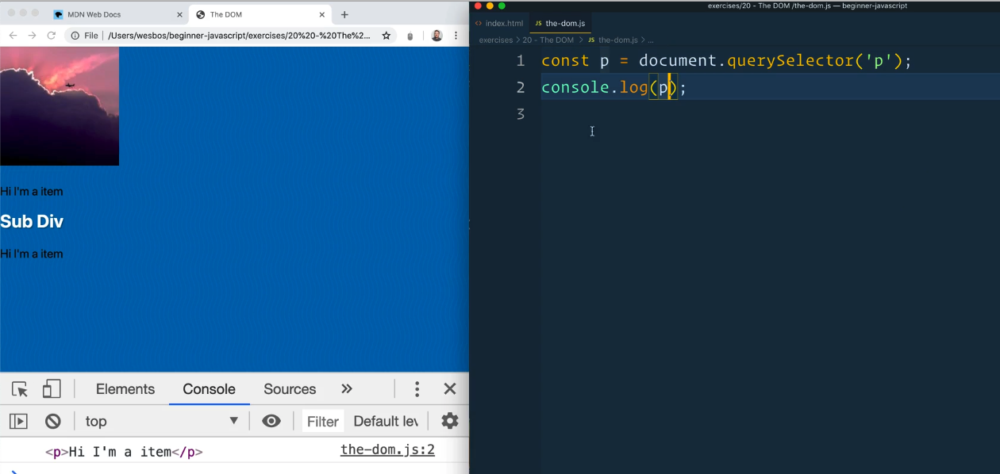

If you open up the `index.html` in the browser, you will see we have grabbed a paragraph tag. When we loga it, you will see we have the item there. 

`querySelectorAll()` will give you multiple elements, whereas `querySelector()` will give you the first matching one. 

Let's demonstrate that by making another variable called `divs`. 
Add the code below 👇

```js
const p = document.querySelector("p");
const divs = document.querySelectorAll("div");
console.log(p);
console.log(divs);
```

If you reload `index.html` you will see that we get something in the console called a **NodeList**. 


We will be learning about arrays in the future and NodeLists look a lot like arrays. It is a frequent interview question that you might hear, that a node list is not an array. 

It is a list of things, but there are a few differences which we will go through in the future. 

The short and skinny is that it does not have all the methods that an array does like `map`, `filter` and `reduce` built into it. 

If you hover over the NodeList in the console, you will see that it is grabbing everything that matches the selector (`div`). 


You can get more specifc than using elements as selectors. 

```js
document.querySelectorAll('.item');
```

You could say give me anything with a class of `.item`, as shown above 👆 

Let's say you only wanted `divs` with a class of `item`. You would then use 👇

```js
document.querySelectorAll("div.item");
```

You can also do parent child selectors. 

If you only wanted to grab an image inside of an `item` div, you could achieve that using the code below.  👇

```js
const divs = document.querySelectorALl('.item img');
```

If you wanted to just select the first `item` and then the image inside of it, you could add the code below instead, which will return the first match. 👇

```js
document.querySelector('.item img')
```

Let's say the other item div also has a class of `item2`.  

```js
const item2 = document.querySeletor('.item2');
```

You could add the following code 👇

```js
const item2 = document.querySeletor('.item2');
```

#### Searching Inside Already Selected Elements

If you want to search inside of an element that you already selected, you can use querySelector on any other element like so 👇

```js
const item2Image = item2.querySelector('img');
```

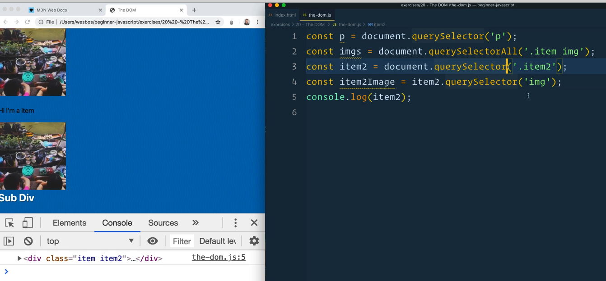

If you ever need to narrow down your focus as to where you are searching, you can do that in your selector, but you can also run `querySelector()` and `querySelectorAll()` on any other element and only search within it to limit the scope. 

```html
<h2 id="wes">Sub Div</h1>
```
If you have an element with an id, as shown in the code above 👆, you would be able to grab it using `document.getElementById('wes');`. 

Notice how you don't put the `#` sign before 'wes'? 

That is because if you're using anything that's not query selector, you don't have to pass `.` or `#`. 

The same works with `document.getElementsByClassName()`, but you don't pass the `.` from the classname. 

You can get all the work done with `document.querySelector()` and `document.querySelectorAll()` however, and they are much more flexible. 

---

# 22 - The DOM - Element Properties and Methods 

Now that we know how to select elements, let's go over what we can do with them. 


Start by selecting an `h2` element from the page and logging it. 👇 

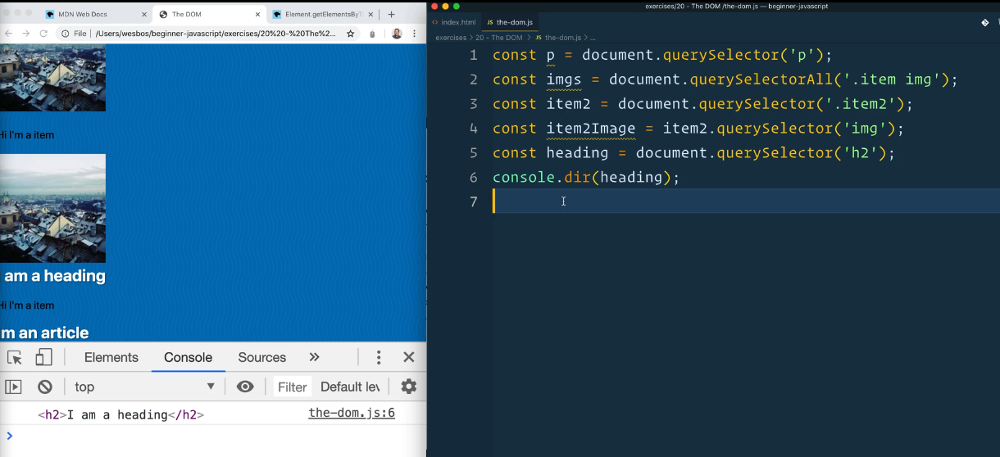

Although in the console it looks like the `heading` variable is the actual element, in reality it is an object that has a lot of properties and methods inside of it. 

If we change the `console.log()` to a `console.dir()`, that will show us the object properties instead of the actual element itself. 

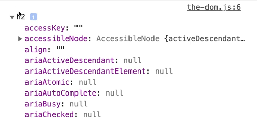

It's still the same `h2` tag, but you can see all the properties on it. 

One example of that is `parentElement` which shows you what the parent element is. 

There is `outerText` `textContent` `outerHTML`, and many other properties. 

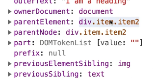

### Getters and Setters

We can use those properties as getters to get the data from the element that we need, or we can use them as setters. 

We will demontsrate this using `textContent`. 

```js
const heading = document.querySelector('h2');
console.dir(heading.textContent);
```

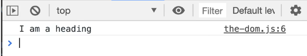 

The code above is an example of a getter. 

A setter is when you update the property. 

An example of that would be `heading.textContent = 'Wes is cool';`. 

Now when you reload the page, you will see Wes is cool in the console.

#### `textContent` and `innerText`

`textContent` and `innerText` are very similar properties, `textContent` is the newer one. 

The only difference is that `innerText` returns only the human readable content whereas `textContent` will get the contents of all of the elements, including script and style elements. 

```html
<h2>
I am a heading
<style>
  h2 {
    color:red;
  }
</style>
</h2>
```

Let's say your `h2` looked like the code above for some reason 👆

If you log both the `heading.textContent` and `heading.innerText`, you will see that `textContent` includes the content within the style tag whereas `innerText` only returns the text `I am a heading`. 

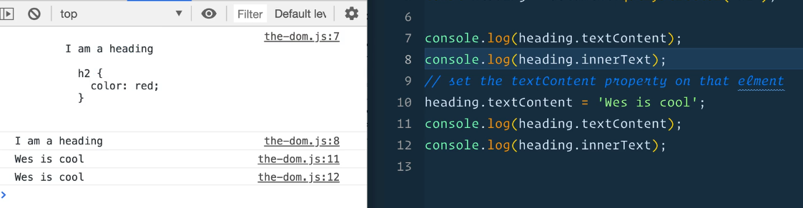

`textContent` returns every element in the node. 
`innerText` is aware of styling and won't return text of hidden elements. 


Let's say you have the following code 👇

```js
<h2>
I am a heading!
<span>I am hiddden!</span>
</h2>
<style>
  h2 span {
    display: none
  }
</style>

```

`textContent` will return the "I am hidden!" text, however `innerText` will not. 

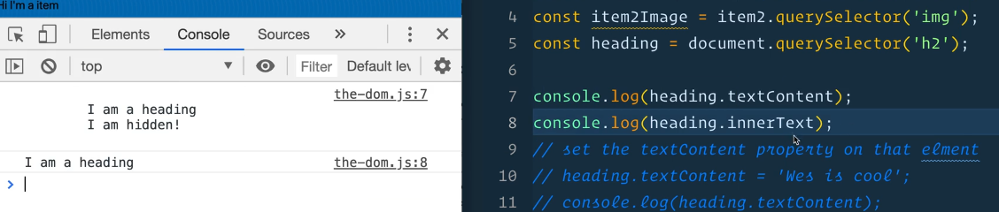

We have a set of properties when working with HTML. If we were to log the `innerHTML` of the `h2`, you would see 👇

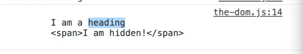

There is also `outerHTML`, which should include the `h2` tag and whitespace that goes inside of it. 


If you ever want to add text onto something is another useful thing to learn. 

### Exercise

Go to `index.html` and modify the code as shown below 👇

```html
<article class="item">
  <h2>Im an article</h2>
  <p class="pizza">This is how many pizzas I ate! 🍕</p>
</article>
```

What we are going to do is build something to add more pizza emojis to the end of it. 

First we need to select it. 

```js
const pizzaList = document.querySelector('.pizza');
console.log(pizzaList.textContent);
```

To update the `textContent` we could use the code below 👇

```js
pizzaList.textContent = `${pizzaList.textContent} 🍕`;
```

That will take what was already there and adds a pizza emoji to the end. 

That method can be slow in some applications that have lots of text and html, because it causes the browser to re-render the entire list.

### `insertAdjacentText` and `insertAdjacentElement`

To fix that, what we can do is add text onto the end using a different method, either  `insertAdjacentElement` or `insertAdjacentText`

That will give us the ability to add stuff to the back or the front of it. 

```js
pizzaList.insertAdjacentText()
```

If you go to MDN and search for `insertAdjacentText()` you will see that it is not a property, it is a method, meaning it is a function that we run _against_ the element, like we do for `querySelector` and `querySelectorAll`. 

It takes two arguments: 
1. the position (`beforebegin`, `afterbegin`, `beforeend`, `afterend`)
2. the text that you want to pass it. 

MDN says the second argument is element but it's actually just the raw text you want to add. 

Add the following code 👇

```js
pizzaList.insertAdjacentText('beforeend','🍕');
```

If you refresh `index.html` you should see two pizza emojis now. 

It works the same as the other way we tried earlier, however this is the best way to attach text to the end of something. 

If you were to try  👇

```js
pizzaList.insertAdjacentText('beforebegin','🍕');
```


That will put the pizza emoji before the paragraph entirely, it's not inside of that element. We would want to use `afterbegin` to add the pizza in front of the text.

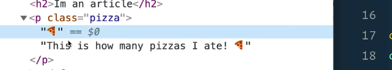

The browser actually knows that the pizza emoji was added later, because the text is split up between what we used to have and what we inserted. 

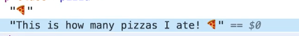

That is actually the difference between elements and nodes. 

**Nodes** can be anything, but an actual **element** is something that is wrapped in a tag. 

It is a little bit confusing because everything is a node, and it only upgrade itself to an element if you have wrapped it in a tag. 

If you are wondering what all the possible methods are, we will stumble upon different properties and methods as we build out our excercises. 

You can go to the MDN docs and go to element, it will tell us what all the properties are of elements. 


That wraps up elements. We covered how to get properties from an element, how to set properties on an element and how to use more powerful methods on each of our elements or nodes. 

---

## 23 - The DOM - Working with Classes

In Javascript, it is common to need to add and remove classes.  

Let's demonstrate how to do that, starting by commenting out all the code within `the-dom.js`. 

When you select an element, it will have a `classList` attribute on it, and that attribute has methods on it for adding and removing multiple classes. 

We will do an example with animation. 

Duplicate one of the image tags and add it right after the opening body tag, and give it a class of nice. 👇 

```html
<body>

```


Within `the-dom.js`, add the following code to select the element using the class of `nice`, and then we will log the `classList` attribute of the element. 

```js
const pic = document.querySelector('.nice');
console.log(pic.classList)
```

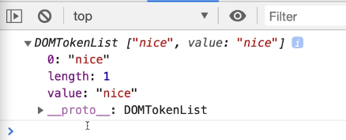

In the console we get a **DOMTokenList** which is kind of like an array of all the classes that are on that image. 

In the HTML file, add a class of `cool` to the image as well. 

When you refresh the page, you will see that we get both of them as well as a value of all of the classes.  👇


If you look into the **prototype** _(we haven't learned what that is yet)_, you can see which methods are available to call against the thing we have.  

`classList` has many methods. 

To name a few, there is 
- `add`
- `remove`
- `contains`
- `foreach`. 

A lot of those are methods for working with classes which is exactly what we are going to do.

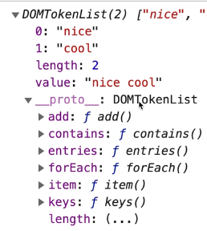
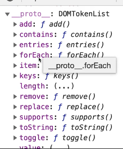

Within VSCode, as you type, you may have noticed that you get a dropdown of methods available to you. 👇


### Adding a class

We are going to use `pic.classList.add()` to add a class of 'open'.

```js
const pic = document.querySelector(".nice");
pic.classList.add("open");
console.log(pic.classList);
```

Refresh the page, and inspect the image element. You will see the image now has a class of open. 

### Removing a class

What if we wanted to remove the class of "cool" which already exists on the element? 

You could do that with the following code 👇

```js
pic.classList.remove('cool');
```

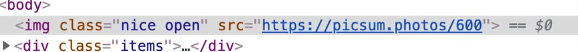

### Toggling a class

There is also `toggle` which is pretty cool. 

Let's write a bit of CSS so we can visually see what is going on.

In our `index.html` add a style tag somewhere on the page with the following styles 👇

```HTML
<style>
.round {
    border-radius: 50%;
  }
</style>
```

Now using Javascript, we will add a class of `round`. 

```js
pic.classList.add('round');
```

Now the element has the class of round and makes the image circular. 


We can add and remove that class either by pasting it into the console or on click. 

We will go over both.

Replace the `add` method used above with `toggle()`. 

`toggle` will add the class if it is not there, and remove it if it is. 

```js
pic.classList.toggle('round');
```

If you copy and paste that line of code into the console, you will see that the class is being added and then removed. 


If we go into our CSS and add a transition all for .2 seconds, that will give us an animation when the class is toggled. 

```css
img {
  transition: all 0.2s;
}
.round {
  border-radius: 50%;
  transform: rotate(1turn) scale(2);
  box-shadow: 0 0 10px black;
}
```


Quick peak ahead _(we will be learning about events later)_, you can do something like the following 👇

```js
function toggleRound(){
  pic.classList.toggle('round');
}

pic.addEventListener('click', toggleRound);
```

What we are doing there is saying when the pic element is clicked, we want to the trigger the function called `toggleRound()`, which will toggle on and off the class of `.round` for the image element. 

You can add the following styles to the `.round` class also for a rotation transition...


```css
.round {
  border-radius: 50%;
  transform: rotate(20deg);
}
```

The CSS added 👆 above will give you the transition shown below 👇


```css
.round {
  border-radius: 50%;
  transform: rotate(2000deg);
}
```

To get the transition effect below 👇add the code shown above 👆


```css
.round {
  border-radius: 50%;
  transform: rotate(1turn) scale(2);
}
```

The code above  👆gives you the effect below 👇


A lot of javascript interaction is just adding and removing classes at different points in time. That allows javascript developers to use CSS to add and remove transitions. 

That is common with modals and navigation which open and close, and we will be going over lots of examples of that throughtout the class.

### The `contains` Method

There is also the `contains()` method, which you would use like so 👇

```js
pic.classList.contains('open');
```

It will return a boolean value of `true` or `false` based on whether that element has the class or not.  

That is useful when you want to check the current state of an element by looking at it's class list. 

In the next video we will go over regular attributes. 

Even though `class` is an attribute, `classList` gives us some utility methods for working with it. 

Whenever Wes needs to work with classes, he uses `classList` which is a few years old but fairly newer. 

---

## 24 - The DOM - Built in and Custom Data Attributes

When you are working with HTML elements, those elements have something called **attributes**. 

Attributes are anything provided to an element as additional information. Things like classes, src, alt are all attributes. 

Attributes work the same way as the other properties that we have been working with, so we will go over it quickly before getting into custom and data attributes.

To add an alt attribute to the image element we were using in the previous video, you would add the following javascript code 👇

`pic.alt = "cute pup";`

_TIP: When adding alt attributes to images, the value of the alt text should describe the image. You do not need to include in the text that it is a photo, because screen readers will specify that._

Although we did not add the alt attribute when we authored the element, when we added it via javascript, you can now see it on the element. 

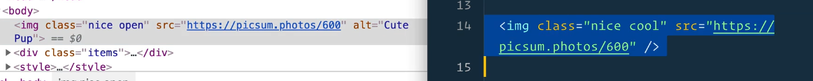

We can also set the width of the image this way, by adding the code below 👇

```js
pic.width = 200;
```

Most attributes are both **getters** and **setters**, meaning we can set the attribute, and retrieve the attribute value. That allows us to do both of the following 👇

```js
pic.alt = 'Cute pup'; //setter
console.log(pic.alt); //getter
```

Some attributes however are only getters, such as `naturalWidth`. 

If you add the code below, we get zero 👇 

```js
console.log(pic.naturalWidth);
```


However, if you copy and paste that in the console and run it, you get a value of 600 back. 

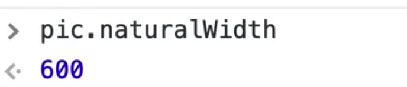

Why is it zero when we log it from the javascript file, but running the code in the console returns 600?

This is a problem that you frequently run into, which is that we have to wait for the image to actually be downloaded for us to know how large it is. 

This is a big problem when people were building slideshows. 

How can you overcome this? One option is to add an event listener on the load event.

What that will do is wait for all the images, resources, CSS, Javascript, and anything that needs to be loaded to load before calling the function. 

```js
window.addEventListener('load', function(){
  console.log(pic.naturalWidth);
});
```

When you refresh your HTML page now, after a split second, you should see the naturalwidth value logged in the console. 

You can also use the event listener specifically on an image. 

Modify the code we added like so 👇

```js
pic.addEventListener('load', function(){
  console.log(pic.naturalWidth);
});
```

That still works, because once the image is loaded, the event listener will fire.  

_(All of that event listener stuff is a bit ahead of ourselves, we will be covering it later in the course, but it's good to know some of the gotchas that you may encounter.)_

You might be asking yourself 
>"We added our javascript script src tag at the end of the html file, doesn't that mean that is waits for everything to be loaded?"

Yes, putting the script at the bottom of the HTML page waits for all the HTML to be loaded.  However, if the HTML goes ahead and makes additional requests like downloading images, it doesn't wait for those. 

Getting back on track, we were discussing how `naturalWidth` is only a getter.

```js
pic.naturalWidth = 200;
```
If you try to set it with the code above 👆, it won't error out, but it won't do anthing.That is because it is an attribute that you cannot change. 

All attributes on an element are done via getters and setters.

You can use the **dot notation** to access them. 

You may have run into these methods already:
- `getAttribute`
- `setAttribute` 
- `hasAttribute`

You can use `getAttribute` like so 👇

```js
console.log(pic.getAttribute('alt'));
```

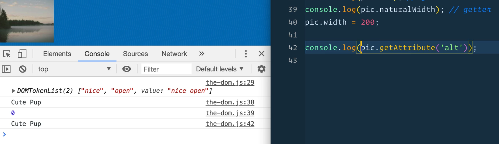

You can use `setAttribute` like so 👇

```js
pic.setAttribute('alt', 'REALLY CUTE PUP');
```

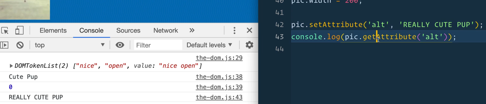

And there is `hasAttribute` which will return true or false based on whether that attribute is set on an element or not. 

```js
console.log(pic.hasAttribute('alt'));
```

What is the difference between using `getAttribute` and using the dot notation to grab the attribute? 

The difference is that `setAttribute()` will also work for things that are non-standard. 

We have HTML as a spec, and you have all of your standard attributes in   the spec like `alt`, `title`, `width`, `src`, and all of those things. 

But if you want to set an attribute that is non standard (_which you shouldn't do, more to come regarding that)_, you can use setAttribute to make something. 

For example, 👇

```js
pic.setAttribute('wes-is-cool', 'REALLY CUTE PUP');
```

 7:07

You should not go making your own attributes whenever you want because it is possible that in the future, an HTML standard attribute will be introduced with the same name as one of your custom attributes. 

Then you would end up with a situation where you have legacy code that is clashing with the standards which will lead to bugs. 

### Data Attributes

If you do want your own custom attributes, you want to use **data attributes**. 

To demonstrate what data attributes are, we will do an example. 

In the HTML page, duplicate an image tag 3 times and add a `data-name` attribute to each, like so 👇

```html


```

In this example, we wanted to attach a piece of metadata to each of the images. 

If you want to attach metadata or something to an element that does not have any sort of standard attribute like a name attribute, then you can use `data-` anything. 

For example: `data-dog`, `data-name`, `data-description` are all valid data attributes. 

That will allow you to attach metadata to an element. 

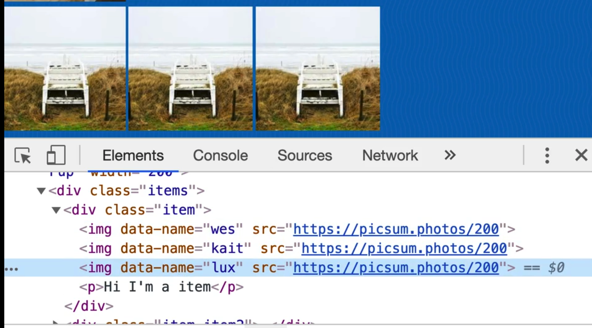 9:12

Let's say we wanted to grab the image with the class of `custom` and access the data attributes on that image. 

You might mistakenly think we do something like this 👇

```js
const custom = document.querySelector('.custom');
console.log(custom.data);
```

However, that will not work, and will return `undefined`.

If you want to access the data attributes on the element you would call `dataset` like so 👇

```js
const custom = document.querySelector('.custom');
console.log(custom.dataset);
```

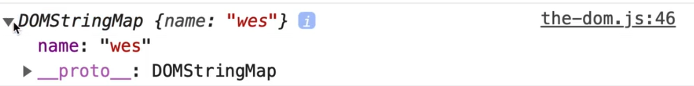

That gives us an object that is full of all the property values that you have. 

`data-name` shows up as the `name` property in our object, and if we had multiple data attributes on the same image, as shown in the code below, they would both be present in the object. 👇

```html

```

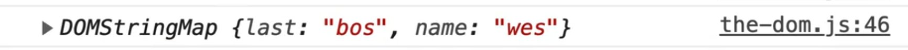 10:15

Why would this be useful? 

This is useful because we can do things like listen for a click on an element, and when someone clicks on it, we can alert them. 

Take the following code for example 👇

```js
custom.addEventListener('click', function(){
  alert(`Welcome ${custom.dataset.name} ${custom.dataset.last} `);
});
```

If you add that, and then click on the image, you would get an alert, similar to the one shown below.

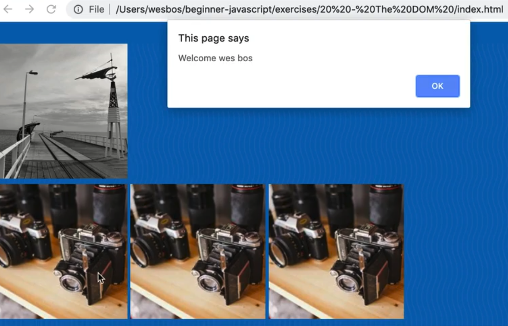

Wes loves using data attributes when coding **vanilla javascript**.

To recap: anytime you need a custom attribute, such as when you need to associate some sort of information with an element, use the custom `data` attribute. 

---

## 25 - The DOM - Creating HTML

In this lesson, we will learn about creating elements. 

Create the file `creating.js` within the `20 - The DOM` folder. 

In the `index.html` file we have been using so far, replace the script source to point to `creating.js` instead of  `the-dom.js`, as shown below 👇

```html
<script src="./creating.js"></script>
```

There are a few ways to create HTML in Javascript. The main way is using `document.createElement()`. 

Let's look that up in MDN. 

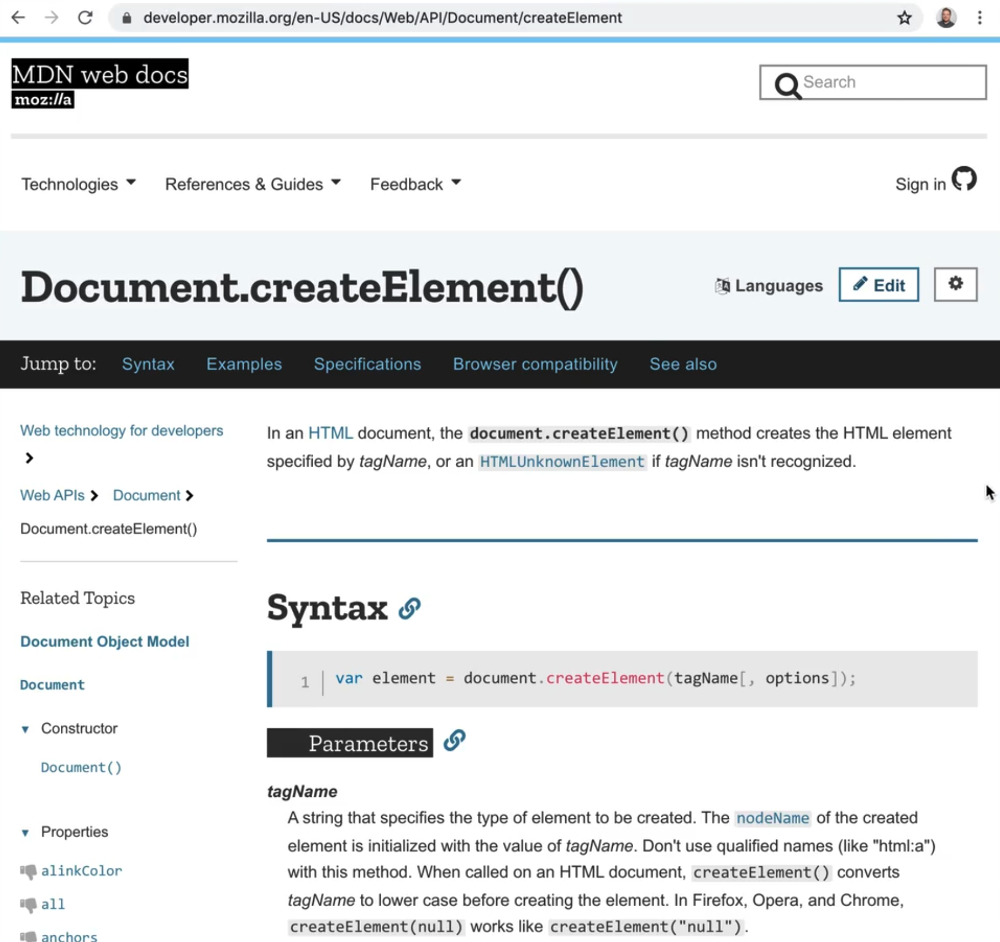 00:54

To use this method, you pass it a tagName and then there are optional options you can pass _(you can tell it's optional because of the square brackets)_, which we won't be using. 

Let's try to make a paragraph tag using this method. 

```js
const myParagraph = document.createElement('p');
console.log(myParagraph);
```

When you open the HTML file, you will see the paragraph in the console but it is not visible on the page. 

That is because we haven't actually put it on the page yet, we just created it and it's living in what is called **memory** right now. 

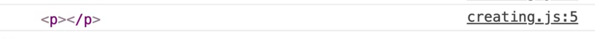 2:05

There is no shortcut to create an element with a class or with a set attribute, so something like the code below would **not** work 👇

```js
const myParagraph = document.createElement('p.special[title="hey"]');
```

If you want to add or get attributes from it, you must instead do it the way we have learned, as shown below 👇
 
```js
const myParagraph = document.createElement('p');
myParagraph.textContent = 'I am a p!';
myParagraph.classList.add('special');
console.log(myParagraph);
```

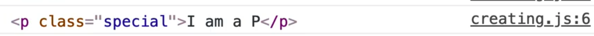 2:57

We now have that paragraph with a class of `special` and the text content that we supplied it with. 

Let's create a few more elements before we get into how to actually insert them into the DOM. 

First create an image element as shown below 👇

```js
const myImage = document.createElement('img');
myImage.src = "https://picsum.photos/500";
myImage.alt = "Nice photo";
console.log(myImage);
```

Next, create a div with a class of `wrapper` and log it. 

```js
const myDiv = document.createElement('div');
myDiv.classList.add('wrapper');
console.log(myDiv);
```

Now we have created 3 elements:
- a paragraph
- an image 
- div

How do we add it to the page? 

We use another API called **appendChild**. To use it, you have to first select an element to call `.appendChild()` against. 

If you want to add the element directly into the body, you can grab the `document.body` and insert it. 

`document.body` is available to us because the `document` element gives us access to the `body` element quickly via a property. Not every element is as easily accessible to us like `body` is. 

Let's look up `appendChild()` in MDN. 

It takes in one parameter, which is a child reference. 

 5:54

```js
document.body.appendChild(myParagraph);
```


This gives us a `p` tag right before the closing `body` tag. 

`appendChild()` can be called against any node, so we can do something as shown in the code below 👇

```js
document.body.appendChild(myDiv);
myDiv.appendChild(myParagraph);
myDiv.appendChild(myImage);
```

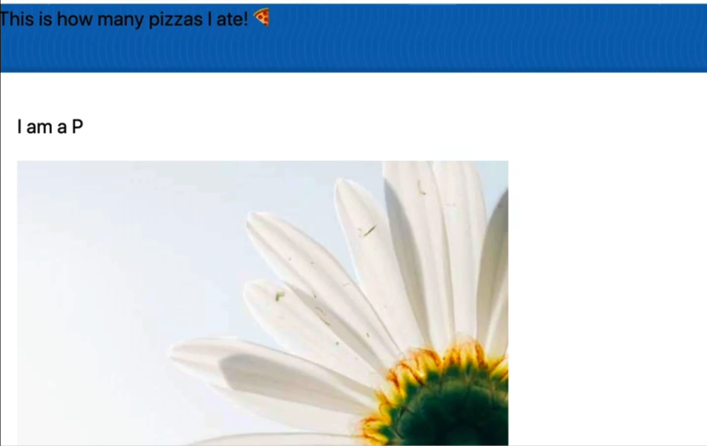 7:02

It is probaby better to do that in reverse order. Why? 

Everytime you use `appendChild()` you are modifying the DOM, which causes something called a **reflow** in the browser, which tells the browser that something has changed and that the browser needs to repaint the HTML. 

This means that if you call `appendChild()` 3 times in a row, you are causing the browser to re-render 3 times in a row. 

That can start to eat into other things on the page and degrade the user experience. 

To solve that, you could modify the code like so 👇

```js
myDiv.appendChild(myParagraph);
myDiv.appendChild(myImage);
document.body.appendChild(myDiv);
```

What we are doing here is:
1. we are creating the elements and inserting the paragraph inside of the div
2. then we are inserting the image inside of the div as well
3. finally, we call `document.body.appendChild(myDiv)` last to modify the DOM

This approach causes the browser to re-paint only once as opposed to 3 times in the earlier approach. 

_(Technically, the browser is doing 2 repaints, once when you dump the div in and the second time when the image loads, that's not the end of the world, that is how the browser works.)_

That is one way to go ahead and create elements, using the `createElement()` API. 

### `append()`

You may come across the `.append()` methodm when searching for how to add an element to the DOM, which works very similarly to `createElement`. However, `append()` doesn't seem to be fully supported in Internet Explorer so Wes suggests holding off on using it. 

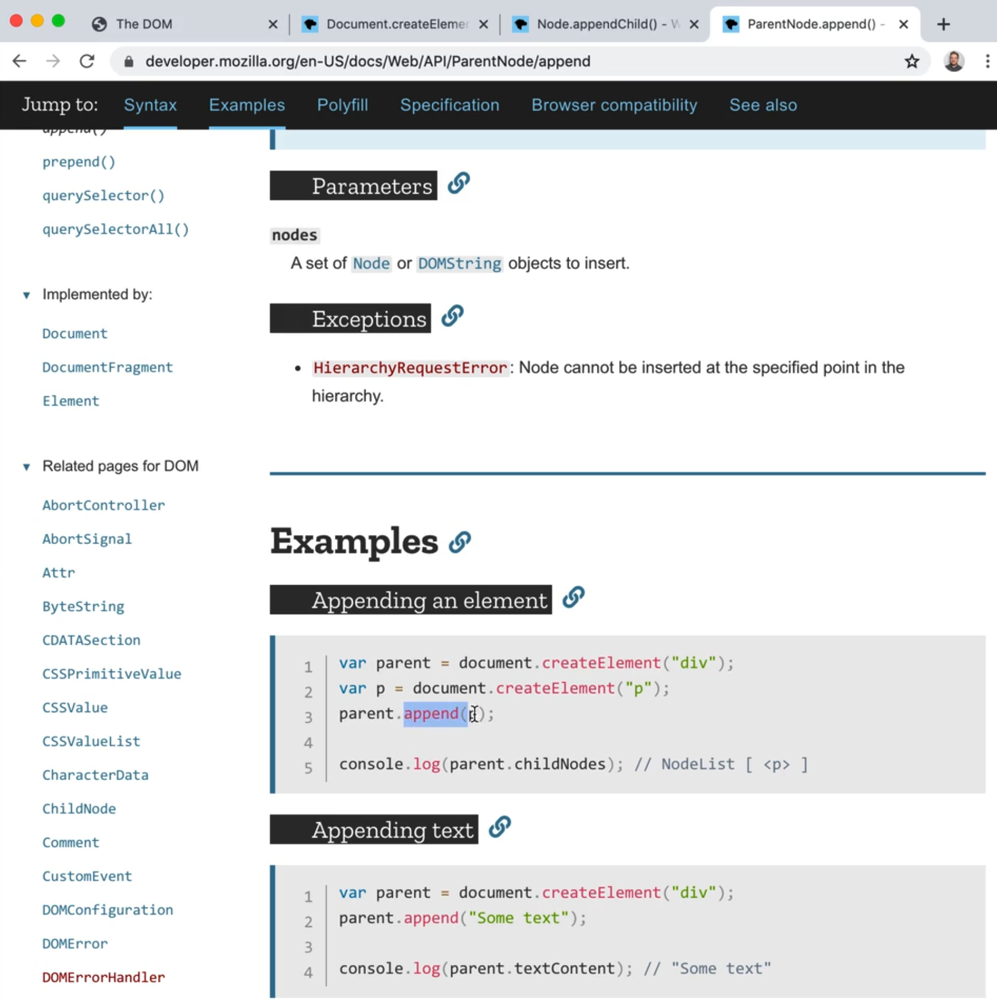

### `insertAdjacentElement()`

There is another API, `insertAdjacentElement`, that Wes is fond of using. It works similarly to `insertAdjacentText()` which we looked at in a previous lesson and is used to add text before, after and inside elements. 

The difference is `insertAdjacentElement` is used to insert elements before, after and inside other elements. 

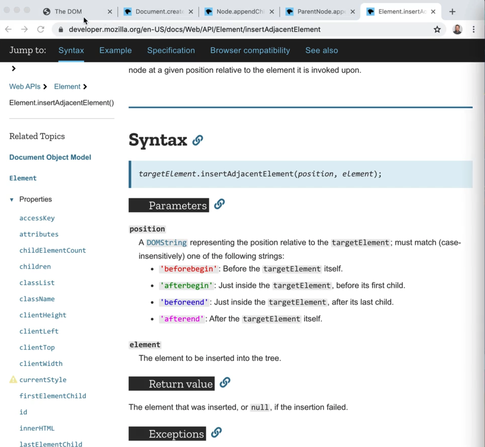 10:41

This is handy when you need to do something like insert an element before a paragraph in a div. 

```js
const heading = document.createElement('h2');
heading.textContent = 'Cool things';
myDiv.appendChild(heading);
```

If you try using `appendChild` as shown in the code above 👆, you should see that the heading is inserted after the image _(as shown below 👇)_ which is **not** what we want. 

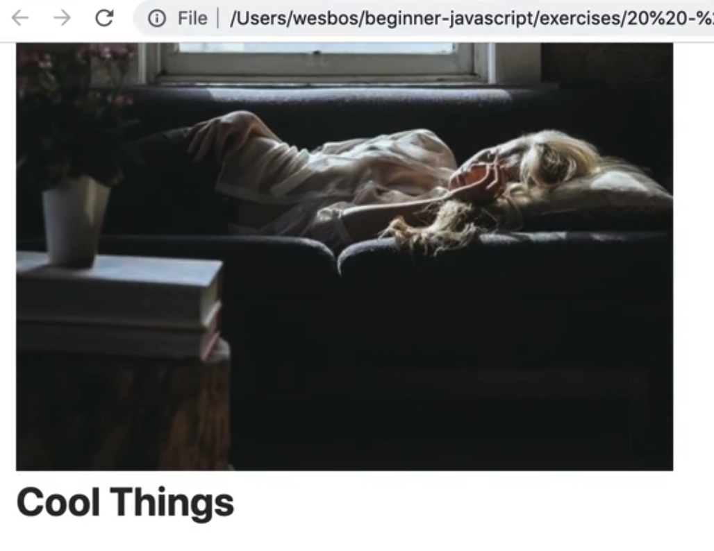

`insertAdjacentElement()` takes two parameters:
1. the position of where you want to insert the element
2. the element you want to insert.

```js
myDiv.insertAdjacentElement('afterbegin', heading);
```

That will put the heading before the paragraph and image tag. 


If you were to use `beforebegin`, it would insert the `header` before the `div` tag, as a sibling to the wrapper. 

That may be something you will need to use. 

Let's say you have a few cards and you need to add something after the first card. You can grab the second card and use `beforebegin` to insert an element before it. 

### Generating An Unordered List

Let's do one more example. In this example, we will create an unodered list with 5 items in it, using all the APIs we have learned so far. 

The outcome should like the code shown below 👇

```html
 <ul>
  <li>one</li>
  <li>two</li>
  <li>three</li>
  <li>four</li>
  <li>five</li>
</ul>
```

Start with the middle one and then try to insert one before, however you can make use of all the APIs that we have gone over. 

Pause the video here and try to create that and inject it into the DOM. 

Once you have tried that, continue on. 

First, create the unordered list. 

Next, create the third list item and append it to the list. 

_NOTE: If this seems like a lot of code to make an unordered list, well it is, we will go over in the next section how we can write a bit of html in a string and inject it in._

```js
const list = document.createElement('ul');
const li = document.createElement('li');
li.textContent = 'three';
list.appendChild(li);

document.body.insertAdjacentElement('afterbegin', list);
```

Next, create the other list item which we will add using `append()`, like so 👇

```js
const li5 = document.createElement('li');
li5.textContent = 'Five';
list.append(li5);
```

There is the ability to clone a Noe which we could do as shown below 👇

```js
const li1 = li5.cloneNode();
list.insertAdjacentElement('afterbegin', li1);
```

What that code will do is it will create a clone of the `li5` Node, and then insert that clone adjacently. 

 16:03

If you reload the page, you will see that we added the element but it is empty.

If you take a look at the docs for `cloneNode()`, you will see that it accepts a parameter of "deep" which specifies whether to clone the child nodes or not. 

You may be wondering "well isn't text part of the element?", and no, it is actually a child of the element. 

Since the text is not wrapped in a separate element (like a `span` or `p` tag), that makes it just a regular node. 

That means we need to pass true when using `cloneNode` to include the text, as shown below 👇 

```js
const li1 = li5.cloneNode(true);
li1.textContent = 'one';
list.insertAdjacentElement('afterbegin', li1);
```

In this instance `cloneNode()` wasn't much more efficient to use, but it generally is.

If you are trying to clone an element that has a lot of attributes set on it, and want to copy those over as well, it is much more efficent to use `cloneNode`. 

Now that we have 1, 3 and 5, how do we inject 2 and 4? 

```js
const li4 = document.createElement('li');
li4.textContent = 'Four';
li5.insertAdjacentElement('beforebegin', li4); 
```

We will use `beforebegin` 👆because we want four to go beside the 5th one. 

FInally for two, we can use `afterend` to insert it after the first list item, as shown in the code below 👇

```js
const li2 = document.createElement("li");
li2.textContent = "Two";
li1.insertAdjacentElement("afterend", li2); 
```

That was a good practice exercise because we used all the different APIs available to us to create elements, set the contents and insert them in different ways. 

In the next video, we will look at how we can use backticks and strings to generate the HTML. 

--- 

## 26 - The DOM - HTML from Strings and XSS

We are going to learn about creating HTML with strings, using **backtick** strings, which Wes showed us earlier. 

This approach is Wes' favourite, but make sure to watch the video all the way through, because at the end Wes will show a potential security hole that comes up when using this method. 

The main security flaw with this method is something called **XSS** which stands for **cross-site scripting**.

Create a new javascritp file `creating-with-strings.js` and change the script src in the `index.html` file to point to our new file. 

There is a property `innerHTML`, which is similar to `innerText`, which we can get off an element. 

Select the element with the class of `item` and log it. 👇

```js
const item = document.querySelector('.item');
console.log('item.innerHTML');
```

 2:13 

You can see that `innerHTML` is a string of all the HTML that makes up what is inside of it. 

That is a getter. 

What if we try to use it as a setter, as shown below? 👇

```js
item.innerHTML = `<h1>Hey How are you?</h1>`;
console.log(item.innerHTML);
```

 2:39

The inside of the `div.item` has been updated with some HTML. 

That works because if you set the `innerHTML` of an element with just a string, it will take the text and dump that HTML into the item. This can be used instead of te `document.createElement`, or `document.cloneElement` methods we used in the previous lesson. 

If the string it is valid HTML, the browser will take the string, parse it and turn it into all the items.  

_TIP: You may have noticed that in Wes code editor, he has the ability to type the first few letters of something and then expand it. He is using an extension called Emmet to get those expansions and using a command called Expand Abbreviation to expand them. It lets you write things like `div.item.item` which will expand out to `<div class="item iteme"></div>`._

One benefit of using backticks for single or double is that you can have a string that spans multiple lines, like so 👇

```js
item.innerHTML = `
  <div>
    <h1>Hey How are you?</h1>;
  </div>
`;
```

It doesn't matter if you indent or put it all on one line, but having it on multiple lines does make it easier for you to read it when you code typically.

To recap: setting the `innerHTML` of your element is one way to dump a string of HTML in and have the browser create all the elements for us. 

This method of inserting elements is useful not only because it has less steps than using `document.createElement` or similar methods, but it also gives you the ability to easily **interpolate** values.

Below is an example of that 👇

```js
const src = `https://picsum.photos/200`;
const desc = "Cute pup";
const myHTML = `
  <div class="wrapper">
    <h2>Cute ${desc}</h2>
    
  </div>
`;
```

We are able to use the backtick syntax like `${variable}`, which allows us to pop variables right into the string template that we have. 

This is similar to templating that exists in almost every programming language, although they all look a little different. The general idea is the same. 

When we set the `innerHTML` of an element to equal `myHTML`, all the variables will have been populated. 👇

```js
item.innerHTML = myHTML;
console.log(item.innerHTML);
```

 6:45

We could go a step further with the following code.  

Take a look at the `width` variable and how we are interpolating the `width` variable in the `src` variable declaration. 

```js
const width = 500;
const src = `https://picsum.photos/${width}`;
const desc = "Cute pup";
const myHTML = `
  <div class="wrapper">
    <h2>Cute ${desc}</h2>
    
  </div>
`;
```

If you refresh the page, the image link will now return a much larger photo of 500px. 

Besides security, one of the downsides to using this method to insert HTML is that the contents of the `myHTML` variable are not elements, they are just strings. 

You can see that in two ways. 

First, you can log the value of `myHTML` and you can also check and log it's type, like so 👇

```js
console.log(typeof myHTML);
```

 7:37

```js
myHTML.classList.add('special');
```
That means we cannot do things like add the code above  👆. 

If you try to do that, it will give you the following error 👇
> Cannot read property 'add' of undefined 

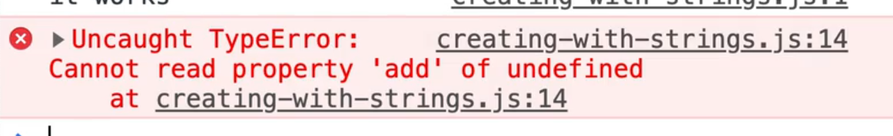

Similarly, if you try to do log `myHTML.classList`, you will see that it is also undefined. 

Why? 

Because it is only a string. 

It only becomes an element once we dump it into the DOM by setting the `innerHTML`. 

If you want to do things like add event listeners, add to the `classList`, dynamically change any attributes, like `title` or `alt` or `src`, it is not possible until you first dump it into the DOM. 

Once you dump it into the DOM, you have to go ahead and pull it out. 

Here is an example. 

Let's say we wanted to add a class to the image within `myHTML`. 

We would have to do that like so 👇

```js
const itemImage = document.querySelector('.wrapper img');
itemImage.classLIst.add('round');
```

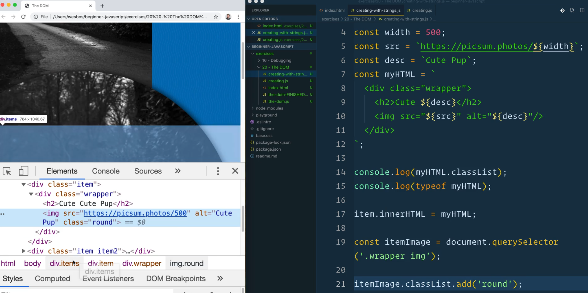 9:59

### `document.createRange()` and `document.createFragment()`

There are a few ways you can get around that and do the best of both worlds which is using `document.createRange()` and `document.createFragment()`. 

Remove everything below the `myHTML` declaration within `creating-with-strings.js`. 

Next, let's now turn the string into a DOM element. 

```js
const myFragment = document.createRange();
console.log(myFragment);
```

 11:19

This code creates something called a **range**. 

A range is essentially a collection of elements or part of HTML that we can then work with. That is exactly what we want, we want to take the `myHTML` string and create a couple of fragments. 

We can call another method directly on `document.createRange()` called `.createContextualFragment();` which takes in a string as a parameter, like so 👇

```js
const myFragment = document.createRange().createContextualFragment(myHTML);
console.log(myFragment);
```

If you open the page in a browser and view the console, you will see that we have this thing called a **document fragment** (which is just a way of saying some HTML). 

 11:46

Now, from within this fragment, we are able to access all of the elements that live inside of it. 

What we have done is turned our HTML into true elements, that are still not on the page anywhere, but we have them as DOM elements and do do things like look for an image inside of a fragment using the following code 👇

```js
myFragment.querySelector('img');
```
 12:29

Let's now try to append the fragment to the document. 

Let's try `appendChild()`.

```js
document.body.appendChild(myFragment);
```

That works! You could also do  👇

```js
document.body.appendChild(myFragment);
```

You could also use `insertAdjacent()` which we learned about previously. 

To recap: 

When you want to create HTML from a string, you can dump it into the document using `innerHTML`, OR when you need to do things with the elements in javascript, you can turn it into DOM Nodes before it is dumped into the document with `createContextualFragment()`. 


### Security and Santization

We will have an entire video on security later in the course, but for now, we need to talk about the potential pitfalls of inserting HTML using strings. 

One scenario you might run into is let's say you have an application where users have a profile which they can edit and customize such as changing their name or adding a description. 

If a user were to put HTML where the description input is, what could happen is the HTML in turn could be rendered on to the page. 

Let's demonstrate with an example.

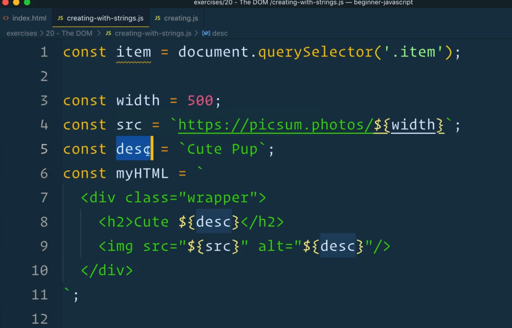 15:00

Let's say we are taking this `desc` variable from somebody. 

They could put add the following in their description 👇

```js
const desc = Cute pup <h1>LOVE THIS GUY</h1>;
```

Add the code about where it says `Cute Pup` and refresh the HTML page. 
 
You should now see that there is actually an `h1` tag that wasn't created from us.  

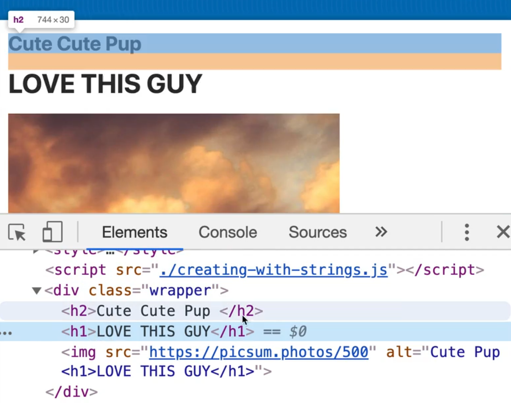 15:17

Remember, in this example scenario, the description value would be coming from a database, from someone's editor when they typed it in. They just started to put some HTML. 

They could also something like 👇

```js
const desc = `Cute pup <h1>LOVE THIS GUY</h1><style>*{display:none;}</style>`;
```

If you refresh the HTML page, you will see all the content is gone. 

_Aside: This is what MySpace allowed you to do. You used to be able to put in your own style tags. So did Neopets._

In this scenario, we were just expecting the user to enter in text but they hijacked it and added whichever HTML they wanted to. 

### XSS (Cross Site Scripting)

That is all fun and games until you get into **XSS** which is shortform for **cross-site scripting**. 

XSS is where people try to insert script tags using a method like entering an HTML string in a text input such as your profile name. 

The browser will then run the script tag, and you can do anything you want with that, like drain someone's bank account. 

Imagine you were signing in to your online banking and your bank asked you to enter your name, and you included a script tag. You could do anything you want outside of that including deleting things, sending money, any type of malicious acting. 

A very simple example of that is let's say you want to allow someone to include an image in the description of the picture from the example above. 

Something like the following 👇

```js
const desc = `Cute Pup `;
```

That is okay, but let's say someone hijackts the `onload` event that is accessible via an attribute on the `img` element? That will run whatever javascript is supplied to it when the image loads. 

For example 👇

```js
const desc = `Cute Pup `;
```

If you refresh the HTML page, you will see an alert. 

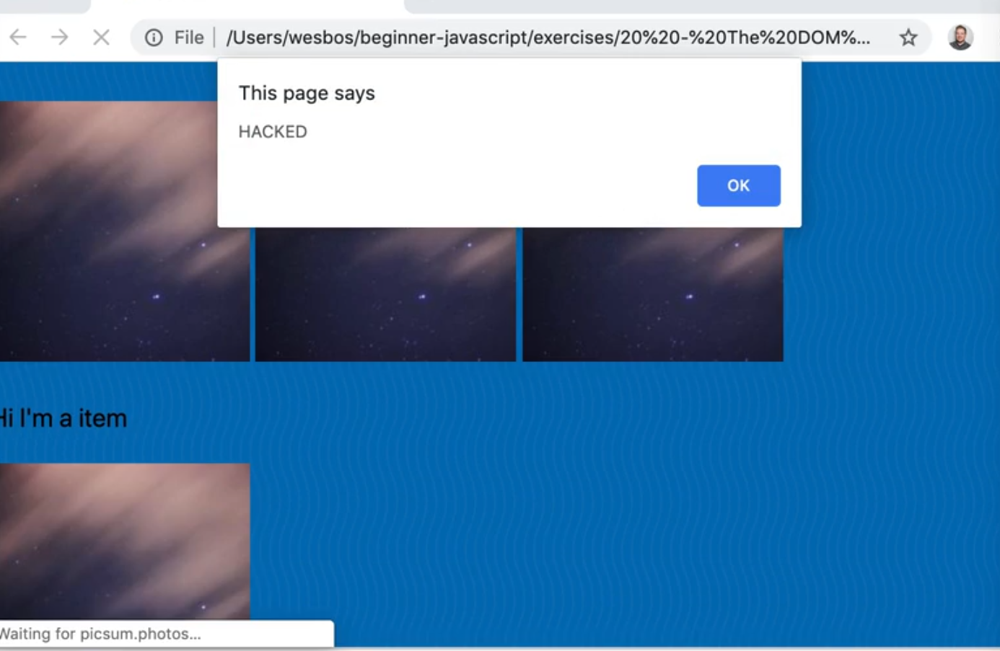 17:48

What happened there is you took data from the user and allowed them to run any javascript that they want on your website, which is a potential security hole. 

Imagine that on Face you allowed someone to run any Javascript, you could have your friends unfriend eveyrone, send malicious messages etc. Anytime you allow a third party to run Javascript on your page, that is a huge security hole. 

The only javascript that should be running on your page is Javascript that you, the developer, authored, and from approved parties like Google Analytics. 

To recap: 

Cross Site scripting is when a third party injects a script tag through a security hole like this. 

In the security video, we will go over how to scrub your HTML of any potential security vulnerabilities like this before you dump it. 

---

## 27 - The DOM - Traversing and Removing Nodes

In this video, we will learn about traversing through our DOM element and removing elements from the DOM. 

Create a file name `traversing.js` and go into our `index.html` and modify the script source to point to the new file. 

**Traversing** means going up, down, over etc. When you have an element, you often need to select an element based on it's position. 

For example, sometimes you are working on a `button` and need to select the parent `div`, or you need to look inside of the `button` for all the elements inside of it. 

There are lots of properties for that, and they all revolve around node and elements. 

### The difference between and node and an element

We will do an example to demonstrate the difference. 

In the `index.html` file, create a `p` tag with the class of `wes`, and within the paragraph tag add a few elements, as shown below 👇

```html
<p class="wes">I am Wes, I <em>love</em> to bbq</p>
```

In the Javascript, select that paragraph. 

```js
const wes = document.querySelector('.wes');
console.log(wes);
```

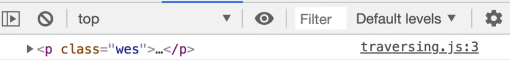 2:04

If instead you log `wes.children`, it will return a collection of one thing in the console, which is the `em` tag we just added.  

 2:25

If you log `wes.childNodes` instead, you will see that it returns a NodeList of three things: 
- text
- em
- text 

In the HTML collection, only the `em` element was returned. 

 2:30ish?

If you hover over the nodes in the console one at a time, you will see it highlighting the corresponding node on the HTML page. 

This is the first text node. 

 2:41

Then the emphasis node. 

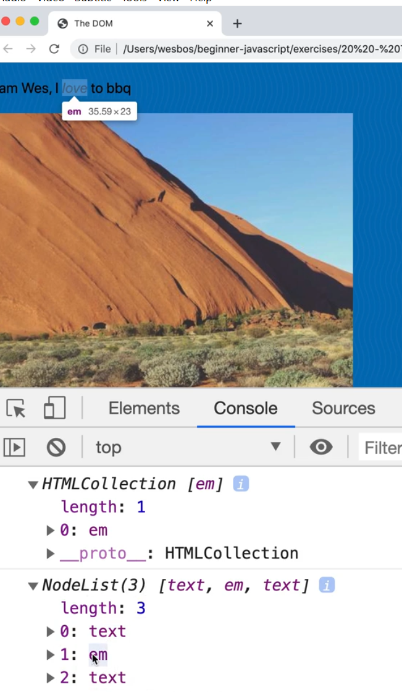

Then the rest of the text.

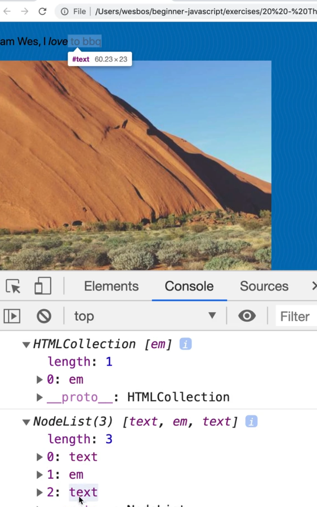 2:46

Everything in our NodeList in the console is a Node, and if it is wrapped in a tag, it is also an element, but it doesn't work the other way around. 

If you only select elements, you won't have nodes returned. But if you select the nodes, you get all of the three different pieces. 

 3:12

_VS Code TIP: You can do multi-cursor in VS Code. The way you use that is you hold down command or control and click wherever you want the cursors to go. In this video Wes used multicursor by selecting an element and then doing command + D to grab other occurences_

### Properties to work with Nodes and Elements

We already looked at children, which gives you child elements or child nodes. 

Let's add a few more elements to work with. 

```js
console.log(wes.firstElementChild);
console.log(wes.lastElementChild);
console.log(wes.previousElementSibling);
console.log(wes.nextElementSibling);
console.log(wes.parenteElement);
console.log(wes.childNode);
```

Here is the result when you refresh the index.html page. 

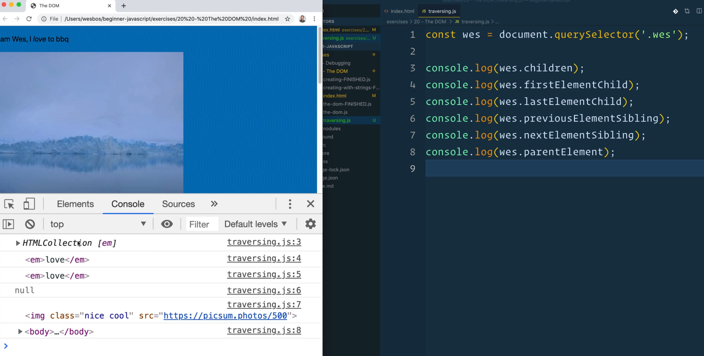 3:59

`children` gives you the children. 

Let's add a few more elements inside of the p tag. 

```HTML
<p class="wes">
  I am Wes, I <em>love</em> to bbq and <strong>Make websites!</strong>
</p>
```

If you refresh that page, you should get the following results:

`firstChildElement` returns the emphasis element.
`lastChildElement` returns the strong element. 
`previousElementSibling` is null. 

 4:22

Why is `previousElementSibling` null? 

If you look at the HTML page, you will see that a few elements with the class of `item` are next to each other. 

 4:45

If we were to grab the second item by clicking it in our developer tools and then using `$0` to reference it in the console, we can take it and run the following code in the console:

```js
$0.childrenElementCount
```
👆That will tell us the number of children elements. 
```js
$0.children
``` 
👆 That will return a collection of three elements. 
```js
$0.previousElementSibling
```
👆 That will give you the item that is before it. 

 5:30

We were on `item2`, and the previous element sibling is the first item. In the code we wrote in our javascript file, we selected the first item, which has no previous sibling, thus it returned null. 

_JQuery used to make this easy with syntax like `.prev()` `.next()`. All of that is still doable with these properties. They are not named the nicest things but they work and you can figure it out._

There is `nextElementSibling` which will grab the sibling element after the currently selected element. 

And then there is `parentElement` which will go up and give you the parent element of the currently selected element. 

If you take an element that is really low in the document like one of our image elements, you can chain calls to `.parentElement` like so 👇  

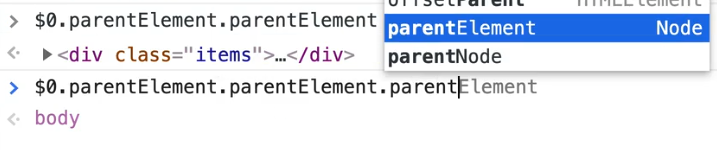 6:19 

How high can you chain? 

To find out, add one more `.parentElement`, which will return HTML, and if you add one more, it will returns null. That means we have reached the top most element. 

In the elments tab in the dev tools, select the span within `item2`, and in the console write `$0`, which should return the span. 

`$0.parentElement` will return the `h2` and chaining one more,`$0.parentElement.parentElement` will return `item2`.  
`$0.parentElement.parentElement.nextElementSibling` will return the first item.

Now you can go down again using `.children[1]` to select the paragraph with a class of `pizza`. We will talk about the **square bracket notation**(`[]`) shortly, but essentially that is how you reference items that are indexed. 

 7:20

In the code above, we strted with the `span` in `item2`, we went up, up, over down and selected the second element. 

That is probably not something you would do because assuming that the structure of the HTML is the best way to move around elements is probably not a good idea because if someone adds an extra `div`, then everything is ruined. 

Using `querySelector` is better to use to search for what we want. There is also another method `.closest()` which will allow us to search.
 
We also have a bunch of different properties for Nodes as well. 

```js
el.childNodes
el.firstChild
el.lastElementChild
el.previousElementSibling
el.nextSibling
el.parentNode
```

Unlike the element properties, these will not ignore text nodes, so it's important to know the difference. 

In most cases, you probably want the element selectors but in some instances you want the node selectors. 

### Removing Elements

There is a method on every single element on every single node which is the ability to remove something. 

Let's do it from the dev tools. 

Grab the `h2` by clicking the element in the element pane and then in the console write `$0.remove()`
 


That removes the element completely from the DOM. 

The only kinda gotcha is what happens if you were to create an element, add it to the DOM and call `.remove()`? 

Let's try it with the code below 👇

```js
const p = document.createElement("p");
p.textContent = "I will be removed";
document.body.appendChild(p);
p.remove();
```

If you open the index file in the browser, you won't see the `p` tag because we added it and then immediately removed it. 

The question now is what if you log `p` after you call `remove()`, will it be null, `undefined`? 

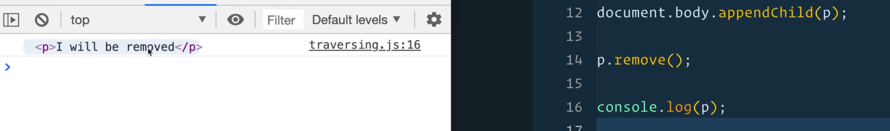 10:33

It is still there! 

The fact that we had created that element and it exists in our javascript memory means that we do still have access to that paragraph element and we could add it back in to the DOM. 

If you have reference to that element in javascript, and you've created it in your javascript, you can add it again. 

---

## 28 - The DOM - CARDIO
  
This video will all be "cardio" which is what Wes likes to call exercises that are all related to one another. 

The purpose of these exercises is to practice the material we have learned by putting yourself through the exercises and hopefully improving. 

We want to nail down the fundamentals before we start building real stuff with interfaces etc. 

What you should do now is pause the video and go through all the exercises in the `DOM-CARDIO.js` file and try to do as much as you can. 

There is no right answer, there is a bunch of different ways that you could solve it. 

Then come back and watch the video to see how Wes would approach it. 

WHEN YOU ARE READY...

The `DOM-Cardio.html` file has no HTML in the body at all, and `DOM-Cardio.js` is just a blank JavaScript file with comments explaining the different exercises. 

The first one is to create a div, then add a class of wrapper to it and then put it in the body.

Start by creating a div 👇

```js
const div = document.createElement('div');
```
Add a class of `wrapper` to it.👇

```js
div.classList.add('wrapper');
``` 

Then, append it to the body 👇

```js
document.body.appendChild(div);
```

 1:35

As you can see, the works!

The next exercise is to make an unordered list, which should be familiar to you since we have gone over how to do it together previously. 

Add the following code to do so 👇

```js
const ul = `
<ul>
</ul>
`;
```

To add the 3 list items with the words "one","two" and "three", modify the `ul` variable declaration, as shown below 👇

```js
const ul = `
<ul>
  <li>one</li>
  <li>two</li>
  <li>three</li>
</ul>
`;
// add three list items with the words "one, two three" in them
```

Next we need to put the list in the `wrapper` div we created a few steps ago.

There are a few ways you could approach this. 

One way is like so 👇

```js
div.innerHTML = ul;
console.log(div);
```

 2:21

That works well. You could have add it as a fragment, but because there was nothing in the body already, it was simple to use `innerHTML`. 

Next you need to create an image. Add the following code to do so 👇

```js
const img = document.createElement('img'
```

Then you have to set the image source.

```js
img.src = 'https://picsum.photos/500';
```

Then you need to change the image width to 250. Do so with the following code 👇

```js
img.width = 250;
```

Then you need to give the image a class of `cute`, like so 👇

```js
img.classList.add('cute');
```

Next you need to add an alt of cute puppy, which you can achieve with the code below. 

```js
img.alt = "Cute Puppy!";
```

Then you need to append it to our `wrapper` div. 

We will take the div and call `appendChild()` on the image. 

We do not need to call `insertAdjacent()` because it will go to the bottom of it. 

```js
div.appendChild(img);
```

 3:35

You may notice that every time you refresh the image, the image is sort of jumping. 

If you add `img.height = 250;` to the JavaScript code as well and then refresh, it should not jump as much anymore. 

That is because if you give it a width and height attribute, it will maintain it's spot while it loads the image, which is great. 

Next, you need to use HTML strings to make a div with two paragraphs inside of it. 

```js
const myHTML = `
  <div>
    <p>Paragraph One</p>
    <p>Paragraph Two</p>
  </div>
`;
```

Then you need to insert the div above the unordered list that we created earlier.

To do this, grab the `ul` which you may still have reference to. 

To check if you do still have reference, add `console.log(ul);` 

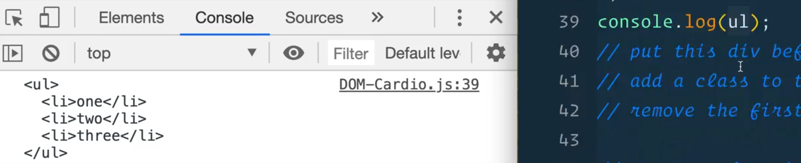 5:19

Wes was wrong -- it does not look like you already have access to the `ul` element because it shows up in the console as a string, rather then an element object. 

So you need to somehow grab that. 

Since you already have the div element, you can look within it to grab the ul element like so 👇

```js
const ulElement = div.querySelector('ul');
console.log(ulElement);
```

 5:40

Next you need to add this div to the unordered list from above. 

Try the following code 👇

```js
ulElement.insertAdjacentElement('beforebegin', myHTML)
```

If you refresh the HTML page, you will see an error that says
>Uncaught TypeError: Failed to execute 'insertAdjacentElement' on 'Element': parameter 2 is not of type 'Element'.

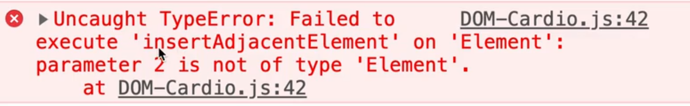 6:23

So because you have created it as a string, how can you insert it adjacently? 

You could try using `insertAdjacentHTML()`.

```js
ulElement.insertAdjacentHTML("beforebegin", myHTML);
```

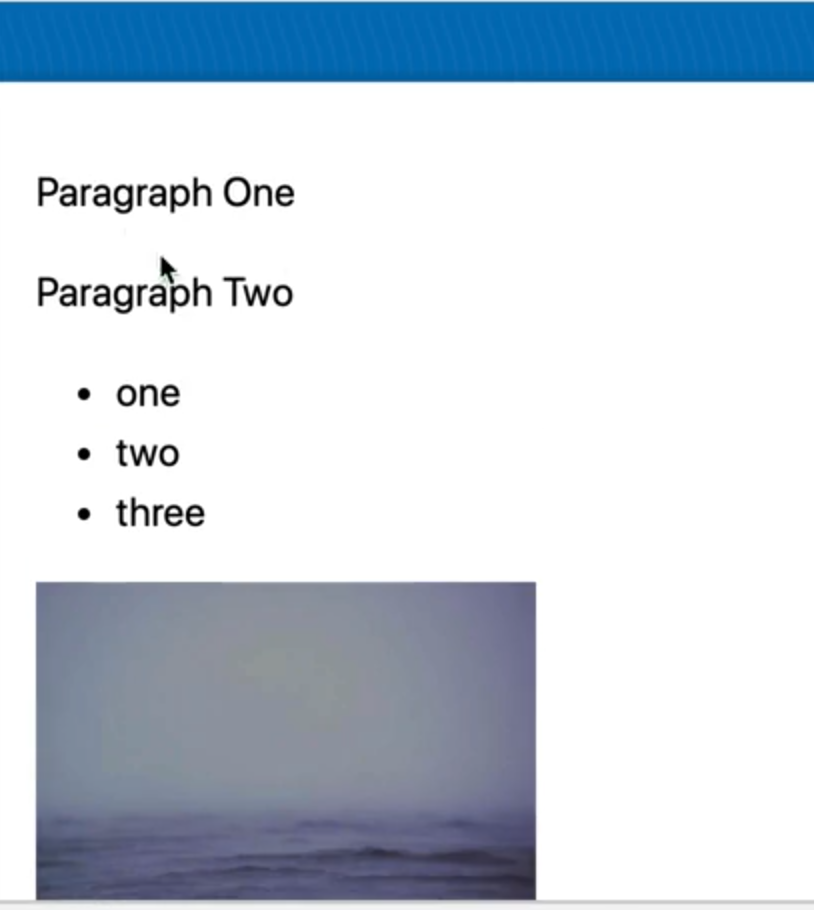 6:48 

That works great! You could have also done `createRange()` and then added it as a document fragment. 

Next, you need to add a class of `warning` to the second paragraph, and then select it. 

If we look at the HTML in the dev tools, you will see the following code 👇

```html
<div class="wrapper">
  <div>
    <p>Paragraph One</p>
    <p>Paragraph TWo</p>
  </div>
</div>
```

 7:15

Select the first div within the `wrapper` using `querySelector`, like so 👇

```js
const myDiv = div.querySelector('div');
```

Or you could use `firstElementChild`. 

```js
const myDiv = div.firstElementChild; 
console.log(myDiv);
```

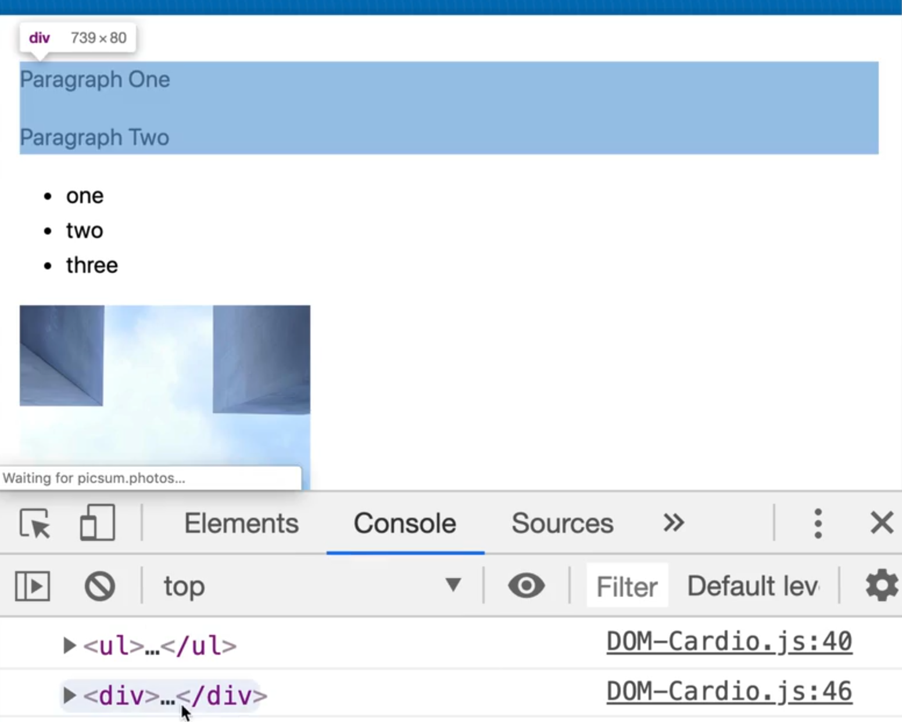 8:00

That is working, however, let's not use that because if you were to insert anything else, the div could no longer be the first element child, which makes it a pretty unstable solution. 

Instead, go into the `myHTML` variable declaration from above and add a class to the div that you inserted called `myDiv`, like so 👇

```js
const myHTML = `
  <div class="myDiv">
    <p>Paragraph One</p>
    <p>Paragraph Two</p>
  </div>
`;
```

And then you can select the div using it's class name. This makes the code more resilient. 

```js
const myDiv = document.querySelector('.myDiv');
```

Next you need to add a class of `warning` to the second paragraph. 

Let's try using `myDiv.children`. First, log it to see what you are working with 👇

```js
console.log(myDiv.children);
```

 9:09

As you can wee, that gives you both of them. To select the second paragraph, you can reference it like so 👇

```js
myDiv.children[1]
``` 

`myDiv.children[0]` would be the first `p` tag and `myDiv.children[1]` is the second one. 

That allows you to do the following 👇

```js
myDiv.children[1].classList.add('warning');
```

Then, remove the first paragraph like so 👇

```js
myDiv.firstElementChild.remove();
```

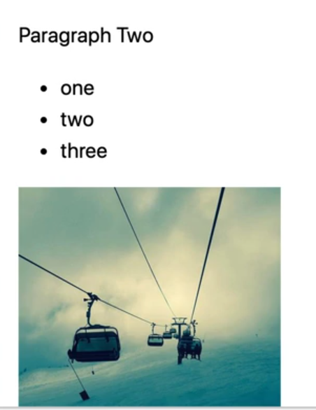

Next you need to create a function, `generatePlayerCard` that takes in 3 arguments: 
- name
- age
- height

The function should return HTML that looks like the following 👇

```html
 <div class="playerCard">
   <h2>NAME — AGE</h2>
   <p>They are HEIGHT and AGE years old. In Dog years this person would be AGEINDOGYEARS. That would be a tall dog!</p>
 </div>
```


So first, create the function that takes in those 3 parameters:

```js
function generatePlayerCard(name, age, height){
}
```

In order to have the function return a div with the structure mentioned above, you could approach it in one of 2 ways:

1. return the HTML directly, like so 👇
```js
function generatePlayerCard(name, age, height) {
  return `
    <div class="playerCard">
    </div>
  `;
}
```

or

2. stick it in a variable and then return it, like so 👇

```js
function generatePlayerCard(name, age, height) {
  const html = `
    <div class="playerCard">
    </div>
  `;
  return html;
}
```

Let's stick with the second way for now. 

You now need need to build out the rest of the HTML string and interpolate the parameter variables that have been passed to the function, like so 👇

```js
function generatePlayerCard(name, age, height) {
  const html = `
    <div class="playerCard">
      <h2>${name} - ${age}</h2>
      <p>They are ${height} and ${age} years old. In Dog years this person would be ${age * 7}. That would be a tall dog!</p>
    </div>
  `;
  return html;
}
```

Refresh the HTML page and try calling the function from the console. 

 12:01

It works! 

The text doesn't make the most sense but that is okay. 

_(If you want an extra challenge, you could take the height value that was passed in centimeters and if you're from America, you could convert it to feet and inches. You could write a little function that takes in a parameter of centimeters, converts it to feet and inches and returns the value.)_

Next step in the exercise is to make a new `div` and give it a class of `cards`, like so 👇

```js
const cards = document.createElement();
cards.classList.add('cards');
```

Next you need to have that function make 4 cards and append those cards to the div. 

There are a few ways you could do this. 

Because the function returns a string, you could loop over it 4 times and create 4 cards of HTML. 

Let's demonstrate a few different ways to do this. 

Declare a variable and have it generate the first card's HTML, like so 👇

```js
const cardsHTML = generatePlayerCard('wes', 12, 150);
console.log(cardsHTML);
```

If you refresh the HTML page, you will see the following error 👇
>Uncaught TypeError: Failed to execute `createElement` on `Document`: 1 argument required, but only 0 present.
>  at DOM-Cardio.js:68


That error is being thrown because when you called `document.createElement()` above, we forgot to specify what kind of element to create. 

Modify that code like so 👇 

```js
document.createElement('div');
```

 14:25

Now it works. 

But how do we keep tacking onto that? 

We could change `const cardsHTML` to `let cardsHTML` and then do something like the following 👇

```js
const cardsHTML = generatePlayerCards('wes', 12, 150);
cardsHTML = cardsHTML + generatePlayerCard('scott', 12, 150);
cardsHTML = cardsHTML + generatePlayerCard('kait', 12, 150);
cardsHTML = cardsHTML + generatePlayerCard('snickers', 12, 150);
console.log(cardsHTML);
```

_NOTE: if you save the code above, Prettier might re-format that to use the shorthand code below which is fine because the 2 ways of typing it out are equivalent._

```js
const cardsHTML = generatePlayerCards("wes", 12, 150);
cardsHTML += generatePlayerCard("scott", 12, 150);
cardsHTML += generatePlayerCard("kait", 12, 150);
cardsHTML += generatePlayerCard("snickers", 12, 150);
console.log(cardsHTML);
```

Another way would be to create 4 separate variables for each of those. 

Another way would be to create an array of names and loop over them. 

We haven't gone over arrays just yet but we will doing lots of examples with those in the near future. That is the way Wes would probably go about approaching this. 

Another way is you could take the `cards` div and call the following method on it 👇

```js
cards.insertAdjacentHTML('afterbegin', generatePlayerCard("snickers", 12, 150));
```

And then you could just call that multiple times, but passing different arguments to `generatePlayerCards`. 

Let's stick with the method you already have. 

Next you need to append those cards to the div. 

Do that with the following code 👇

```js
cards.innerHTML = cardsHTML;
```

Now you need to put the div into the DOM just before the `wrapper`. 

Use `insertAdjacentElement` because `cards` is a proper element, like so 👇

```js
div.insertAdjacentElement('beforebegin', cards);
```

If you refresh the HTML page you should see the following 👇

 16:40

Really quickly, we will add some styles in the HTML page. 

Add the following: 👇

```html
<body>
  <script src="./DOM-Cardio.js"></script>

  <style>
    .cards {
      display: grid;
      grid-template-columns: repeat(4, 1fr);
      grid-gap: 20px;
      padding: 20px;
    }

    .playerCard {
      background: white;
      padding: 20px;
    }

    .playerCard h2 {
      color: black;
    }
  </style>
</body>
```

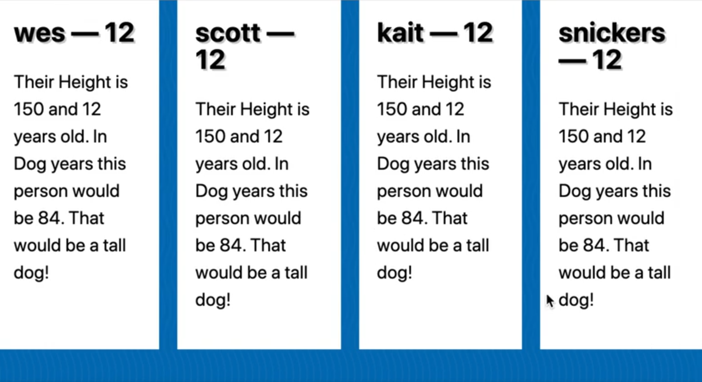 17:35 

The bonus step in the exercise involves putting a delete button on each card so when you click it, it is removed. 

We haven't gone over how to do this yet, but let's give it a try. 

Go to where we generate the card and add a button, as shown below 👇

```js
const html = `
  <div class="playerCard">
    <h2>${name} - ${age}</h2>
    <p>Their height is ${height} and  they are ${age} years old. In Dog years this person would be ${age *
  7}. That would be a tall dog!</p>
  <button class="delete" type="button">&times Delete</button>
  </div>
`;
```

 18:31

When that button is clicked, we want to delete the card. 

To achieve that, select all the buttons 👇

```js
const buttons = document.querySelectorAll('.delete');
console.log(buttons)
```

 19:00

Make the delete function 👇

```js
function deleteCard() {
  console.log("DELETE CARD! TODO");
}
```

Now loop over each card and attach a click event listener which will call `deleteCard()`, like so 👇

```js
buttons.forEach(button => button.addEventListener("click", deleteCard));
```

Modify the `deleteCard()` function to accept the event as a parameter and inside of the function, log the event's current target.

_NOTE: we haven't gone over how to do some of this but it's just bonus! We will go over this in future videos._

```js
function deleteCard(event) {
  console.log(event.currentTarget);
  console.log("DELETE CARD! TODO");
}
```

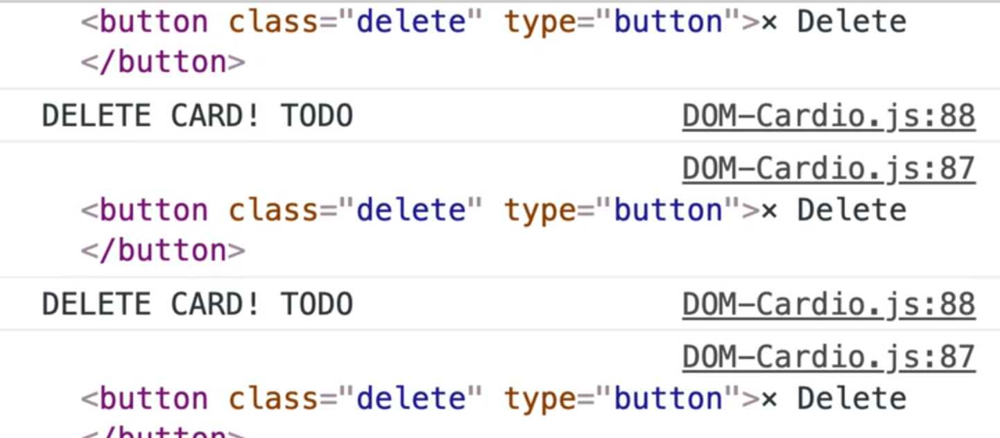 20:09

Inside of `deleteCard`, you can assign the button that is the event's current target to a variable, like so 👇

```js
const buttonThatGotClicked = event.currentTarget;
```

Now you need to grab the parent element. 

There are a few ways to do this. 

One way is using the following code 👇

```js
function deleteCard(event) {
  const buttonThatGotClicked = event.currentTarget;
  buttonThatGotClicked.parentElement.remove();
}
```

If you refresh the HTML page and click one of the delete buttons, you will see that is removed. 

### `closest()`

Another way you could have done it is using `closest()`, like so 👇

```js
buttonThatGotClicked.closest(".playerCard").remove();
```

What does `closest()` do? 

It will look at an element and move itself up the tree until it finds something that matches the parameter you pass it. 

That is cool because right now, both of those work, but let's say you where to change the position of the button. 

If you moved it inside of the paragraph tag instead of directly inside of the div, only the second method would work because the first method would delete the paragraph, not the div. 

The second method will search for the div or any element with a `playerCard` class and remove that. Even though the button has moved, it still works. 

That's a wrap for this lesson.

