# Module 6: Serious Practice Excercises

## 33 - Etch-a-Sketch

Now that we have gone over some of the fundamentals of Javascript, it is important for us to practice what we have learned so we can put our skills into use, and have fun along the way. 

In this video we will build an Etch-a-Sketch that you can control by moving the arrow keys around. 

Wes has added some fun things to it, for example the line is a rainbow gradient and then you can shake it an refresh. 

Another thing to note is whenever you reload the page, it picks a random spot to begin. 

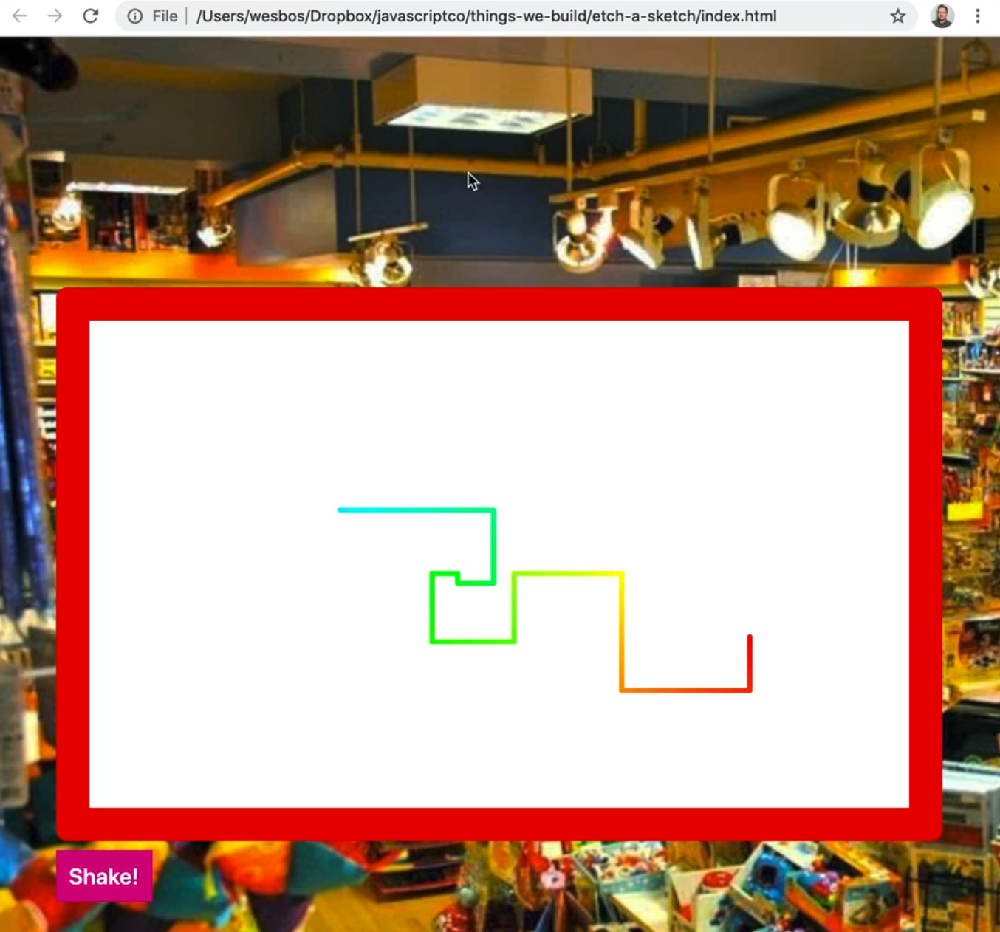 00:39

Topics we will be covering in this video include DOM elements and keyboard events. 

We will be learning about something called **canvas** in javascript, and we will be touching on **switch** statements which we have not learned yet. 

Inside of the `/exerises` directory there should be a folder called `/33 - Etch-a-sketch` containing 2 files: 
- `index.html` &
- `etch-a-sketch.js`

Open up the `index.html` file which Wes provided for us.

It should contain the following:
- a div with the class of `canvasWrap`
- a canvas element (which is an HTML element that is used for drawing on). We have explictly given the canvas element a width and a height. 

If you look at the CSS, you will notice that we have halved those width and height values for the canvas. 

The reason for that is beause you can think of the HTML width and height values we have set via HTML attributes as the actual width of an image.. those values represent that actual height and width of the canvas element. 

However, the values we set in CSS are the size that is should be on in the screen. The reason Wes halved the size via CSS is so that it won't look pixelated. 

On most screens, these things are going to be high resolution and when we are dealing with pixel based stuff, you want to be at least double so get crisp stuff on the page. 

We also have a button with a class of `shake` which is wrapped within a div because you could add other buttons like up, right, left, down for people who are on mobile and do not have arrow keys. 

We have some animation stuff which we will dive into later. 

```html
<body>
  <div class="canvasWrap">
    <canvas width="1600" height="1000" id="etch-a-sketch"></canvas>
    <div class="buttons">
      <button class="shake">Shake!</button>
    </div>

  </div>
  <script src="./etch-a-sketch"></script>
  <style>
      body {
        min-height: 100vh;
        display: grid;
        align-items: center;
        justify-items: center;
        background: white;
        background: url(https://s3.amazonaws.com/media.locally.net/original/HABA_ALT_2017-08-02-13-22-45.jpg);
        background-size: cover;
      }

      canvas {
        border: 30px solid #e80000;
        border-radius: 10px;
        /* Set the width and height to half the actual size so it doesn't look pixelated */
        width: 800px;
        height: 500px;
        background: white;
      }

      canvas.shake {
        animation: shake 0.5s linear 1;
      }

      @keyframes shake {

        10%,
        90% {
          transform: translate3d(-1px, 0, 0);
        }

        20%,
        80% {
          transform: translate3d(2px, 0, 0);
        }

        30%,
        50%,
        70% {
          transform: translate3d(-4px, 0, 0);
        }

        40%,
        60% {
          transform: translate3d(4px, 0, 0);
        }
      }
    </style>
</body>
```

Open up the javascript file `etch-a-sketch.js`, and open up `index.html` in the browser. 

Add a log to make sure the javascript file is properly linked. 

We are going to start by writing pseudo code for what we need to do within the javascript file. 
 
```js
// Select the elements on the page - canvas, shake button

// set up our canvas for drawing

// write a draw function 

// write a handler for the keys

//clear or shake function

//listen for arrow keys
```

If you have never seen **canvas** before, the way it works is that you go ahead and grab onto the canvas, then you grab onto this thing called "**context**" which is either 2D or 3D (we will be working with 2D canvas today), and then you have a set of APIs (methods) that are used for drawing on the canvas. 

Think of something like Microsoft Paint. 

Rectangles, circles, drawing, lines, borders, different fill colors, all of those things are available to us in canvas and they are used for when you want to programmatically draw something to the browser. 

If you inspect the canvas element in dev tools, you will see that it's just a regular old canvas element. 👇

 5:12

Grab the canvas. 

```js
const canvas = document.querySelector('#etch-a-sketch');
```

Next you need to grab the context. 

The canvas is the elements and the place where we do our drawing is called the context, where we will be drawing our circles and everything too. 

You get the context like so 👇

```js
const ctx = canvas.getContext('2d');
```

Note: `ctx` is a very common variable name for context. 

If you google `three.js` you can see a lot of examples of things people are doing with 3d canvas. 

Next, we need the shake button. 

The shake button has a class of 1 which we can use to grab it. 

```js
const shakebutton = document.querySelector('.shake');
```

Now we have all of the different elements we want. 

Now we need to setup our canvas for drawing. 

We will just set a couple of defaults on the canvas. 

```js
ctx.lineJoin = 'round';
ctx.lineCap = 'round';
```

Those two settings ensure that we get a smooth drawing. 

By default, you are going to get a squared off edge and that doesn't look as good. You can also set the width of the line to be as wide as you want. By default, it's one pixel. 

We want it to be thicker so set the lineWidth to be 10 (you don't have to specify the pixel value). 

```js
ctx.lineWidth = 10;
```

Refresh the HTML page and then open up the console. 

Type in `ctx` so you can have a look at our ctx. 

You will see we get this `CanvasRenderingContext2D`.

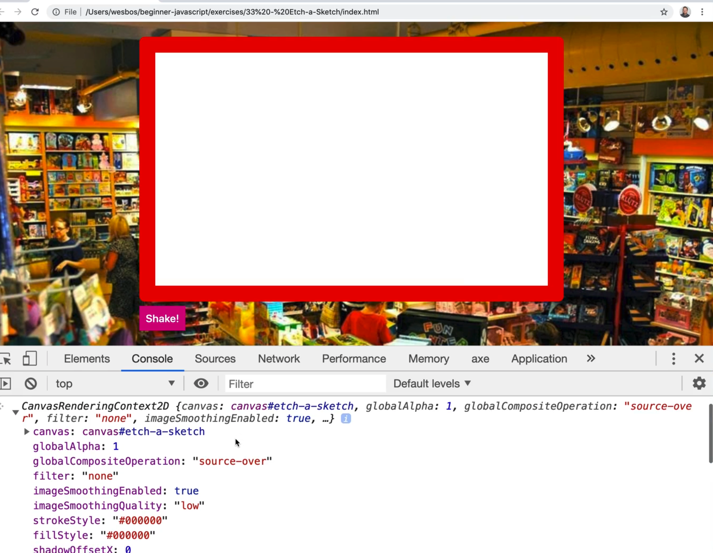 8:03

This is our context object. 

Inside are all these different properties that you can set or get from them, including what color the fill will be, the stroke will be, etc. 

Next you have to put the drawer somewhere, meaning you have to put the dot somewhere because that will be the starting point of hte etch-a sketch.

If you load the finished project in an HTML page and refresh the page, each time it loads, you will see that the dot is randomly places. 

First let's work on placing the dot, and then we will randomize it. 

Take the ctx and run something called, `beginPath()` which will start the drawing. 

TO describe what `beginPath` does is you can think drawing with a marker. You have to start by placing the marker somewhere on the page, which is the equivalent of `beginPath`. 

Next move the context. 

```js
ctx.moveTo(200,200);
```. 

That will place the dot 200 pixels from the left and 200 pixels from the top. 

Then run the following. 👇
```js
ctx.lineTo(200, 200)
ctx.stoek();
```

`ctx.stroke();` will draw a line between where you started and where you drew your line to. That will sort of make an invisible line and that will stroke it.

Now if you refresh the page, you will see a dot 200 pixels over and 200 pixels down. 

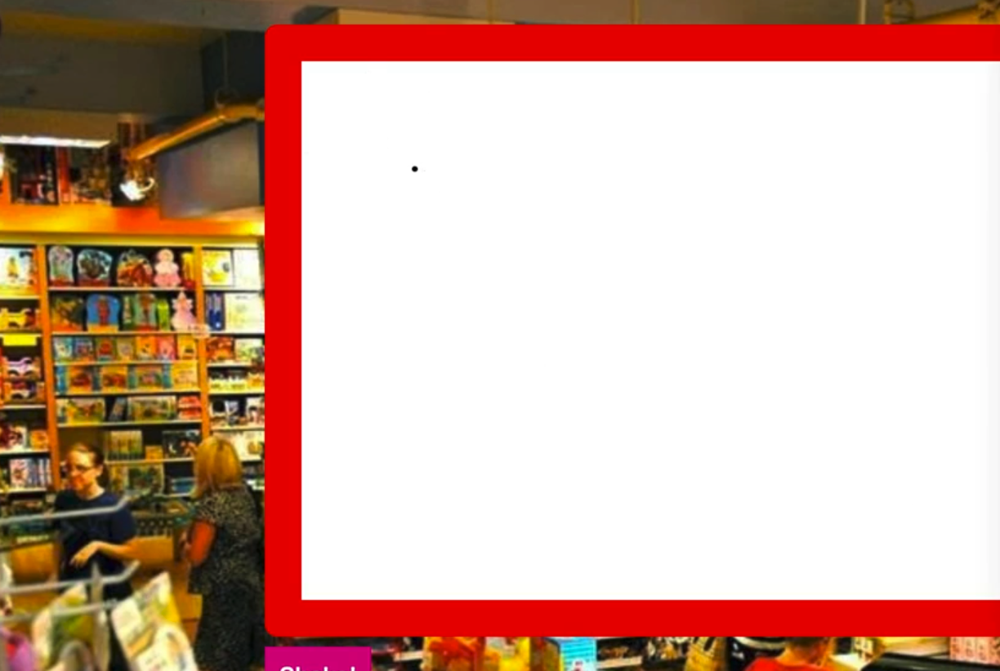 9:50

What is cool about an Etch-a-Sketch is that it can start in a random spot. 

How can you pick a random spot in this Etch-a-Sketch? 

You could take the width, and the height and then generate a random number between zero and the width and then zero and the height. 

 ```js
 const width = canvas.width;
 const height = canvas.height;
 console.log(width, height);
 ``` 

If you log the width and the height, what will you get get? 

You will get 600 and 1000 which are the actual height and weight of the canvas, not the display width. 

You might notice that when you save the javascript file, Prettier modifies the variable declarations for width and height like so 👇

 10:38

Prttier is doing **destructing** for us. 

If you are simply making variables from a property on an object, you can short form this. 

Instead of the following 👇

```js 
const width = canvas.width;
const height = canvas.height;
```

You can do this shortform 👇

```js
const { width, height } = canvas;
```

That is called **destructuring**.

Meaning that yo take the width property and put it into a variable `width`, and take the `height` property and put it ito the variable `height`. 

That is a nice short way to do that. 

We will do a lot more destructuring in this course, this is just our first time encountering it. 

Why are you grabbing the width and height variables? 

Wes likes to have top level variables. He finds it easier to use when doing math. It's much easier than writing` canvas.width` every time. 

Now we want to create a random x and y starting points on the canvas. 

So how do you create random values in Javascript? 

You may have seen that we have **Math.random()**. 

If you type that into the console, you will see that it gives us a random number that seems to always be underneath one. 

 12:54

Can we just pass a random number? 

Could we do something like `Math.random(100)`? No, that doesn't do anything. 

Let's look at the docs!

 13:19

`Math.random` returns a floating-point (that means it contains decimals), pseudo-random number in the range of 0 to 1, inclusive of 0 but not 1. 

That means there is a possibility that you will get zero, but you will never get one. 

It doesn't take any arguments or anything like that.

What you can do is take the `Math.random` value that it gives you and multiply it by 100, you are going to get a random number between zero and 99.99999. 

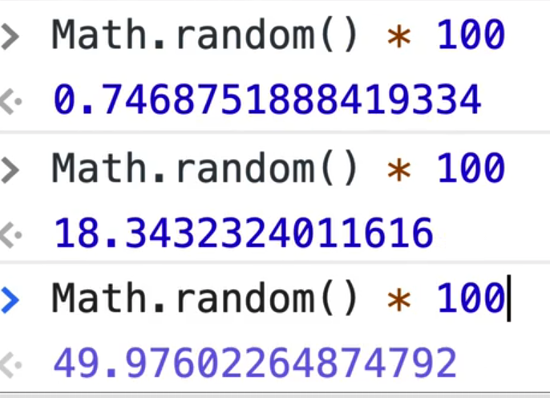 14:09

Then what you can do is run `Math.floor(Math.random() * 100))`, which should give us a number between 0 and 99. 

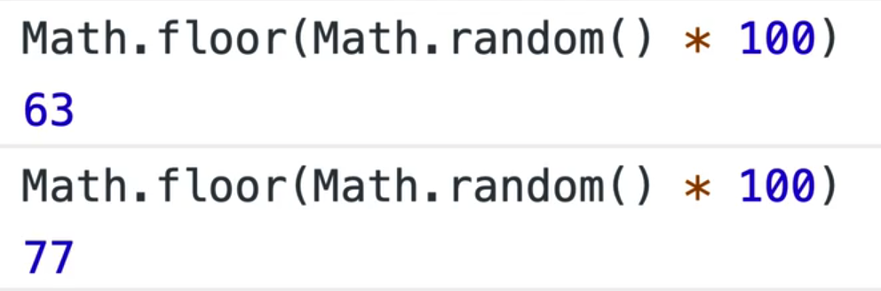 14:24

So that is exactly what we are going to use. 

Modify the code like so 👇

```js
const { width, height } = canvas;
let x = Math.floor(Math.random() * width);
```

Replace the hard coded x value was passed to `ctx.moveTo` and `ctx.lineTo` with the variable x. 

```js
ctx.beginPath();
ctx.moveTo(x, 200);
ctx.lineTo(x, 200);
ctx.stroke();
```

Now when you refresh the page, you should see that we are randomly getting an x value.

Now do the same for the y value.

```js
let y = Math.floor(Math.random() * height);
ctx.moveTo(x,y);
ctx.lineTo(x,y);
```

We might need to come back and modify that so it moves a little bit quicker but we can leave it there for now.

For now, whenever you refresh the page you get a random x and y value that moves the dot around the page. 

If you change `ctx.lineCap="round";` to `ctx.lineCap = "square";` it looks like this 👇

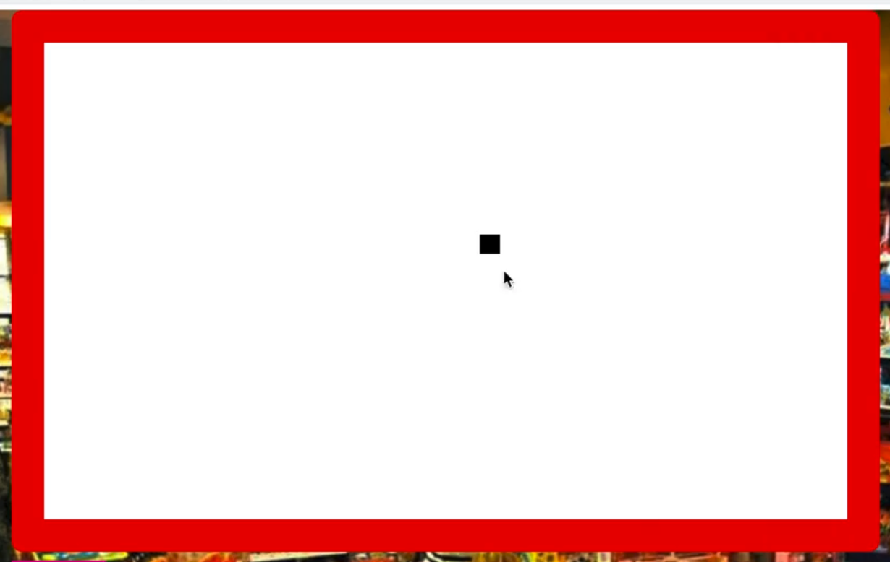 16:23

But switch it back to round because we want to use round.

Now that we have the basis of our canvas working.

Write the handler for working with the arrow keys. You need to know whether to move the line up or down or left or right. 

Make a function called `handleKey`. 

Listen for the arrow keys using a keydown event listener. 

You can listen for a keydown event on anything, we already did it on text inputs, but if you want to listen to it site wide, you listen to it on the window. 

Listen for a keydown event and when it occurs, run `handleKey`. 

```js
function handleKey(){
  console.log("HANDLING KEY");
}
window.addEventListener('keydown', handleKey);
```

Refresh the `index.html` page and open the console. 

Click on the HTML page and try pressing the arrow keys (up, down, left, right) and you should see the console logging "HANDLING KEY" every time you press a key.

You might notice that when you hit the arrow keys, the page is also scrolling.

That is because it's a default. You probably don't want to turn off the scroll default unless you were accounting for the page being loaded on a very small window but if you did want to, you could just pass the event to the `handleKey` function like so `handleKey(e)` and call `e.preventDefault();` on it.

If you refresh the HTML page, and then hit COMMAND + R on your keyboard, that should refresh the page. 

However, when you try it, you will notice that it does not refresh the page. 

That is because you called `preventDefault()` on every keydown event. 

Comment out the `e.preventDefault()` line of code within the `handleKey()` function and then manually refresh the HTML page. 

```js
function handleKey(e) {
  // e.preventDefault();
  console.log(e.key);
  console.log("HANDLING KEY");
}
```

Now, if you were to press any key, you would see it logged in the console. 

We only really care about the arrow keys so what we can is check whether the key value has the word arrow in it. 

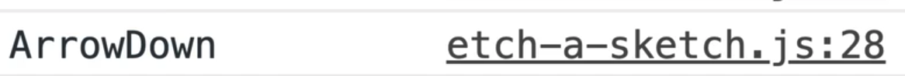 19:39

Add an **if statement**, which we haven't learned about before, but if conditions check if something is true (whether it evaluates to boolean true or false), and then runs a block of code based on that condition. 

Check whether the key includes the word arrow, and if it does, move the logic to log to the console within the if block as well as the `preventDefault()` call, like so 👇

```  js
if (e.key.includes("Arrow")) {
       e.preventDefault();
    console.log(e.key);
    console.log("HANDLING KEY");
}
```

Now, if you refresh the HTML page, if you use any of the arrow keys, you will see it logged in the console, but if you press any other key, it won't. 

You should now be able to press command + R to refresh your html page using the keyboard shortcut. 

That was just the handler. Now you need to hand off the key to the `draw` function.

Let's create a function called `draw` that takes in an argument. 

Instead of just having a `key` passed as the first argument, it will take in an `options` object. 

That options object will contain everything that you wish to pass to the draw function. 

This is useful when you have a function that needs a lot of things passed to it. 

It's too long to pass in that many variables such as 👇

```js
function(one, two, three, four five)
``` 

You need to pass them in the specific order and if some of them are optional, it gets even trickier. 

So instead of passing each argument, we will pass in the option object which will contain different properties that contain the data we need. 

```js
function draw(options){
  console.log(options.key);
}
```

Although we haven't learned objects yet, in the handler, you will be passing in an object that has a key property whose value is `e.key` like so 👇

```js
functionHandleKey(e){
  if(e.key.includes('Arrow')){
    e.preventDefault();
    draw({key:e.key});
    console.log(e.key);
    console.log('HANDLING KEY');
  }
}
```

Now, within the `draw` function, log the `options` argument.

At this point you have the following:
- event listener, which listens for keydown and runs `handleKey`
- `handleKey` checks if the key is an arrow if it is, passes that along to the `draw` function.
- `draw` has an object and inside of that there is one property `key` which tell us the key is arrow up. 

Another thing Wes likes to use, similar to how we used destructing in an earlier example, is using destructuring in function declarations. 

So instead of doing the following 👇

```js
function draw(options){
  console.log(options.key);
}
```

We could destructure the options object directly into a key variable like so 👇

```js
function draw({key}){
  console.log(key);
}
```

This gives us a top level variable called key that you can use directly.


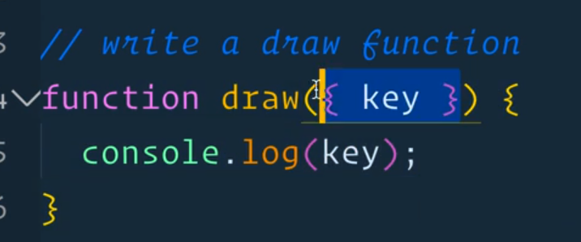 22:57 

So this curly bracket above 👆 is called **object destructuring**, where you can take properties and rename them into proper variables and it allows you to have shorter variable names.

Get rid of the logs within the handlers. 

That should leave one log of the key within the draw function. 

If you refresh the HTML page and press the arrow keys, you will see they are being logged.

Now, when someone goes ahead and uses their keys, you can start to draw directly onto the canvas.

Just like you have created `ctx.beginPath` earlier in the javascript file, call call `beginPath` on the context within the draw `function`. 

```js
function draw({ key }) {
  console.log(key);
  //start the path
  ctx.beginPath();
}
```

Similarly like you called `ctx.moveTo(x,y)` earlier, call `moveTo()`. 

You want to move the context to where it was so add the following 👇
```js
ctx.moveTo(x,y);
```

Next you need to move the x and y depending on what the user did. 

Add the following:

```js
// move our x and y values depending on what the user did
x = x - 10;
y = y - 10;
ctx.lineto(x,y);
ctx.stroke();
```

So what you did there was change the x and y values and then you created a line to our new `x` and `y` values, and then called `.stroke()`. 

You may notice that Prettier/ESLint is complaining that x and y are const values, which cannot be updated. 

Previously, ESLint or Prettier noticed that our `x` and `y` values which we had saved as let variables were never updated, so ESLint updated them to const. 

However, now that you want to change those values, you need to switch them back to lets. 

You also may notice that when you save your javascript file, it reformats from `x = x - 10;` to `x -= 10;` which is a short form way to say the same thing. 

Now if you refresh the page and press an arrow key, you will see an error in the console that says something like this: 

>Uncaught TypeError: ctx.lineto is not a function
>   at draw (etch-a-sketch.js:31)
>    at handleKey (etch-a-sketch.js:42)

That is because it should be `ctx.lineTo(x,y)`. 

Make that change in your code.

Now if you refresh the page and hit an arrow key, you should see a line being drawn on the etch-a-sketch! 

What is happening there is anytime an arrow key is pressed we are removing 10 pixels from the x and 10 from the y, and then we paint. 

That's obviously not what we want but this is just to demonstrate that it is responding to our key pressed. 

One thing Wes doesn't like doing is hard coding the values like `x = x - 10;`.

Instead, setup a variable amount and set that at the top of the file and reference it to change the value whenever we want. 

Add the following towards the top of the file 👇

```js
const MOVE_AMOUNT = 10;
```

You may be wondering why did Wes use all capitals for that variable name? 

It's not a "best practice" but it is something that some developers do and Wes has picked it up himself. 

When it is a true constant, meaning that value will never change, we tend to make it uppercase and use underscores. 

Now, go through our `etch-a-sketch.js` file and everywhere that you have used `10`, and replace it with `MOVE_AMOUNT`.

Now you have used one variable to reference the width everywhere we go. 

Now you don't want to just go up and to the left whenever someone presses an arrow key. 

You need to go back into our draw function and write a bit more code that depending on which arrow key the person has done, you can do react.

We haven't really learned about **flow control** yet (if statements and such), but this is a perfect case to learn for something called a **switch statement**. 

Wes doesn't use switch statements all that often, but it is perfect use case.

A switch statement is essentially saying, take in a variable like the key, and depending on all of the different cases (it might go up, down, left or right).

There are four possible cases in this example. Each of those cases has a different outcome. 

A switch statement allows us to say "based on these four different outcomes, do the following". 

Within the `draw` function remove these two lines of code 👇

```hs
x -= MOVE_AMOUNT;
y -= MOVE_AMOUNT;
```

Instead run a switch statement. 

Pass the switch statement the variable you want to run it against (the `key` in this case), and then the cases are the possible values that key might be. 

Note: a switch statement could also be written as an if statement such as 👇

```js
if(key == 'ArrowUp'){

}
else if(key == 'OtherValue'){
  
}
```

However a switch statement is a lot more readable. 


Add a case for `'ArrowUp'`. 
If key equals 'ArrowUp', we will move the `y` 10 pixels like so ` y = y - MOVE_AMOUNT;`. 

```js
switch(key){
 case 'ArrowUp':
  y = y - MOVE_AMOUNT;
   
}
```

You might notice if you save the code, VS Code will throw an error complaining that the switch statement expects a default case. 

A switch statement should always have a default case which specifies the behaviour to execute if none of the other cases match (if key does not equal ArrowUp, ArrowDown, ArrowLeft or ArrowRight in our example). 

Hopefully that should never happen but it's always best practice to give your cases a default. 

Make the default just break, like so 👇

```js
  switch (key) {
    case "ArrowUp":
      y -= MOVE_AMOUNT;
    default:
      break;
  }
```

Actually in a switch statement after every single case, you have to write the `break` keyword which will actually stop the switch from running, and skip over the rest of it.

Here is what you have so far:

```js
switch (key) {
  case "ArrowUp":
    y -= MOVE_AMOUNT;
    break;
  default:
    break;
}
```

You have only implemented the case for ArrowUp. 

If you refresh the page and hit the arrow up key, you should see a line being drawn! 

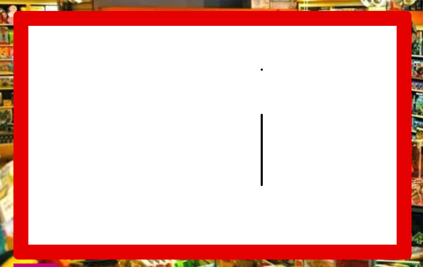 31:06

Now, let's add the rest. 

Duplicate that case three more times. 

For `ArrowRight`, you will increment the x value. 

For `ArrowDown` the y value will be incremented. 

For ArrowLeft, the x value will be decremented.

```js
switch (key) {
  case "ArrowUp":
    y -= MOVE_AMOUNT;
    break;
  case "ArrowRight":
    x += MOVE_AMOUNT;
    break;
  case "ArrowDown":
    y += MOVE_AMOUNT;
    break;
  case "ArrowLeft":
    x -= MOVE_AMOUNT;
    break;
  default:
    break;
}
```

_Note: if you get an error about the x being a const, that is likely the result of prettier changing it if it doesn't see it being updated anywhere in your code. You need to change it back to a let variable._

Now refresh the page and let's try it!

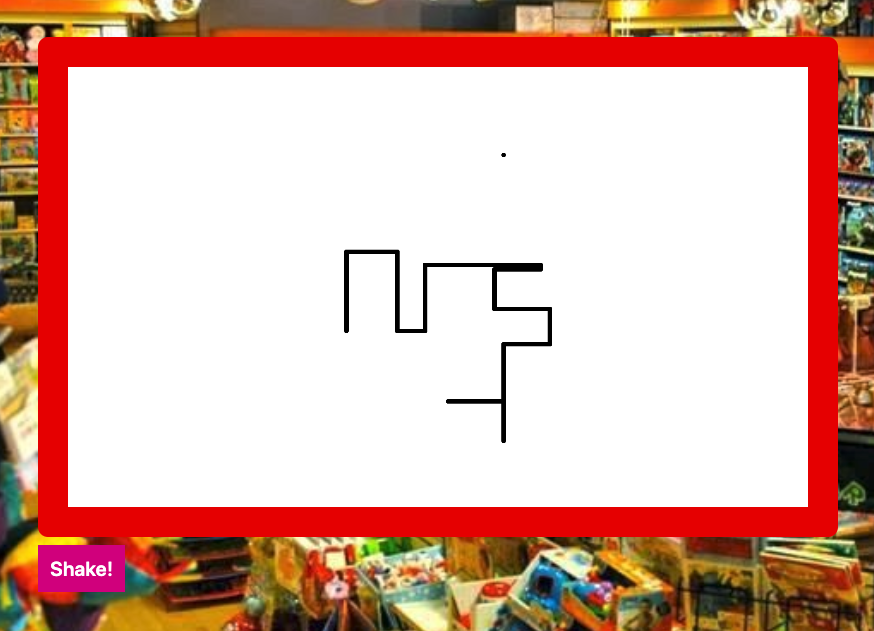 32:02

Now what you want to do is modify the code so the colour of the line changes as you go along.

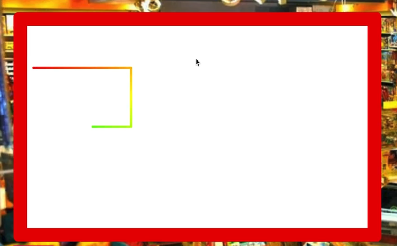 32:30

That is actually very simple to do, you just have to change the HSL values. 

If you have never seen Mothereffing HSL, Wwa would recommend going to https://mothereffinghsl.com. 

**HSL** is a way to declare color in a browser. 

It is similar to Hex Codes and RGB, but HSL is a cool way to do it. 

If you just hover over the gradient, you will see the H value goes from zero to 359-360. Once you pas that, it will just go from the start and give you a rainbow. 

Tou can use that value, every time you move the cursor, increment the H value (hue) by 1. 

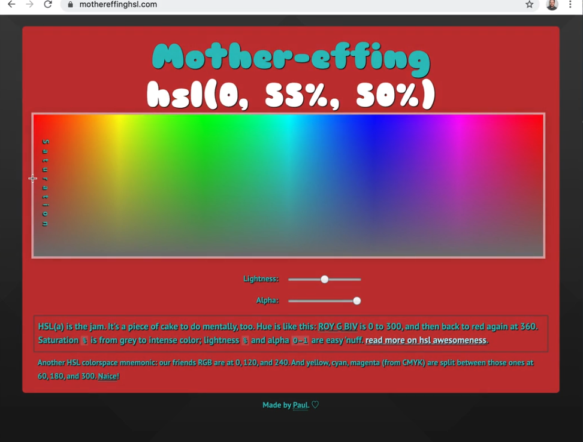 33:00

Above the `draw()` function, make a new variable called `hue` and set it to 0. 

Next update the stroke color to start at a bright green like so 👇

```js
const hue = 0;
ctx.strokeStyle = `hsl(100, 100%, 50%)`;
```

Now instead of hard coding the first argument to hsl, interpolate it to pass in the `hue` variable like so 👇

```js
ctx.strokeStyle = `hsl(${hue}, 100%, 50%)`;
```

The line will always be red, but what you will do is every time that you use the draw function, increment hue by one and update the stroke style. 

Add the following code 👇

```js
// write a draw function
function draw({ key }) {
  // increment the hue
  hue += 1;
  ctx.strokeStyle = `hsl(${hue}, 100%, 50%)`;
```

You need call `strokeStyle` again, even though you set it on page load to be a variable. 

That is done once the page loads, it's not like a live variable that will update itself. 

You have to explicitly update the strokeStyle by 1. 

If you try it now, you will see that it works. 

If you want to change the colors more quickly, you can instead add `+ 10` when incrementing the hue. 

You can also try to play around with it and do something like this 👇

```js
ctx.strokeStyle = `hsl(${Math.random()*360}, 100% , 50%);
```

That will give you cool effects like these 👇

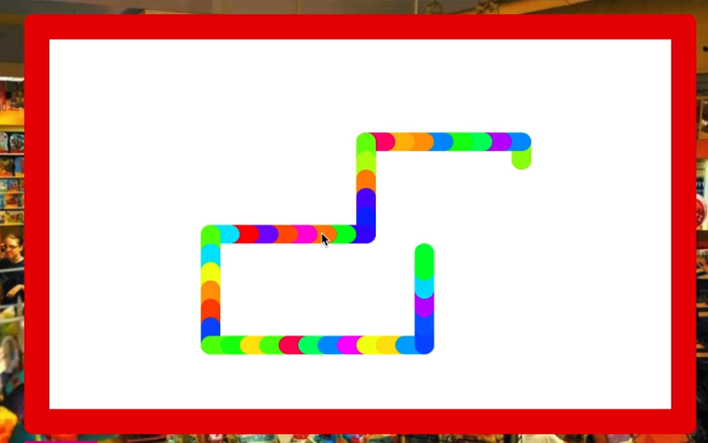 36:22

You can have a lot of fun with HSL. 

### Shaking / Clearing the Canvas

Now you need to work on the shake / clear canvas function! 

The idea for this effect is to be similar to what you do to clear a real etch-a-sketch, you shake it! 

We will have a shake button that is responsible for triggering this. 

Add the following code 👇

```js
// clear or shake function
function clearCanvas()){
  canvas.classList.add('shake');
}
```

Now, when you refresh the HTML page and run `clearCanvas()` in the console, you should notice the etch-a-sketch doing a little shake animation. 

That is because the class of `shake` is applied to it.  Wes has written some CSS to create that effect in this code 👇

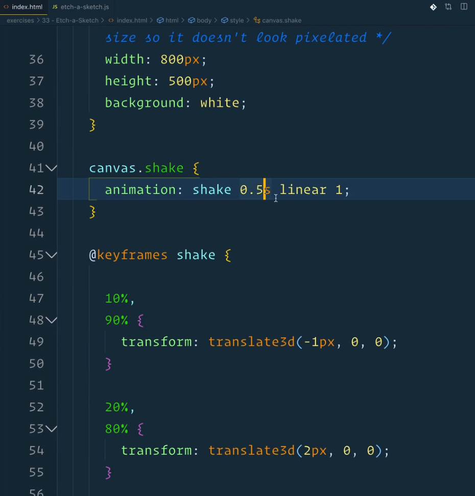 38:01

```css
canvas.shake{
  animation: shake 0.5s linear 1;
}
```

What we are saying there is when the canvas has a class of `shake`, run the shake over 0.5 seconds, run it linearly and only run it once. 

You could run the animation 10 times if you wanted by pass in the 10 instead of 1. 

There are a couple of problems here. 

If you were to run `clearCanvas()` again in the console, you will notice nothing happens because the canvas already has a class of `shake`. 

However if you were to manually remove that class of shake and then call `clearCanvas()`, it would work. 

You might be thinking what if the solution is wait .5 seconds and then remove the shake class? 

However, trying to lineup timers that are set in your CSS with your Javascript, it is okay but tends to get you in a world of hurt. 

What you can do is listen for the animation to finish and then programmatically remove the class from it.

Just like we can listen to a click, we can listen to this event called `animationend`. 

Within the `clearCanvas()` function, add an event listener that listens for the `animationend` event and when that event happens, run a function that will remove the class of shake for the canvas. 👇

```js
// clear or shake function
function clearCanvas() {
  canvas.classList.add("shake");
  canvas.addEventListener("animationend", function() {
    console.log("done the shake!");
    canvas.classList.remove("shake");
  });
}
```

Now if you refresh the page and run `clearCanvas()`, you should see the console log and the canvas should shake again. 

However if you run it again and again from the console, you will notice that "done the shake" is being called many times 👇

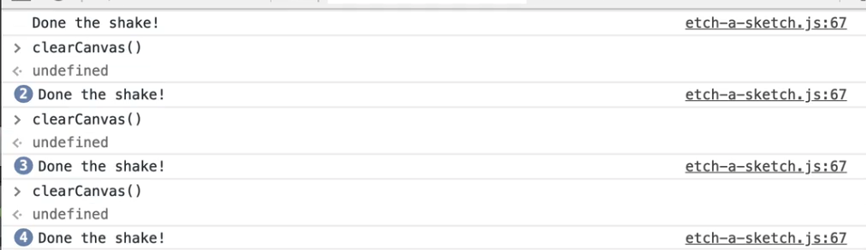 41:02

You may be wondering what is going on. 

This is a common problem, what you are doing is when you run `clearCanvas()`, you add the class, listen for that animation to be over, and then we remove it. 

But what is happening is the canvas still has the event listener of `animationend` added to it. 

Every time you clear the canvas, you are adding a new event listener to it over and over again. 

The number of times you ran `clearCanvas()` in the console was the number of event listeners that were being added for the same thing. 

If you click on the canvas element in the dev tools and then select the "Event Listeners" tab 👇

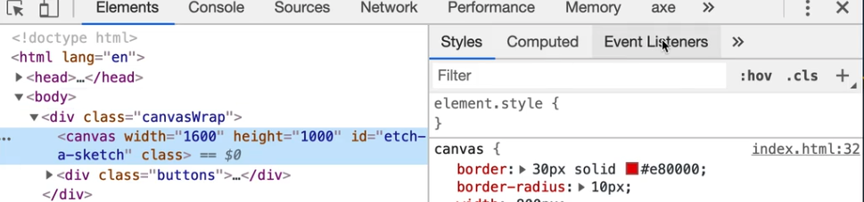 41:38

You will see that you are listening for the animationend event every time we run it 👇
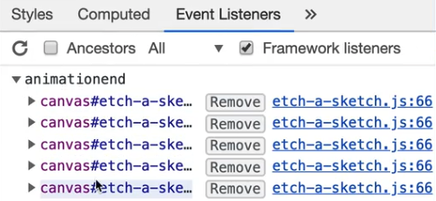 41:44

That is obviously not what you want. 

Wes mentioned earlier that there is another argument to `addEventListener`. 

The first two arguments specify what event the listener should listen on, and what to do when the event occurs. 

There is a third arguments object for addEventLIstener, and we have only so far used the `capture` option. 

### `once`

Now you are going to use the option `once`, which you will set to true. 

This causes `addEventListener` to unbind itself. It will call `removeEventListener` for you, without having to write any code.

```js
// clear or shake function
function clearCanvas() {
  canvas.classList.add("shake");
  canvas.addEventListener(
    "animationend",
    function() {
      console.log("done the shake!");
      canvas.classList.remove("shake");
    },
    {
      once: true
    }
  );
}
```

If you didn't have that option, you would have to call `canvas.removeEventListener('animationend'` and reference the function within which you are calling `removeEventListener`, which is a bit of a pain. 

Thankfully you don't have to do that and can use the `options` argument to set `once` to true, which will automatically remove the event listener when the animation is done. 

Now if you refresh the page and call `clearCanvas()` from the console, you will notice that you don't keep attaching event listeners. 

Instead the event listener is being added and removed, added and removed as needed. 

Next you need to hook up the `clearCanvas()` function to the `shake` button click.

Add an event listener on the button for a click event. 

```js
shakebutton.addEventListener("click", clearCanvas);
```

If you refresh the page and use the arrows to draw something on the etch-a-sketch and click shake, you might notice the animation happens but the content is not removed from the etch-a-sketch. 

That is because we forgot to do an entire part, which is clearing the canvas (which is actually very simple).

Modify the `clearCanvas()` function to add some more code. Right after you add the shake class, and before tiy add the `animationend` event listener, call `clearRect` on the canvas context. 

What that does is clear part of or all of the canvas. 

Tell it to start at 0,0 which is the top left hand corner of the canvas and go for 500 & 500 pixels. Add the following code 👇

```js
ctx.clearRect(0, 0, 500, 500);
```  

Now refresh the page and draw across the canvas.

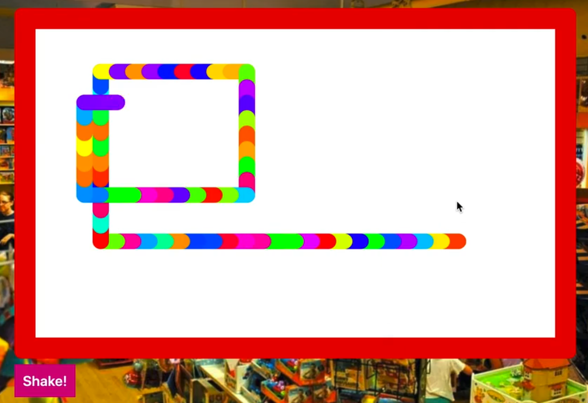

Now click the Shake! button. 

 44:3`

You should notice only a rectangle that is 500 by 500 pixels from the top left corner is cleared. 

Instead of hard coding the 500x500 pixel value, we will replace those with the variables that we created at the very top of the file, `width` and `height`. 

```js
ctx.clearRect(0, 0, width, height); 
```

Now if you refresh, it should all be cleared. 

That is all! 

That is our first exercise. 

We went a little over the stuff we have learned, and that is Wes' intention for these exercise videos. 

He is going to push us in these exercises by introducing some new concepts, destructuring, canvas, right in the exercise. 

This is so you can get an idea of how it works when you are in the headspace of building real world things. 

---

## 34 - Click Outside Modal

In this lesson we are going to learn how to check whether you clicked outside an element, which kind of tough. 

Let's look at the HTML we will be working with.  

 00:17

```html
<body>
  <div class="cards">
    <div class="card" data-description="Wes is cool">
      
      <h2>Wes Bos</h2>
      <button>Learn more →</button>
    </div>
    <div class="card" data-description="Scott is neat!">
      
      <h2>Scott Tolinski</h2>
      <button>Learn more →</button>
    </div>
    <div class="card" data-description="Kait is beautiful!">
      
      <h2>Kait Bos</h2>
      <button>Learn more →</button>
    </div>
    <div class="card" data-description="Snickers is a dog!">
      
      <h2>Snickers the dog</h2>
      <button>Learn more →</button>
    </div>

  </div>

  <div class="modal-outer">
    <div class="modal-inner">
    </div>
  </div>

  <script src="./click-outside.js"></script>
</body>
```

As you can see, each card has a random image, an `h2` and a button that says "learn more". 

Let's add the following CSS 👇

```html
<style>
  .cards {
    display: grid;
    grid-template-columns: repeat(auto-fit, minmax(200px, 1fr));
    grid-gap: 20px;
    padding: 2rem;
  }

  .card {
    background: white;
    padding: 1rem;
    border-radius: 2px;
  }

  .card img {
    width: 100%;
  }

  .card h2 {
    color: black;
  }
</style>
```

 2:55

That looks good. 

Moving onto the modal, add some dummy content inside of it so when we style it we can visualize what it will look like. 

```html
<div class="modal-outer">
    <div class="modal-inner">
      <p>Testing 123</p>
    </div>
  </div>
```

As you can see, there are two nested divs each with a class of`modal-inner` or `modal-outer`.

Go ahead and style the modal in the on position and then we will turn it off with CSS. 👇

```css
.modal-outer {
display: grid;
background: hsla(50, 100%, 50%, 0.7);
position: fixed;
height: 100vh;
width: 100vw;
top: 0;
left: 0;
justify-content: center;
align-items: center;
}

.modal-inner {
max-width: 600px;
min-width: 400px;
padding: 2rem;
border-radius: 5px;
min-height: 200px;
background: white;
}
```

 5:50

Now you have this modal which will pop up and you want to be able to close it.

Let's just do a really quick example to demonstrate how this works. 

We need to hide the modal by default. 

There are LOTS of different ways you could do that, such as `display: none`, `visibility: hidden`, or something that Wes likes to do is give it an `opacity:0`, which won't cut it in our case. 

That is because even if you did give the modal an opacity of 0, you will see that the modal will prevent the other elements from being clicked like that buttons. 

That is because the `modal-outer` is actually still there, even if you give it an opacity of zero. 

What you can do is give `modal-outer` a pointer event of none like so 👇

```css
.modal-outer {
  display: grid;
  background: hsla(50, 100%, 50%, 0.7);
  position: fixed;
  height: 100vh;
  width: 100vw;
  top: 0;
  left: 0;
  justify-content: center;
  align-items: center;
  /*hide this modal until we need it*/
  opacity: 0;
  pointer-events: none;  
}
```

That tells the browser to just ignore that any events that come to that and to not capture them. 

That is an example of where Javascript and CSS work together. 

Now if you refresh the page and give `modal-outer` an opacity of .5, in the dev tools, you will see that the modal outer is still there but you will see how the buttons underneath can still be clicked and the events aren't being captured by `modal-outer`.

 7:28

When the modal has a class of open, set the opacity to 1 and the pointer events to all. 

```css
.modal-outer.open{
  opacity: 1;
  pointer-events: all;
}
```

If you go into the dev tools and give `modal-outer` a class of `open`, it will show up. 

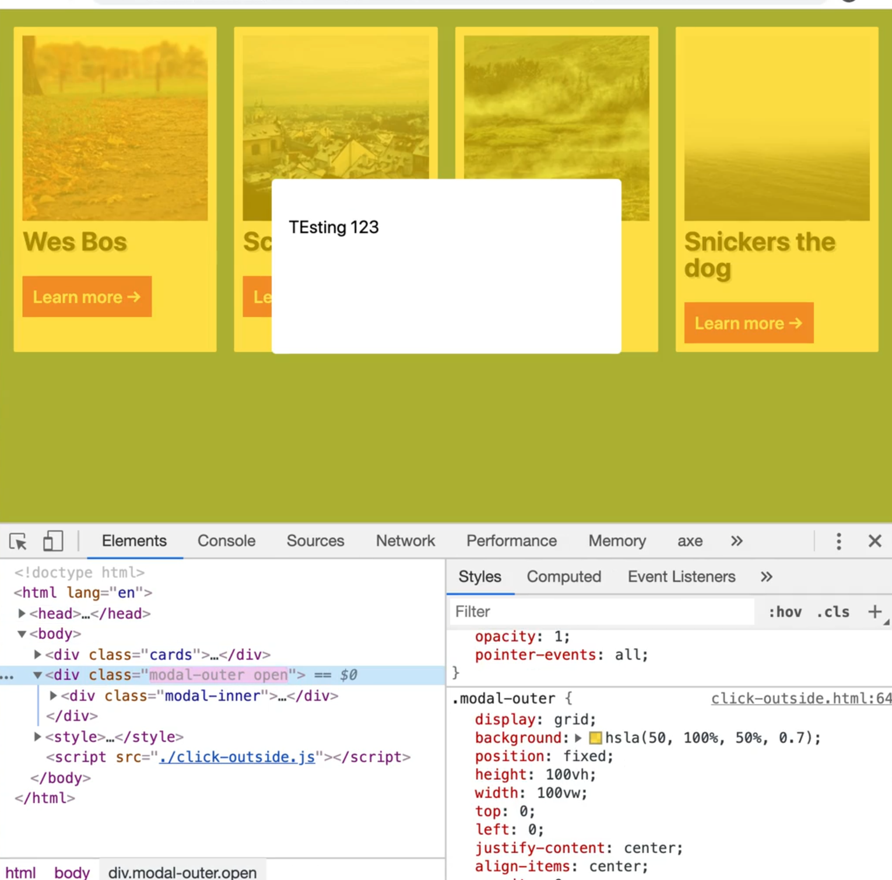 8:02

Let's add a transition to make that look a bit smoother. 👇

```css
/*hide this modal until we need it*/
opacity: 0;
pointer-events: none;  
transition:opacity:0.2s
```

Now if you refresh the page, grab the modal outer in the dev tools and give it a class of open, it will fade itself in, and then fade itself out. 

Now let's get into the Javascript.

We will work on clicking the button on each card now, starting by selecting them. 

Then we will loop over each of the buttons and add an on click event listener to each one and pass a function as the handler called `handleCardButtonClick`. 

```js
const cardButton = document.querySelectorAll('.card button');
cardButtons.forEach(button => button.addEventListener('click', handleCardButtonClick))
```

Above that code, go aheada and create that function. 

For now, just log "YA CLICKED IT" when the button is clicked. 

```js
function handleCardButtonClick(){
  console.log('YA CLICKED IT');
}

const cardButton = document.querySelectorAll('.card button');
cardButtons.forEach(button => button.addEventListener('click', handleCardButtonClick))
```

If you refresh the page and try to click on the buttons, you will see the log in the console.

Next you need to grab something to show in the modal. 

Let's grab the `data-description` of the parent card and show a larger version of the image. 

To do that, grab the current target from the event and assign it to the variable `button`. 

```js
const button = event.currentTarget
``` 

### `closest`

Now you need to find the card that is associated with the button. 

You could do `button.parentElement`, but if the button were to ever more or be nested inside of something, that wouldn't work that well.

What you can do is take the button and run the `.closest` method and search. 

It works kind of like `querySelectorAll` for the closest card. 

```js
function handleCardButtonClick(event){
  const button = event.currentTarget;
  const card = button.closest('.card');
  console.log(card);
}
```

Now when you click each card's button, you will see the card logged to the console.

What is great about using `closest` like we did is you can take any element, such as one of the `h2` elements on the card and search for the closest div, the closest HTML element. 

If there is something that does not find (like `$0.closest('.doesnotmatch')`) it will return `null` because there is no parent of it. 

 11:13

`.closest()` is like `querySelectorAll`, except it is the opposite where it will climb up the nested tree of DOM elements instead of look down the DOM tree.

We are going to use it once more within this handler. 

Grab the image source. 

```js
function handleCardButtonClick(){
 const button = event.currentTarget;
  const card = button.closest('.card');
  //grab the image src
  const imgSrc = card.querySelector('img').src;
  console.log(imgSrc);
}
```

If you refresh the page and click on the buttons, you should see the image source logged to the console.

Now, grab the description from the data attribute on the card, like so 👇

```js
const desc = card.dataset.description
```

Add a log as well to make sure it is working. 

Now when you refresh the page, and click the buttons, you should see the descriptions logged to the console.

 12:20

Next you can populate the modal with the card's info. 

Grab the modal above the `handleCardButtonClick` method so you do not need to reselect it every click.

```js
const cardButtons = document.querySelectorAll('.card button');
const modalInner = document.querySelector('.modal-inner');

function handleCardButtonClick(event) {
  const button = event.currentTarget;
  const card = button.closest('.card');
  // Grab the image src
  const imgSrc = card.querySelector('img').src;
  const desc = card.dataset.description;
 }
```

Also select the name 👇

```js
const name = card.querySelector('h2').textContent;
```

Within our handler, set the innerHTML of the modal using backticks. 

You want to replace the 200 value in the image sources with 600. Use the name as the alt attribute value. 

```js
modalInner.innerHTML = `
    
    <p>${desc}</p>
  `;
```

Next you want to show the modal. 

To do that, select the `modal-outer`, which you can do right above or below where you selected `modal-inner`. 

```js
const cardButtons = document.querySelectorAll('.card button');
const modalOuter = document.querySelector('.modal-outer');
const modalInner = document.querySelector('.modal-inner');
```

At the bottom of the handler function, add `modalOuter.classList.add('open');` to show the modal. 

```js
function handleCardButtonClick(event) {
  const button = event.currentTarget;
  const card = button.closest('.card');
  // Grab the image src
  const imgSrc = card.querySelector('img').src;
  const desc = card.dataset.description;
  const name = card.querySelector('h2').textContent;
  // populate the modal with the new info
  modalInner.innerHTML = `
    
    <p>${desc}</p>
  `;
  // show the modal
  modalOuter.classList.add('open');
}
```

If you refresh the page, you will see that it works. 

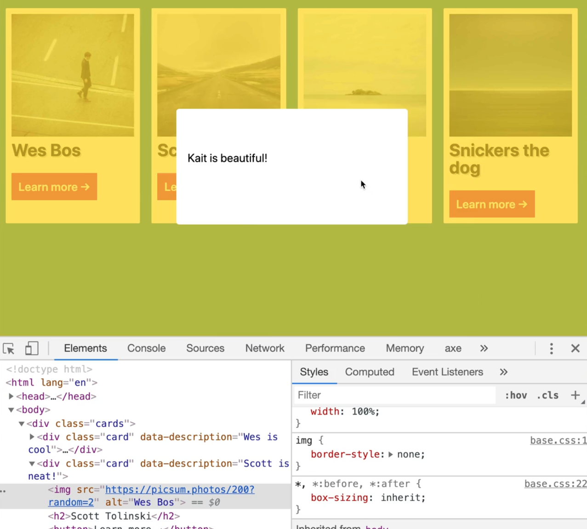 14:32 

The image is also there, it is just spilling out so let's fix the CSS. 

Add the following to the style tag

```css
.modal-outer img {
  width: 100%;
}
```

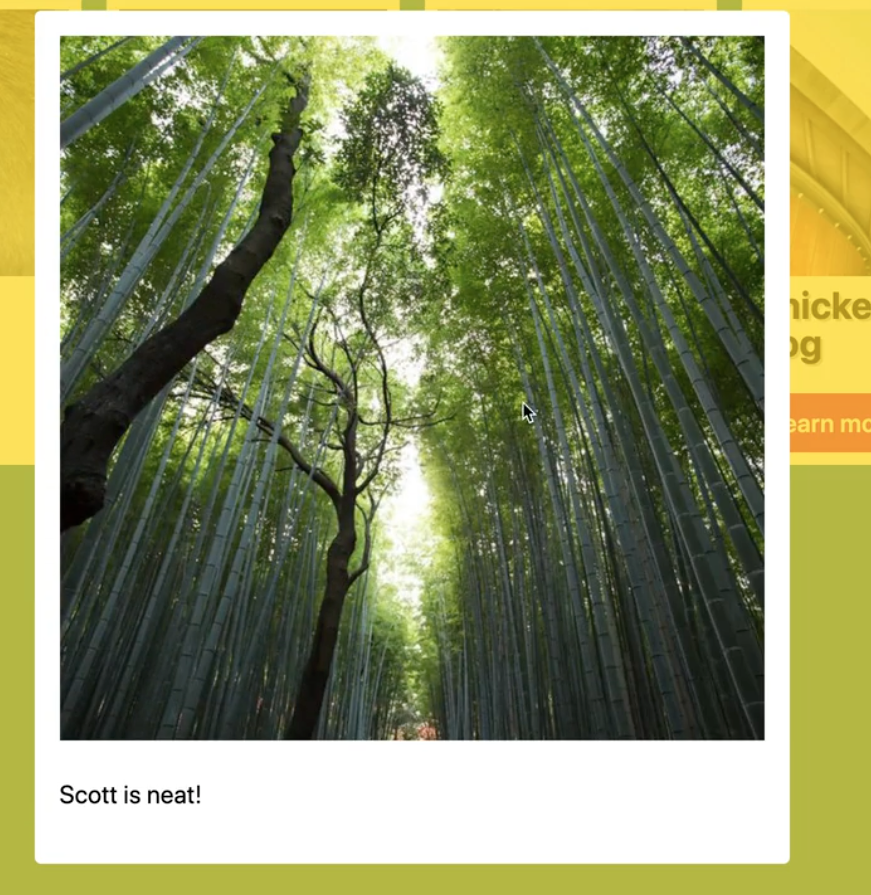 15:54

Good, now you have the bare bones of a modal. 

The other thing we need to talk about is closing the modal. 

Obviously we could have a function called closeModal which would take the `modalOuter` an remove `open` from the classList, like so 👇

```js
function closeModal(){
  modalOuter.classList.remove('open');
}
```

But how do we code it so that the modal closes when you click outside of it, and not on the text or the image or anything like that?

 16:33

We can solve this using a technique called **click outside**. 

What we will do is take the `modalOuter` and listen for a click on it. 

When that happens, take a look at the event, like so 👇

```js
modalOuter.addEventListener('click', function(event){
  console.log(event);
})
```

Now when you click outside the modal on `modalOuter`, you will see the click event logged. 

 17:13

Next log the `target` and `currentTarget` of the event.

```js
modalOuter.addEventListener('click', function(event){
  console.log(event.target);
  console.log(event.currentTarget);
})
```

 17:23

You might think this would be simple to solve because you can just check if the `modalOuter` and the `currentTarget` are the same thing, then tiy can go ahead and close it. 

But in the real world, modals are usually more complex than that. Sometimes they have elements on the outside, sometimes you want to listen for clicks on specific things. 

What you can do is use the `closest()` method to see if you are clicking inside of `modalInner` at all.

Make a variable called `isOutside` as assign it to the value of `e.target.closest('.modal-inner')`. Log the value of `isOutside`. 

```js
modalOuter.addEventListener('click', function(event){
  const isOutside = event.target.closest('.modal-inner');
  console.log(isOutside);
})
```

How that works is if you click on the modal or anywhere inside of it, it will find `modalInner`. 

However, if you click on something that is outside of the inner or a close button or something, it won't be able to find anything. 

[](@attachment/click-outside.gif) 18:57

So what you can do is convert the `closest()` to a boolean true or false by putting a bang in front of it like so 

```js
const isOutside = !event.target.closest('.modal-inner');
```
 
If it finds something it will be false, and if it doesn't finds something it will be true. 

That gives us a nice boolean we can use like so, 👇

```js
modalOuter.addEventListener('click', function(event){
  const isOutside = event.target.closest('.modal-inner');
  if(isOutside){
    closeModal();
  }
})
```

If you refresh the page now, it should work. 

Let's hook up the escape key really quickly. 

```js
window.addEventListener('keydown', event => {
  console.log(event);
  if (event.key === 'Escape') {
    closeModal();
  }
});
```

That is it for the lesson, now Wes will just demo some cool stuff.

Add the following style to `modal-inner` 👇 

```css
.modal-inner {
  max-width: 600px;
  min-width: 400px;
  padding: 2rem;
  border-radius: 5px;
  min-height: 200px;
  background: white;
  transform: translateY(-200%);
  transition: transform 2s;
}
```

Now the modal is way off the screen, above the browser. 

The transition will animate the transform over two seconds. 

When the `modalOuter` has a class of `open`, you want to grab `modalInner` and change the transform to be 0 so it goes back to where it should be. 👇

```css
.modal-outer.open .modal-inner {
  transform: translateY(0);
} 
```

Now if you refresh the page and try clicking on the buttons, you will see how it animates in now. 

However, you may notice that the transition is a bit jerky and not completely smooth. 

 22:17

What is happening there is the image isn't loading immediately. 

There are a couple of things we can do to fix that.

In `handleCardButtonClick`, set the width and height inline attribute on the image you set within the `modalInner.innerHTML` like so 👇 

```js
modalInner.innerHTML = `
  
  <p>${desc}</p>
`;
```

If you refresh the page, you should notice it's much smoother because the image is loading as it animates in. 

What about if you had a slower network, would it still look smooth? 

You can test this by going into the dev tools. 

Go to the network tab and click the dropdown arrow next to "Online"  

 22:55

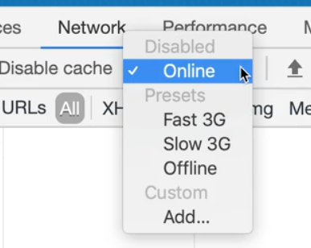 22:56

Select Fast 3G.

That option looks good but it is not perfect. 

The other option would be to use `document.createElement` to create an image and wait for that image to load. 

You would listen for the load event on the image and then run the `modalOuter.classList.add('open')` line of code. 

When someone clicks it you could show a spinner for a second as you wait for the image to load and then when it's loaded you can put it in. 

Personally Wes doesn't like that option because he doesn't think it is a smooth user experience. The user is just sitting there waiting for the image to load when they could be reading the text.

---

## 35 - Scroll Events and Intersection Observer

In this video we will learn about scroll events.

A **scroll event** is when someone goes ahead and scrolls on the page or the inside of an element. 

One thing you are likely to encounter in your career as a developer is building a terms and conditions scroll to accept.

That is where the user is forced to scroll all the way to the bottom of the text before the accept button will work.


First we are just going to dive into scroll events, and then Wes will show us why a scroll event is maybe not what you want, and there is this newer thing in the browser called **intersection observer** which actually might be what we want.   

In the `exercises` directory, find the `35 - Scroll To Accept` folder and open up the HTML page. 

You should see "IT WORKS" in the browser. 

In the example shown in the gif above, you can see it's not a window or document scroll. 

If you want to listen for a window scroll event you just listen for `window.addEventListener()`. 

If it's the case of another element that has an overflow scroll set on it, like Wess has done in the following style that is on the `scroll-to-accept.html` 👇

```css
.terms-and-conditions {
  overflow: scroll;
}
```

Select that element and listen for a scroll on it by selecting the `terms-and-conditions` class

```js
const terms = document.querySelector('terms-and-conditions');
```

Add an event listener to terms on the scroll event and just log the event with the handler. 👇

```js
terms.addEventListener('scroll', function(e){
  console.log(e); 
});
```

If you refresh the page, you will see the following error in your console
> scroll-to-accept.js:3 Uncaught TypeError: Cannot read property 'addEventListener' of null
    at scroll-to-accept.js:3

This is a problem you will run into often. What it means is that the selector is null. 

Go ahead and log `terms` to see whether anything is returned for our selector. 

```js
const terms = document.querySelector('terms-and-conditions');
console.log(terms);
terms.addEventListener('scroll', function(e){
  console.log(e); 
});
```

 2:19

As you can see, it did not find anything. When that is the case, your selector is probably wrong. 

Another `querySelector` issue you might run into is that it's pretty common to have some javascript that only runs on specific pages. 

If you were to run this code on your homepage for example, it will break. 

What do you do about that?

Wes deals with that scenario like this: he creates a function like `scrollToAccept` and he puts all of his code inside of that function.

Then within that function, after he grabs the selector, he will check if that element exists using a bang, and if it doesn't, he will return so the function exits. 

```js
function scrollToAccept(){
  const terms = document.querySelector('.terms-and-conditions');
  if(!terms){
    return; //quit this there isn't that item on tha page
  }
  terms.addEventListner('scroll', function(e){
    console.log(e);
  })
}
scrollToAccept(); 
```

What that will do is check whether something is found by the `querySelector`, and if it is, the rest of the code will run as expected and if not, you return from the function which will stop it from running and then it will never run. 

If you try screwing up your query selector now, you won't get an error because the function will exit instead of running the code.

Open up the scroll event that you are logging in the console. 

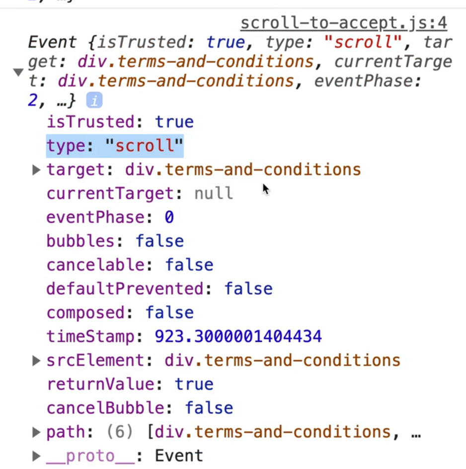 4:06
 
 The `currentTarget` is `null` at this point but if you were to log it, you would see it. 

Previously, to figure out if an element has scrolled all the way to the bottom, we used `e.target` or `e.currentTarget`. 
 
Either of them work in this case because a scroll event does not bubble like a regular click would.  So if you scroll on the terms and conditions element, you are not unintentionally scrolling anything else. 

Use `e.currentTarget`, then you can take the `scrollTop` value which is a property on elements that will tell you how far you have scrolled from the top. 

```js
terms.addEventListener('scroll', function(e){
  console.log(e.currentTarget.scrollTop);
});
```

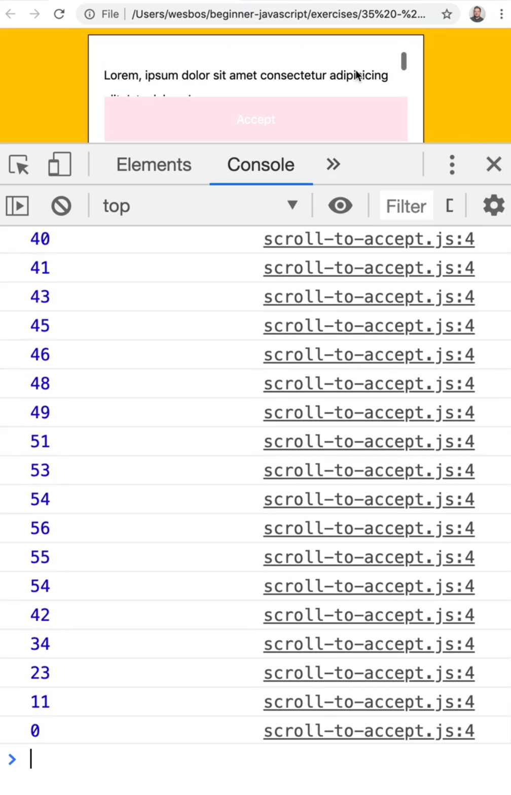 5:06

How do you know if you are scrolled to the bottom? How would you know that 1,828  pixels is the bottom for example? 

You need to also grab the `scrollHeight` to figure that out. 

The scroll height will tell you how high the scrolling thing is. 

```js
terms.addEventListener('scroll', function(e){
   console.log(e.currentTarget.scrollTop);
   console.log(e.currentTarget.scrollHeight);
 });
```

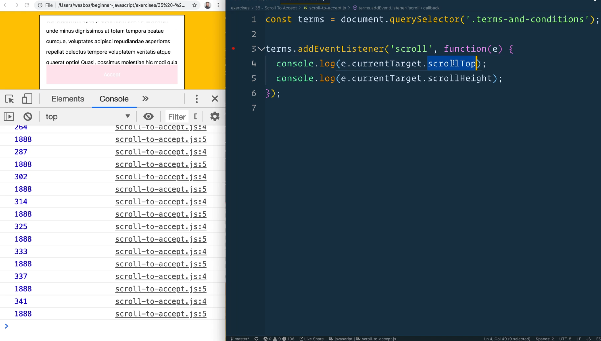 5:47

Now when you log that, you will see how far from the top you are scrolled and the second number is how high the actual scroll-able div is.

When you reach the very end, you should see the values are close.

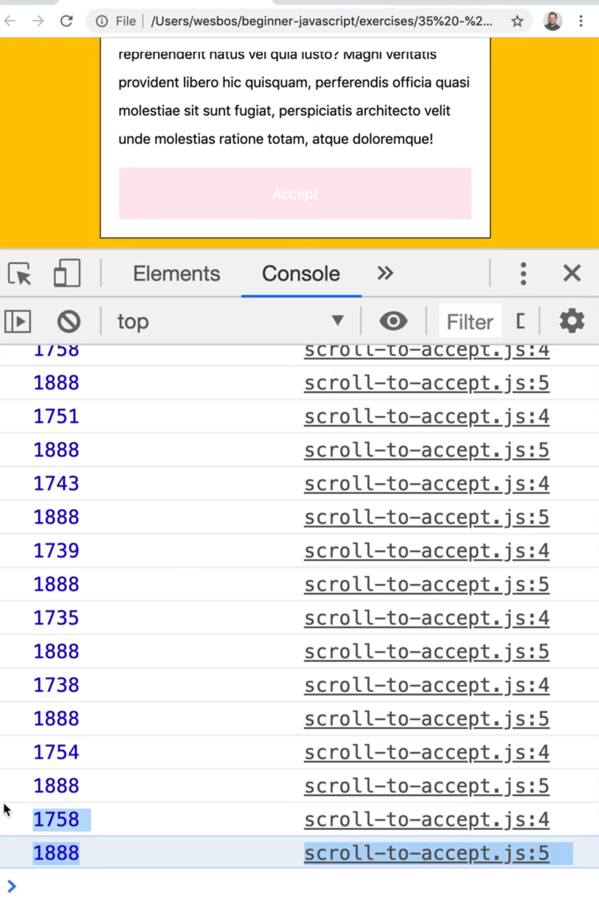 6:04

They are not perfectly close and that is because the elements have different CSS styles, one of them has margins and padding. 

That becomes a pain to work with because you have to work with offset heights and that is a thing of the past. 

You do not need to do it that way anymore.

### Intersection Observer

The way to do it now is called **Intersection Observer**. Rather than figuring out how far along the page the user has scrolled, you can use intersection observer to figure out if something is currently viewable on the page. 

You can do that with the `terms` div but first let's go over a simple example first to demonstrate how that works. 

Inside of the `terms` HTML, between one of the paragraphs, Wes will add a strong tag with a class of `watch` 

 7:04

We want to know when that strong tag is visible on the page.  

Grab the watch element at the top of the file.

```js
const watch = document.querySelector('.watch');
```

Next we need to create this thing called an **Intersection Observer**. An intersection observer will watch is an element is on or off or partway on or off the page. 

```js
const ob = new IntersectionObserver()
```

Do not worry about the `new` keyword for now, we will talk about it in future lessons.  

The intersection observer is going to take a **callback**, which is a function that gets called at a certain point. 

It is different than a click callback or a scroll callback because this callback will be fired every single time that it needs to check if something is running on the page. 

 ```js
 function obCallback(payload){
   console.log(payload);
 }
  const ob = new IntersectionObserver(obCallback);
```

Now that is not going to do anything if you refresh the page yet because the intersection observer is just a watcher and we haven't told it to watch any elements yet. It works a bit differently than our click handlers. 

Let's get rid of the scroll event listener that you have on this page as well. 

Take the observer and call the `observe()` method on it, and then you pass it something to watch for, such as the strong tag. 

```js
function obCallback(payload){
  console.log(payload);
}
const ob = new IntersectionObserver(obCallback);
ob.observe(watch);
```

Now, every time we you ahead and scroll, you will notice that you get this IntersectionObserver entity logged. 

 9:28

As you can see, it is full of information about all of the items that have come our way.

You will notice that after a bit of time when you scroll, it doesn't fire every time, it only fires when there is new information to be given to us.  

Right on page load, it tells us that the strong tag is off the page. But then as soon as you start to see it, even when it's just peeking out, the intersection observer entry is logged. 

If you take a look at what is in there, you will see some interesting things like the time that has passed from when you started observing it. That can be handy for games.

There is also the boolean `isIntersecting` which will tell you if it is on the page or off. 

 11:02

There is other information about the size of the element and what size it is on the page. 

That is helpful information in helping us determine whether that thing is on the page or not. 

Take that strong tag which is the first thing in the `paylod` because you can watch for multiple items.  👇

```js
function obCallback(payload){
  console.log(payload[0]);
}
```

Now if you refresh the page and scroll the strong tag into view, you will see that an **IntersectionObserverEntry** is logged. 

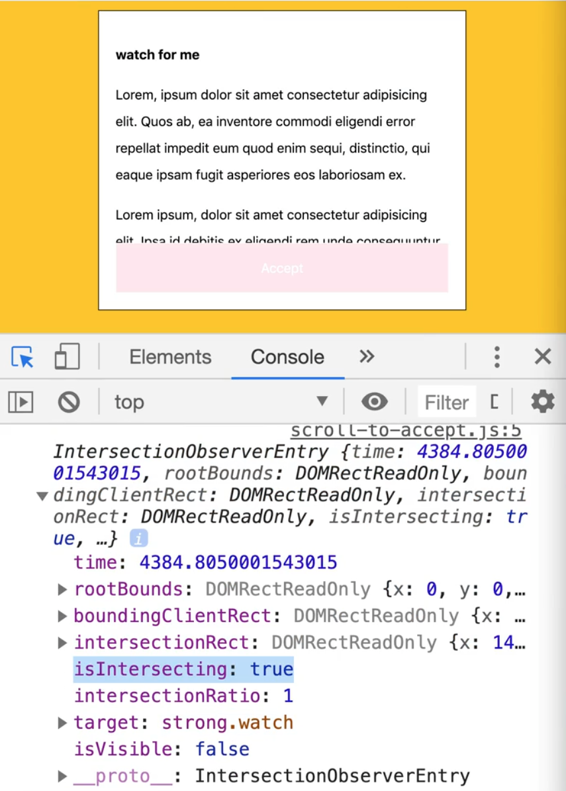 11:30

On that object there is a property `isIntersecting`, which is a boolean. 

Log that properties value,  👇

```js
function obCallback(payload){
  console.log(payload[0].isIntersecting);
}
```

 11:43

As you can see it tells us when it is on or off the page. 

What is cool about that is it will also tell us how much on the page it currently is by looking at the `intersectionRatio` property.  

```js
function obCallback(payload){
  console.log(payload[0].intersectionRatio);
}
```

 12:15

As you can see, the properties value changes based on what percentage of the element that is being watched is visible on the page. 

0 means not visible at all and 1 is visible. When it's partially visible it's 0.068402.

You can make use of that ratio to tell you if you have scrolled all the way to the bottom of the terms.

How will you know if you scrolled to the bottom? 

Take the terms and conditions and try to find out what the last thing inside of that is, because you want to wait for that element to be 100% on the screen before enabling the button. 

That is how you will know if the user has scrolled to the bottom.  

Stop watching for the strong tag, and instead watch the last paragraph on the `terms` like so

Replace 👇

```js
ob.observe(watch); 
```

with 👇

```js
ob.observe(terms.lastElementChild);
```

Now you are observing the last paragraph in the terms div. 

If you refresh the page and scroll to the bottom of the page with the console open, you should see something like the following 👇

 13:34

How do you get it to tell us when it is 100% on the page?

You can pass a second argument to our `IntersectionObserver`, which can be an `options` objects and you need to tell it 2 things. 

1. that the root of the thing you are scrolling with is the terms and conditions (by default it will be the `body`)
2. the threshold, which you can either give an array like `threshold: [0, 0.5, 1]` which would then tell you when its off, halfway on and the on, or you can say only tell me when it is fully on the page, like so 👇

```js
function obCallback(payload){
  console.log(payload[0].intersectionRatio);
}
const ob = new IntersectionObserver(obCallback, {
  root: terms,
  threshold: 1,
});
ob.observe(terms.lastElementChild);
```

If you refresh and open the console, you will see 0 which tells us it is off the page and if you scroll to the bottom... uh-oh, we have an issue here. 

Even when we scroll to the very bottom it's not firing. 

 14:32

If you change the threshold to something like 0.11497, it will fire. 

What is happening here is if you give it a threshold of 1, but we are so cramped on the screen because Wes has to fit the browser and editor into one video, what is happening is the paragraph is so tall it's never 100% on the page because by the time you get to the bottom, part of it is already being hidden. 

A way to solve that is by putting another element at the bottom of the page like an `hr` or an `image`. Anything that will be small enough to fit even on the smallest scrolling viewport.

```js
    <hr />
  </div>
  <button class="accept" disabled>Accept</button>
</div>
```

Set the threshold to 1 and within the `callback`, instead of logging the ratio, add an if statement that checks whether the intersectionRatio is 1. 

```js
function obCallback(payload){
  if(payload[0].intersectionRatio === 1){
  }
}
```

At the top of the file and select the button 👇

```js
const button = document.querySelector('.accept');
```

Now within that if statement, you can remove the disabled attribute from the button. 

 16:13

```js
function obCallback(payload){
  if(payload[0].intersectionRatio === 1){
    button.disabled = false;
  }
}
```

The CSS for the disabled attribute on the button gives it an opacity of 0.1. 

You don't have to do anything with pointer events here because HTML will prevent the button from being clickable due to the disabled attribute.
 
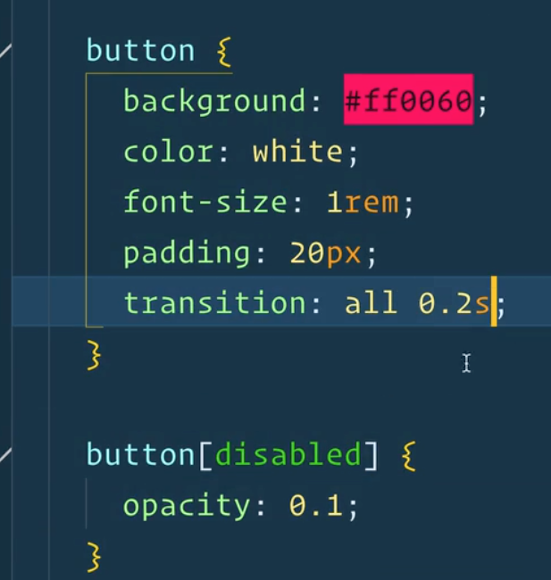 16:48

Wes has also put a transition on the button of two seconds so it fades in once you hit it. 

Add a log after you disable the button, like so 👇

```js
if(payload[0].intersectionRatio === 1){
  button.disabled = false;
  console.log('REMOVING DISABLED');
}
```

Now if you scroll to the bottom, you will see it runs. 

But if you scroll back up and down a couple of times it keeps getting triggered. 

That is good for some use cases. 

Let's demonstrate by modifying the CSS like so 👇

```css
button {
  background: #ff0060;
  color: white;
  font-size: 1rem;
  padding: 20px;
  transition: all 0.2s;
}

button[disabled] {
  opacity: 0.1;
  transform: translateX(-200%) scale(0.5);
}
```

 17:39

Add an if statement to disable the button when it's not fully scrolled. 

```js
function obCallback(payload){
   if(payload[0].intersectionRatio === 1){
     button.disabled = false;
     console.log('REMOVING DISABLED');
   }
   else {
     button.disabled = true;
   }
 }
```

That might be what you want. 

But in our case once it is accepted, we don't care so we will stop observing the button. 

```js
function obCallback(payload){
  if(payload[0].intersectionRatio === 1){
    button.disabled = false;
    //stop observing the button  
    ob.unobserve(terms.lastElementChild);
  }
```

That will stop it from doing any unnecessary work. 

That is scroll to accept. 

You don't see the observer pattern too much. 

The only 2 ways currently in the browser is `IntersectionObserver` which tells you when something is currently scrolled into view, and another one called `ResizeObserver` which will tell you when an element is resized. 

That concludes this lesson! 

---

## 36 -Tabs

 00:10

In this example we are going to build tabs. 

Tabs are pretty simple, you click on the tab you want and it shows the content associated with it.

In this example we will practice showing/hiding things, event listeners, looping before we even learn and wee will learn how to make it accessible. 

The user should be able to use their keyboard to move between tabs without touching mouse. 

Let's start by looking at the HTML we will be working with. 

```html
<body>
  <div class="wrapper">
    <div class="tabs">
      <div role="tablist" aria-label="Programming Languages">
        <button role="tab" aria-selected="true" id="js">
          JavaScript
        </button>
        <button role="tab" aria-selected="false" id="ruby">Ruby
        </button>
        <button role="tab" aria-selected="false" id="php">
          PHP
        </button>
      </div>
      <div role="tabpanel" aria-labelledby="js">
        <p>JavaScript is great!</p>
      </div>
      <div role="tabpanel" aria-labelledby="ruby" hidden>
        <p>Ruby is great</p>
      </div>
      <div role="tabpanel" aria-labelledby="php" hidden>
        <p>PHP is great!</p>
      </div>
    </div>
  </div>
  <script src="./tabs.js"></script>
</body>
```

We have a wrapper div with a class of "tabs" and nested within div is another div but this one has a role of `tablist`

You will notice a lot of role and aria labels in the HTML and that is important because it is how you make your tabs accessible to everyone and that search engines can easily read it. 

When you use proper markup, it is good for both **accessibility** and **SEO**. 

We tell the browser that the div is a tab list using the `role="tablist"` attribute. 

That div also has an `aria-label="Programming languages"` attribute. That is for screen readers to know what the list is about.

Inside of the `tablist` there are 3 buttons. Each of those buttons has a role of tab and an id that contains the name of the programming language.

One of the buttons also has an `aria-select="true"` attribute. 

That is how you are going to maintain whether the tab is currently active. 

If you take a look at our `tabs-style.css` you will see that whenever a button has an attribute of aria-selected we change the background color, the text color and remove the box shadow. 👇

```css
button[aria-selected="true"] {
  background: var(--yellow);
  box-shadow: none;
  color: rgba(0,0,0,0.7);
}
```

You don't have to worry about where to put the tabs and buttons because they are sort of clicked together by the `id` and the `aria-labelledby` of the actual tab panel. 


Further down in the HTML we have each all of our different tab panels. 

```html
<div role="tabpanel" aria-labelledby="js">
    <p>JavaScript is great!</p>
  </div>
  <div role="tabpanel" aria-labelledby="ruby" hidden>
    <p>Ruby is great</p>
  </div>
  <div role="tabpanel" aria-labelledby="php" hidden>
    <p>PHP is great!</p>
  </div>
</div>
```
   
We can associate a tab panel with a specific button by giving it an `aria-labelledby`. 

That is just descriptions, this aria-labels we are adding is not giving us any sort of functionality. It is just a good way to describe markup in the browser. 

Npw you can apply an attribute of `hidden` to the non-selected tab. 

The `hidden` attribute is great because you don't have to write any CSS classes to hide it. You just pop that attribute on or off and it will show and hide it. 

Our default state is to show the first tab button as selected and to show the first tab panel content. 

Let's start writing the code, beginning with selecting:
- the tabs div
- the tab buttons
- the tab panels. 

To grab the tab buttons, you will look inside of tabs instead of the document because you may have more than one set of tabs on the page, so you should write Javascript to support that.

```js
const tabs = document.querySelector('.tabs');
const tabButtons = tabs.querySelectorAll('[role="tab"]');
const tabPanels = tabs.querySelectorAll('[role="tab"]');
```

Next, loop over the buttons using a `foreach` and add a click event listener to each. 

Because they are buttons, the click event will fire when you use the keyboard as well so there is no extra keyboard work you need to do.  

Pass it a function `handleTabClick`, like so 👇

```js
const tabs = document.querySelector('.tabs');
const tabButtons = tabs.querySelectorAll('[role="tab"]');
const tabPanels = tabs.querySelectorAll('[role="tab"]');

tabButtons.forEach(button => button.addEventListener('click', handleTabClick));
```

Add the `handleTabClick` function, like so 👇

```js
const tabs = document.querySelector('.tabs');
const tabButtons = tabs.querySelectorAll('[role="tab"]');
const tabPanels = tabs.querySelectorAll('[role="tab"]');

function handleTabClick(event){
  console.log(event);
}

tabButtons.forEach(button => button.addEventListener('click', handleTabClick));
```

Now when you click on one of the tabs it gives you the event. 

If you logged `event.currentTarget` and then clicked different tabs, you would see each of the buttons logged.

 5:40

Now let's get into looping which you haven't learned yet but it's good to preview it before you hit the looping lesson and to see some examples of where you might use it in real life. 

When somebody clicks a tab, the first thing you need to do is hide all the other tabs and mark them as unselected. 

Then you have to mark the clicked tab as `selected`, and then find the associated `tabPanel` and show it. 

Let's add all those steps as **pseudocode**, which is just putting into words what you are trying to do so you can grasp the steps that need to happen when someone clicks it.

We will go one by one and write the code for it. 

```js
function handleTabClick(event){
  // hide all tab panels
  // mark all tabs as unselected
  // mark the clicked tab as selected
  // find the associated tabPanel and show it!
}
```

We have already selected all the tab panels at the top of our file. 

If you were to log them within the  `handleTabClick` event, you would get a node list with the 2 divs. 

 7:21

The tab panels are getting hidden by the `hidden` attribute. 

What you can do is loop over each of them using `.forEach` and for each item hide it, like so 👇

```js
tabPanels.forEach(function(panel){
  console.log(panel);
})
```

That code will take the node list of the 3 panels, loop over each one, and for each item, you get a variable called `panel`, which is how you reference each instance. Log it. 

If you click on one tab, you get 3 separate console logs of each of them. 

 8:11

Modify the code like so to set each panel to hidden. 👇

```js
tabPanels.forEach(function(panel){
  panel.hidden = true;
})
```

As soon as you click on any tab, all the panels turn to hidden.  

 9:08

To refactor that to an arrow function, you would simply modify the code like so 👇

```js
tabPanels.forEach(panel => { 
  panel.hidden = true;
});
```

_Note: you could have made that arrow function a one liner but it's better to make your function as readable as possible rather than try to make them as short._

In a future step, you will go back and show one of those `tabPanels`. 

You could just filter out the selected `tabPanel` when hiding them, but in Wes' experience it is much easier to just hide them all and then show the one that we want. 

 10:19

The next step is to take the tabs and mark them all as unselected. 

As you can see, we are using the `aria-selected` attribute to set whether it is selected or not. 

So how do you set that? Would  `tab.aria-selected = false` work? 

 10:32

It does not, because you can't put dashes in it. 

So how do we access a property when the property has a dash in it? 

If you go to the HTML page, click on one of the buttons in the Elements tab of the dev tools, then flip to the console and use our $0 trick, you can access it like so 👇 

```js
$0.ariaSelected
```

Anytime that you see an attribute with a dash on an HTML element, you can almost always access that with the camel cased version of that. 

Let's try that. 

```js
tabButtons.forEach(tab => { 
  tab.ariaSelected = false;
});
```

If you refresh the page does that work? 

No. You will see a tab is still selected. 

 11:43

If you click on the Javascript button which still looks selected, and flip to the console and do `$0.ariaSelected`, it will return false.

 11:51

So why is it not updating? 

If you flip back to the elements tab, you will see the attribute value equals true. It never updated.  What happened!? 

What happened is that with most properties in javascript, you can just access the property on the element directly. 

However for some properties, including custom properties that you just made up, as well as `aria` properties, it looks like you cannot use that method.

The only other way is to use the `.setAttribute()` method.

Wes looked at some docs and for `aria` properties, you should always use the `setAttribute` and `getAttribute` method on the element instead of on the property. 

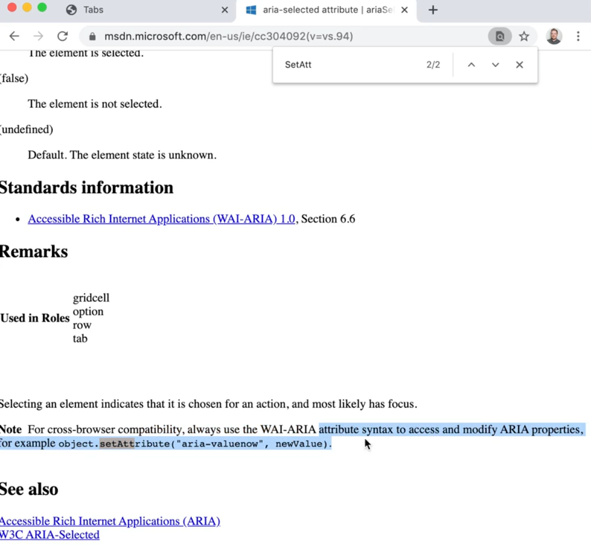 12:40

So some properties like `.alt` or `.src` or `.title`, those things can be done via properties on the element, but not for aria attributes.

Modify the code like so 👇

```js
function handleTabClick(event) {
  // hide all tab panels
  tabPanels.forEach(panel => {
    panel.hidden = true;
  });
  // mark all tabs as unselected
  tabButtons.forEach(tab => {
    // tab.ariaSelected = false;
    tab.setAttribute('aria-selected', false);
  });
```

If you were to refresh the page and click one of the tabs, all the tabs will no longer be selected. 

 13:24

Now, mark the clicked tab as selected. 

```js
event.currentTarget.setAttribute('aria-selected', true);
```

When you click one, you will see it will set and remove the aria selected. 

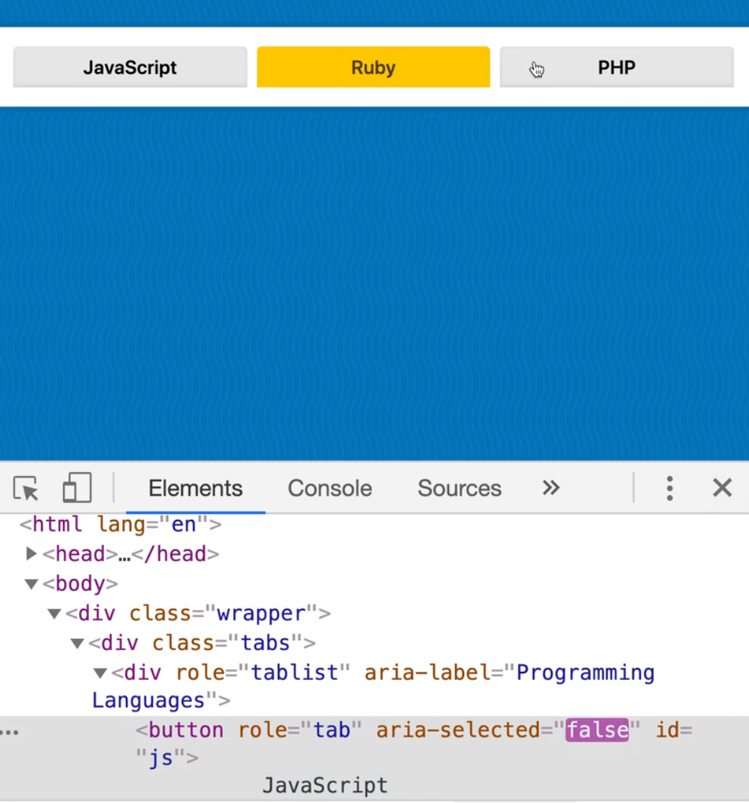 14:01

You might have noticed that we are not using any classes here and the reason for that is if you can reach for an accessibility attribute over a class then do that so you can kill 2 birds with one stone. 

Next, you need to find the associated tab panel and show it. 

They are associated using the button `id` and `aria-labelledby` attribute of the tab panel. 

So if someone clicks on the button below, we need to find the tabPanel with `aria-labelledby="js"` attribute value. 👇

```html
<button role="tab" aria-selected="true" id="js">
  JavaScript
</button>
```

You could do this a couple of ways. 

First grab that id. 

```js
const id = event.currentTarget.id;
``` 

You might notice that when you save the code, the editor modifies that line like so 👇

```js
const { id } = event.currentTarget;
```

That is because instead of saving the variable the same as the property on something, you can destructure it to create an `id` variable from that thing. 

That is handy if you ever want to pull other properties like an `alt` or a `src`. 

```js
function handleTabClick(event) {
  // hide all tab panels
  tabPanels.forEach(panel => {
    panel.hidden = true;
  });
  // mark all tabs as unselected
  tabButtons.forEach(tab => {
    // tab.ariaSelected = false;
    tab.setAttribute('aria-selected', false);
  });
  // mark the cli cked tab as selected
  event.currentTarget.setAttribute('aria-selected', true);
  // find the associated tabPanel and show it!
  const { id } = event.currentTarget;
```

Now you need to find the associate tab panel. 

There are a couple of ways you can do that. 

You can simply use the id in a selector. 

```js
const tabPanel = tabs.querySelector(`[aria-labelledby="${id}"]`);
console.log(tabPanel);
tabPanel.hidden = false;
```

If you refresh the page, you will see that works. 

Comment that code out and try another method, this time using `find()`. 

### Converting a NodeList to an Array

Take the `tabPanels` and just loop over it until you find the one you want. 

If you added the following code, would it work? 

```js
tabPanels.find()
```

 18:36

No, it does not. 

Why not? 

That is because the `.find()` method is only a method on arrays. 


If you recall from when we logged `tabPanels`, it is not an array, it is a NodeList, and it doesn't have all of those array methods.

 18:58

You can convert the NodeList into an array by wrapping it in `Array.from()` like so 👇

```js
const tabPanels = Array.from(tabs.querySelectorAll('[role="tabpanel"]'));
```

Now using the find, you can check for each of them whether the `aria-labelledby` attribute equals the id.

```js
const tabPanel = tabPanels.find((panel) => {
  if (panel.getAttribute("aria-labelledby") === id) {
    return true;
  }
});
```

You can actually refactor that to use an implicit return to return the outcome of the condition. 

```js
console.log(tabPanels);
const tabPanel = tabPanels.find(
  panel => panel.getAttribute('aria-labelledby') === id
);
console.log(tabPanel);
```

So what you did is you used find to find the tabPanel that matches the id we passed and you stored the result in a variable called `tabPanel`.

Now when you click on a tab, you will see the associated panel. 

 21:07

Replace the log with `tabPanel.hidden = false;` so it is no longer hidden.

Now your tabs should be working! 

Both those methods are valid, it's up to you which you prefer. 
